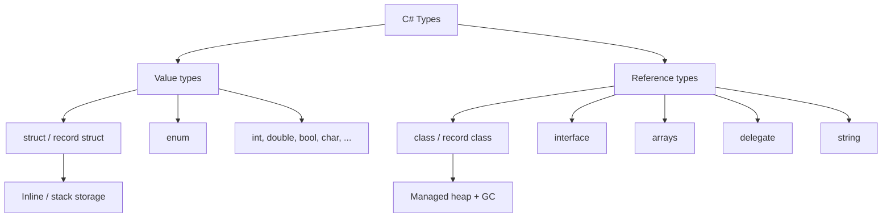
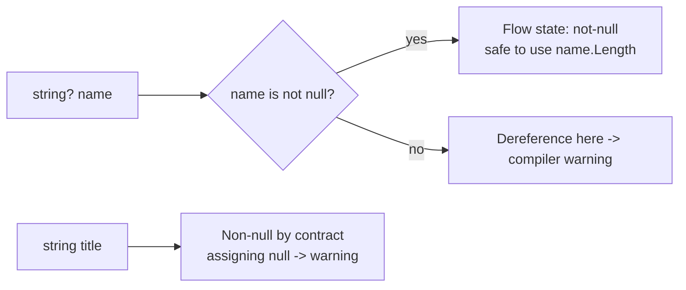
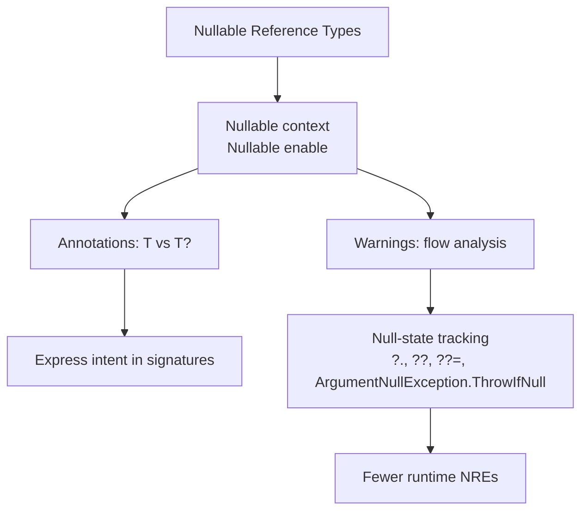
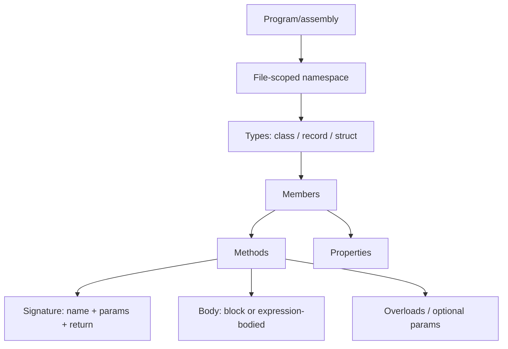

# C# 13 and .NET 9 - Complete Professional Guide

> **Category:** 01_programming_languages · **Language:** English

---

### Types, OOP, Records, LINQ, async/await, Generics, ASP.NET Core overview
**Edition for C# 13 on .NET 9**

> **Reference book (English).** A professional, in-depth guide to the C# 13 language running on the .NET 9 runtime — for developers, architects, and teams building production software on Microsoft's modern stack. Based on the official Microsoft Learn documentation (learn.microsoft.com/dotnet), the C# language specification, and the .NET 9 release notes.
>
> **Scope notice:** this book covers the **C# 13 language** and the **.NET 9 platform** together, from value/reference semantics through async, generics, LINQ, and an overview of the application frameworks (ASP.NET Core, EF Core) most teams build on. Each chapter follows the TO-BRAIN editorial standard (see `FILE_CONVENTIONS.md`).

---

## How to read this book

Progressive depth across five maturity levels:

| Level | Profile | Parts |
|-------|---------|-------|
| 1 — Beginner | New to C#/.NET | Part I |
| 2 — Intermediate | OOP, records, collections | Parts II–IV |
| 3 — Advanced | LINQ, delegates, async | Parts V–VI |
| 4 — Specialist | Errors, nullable, spans, runtime | Part VII |
| 5 — Enterprise | DI, ASP.NET Core, EF Core, testing, perf, AOT | Part VIII |

**Target audience:** backend and full-stack developers, software architects, platform engineers, tech leads, and CTOs adopting or deepening their use of C# 13 and .NET 9.

**Structure of each chapter:** Introduction · Business context · Theoretical concepts · Architecture · Diagrams (Mermaid) · Real examples · Step by step · Complete code · Exercises · Challenges · Checklist · Best practices · Anti-patterns · Troubleshooting · Official references.

**Example format:** Scenario · Problem · Solution · Implementation · Result · Future improvements.

> **Note on prerequisites.** This book assumes general programming literacy (variables, loops, functions, basic OOP). All code uses idiomatic modern C# 13: file-scoped namespaces, top-level statements where appropriate, records, and **nullable reference types enabled** (`<Nullable>enable</Nullable>`).

---

## Table of Contents

**Part I – Foundations: Types & Syntax**
1. The C# type system — value vs reference types
2. Variables, nullable reference types, and `var`/`const`
3. Methods, parameters, and the structure of a program

**Part II – Object-Oriented Programming**
4. Classes, fields, constructors, and properties
5. Inheritance, abstract classes, and polymorphism
6. Interfaces, default implementations, and composition

**Part III – Records & Pattern Matching**
7. Records, `init` setters, and value equality
8. Pattern matching, `switch` expressions, and deconstruction

**Part IV – Collections & Generics**
9. Arrays, `List<T>`, dictionaries, and collection expressions
10. Generics: type parameters, constraints, and variance

**Part V – LINQ & Functional Constructs**
11. LINQ to objects — query and method syntax
12. Delegates, events, lambdas, and expression trees

**Part VI – Asynchronous Programming**
13. `async`/`await`, `Task`, and `ValueTask`
14. Cancellation, `IAsyncEnumerable`, and parallelism

**Part VII – Robust Code: Errors, Nullable, Spans**
15. Exceptions and error-handling strategy
16. Nullable analysis, `Span<T>`, and `Memory<T>`

**Part VIII – The .NET Platform & Frameworks**
17. The .NET runtime, SDK, NuGet, and project structure
18. Dependency injection and configuration
19. ASP.NET Core minimal APIs — overview
20. EF Core overview, testing (xUnit), performance, and publishing/AOT

> **Status of this edition:** phased delivery (each part keeps the same depth standard). **Ready:** Part I (Ch. 1–3). **In progress:** Parts II–VIII.

---

## Part I – Foundations: Types & Syntax

Part I establishes the bedrock every later chapter builds on: how C# classifies data into **value types** and **reference types**, how **nullable reference types** make null-safety a compile-time concern, and how a C# 13 program is structured with file-scoped namespaces and top-level statements. Get these three chapters right and the rest of the language — OOP, generics, LINQ, async — slots cleanly into place.

---

## Chapter 1 — The C# type system — value vs reference types

### 1.1 Introduction

C# is a **statically typed**, object-oriented language compiled to Intermediate Language (IL) and executed by the .NET runtime. Every value in a C# program has a type known at compile time, and that type determines two things that matter enormously in practice: **how the value is stored and copied** (value semantics vs reference semantics) and **what operations are legal** on it. This chapter explains the foundational split between value types (`struct`, `enum`, primitives) and reference types (`class`, `record`, `interface`, arrays, delegates), and why the distinction governs performance, equality, and mutation behavior.

### 1.2 Business context

The value/reference distinction is not academic — it is the root cause of a large share of real defects and performance issues. A team that passes a large `struct` by value into a hot loop pays copying costs on every call; a team that assumes a `class` is copied when it is actually shared mutates shared state by accident. Understanding the type system lets engineers reason about memory, aliasing, and equality up front, which directly reduces debugging time and production incidents. For architects, it informs API design: whether a domain concept should be an immutable value (`readonly record struct`) or a shared entity (`class`).

### 1.3 Theoretical concepts

A **value type** holds its data directly. Assigning it copies the data; two variables never share storage. A **reference type** holds a reference (a managed pointer) to data on the heap. Assigning it copies the reference, so two variables can point at the same object.

```mermaid
flowchart TB
    subgraph Value["Value type (struct)"]
        a[Point a = (1,2)] --> da[1, 2]
        b["Point b = a (copy)"] --> db[1, 2]
    end
    subgraph Reference["Reference type (class)"]
        c[Person c] --> obj[Heap object name=Ann]
        d["Person d = c"] --> obj
    end
```

Key consequences: value types are stored inline (often on the stack or inside their containing object) and have **value equality by default** for `record struct`; reference types live on the managed heap, are garbage-collected, and have **reference equality by default** for `class`. The special reference type `string` is immutable, which makes it behave value-like in everyday use.

### 1.4 Architecture



### 1.5 Real example

**Scenario.** A logistics service computes distances between many coordinates in a tight loop and reports unexpected memory pressure and slow throughput.

**Problem.** Coordinates were modeled as a `class`, so every coordinate created a heap allocation; millions of short-lived objects pressured the garbage collector.

**Solution.** Model the coordinate as a small immutable **`readonly record struct`** so instances are value types stored inline, with value equality for free and no per-instance heap allocation.

**Implementation (real C# 13 code):**

```csharp
namespace Logistics.Geo;

// Value type: stored inline, copied by value, value equality for free.
public readonly record struct Coordinate(double Latitude, double Longitude)
{
    public double DistanceTo(Coordinate other)
    {
        const double earthRadiusKm = 6371.0;
        double dLat = DegreesToRadians(other.Latitude - Latitude);
        double dLon = DegreesToRadians(other.Longitude - Longitude);
        double a = Math.Sin(dLat / 2) * Math.Sin(dLat / 2)
                 + Math.Cos(DegreesToRadians(Latitude))
                 * Math.Cos(DegreesToRadians(other.Latitude))
                 * Math.Sin(dLon / 2) * Math.Sin(dLon / 2);
        return earthRadiusKm * 2 * Math.Asin(Math.Sqrt(a));
    }

    private static double DegreesToRadians(double degrees) => degrees * Math.PI / 180.0;
}

public static class Demo
{
    public static double TotalRoute(ReadOnlySpan<Coordinate> stops)
    {
        double total = 0;
        for (int i = 1; i < stops.Length; i++)
            total += stops[i - 1].DistanceTo(stops[i]);
        return total;
    }
}
```

**Result.** Allocations in the hot loop drop to near zero, GC pressure disappears, and equality comparisons (`a == b`) work as expected because `record struct` generates value-based equality.

**Future improvements.** Profile whether the struct is large enough that copying outweighs allocation savings; if so, pass by `in` reference. Consider SIMD with `System.Numerics.Vector` for batch distance calculations.

### 1.6 Exercises

1. Declare a `record struct` `Money(decimal Amount, string Currency)` and explain why it is a value type.
2. Given two `class` variables assigned to each other, predict whether mutating one affects the other, and why.
3. List three built-in value types and three reference types.

### 1.7 Challenges

- **Challenge.** Take a `class`-based small domain type from an existing project, convert it to a `readonly record struct`, and measure allocation/GC differences with a benchmark before and after.

### 1.8 Checklist

- [ ] I can state how value types and reference types differ in storage and copying.
- [ ] I know which default equality each category uses.
- [ ] I can choose `struct` vs `class` for a given domain concept.
- [ ] I understand why `string` behaves value-like despite being a reference type.

### 1.9 Best practices

- Prefer small **immutable value types** (`readonly record struct`) for value-like concepts (money, coordinates, identifiers).
- Use `class` for entities with identity and shared, mutable lifecycle.
- Keep `struct` types small; large structs are expensive to copy.

### 1.10 Anti-patterns

- Large mutable `struct` types passed by value through hot paths (hidden copy cost).
- Assuming `class` instances are copied on assignment (accidental shared mutation).
- Comparing reference types with `==` expecting value equality when none is defined.

### 1.11 Troubleshooting

| Symptom | Likely cause | Action |
|---------|--------------|--------|
| Two variables change together unexpectedly | Reference type aliasing | Copy explicitly or use an immutable type |
| `==` returns false for "equal" objects | Reference equality on a `class` | Implement value equality or use a `record` |
| High GC / allocation in hot loop | Small data modeled as `class` | Convert to `readonly record struct` |
| Mutating a `struct` "does nothing" | Mutating a copy, not the original | Reassign the value or use a reference (`ref`) |

### 1.12 Official references

- Types overview (C# language): https://learn.microsoft.com/dotnet/csharp/fundamentals/types/
- Value types: https://learn.microsoft.com/dotnet/csharp/language-reference/builtin-types/value-types
- Reference types: https://learn.microsoft.com/dotnet/csharp/language-reference/keywords/reference-types
- Records and `record struct`: https://learn.microsoft.com/dotnet/csharp/language-reference/builtin-types/record

---

## Chapter 2 — Variables, nullable reference types, and `var`/`const`

### 2.1 Introduction

A variable binds a name to a typed storage location. In modern C# the most consequential decision around variables is **nullability**: with **nullable reference types** enabled, the compiler tracks whether a reference may be `null` and warns you before a `NullReferenceException` can occur at runtime. This chapter covers declaration forms (`var`, explicit types, `const`), default values, and the nullable annotation context that all later code in this book assumes.

### 2.2 Business context

The `NullReferenceException` has been called "the billion-dollar mistake." Nullable reference types turn an entire class of runtime crashes into compile-time warnings, shifting defect discovery left where fixes are cheap. For teams, enabling nullable analysis project-wide is one of the highest-leverage quality investments available: it documents intent (`string?` vs `string`), catches missing null checks in review, and makes refactoring safer.

### 2.3 Theoretical concepts

With `<Nullable>enable</Nullable>`, every reference type is **non-nullable by default**. A type written `string` is a promise it will not be null; `string?` declares it may be. The compiler performs **flow analysis** to know when a nullable value has been checked and is therefore safe to dereference.



`var` infers a variable's type from its initializer (the variable is still statically typed). `const` declares a compile-time constant; `readonly` declares a value set once at construction time.

### 2.4 Architecture



### 2.5 Real example

**Scenario.** An order service occasionally crashes with `NullReferenceException` when a customer has no shipping address on file.

**Problem.** The address field was modeled as a non-nullable `string`, but the data layer could return null; the crash only surfaced in production with certain records.

**Solution.** Model optionality honestly with `string?`, let the compiler enforce checks, and use null-handling operators plus a guard helper for required arguments.

**Implementation (real C# 13 code):**

```csharp
namespace Ordering;

public sealed class Customer
{
    public required string Name { get; init; }
    public string? ShippingAddress { get; init; } // explicitly optional
}

public static class ShippingLabel
{
    public static string Build(Customer customer)
    {
        ArgumentNullException.ThrowIfNull(customer);

        // Non-null by contract: Name cannot be null here.
        string recipient = customer.Name;

        // Optional: handle the null case explicitly.
        string address = customer.ShippingAddress ?? "ADDRESS REQUIRED";

        // Null-conditional with a fallback length.
        int addressLength = customer.ShippingAddress?.Length ?? 0;

        return $"{recipient}\n{address}\n(chars: {addressLength})";
    }
}
```

**Result.** The compiler forces every access to `ShippingAddress` through a null check, eliminating the crash class. Required state is guaranteed via `required` and `ArgumentNullException.ThrowIfNull`.

**Future improvements.** Introduce a domain `Address` value object instead of a raw string; consider the null-object pattern for absent addresses to remove the sentinel string.

### 2.6 Exercises

1. Enable nullable reference types in a project and resolve the first three warnings.
2. Rewrite a method that returns `null` to declare its return type as `T?` and explain the signature change.
3. Replace a manual `if (x == null) throw ...` with `ArgumentNullException.ThrowIfNull`.

### 2.7 Challenges

- **Challenge.** Audit a module for missing nullability annotations; convert it to a fully annotated, warning-free state and document any places where `null!` (the null-forgiving operator) was unavoidable and why.

### 2.8 Checklist

- [ ] Nullable reference types are enabled project-wide.
- [ ] Optional references are declared `T?`; required ones are non-nullable.
- [ ] I use `?.`, `??`, and `??=` instead of manual null branches where natural.
- [ ] Required members use `required` and/or guard clauses.

### 2.9 Best practices

- Enable nullable at the **project** level, not file by file, for consistency.
- Treat nullable warnings as errors in CI to prevent regressions.
- Reserve the null-forgiving operator `!` for cases the compiler cannot prove safe, and comment why.

### 2.10 Anti-patterns

- Sprinkling `!` everywhere to silence warnings instead of fixing the underlying nullability.
- Declaring everything `T?` "to be safe," which throws away the compiler's guarantees.
- Disabling nullable in legacy files indefinitely instead of migrating incrementally.

### 2.11 Troubleshooting

| Symptom | Cause | Action |
|---------|-------|--------|
| "Dereference of a possibly null reference" warning | Value not proven non-null on this path | Add a null check or use `?.`/`??` |
| `NullReferenceException` still at runtime | Nullable not enabled, or `!` used to bypass | Enable nullable; remove the `!` and fix the cause |
| "Non-nullable property must contain a value" | Required member not initialized | Add `required` or initialize in the constructor |
| Excessive warnings on legacy code | Whole project turned on at once | Migrate per-file with `#nullable enable` |

### 2.12 Official references

- Nullable reference types: https://learn.microsoft.com/dotnet/csharp/nullable-references
- Nullable context and annotations: https://learn.microsoft.com/dotnet/csharp/language-reference/builtin-types/nullable-reference-types
- `var` (implicitly typed locals): https://learn.microsoft.com/dotnet/csharp/language-reference/statements/declarations
- `required` members: https://learn.microsoft.com/dotnet/csharp/language-reference/keywords/required

---

## Chapter 3 — Methods, parameters, and the structure of a program

### 3.1 Introduction

A C# program is organized into namespaces and types, and behavior lives in **methods**. C# 13 favors a concise structure: **file-scoped namespaces** (one `namespace X;` line instead of a wrapping brace block) and **top-level statements** that let a program's entry point be written without ceremony. This chapter covers how programs start, how methods declare parameters (positional, optional, `params`, `ref`/`out`/`in`), and how expression-bodied members keep code compact.

### 3.2 Business context

Readable, well-factored methods are the unit of maintainability. Clear parameter contracts (what is required, what is optional, what is passed by reference) reduce misuse and review friction. The modern structural conveniences — file-scoped namespaces, top-level statements — reduce nesting and boilerplate, which lowers the cognitive cost of reading code and onboarding new developers, a concrete productivity gain across a codebase.

### 3.3 Theoretical concepts

The **entry point** of an executable is conceptually `static Main`. With **top-level statements**, you write the entry-point body directly in one file and the compiler synthesizes `Main`. Methods accept parameters by value by default; modifiers change this: `ref` passes a reference (read/write), `out` requires the method to assign it, `in` passes a read-only reference (efficient for large structs), and `params` accepts a variable number of arguments.

```mermaid
flowchart TB
    start([Program start]) --> tls[Top-level statements -> synthesized Main]
    tls --> call[Call methods]
    call --> params[Parameter passing]
    params --> byval[by value default]
    params --> byref[ref: read/write]
    params --> out[out: must assign]
    params --> inp[in: read-only ref]
    params --> variadic[params: variable count]
```

### 3.4 Architecture



### 3.5 Real example

**Scenario.** A small command-line tool needs to parse arguments, compute a result, and exit with a status code — without a large class scaffold.

**Problem.** Boilerplate (`Program` class, `static Main`, namespace braces) obscures the tool's tiny logic and slows iteration.

**Solution.** Use top-level statements for the entry point and a file-scoped namespace for a small helper type, demonstrating optional parameters, `params`, and `out`.

**Implementation (real C# 13 code):**

```csharp
// Program.cs — top-level statements form the entry point.
using PriceTools;

string[] cli = args.Length > 0 ? args : ["19.99", "tax", "0.08"];

if (!Calculator.TryParsePrice(cli[0], out decimal price))
{
    Console.Error.WriteLine("Invalid price.");
    return 1; // exit code
}

decimal rate = cli is [_, "tax", var r] && decimal.TryParse(r, out var parsed) ? parsed : 0m;
decimal total = Calculator.WithTax(price, rate);

Console.WriteLine($"Total: {total:C}");
return 0;
```

```csharp
// Calculator.cs
namespace PriceTools; // file-scoped namespace

public static class Calculator
{
    // Optional parameter + expression-bodied method.
    public static decimal WithTax(decimal price, decimal rate = 0.0m) => price * (1 + rate);

    // 'out' parameter: the method must assign it.
    public static bool TryParsePrice(string input, out decimal price) =>
        decimal.TryParse(input, out price) && price >= 0;

    // 'params' collection: variable number of arguments.
    public static decimal Sum(params ReadOnlySpan<decimal> values)
    {
        decimal total = 0;
        foreach (decimal v in values) total += v;
        return total;
    }
}
```

**Result.** The tool's logic is immediately visible; the entry point is a few lines, parameter contracts are explicit (`out` for try-parse, `params` for sums), and the exit code communicates success or failure to the shell.

**Future improvements.** Adopt a dedicated argument parser (e.g., `System.CommandLine`) as the tool grows; add unit tests around `Calculator` (Part VIII).

### 3.6 Exercises

1. Convert a classic `static void Main(string[] args)` program to top-level statements.
2. Write a method using an `out` parameter and call it with the inline `out var` form.
3. Create an overloaded method and an equivalent single method with an optional parameter; discuss the trade-off.

### 3.7 Challenges

- **Challenge.** Implement a `params ReadOnlySpan<T>` method and benchmark it against a `params T[]` version to observe the allocation difference C# 13 enables.

### 3.8 Checklist

- [ ] I use file-scoped namespaces for new files.
- [ ] I understand when top-level statements are appropriate (entry point) vs full classes.
- [ ] I can choose between `ref`, `out`, `in`, and by-value correctly.
- [ ] I use expression-bodied members for one-line logic.

### 3.9 Best practices

- Keep methods short and single-purpose; prefer clear names over comments.
- Use `out`-based `TryParse`/`TryGet` patterns instead of throwing for expected failures.
- Prefer optional parameters or overloads to communicate sensible defaults explicitly.

### 3.10 Anti-patterns

- Overusing `ref`/`out` where a return value or tuple would be clearer.
- Top-level statements stuffed with hundreds of lines of logic instead of factored types.
- Long parameter lists; group related parameters into a `record` instead.

### 3.11 Troubleshooting

| Symptom | Cause | Action |
|---------|-------|--------|
| "Only one compilation unit can have top-level statements" | Two files with top-level statements | Keep entry-point code in a single file |
| "Use of unassigned out parameter" | `out` not set on every path | Assign the `out` parameter before every `return` |
| Ambiguous call between overloads | Overloads too similar | Disambiguate types or remove redundant overloads |
| Unexpected default used | Optional parameter omitted at call site | Pass the argument explicitly or name it |

### 3.12 Official references

- Top-level statements: https://learn.microsoft.com/dotnet/csharp/fundamentals/program-structure/top-level-statements
- File-scoped namespaces: https://learn.microsoft.com/dotnet/csharp/language-reference/keywords/namespace
- Methods and parameters: https://learn.microsoft.com/dotnet/csharp/programming-guide/classes-and-structs/methods
- `params` collections (C# 13): https://learn.microsoft.com/dotnet/csharp/whats-new/csharp-13

---

> **End of Part I.** You now have the foundations of C# 13 on .NET 9: the value/reference type split that governs storage, copying, and equality (Chapter 1); nullable reference types and the variable/`const`/`var` mechanics that make null-safety a compile-time concern (Chapter 2); and the program structure, method, and parameter-passing model — file-scoped namespaces, top-level statements, `ref`/`out`/`in`/`params` (Chapter 3). **Part II — Object-Oriented Programming** (Chapters 4–6) builds on these to cover classes, constructors, properties, inheritance, polymorphism, and interfaces.

<!--APPEND-PART-II-->
