# C# 13 and .NET 9 - Complete Professional Guide

> **Category:** 01_programming_languages · **Language:** English

---

### Types, OOP, Records, LINQ, async/await, Generics, ASP.NET Core overview
**Edition for C# 13 on .NET 9**

> **Reference book (English).** A professional, in-depth guide to the C# 13 language running on the .NET 9 runtime — for developers, architects, and teams building production software on Microsoft's modern stack. Based on the official Microsoft Learn documentation (learn.microsoft.com/dotnet), the C# language specification, and the .NET 9 release notes.
>
> **Scope notice:** this book covers the **C# 13 language** and the **.NET 9 platform** together, from value/reference semantics through async, generics, LINQ, and an overview of the application frameworks (ASP.NET Core, EF Core) most teams build on. Each chapter follows the TO-BRAIN editorial standard (see `FILE_CONVENTIONS.md`).

---

## How to read this book

Progressive depth across five maturity levels:

| Level | Profile | Parts |
|-------|---------|-------|
| 1 — Beginner | New to C#/.NET | Part I |
| 2 — Intermediate | OOP, records, collections | Parts II–IV |
| 3 — Advanced | LINQ, delegates, async | Parts V–VI |
| 4 — Specialist | Errors, nullable, spans, runtime | Part VII |
| 5 — Enterprise | DI, ASP.NET Core, EF Core, testing, perf, AOT | Part VIII |

**Target audience:** backend and full-stack developers, software architects, platform engineers, tech leads, and CTOs adopting or deepening their use of C# 13 and .NET 9.

**Structure of each chapter:** Introduction · Business context · Theoretical concepts · Architecture · Diagrams (Mermaid) · Real examples · Step by step · Complete code · Exercises · Challenges · Checklist · Best practices · Anti-patterns · Troubleshooting · Official references.

**Example format:** Scenario · Problem · Solution · Implementation · Result · Future improvements.

> **Note on prerequisites.** This book assumes general programming literacy (variables, loops, functions, basic OOP). All code uses idiomatic modern C# 13: file-scoped namespaces, top-level statements where appropriate, records, and **nullable reference types enabled** (`<Nullable>enable</Nullable>`).

---

## Table of Contents

**Part I – Foundations: Types & Syntax**
1. The C# type system — value vs reference types
2. Variables, nullable reference types, and `var`/`const`
3. Methods, parameters, and the structure of a program

**Part II – Object-Oriented Programming**
4. Classes, fields, constructors, and properties
5. Inheritance, abstract classes, and polymorphism
6. Interfaces, default implementations, and composition

**Part III – Records & Pattern Matching**
7. Records, `init` setters, and value equality
8. Pattern matching, `switch` expressions, and deconstruction

**Part IV – Collections & Generics**
9. Arrays, `List<T>`, dictionaries, and collection expressions
10. Generics: type parameters, constraints, and variance

**Part V – LINQ & Functional Constructs**
11. LINQ to objects — query and method syntax
12. Delegates, events, lambdas, and expression trees

**Part VI – Asynchronous Programming**
13. `async`/`await`, `Task`, and `ValueTask`
14. Cancellation, `IAsyncEnumerable`, and parallelism

**Part VII – Robust Code: Errors, Nullable, Spans**
15. Exceptions and error-handling strategy
16. Nullable analysis, `Span<T>`, and `Memory<T>`

**Part VIII – The .NET Platform & Frameworks**
17. The .NET runtime, SDK, NuGet, and project structure
18. Dependency injection and configuration
19. ASP.NET Core minimal APIs — overview
20. EF Core overview, testing (xUnit), performance, and publishing/AOT

> **Status of this edition:** phased delivery (each part keeps the same depth standard). **Ready:** Parts I–IV (Ch. 1–10). **In progress:** Parts V–VIII.

---

## Part I – Foundations: Types & Syntax

Part I establishes the bedrock every later chapter builds on: how C# classifies data into **value types** and **reference types**, how **nullable reference types** make null-safety a compile-time concern, and how a C# 13 program is structured with file-scoped namespaces and top-level statements. Get these three chapters right and the rest of the language — OOP, generics, LINQ, async — slots cleanly into place.

---

## Chapter 1 — The C# type system — value vs reference types

### 1.1 Introduction

C# is a **statically typed**, object-oriented language compiled to Intermediate Language (IL) and executed by the .NET runtime. Every value in a C# program has a type known at compile time, and that type determines two things that matter enormously in practice: **how the value is stored and copied** (value semantics vs reference semantics) and **what operations are legal** on it. This chapter explains the foundational split between value types (`struct`, `enum`, primitives) and reference types (`class`, `record`, `interface`, arrays, delegates), and why the distinction governs performance, equality, and mutation behavior.

### 1.2 Business context

The value/reference distinction is not academic — it is the root cause of a large share of real defects and performance issues. A team that passes a large `struct` by value into a hot loop pays copying costs on every call; a team that assumes a `class` is copied when it is actually shared mutates shared state by accident. Understanding the type system lets engineers reason about memory, aliasing, and equality up front, which directly reduces debugging time and production incidents. For architects, it informs API design: whether a domain concept should be an immutable value (`readonly record struct`) or a shared entity (`class`).

### 1.3 Theoretical concepts

A **value type** holds its data directly. Assigning it copies the data; two variables never share storage. A **reference type** holds a reference (a managed pointer) to data on the heap. Assigning it copies the reference, so two variables can point at the same object.

```mermaid
flowchart TB
    subgraph Value["Value type (struct)"]
        a[Point a = (1,2)] --> da[1, 2]
        b["Point b = a (copy)"] --> db[1, 2]
    end
    subgraph Reference["Reference type (class)"]
        c[Person c] --> obj[Heap object name=Ann]
        d["Person d = c"] --> obj
    end
```

Key consequences: value types are stored inline (often on the stack or inside their containing object) and have **value equality by default** for `record struct`; reference types live on the managed heap, are garbage-collected, and have **reference equality by default** for `class`. The special reference type `string` is immutable, which makes it behave value-like in everyday use.

### 1.4 Architecture

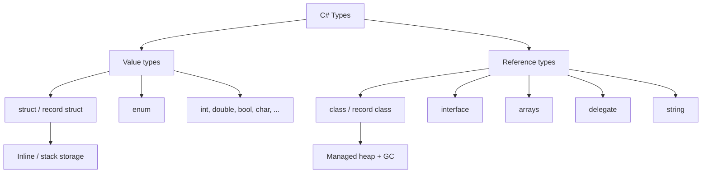

### 1.5 Real example

**Scenario.** A logistics service computes distances between many coordinates in a tight loop and reports unexpected memory pressure and slow throughput.

**Problem.** Coordinates were modeled as a `class`, so every coordinate created a heap allocation; millions of short-lived objects pressured the garbage collector.

**Solution.** Model the coordinate as a small immutable **`readonly record struct`** so instances are value types stored inline, with value equality for free and no per-instance heap allocation.

**Implementation (real C# 13 code):**

```csharp
namespace Logistics.Geo;

// Value type: stored inline, copied by value, value equality for free.
public readonly record struct Coordinate(double Latitude, double Longitude)
{
    public double DistanceTo(Coordinate other)
    {
        const double earthRadiusKm = 6371.0;
        double dLat = DegreesToRadians(other.Latitude - Latitude);
        double dLon = DegreesToRadians(other.Longitude - Longitude);
        double a = Math.Sin(dLat / 2) * Math.Sin(dLat / 2)
                 + Math.Cos(DegreesToRadians(Latitude))
                 * Math.Cos(DegreesToRadians(other.Latitude))
                 * Math.Sin(dLon / 2) * Math.Sin(dLon / 2);
        return earthRadiusKm * 2 * Math.Asin(Math.Sqrt(a));
    }

    private static double DegreesToRadians(double degrees) => degrees * Math.PI / 180.0;
}

public static class Demo
{
    public static double TotalRoute(ReadOnlySpan<Coordinate> stops)
    {
        double total = 0;
        for (int i = 1; i < stops.Length; i++)
            total += stops[i - 1].DistanceTo(stops[i]);
        return total;
    }
}
```

**Result.** Allocations in the hot loop drop to near zero, GC pressure disappears, and equality comparisons (`a == b`) work as expected because `record struct` generates value-based equality.

**Future improvements.** Profile whether the struct is large enough that copying outweighs allocation savings; if so, pass by `in` reference. Consider SIMD with `System.Numerics.Vector` for batch distance calculations.

### 1.6 Exercises

1. Declare a `record struct` `Money(decimal Amount, string Currency)` and explain why it is a value type.
2. Given two `class` variables assigned to each other, predict whether mutating one affects the other, and why.
3. List three built-in value types and three reference types.

### 1.7 Challenges

- **Challenge.** Take a `class`-based small domain type from an existing project, convert it to a `readonly record struct`, and measure allocation/GC differences with a benchmark before and after.

### 1.8 Checklist

- [ ] I can state how value types and reference types differ in storage and copying.
- [ ] I know which default equality each category uses.
- [ ] I can choose `struct` vs `class` for a given domain concept.
- [ ] I understand why `string` behaves value-like despite being a reference type.

### 1.9 Best practices

- Prefer small **immutable value types** (`readonly record struct`) for value-like concepts (money, coordinates, identifiers).
- Use `class` for entities with identity and shared, mutable lifecycle.
- Keep `struct` types small; large structs are expensive to copy.

### 1.10 Anti-patterns

- Large mutable `struct` types passed by value through hot paths (hidden copy cost).
- Assuming `class` instances are copied on assignment (accidental shared mutation).
- Comparing reference types with `==` expecting value equality when none is defined.

### 1.11 Troubleshooting

| Symptom | Likely cause | Action |
|---------|--------------|--------|
| Two variables change together unexpectedly | Reference type aliasing | Copy explicitly or use an immutable type |
| `==` returns false for "equal" objects | Reference equality on a `class` | Implement value equality or use a `record` |
| High GC / allocation in hot loop | Small data modeled as `class` | Convert to `readonly record struct` |
| Mutating a `struct` "does nothing" | Mutating a copy, not the original | Reassign the value or use a reference (`ref`) |

### 1.12 Official references

- Types overview (C# language): https://learn.microsoft.com/dotnet/csharp/fundamentals/types/
- Value types: https://learn.microsoft.com/dotnet/csharp/language-reference/builtin-types/value-types
- Reference types: https://learn.microsoft.com/dotnet/csharp/language-reference/keywords/reference-types
- Records and `record struct`: https://learn.microsoft.com/dotnet/csharp/language-reference/builtin-types/record

---

## Chapter 2 — Variables, nullable reference types, and `var`/`const`

### 2.1 Introduction

A variable binds a name to a typed storage location. In modern C# the most consequential decision around variables is **nullability**: with **nullable reference types** enabled, the compiler tracks whether a reference may be `null` and warns you before a `NullReferenceException` can occur at runtime. This chapter covers declaration forms (`var`, explicit types, `const`), default values, and the nullable annotation context that all later code in this book assumes.

### 2.2 Business context

The `NullReferenceException` has been called "the billion-dollar mistake." Nullable reference types turn an entire class of runtime crashes into compile-time warnings, shifting defect discovery left where fixes are cheap. For teams, enabling nullable analysis project-wide is one of the highest-leverage quality investments available: it documents intent (`string?` vs `string`), catches missing null checks in review, and makes refactoring safer.

### 2.3 Theoretical concepts

With `<Nullable>enable</Nullable>`, every reference type is **non-nullable by default**. A type written `string` is a promise it will not be null; `string?` declares it may be. The compiler performs **flow analysis** to know when a nullable value has been checked and is therefore safe to dereference.

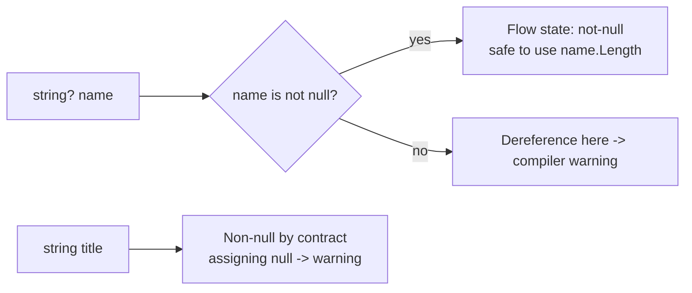

`var` infers a variable's type from its initializer (the variable is still statically typed). `const` declares a compile-time constant; `readonly` declares a value set once at construction time.

### 2.4 Architecture

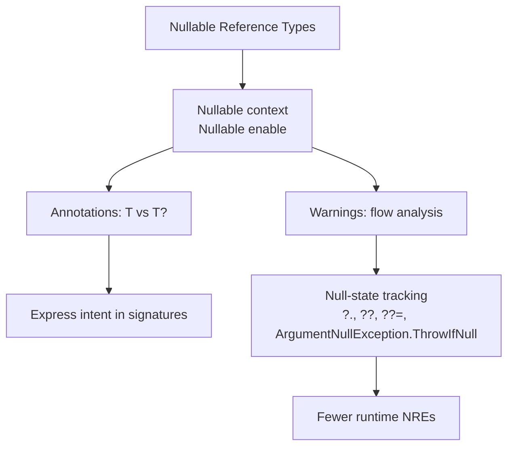

### 2.5 Real example

**Scenario.** An order service occasionally crashes with `NullReferenceException` when a customer has no shipping address on file.

**Problem.** The address field was modeled as a non-nullable `string`, but the data layer could return null; the crash only surfaced in production with certain records.

**Solution.** Model optionality honestly with `string?`, let the compiler enforce checks, and use null-handling operators plus a guard helper for required arguments.

**Implementation (real C# 13 code):**

```csharp
namespace Ordering;

public sealed class Customer
{
    public required string Name { get; init; }
    public string? ShippingAddress { get; init; } // explicitly optional
}

public static class ShippingLabel
{
    public static string Build(Customer customer)
    {
        ArgumentNullException.ThrowIfNull(customer);

        // Non-null by contract: Name cannot be null here.
        string recipient = customer.Name;

        // Optional: handle the null case explicitly.
        string address = customer.ShippingAddress ?? "ADDRESS REQUIRED";

        // Null-conditional with a fallback length.
        int addressLength = customer.ShippingAddress?.Length ?? 0;

        return $"{recipient}\n{address}\n(chars: {addressLength})";
    }
}
```

**Result.** The compiler forces every access to `ShippingAddress` through a null check, eliminating the crash class. Required state is guaranteed via `required` and `ArgumentNullException.ThrowIfNull`.

**Future improvements.** Introduce a domain `Address` value object instead of a raw string; consider the null-object pattern for absent addresses to remove the sentinel string.

### 2.6 Exercises

1. Enable nullable reference types in a project and resolve the first three warnings.
2. Rewrite a method that returns `null` to declare its return type as `T?` and explain the signature change.
3. Replace a manual `if (x == null) throw ...` with `ArgumentNullException.ThrowIfNull`.

### 2.7 Challenges

- **Challenge.** Audit a module for missing nullability annotations; convert it to a fully annotated, warning-free state and document any places where `null!` (the null-forgiving operator) was unavoidable and why.

### 2.8 Checklist

- [ ] Nullable reference types are enabled project-wide.
- [ ] Optional references are declared `T?`; required ones are non-nullable.
- [ ] I use `?.`, `??`, and `??=` instead of manual null branches where natural.
- [ ] Required members use `required` and/or guard clauses.

### 2.9 Best practices

- Enable nullable at the **project** level, not file by file, for consistency.
- Treat nullable warnings as errors in CI to prevent regressions.
- Reserve the null-forgiving operator `!` for cases the compiler cannot prove safe, and comment why.

### 2.10 Anti-patterns

- Sprinkling `!` everywhere to silence warnings instead of fixing the underlying nullability.
- Declaring everything `T?` "to be safe," which throws away the compiler's guarantees.
- Disabling nullable in legacy files indefinitely instead of migrating incrementally.

### 2.11 Troubleshooting

| Symptom | Cause | Action |
|---------|-------|--------|
| "Dereference of a possibly null reference" warning | Value not proven non-null on this path | Add a null check or use `?.`/`??` |
| `NullReferenceException` still at runtime | Nullable not enabled, or `!` used to bypass | Enable nullable; remove the `!` and fix the cause |
| "Non-nullable property must contain a value" | Required member not initialized | Add `required` or initialize in the constructor |
| Excessive warnings on legacy code | Whole project turned on at once | Migrate per-file with `#nullable enable` |

### 2.12 Official references

- Nullable reference types: https://learn.microsoft.com/dotnet/csharp/nullable-references
- Nullable context and annotations: https://learn.microsoft.com/dotnet/csharp/language-reference/builtin-types/nullable-reference-types
- `var` (implicitly typed locals): https://learn.microsoft.com/dotnet/csharp/language-reference/statements/declarations
- `required` members: https://learn.microsoft.com/dotnet/csharp/language-reference/keywords/required

---

## Chapter 3 — Methods, parameters, and the structure of a program

### 3.1 Introduction

A C# program is organized into namespaces and types, and behavior lives in **methods**. C# 13 favors a concise structure: **file-scoped namespaces** (one `namespace X;` line instead of a wrapping brace block) and **top-level statements** that let a program's entry point be written without ceremony. This chapter covers how programs start, how methods declare parameters (positional, optional, `params`, `ref`/`out`/`in`), and how expression-bodied members keep code compact.

### 3.2 Business context

Readable, well-factored methods are the unit of maintainability. Clear parameter contracts (what is required, what is optional, what is passed by reference) reduce misuse and review friction. The modern structural conveniences — file-scoped namespaces, top-level statements — reduce nesting and boilerplate, which lowers the cognitive cost of reading code and onboarding new developers, a concrete productivity gain across a codebase.

### 3.3 Theoretical concepts

The **entry point** of an executable is conceptually `static Main`. With **top-level statements**, you write the entry-point body directly in one file and the compiler synthesizes `Main`. Methods accept parameters by value by default; modifiers change this: `ref` passes a reference (read/write), `out` requires the method to assign it, `in` passes a read-only reference (efficient for large structs), and `params` accepts a variable number of arguments.

```mermaid
flowchart TB
    start([Program start]) --> tls[Top-level statements -> synthesized Main]
    tls --> call[Call methods]
    call --> params[Parameter passing]
    params --> byval[by value default]
    params --> byref[ref: read/write]
    params --> out[out: must assign]
    params --> inp[in: read-only ref]
    params --> variadic[params: variable count]
```

### 3.4 Architecture

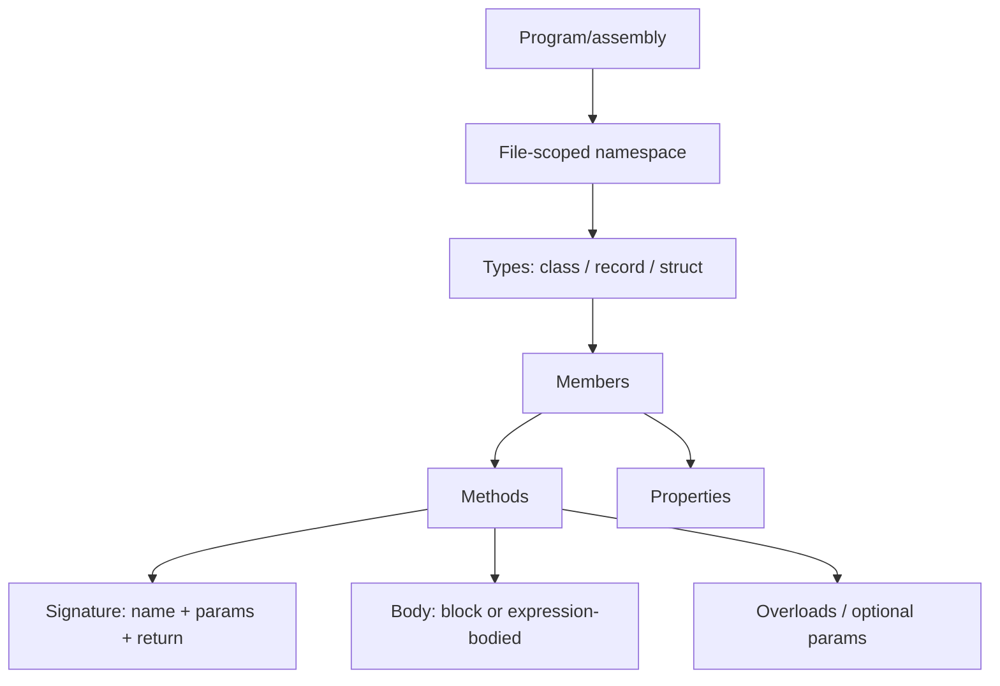

### 3.5 Real example

**Scenario.** A small command-line tool needs to parse arguments, compute a result, and exit with a status code — without a large class scaffold.

**Problem.** Boilerplate (`Program` class, `static Main`, namespace braces) obscures the tool's tiny logic and slows iteration.

**Solution.** Use top-level statements for the entry point and a file-scoped namespace for a small helper type, demonstrating optional parameters, `params`, and `out`.

**Implementation (real C# 13 code):**

```csharp
// Program.cs — top-level statements form the entry point.
using PriceTools;

string[] cli = args.Length > 0 ? args : ["19.99", "tax", "0.08"];

if (!Calculator.TryParsePrice(cli[0], out decimal price))
{
    Console.Error.WriteLine("Invalid price.");
    return 1; // exit code
}

decimal rate = cli is [_, "tax", var r] && decimal.TryParse(r, out var parsed) ? parsed : 0m;
decimal total = Calculator.WithTax(price, rate);

Console.WriteLine($"Total: {total:C}");
return 0;
```

```csharp
// Calculator.cs
namespace PriceTools; // file-scoped namespace

public static class Calculator
{
    // Optional parameter + expression-bodied method.
    public static decimal WithTax(decimal price, decimal rate = 0.0m) => price * (1 + rate);

    // 'out' parameter: the method must assign it.
    public static bool TryParsePrice(string input, out decimal price) =>
        decimal.TryParse(input, out price) && price >= 0;

    // 'params' collection: variable number of arguments.
    public static decimal Sum(params ReadOnlySpan<decimal> values)
    {
        decimal total = 0;
        foreach (decimal v in values) total += v;
        return total;
    }
}
```

**Result.** The tool's logic is immediately visible; the entry point is a few lines, parameter contracts are explicit (`out` for try-parse, `params` for sums), and the exit code communicates success or failure to the shell.

**Future improvements.** Adopt a dedicated argument parser (e.g., `System.CommandLine`) as the tool grows; add unit tests around `Calculator` (Part VIII).

### 3.6 Exercises

1. Convert a classic `static void Main(string[] args)` program to top-level statements.
2. Write a method using an `out` parameter and call it with the inline `out var` form.
3. Create an overloaded method and an equivalent single method with an optional parameter; discuss the trade-off.

### 3.7 Challenges

- **Challenge.** Implement a `params ReadOnlySpan<T>` method and benchmark it against a `params T[]` version to observe the allocation difference C# 13 enables.

### 3.8 Checklist

- [ ] I use file-scoped namespaces for new files.
- [ ] I understand when top-level statements are appropriate (entry point) vs full classes.
- [ ] I can choose between `ref`, `out`, `in`, and by-value correctly.
- [ ] I use expression-bodied members for one-line logic.

### 3.9 Best practices

- Keep methods short and single-purpose; prefer clear names over comments.
- Use `out`-based `TryParse`/`TryGet` patterns instead of throwing for expected failures.
- Prefer optional parameters or overloads to communicate sensible defaults explicitly.

### 3.10 Anti-patterns

- Overusing `ref`/`out` where a return value or tuple would be clearer.
- Top-level statements stuffed with hundreds of lines of logic instead of factored types.
- Long parameter lists; group related parameters into a `record` instead.

### 3.11 Troubleshooting

| Symptom | Cause | Action |
|---------|-------|--------|
| "Only one compilation unit can have top-level statements" | Two files with top-level statements | Keep entry-point code in a single file |
| "Use of unassigned out parameter" | `out` not set on every path | Assign the `out` parameter before every `return` |
| Ambiguous call between overloads | Overloads too similar | Disambiguate types or remove redundant overloads |
| Unexpected default used | Optional parameter omitted at call site | Pass the argument explicitly or name it |

### 3.12 Official references

- Top-level statements: https://learn.microsoft.com/dotnet/csharp/fundamentals/program-structure/top-level-statements
- File-scoped namespaces: https://learn.microsoft.com/dotnet/csharp/language-reference/keywords/namespace
- Methods and parameters: https://learn.microsoft.com/dotnet/csharp/programming-guide/classes-and-structs/methods
- `params` collections (C# 13): https://learn.microsoft.com/dotnet/csharp/whats-new/csharp-13

---

> **End of Part I.** You now have the foundations of C# 13 on .NET 9: the value/reference type split that governs storage, copying, and equality (Chapter 1); nullable reference types and the variable/`const`/`var` mechanics that make null-safety a compile-time concern (Chapter 2); and the program structure, method, and parameter-passing model — file-scoped namespaces, top-level statements, `ref`/`out`/`in`/`params` (Chapter 3). **Part II — Object-Oriented Programming** (Chapters 4–6) builds on these to cover classes, constructors, properties, inheritance, polymorphism, and interfaces.

---

## Part II – Object-Oriented Programming

Part I covered types, null-safety, and program structure. Part II builds the object model: **classes** that encapsulate state behind constructors and properties, **inheritance** with abstract classes and polymorphism, and **interfaces** (with default implementations) that — together with composition — keep designs flexible.

---

## Chapter 4 — Classes, fields, constructors, and properties

### 4.1 Introduction

A **class** is a reference type that bundles **state** (fields) with **behavior** (methods), exposing its state through **properties** rather than public fields. C# 13 makes this concise: **auto-implemented properties** (`public int Age { get; set; }`) generate the backing field; **`init`-only** setters allow assignment only during construction; **`required`** members force callers to set them; and **primary constructors** let a class declare its constructor parameters on the class header. Constructors establish a valid object; properties guard its invariants thereafter.

### 4.2 Business context

Encapsulation is what lets a class change its internals without breaking callers and enforce that its data is always valid. Exposing public fields ties every caller to the representation and removes the chance to validate; exposing **properties** keeps a stable surface while the implementation is free to evolve, and lets the type reject invalid state at the boundary. `required` and `init` make immutability and mandatory data compile-time guarantees, turning whole classes of "forgot to set X" and "mutated after construction" bugs into errors caught before shipping.

### 4.3 Theoretical concepts

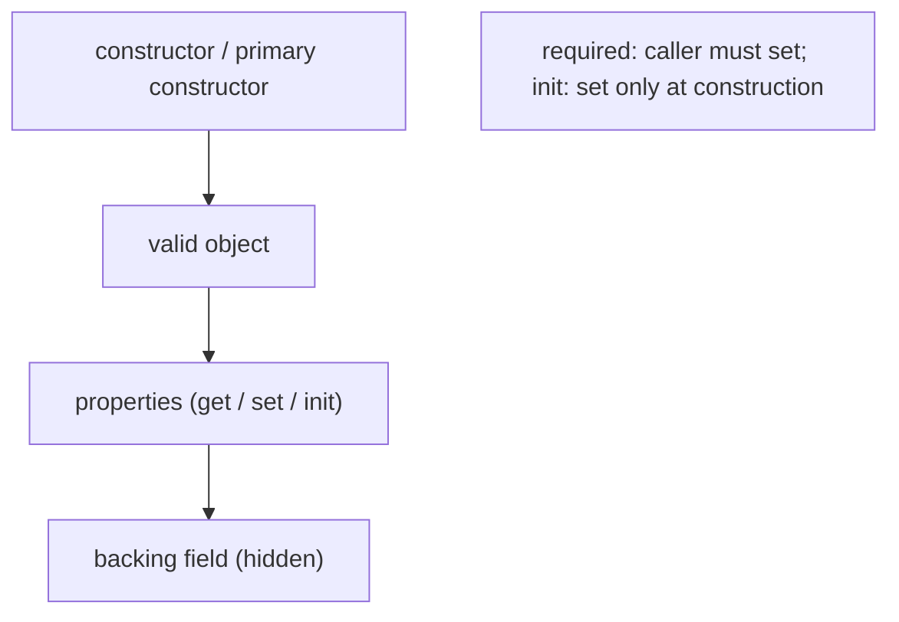

A **field** stores data; a **property** is a pair of accessors (`get`/`set`) over a (usually hidden) backing field. **Auto-properties** generate the field for you. **`init`** accessors permit assignment in a constructor or object initializer only, enabling immutable-after-construction objects; **`required`** forces the caller to provide a value (checked at compile time). A **primary constructor** (`class Customer(string name)`) puts constructor parameters in scope for the whole class, reducing boilerplate. **Object initializers** (`new Customer { Name = "A" }`) set properties right after construction.

### 4.4 Architecture: encapsulate state behind a stable surface

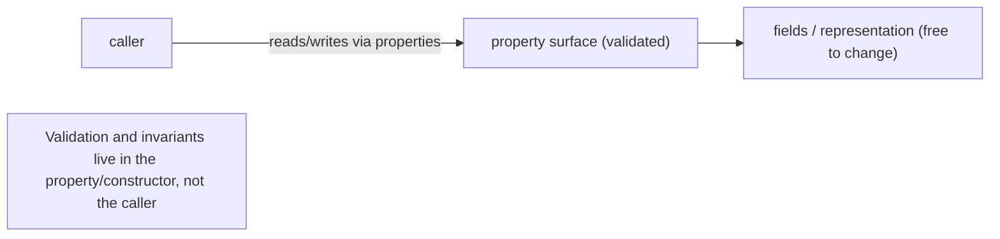

The constructor and property accessors are the one place invariants are enforced, so no caller can put the object into an invalid state — the foundation of a maintainable type.

### 4.5 Real example

**Scenario.** A `BankAccount` must never have a negative balance and its owner must be set at creation.

**Problem.** Public fields would let any code set a negative balance or forget the owner.

**Solution.** Use a primary constructor with a `required`/`init` owner and a property that validates deposits.

**Implementation.**

```csharp
public class BankAccount(string owner)
{
    public string Owner { get; } = owner;          // set once, from the primary constructor
    public decimal Balance { get; private set; }    // external code can read, not write directly

    public void Deposit(decimal amount)
    {
        if (amount <= 0) throw new ArgumentOutOfRangeException(nameof(amount));
        Balance += amount;                           // invariant enforced here
    }
}

var acc = new BankAccount("Ana");
acc.Deposit(100);          // OK
// acc.Balance = -5;       // compile error: no public setter — invariant protected
```

**Result.** `Owner` is fixed at construction; `Balance` can only change through `Deposit`, which rejects invalid amounts. No caller can corrupt the account's state, because validation lives in the type, not scattered across call sites.

**Future improvements.** Make the type a `record` (Ch. 7) if it should be value-compared and immutable; add `required` members for mandatory data set via object initializers.

### 4.6 Exercises

1. What is the difference between a field and an auto-implemented property?
2. What do `init` and `required` each guarantee, and when are they checked?
3. How does a primary constructor reduce boilerplate?

### 4.7 Challenges

- **Challenge.** Model a `Temperature` class that stores Celsius, exposes a computed `Fahrenheit` property, and rejects values below absolute zero in its constructor.

### 4.8 Checklist

- [ ] I expose state through properties, not public fields.
- [ ] Constructors leave the object in a valid state.
- [ ] I use `init`/`required` for immutable or mandatory data.
- [ ] Invariants are enforced in the type, not by callers.

### 4.9 Best practices

- Prefer auto-properties; add a body only when you need validation/logic.
- Use `init` for immutability and `required` for mandatory members.
- Keep setters as private/`init` as the invariants allow.

### 4.10 Anti-patterns

- Public mutable fields exposing the representation.
- Constructors that leave objects half-initialized.
- Validation duplicated at every call site instead of in the property/constructor.

### 4.11 Troubleshooting

| Symptom | Likely cause | Action |
|---------|--------------|--------|
| Object reaches an invalid state | State set via public field/setter | Encapsulate behind a validating property |
| "Required member not set" | `required` member omitted | Set it in the initializer/constructor |
| Mutated after creation unexpectedly | Public setter | Use `init` or `private set` |

### 4.12 References

- Microsoft, "Classes, structs, and records (C# guide)": https://learn.microsoft.com/dotnet/csharp/fundamentals/types/.
- J. Albahari, *C# 13 in a Nutshell* (O'Reilly, 2025) — ISBN 978-1098159474.

---

## Chapter 5 — Inheritance, abstract classes, and polymorphism

### 5.1 Introduction

**Inheritance** lets a class derive from a base class, reusing and specializing its members. C# makes the polymorphic contract explicit: a base method must be **`virtual`** to be overridden, and a derived class uses **`override`**; an **abstract class** can declare **`abstract`** members that have no body and *must* be overridden, and cannot be instantiated. **Polymorphism** then lets code call a `virtual`/`abstract` method on a base reference and get the derived implementation at runtime. `sealed` stops further overriding or derivation.

### 5.2 Business context

Inheritance models genuine "is-a" specialization and lets shared behavior live in one base class. Polymorphism is what makes code **open to extension**: a payroll routine that calls `employee.CalculatePay()` works for every current and future `Employee` subtype without change. Abstract classes encode a contract plus shared scaffolding, so each subtype fills in only what differs. Used for real specialization (not mere code reuse — see Ch. 6 for composition), this keeps variant-heavy domains extensible and consistent.

### 5.3 Theoretical concepts

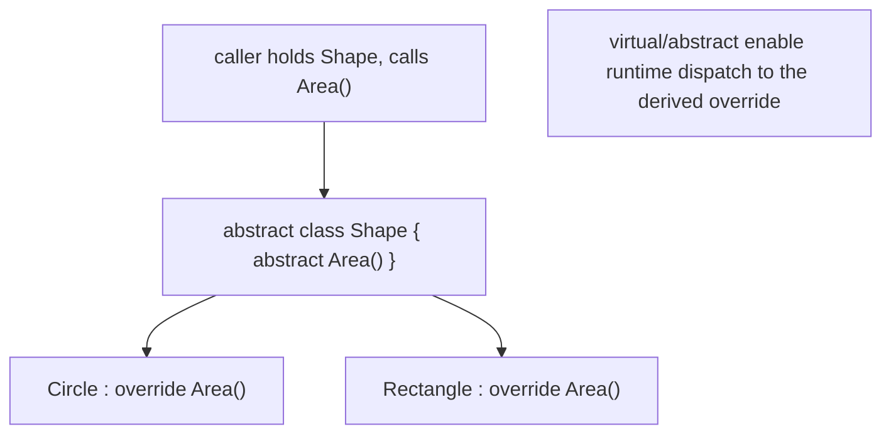

A method is dispatched **virtually** only if it's declared `virtual` or `abstract` and the derived class uses `override`. An **abstract class** may mix abstract members (no body, must be overridden) with concrete ones (shared implementation); it cannot be `new`-ed directly. Marking a method or class **`sealed`** prevents further overriding/derivation (and can help performance). Hiding with **`new`** (instead of `override`) is a different, usually-undesirable behavior where dispatch depends on the static type — prefer `override`.

### 5.4 Architecture: shared base, specialized leaves

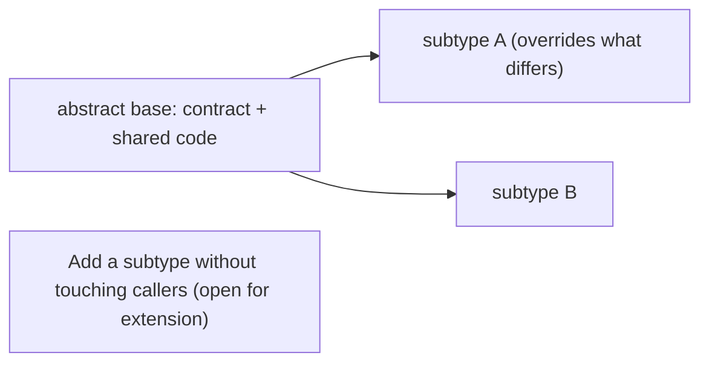

Callers depend on the base type; each subtype supplies its own behavior for the virtual/abstract members, so new variants slot in without changing the calling code.

### 5.5 Real example

**Scenario.** A reporting tool exports in several formats that share header/footer logic but differ in the body.

**Problem.** Copying export logic per format duplicates the shared parts and risks drift.

**Solution.** An **abstract** `Report` with a concrete template method and an **abstract** body hook overridden per format.

**Implementation.**

```csharp
public abstract class Report
{
    public string Render()                      // shared scaffolding (concrete)
        => Header() + Body() + Footer();
    protected string Header() => "=== Report ===\n";
    protected abstract string Body();           // each subtype MUST supply this
    protected string Footer() => "\n=== End ===";
}

public sealed class CsvReport : Report
{
    protected override string Body() => "a,b,c";   // the part that varies
}

Report r = new CsvReport();   // base reference...
Console.WriteLine(r.Render()); // ...calls the CsvReport body via polymorphism
```

**Result.** Header/footer live once in the base; each format overrides only `Body`. `Render` works for any `Report` subtype through polymorphism, so adding a `JsonReport` means one new class and no change to callers. `sealed` on the leaf signals it isn't meant to be extended further.

**Future improvements.** If formats need to combine behaviors (e.g., compressed + encrypted), prefer **composition** (Ch. 6) over deepening the hierarchy.

### 5.6 Exercises

1. What must be true for a method call to dispatch to a derived override?
2. How does an abstract class differ from a concrete one, and why can't it be instantiated?
3. When would you mark a class or method `sealed`?

### 5.7 Challenges

- **Challenge.** Build an abstract `Notification` with a concrete `Send()` template and an abstract `Format()` hook; implement `Email` and `Sms` subtypes and invoke them through a `Notification` reference.

### 5.8 Checklist

- [ ] I mark base members `virtual`/`abstract` when subtypes must specialize them.
- [ ] Derived types use `override` (not `new`) for polymorphic behavior.
- [ ] I use abstract classes for a contract plus shared scaffolding.
- [ ] I reserve inheritance for genuine "is-a" specialization.

### 5.9 Best practices

- Use `override` for polymorphism; avoid member hiding with `new`.
- Put shared behavior in an abstract base, variant behavior in overrides.
- Keep hierarchies shallow; consider `sealed` for leaves.

### 5.10 Anti-patterns

- Deep inheritance trees built only to share code (prefer composition).
- Hiding base members with `new`, causing type-dependent dispatch.
- Base classes that downcast to know their subtypes.

### 5.11 Troubleshooting

| Symptom | Likely cause | Action |
|---------|--------------|--------|
| Base implementation runs, not the override | Method not `virtual`/`override` (hidden with `new`) | Make it `virtual` + `override` |
| "Cannot create an instance of abstract type" | Trying to `new` an abstract class | Instantiate a concrete subtype |
| Fragile base class breaks subtypes | Inheritance used for reuse | Refactor to composition (Ch. 6) |

### 5.12 References

- Microsoft, "Inheritance" & "Polymorphism (C# guide)": https://learn.microsoft.com/dotnet/csharp/fundamentals/object-oriented/.
- J. Albahari, *C# 13 in a Nutshell* (O'Reilly, 2025) — ISBN 978-1098159474.

---

## Chapter 6 — Interfaces, default implementations, and composition

### 6.1 Introduction

An **interface** declares a contract — a set of members a type promises to provide — without dictating how. A class can implement **many** interfaces (unlike single base-class inheritance), which is C#'s primary tool for polymorphism and decoupling. Since C# 8, an interface may also carry **default implementations** for members, letting an API evolve without breaking existing implementers. Combined with **composition** (building behavior by holding objects), interfaces let you favor flexible assembly over rigid inheritance.

### 6.2 Business context

Interfaces are what make code testable and swappable: a service that depends on `IClock` or `IPaymentGateway` can be given a real implementation in production and a fake in tests, and a new implementation never touches the consumer. Default interface methods let library authors add a member to a published interface without breaking the implementers already in the field — a real compatibility win for evolving APIs. Composition over inheritance keeps behaviors recombinable (logging + retry + caching as wrappers) instead of exploding into a subclass per combination.

### 6.3 Theoretical concepts

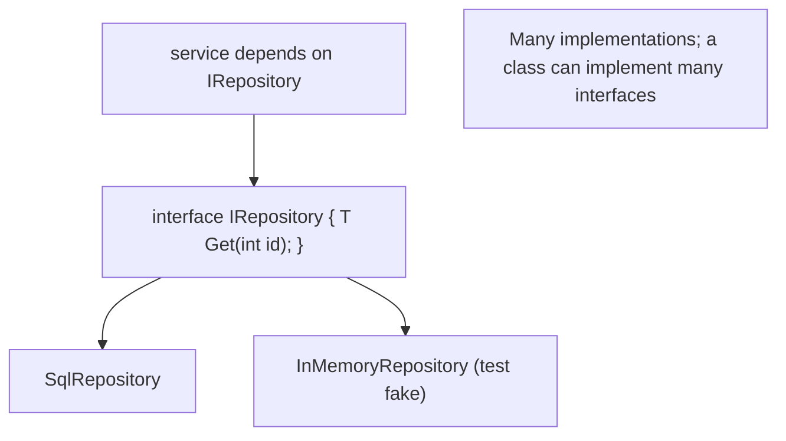

A type lists the interfaces it implements; the compiler checks every member is provided. **Explicit interface implementation** (`T IFoo.Get(...)`) lets a class implement two interfaces with clashing members or hide a member from the class's public surface. **Default interface methods** provide a body in the interface itself, used unless an implementer overrides it. Because callers depend on the **interface**, any implementation — including a test double the interface never knew about — can be substituted.

### 6.4 Architecture: depend on contracts, compose behaviors

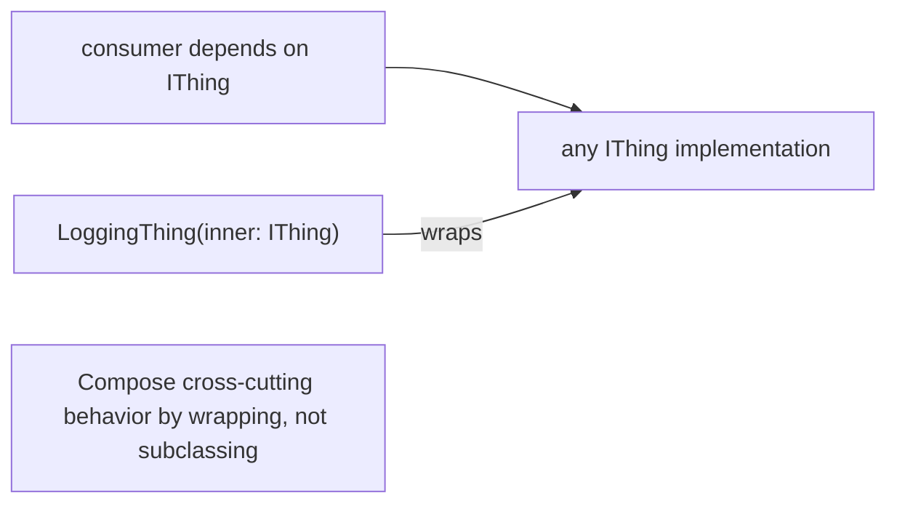

Dependency on interfaces plus composition (wrapping one implementation in another) is how cross-cutting concerns are added without inheritance — and how dependency injection wires real or fake implementations at runtime.

### 6.5 Real example

**Scenario.** A checkout service needs a payment gateway, testable offline and extensible to new providers.

**Problem.** Hard-coding one concrete gateway makes the service untestable and tied to that provider.

**Solution.** Depend on an **interface**; provide implementations and a **composed** retry wrapper.

**Implementation.**

```csharp
public interface IPaymentGateway { Task<bool> ChargeAsync(decimal amount); }

public sealed class StripeGateway : IPaymentGateway { /* real call */ public Task<bool> ChargeAsync(decimal a) => /* ... */; }
public sealed class FakeGateway   : IPaymentGateway { public Task<bool> ChargeAsync(decimal a) => Task.FromResult(true); } // tests

public sealed class RetryingGateway(IPaymentGateway inner) : IPaymentGateway   // composition
{
    public async Task<bool> ChargeAsync(decimal amount)
    {
        for (var i = 0; i < 3; i++) if (await inner.ChargeAsync(amount)) return true;
        return false;
    }
}

// Checkout depends only on the interface:
public sealed class Checkout(IPaymentGateway gateway)
{
    public Task<bool> PayAsync(decimal amount) => gateway.ChargeAsync(amount);
}
```

**Result.** `Checkout` works with `StripeGateway`, a `FakeGateway` in tests, or `new RetryingGateway(new StripeGateway())` — none of which it imports. Retry is added by **wrapping** (composition), so it applies to any gateway and is independently testable. New providers are new classes; the consumer never changes.

**Future improvements.** Register implementations with dependency injection (Ch. 18) so wiring is configured, not hard-coded; add default interface methods if the contract must grow without breaking implementers.

### 6.6 Exercises

1. Why can a class implement many interfaces but inherit from only one base class?
2. What problem do default interface methods solve for evolving APIs?
3. How does depending on an interface make a class testable?

### 6.7 Challenges

- **Challenge.** Define `INotifier`, implement `EmailNotifier` and a `LoggingNotifier` that wraps another `INotifier`, and inject them into a service that depends only on `INotifier`.

### 6.8 Checklist

- [ ] Consumers depend on interfaces, not concrete types.
- [ ] I use explicit implementation only when needed (clashes / hiding).
- [ ] I compose cross-cutting behavior by wrapping implementations.
- [ ] New behavior is a new implementation, not an edit to consumers.

### 6.9 Best practices

- Program to interfaces; inject implementations (DI).
- Keep interfaces small and focused (one responsibility).
- Use default interface methods to evolve published contracts compatibly.

### 6.10 Anti-patterns

- Depending on concrete classes, blocking substitution and testing.
- Fat interfaces forcing implementers to provide unused members.
- Using inheritance where composition (wrapping) reads more clearly.

### 6.11 Troubleshooting

| Symptom | Likely cause | Action |
|---------|--------------|--------|
| Can't unit-test a class offline | Depends on a concrete external type | Depend on an interface; inject a fake |
| Two interfaces have clashing members | Implicit implementation conflict | Use explicit interface implementation |
| Adding an interface member breaks implementers | No default provided | Add a default interface method |

### 6.12 References

- Microsoft, "Interfaces" & "Default interface methods": https://learn.microsoft.com/dotnet/csharp/fundamentals/types/interfaces.
- J. Albahari, *C# 13 in a Nutshell* (O'Reilly, 2025) — ISBN 978-1098159474.

---

> **End of Part II.** C#'s object model: **classes** encapsulate state behind constructors and validating **properties** (`init`/`required`); **inheritance** with `virtual`/`abstract`/`override` provides polymorphism for genuine specialization; and **interfaces** (with default implementations) plus **composition** keep designs decoupled and testable. Part III covers **records and pattern matching** — value-equality types and expressive `switch`.

---

## Part III – Records & Pattern Matching

Part II built the class-based object model. Part III covers two features that make C# concise and expressive for data: **records** (reference or value types with built-in value equality and immutability) and **pattern matching** (testing and deconstructing data with `switch` expressions).

---

## Chapter 7 — Records, `init` setters, and value equality

### 7.1 Introduction

A **record** is a type whose identity is its **data**: two records are equal when their members are equal (value equality), not when they're the same reference. Declared positionally (`record Point(int X, int Y);`) the compiler generates the constructor, read-only properties, value-based `Equals`/`GetHashCode`, a readable `ToString`, and a deconstructor. Records are **immutable** by default (init-only properties) and support **`with`-expressions** for non-destructive copies. `record class` is a reference type; `record struct` is a value type — both with value equality.

### 7.2 Business context

Most domains are full of data that should be compared by value and never mutated: money, coordinates, DTOs, events. Modeling these as classes means hand-writing `Equals`, `GetHashCode`, and copy logic — tedious and bug-prone (a forgotten field breaks equality or hashing silently). Records remove that boilerplate and make immutability the default, which eliminates whole classes of aliasing bugs (no one can mutate a shared value) and makes objects safe to use as dictionary keys or in sets. Less code, fewer bugs, clearer intent.

### 7.3 Theoretical concepts

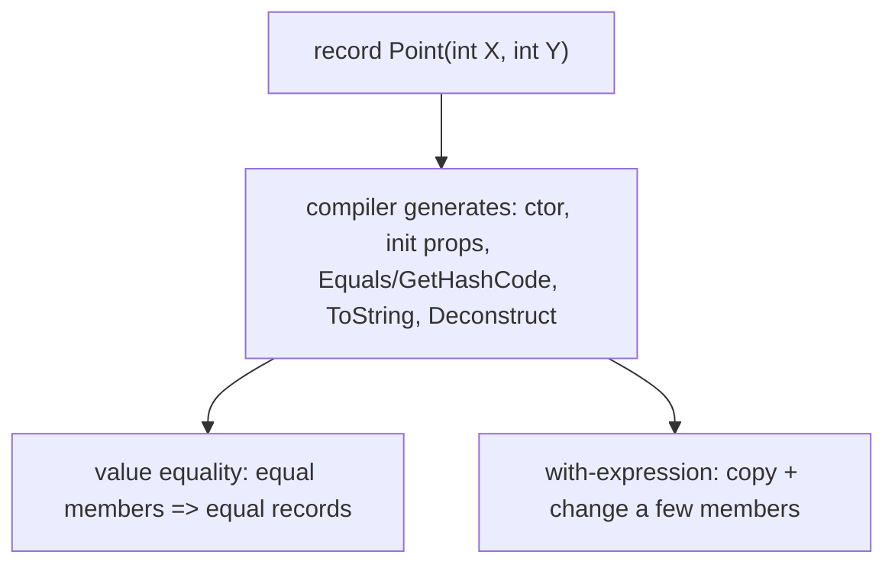

A positional record generates everything that makes a value type ergonomic. **Value equality** compares all members; **`with`** produces a modified copy leaving the original untouched (`p with { X = 5 }`). Properties are **`init`-only**, so instances are immutable after construction. Choose **`record struct`** for small values that should live on the stack and **`record class`** for larger or reference-shared data; both keep value semantics for equality.

### 7.4 Architecture: immutable values, non-destructive updates

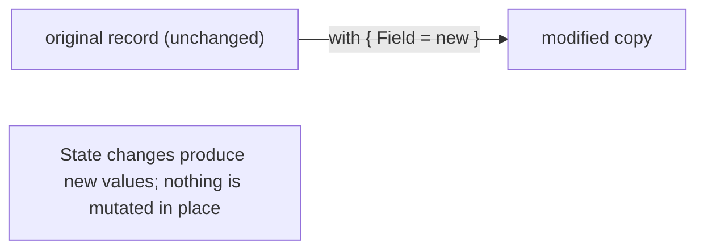

Treating data as immutable records turns "updates" into new values, which makes reasoning and concurrency safer — there's no shared mutable state to corrupt.

### 7.5 Real example

**Scenario.** Model money that must be value-compared, immutable, and easy to "change" safely.

**Problem.** A class would need hand-written equality/hashing and could be mutated by any holder.

**Solution.** A `record` gives value equality, immutability, and `with`-based updates for free.

**Implementation.**

```csharp
public record Money(decimal Amount, string Currency)
{
    public Money Add(decimal more) => this with { Amount = Amount + more }; // non-destructive copy
}

var a = new Money(10m, "BRL");
var b = new Money(10m, "BRL");
Console.WriteLine(a == b);          // True — value equality (generated)
var c = a.Add(5m);                  // new Money(15, BRL); 'a' unchanged
Console.WriteLine(a.Amount);        // 10 — original is immutable
```

**Result.** `Money` compares by value (so `a == b`), can't be mutated (so it's safe to share and use as a key), and "changes" via `with` produce new values. None of `Equals`, `GetHashCode`, `ToString`, or copy logic was hand-written — the record generated it correctly.

**Future improvements.** Use `record struct` if the value is small and allocation matters; add validation in the record body (e.g., reject empty currency) since records can still have constructors/bodies.

### 7.6 Exercises

1. What does a positional record generate for you?
2. How does a `with`-expression differ from mutating a property?
3. When would you choose `record struct` over `record class`?

### 7.7 Challenges

- **Challenge.** Model a `DateRange(DateOnly Start, DateOnly End)` record; add a method returning a new range extended by N days using `with`, and confirm two equal ranges compare equal.

### 7.8 Checklist

- [ ] I use records for data compared by value.
- [ ] I rely on generated equality/hashing instead of hand-writing it.
- [ ] I update immutable records with `with`-expressions.
- [ ] I pick `record struct` vs `record class` by size/semantics.

### 7.9 Best practices

- Default to records for DTOs, value objects, and events.
- Keep records immutable; model changes as new values.
- Add validation in the record body where invariants matter.

### 7.10 Anti-patterns

- Mutable records with public setters (defeats value semantics).
- Hand-written `Equals`/`GetHashCode` where a record would suffice.
- Using a class with value-like semantics and forgetting to override equality.

### 7.11 Troubleshooting

| Symptom | Likely cause | Action |
|---------|--------------|--------|
| Two "equal" objects aren't equal | Class with no value equality | Use a record (or override Equals/GetHashCode) |
| Shared instance mutated unexpectedly | Mutable type | Use an immutable record + `with` |
| Wrong hashing as a dictionary key | Mutable/by-reference equality | Use an immutable record |

### 7.12 References

- Microsoft, "Records (C# reference)": https://learn.microsoft.com/dotnet/csharp/language-reference/builtin-types/record.
- J. Albahari, *C# 13 in a Nutshell* (O'Reilly, 2025) — ISBN 978-1098159474.

---

## Chapter 8 — Pattern matching, `switch` expressions, and deconstruction

### 8.1 Introduction

**Pattern matching** tests the shape and content of data and binds parts of it in one step. C# supports **type** patterns (`is Circle c`), **property** patterns (`{ Status: Active }`), **relational** patterns (`> 100`), **logical** patterns (`and`/`or`/`not`), and **list** patterns (`[first, .., last]`). The **`switch` expression** turns these into a concise value-producing form, and **deconstruction** pulls a type apart into variables (`var (x, y) = point;`). Together they replace long `if`/`else` and `switch`-statement chains with expressive, exhaustive code.

### 8.2 Business context

Branching on the kind and content of data is everywhere — pricing tiers, state machines, parsing, request routing. Written as nested `if`/`else`, it's verbose and easy to get wrong (a missed case, a wrong cast). Pattern matching makes the branches **declarative** and lets the compiler warn about non-exhaustive `switch` expressions, catching missing cases at build time. The result is less code, fewer casting bugs, and logic that reads close to the business rules it encodes.

### 8.3 Theoretical concepts

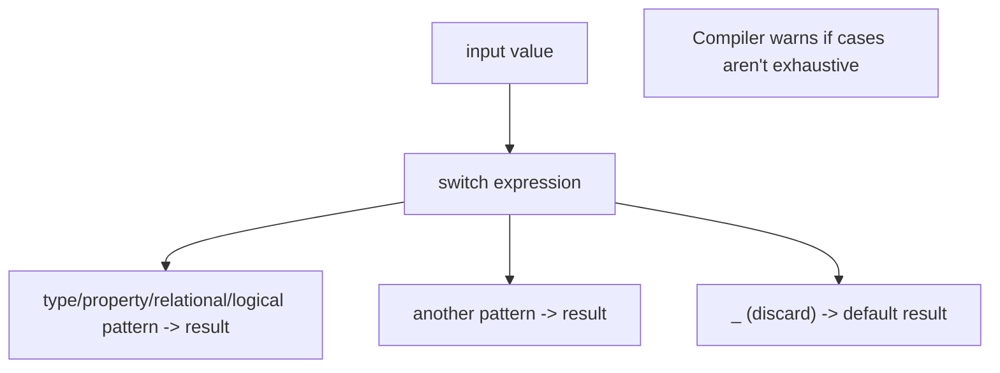

A `switch` **expression** maps an input to a value: each arm is `pattern => result`. Patterns compose — `{ Amount: > 1000, Currency: "BRL" }` combines property and relational patterns; `is not null` is a logical pattern. **Deconstruction** uses a type's `Deconstruct` method (records get one free) to bind members positionally. A discard `_` provides the catch-all; without an exhaustive set, the compiler warns.

### 8.4 Architecture: declarative branching

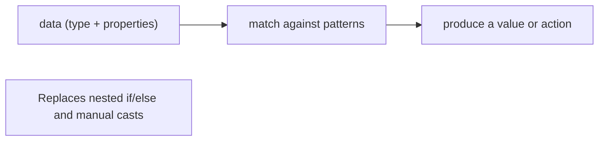

Pattern matching centralizes the decision in one readable expression, with the compiler helping ensure every case is handled.

### 8.5 Real example

**Scenario.** Compute a shipping fee from an order's weight and destination.

**Problem.** Nested `if`/`else` on weight ranges and region is verbose and easy to leave incomplete.

**Solution.** A **`switch` expression** with **property** and **relational** patterns.

**Implementation.**

```csharp
decimal Fee(Order o) => o switch
{
    { Weight: <= 1, Region: "local" }      => 5m,
    { Weight: <= 1 }                        => 9m,
    { Weight: > 1 and <= 5, Region: "local" } => 12m,
    { Weight: > 1 and <= 5 }                => 20m,
    { Weight: > 5 }                         => 35m,
    _                                       => throw new ArgumentException("invalid order")
};

// deconstruction (records get Deconstruct for free):
var (x, y) = point;   // pulls members into variables in one step
```

**Result.** The fee rules read as a table of patterns rather than a thicket of `if`/`else`, each arm combining relational (`> 1 and <= 5`) and property (`Region: "local"`) patterns. The discard arm makes intent explicit, and the compiler flags if the arms aren't exhaustive — catching a forgotten case before runtime.

**Future improvements.** Use **list patterns** (`[var head, .. var rest]`) for sequence logic; pair pattern matching with records (Ch. 7) so deconstruction and equality come for free.

### 8.6 Exercises

1. Name four kinds of pattern and give a one-line example of each.
2. How does a `switch` expression differ from a `switch` statement?
3. What does deconstruction do, and which types get it automatically?

### 8.7 Challenges

- **Challenge.** Write a `switch` expression that classifies an HTTP status code (`>= 200 and < 300` → success, etc.) using relational and logical patterns, with a discard for the unknown case.

### 8.8 Checklist

- [ ] I use `switch` expressions for value-producing branching.
- [ ] I combine type/property/relational/logical patterns instead of manual casts.
- [ ] I rely on exhaustiveness warnings to catch missing cases.
- [ ] I deconstruct records/tuples instead of accessing members one by one.

### 8.9 Best practices

- Prefer `switch` expressions over nested `if`/`else` for classification.
- Combine patterns to express rules declaratively.
- Provide a discard arm and heed exhaustiveness warnings.

### 8.10 Anti-patterns

- Long `if`/`else` chains with manual `is`/cast pairs.
- Ignoring non-exhaustive `switch` warnings.
- Over-deep pattern nesting that hurts readability.

### 8.11 Troubleshooting

| Symptom | Likely cause | Action |
|---------|--------------|--------|
| "Not all cases handled" warning | Non-exhaustive switch expression | Add the missing arm or a `_` discard |
| `InvalidCastException` in branching | Manual cast after a type test | Use a type pattern (`is T t`) |
| Verbose nested conditionals | `if`/`else` instead of patterns | Convert to a `switch` expression |

### 8.12 References

- Microsoft, "Pattern matching" & "switch expression": https://learn.microsoft.com/dotnet/csharp/fundamentals/functional/pattern-matching.
- J. Albahari, *C# 13 in a Nutshell* (O'Reilly, 2025) — ISBN 978-1098159474.

---

> **End of Part III.** **Records** give value equality, immutability, and `with`-based copies with zero boilerplate, and **pattern matching** (type/property/relational/logical/list patterns in `switch` expressions, plus deconstruction) makes branching declarative and exhaustiveness-checked. Part IV covers **collections and generics** — `List<T>`, dictionaries, collection expressions, and type parameters with constraints and variance.

---

## Part IV – Collections & Generics

Part IV covers how C# stores and parameterizes data: the **collection** types you reach for daily (`List<T>`, dictionaries, sets) with C# 12 **collection expressions**, and **generics** — the type-parameter mechanism that makes those collections type-safe and reusable.

---

## Chapter 9 — Arrays, `List<T>`, dictionaries, and collection expressions

### 9.1 Introduction

C# offers a built-in collection for every access pattern. A fixed-size **array** (`int[]`) is contiguous and fast by index. A **`List<T>`** is a growable, ordered sequence — the default general-purpose collection. A **`Dictionary<TKey,TValue>`** maps keys to values with O(1) average lookup; a **`HashSet<T>`** stores unique values with O(1) membership. C# 12 adds **collection expressions** — a unified `[...]` syntax that initializes any of them (`int[] a = [1, 2, 3];`) and a **spread** (`[..first, ..second]`) to combine sequences.

### 9.2 Business context

Choosing the right collection is a cheap, high-leverage performance decision (echoing the algorithms guide): a `List<T>.Contains` is O(n), while a `HashSet<T>.Contains` is O(1) — the difference between a fast feature and a timeout on large data. Dictionaries turn repeated lookups into constant-time access. Collection expressions reduce initialization boilerplate and make code read uniformly regardless of the concrete type, lowering the cognitive cost of working with data structures across a codebase.

### 9.3 Theoretical concepts

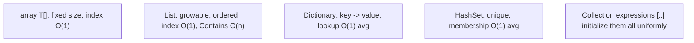

Pick by access pattern: index/iteration → array or `List<T>`; key lookup → `Dictionary`; uniqueness/membership → `HashSet`. **Collection expressions** (`[1, 2, 3]`, `[]` for empty) target whatever collection type the variable expects, and the **spread** element `..other` flattens one sequence into another. For read-only exposure, return `IReadOnlyList<T>`/`IReadOnlyDictionary<K,V>` so callers can't mutate your internals.

### 9.4 Architecture: match the structure to the access pattern

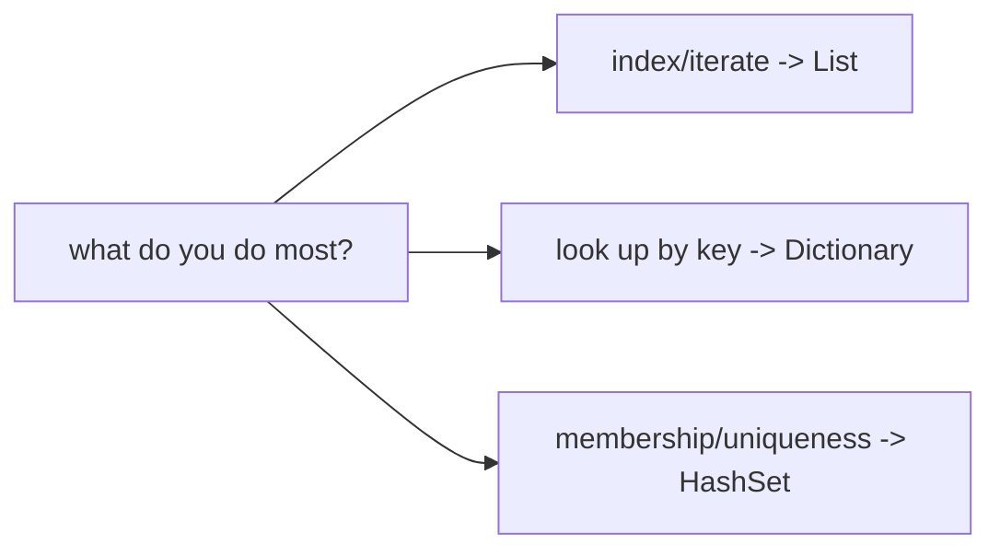

The collection choice is an O(...) decision: select the structure whose dominant operation is cheapest for your workload.

### 9.5 Real example

**Scenario.** Detect duplicate SKUs in a large import and count occurrences per category.

**Problem.** Nested scanning for duplicates is O(n²); accumulating counts in a list is awkward and slow.

**Solution.** A **`HashSet`** for O(1) duplicate detection and a **`Dictionary`** for O(1) counting.

**Implementation.**

```csharp
var seen = new HashSet<string>();
var perCategory = new Dictionary<string, int>();

foreach (var item in import)            // single pass, O(n)
{
    if (!seen.Add(item.Sku))            // Add returns false if already present
        Console.WriteLine($"duplicate SKU: {item.Sku}");
    perCategory[item.Category] = perCategory.GetValueOrDefault(item.Category) + 1;
}

int[] sample = [1, 2, 3];               // collection expression
int[] combined = [..sample, 4, 5];      // spread
```

**Result.** Duplicate detection and per-category counting both run in one O(n) pass using O(1) operations, scaling to large imports where a nested-loop approach would crawl. The collection expressions initialize and combine arrays concisely.

**Future improvements.** Expose results as `IReadOnlyDictionary` to prevent callers mutating them; for concurrent imports use `ConcurrentDictionary`.

### 9.6 Exercises

1. Which collection gives O(1) membership tests, and which gives O(1) key lookup?
2. What does a collection expression target, and what does the spread `..` do?
3. Why prefer returning `IReadOnlyList<T>` over `List<T>` from an API?

### 9.7 Challenges

- **Challenge.** Given a list of orders, build a `Dictionary<string, decimal>` of total revenue per customer in a single pass, and a `HashSet<string>` of customers who ordered more than once.

### 9.8 Checklist

- [ ] I choose the collection by its dominant operation's cost.
- [ ] I use `HashSet`/`Dictionary` for membership/lookup instead of scanning a list.
- [ ] I use collection expressions for concise initialization.
- [ ] I expose read-only interfaces to protect internal collections.

### 9.9 Best practices

- Default to `List<T>`; switch to `Dictionary`/`HashSet` for lookup/uniqueness.
- Use collection expressions and spreads for clarity.
- Return read-only collection interfaces from public APIs.

### 9.10 Anti-patterns

- `List<T>.Contains` in a loop (O(n²)) where a `HashSet` is O(n).
- Exposing mutable collections that callers can corrupt.
- Using an array where a growable `List<T>` is needed (or vice versa).

### 9.11 Troubleshooting

| Symptom | Likely cause | Action |
|---------|--------------|--------|
| Slow membership/duplicate checks | `List.Contains` (O(n)) | Use a `HashSet<T>` |
| Repeated linear lookups | Scanning a list by key | Use a `Dictionary<K,V>` |
| Caller mutated your collection | Returned a mutable `List<T>` | Return `IReadOnlyList<T>` |

### 9.12 References

- Microsoft, "Collections" & "Collection expressions": https://learn.microsoft.com/dotnet/csharp/language-reference/operators/collection-expressions.
- J. Albahari, *C# 13 in a Nutshell* (O'Reilly, 2025) — ISBN 978-1098159474.

---

## Chapter 10 — Generics: type parameters, constraints, and variance

### 10.1 Introduction

**Generics** let you write a type or method once and use it with many element types, with full type safety and no boxing. `List<T>`, `Dictionary<K,V>`, and your own `Repository<T>` are generic. A **type parameter** (`T`) is a placeholder; **constraints** (`where T : ...`) restrict it (must be a `class`, a `struct`, implement an interface, or have a parameterless constructor `new()`), unlocking the operations you can perform on `T`. **Variance** (`out`/`in` on interface type parameters) controls whether `IEnumerable<Derived>` can be used where `IEnumerable<Base>` is expected.

### 10.2 Business context

Before generics, reusable collections and algorithms used `object`, which lost type safety (runtime cast errors) and boxed value types (allocation cost). Generics give **one** implementation that is type-safe and efficient across all element types — less duplicated code, no casting bugs, better performance. Constraints document and enforce what a generic component requires, so misuse is a compile error rather than a runtime surprise. This is the foundation of reusable, robust library and domain code.

### 10.3 Theoretical concepts

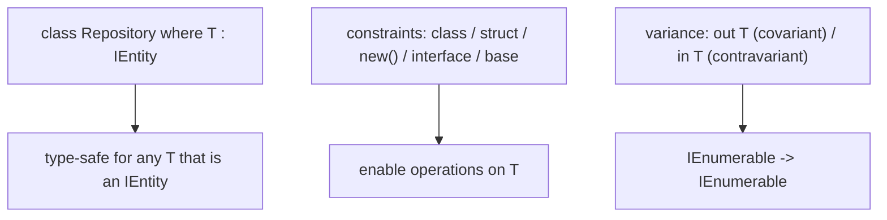

A **constraint** both restricts callers and grants capabilities: `where T : IComparable<T>` lets the body call `CompareTo`; `where T : new()` lets it `new T()`. **Covariance** (`out T`, as in `IEnumerable<out T>`) allows a more-derived `T` where a less-derived is expected (producers); **contravariance** (`in T`, as in `IComparer<in T>`) allows the reverse (consumers). Variance applies to interface and delegate type parameters, not classes.

### 10.4 Architecture: write once, reuse safely

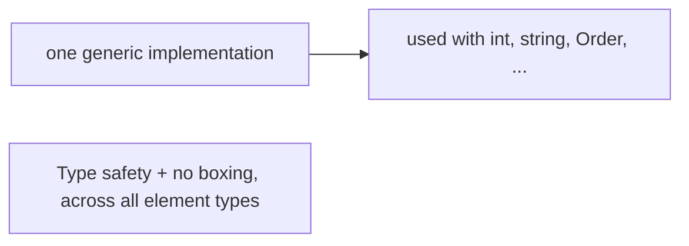

A single generic component replaces N hand-written type-specific versions, checked by the compiler for each usage.

### 10.5 Real example

**Scenario.** A reusable in-memory repository for any entity that has an `Id`.

**Problem.** Writing a separate repository per entity duplicates code; using `object` loses type safety.

**Solution.** A **generic** `Repository<T>` with an **interface constraint**.

**Implementation.**

```csharp
public interface IEntity { int Id { get; } }

public class Repository<T> where T : IEntity      // constraint: T must have an Id
{
    private readonly Dictionary<int, T> _items = new();
    public void Add(T item) => _items[item.Id] = item;   // uses T.Id thanks to the constraint
    public T? Get(int id) => _items.TryGetValue(id, out var v) ? v : default;
}

// one implementation, reused type-safely:
var orders = new Repository<Order>();   // Order : IEntity
var users  = new Repository<User>();    // User  : IEntity
```

**Result.** One `Repository<T>` serves every `IEntity` with compile-time type safety (a `Repository<Order>.Get` returns an `Order`, not an `object`) and no boxing. The `where T : IEntity` constraint is what lets the body read `item.Id`, and it rejects any `T` that isn't an entity at compile time.

**Future improvements.** Add `where T : class, IEntity, new()` if the repository must construct instances; expose `IReadOnlyCollection<T>` for enumeration with covariance.

### 10.6 Exercises

1. What two things does a generic constraint do?
2. What does `where T : new()` enable, and `where T : IComparable<T>`?
3. Explain covariance (`out T`) vs contravariance (`in T`) with an example.

### 10.7 Challenges

- **Challenge.** Write a generic `Max<T>(IEnumerable<T> items)` constrained with `where T : IComparable<T>` that returns the largest element, and use it with `int` and a custom type.

### 10.8 Checklist

- [ ] I use generics instead of `object` for reusable, type-safe components.
- [ ] I add constraints to enable the operations the body needs.
- [ ] I understand which interfaces are covariant/contravariant.
- [ ] My generic APIs avoid boxing value types.

### 10.9 Best practices

- Prefer generic types/methods over `object`-based code.
- Constrain type parameters to document and enable requirements.
- Use variance (`out`/`in`) to make generic interfaces flexible.

### 10.10 Anti-patterns

- `object`-typed collections requiring casts (lost safety, boxing).
- Over-constraining or under-constraining type parameters.
- Duplicating near-identical type-specific classes instead of one generic.

### 10.11 Troubleshooting

| Symptom | Likely cause | Action |
|---------|--------------|--------|
| Runtime cast errors from a collection | `object`-based, not generic | Use a generic `List<T>`/`Dictionary` |
| "T has no method X" compile error | Missing constraint | Add `where T : ...` to enable X |
| Can't assign `IEnumerable<Derived>` to `IEnumerable<Base>` | Variance not understood | It's covariant (`out T`) — the assignment is allowed |

### 10.12 References

- Microsoft, "Generics" & "Constraints on type parameters": https://learn.microsoft.com/dotnet/csharp/fundamentals/types/generics.
- J. Albahari, *C# 13 in a Nutshell* (O'Reilly, 2025) — ISBN 978-1098159474.

---

> **End of Part IV.** C# stores data in **collections** chosen by access pattern (`List<T>`, `Dictionary`, `HashSet`, with C# 12 collection expressions), and parameterizes them with **generics** — type parameters made capable by **constraints** and flexible by **variance** — for reuse without losing type safety or boxing. Part V covers **LINQ and functional constructs** — querying data and working with delegates, lambdas, and expression trees.

<!--APPEND-PART-V-->
