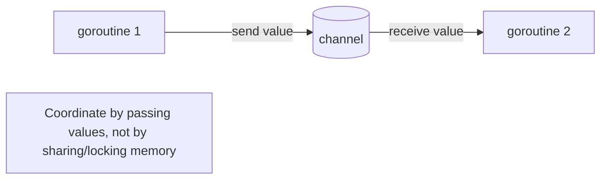
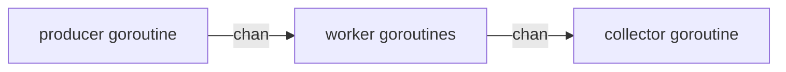
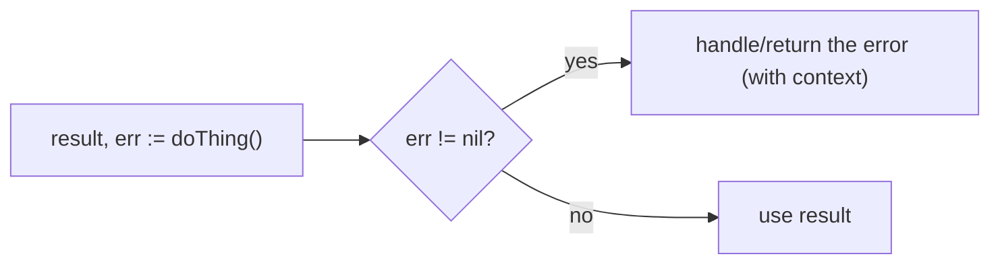
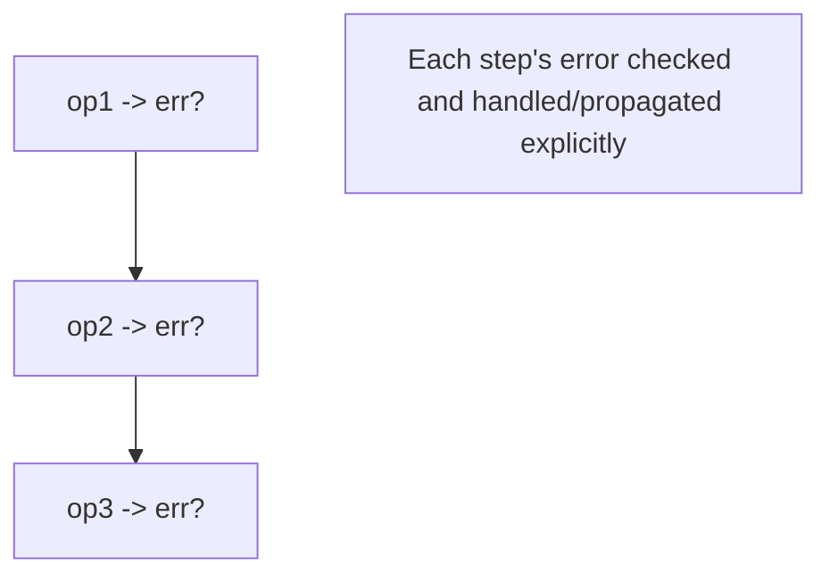
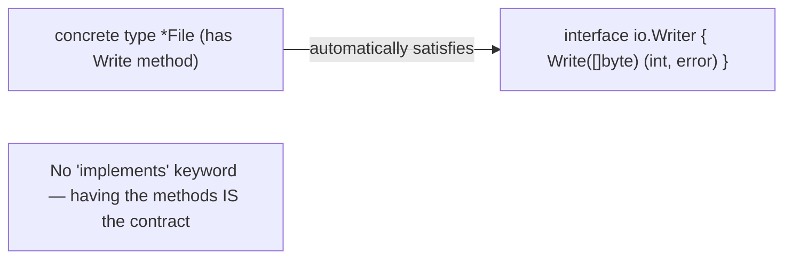
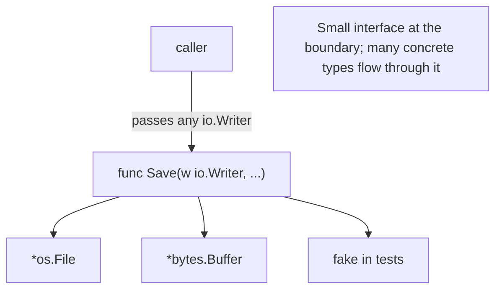

# Go 1.24 - Complete Professional Guide

> **Category:** 01_programming_languages · **Language:** English

---

### Goroutines, channels, interfaces, and explicit errors
**Original guide written from first principles, current to 2026 (Go 1.24)**

> **Original reference book (English).** This is an **independent, originally written** guide. It is not an extract, summary, or paraphrase of any third-party book; it teaches Go from first principles with original examples. Canonical books are listed under **References** as pointers only. Each chapter follows the TO-BRAIN editorial standard (see `FILE_CONVENTIONS.md`).
>
> **Scope notice:** Go is a small, statically-typed language designed for simplicity, fast compilation, and built-in concurrency. This guide covers its concurrency model, interfaces, and error handling — what makes Go distinctive — current to 2026 (Go 1.24, generics).

---

## How to read this guide

| Level | Profile | Parts |
|-------|---------|-------|
| 1 — Beginner | New to Go | Part I |
| 2 — Intermediate | Concurrent services | Part II |

**Target audience:** developers learning Go, especially for backend services and tooling.

**Structure of each chapter:** Introduction · Business context · Theoretical concepts · Architecture · Diagrams (Mermaid) · Real examples · Step by step · Complete examples · Exercises · Challenges · Checklist · Best practices · Anti-patterns · Troubleshooting · References.

> **Note on prerequisites.** Assumes programming basics in any language.

---

## Table of Contents

**Part I – Distinctive Go**
1. Concurrency: goroutines and channels
2. Explicit error handling

**Part II – Design**
3. Interfaces and composition

> **Status of this guide:** complete for its declared scope. **Ready:** Parts I–II (Ch. 1–3).

---

## Part I – Distinctive Go

Go deliberately omits many features (no inheritance, no exceptions, minimal syntax) in favor of **simplicity and readability** — there's usually one obvious way to do things. Two design choices define the Go experience: **concurrency built into the language** (goroutines and channels) and **errors as ordinary values** you handle explicitly. Master these and you understand what makes Go, Go.

---

## Chapter 1 — Goroutines and channels

### 1.1 Introduction

A **goroutine** is a lightweight, language-managed concurrent function — you start one with `go f()`. They're far cheaper than OS threads (you can run hundreds of thousands). Goroutines communicate by passing values over **channels**, following Go's motto: *don't communicate by sharing memory; share memory by communicating*. This makes concurrent code safer and clearer than lock-heavy alternatives.

### 1.2 Business context

Modern backends are highly concurrent (many simultaneous requests, parallel I/O). Go makes concurrency a first-class, cheap, and relatively safe tool, so services handle high concurrency with simple code — a major reason Go is popular for cloud infrastructure and APIs. Using channels to coordinate goroutines avoids whole classes of race-condition bugs that plague shared-memory concurrency, improving both performance and reliability.

### 1.3 Theoretical concepts: communicate, don't share



`go f()` launches `f` concurrently. A **channel** (`chan T`) is a typed conduit: one goroutine sends (`ch <- v`), another receives (`v := <-ch`). Channels can **synchronize** (an unbuffered channel blocks the sender until a receiver is ready) and pass data. This message-passing style keeps data owned by one goroutine at a time, sidestepping data races.

### 1.4 Architecture: a pipeline of goroutines



### 1.5 Real example

**Scenario.** Fetch several URLs concurrently and collect the results.

**Problem.** Doing it serially is slow; doing it with shared mutable state and locks is error-prone.

**Solution.** Launch a goroutine per URL; each sends its result on a channel; the main goroutine collects.

**Implementation.**

```go
func fetchAll(urls []string) []string {
    ch := make(chan string)              // channel to receive results
    for _, u := range urls {
        go func(url string) {            // a goroutine per URL (concurrent)
            ch <- fetch(url)             // send result; no shared mutable state
        }(u)
    }
    results := make([]string, 0, len(urls))
    for range urls {
        results = append(results, <-ch)  // receive each result
    }
    return results
}
```

**Result.** All URLs are fetched concurrently (fast), and results flow back over the channel with no shared-memory locking — clear and race-free. Goroutines made concurrency cheap and channels made it safe.

**Future improvements.** Bound concurrency with a worker pool; add `context` for cancellation/timeouts so a slow URL can't hang the whole batch.

### 1.6 Exercises

1. What is a goroutine and how do you start one?
2. What is Go's concurrency motto, and what does it mean?
3. How does an unbuffered channel synchronize goroutines?

### 1.7 Challenges

- **Challenge.** Write a program that runs N tasks concurrently with goroutines and collects results via a channel. Add a worker-pool limit on concurrency.

### 1.8 Checklist

- [ ] I start concurrent work with goroutines.
- [ ] I coordinate via channels, not shared memory.
- [ ] I understand channel send/receive synchronization.
- [ ] I bound concurrency and handle cancellation.

### 1.9 Best practices

- Prefer channels for coordination over shared state + locks.
- Use `context` for cancellation/timeouts.
- Bound goroutine counts (worker pools) under load.

### 1.10 Anti-patterns

- Unbounded goroutine spawning.
- Sharing mutable state across goroutines without synchronization.
- Leaking goroutines (no exit path / no cancellation).

### 1.11 Troubleshooting

| Symptom | Likely cause | Action |
|---------|--------------|--------|
| Data race (detected by -race) | Shared mutable state | Coordinate via channels; or use a mutex deliberately |
| Goroutine leak / memory growth | No exit/cancellation | Use context; ensure goroutines terminate |
| Deadlock | Channel with no ready peer | Check send/receive pairing and buffering |

### 1.12 References

- A. Donovan, B. Kernighan, *The Go Programming Language* (Addison-Wesley, 2015), ch. 8 "Goroutines and Channels" — ISBN 978-0134190440.
- Go docs, "Effective Go" & concurrency: https://go.dev/doc/effective_go.

---

## Chapter 2 — Explicit error handling

### 2.1 Introduction

Go has **no exceptions**. Functions that can fail return an **error value** as their last return, and callers check it explicitly: `if err != nil`. This makes the error path visible in the code, not hidden in invisible exception flows. The pattern is verbose but explicit — you can see exactly where and how every failure is handled.

### 2.2 Business context

Exception-based languages let errors propagate invisibly, and developers often forget to handle them, causing crashes or silent failures. Go's explicit `if err != nil` forces handling at each step, making failure paths visible and harder to ignore — which tends to produce more robust software. The verbosity is a deliberate trade for reliability and readability, valued highly in infrastructure code where unhandled errors are costly.

### 2.3 Theoretical concepts: errors are values



`error` is just an interface (anything with an `Error() string` method). Functions return `(value, error)`; you check the error immediately. Wrap errors with context using `fmt.Errorf("...: %w", err)` so the chain is traceable, and inspect with `errors.Is`/`errors.As`. The explicitness means no failure is silently swallowed by an unseen exception.

### 2.4 Architecture: handle at each step



### 2.5 Real example

**Scenario.** Read a config file and parse it.

**Problem.** Both reading and parsing can fail; failures must be handled with context, not ignored.

**Solution.** Check each error explicitly and wrap it so the cause is traceable.

**Implementation.**

```go
func loadConfig(path string) (*Config, error) {
    data, err := os.ReadFile(path)
    if err != nil {
        return nil, fmt.Errorf("reading config %s: %w", path, err)  // wrap with context
    }
    var cfg Config
    if err := json.Unmarshal(data, &cfg); err != nil {
        return nil, fmt.Errorf("parsing config %s: %w", path, err)  // explicit, traceable
    }
    return &cfg, nil
}
```

**Result.** Every failure is checked and returned with context; a caller sees exactly which step failed and why (the wrapped chain). No error is silently dropped, and the path through failures is visible in the code.

**Future improvements.** Define sentinel errors / typed errors and use `errors.Is`/`errors.As` for callers to branch on specific failures.

### 2.6 Exercises

1. How does Go signal that a function can fail?
2. What does wrapping with `%w` accomplish?
3. Why does explicit error handling tend to be more robust?

### 2.7 Challenges

- **Challenge.** Write a function chaining two fallible operations. Check and wrap each error with context. Trigger each failure and read the wrapped message.

### 2.8 Checklist

- [ ] I return errors as values and check them.
- [ ] I wrap errors with context (`%w`).
- [ ] I don't ignore returned errors.
- [ ] I use `errors.Is`/`errors.As` where branching on errors.

### 2.9 Best practices

- Check every returned error; handle or propagate it.
- Wrap with context for traceable chains.
- Define typed/sentinel errors for callers to inspect.

### 2.10 Anti-patterns

- Ignoring errors (`_ = err` or no check).
- Losing context by returning bare errors.
- Using panic for ordinary, expected failures.

### 2.11 Troubleshooting

| Symptom | Likely cause | Action |
|---------|--------------|--------|
| Silent failures | Errors ignored | Check and handle every error |
| Can't tell where an error came from | No wrapping | Wrap with `fmt.Errorf("...: %w", err)` |
| Caller can't branch on error type | Untyped errors | Use sentinel/typed errors + `errors.Is/As` |

### 2.12 References

- A. Donovan, B. Kernighan, *The Go Programming Language* (Addison-Wesley, 2015), §5.4 "Errors" — ISBN 978-0134190440.
- Go blog, "Error handling and Go" / "Working with Errors": https://go.dev/blog/.

---

> **End of Part I.** You can now use Go's two defining features: cheap, language-level concurrency with **goroutines** coordinated by **channels** (communicate, don't share memory) for safe high-concurrency code, and **explicit error handling** where errors are ordinary values checked at each step and wrapped with context — making failure paths visible rather than hidden in exceptions. **Part II — Design** (Chapter 3) covers Go's **interfaces** (implemented implicitly) and composition-over-inheritance approach to structuring code.

---

## Part II – Design

Go has no classes and no inheritance hierarchies. It structures code with two complementary tools: **interfaces**, which describe *behavior* as a set of methods and are satisfied **implicitly**, and **composition**, which builds larger types by **embedding** smaller ones. Together they replace inheritance with something flatter and more flexible — you depend on what a value *does*, not on what it *is*.

---

## Chapter 3 — Interfaces and composition

### 3.1 Introduction

An **interface** is a type that lists a set of method signatures — nothing more. Any concrete type that has those methods **satisfies** the interface automatically; there is no `implements` keyword and no declared relationship. This is called **implicit** (or structural) satisfaction: the type and the interface need never mention each other. Go favors **small** interfaces (often one method, like `io.Writer`) and builds bigger types by **embedding** rather than inheriting. The result is loose coupling: code depends on behavior, not on concrete types.

### 3.2 Business context

Real systems must swap implementations without rewrites: a real payment gateway in production and a fake in tests; a file writer today and a network writer tomorrow. Because Go satisfies interfaces implicitly, a package can define the *behavior it needs* (`type Store interface { Get(id) (T, error) }`) and accept anything that provides it — including test doubles the package never knew about. That decoupling makes code **testable**, **substitutable**, and resistant to ripple-effect changes, which is why the standard library is built on tiny interfaces like `io.Reader` and `io.Writer` that thousands of unrelated types satisfy.

### 3.3 Theoretical concepts: implicit satisfaction



An interface value holds two things: a **concrete type** and a **value** of that type. A type satisfies an interface when its **method set** includes every method the interface lists — checked at compile time. Pointer receivers matter: if methods are declared on `*T` (common when they mutate), then `*T` satisfies the interface but `T` does not. The **empty interface**, written `any` (alias for `interface{}`), lists no methods, so *every* type satisfies it — useful for heterogeneous containers, recovered only via a type assertion or type switch. Interfaces can also **embed** other interfaces: `io.ReadWriter` is just `io.Reader` plus `io.Writer`.

### 3.4 Architecture: accept interfaces, return concrete types



The Go guideline is **"accept interfaces, return structs"**: take the narrowest interface you actually use as a parameter, but return concrete types so callers keep full access. Define the interface **where it is consumed**, not where the implementation lives.

### 3.5 Real example

**Scenario.** A service must send notifications, and the channel (email, SMS) varies by environment and by test.

**Problem.** Hard-coding one concrete sender makes the service impossible to test offline and painful to extend with a new channel.

**Solution.** Declare a tiny `Notifier` interface at the point of use; let each channel satisfy it implicitly; **compose** a multiplexing notifier by embedding the interface.

**Implementation.**

```go
// The behavior the service needs — defined where it is consumed.
type Notifier interface {
    Notify(user, msg string) error
}

type Email struct{ from string }
func (e Email) Notify(user, msg string) error { // Email satisfies Notifier implicitly
    return send(e.from, user, msg)
}

type SMS struct{ gateway string }
func (s SMS) Notify(user, msg string) error { return push(s.gateway, user, msg) }

// Composition by embedding: Multi IS-A Notifier and fans out to several.
type Multi struct{ targets []Notifier }
func (m Multi) Notify(user, msg string) error {
    for _, t := range m.targets {
        if err := t.Notify(user, msg); err != nil {
            return fmt.Errorf("notifier %T: %w", t, err) // wrap with context (Ch. 2)
        }
    }
    return nil
}

func Welcome(n Notifier, user string) error { // accepts the interface, not a concrete type
    return n.Notify(user, "welcome aboard")
}
```

**Result.** `Welcome` works with `Email`, `SMS`, `Multi{targets: ...}`, or a test fake — none of which it imports or knows about. Adding a new channel means writing one new type with a `Notify` method; no existing code changes. The `Multi` type shows **composition over inheritance**: it gains fan-out behavior by *holding* notifiers, not by subclassing one.

**Future improvements.** Add `context.Context` to `Notify` for cancellation/timeouts (Ch. 1); collect all errors with `errors.Join` instead of returning the first.

### 3.6 Exercises

1. What does it mean that Go interfaces are satisfied *implicitly*? Where is the contract written?
2. Why might `*T` satisfy an interface while `T` does not?
3. What does the empty interface `any` tell you about a value, and how do you get the concrete value back?

### 3.7 Challenges

- **Challenge.** Define a one-method `Store` interface, give it two implementations (an in-memory map and a fake that always errors), and write a function that depends only on `Store`. Add a third implementation without touching that function.

### 3.8 Checklist

- [ ] I define interfaces at the point of use, keeping them small.
- [ ] I accept interfaces and return concrete types.
- [ ] I know whether my methods are on `T` or `*T` and which satisfies the interface.
- [ ] I compose behavior by embedding instead of reaching for inheritance.

### 3.9 Best practices

- Keep interfaces small — one or two methods is ideal (`io.Writer` is one).
- Let the **consumer** declare the interface it needs; don't export an interface "just in case".
- Use embedding to compose types and to build bigger interfaces from smaller ones.

### 3.10 Anti-patterns

- Large "header" interfaces that mirror an entire struct's API.
- Defining an interface next to its single implementation (premature abstraction).
- Overusing `any`, which discards type safety and forces assertions.

### 3.11 Troubleshooting

| Symptom | Likely cause | Action |
|---------|--------------|--------|
| "does not implement" compile error | Method on `*T` but you passed `T` (or wrong signature) | Pass `&v`, or align the method set/signature |
| Need behavior but can't change the type | Interface defined too far from use | Declare a small interface in the consuming package |
| `panic: interface conversion` | Wrong type asserted from `any` | Use the comma-ok form: `v, ok := x.(T)` |

### 3.12 References

- A. Donovan, B. Kernighan, *The Go Programming Language* (Addison-Wesley, 2015), ch. 7 "Interfaces" & §4.4.3, 6.3 (embedding/composition) — ISBN 978-0134190440.
- Go docs, "Effective Go" — Interfaces & embedding: https://go.dev/doc/effective_go#interfaces.

---

> **End of Part II.** Go structures code without classes or inheritance: **interfaces** describe behavior and are satisfied **implicitly**, so code depends on what a value does, not on its concrete type; and **composition via embedding** builds larger types and interfaces from smaller ones. With Part I's concurrency (**goroutines** and **channels**) and **explicit errors**, you now have the four ideas that define idiomatic Go — simplicity, concurrency, explicit failure, and behavior-oriented design.
