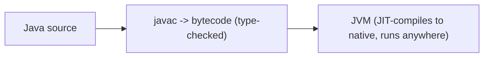
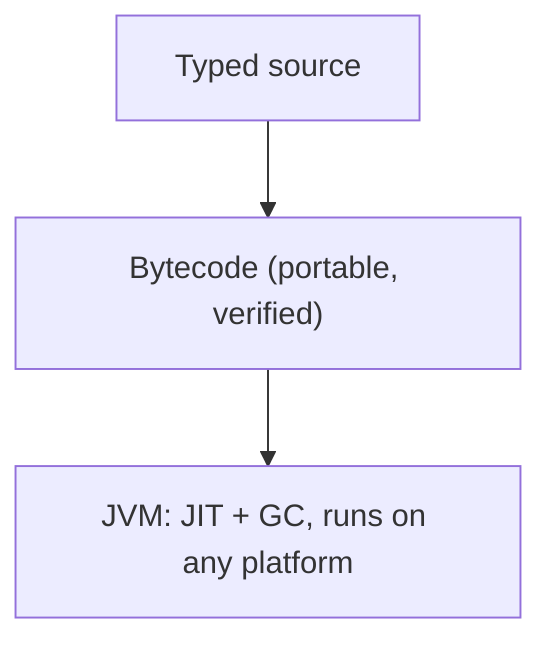
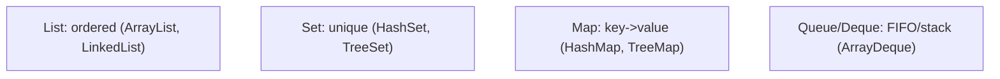
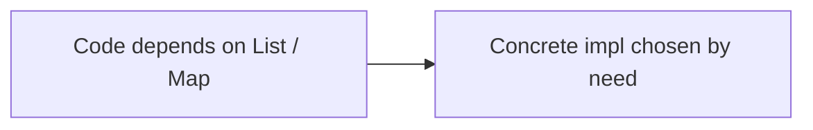
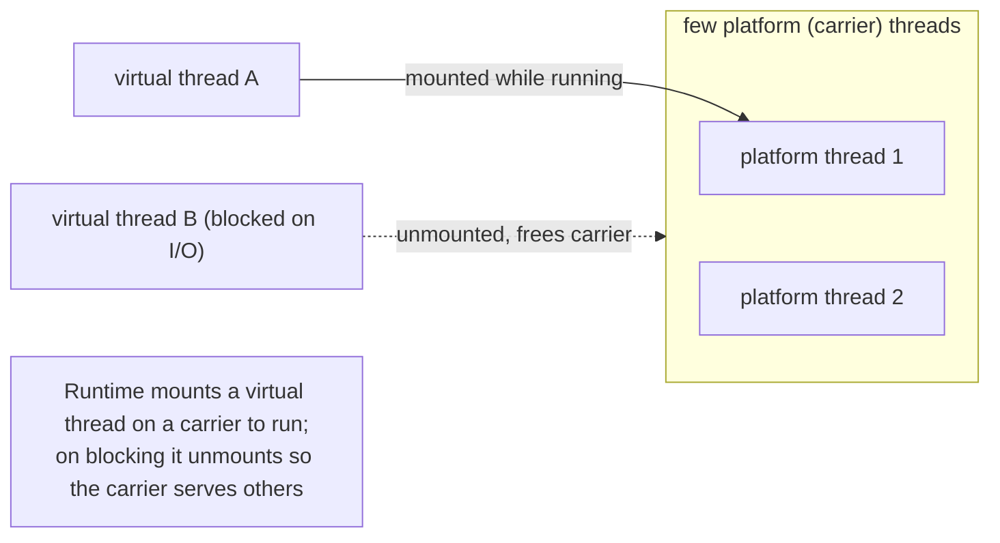
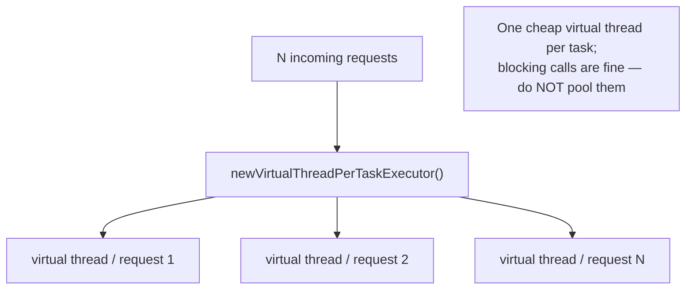

# Java 25 - Complete Professional Guide

> **Category:** 01_programming_languages · **Language:** English

---

### The type system, the JVM, collections, and modern concurrency
**Original guide written from first principles, current to 2026 (Java 25 LTS)**

> **Original reference book (English).** This is an **independent, originally written** guide. It is not an extract, summary, or paraphrase of any third-party book; it teaches Java from first principles with original examples. Canonical books are listed under **References** as pointers only. Each chapter follows the TO-BRAIN editorial standard (see `FILE_CONVENTIONS.md`).
>
> **Scope notice:** Java is a statically-typed, object-oriented language running on the JVM, prized for stability, performance, and a vast ecosystem. This guide covers its type system, the collections framework, and modern concurrency, current to 2026 (Java 25 LTS, records, sealed types, virtual threads).

---

## How to read this guide

| Level | Profile | Parts |
|-------|---------|-------|
| 1 — Beginner | New to Java | Part I |
| 2 — Intermediate | Building applications | Part II |

**Target audience:** developers learning Java for backend, enterprise, or Android-adjacent work.

**Structure of each chapter:** Introduction · Business context · Theoretical concepts · Architecture · Diagrams (Mermaid) · Real examples · Step by step · Complete examples · Exercises · Challenges · Checklist · Best practices · Anti-patterns · Troubleshooting · References.

> **Note on prerequisites.** Assumes basic programming and OO concepts.

---

## Table of Contents

**Part I – Foundations**
1. Static typing and the JVM
2. The collections framework and generics

**Part II – Modern Java**
3. Concurrency with virtual threads

> **Status of this guide:** complete for its declared scope. **Ready:** Parts I–II (Ch. 1–3).

---

## Part I – Foundations

Java's enduring value comes from two things: a **static type system** that catches errors at compile time and documents intent, and the **JVM** that runs the same bytecode everywhere with strong performance. Modern Java (records, sealed types, pattern matching, virtual threads) keeps the strengths while shedding much old verbosity.

---

## Chapter 1 — Static typing and the JVM

### 1.1 Introduction

Java is **statically typed**: every variable has a type known at compile time, and the compiler rejects type-mismatched code before it runs. It compiles to **bytecode** that runs on the **Java Virtual Machine (JVM)** — "write once, run anywhere" — with just-in-time compilation giving near-native speed. Static typing plus the JVM is why Java scales to huge, long-lived codebases.

### 1.2 Business context

For large, long-lived systems, static typing is a major asset: whole classes of bugs are caught at compile time, types document the code, and powerful IDE tooling (refactoring, navigation) relies on them. The JVM provides portability, mature operations tooling, and excellent performance. Together they make Java a safe choice for enterprise systems that must run reliably for years — which is why it dominates large backends. The trade-off (more ceremony than dynamic languages) keeps shrinking with modern features.

### 1.3 Theoretical concepts: compile-time safety, portable runtime



The compiler enforces types, so `String s = 5;` fails before running. Bytecode is portable; the JVM JIT-compiles hot paths to native code for speed and manages memory via garbage collection. Modern type features — **records** (concise immutable data), **sealed** types (closed hierarchies), **pattern matching** — make the type system more expressive with less boilerplate.

### 1.4 Architecture: source → bytecode → JVM



### 1.5 Real example

**Scenario.** Model an immutable "money" value.

**Problem.** Old Java needed a verbose class (fields, constructor, getters, equals, hashCode, toString) — lots of boilerplate.

**Solution.** A **record** declares the immutable data in one line; the compiler generates the rest, type-checked.

**Implementation.**

```java
// Modern Java: a record — concise, immutable, type-safe
public record Money(long cents, String currency) {
    public Money {                            // compact constructor: validate
        if (cents < 0) throw new IllegalArgumentException("cents must be >= 0");
    }
}

Money m = new Money(500, "BRL");
// m.cents(), m.currency(), equals/hashCode/toString are generated and type-checked
// Money bad = new Money("x", 5);  // compile error: wrong types
```

**Result.** The immutable value is one expressive, type-safe declaration; the compiler generates accessors/equals/hashCode and rejects type errors. Modern Java keeps the safety without the old verbosity.

**Future improvements.** Use sealed types + pattern matching to model closed sets of cases (e.g. payment outcomes) safely.

### 1.6 Exercises

1. What does "statically typed" give you?
2. What is bytecode and why does the JVM matter?
3. What boilerplate does a record remove?

### 1.7 Challenges

- **Challenge.** Take a verbose data class you have. Convert it to a record. What did the compiler generate for you?

### 1.8 Checklist

- [ ] I understand compile-time type checking.
- [ ] I know code runs as bytecode on the JVM.
- [ ] I use records for immutable data.
- [ ] I let types document and enforce intent.

### 1.9 Best practices

- Lean on the type system; let the compiler catch errors.
- Use records/sealed types/pattern matching for concise, safe modeling.
- Prefer immutability (records, `final`).

### 1.10 Anti-patterns

- Hand-writing boilerplate records replace.
- Defeating types with raw types or excessive casting.
- Mutable data where an immutable record fits.

### 1.11 Troubleshooting

| Symptom | Likely cause | Action |
|---------|--------------|--------|
| Verbose data classes | Pre-record style | Use records |
| Runtime ClassCastException | Defeating the type system | Use generics/sealed types properly |
| "Works on my machine" runtime diffs | JVM/version mismatch | Pin the JDK version; build reproducibly |

### 1.12 References

- C. Horstmann, *Core Java*, Vol. I & II, 12th ed. (Oracle Press / Pearson, 2021–2022) — ISBN 978-0137673629.
- Java SE documentation: https://docs.oracle.com/en/java/.

---

## Chapter 2 — Collections and generics

### 2.1 Introduction

The **Java Collections Framework** provides the standard data structures — `List`, `Set`, `Map`, `Queue` — behind clean interfaces, with multiple implementations (`ArrayList`, `HashMap`, etc.). **Generics** make them **type-safe**: a `List<String>` holds only strings, checked at compile time. Together they're the workhorses of everyday Java — pick the right interface and implementation for the job.

### 2.2 Business context

Using collections and generics correctly produces code that's both safe (no ClassCastExceptions from heterogeneous collections) and efficient (right structure for the access pattern). The interface/implementation split lets you program to `List`/`Map` and swap implementations as needs change. Mastery here underlies most Java code; misuse (wrong structure, raw types) causes performance problems and runtime errors that generics were designed to prevent.

### 2.3 Theoretical concepts: interfaces, implementations, type-safety



Program to the **interface** (`List`, `Map`), choose the **implementation** by characteristics (`ArrayList` for index access, `HashMap` for O(1) lookup, `TreeMap` for sorted keys). **Generics** (`Map<String, Integer>`) ensure only the declared types go in/out, caught at compile time — no casting, no runtime type surprises.

### 2.4 Architecture: program to interfaces



### 2.5 Real example

**Scenario.** Count occurrences of words.

**Problem.** A raw, untyped map needs casting and risks ClassCastException; the wrong structure is slow.

**Solution.** A generic `Map<String, Integer>` (or `merge`) gives type-safe, efficient counting.

**Implementation.**

```java
Map<String, Integer> counts = new HashMap<>();          // type-safe, O(1) lookups
for (String w : text.split("\\s+")) {
    counts.merge(w, 1, Integer::sum);                   // increment count safely
}
// counts.get("the") is an Integer — no casting, checked at compile time
```

**Result.** Counting is type-safe (only `String` keys, `Integer` values) and efficient (`HashMap` O(1)); generics removed casts and the risk of runtime type errors. The right interface + implementation made it clean.

**Future improvements.** Use the Streams API (`Collectors.groupingBy`) for declarative grouping/counting.

### 2.6 Exercises

1. Why program to `List`/`Map` interfaces?
2. How do generics provide type safety?
3. When choose `TreeMap` over `HashMap`?

### 2.7 Challenges

- **Challenge.** Find a raw-typed collection in code. Add generics and pick the right implementation for its access pattern. What errors does the compiler now catch?

### 2.8 Checklist

- [ ] I program to collection interfaces.
- [ ] I choose implementations by access pattern.
- [ ] I use generics for type safety.
- [ ] I avoid raw types and casting.

### 2.9 Best practices

- Depend on `List`/`Set`/`Map` interfaces.
- Pick implementations by performance characteristics.
- Always parameterize generics; never use raw types.

### 2.10 Anti-patterns

- Raw collections requiring casts.
- Wrong structure (e.g. `LinkedList` for index access).
- Exposing concrete types instead of interfaces in APIs.

### 2.11 Troubleshooting

| Symptom | Likely cause | Action |
|---------|--------------|--------|
| ClassCastException | Raw/untyped collection | Add generics |
| Slow lookups/inserts | Wrong implementation | Choose by access pattern |
| Rigid API | Returns concrete types | Return interfaces |

### 2.12 References

- C. Horstmann, *Core Java*, Vol. I, 12th ed. — ISBN 978-0137673629.
- Java Collections tutorial: https://docs.oracle.com/javase/tutorial/collections/.

---

> **End of Part I.** You can now work with Java's foundations: a **static type system** (now concise via records, sealed types, pattern matching) that catches errors at compile time, running as portable bytecode on the **JVM**, and the **collections framework** with **generics** for type-safe, efficient data handling programmed to interfaces. **Part II — Modern Java** (Chapter 3) covers concurrency with **virtual threads** (Java 21+), which make high-concurrency code simple by giving each task a cheap thread without blocking platform threads.

---

## Part II – Modern Java

The Java of 2025 is far more concise and scalable than its reputation. Part II covers the single change that most reshapes how everyday server code is written: **virtual threads** (final in Java 21), which let you keep simple, blocking, one-thread-per-task code while scaling to hundreds of thousands of concurrent tasks.

---

## Chapter 3 — Concurrency with virtual threads

### 3.1 Introduction

As of Java 21 there are **two kinds of threads**. A **platform thread** is a thin wrapper over an operating-system thread, scheduled by the OS. A **virtual thread** runs *on top of* platform threads and is scheduled by the Java runtime. Virtual threads are **cheap** — you can create hundreds of thousands of them — because when one **blocks** (on I/O, a lock, `sleep`), it steps off its carrier platform thread and frees it for other work. The payoff: you write ordinary, sequential, blocking code (one thread per task) and it scales like hand-written asynchronous code, without the callback or reactive complexity.

### 3.2 Business context

A typical web service handles a very large number of concurrent requests, most of them **I/O-bound** — waiting on a database, a cache, or another service. With platform threads this forces a trade-off: platform threads are heavyweight (thousands of CPU instructions to start, plus reserved memory), so you cap them in a **pool** and, once the pool is saturated, either queue requests or rewrite everything in an asynchronous/reactive style that is hard to read and debug. Virtual threads remove the trade-off: give **each request its own virtual thread**, let it block freely, and the runtime multiplexes thousands of them onto a small set of carriers. Simple code, high throughput.

### 3.3 Theoretical concepts: platform vs. virtual threads



Platform threads use **preemptive** OS scheduling; virtual threads use **cooperative** scheduling and lose control only when they block or yield. You create them three ways: `Thread.startVirtualThread(runnable)`, `Thread.ofVirtual().start(runnable)`, or — most commonly — an executor from `Executors.newVirtualThreadPerTaskExecutor()`, which runs **each submitted task on its own new virtual thread**. Tasks are `Runnable` (no result) or `Callable<V>` (returns `V`); submitting a `Callable` yields a `Future<V>` whose `get()` blocks until the result is ready.

### 3.4 Architecture: thread-per-task, not thread-pool



`ExecutorService` is `AutoCloseable`, so a try-with-resources block submits work and waits for every task to finish at the closing brace. The mental model returns to the simplest one — **one thread per task** — because the threads are now cheap enough to make that practical.

### 3.5 Real example

**Scenario.** A request must call several slow downstream services and combine their results.

**Problem.** Doing the calls sequentially is slow; using a bounded platform-thread pool makes them compete for a few threads; rewriting in a reactive style is complex.

**Solution.** Submit one `Callable` per downstream call to a **virtual-thread-per-task** executor; each runs on its own virtual thread and blocks freely.

**Implementation.**

```java
record Profile(String user, List<String> orders, int credit) {}

Profile loadProfile(String user) throws Exception {
    // Each submitted task runs on its OWN new virtual thread.
    try (var executor = Executors.newVirtualThreadPerTaskExecutor()) {
        Future<List<String>> orders = executor.submit(() -> orderService.list(user)); // blocks — fine
        Future<Integer>      credit = executor.submit(() -> creditService.score(user));
        // get() blocks until each virtual thread finishes; both run concurrently.
        return new Profile(user, orders.get(), credit.get());
    } // executor.close() waits for all tasks, then releases resources
}
```

**Result.** The two downstream calls run **concurrently** on separate virtual threads; the code reads like a straight-line synchronous function — no callbacks, no manual thread pool sizing. Scaled to one virtual thread per request, a single server can hold hundreds of thousands of in-flight, blocked tasks cheaply.

**Future improvements.** Use **structured concurrency** (`StructuredTaskScope`) to treat the sub-tasks as a unit — cancel the siblings if one fails, and propagate deadlines — instead of managing `Future`s by hand.

### 3.6 Exercises

1. What is the difference between a platform thread and a virtual thread, and who schedules each?
2. Why does blocking a virtual thread *not* tie up an operating-system thread?
3. When you submit a `Callable<V>` to an executor, what do you get back, and what does its `get()` do?

### 3.7 Challenges

- **Challenge.** Launch 100,000 virtual threads that each sleep one second and print, using `newVirtualThreadPerTaskExecutor()`. Observe that it completes in about a second. Then try the same with a fixed platform-thread pool and compare.

### 3.8 Checklist

- [ ] I give each task its own virtual thread instead of pooling virtual threads.
- [ ] I reserve virtual threads for I/O-bound work, not CPU-bound parallelism.
- [ ] I use try-with-resources on the executor so all tasks complete before I continue.
- [ ] I keep tasks blocking-but-simple rather than reaching for reactive code.

### 3.9 Best practices

- Use `newVirtualThreadPerTaskExecutor()` (or `Thread.ofVirtual()`); never pool virtual threads — pooling defeats their purpose.
- Keep them for blocking/I/O-bound tasks; use a sized platform-thread pool for CPU-bound parallelism.
- Avoid `synchronized` around blocking calls (it can **pin** a virtual thread to its carrier); prefer `ReentrantLock`.

### 3.10 Anti-patterns

- Pooling or rate-limiting virtual threads as if they were scarce.
- Storing large per-thread state in `ThreadLocal` across millions of threads.
- Using virtual threads for CPU-bound number crunching (no benefit — they still need a carrier).

### 3.11 Troubleshooting

| Symptom | Likely cause | Action |
|---------|--------------|--------|
| No speedup vs. platform threads | Workload is CPU-bound | Virtual threads help I/O-bound work; use a platform pool for CPU work |
| Throughput collapses under load | Virtual thread **pinned** by `synchronized` over a blocking call | Replace `synchronized` with `ReentrantLock` |
| Tasks not finished after the block | Executor not closed / not awaited | Use try-with-resources so `close()` awaits all tasks |

### 3.12 References

- C. Horstmann, *Core Java*, Vol. I, 12th ed., ch. 10 "Concurrency", §10.3 (platform vs. virtual threads, executors) — ISBN 978-0137673629.
- JEP 444, "Virtual Threads" (final in Java 21): https://openjdk.org/jeps/444.

---

> **End of Part II.** Java's **virtual threads** make the simplest concurrency model — one thread per task, written with ordinary blocking calls — scale to hundreds of thousands of concurrent tasks, because a blocked virtual thread releases its carrier instead of an OS thread. With Part I's compile-time **type system** on the **JVM** and the **collections framework with generics**, you now have Java's foundations plus the modern concurrency model that powers today's high-throughput services.
