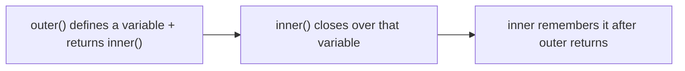
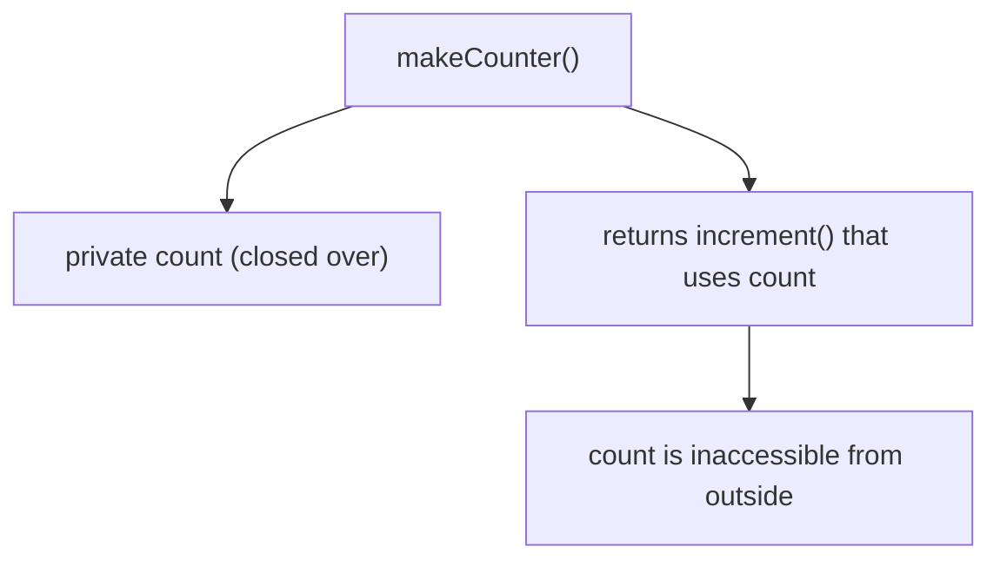
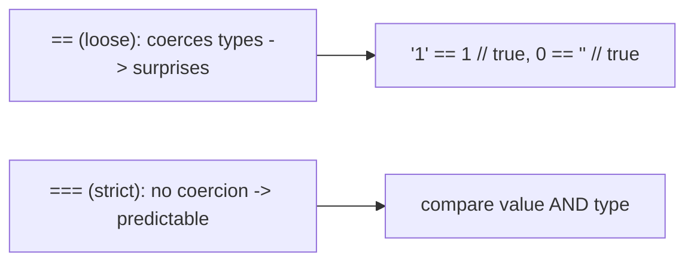
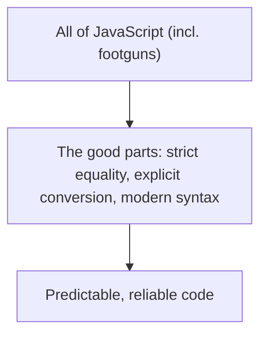

# JavaScript - Complete Professional Guide

> **Category:** 01_programming_languages · **Language:** English

---

### Closures, the type system, and the good parts
**Original guide written from first principles, current to 2026 (ES2026)**

> **Original reference book (English).** This is an **independent, originally written** guide. It is not an extract, summary, or paraphrase of any third-party book; it teaches JavaScript from first principles with original examples. Canonical books are listed under **References** as pointers only. Each chapter follows the TO-BRAIN editorial standard (see `FILE_CONVENTIONS.md`).
>
> **Scope notice:** JavaScript runs everywhere (browsers, servers, tooling) and has powerful features alongside notorious pitfalls. This guide covers its defining concepts — functions and closures, the type/coercion model — and the disciplined "good parts" subset, current to 2026 (modern ES, modules).

---

## How to read this guide

| Level | Profile | Parts |
|-------|---------|-------|
| 1 — Beginner | New to JS | Part I |
| 2 — Intermediate | Writing solid JS | Part II |

**Target audience:** developers learning JavaScript for the web, Node, or tooling.

**Structure of each chapter:** Introduction · Business context · Theoretical concepts · Architecture · Diagrams (Mermaid) · Real examples · Step by step · Complete examples · Exercises · Challenges · Checklist · Best practices · Anti-patterns · Troubleshooting · References.

> **Note on prerequisites.** Assumes basic programming concepts.

---

## Table of Contents

**Part I – The core**
1. Functions and closures
2. Types, coercion, and the good parts

**Part II – Modern JS**
3. Prototypes, classes, and modules

> **Status of this guide:** phased delivery. **Ready:** Part I (Ch. 1–2). **In progress:** Part II.

---

## Part I – The core

JavaScript is a language of great power and sharp edges. Its best feature is **functions as first-class values** with **closures**; its most dangerous areas are loose **type coercion** and a few legacy footguns. The path to writing it well is to deeply understand functions/closures and to stick to the disciplined subset (the "good parts") while avoiding the known traps.

---

## Chapter 1 — Functions and closures

### 1.1 Introduction

In JavaScript, **functions are values**: you can pass them as arguments, return them, and store them. A **closure** is a function that "remembers" the variables of the scope where it was created, even after that scope has returned. Closures are JavaScript's most powerful concept — the basis of callbacks, module privacy, and functional patterns.

### 1.2 Business context

Closures and first-class functions underpin nearly all JavaScript patterns — event handlers, async callbacks, module encapsulation, functional composition. Understanding them is the difference between writing JavaScript and fighting it. Misunderstanding closures (e.g. capturing loop variables wrongly) causes subtle, common bugs. Mastery enables the encapsulation and composition patterns that make JS codebases maintainable — a core skill for any web/Node developer.

### 1.3 Theoretical concepts: a function plus its scope



A closure captures variables by **reference** to the enclosing scope. This lets a returned function keep private state. Use `let`/`const` (block-scoped) — not `var` (function-scoped, a classic closure-in-loops footgun). Closures enable **data privacy** (variables not exposed outside) and **factory functions** (functions that produce configured functions).

### 1.4 Architecture: private state via closure



### 1.5 Real example

**Scenario.** Create counters that each keep their own private count.

**Problem.** A global count is shared and exposed; you want independent, encapsulated counters.

**Solution.** A factory function whose returned closure captures a private `count`.

**Implementation.**

```js
function makeCounter() {
  let count = 0;                  // private, captured by the closure
  return () => ++count;          // closure remembers `count`
}

const a = makeCounter();
const b = makeCounter();
a(); a();   // 1, 2  (a's own count)
b();        // 1     (b's independent count)
// `count` is not accessible from outside — true encapsulation
```

**Result.** Each counter has its own private, encapsulated state via closure — independent and inaccessible from outside. First-class functions + closures gave clean encapsulation with no classes needed.

**Future improvements.** The same pattern underlies module privacy and memoization; recognize closures wherever state must persist across calls.

### 1.6 Exercises

1. What is a closure?
2. Why use `let`/`const` over `var` regarding closures?
3. How do closures provide private state?

### 1.7 Challenges

- **Challenge.** Write a `once(fn)` that returns a function running `fn` only the first time (caching the result) using a closure for state.

### 1.8 Checklist

- [ ] I treat functions as first-class values.
- [ ] I understand closures capture enclosing scope.
- [ ] I use `let`/`const`, not `var`.
- [ ] I use closures for private state/factories.

### 1.9 Best practices

- Use closures for encapsulation and configured functions.
- Always use `let`/`const` (block scope).
- Pass functions as values for composition.

### 1.10 Anti-patterns

- `var` in loops creating closure bugs.
- Leaking what should be private state.
- Deeply nested callbacks (use promises/async).

### 1.11 Troubleshooting

| Symptom | Likely cause | Action |
|---------|--------------|--------|
| Loop closures share one value | `var` function scope | Use `let` (block scope) |
| State leaks/globals | Not using closures | Encapsulate in a closure/factory |
| Unexpected shared state | Closure captures by reference | Capture per-iteration with `let`/params |

### 1.12 References

- M. Haverbeke, *Eloquent JavaScript*, 4th ed. (No Starch Press, 2024) — ISBN 978-1718503069; https://eloquentjavascript.net.
- MDN, "Closures": https://developer.mozilla.org/en-US/docs/Web/JavaScript/Closures.

---

## Chapter 2 — Types, coercion, and the good parts

### 2.1 Introduction

JavaScript has a small set of types and a habit of **coercing** them automatically, which is the source of many infamous quirks (`[] + {}`, `==` surprises). The professional approach, popularized as the **"good parts,"** is to use the reliable subset and discipline: strict equality (`===`), strict mode, and avoiding coercion traps. You don't use *all* of JavaScript — you use the good parts well.

### 2.2 Business context

JavaScript's loose coercion causes real bugs: `"1" == 1` is true, `0 == ""` is true, and arithmetic on mixed types yields surprises. These cause data corruption and hard-to-find defects. Sticking to a disciplined subset (strict equality, explicit conversions, modern syntax, and increasingly TypeScript) eliminates whole bug classes. Teams that adopt this discipline ship far more reliable JavaScript — which is why linters and TypeScript are now standard.

### 2.3 Theoretical concepts: avoid coercion; use the strict subset



The good-parts discipline: always use `===`/`!==` (no coercion), enable strict mode (`"use strict"` / modules are strict by default), convert types **explicitly** (`Number(x)`, `String(x)`), and avoid known footguns. Modern JS (ES modules, `let`/`const`, arrow functions, destructuring, optional chaining) is the safe, expressive core. For larger codebases, **TypeScript** adds static types over this subset.

### 2.4 Architecture: discipline over the whole language



### 2.5 Real example

**Scenario.** Validate that a numeric input equals an expected value.

**Problem.** Using `==` coerces types: `"0" == 0` and `"" == 0` are true, causing wrong validation.

**Solution.** Use `===` and explicit conversion so comparisons are predictable.

**Implementation.**

```js
// BUGGY: loose equality coerces -> surprises
if (input == 0) { /* matches "0", "", false, [] ... */ }   // wrong

// GOOD PARTS: convert explicitly, compare strictly
const n = Number(input);
if (Number.isNaN(n)) { /* handle non-numeric input */ }
else if (n === 0) { /* exact, predictable match */ }
```

**Result.** Validation is predictable: input is explicitly converted and compared with strict equality, avoiding the coercion traps that made `==` accept `""`, `"0"`, `false`, etc. The good-parts discipline removed the bug class.

**Future improvements.** Adopt TypeScript (or JSDoc types) to catch type mismatches at build time across the codebase.

### 2.6 Exercises

1. Why prefer `===` over `==`?
2. Give two coercion surprises with `==`.
3. What does "use the good parts" mean?

### 2.7 Challenges

- **Challenge.** Find a `==` comparison in code. Determine if coercion could cause a wrong result. Replace with `===` + explicit conversion.

### 2.8 Checklist

- [ ] I use `===`/`!==` always.
- [ ] I convert types explicitly.
- [ ] I use strict mode / modules.
- [ ] I stick to modern, safe syntax (and consider TypeScript).

### 2.9 Best practices

- Strict equality and explicit conversions everywhere.
- Use a linter to enforce the safe subset.
- Adopt TypeScript for larger codebases.

### 2.10 Anti-patterns

- `==`/`!=` loose comparisons.
- Relying on implicit coercion in arithmetic/logic.
- Using deprecated/footgun features (`with`, `var`, global leaks).

### 2.11 Troubleshooting

| Symptom | Likely cause | Action |
|---------|--------------|--------|
| Wrong comparison results | Loose `==` coercion | Use `===` + explicit conversion |
| Subtle type bugs | Implicit coercion | Convert explicitly; lint; add types |
| Legacy footgun bugs | Old/unsafe features | Use modern syntax + strict mode |

### 2.12 References

- M. Haverbeke, *Eloquent JavaScript*, 4th ed. (No Starch Press, 2024) — ISBN 978-1718503069.
- D. Crockford, *JavaScript: The Good Parts* (O'Reilly, 2008) — ISBN 978-0596517748; MDN: https://developer.mozilla.org/en-US/docs/Web/JavaScript.

---

> **End of Part I.** You can now work with JavaScript's core: **first-class functions and closures** (which power encapsulation, factories, and async patterns — using `let`/`const`, not `var`), and the **good-parts discipline** over its loose type model (strict equality, explicit conversion, modern syntax, optionally TypeScript) that eliminates whole classes of coercion bugs. **Part II — Modern JS** (Chapter 3) covers the prototype model behind objects, `class` syntax, and ES modules for structuring real applications.

<!--APPEND-PART-II-->
