# PHP 8.4 - Complete Professional Guide

> **Category:** 01_programming_languages · **Language:** English

---

### Types, OOP, Enums, Attributes, Fibers, Property Hooks, Composer, PSR
**Edition for PHP 8.4**

> **Reference book (English).** Based on the official PHP documentation (php.net), the PHP RFC archive (wiki.php.net), and the PHP-FIG standards (php-fig.org). A professional, in-depth guide for developers, architects, and teams writing modern, typed, production-grade PHP.
>
> **Scope notice:** this book targets **PHP 8.4** and the idioms of *modern* PHP — strict types, value objects, enums, attributes, fibers, and the 8.4 additions (property hooks, asymmetric visibility, `new` without parentheses, the `#[\Deprecated]` attribute). It assumes you can already run a PHP script and read basic code; from there it builds toward enterprise practice. Each chapter follows the TO-BRAIN editorial standard (see `FILE_CONVENTIONS.md`).

---

## How to read this book

Progressive depth across five maturity levels:

| Level | Profile | Parts |
|-------|---------|-------|
| 1 — Beginner | New to typed/modern PHP | Part I |
| 2 — Intermediate | Functions, arrays, OOP basics | Parts II–III |
| 3 — Advanced | Modern features, errors, namespaces | Parts IV–V |
| 4 — Specialist | Stdlib, dates, database, HTTP | Part VI |
| 5 — Enterprise | Testing, performance, security, deployment | Parts VII–VIII |

**Target audience:** backend developers, full-stack engineers, software architects, tech leads, and CTOs building or modernizing PHP systems on 8.4.

**Structure of each chapter:** Introduction · Business context · Theoretical concepts · Architecture · Diagrams (Mermaid) · Real examples · Step by step · Complete code · Exercises · Challenges · Checklist · Best practices · Anti-patterns · Troubleshooting · Official references.

**Example format:** Scenario · Problem · Solution · Implementation · Result · Future improvements.

> **Note on prerequisites.** All code in this book uses `declare(strict_types=1);` and full type declarations. Where an 8.4 feature replaces an older pattern (e.g., property hooks vs. hand-written getters/setters), we show both so you can recognize and migrate legacy code.

---

## Table of Contents

**Part I – Language Foundations & Types**
1. Syntax, values, and the scalar type system
2. Type declarations: nullable, union, and intersection types
3. `strict_types`, coercion, and `mixed`/`never`/`void`

**Part II – Functions & Arrays**
4. Functions, parameters, named arguments, variadics
5. Arrays, the array functions, and the spread operator
6. Closures, arrow functions, and first-class callable syntax

**Part III – Object-Oriented PHP**
7. Classes, properties, constructor promotion, `readonly`
8. Interfaces, abstract classes, and traits
9. Enums (pure and backed) and first-class callables on methods

**Part IV – Modern Language Features**
10. Attributes and reflection
11. `match`, named args, and `new` in initializers
12. Fibers and cooperative concurrency
13. Property hooks and asymmetric visibility (8.4)

**Part V – Errors, Namespaces & Autoloading**
14. Errors vs. exceptions, the Throwable hierarchy
15. Namespaces, Composer, and PSR-4 autoloading
16. Deprecations with `#[\Deprecated]`

**Part VI – Standard Library, Dates, Database & HTTP**
17. Strings, `mb_*`, and the standard library
18. Dates and `DateTimeImmutable`
19. Databases with PDO
20. HTTP and PSR-7/PSR-15

**Part VII – Testing & Performance**
21. Testing with PHPUnit
22. Performance: OPcache and the JIT

**Part VIII – Security & Deployment**
23. Security: input, output, secrets, and crypto
24. Deployment: configuration, processes, and observability

> **Status of this edition:** complete for its declared scope. **Ready:** Parts I–VIII (Ch. 1–24).

---

## Part I – Language Foundations & Types

Part I establishes the bedrock: how PHP represents values, how the type system constrains them, and how `strict_types` changes the rules. Modern PHP is a *typed* language in practice — the engine still runs untyped code, but professional codebases declare types everywhere and let the runtime enforce contracts. The three chapters here give you the vocabulary (scalars, compound types, special types) and the discipline (strict mode) that every later chapter assumes.

---

## Chapter 1 — Syntax, values, and the scalar type system

### 1.1 Introduction

PHP is a dynamically typed, interpreted language whose engine (the Zend Engine) compiles source to opcodes and executes them, optionally caching the opcodes (OPcache) and JIT-compiling hot paths. A *value* in PHP has one of a small set of primitive types: `bool`, `int`, `float`, `string`, plus the compound `array` and `object`, and the special `null`, `callable`, `iterable`, and `resource`. This chapter focuses on the **scalars** — `bool`, `int`, `float`, `string` — because they are the atoms from which every richer abstraction is built, and because misunderstanding their conversion rules is the single most common source of subtle bugs.

PHP 8.4 inherits the scalar model unchanged in shape but continues to tighten its edges: implicit, lossy conversions emit deprecation notices, and `strict_types=1` (covered in Chapter 3) lets you opt out of coercion entirely.

### 1.2 Business context

Scalars look trivial, yet they carry real money risk. A `float` used for currency loses cents to binary rounding; a numeric string from a form silently coerced to `int` can drop a leading zero in a postal code; a "truthy" string can flip a feature flag the wrong way. Teams that standardize early on *which scalar represents which concept* — integers in minor units for money, `DateTimeImmutable` for time, validated strings for identifiers — prevent entire classes of production incidents. The business case for understanding scalars is simply correctness at the boundary where untrusted input becomes typed program state.

### 1.3 Theoretical concepts

A scalar is a single, indivisible value. PHP's four scalar types have well-defined literals, ranges, and conversion rules:

- **`bool`** — `true` / `false`. Many values are *falsy*: `false`, `0`, `0.0`, `""`, `"0"`, `[]`, and `null`. Everything else is truthy (notably `"false"` and `"0.0"` are truthy).
- **`int`** — platform-width signed integer (64-bit on modern systems). Literals support `_` separators, hex `0x`, octal `0o`/`0`, and binary `0b`.
- **`float`** — IEEE-754 double. Never use for money. Compare with a tolerance, never with `===`.
- **`string`** — a byte sequence (not inherently Unicode); use `mb_*` functions for multibyte text.

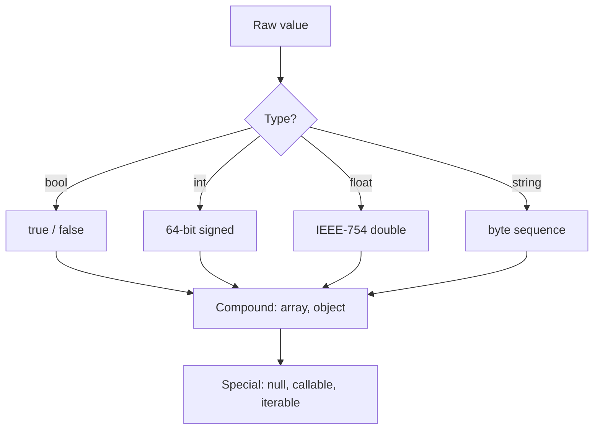

### 1.4 Architecture

Where do scalars sit in the runtime? Every PHP value is stored in a `zval` container that tracks both the value and its type tag. Coercion happens when an operation expects a type different from the tag; the engine either converts (non-strict) or throws a `TypeError` (strict, for typed boundaries).

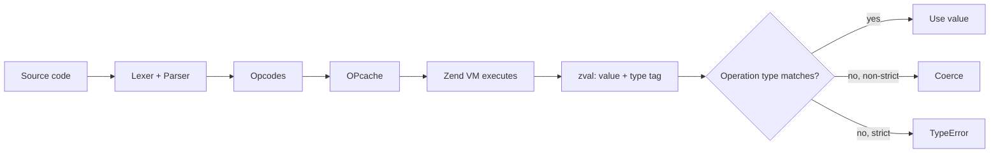

### 1.5 Real example

**Scenario.** A checkout service receives a price and a quantity from an HTTP form and must compute a line total.

**Problem.** Storing money as `float` produces rounding errors (`0.1 + 0.2 !== 0.3`), and the raw POST values arrive as strings.

**Solution.** Represent money as integer **cents**, validate the inputs explicitly, and never let a `float` touch the total.

**Implementation.**

```php
<?php

declare(strict_types=1);

/**
 * Parse a money string like "19.99" into integer cents (1999).
 */
function parseCents(string $amount): int
{
    if (!preg_match('/^\d+(?:\.\d{1,2})?$/', $amount)) {
        throw new InvalidArgumentException("Invalid money: {$amount}");
    }

    [$whole, $frac] = array_pad(explode('.', $amount), 2, '0');
    $frac = str_pad($frac, 2, '0');           // "9" -> "90"

    return (int) $whole * 100 + (int) $frac;
}

function lineTotalCents(string $unitPrice, string $qty): int
{
    $quantity = filter_var($qty, FILTER_VALIDATE_INT);
    if ($quantity === false || $quantity < 1) {
        throw new InvalidArgumentException("Invalid quantity: {$qty}");
    }

    return parseCents($unitPrice) * $quantity;
}

function formatCents(int $cents): string
{
    return number_format($cents / 100, 2, '.', ',');
}

$total = lineTotalCents('19.99', '3');
echo formatCents($total) . PHP_EOL;   // 59.97
```

**Result.** The total is exact, the inputs are validated, and `float` appears only at the final formatting step where rounding is harmless.

**Future improvements.** Promote money to a dedicated `readonly` value object (Chapter 7) with `Currency`, and use an enum for currency codes (Chapter 9), so the type system enforces that you never add USD to EUR.

### 1.6 Exercises

1. Write a function `isTruthy(mixed $v): bool` and predict the result for `"0"`, `"0.0"`, `"false"`, `[]`, and `0.0`.
2. Print the largest `int` (`PHP_INT_MAX`), then add 1 and observe the conversion to `float`.
3. Parse `"007"` with `(int)` and with `FILTER_VALIDATE_INT`; explain the difference for identifiers like a US zip code.
4. Demonstrate why `0.1 + 0.2 === 0.3` is `false` and write a tolerance-based comparison helper.

### 1.7 Challenges

1. Implement a `Money` parser that supports thousands separators (`"1,234.50"`) and rejects more than two decimal places, with full strict typing.
2. Build a tiny CSV cleaner that reads numeric columns as `int` cents and reports every row that fails validation, without throwing on the first error.

### 1.8 Checklist

- [ ] I know which values are falsy in PHP.
- [ ] I never store money as `float`.
- [ ] I compare floats with a tolerance, never `===`.
- [ ] I validate string-to-int conversions with `filter_var`/`FILTER_VALIDATE_INT`.
- [ ] I use `mb_*` functions for user-facing text.
- [ ] I understand that a PHP `string` is bytes, not Unicode code points.

### 1.9 Best practices

- Treat the HTTP/CLI boundary as untrusted: validate and convert once, then work with typed values internally.
- Prefer integer minor units for money and `DateTimeImmutable` for time.
- Use numeric separators (`1_000_000`) for readability in large literals.
- Reach for `filter_var` over bare casts when input correctness matters.

### 1.10 Anti-patterns

- Casting user input directly with `(int)`/`(float)` and trusting the result.
- Using `==` (loose equality) for security or business decisions — prefer `===`.
- Comparing floats for exact equality.
- Concatenating untrusted strings into SQL or HTML (covered in Chapters 19 and 23).

### 1.11 Troubleshooting

| Symptom | Likely cause | Fix |
|---|---|---|
| `0.1 + 0.2 !== 0.3` | IEEE-754 float rounding | Use integer cents or `bcmath`/tolerance |
| `"007"` becomes `7` | Lossy `(int)` cast | Keep IDs as validated strings |
| Deprecation on implicit conversion | Lossy float→int or null→string | Add explicit casts / enable strict mode |
| `"0"` treated as false in `if` | `"0"` is falsy | Test explicitly (`$s !== ''`) |
| `==` matches unexpected values | Loose type juggling | Use `===` |

### 1.12 Official references

- Types overview: https://www.php.net/manual/en/language.types.php
- Booleans: https://www.php.net/manual/en/language.types.boolean.php
- Integers: https://www.php.net/manual/en/language.types.integer.php
- Floats: https://www.php.net/manual/en/language.types.float.php
- Strings: https://www.php.net/manual/en/language.types.string.php
- Type juggling: https://www.php.net/manual/en/language.types.type-juggling.php

---

## Chapter 2 — Type declarations: nullable, union, and intersection types

### 2.1 Introduction

PHP lets you declare types on parameters, return values, properties, and class constants. Beyond the single scalar types of Chapter 1, the language supports **nullable** types (`?T`), **union** types (`A|B`), **intersection** types (`A&B`), and combinations of these. These declarations are not mere documentation: the engine enforces them at runtime and a static analyzer (PHPStan, Psalm) enforces them at build time. This chapter shows how to express precise contracts so that invalid states become unrepresentable.

### 2.2 Business context

Every untyped boundary is a place where a wrong value can slip through to production. Type declarations move whole categories of bugs from runtime (a 3 a.m. page) to either the developer's editor or the CI pipeline. For a business, that is cheaper defects, faster onboarding (signatures document intent), and safer refactors (the type checker finds every call site that breaks). Intersection types in particular let you say "this argument must satisfy two capabilities at once" — a powerful way to model rich domain contracts without fragile inheritance.

### 2.3 Theoretical concepts

- **Nullable `?T`** — equivalent to `T|null`; the value is either a `T` or `null`.
- **Union `A|B|C`** — the value is exactly one of the listed types. Useful for `int|string` identifiers or `Result|null`.
- **Intersection `A&B`** — the value must be an instance of *all* listed types (interfaces/classes only). Useful for "is both `Countable` and `Traversable`".
- **Special types** — `mixed` (any), `void` (returns nothing), `never` (never returns), `iterable` (`array|Traversable`), `self`/`static`/`parent`.

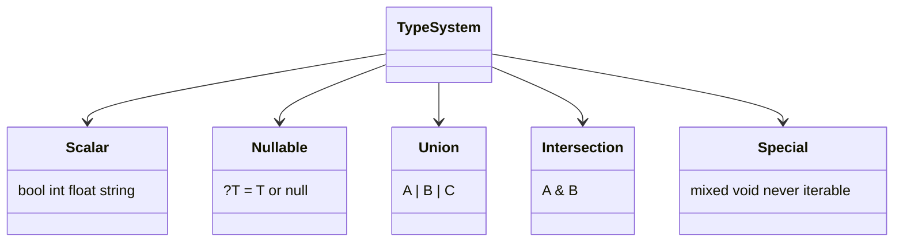

### 2.4 Architecture

Type declarations are checked at two layers that reinforce each other: the static analyzer at build time and the Zend Engine at runtime. A value that violates a declaration raises a `TypeError`. The architecture below shows the flow from a typed signature to enforcement.

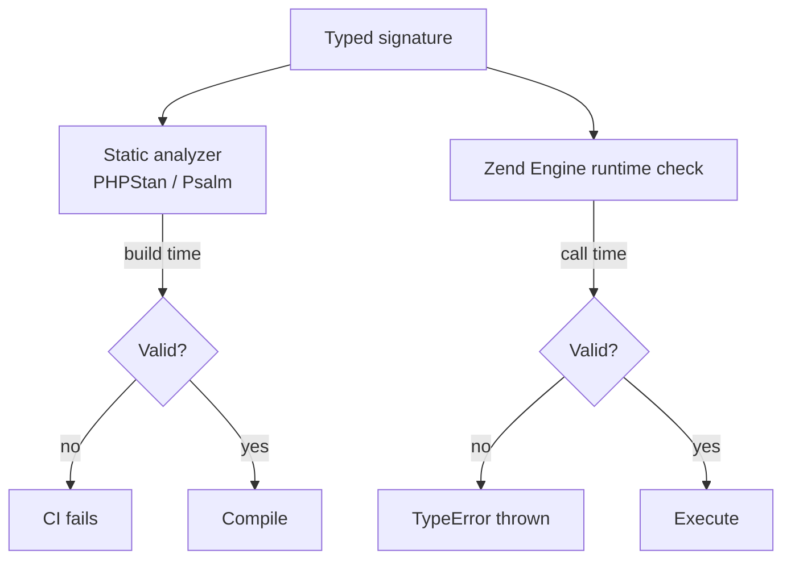

### 2.5 Real example

**Scenario.** A notification service can deliver via email or SMS. A "channel" must be able to both *render* a message and *report* a delivery cost.

**Problem.** Modeling "supports two capabilities" via a deep inheritance tree is rigid; a single interface that bundles unrelated concerns is a leak.

**Solution.** Define two small interfaces and require their **intersection** at the boundary. Use a **union** return for the lookup that may yield a channel or `null`.

**Implementation.**

```php
<?php

declare(strict_types=1);

interface Renderable
{
    public function render(string $message): string;
}

interface Priced
{
    public function costCents(string $message): int;
}

final class EmailChannel implements Renderable, Priced
{
    public function render(string $message): string
    {
        return "Subject: Notification\n\n{$message}";
    }

    public function costCents(string $message): int
    {
        return 0; // email is free in this model
    }
}

final class SmsChannel implements Renderable, Priced
{
    public function render(string $message): string
    {
        return mb_substr($message, 0, 160);
    }

    public function costCents(string $message): int
    {
        return (int) ceil(mb_strlen($message) / 160) * 5;
    }
}

/** Requires BOTH capabilities via an intersection type. */
function dispatch(Renderable&Priced $channel, string $message): int
{
    echo $channel->render($message) . PHP_EOL;
    return $channel->costCents($message);
}

/** Union return: a channel or null when the name is unknown. */
function channelByName(string $name): (Renderable&Priced)|null
{
    return match ($name) {
        'email' => new EmailChannel(),
        'sms'   => new SmsChannel(),
        default => null,
    };
}

$channel = channelByName('sms') ?? throw new RuntimeException('Unknown channel');
$cost = dispatch($channel, 'Your order has shipped.');
echo "Cost: {$cost} cents" . PHP_EOL;
```

**Result.** The compiler and runtime both guarantee that anything passed to `dispatch` can render *and* price a message, with no shared base class.

**Future improvements.** Replace the string channel name with a backed enum (Chapter 9) so `channelByName` cannot be called with an invalid name, and add a `Channel` aggregate interface if the pair of capabilities is always required together.

### 2.6 Exercises

1. Write a function that accepts `int|string` as an identifier and normalizes it to a string.
2. Add a third channel (`PushChannel`) and confirm `dispatch` accepts it with no signature change.
3. Declare a property `private ?DateTimeImmutable $deletedAt` and explain when `null` is meaningful.
4. Change a return type to `never` for a function that always throws; show the analyzer benefits.

### 2.7 Challenges

1. Model a `PaymentMethod` that must be both `Tokenizable` and `Refundable`, then write a processor that only accepts the intersection.
2. Introduce a deliberate type violation and capture the exact `TypeError` message; then fix it and verify PHPStan at level 9 reports nothing.

### 2.8 Checklist

- [ ] Every public function declares parameter and return types.
- [ ] I use `?T` instead of relying on documentation for nullability.
- [ ] I model "all of these capabilities" with intersection types, not god-interfaces.
- [ ] I run a static analyzer at a high level in CI.
- [ ] I prefer `never` for functions that always throw.

### 2.9 Best practices

- Keep interfaces small (interface segregation) so intersections stay expressive.
- Prefer the narrowest type that still compiles; avoid `mixed` unless truly needed.
- Use union types sparingly — many unions hint at a missing abstraction.
- Let the type checker, not comments, document contracts.

### 2.10 Anti-patterns

- Declaring `mixed` everywhere to silence the analyzer.
- Using `@param`/`@return` PHPDoc as the *only* type source when native types exist.
- Wide unions (`int|string|array|object`) that defeat type safety.
- Nullable returns where an exception or a Null Object would be clearer.

### 2.11 Troubleshooting

| Symptom | Likely cause | Fix |
|---|---|---|
| `TypeError` at call site | Argument type mismatch | Fix the caller or widen the parameter |
| Intersection rejected | A type is a scalar/class, not interface-compatible | Use interfaces for intersections |
| Analyzer flags possible `null` | Nullable not handled | Add a guard or `??`/`?->` |
| `void` function "returns null" | Misuse of return value | Don't consume the result of a `void` function |
| `never` function flagged unreachable code | Code after it is dead | Remove the unreachable code |

### 2.12 Official references

- Type declarations: https://www.php.net/manual/en/language.types.declarations.php
- Union types: https://www.php.net/manual/en/language.types.type-system.php
- Intersection types: https://www.php.net/manual/en/language.types.declarations.php#language.types.declarations.composite.intersection
- `null` type: https://www.php.net/manual/en/language.types.null.php
- `never` return type: https://www.php.net/manual/en/migration81.new-features.php

---

## Chapter 3 — `strict_types`, coercion, and `mixed`/`never`/`void`

### 3.1 Introduction

By default PHP runs in *coercive* typing mode: when a typed parameter receives a value of a compatible-but-different scalar type, the engine quietly converts it (`"42"` to `int 42`). The `declare(strict_types=1);` directive flips that file into *strict* mode, where only exact scalar types are accepted (with the single exception of `int` widening to `float`). This chapter explains the two modes, where they apply, and how the special types `mixed`, `void`, and `never` interact with them. Choosing strict mode is the defining decision that separates casual scripts from disciplined applications.

### 3.2 Business context

Coercion is convenient until it hides a bug: a string `"0"` becomes `int 0`, a price `"abc"` becomes `0`, and the error surfaces three layers away as a wrong charge. Strict mode turns these into immediate, localized `TypeError`s at the boundary — failures that are cheap to diagnose. For organizations, mandating `strict_types=1` repository-wide is a low-cost policy with an outsized reduction in "works on my machine" defects, and it makes static analysis dramatically more accurate.

### 3.3 Theoretical concepts

- **Coercive mode (default).** Scalar arguments are converted to the declared type when safe; lossy conversions (e.g., `"1.5"` to `int`) trigger deprecation notices in modern PHP.
- **Strict mode (`declare(strict_types=1);`).** Must be the very first statement in a file. It governs the *calling* file's function calls, not the called function's definitions. Only `int`→`float` widening is allowed.
- **`mixed`** accepts any value; it is the top type and effectively disables checking for that slot.
- **`void`** declares that a function returns no value (you cannot `return $x;`).
- **`never`** declares that a function always throws or exits — control never returns to the caller.

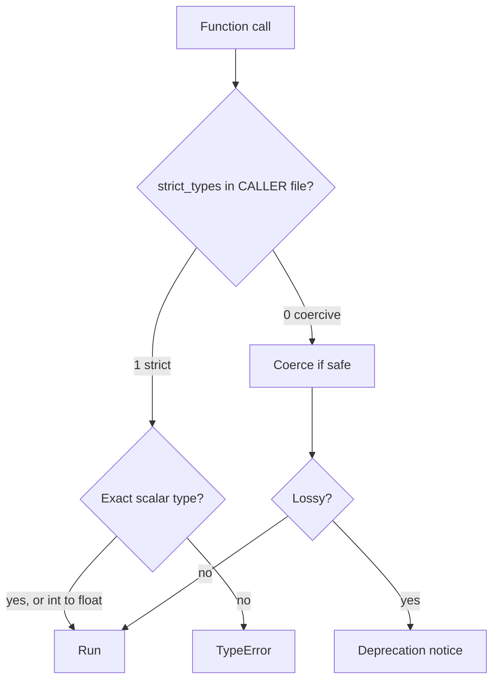

### 3.4 Architecture

The key architectural subtlety: strictness is a property of the **caller's** file. A library can be written without `strict_types`, yet behave strictly when called from a strict file. The diagram shows how the directive at the top of the caller controls the conversion decision in the Zend Engine.

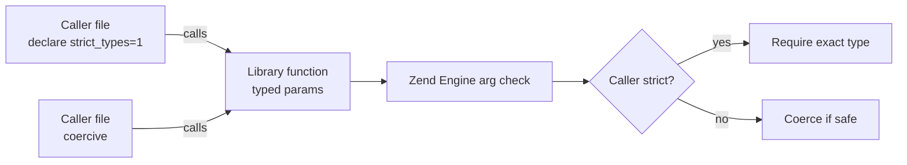

### 3.5 Real example

**Scenario.** A pricing endpoint multiplies a quantity by a unit price in cents and is shared by an HTTP controller and a CLI importer.

**Problem.** In coercive mode, a stray `"3 "` (trailing space) or `"three"` becomes `0`, silently producing a free order line.

**Solution.** Enable `strict_types=1` so the boundary rejects non-`int` quantities, and validate at the edge before calling the strict core.

**Implementation.**

```php
<?php

declare(strict_types=1);

/** Strict core: only true ints are accepted. */
function lineTotalCents(int $quantity, int $unitPriceCents): int
{
    if ($quantity < 1) {
        throw new InvalidArgumentException('Quantity must be >= 1');
    }
    return $quantity * $unitPriceCents;
}

/** Boundary adapter: validates untrusted input, then calls the strict core. */
function lineTotalFromRequest(string $qty, string $price): int
{
    $quantity = filter_var($qty, FILTER_VALIDATE_INT);
    if ($quantity === false) {
        throw new InvalidArgumentException("Bad quantity: {$qty}");
    }

    $cents = filter_var($price, FILTER_VALIDATE_INT);
    if ($cents === false) {
        throw new InvalidArgumentException("Bad price: {$price}");
    }

    return lineTotalCents($quantity, $cents);   // exact ints — passes strict check
}

/** never: this function always terminates the request. */
function abort(string $reason): never
{
    http_response_code(400);
    throw new RuntimeException($reason);
}

try {
    echo lineTotalFromRequest('3', '1999') . PHP_EOL;   // 5997
    echo lineTotalFromRequest('three', '1999');         // throws before reaching core
} catch (InvalidArgumentException $e) {
    abort($e->getMessage());
}
```

**Result.** In strict mode the typed core cannot be fed a coerced zero; bad input fails loudly at the validated boundary, and `never` documents that `abort` does not return.

**Future improvements.** Add a PHP-CS-Fixer rule that requires `declare(strict_types=1);` in every file, and a CI gate that fails the build if it is missing.

### 3.6 Exercises

1. Call `lineTotalCents("3", 1999)` from a strict file and from a coercive file; compare the outcomes.
2. Write a `void` function and confirm the engine rejects `return $value;`.
3. Implement a `redirect(string $url): never` and explain how the analyzer treats code after the call.
4. Trigger a lossy-conversion deprecation in coercive mode and then eliminate it.

### 3.7 Challenges

1. Take a small coercive script and convert it to strict mode, fixing every resulting `TypeError` by adding boundary validation rather than casts.
2. Write a static-analysis configuration that fails when a file is missing `strict_types`, and document the team policy around it.

### 3.8 Checklist

- [ ] Every file begins with `declare(strict_types=1);`.
- [ ] Untrusted input is validated *before* it reaches strict, typed cores.
- [ ] I use `void` for side-effecting functions and `never` for always-throwing ones.
- [ ] I avoid `mixed` unless I truly accept any value.
- [ ] CI enforces strict mode across the repository.

### 3.9 Best practices

- Put `declare(strict_types=1);` as the first line of every PHP file, no exceptions.
- Keep a thin "boundary" layer that validates and converts; keep the core strict and typed.
- Prefer explicit validation (`filter_var`) over relying on coercion to "fix" input.
- Use `never` to give both readers and the analyzer precise control-flow information.

### 3.10 Anti-patterns

- Mixing strict and coercive files and being surprised by inconsistent behavior.
- Sprinkling `(int)`/`(string)` casts to silence `TypeError`s instead of validating.
- Using `mixed` to avoid thinking about the real contract.
- Returning a value from a `void` function (or ignoring a `never` function's intent).

### 3.11 Troubleshooting

| Symptom | Likely cause | Fix |
|---|---|---|
| Same call works in one file, fails in another | Caller's `strict_types` differs | Standardize strict mode everywhere |
| `"3"` accepted as `int` | File is coercive | Add `declare(strict_types=1);` |
| Deprecation: implicit float→int | Lossy coercion | Validate/cast intentionally |
| `Cannot use return value in void` | Returning from `void` | Change the return type or remove the value |
| Analyzer warns of unreachable code | Code after a `never` call | Delete the dead code |

### 3.12 Official references

- `strict_types` / type juggling: https://www.php.net/manual/en/language.types.declarations.php#language.types.declarations.strict
- `declare`: https://www.php.net/manual/en/control-structures.declare.php
- `mixed` type: https://www.php.net/manual/en/language.types.mixed.php
- `void` return: https://www.php.net/manual/en/language.types.void.php
- `never` return: https://www.php.net/manual/en/language.types.never.php

---

> **End of Part I.** You now have the type vocabulary and the strict-mode discipline that every later chapter assumes: scalars and their conversion traps, the full declaration system (nullable, union, intersection), and the rules of coercive vs. strict typing. Part II builds on this foundation with functions, arrays, and closures — including named arguments, the spread operator, and the first-class callable syntax — before Part III takes the leap into modern object-oriented PHP, where the 8.4 additions (property hooks, asymmetric visibility) finally come into play.

---

## Part II – Functions & Arrays

Part I covered values and PHP's type system. Part II builds the two workhorses of everyday PHP: **functions** (with named arguments and variadics) and **arrays** (PHP's universal ordered map, with its large standard function set), plus **closures** and **arrow functions** for first-class behavior.

---

## Chapter 4 — Functions, parameters, named arguments, variadics

### 4.1 Introduction

A PHP **function** declares typed parameters and a return type (Part I). Modern PHP makes calls clearer and more flexible: **named arguments** (`fee(amount: 100, rate: 0.1)`) let callers pass arguments by parameter name in any order and skip optional ones; **default values** make parameters optional; and **variadics** (`...$items`) accept a variable number of arguments as an array. The **spread** operator (`...$array`) does the reverse, unpacking an array into arguments. Together they make function calls self-documenting and adaptable.

### 4.2 Business context

Functions are the unit of reuse, and their call sites are where bugs and confusion concentrate. A call like `createUser(true, false, true)` is unreadable; **named arguments** (`createUser(active: true, admin: false, verified: true)`) make intent obvious and resist mistakes when parameters are reordered or added. Optional parameters with defaults avoid a combinatorial explosion of overloads (which PHP doesn't have). Variadics let one function handle "one or many" cleanly. These reduce review friction and the misuse that causes defects.

### 4.3 Theoretical concepts

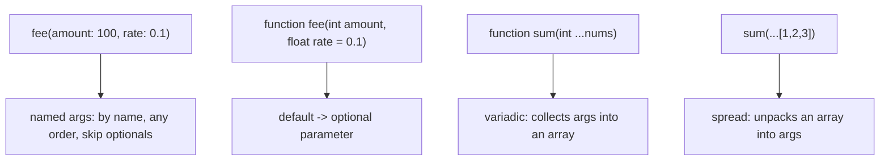

Parameters are typed and may have defaults (making them optional). **Named arguments** bind by parameter name, so callers can pass only what they need and in any order — especially valuable for functions with many optional parameters. **Variadics** (`...$nums`) gather trailing arguments into an array; the **spread** (`...$array`) unpacks an array (or Traversable) into positional arguments. PHP has no method overloading, so defaults + named args + variadics are how you express flexible signatures.

### 4.4 Architecture: clear, flexible call sites

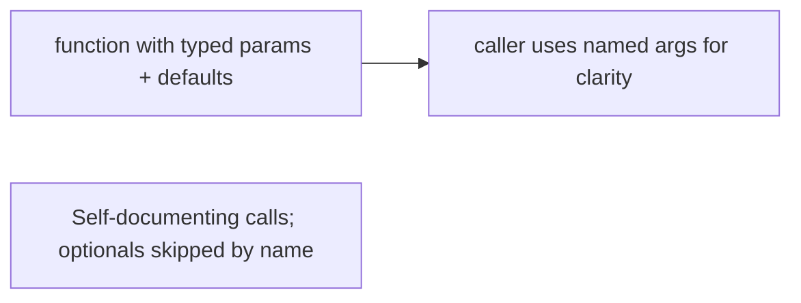

A well-designed signature plus named arguments makes the call site read like documentation, which is most of a function's usability.

### 4.5 Real example

**Scenario.** A function creates a report with several optional settings.

**Problem.** Positional booleans/flags (`makeReport($data, true, false, true)`) are unreadable and error-prone.

**Solution.** Typed parameters with defaults, called with **named arguments**; a variadic for an open-ended list.

**Implementation.**

```php
function makeReport(
    array $data,
    string $format = 'csv',
    bool $includeHeader = true,
    bool $compress = false,
): string {
    // ...
}

// named arguments: clear, reorderable, skip the ones you don't change
$r = makeReport($rows, format: 'json', compress: true);

// variadic + spread
function total(int ...$amounts): int { return array_sum($amounts); }
$sum = total(...[10, 20, 30]);   // spread an array into the variadic
```

**Result.** The call `makeReport($rows, format: 'json', compress: true)` is self-explanatory and leaves `includeHeader` at its default — no positional guessing, no boolean soup. The variadic `total` accepts any number of amounts, and the spread feeds it an existing array. Signatures stay flexible without overloads.

**Future improvements.** Group many related parameters into a typed object (DTO/record-like class) when the list grows; use enums (Ch. 9) for `format` instead of a string.

### 4.6 Exercises

1. What do named arguments let a caller do that positional arguments don't?
2. What is the difference between a variadic parameter and the spread operator?
3. Why does PHP rely on defaults/named args instead of method overloading?

### 4.7 Challenges

- **Challenge.** Write a `formatMoney(int $cents, string $currency = 'BRL', bool $symbol = true)` and call it three ways using named arguments to vary only one option each time.

### 4.8 Checklist

- [ ] I use named arguments to clarify calls with multiple/optional parameters.
- [ ] Optional parameters have sensible defaults.
- [ ] I use variadics for "one or many" and spread to unpack arrays.
- [ ] I group large parameter lists into objects when they grow.

### 4.9 Best practices

- Prefer named arguments for readability at call sites.
- Order parameters required-first; give optionals defaults.
- Use variadics/spread instead of accepting a raw array when arity varies.

### 4.10 Anti-patterns

- Long positional boolean/flag argument lists.
- Huge parameter lists that should be a value object.
- Relying on argument position where names would prevent mistakes.

### 4.11 Troubleshooting

| Symptom | Likely cause | Action |
|---------|--------------|--------|
| Wrong values passed to params | Positional confusion | Use named arguments |
| Can't skip a middle optional | Positional call | Pass by name and skip the rest |
| Too many parameters | Missing abstraction | Group into a typed object |

### 4.12 References

- PHP Manual, "Function arguments" (named arguments, variadics): https://www.php.net/manual/en/functions.arguments.php.
- J. Lockhart, *Modern PHP* (O'Reilly, 2015) — ISBN 978-1491905012.

---

## Chapter 5 — Arrays, the array functions, and the spread operator

### 5.1 Introduction

The PHP **array** is a single, versatile type: an **ordered map** that serves as list, dictionary, stack, and queue. Keys are integers or strings; values are anything. PHP ships a **large standard library of array functions** — `array_map`, `array_filter`, `array_reduce`, `array_column`, `usort`, `in_array`, `array_keys`, and many more — that cover most data manipulation without manual loops. The **spread operator** (`[...$a, ...$b]`) merges arrays, and destructuring (`[$x, $y] = $pair`) pulls values out.

### 5.2 Business context

Arrays are where most PHP data lives — request input, database rows, config. Reaching for the right built-in array function instead of a hand-written loop makes code shorter, clearer, and less buggy (the function is tested and named for intent). Knowing the difference between, say, `in_array` (O(n)) and an `isset($map[$key])` lookup (O(1)) is a real performance lever on large datasets. Fluency with the array toolkit is one of the highest-leverage PHP skills for everyday productivity.

### 5.3 Theoretical concepts

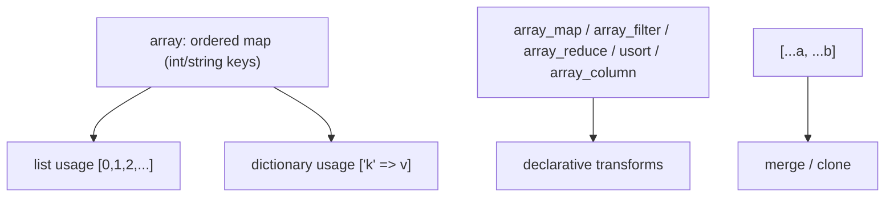

Use an array as a **list** (sequential int keys) or a **map** (string keys). The functional trio — **`array_map`** (transform), **`array_filter`** (select), **`array_reduce`** (aggregate) — replaces most loops; **`usort`** sorts with a comparator; **`array_column`** extracts a field from rows. For membership, a key lookup (`isset($map[$k])`) is O(1) versus `in_array` O(n). The **spread** merges arrays (string keys are overwritten, int keys renumbered), and list **destructuring** binds elements to variables.

### 5.4 Architecture: declarative data transforms

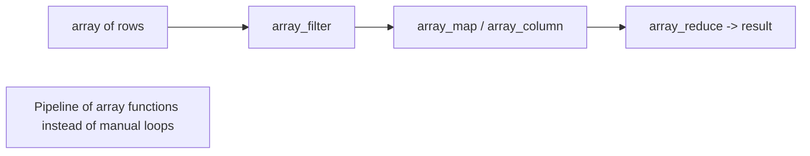

Composing array functions expresses a data transformation as a readable pipeline, mirroring the LINQ idea in PHP's idiom.

### 5.5 Real example

**Scenario.** From an array of order rows, total the revenue of completed orders.

**Problem.** A manual loop with running totals and conditionals is verbose and easy to get wrong.

**Solution.** Compose **`array_filter`**, **`array_column`**, and **`array_sum`**.

**Implementation.**

```php
$orders = [
    ['id' => 1, 'status' => 'done', 'total' => 100],
    ['id' => 2, 'status' => 'open', 'total' => 50],
    ['id' => 3, 'status' => 'done', 'total' => 30],
];

$revenue = array_sum(
    array_column(
        array_filter($orders, fn($o) => $o['status'] === 'done'),  // select completed
        'total'                                                      // pull the total column
    )
);   // => 130

$merged = [...$orders, ['id' => 4, 'status' => 'done', 'total' => 20]]; // spread to append
```

**Result.** Three composed built-ins express "completed orders' totals, summed" without a loop or a running accumulator — shorter and harder to get wrong. The spread appends a row immutably. Each function is named for its intent, so the pipeline reads as the business question.

**Future improvements.** For very large datasets, prefer a key-indexed lookup over repeated `in_array`; consider generators (lazy iteration) to avoid building intermediate arrays.

### 5.6 Exercises

1. In what sense is a PHP array both a list and a dictionary?
2. Which functions implement transform, select, and aggregate over arrays?
3. Why can `isset($map[$key])` outperform `in_array($value, $list)`?

### 5.7 Challenges

- **Challenge.** Given rows with `category` and `amount`, use array functions to produce an associative array of total amount per category (hint: `array_reduce`).

### 5.8 Checklist

- [ ] I use `array_map`/`array_filter`/`array_reduce` instead of manual loops.
- [ ] I use key lookups (O(1)) over `in_array` (O(n)) on large data.
- [ ] I use the spread to merge/clone arrays and destructuring to unpack.
- [ ] I pick list vs. map usage deliberately.

### 5.9 Best practices

- Prefer named array functions for clarity and correctness.
- Index by key when you do repeated lookups.
- Use spread/destructuring for concise array assembly and unpacking.

### 5.10 Anti-patterns

- Hand-written loops where a single array function fits.
- `in_array` in a loop over large data (O(n²)).
- Mutating arrays in place where a spread-built copy is clearer.

### 5.11 Troubleshooting

| Symptom | Likely cause | Action |
|---------|--------------|--------|
| Slow membership checks | `in_array` on large lists | Index by key; use `isset` |
| Verbose loop logic | Manual iteration | Compose `array_map/filter/reduce` |
| Lost/renumbered keys after merge | `+` vs spread/`array_merge` semantics | Choose the merge that preserves the keys you need |

### 5.12 References

- PHP Manual, "Arrays" & "Array functions": https://www.php.net/manual/en/book.array.php.
- J. Lockhart, *Modern PHP* (O'Reilly, 2015) — ISBN 978-1491905012.

---

## Chapter 6 — Closures, arrow functions, and first-class callable syntax

### 6.1 Introduction

PHP treats functions as **values**. A **closure** (`function () use ($x) { ... }`) is an anonymous function that can capture variables from its scope via `use`. An **arrow function** (`fn($x) => $x * 2`) is a concise closure that **automatically** captures variables by value — ideal for the short callbacks array functions consume. The **first-class callable syntax** (`strlen(...)`, `$obj->method(...)`) turns any function or method into a closure value you can pass around. These make PHP's functional style (Ch. 5) ergonomic.

### 6.2 Business context

First-class functions are what let you pass behavior — a comparator to `usort`, a predicate to `array_filter`, a callback to an event system — instead of hard-coding it. Arrow functions remove the `use` boilerplate for the common case, keeping callbacks readable inline. The callable syntax lets existing functions/methods be reused as values without wrapping them. The result is decoupled, composable code: the same array pipeline or pipeline-of-handlers works with any behavior you supply.

### 6.3 Theoretical concepts

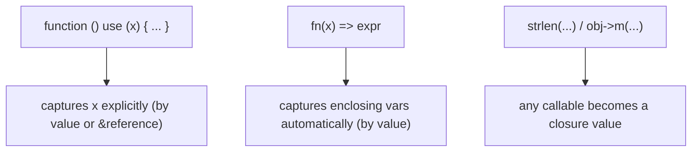

A **closure** captures variables listed in `use` — by value by default, or by reference with `&`. An **arrow function** is a single-expression closure that auto-captures used variables **by value** (no `use` needed), which is why it's perfect for `array_map`/`array_filter` callbacks. The **first-class callable syntax** `f(...)` produces a `Closure` from a named function or method, so you can store and pass it like any value.

### 6.4 Architecture: behavior passed as a value

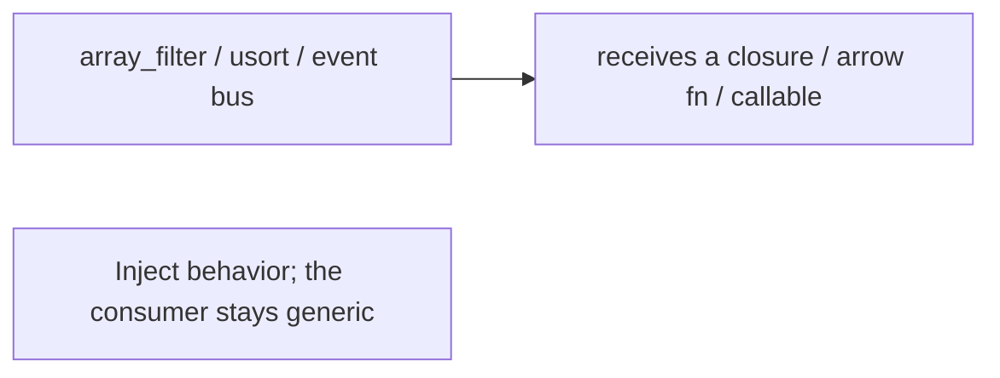

Passing closures lets generic consumers (array functions, pipelines, event dispatchers) be specialized with the exact behavior a call site needs.

### 6.5 Real example

**Scenario.** Sort products by a runtime-selected key and filter by a threshold.

**Problem.** Hard-coding the sort key and threshold makes the logic rigid and duplicated.

**Solution.** Pass an **arrow function** comparator and predicate; reuse a method as a callable.

**Implementation.**

```php
$threshold = 50;
$expensive = array_filter($products, fn($p) => $p['price'] > $threshold);  // arrow fn auto-captures $threshold

usort($expensive, fn($a, $b) => $a['price'] <=> $b['price']);              // comparator as a value

// first-class callable: reuse an existing function/method as a Closure
$names = array_map(strtoupper(...), array_column($expensive, 'name'));
```

**Result.** The filter captures `$threshold` automatically (no `use`), the sort takes an inline comparator, and `strtoupper(...)` is reused directly as a mapping function. Behavior is supplied at the call site, so the same array functions handle any key, threshold, or transform — composable and concise.

**Future improvements.** Extract frequently-used predicates/comparators into named functions and pass them via `name(...)`; capture by reference (`use (&$x)`) only when you must mutate the outer variable.

### 6.6 Exercises

1. How does an arrow function's variable capture differ from a closure's `use`?
2. What does the first-class callable syntax `f(...)` produce?
3. When would you capture by reference (`use (&$x)`)?

### 6.7 Challenges

- **Challenge.** Build a small pipeline: filter an array of numbers above a captured threshold with an arrow function, then `array_map` them through an existing function passed via first-class callable syntax.

### 6.8 Checklist

- [ ] I use arrow functions for short callbacks (auto-capture by value).
- [ ] I use `use` (and `&` only when needed) for multi-statement closures.
- [ ] I pass existing functions/methods as values with `f(...)`.
- [ ] I inject behavior into generic consumers instead of hard-coding it.

### 6.9 Best practices

- Prefer arrow functions for array-function callbacks.
- Capture by value by default; use `&` references sparingly.
- Reuse named functions/methods via first-class callable syntax.

### 6.10 Anti-patterns

- Verbose `function() use (...)` where an arrow function suffices.
- Capturing by reference unintentionally, causing surprising mutations.
- Wrapping a function in a closure when `f(...)` would do.

### 6.11 Troubleshooting

| Symptom | Likely cause | Action |
|---------|--------------|--------|
| Callback doesn't see an outer variable | Closure missing `use` | Add `use ($var)` or use an arrow function |
| Outer variable changed unexpectedly | Captured by reference (`&`) | Capture by value instead |
| Verbose one-line callbacks | Full closure syntax | Use an arrow function `fn() => ...` |

### 6.12 References

- PHP Manual, "Anonymous functions", "Arrow functions", "First-class callable syntax": https://www.php.net/manual/en/functions.anonymous.php.
- J. Lockhart, *Modern PHP* (O'Reilly, 2015) — ISBN 978-1491905012.

---

> **End of Part II.** PHP's everyday workhorses: **functions** with named arguments, defaults, and variadics for clear, flexible calls; the **array** as a universal ordered map manipulated by a rich set of built-in functions; and **closures**, **arrow functions**, and **first-class callables** that pass behavior as a value. Part III covers **object-oriented PHP** — classes with constructor promotion and `readonly`, interfaces/abstracts/traits, and enums.

---

## Part III – Object-Oriented PHP

Part III covers PHP's object model, which modern versions have made concise and safe: **classes** with constructor property promotion and `readonly`, the three abstraction tools **interfaces**, **abstract classes**, and **traits**, and **enums** for fixed sets of values.

---

## Chapter 7 — Classes, properties, constructor promotion, `readonly`

### 7.1 Introduction

A PHP **class** bundles typed **properties** with **methods**, with visibility (`public`/`protected`/`private`). PHP 8 cut the boilerplate: **constructor property promotion** declares and assigns properties directly in the constructor signature (`public function __construct(private string $name) {}`), and **`readonly`** properties can be set once (in the constructor) and never again, giving immutability per property. PHP 8.4 adds **property hooks** and **asymmetric visibility** (Part IV). The result is concise, intention-revealing classes that protect their invariants.

### 7.2 Business context

Encapsulation lets a class enforce that its data is always valid and change its internals without breaking callers. Before promotion, every property meant three lines (declare, parameter, assign) — pure ceremony that obscured intent; promotion removes it. `readonly` makes immutability a guarantee the engine enforces, eliminating "who mutated this?" bugs for value objects and DTOs. Concise, safe classes lower the cost of modeling a domain accurately, which is where correctness in a business application starts.

### 7.3 Theoretical concepts

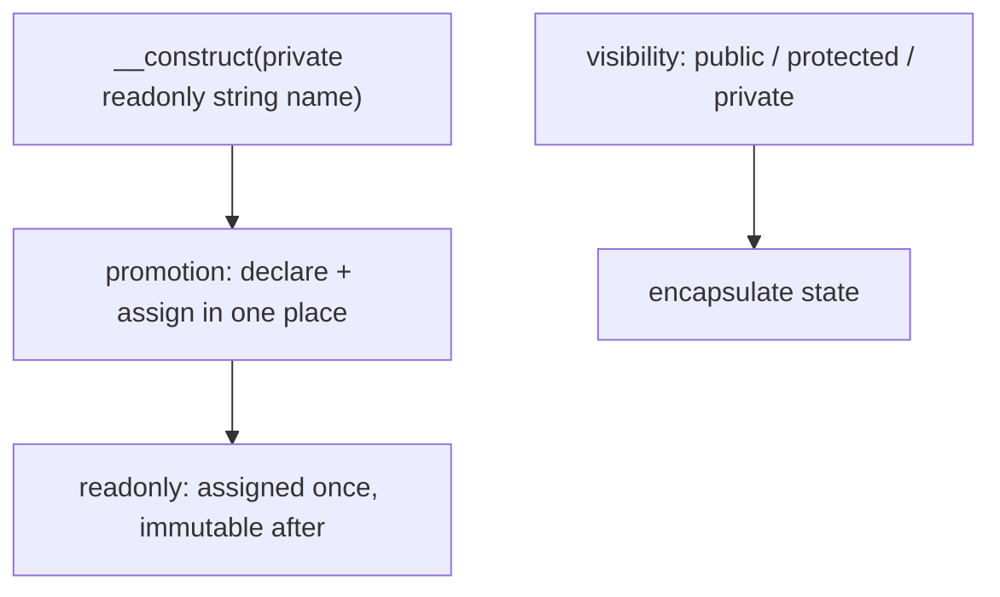

**Constructor promotion** turns a constructor parameter prefixed with a visibility modifier into a class property, declared and assigned automatically. **`readonly`** properties may be initialized once (typically in the constructor) and then are immutable — attempting to write again is a fatal error. Combine them (`private readonly`) for concise immutable value objects. Visibility controls access; prefer the narrowest that works.

### 7.4 Architecture: concise, immutable-by-default state

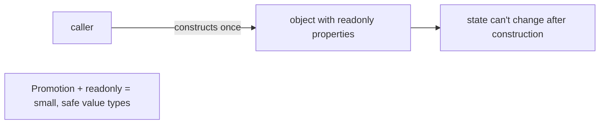

Promotion plus `readonly` makes the common case — a small type whose data is set at construction and never mutated — both terse to write and safe by construction.

### 7.5 Real example

**Scenario.** Model an immutable `Money` value object.

**Problem.** Hand-declaring properties and guarding against mutation is verbose and easy to get wrong.

**Solution.** **Promote** the properties and mark them **`readonly`**.

**Implementation.**

```php
final class Money
{
    public function __construct(
        public readonly int $cents,        // promoted + immutable
        public readonly string $currency,
    ) {}

    public function add(Money $other): self
    {
        if ($this->currency !== $other->currency) {
            throw new InvalidArgumentException('currency mismatch');
        }
        return new self($this->cents + $other->cents, $this->currency); // new value, no mutation
    }
}

$price = new Money(1990, 'BRL');
// $price->cents = 0;   // Error: cannot modify readonly property
$total = $price->add(new Money(500, 'BRL'));  // => Money(2490, 'BRL')
```

**Result.** `Money` is declared in a few lines (no separate property declarations or assignments), and its fields are immutable — any mutation is a fatal error, so the value can be shared safely. "Changes" produce new instances via `add`. Promotion + `readonly` made a correct value object cheap to write.

**Future improvements.** Add validation in the constructor (reject negative cents, empty currency); use PHP 8.4 property hooks (Part IV) for computed/validated properties.

### 7.6 Exercises

1. What does constructor property promotion replace?
2. What guarantee does `readonly` provide, and when can the property be set?
3. Why model `Money` as immutable?

### 7.7 Challenges

- **Challenge.** Build an immutable `Point` with promoted `readonly` `x`/`y` and a `translate(int $dx, int $dy): self` that returns a new `Point`.

### 7.8 Checklist

- [ ] I use constructor promotion to declare/assign properties concisely.
- [ ] Value objects use `readonly` for immutability.
- [ ] Properties have the narrowest visibility that works.
- [ ] Invariants are validated in the constructor.

### 7.9 Best practices

- Promote constructor parameters into properties to cut boilerplate.
- Make value objects immutable with `readonly`.
- Keep properties private/protected unless they must be public.

### 7.10 Anti-patterns

- Public mutable properties exposing internal state.
- Hand-written declare/assign triples instead of promotion.
- Mutating a value object instead of producing a new one.

### 7.11 Troubleshooting

| Symptom | Likely cause | Action |
|---------|--------------|--------|
| "Cannot modify readonly property" | Writing a `readonly` after construction | Produce a new instance instead |
| Verbose class with repeated assignments | No promotion | Promote parameters in the constructor |
| Object reached an invalid state | No constructor validation | Validate invariants in `__construct` |

### 7.12 References

- PHP Manual, "Constructor Promotion" & "readonly properties": https://www.php.net/manual/en/language.oop5.properties.php.
- J. Lockhart, *Modern PHP* (O'Reilly, 2015) — ISBN 978-1491905012.

---

## Chapter 8 — Interfaces, abstract classes, and traits

### 8.1 Introduction

PHP has three tools for abstraction and reuse. An **interface** is a pure contract — method signatures (and constants) a class promises to implement; a class can implement **many**. An **abstract class** is a partial implementation: it can mix abstract methods (must be implemented) with concrete ones (shared), and cannot be instantiated. A **trait** is a unit of reusable methods (and properties) **composed** into a class with `use` — PHP's answer to horizontal code reuse without multiple inheritance. Choosing among them is a core PHP design skill.

### 8.2 Business context

These tools decide how flexible and DRY a codebase is. Interfaces enable substitution and testing (depend on `LoggerInterface`, inject a fake) and underpin the PSR standards that let PHP packages interoperate. Abstract classes share scaffolding across a family of types. Traits avoid copy-pasting the same helper methods into unrelated classes (e.g., a `TimestampableTrait`). Used correctly they reduce duplication and coupling; overused (especially traits) they obscure where behavior comes from. Knowing which to reach for keeps a large PHP codebase maintainable.

### 8.3 Theoretical concepts

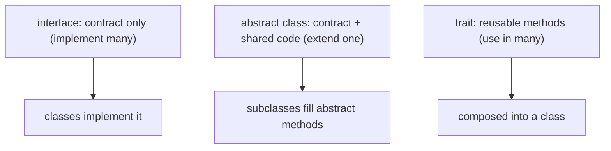

An **interface** declares *what*, never *how*; a class lists the interfaces it `implements` and the compiler checks coverage. An **abstract class** provides shared implementation plus `abstract` methods subclasses must define; single inheritance applies. A **trait** is `use`d to copy its methods into a class at compile time, enabling reuse across unrelated classes — but conflicts must be resolved explicitly and overuse hides behavior. Rule of thumb: **interface** for a contract, **abstract class** for a shared base of one family, **trait** for cross-cutting helper methods.

### 8.4 Architecture: contracts, shared bases, composed helpers

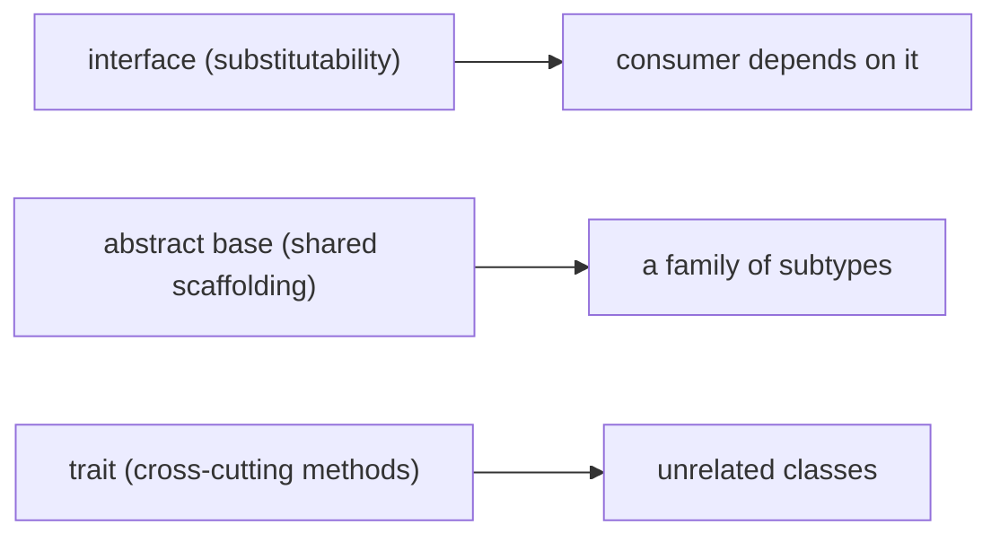

Each tool fits a different reuse shape; mixing them (an abstract class implementing an interface and using a trait) is common and idiomatic.

### 8.5 Real example

**Scenario.** Multiple exporters share timestamp logic but must be interchangeable.

**Problem.** Copying timestamp code into each exporter duplicates it; a single base class can't be shared with unrelated classes that also need timestamps.

**Solution.** An **interface** for substitutability, an **abstract class** for shared export scaffolding, and a **trait** for the cross-cutting timestamp.

**Implementation.**

```php
interface Exporter { public function export(array $data): string; }   // contract

trait Timestampable {                                                  // cross-cutting reuse
    public function stamp(): string { return (new DateTimeImmutable())->format('c'); }
}

abstract class BaseExporter implements Exporter {                      // shared base
    use Timestampable;
    public function export(array $data): string {
        return $this->stamp() . "\n" . $this->body($data);            // template + hook
    }
    abstract protected function body(array $data): string;            // subtypes implement
}

final class CsvExporter extends BaseExporter {
    protected function body(array $data): string { return implode(',', $data); }
}
```

**Result.** Consumers depend on `Exporter` and can swap any implementation (or a fake in tests). `BaseExporter` shares the export skeleton; `CsvExporter` fills only the body. The `Timestampable` trait provides `stamp()` and could be reused by any unrelated class that needs timestamps — three reuse mechanisms each doing what it's best at.

**Future improvements.** Keep traits small and focused; if two traits both define a method, resolve the conflict with `insteadof`/`as`; prefer composition (holding an object) when a trait starts carrying state.

### 8.6 Exercises

1. When do you choose an interface vs an abstract class vs a trait?
2. Why can a class implement many interfaces but extend only one class?
3. What problem do traits solve, and what risk do they introduce?

### 8.7 Challenges

- **Challenge.** Define a `Comparable` interface, an abstract base implementing a `max()` helper in terms of an abstract `compareTo()`, and a trait that adds a `describe()` method; combine them in one concrete class.

### 8.8 Checklist

- [ ] I use interfaces for contracts and substitutability.
- [ ] I use abstract classes for a shared base of one type family.
- [ ] I use traits for cross-cutting helper methods, kept small.
- [ ] I resolve trait conflicts explicitly.

### 8.9 Best practices

- Depend on interfaces; inject implementations.
- Reserve abstract classes for genuine shared scaffolding.
- Keep traits focused; avoid trait-heavy designs that hide behavior.

### 8.10 Anti-patterns

- "God" traits mixing unrelated responsibilities into many classes.
- Abstract classes used where a simple interface would do.
- Deep inheritance for code reuse (prefer traits/composition).

### 8.11 Troubleshooting

| Symptom | Likely cause | Action |
|---------|--------------|--------|
| Can't tell where a method comes from | Too many traits | Reduce/rename; prefer explicit composition |
| Trait method name conflict | Two traits define the same method | Resolve with `insteadof`/`as` |
| Rigid hierarchy | Abstract class used for cross-cutting reuse | Extract a trait or compose |

### 8.12 References

- PHP Manual, "Interfaces", "Abstract classes", "Traits": https://www.php.net/manual/en/language.oop5.php.
- PHP-FIG, PSR standards (interfaces for interoperability): https://www.php-fig.org/psr/.

---

## Chapter 9 — Enums (pure and backed) and first-class callables on methods

### 9.1 Introduction

A PHP **enum** (since 8.1) is a type with a fixed set of named cases — `enum Status { case Active; case Closed; }`. A **pure** enum's cases have only a name; a **backed** enum assigns each case a scalar value (`enum Status: string { case Active = 'active'; }`) for storage/serialization. Enums are objects: they can implement interfaces and have **methods**. Combined with the **first-class callable syntax** on methods (`$this->method(...)`, Ch. 6), enums make fixed domains type-safe and expressive, replacing loose string/int constants.

### 9.2 Business context

Domains are full of small fixed sets — order status, user role, currency. Modeling them as raw strings or class constants invites typos and invalid values that surface as runtime bugs and bad data. An **enum** makes the set a **type**: only the defined cases exist, the compiler/IDE checks usage, and `switch`/`match` over it is exhaustive-friendly. Backed enums map cleanly to database columns and JSON. Methods on enums put related behavior (a label, a color, a transition rule) where it belongs. This eliminates a whole class of "invalid status" defects.

### 9.3 Theoretical concepts

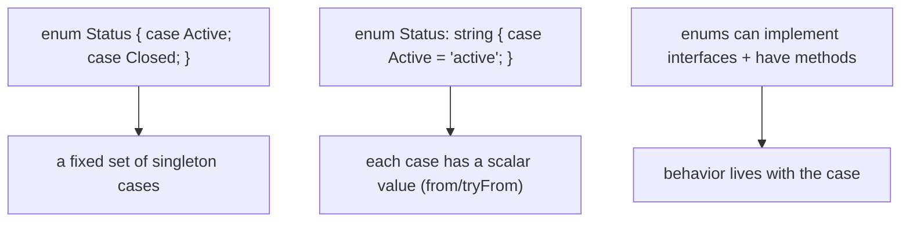

A **pure** enum case is a singleton object (`Status::Active`). A **backed** enum exposes `from($value)` (throws if invalid) and `tryFrom($value)` (returns null) to convert from the scalar, and `->value` to get it — ideal for persistence and APIs. Enums can declare **methods** and implement **interfaces**, so a `Status` can have a `label()` or `canTransitionTo()` method. Pass an enum method as a value with the first-class callable syntax when a callback is needed.

### 9.4 Architecture: fixed sets as types

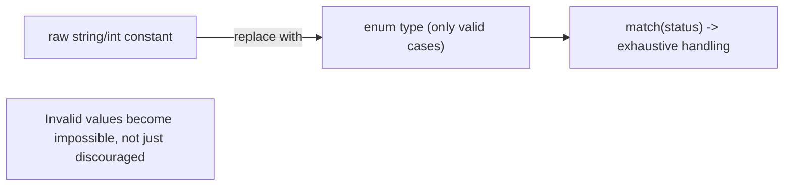

Turning a fixed set into an enum moves "is this a valid value?" from runtime checks to the type system.

### 9.5 Real example

**Scenario.** An order status drives behavior and is stored in the database.

**Problem.** Using `'active'`/`'closed'` strings allows typos and invalid values, and the label logic is scattered.

**Solution.** A **backed enum** with a method, converting via `tryFrom` at the boundary.

**Implementation.**

```php
enum OrderStatus: string
{
    case Pending = 'pending';
    case Paid    = 'paid';
    case Shipped = 'shipped';

    public function label(): string         // behavior with the case
    {
        return match ($this) {
            self::Pending => 'Awaiting payment',
            self::Paid    => 'Paid',
            self::Shipped => 'On its way',
        };
    }
}

$status = OrderStatus::tryFrom($row['status']) ?? OrderStatus::Pending;  // safe from DB string
echo $status->label();                                                   // 'Paid'
echo $status->value;                                                     // 'paid' (to store)
```

**Result.** Only the three valid statuses exist; a bad database value is handled by `tryFrom` (no invalid enum), and `match` over the enum is checked. The label lives on the type, not in scattered conditionals, and `->value` serializes cleanly back to storage. "Invalid status" bugs are designed out.

**Future improvements.** Add a `canTransitionTo(OrderStatus $next): bool` method to encode the state machine; have the enum implement an interface so consumers depend on the contract.

### 9.6 Exercises

1. What is the difference between a pure and a backed enum?
2. What do `from()` and `tryFrom()` do, and when do you use each?
3. Why put a `label()` method on the enum rather than in a separate function?

### 9.7 Challenges

- **Challenge.** Model a `Role` backed enum with `admin`/`editor`/`viewer`, add a `canEdit(): bool` method, and convert a request string to a `Role` safely with `tryFrom`.

### 9.8 Checklist

- [ ] Fixed sets are modeled as enums, not raw strings/constants.
- [ ] I use backed enums for stored/serialized values.
- [ ] I convert external values with `tryFrom` (or `from` when invalid is exceptional).
- [ ] Case-related behavior lives in enum methods.

### 9.9 Best practices

- Replace string/int constants for fixed sets with enums.
- Use backed enums at persistence/API boundaries.
- Put behavior (labels, rules) on the enum via methods.

### 9.10 Anti-patterns

- Raw string statuses/roles scattered through the code.
- `from()` on untrusted input (use `tryFrom` to avoid exceptions).
- Duplicated `switch` on a constant where an enum method would centralize it.

### 9.11 Troubleshooting

| Symptom | Likely cause | Action |
|---------|--------------|--------|
| Invalid status values in data | Raw strings, no type | Model as a backed enum |
| Uncaught `ValueError` converting input | `from()` on invalid input | Use `tryFrom()` and handle null |
| Status logic duplicated | Behavior outside the enum | Move it into an enum method |

### 9.12 References

- PHP Manual, "Enumerations": https://www.php.net/manual/en/language.enumerations.php.
- B. D. Wiese et al., PHP RFC "Enumerations" (8.1).

---

> **End of Part III.** Modern PHP's object model is concise and safe: **classes** with constructor promotion and **`readonly`**; **interfaces**, **abstract classes**, and **traits** for contracts, shared bases, and cross-cutting reuse; and **enums** that turn fixed sets into checked types with behavior. Part IV covers PHP 8's **modern language features** — attributes, `match`, fibers, and 8.4's property hooks and asymmetric visibility.

---

## Part IV – Modern Language Features

Part IV covers the features that define PHP 8.x: **attributes** (structured metadata) and reflection, the **`match`** expression and other initializer conveniences, **fibers** for cooperative concurrency, and PHP 8.4's **property hooks** and **asymmetric visibility**.

---

## Chapter 10 — Attributes and reflection

### 10.1 Introduction

**Attributes** (PHP 8.0) attach structured, typed **metadata** to classes, methods, properties, and parameters using `#[...]` syntax — `#[Route('/users')]`, `#[Deprecated]`. Unlike doc-comment annotations, attributes are real classes the engine understands, read at runtime via **reflection**. **Reflection** is PHP's API for inspecting code structure (classes, methods, attributes) programmatically. Together they power frameworks: routing, validation, ORM mapping, and dependency injection all read attributes via reflection to wire behavior declaratively.

### 10.2 Business context

Frameworks need to associate metadata with code — which method handles which route, which property maps to which column, which argument to inject. Before attributes, this lived in fragile string doc-comments parsed by hand, or in separate config files that drift from the code. Attributes make the metadata **first-class and type-checked**, co-located with what it describes, so the configuration can't get out of sync and tooling can validate it. This is why modern PHP frameworks (Symfony, Laravel, Doctrine) have moved to attribute-based configuration — less boilerplate, fewer drift bugs.

### 10.3 Theoretical concepts

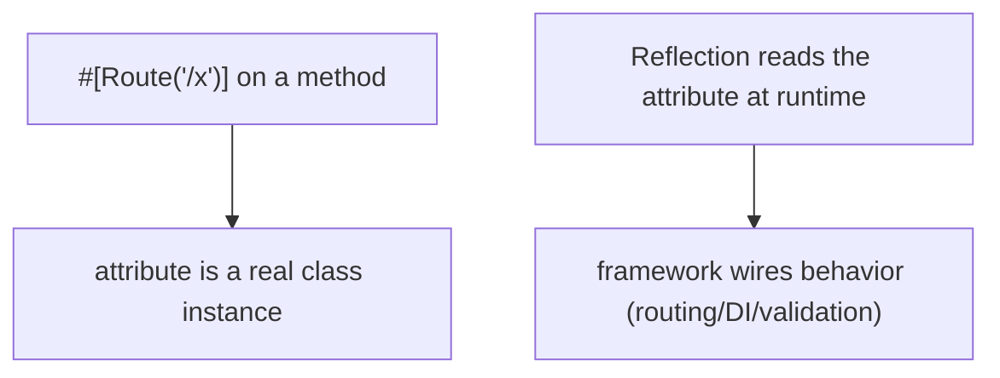

An attribute is declared as a class marked `#[Attribute]`; applying `#[Route('/x')]` records (lazily) the arguments. **Reflection** (`ReflectionClass`, `ReflectionMethod`, `->getAttributes()`) discovers them and `newInstance()` constructs the attribute object. The engine doesn't act on attributes itself — a framework reads them and decides what they mean. Reflection is also used for generic inspection (listing properties, parameter types), but it has a cost, so frameworks typically cache the results.

### 10.4 Architecture: declarative metadata, read by tooling

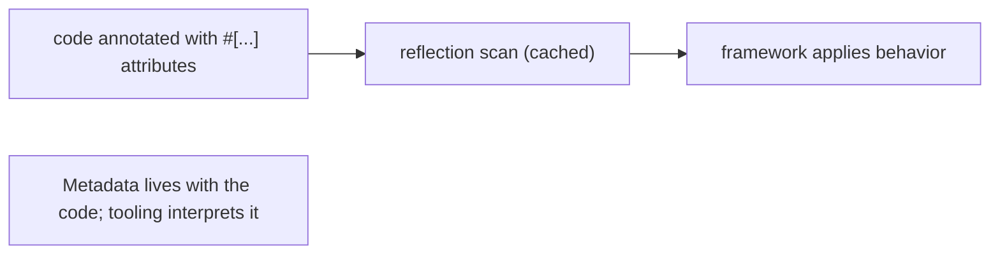

Attributes keep configuration next to the code it configures; reflection is the bridge that lets a framework turn that metadata into behavior.

### 10.5 Real example

**Scenario.** A mini-router maps controller methods to routes.

**Problem.** A separate routing config file drifts from the controllers it describes.

**Solution.** Declare routes as **attributes** and discover them via **reflection**.

**Implementation.**

```php
#[Attribute(Attribute::TARGET_METHOD)]
final class Route {
    public function __construct(public string $path) {}
}

final class UserController {
    #[Route('/users')]
    public function list(): string { return 'all users'; }
}

// framework side: read attributes via reflection
$rc = new ReflectionClass(UserController::class);
foreach ($rc->getMethods() as $m) {
    foreach ($m->getAttributes(Route::class) as $attr) {
        $route = $attr->newInstance();       // Route('/users')
        register($route->path, [UserController::class, $m->getName()]);
    }
}
```

**Result.** The route lives directly on the `list` method, type-checked as a `Route` object, and the router discovers it via reflection — no separate, drift-prone config. Adding an endpoint means annotating a method; the wiring is automatic. This is exactly how real PHP frameworks route.

**Future improvements.** Cache the reflection scan (it's not free) so routes are discovered once at build/boot; add attribute arguments (HTTP method, name) as typed constructor parameters.

### 10.6 Exercises

1. How do attributes differ from doc-comment annotations?
2. What role does reflection play in using attributes?
3. Why do frameworks cache attribute/reflection scans?

### 10.7 Challenges

- **Challenge.** Define a `#[Validate(max: int)]` attribute for properties and write reflection code that reads it and checks an object's values against the limits.

### 10.8 Checklist

- [ ] I use attributes for metadata that belongs with the code.
- [ ] Attribute classes are typed (constructor parameters), not stringly-typed.
- [ ] I read attributes via reflection and cache the scan.
- [ ] I let a framework/tool interpret attributes, not the engine.

### 10.9 Best practices

- Prefer attributes over doc-comment annotations and external config.
- Type attribute arguments via the constructor.
- Cache reflection results in hot paths.

### 10.10 Anti-patterns

- Heavy uncached reflection on every request.
- Stringly-typed metadata where a typed attribute fits.
- Putting logic in attributes (they are data; tooling acts on them).

### 10.11 Troubleshooting

| Symptom | Likely cause | Action |
|---------|--------------|--------|
| Slow boot/requests | Uncached reflection scans | Cache discovered attributes |
| Attribute "ignored" | Nothing reads it via reflection | A framework/tool must interpret it |
| Wrong attribute target | Missing `#[Attribute(TARGET_...)]` | Restrict the attribute's target |

### 10.12 References

- PHP Manual, "Attributes" & "Reflection": https://www.php.net/manual/en/language.attributes.php.
- PHP RFC "Attributes v2" (8.0).

---

## Chapter 11 — `match`, named args, and `new` in initializers

### 11.1 Introduction

PHP 8 added expression-level conveniences that make code terser and safer. The **`match`** expression returns a value, uses **strict** (`===`) comparison, requires no `break`, and is **exhaustive** (throws `UnhandledMatchError` if no arm matches) — a safer cousin of `switch`. **Named arguments** (Ch. 4) also shine in constructors. And **`new` in initializers** lets you use `new Foo()` as a **default parameter value**, property default, or attribute argument, removing a common reason to write a constructor body.

### 11.2 Business context

These features remove small but frequent sources of bugs and boilerplate. `switch` statements notoriously leak through missing `break`s and silently fall through on unmatched values; `match` makes both impossible. Defaulting a dependency to `new DefaultThing()` directly in the signature avoids the null-check-and-construct dance in many constructors. Each is a minor change individually, but across a codebase they remove a recurring class of defects and clutter, improving readability and correctness at near-zero cost.

### 11.3 Theoretical concepts

```mermaid
flowchart TB
    m["match (x) { 1, 2 => 'a', default => 'b' }"] --> strict["strict ===, no break, returns a value"]
    m --> exh["unhandled value -> UnhandledMatchError"]
    init["function f($dep = new Default())"] --> newinit["new allowed in default values / property inits"]
```

**`match`** evaluates the subject once and compares each arm with `===`; arms can list multiple values; it yields a value (assignable). Omitting `default` and missing a case throws rather than silently returning null. **`new` in initializers** permits object expressions where only constant expressions were allowed before — default parameter values, property defaults, and attribute arguments — so a dependency can default to a concrete instance inline.

### 11.4 Architecture: safer expressions, fewer constructor bodies

```mermaid
flowchart LR
    decision["a value-producing decision"] --> match["match expression (exhaustive, strict)"]
    dep["an optional dependency"] --> default["= new Default() in the signature"]
```

`match` turns branching into a checked expression; `new` in initializers turns "construct a default if none given" into a declaration.

### 11.5 Real example

**Scenario.** Map an HTTP status category to a message, with a default logger dependency.

**Problem.** A `switch` risks fall-through and a missing case returning nothing; constructing a default logger needs a constructor body and a null check.

**Solution.** Use **`match`** (exhaustive, strict) and **`new` in the initializer** for the default.

**Implementation.**

```php
final class Responder
{
    public function __construct(private Logger $log = new NullLogger()) {}  // new in initializer

    public function category(int $status): string
    {
        return match (true) {                       // strict, exhaustive, returns a value
            $status >= 200 && $status < 300 => 'success',
            $status >= 400 && $status < 500 => 'client error',
            $status >= 500                  => 'server error',
            default                          => 'other',
        };
    }
}

$r = new Responder();   // gets a NullLogger by default — no constructor body needed
```

**Result.** `category` is a single value-returning expression with strict comparisons and an explicit `default`, so no case falls through and no path returns null by accident. `Responder` defaults its `Logger` to a `NullLogger` right in the signature, eliminating a constructor body and a null check. Less code, fewer bugs.

**Future improvements.** Use `match($this->status)` over enum cases (Ch. 9) for exhaustive handling the IDE can check; keep `match (true)` for range logic.

### 11.6 Exercises

1. Name three ways `match` is safer than `switch`.
2. What happens when a `match` has no arm for the value and no `default`?
3. What does `new` in initializers let you remove from many constructors?

### 11.7 Challenges

- **Challenge.** Rewrite a `switch` statement that maps a role string to permissions as a `match` expression, and give the class a dependency that defaults to a concrete implementation via `new` in the constructor signature.

### 11.8 Checklist

- [ ] I use `match` for value-producing, strict, exhaustive branching.
- [ ] I rely on `match` exhaustiveness instead of remembering `break`.
- [ ] I default optional dependencies with `new` in the signature where sensible.
- [ ] I prefer `match` over `switch` for new code.

### 11.9 Best practices

- Use `match` for classification; provide `default` or rely on the error deliberately.
- Default simple dependencies inline with `new`.
- Pair `match` with enums for compiler/IDE-checked exhaustiveness.

### 11.10 Anti-patterns

- `switch` with implicit fall-through and missing `break`s.
- Loose (`==`) comparisons where strict (`match`) is safer.
- Constructor bodies that only null-check and construct a default.

### 11.11 Troubleshooting

| Symptom | Likely cause | Action |
|---------|--------------|--------|
| `UnhandledMatchError` | No arm matched, no `default` | Add the case or a `default` |
| Unexpected fall-through | Used `switch` without `break` | Convert to `match` |
| Boilerplate default-dependency code | Constructor null-checks | Default with `new` in the signature |

### 11.12 References

- PHP Manual, "match expression" & "new in initializers": https://www.php.net/manual/en/control-structures.match.php.
- PHP RFCs "Match expression v2" (8.0), "New in initializers" (8.1).

---

## Chapter 12 — Fibers and cooperative concurrency

### 12.1 Introduction

**Fibers** (PHP 8.1) are a low-level mechanism for **cooperative** concurrency: a fiber is a block of code that can **suspend** itself (`Fiber::suspend()`) and be **resumed** later, preserving its stack. This lets a single thread interleave many tasks that voluntarily yield — the foundation for asynchronous runtimes (like ReactPHP, Amp) that turn blocking-looking code into non-blocking I/O. Fibers are rarely used directly by application code; they are the **plumbing** that async libraries build on, much like a coroutine primitive.

### 12.2 Business context

PHP's traditional model is one synchronous request per process; for high-concurrency I/O (many simultaneous slow API calls, websockets, long-polling) that's wasteful. Fibers enable async frameworks to handle thousands of concurrent I/O operations in one process by suspending a task while it waits and running another — without the callback spaghetti of older async PHP. For most teams the value is **indirect**: it's why modern async PHP libraries can offer ergonomic, sequential-looking concurrency. Knowing fibers exist clarifies how those libraries work and when reaching for them pays off.

### 12.3 Theoretical concepts

```mermaid
flowchart LR
    start["Fiber::start"] --> run["runs until Fiber::suspend(value)"]
    run --> suspended["suspended: control returns to caller"]
    suspended --> resume["fiber->resume(value) continues from the suspend point"]
    note["Cooperative: a fiber yields control voluntarily"]
```

A `Fiber` wraps a callable; `start()` runs it until it calls `Fiber::suspend()`, which returns control (and a value) to the caller; `resume()` continues from that point. Scheduling is **cooperative** — nothing preempts a fiber; it must yield. This is exactly what an async **event loop** needs: when a task awaits I/O, the library suspends its fiber and resumes another, so one thread serves many concurrent operations. Application code typically uses the library's `async`/`await`-style API, not `Fiber` directly.

### 12.4 Architecture: the primitive under async runtimes

```mermaid
flowchart TB
    app["app code (sequential-looking)"] --> lib["async library API"]
    lib --> loop["event loop schedules fibers"]
    loop --> fibers["suspend on I/O wait, resume when ready"]
```

Fibers sit at the bottom: the event loop suspends and resumes them so the library above can offer readable, concurrent I/O.

### 12.5 Real example

**Scenario.** Illustrate suspend/resume — the mechanism an async loop relies on.

**Problem.** Understanding why async PHP can interleave tasks requires seeing the primitive.

**Solution.** A minimal fiber that suspends and is resumed with a value.

**Implementation.**

```php
$fiber = new Fiber(function (): void {
    echo "start\n";
    $resumeValue = Fiber::suspend('paused');   // yields control, returns 'paused' to caller
    echo "resumed with: $resumeValue\n";
});

$suspendValue = $fiber->start();   // prints "start"; returns 'paused'
echo "fiber said: $suspendValue\n";
$fiber->resume('go');              // prints "resumed with: go"
// In a real runtime, the loop would resume the fiber when its awaited I/O completed.
```

**Result.** The fiber runs, **suspends** (handing control and a value back to the caller), and later **resumes** exactly where it left off with a new value. Multiply this across many fibers driven by an event loop, and one thread serves many concurrent I/O tasks — the essence of async PHP. Application code would use a library wrapping this, not raw fibers.

**Future improvements.** For real concurrency, use an async runtime (Amp, ReactPHP) that provides an event loop and `async`/`await`-style helpers over fibers; reserve raw `Fiber` for building such tooling.

### 12.6 Exercises

1. What does "cooperative" concurrency mean for fibers?
2. What do `Fiber::suspend()` and `->resume()` do to the fiber's execution?
3. Why do application developers rarely use `Fiber` directly?

### 12.7 Challenges

- **Challenge.** Write two fibers and a tiny loop that alternately resumes each until both finish, printing interleaved output — a mini cooperative scheduler.

### 12.8 Checklist

- [ ] I understand fibers are a cooperative suspend/resume primitive.
- [ ] I use an async library's API rather than raw fibers for app code.
- [ ] I reserve fibers for high-concurrency I/O workloads.
- [ ] I don't expect preemption — fibers yield voluntarily.

### 12.9 Best practices

- Use an established async runtime over hand-rolled fiber scheduling.
- Reach for async/fibers only when I/O concurrency justifies it.
- Keep blocking calls out of fibers meant to be non-blocking.

### 12.10 Anti-patterns

- Hand-building a scheduler with raw fibers in application code.
- Using fibers for CPU-bound work (no benefit; they don't parallelize).
- Blocking inside a fiber, stalling the whole loop.

### 12.11 Troubleshooting

| Symptom | Likely cause | Action |
|---------|--------------|--------|
| Whole async app stalls | A blocking call inside a fiber | Use non-blocking I/O within fibers |
| No concurrency gain | CPU-bound work in fibers | Fibers help I/O-bound, not CPU-bound |
| Complex, fragile scheduling | Raw fibers in app code | Adopt an async runtime (Amp/ReactPHP) |

### 12.12 References

- PHP Manual, "Fibers": https://www.php.net/manual/en/language.fibers.php.
- PHP RFC "Fibers" (8.1); the Amp/ReactPHP async ecosystems.

---

## Chapter 13 — Property hooks and asymmetric visibility (8.4)

### 13.1 Introduction

PHP 8.4 brings two property features long requested. **Property hooks** let a property define `get` and/or `set` **logic inline** — a computed or validated property without a separate getter/setter method or a backing field you manage by hand. **Asymmetric visibility** lets a property have **different visibility for reading and writing** — e.g., `public private(set)` means anyone can read it but only the class can write it. Together they make properties first-class: encapsulated, computed, and validated, while callers still use simple `$obj->prop` access.

### 13.2 Business context

For years PHP forced a choice: public properties (no encapsulation) or getter/setter methods everywhere (boilerplate and an awkward `$obj->getX()` style). Property hooks remove that trade-off — a property can validate on write or compute on read while staying a property. Asymmetric visibility expresses the extremely common "read-only to the outside, writable inside" pattern directly, replacing a private field plus a public getter. The payoff is encapsulated, intention-revealing data with far less code, and APIs that read naturally (`$user->email`) while remaining safe.

### 13.3 Theoretical concepts

```mermaid
flowchart TB
    hook["public string $name { get => ...; set { validate; ... } }"] --> inline["get/set logic on the property itself"]
    asym["public private(set) int $id"] --> read["public read, private write"]
    note["Encapsulation without getter/setter boilerplate"]
```

A **property hook** attaches `get`/`set` blocks to a property: `get` can compute a value (a *virtual* property needs no backing field), and `set` can validate or transform before storing. **Asymmetric visibility** writes two scopes: `public private(set)` (read public, write private), or `protected(set)`. Callers still use `$obj->prop`; the hook/visibility enforces the rules behind that simple syntax. This replaces most hand-written accessor methods.

### 13.4 Architecture: properties that encapsulate themselves

```mermaid
flowchart LR
    caller["caller: $u->email = '...' / echo $u->fullName"] --> prop["property with set-validation / get-compute"]
    prop --> safe["invariants enforced; no getX/setX needed"]
    note["Simple access syntax, real encapsulation"]
```

Hooks and asymmetric visibility move validation and computation onto the property itself, so encapsulation no longer costs a pair of methods.

### 13.5 Real example

**Scenario.** A `User` has a validated email (write-checked) and a computed full name, with an id that's read-only outside.

**Problem.** Achieving this pre-8.4 means private fields plus `getEmail`/`setEmail`/`getFullName` methods — verbose and off-style.

**Solution.** **Property hooks** for validation/computation and **asymmetric visibility** for the read-only id.

**Implementation.**

```php
final class User
{
    public private(set) int $id;          // read public, write only inside the class

    public string $email {
        set {                              // validate on write
            if (!str_contains($value, '@')) throw new InvalidArgumentException('bad email');
            $this->email = $value;
        }
    }

    public string $fullName {
        get => trim("$this->first $this->last");   // computed, no backing field
    }

    public function __construct(int $id, public string $first, public string $last)
    {
        $this->id = $id;                   // allowed: write is private, we're inside
    }
}

$u = new User(1, 'Ana', 'Lima');
echo $u->fullName;        // 'Ana Lima' (computed via get hook)
$u->email = 'a@x.com';    // validated via set hook
// $u->id = 2;            // Error: id is private(set)
```

**Result.** `email` validates on assignment, `fullName` computes on read with no stored field, and `id` is readable everywhere but writable only inside `User` — all with plain `$obj->prop` syntax and no getter/setter methods. The class is encapsulated and concise, exactly what hooks and asymmetric visibility were added for.

**Future improvements.** Combine with `readonly` where a property should be write-once; use hooks to normalize input (trim/lowercase) on set.

### 13.6 Exercises

1. What does a property hook let you do without a separate getter/setter?
2. What does `public private(set)` mean?
3. When is a `get`-only hook (virtual property) preferable to storing a value?

### 13.7 Challenges

- **Challenge.** Model a `Temperature` with a `celsius` property that validates (≥ −273.15 on set) and a computed `fahrenheit` get-hook, plus a `public protected(set)` `source` field.

### 13.8 Checklist

- [ ] I use property hooks for validated/computed properties instead of accessor methods.
- [ ] I use asymmetric visibility for read-public/write-restricted data.
- [ ] Callers use plain property access; rules live on the property.
- [ ] I combine hooks with `readonly` where write-once is wanted.

### 13.9 Best practices

- Prefer property hooks over hand-written `getX`/`setX`.
- Express read-only-outside data with `private(set)`/`protected(set)`.
- Keep hook logic small (validation/computation), not heavy work.

### 13.10 Anti-patterns

- Verbose getter/setter pairs where a hook fits.
- Public mutable properties that should be `private(set)`.
- Expensive computation in a `get` hook called frequently.

### 13.11 Troubleshooting

| Symptom | Likely cause | Action |
|---------|--------------|--------|
| Boilerplate accessor methods | Pre-hook style | Convert to property hooks |
| External code mutates a field it shouldn't | Symmetric `public` visibility | Use `public private(set)` |
| Slow repeated property reads | Heavy `get` hook | Cache or store the value |

### 13.12 References

- PHP Manual, "Property hooks" & "Asymmetric visibility" (8.4): https://www.php.net/manual/en/language.oop5.property-hooks.php.
- PHP RFCs "Property hooks" and "Asymmetric visibility" (8.4).

---

> **End of Part IV.** PHP 8's modern features: **attributes** + **reflection** for declarative, type-checked metadata; the strict, exhaustive **`match`** expression and **`new` in initializers**; **fibers** as the cooperative-concurrency primitive under async runtimes; and 8.4's **property hooks** and **asymmetric visibility** that give real encapsulation with plain property syntax. Part V covers **errors, namespaces, and autoloading**.

---

## Part V – Errors, Namespaces & Autoloading

Part V covers how PHP signals failure and how code is organized and loaded: the **`Throwable`** hierarchy (errors vs. exceptions), **namespaces** with **Composer** and **PSR-4** autoloading, and signalling obsolete APIs with the **`#[\Deprecated]`** attribute.

---

## Chapter 14 — Errors vs. exceptions, the `Throwable` hierarchy

### 14.1 Introduction

In modern PHP, almost everything thrown implements **`Throwable`**, which splits into two branches: **`Exception`** (recoverable application conditions you catch and handle) and **`Error`** (engine-level problems like `TypeError`, `DivisionByZeroError` — usually bugs you fix, not catch). You handle them with `try`/`catch`/`finally`, catching the **narrowest** type you can act on, and you can define **custom exception** classes to let callers branch on specific failures. Catching `Throwable` is reserved for top-level last-resort handlers.

### 14.2 Business context

A clear error model is the difference between diagnosable failures and silent corruption. Treating engine `Error`s (a `TypeError`) the same as a recoverable `Exception` (a failed HTTP call) hides bugs and masks real problems. Catching narrowly — and translating low-level failures into meaningful domain exceptions — gives operators actionable diagnostics and lets the app recover where it genuinely can. A consistent strategy across a codebase reduces incident time and prevents the "swallowed exception" bugs that plague large PHP applications.

### 14.3 Theoretical concepts

```mermaid
flowchart TB
    th["Throwable (interface)"] --> exc["Exception (recoverable: catch & handle)"]
    th --> err["Error (engine: TypeError, DivisionByZeroError — usually bugs)"]
    exc --> custom["custom domain exceptions (callers branch on type)"]
```

Catch the **specific** `Exception` subtype you can handle; let others propagate. **`finally`** runs regardless (cleanup). Re-throw to translate: wrap a low-level exception in a domain one passing the original as `previous` (`new DomainException($msg, 0, $previous)`) so the chain is preserved. Generally **don't catch `Error`** — a `TypeError` means a contract was violated and should be fixed — except at a global handler that logs and returns a 500. Custom exception classes (`class PaymentFailed extends RuntimeException {}`) let callers `catch (PaymentFailed $e)` precisely.

### 14.4 Architecture: throw low, catch narrowly, handle high

```mermaid
flowchart LR
    low["low-level failure"] --> wrap["translate -> domain exception (keep previous)"]
    wrap --> prop["propagate"]
    prop --> top["global handler: log, respond 500"]
    note["finally / cleanup along the way"]
```

Most code throws or lets exceptions flow; a few deliberate handlers (and one global one) catch, log, and respond.

### 14.5 Real example

**Scenario.** A payment service calls a gateway that may fail; callers need to distinguish payment failure from bugs.

**Problem.** Catching everything hides `TypeError` bugs; leaking the raw gateway exception couples callers to it.

**Solution.** Catch the specific gateway exception, **translate** it into a domain `PaymentFailed`, and let engine `Error`s propagate.

**Implementation.**

```php
final class PaymentFailed extends RuntimeException {}

function charge(Gateway $g, int $cents): string
{
    try {
        return $g->charge($cents);                 // may throw GatewayException
    } catch (GatewayException $e) {
        throw new PaymentFailed('charge failed', previous: $e);  // translate, keep cause
    }
    // a TypeError (bug) is NOT caught here — it propagates to be fixed/logged
}

// caller branches precisely:
try { charge($g, 1990); }
catch (PaymentFailed $e) { /* show "payment failed, try again" */ }
```

**Result.** Callers catch `PaymentFailed` and react meaningfully, with the original gateway exception preserved as `previous` for logs. A `TypeError` from a programming mistake is not swallowed — it surfaces to be fixed. The error model cleanly separates recoverable conditions from bugs.

**Future improvements.** Add a global exception handler (`set_exception_handler`) that logs unhandled `Throwable`s and returns a 500; define an exception hierarchy per domain area.

### 14.6 Exercises

1. How do `Exception` and `Error` differ, and which do you normally catch?
2. Why translate a low-level exception into a domain exception, and how do you keep the cause?
3. When is catching `Throwable` appropriate?

### 14.7 Challenges

- **Challenge.** Write a `readConfig()` that catches a low-level `JsonException`, wraps it in a custom `ConfigException` preserving `previous`, and lets other throwables propagate. Catch `ConfigException` at the call site.

### 14.8 Checklist

- [ ] I catch the narrowest exception type I can handle.
- [ ] I translate low-level failures into domain exceptions (keeping `previous`).
- [ ] I let engine `Error`s propagate (don't catch bugs).
- [ ] I have a global handler for unhandled throwables.

### 14.9 Best practices

- Throw meaningful, specific exceptions; preserve the cause when wrapping.
- Reserve `catch (Throwable)` for top-level handlers.
- Use `finally`/`try-with-resources`-style cleanup.

### 14.10 Anti-patterns

- `catch (\Throwable) {}` swallowing everything, including bugs.
- Catching `Error` to "handle" a programming mistake.
- Losing the original exception when re-throwing (no `previous`).

### 14.11 Troubleshooting

| Symptom | Likely cause | Action |
|---------|--------------|--------|
| Bugs disappear silently | Over-broad catch | Catch specific types; let `Error` propagate |
| No root cause in logs | `previous` not set when wrapping | Pass the original as `previous` |
| Uncaught fatal crashes the app | No global handler | Register `set_exception_handler` |

### 14.12 References

- PHP Manual, "Exceptions" & "Errors (`Throwable`)": https://www.php.net/manual/en/language.exceptions.php.
- J. Lockhart, *Modern PHP* (O'Reilly, 2015) — ISBN 978-1491905012.

---

## Chapter 15 — Namespaces, Composer, and PSR-4 autoloading

### 15.1 Introduction

**Namespaces** organize classes and prevent name clashes (`App\Billing\Invoice` vs `App\Mail\Invoice`), declared with `namespace App\Billing;` and imported with `use`. **Composer** is PHP's dependency manager: `composer.json` declares dependencies and an **autoload** mapping; `composer install` fetches packages and generates an **autoloader**. **PSR-4** is the standard that maps a namespace prefix to a directory, so `App\Billing\Invoice` loads from `src/Billing/Invoice.php` automatically — no manual `require`. This is how every modern PHP project is structured.

### 15.2 Business context

Namespaces + Composer + PSR-4 are the backbone of the PHP ecosystem. Composer's Packagist registry and autoloading are why teams can pull in tested libraries instead of reinventing them, and why their own code stays navigable as it grows. PSR-4's predictable file-to-class mapping means any developer can find a class from its name and tooling can autoload without configuration. Skipping these (manual `require`s, global namespace) produces fragile, hard-to-maintain code that can't use the ecosystem. Fluency here is table stakes for professional PHP.

### 15.3 Theoretical concepts

```mermaid
flowchart TB
    ns["namespace App\\Billing; class Invoice"] --> file["PSR-4: src/Billing/Invoice.php"]
    composer["composer.json autoload: { 'App\\\\': 'src/' }"] --> gen["composer dump-autoload -> vendor/autoload.php"]
    gen --> auto["classes loaded on first use, no require"]
```

A **namespace** prefixes a class's fully-qualified name; `use App\Billing\Invoice;` imports it. **PSR-4** maps a namespace prefix to a base directory; the autoloader translates `App\Billing\Invoice` to `<base>/Billing/Invoice.php`. **Composer** reads `composer.json`'s `autoload` section, installs dependencies into `vendor/`, and generates `vendor/autoload.php`; requiring that one file at the entry point makes every class load on demand. `composer require vendor/pkg` adds a dependency.

### 15.4 Architecture: predictable structure, automatic loading

```mermaid
flowchart LR
    entry["require 'vendor/autoload.php'"] --> loader["Composer autoloader"]
    loader --> ondemand["maps FQCN -> file, loads on first use"]
    note["One require at the entry point; everything else autoloads"]
```

The entry point includes the Composer autoloader once; from then on, namespaces and PSR-4 make every class load automatically by name.

### 15.5 Real example

**Scenario.** Structure a small app with autoloaded classes and a third-party dependency.

**Problem.** Manual `require` statements are brittle and don't scale; pulling in libraries by hand is error-prone.

**Solution.** Declare **PSR-4** autoloading in `composer.json`, namespace the code, and add a dependency with Composer.

**Implementation.**

```json
// composer.json
{
  "require": { "ramsey/uuid": "^4.7" },
  "autoload": { "psr-4": { "App\\": "src/" } }
}
```

```php
// src/Billing/Invoice.php
namespace App\Billing;
use Ramsey\Uuid\Uuid;                 // third-party, autoloaded from vendor/

final class Invoice { public string $id { get => Uuid::uuid4()->toString(); } }

// public/index.php
require __DIR__ . '/../vendor/autoload.php';   // the ONLY require
$invoice = new \App\Billing\Invoice();         // autoloaded from src/Billing/Invoice.php
```

**Result.** `App\Billing\Invoice` loads automatically from `src/Billing/Invoice.php` (PSR-4), and the `ramsey/uuid` dependency loads from `vendor/` — with a single `require 'vendor/autoload.php'`. Adding code or libraries needs no new `require`s; the structure is predictable and ecosystem-ready.

**Future improvements.** Run `composer dump-autoload -o` (optimized classmap) for production; commit `composer.lock` for reproducible installs; separate `autoload-dev` for tests.

### 15.6 Exercises

1. What problem do namespaces solve, and how do you import a class?
2. How does PSR-4 map a class name to a file?
3. What does `require 'vendor/autoload.php'` set up?

### 15.7 Challenges

- **Challenge.** Set up a `composer.json` with PSR-4 mapping `App\` to `src/`, create a namespaced class, add one Composer dependency, and instantiate both through the autoloader.

### 15.8 Checklist

- [ ] Code is namespaced; classes imported with `use`.
- [ ] PSR-4 autoloading is configured in `composer.json`.
- [ ] The entry point requires `vendor/autoload.php` (and nothing else manually).
- [ ] `composer.lock` is committed for reproducible installs.

### 15.9 Best practices

- Follow PSR-4: one class per file, path mirrors the namespace.
- Manage all dependencies via Composer; commit the lock file.
- Optimize the autoloader (`-o`) for production.

### 15.10 Anti-patterns

- Manual `require`/`include` chains instead of autoloading.
- Global-namespace code with name clashes.
- Committing `vendor/` or omitting `composer.lock`.

### 15.11 Troubleshooting

| Symptom | Likely cause | Action |
|---------|--------------|--------|
| "Class not found" | PSR-4 mapping/path mismatch | Align namespace to directory; `dump-autoload` |
| Library missing at runtime | Not installed / wrong require | `composer require`; include the autoloader |
| Different deps across environments | No lock file | Commit and install from `composer.lock` |

### 15.12 References

- Composer docs & PHP-FIG, "PSR-4: Autoloader": https://www.php-fig.org/psr/psr-4/ · https://getcomposer.org.
- PHP Manual, "Namespaces": https://www.php.net/manual/en/language.namespaces.php.

---

## Chapter 16 — Deprecations with `#[\Deprecated]`

### 16.1 Introduction

PHP 8.4 adds the **`#[\Deprecated]`** attribute to mark a function, method, or class constant as obsolete **in a structured, engine-recognized way**. Calling a deprecated element emits a standard `E_USER_DEPRECATED` notice, and the attribute carries a `message` and `since` version. This replaces ad-hoc approaches (a doc-comment `@deprecated`, or a manual `trigger_error`) with a first-class, discoverable signal that tooling, IDEs, and static analyzers understand — the proper way to evolve an API without breaking callers immediately.

### 16.2 Business context

APIs must evolve, but breaking callers without warning is costly and erodes trust. A structured deprecation gives consumers a **migration window**: their code keeps working while emitting a clear, attributed warning telling them what to use instead and since when. Because `#[\Deprecated]` is machine-readable, IDEs strike through deprecated calls and static analysis can flag them in CI — so teams find and fix usages proactively rather than discovering breakage at upgrade time. This is how a library maintains backward compatibility responsibly while moving forward.

### 16.3 Theoretical concepts

```mermaid
flowchart LR
    dep["#[\\Deprecated(message: 'use Y', since: '2.1')]"] --> call["calling it emits E_USER_DEPRECATED"]
    call --> tools["IDEs/static analysis flag usages"]
    note["Structured, discoverable signal — not a comment"]
```

Apply `#[\Deprecated(message: '...', since: '...')]` to a function, method, or class constant. At call time the engine raises `E_USER_DEPRECATED` with the message — visible in logs/dev, suppressible in production error reporting. Crucially, the attribute is **introspectable**, so tooling surfaces it statically. Pair a deprecation with the replacement and a removal plan (e.g., remove in the next major), following semantic versioning.

### 16.4 Architecture: announce, warn, then remove

```mermaid
flowchart TB
    keep["keep the old API working"] --> mark["mark #[\\Deprecated] with message + since"]
    mark --> window["callers see warnings, migrate"]
    window --> remove["remove in a later major version"]
```

Deprecation is a transition, not a deletion: the old API stays functional but clearly flagged until a planned major release removes it.

### 16.5 Real example

**Scenario.** A library renames `getUser()` to `findUser()` but can't break callers immediately.

**Problem.** A `@deprecated` doc comment or `trigger_error` is easy to miss and not machine-readable.

**Solution.** Mark the old method with **`#[\Deprecated]`**, pointing to the replacement.

**Implementation.**

```php
final class UserService
{
    #[\Deprecated(message: 'use findUser() instead', since: '2.1.0')]
    public function getUser(int $id): ?User
    {
        return $this->findUser($id);     // delegates — still works during the migration window
    }

    public function findUser(int $id): ?User { /* ... */ }
}

$svc->getUser(1);   // works, but emits E_USER_DEPRECATED: "use findUser() instead"; IDE strikes it through
```

**Result.** Existing callers of `getUser()` keep working but receive a clear, attributed deprecation notice naming the replacement and the version — and their IDE/static analyzer flags every call. Teams migrate to `findUser()` at their own pace, and the old method can be removed safely in the next major version. The API evolved without an abrupt break.

**Future improvements.** Track deprecated-call warnings in CI (treat as errors on the library's own test suite) to ensure internal usages are migrated; document the removal version in the changelog.

### 16.6 Exercises

1. What does `#[\Deprecated]` emit when the marked element is used?
2. Why is an attribute better than a `@deprecated` doc comment or `trigger_error`?
3. What should accompany a deprecation to make migration smooth?

### 16.7 Challenges

- **Challenge.** Deprecate a `format()` method in favor of `render()` using `#[\Deprecated(message, since)]`, have it delegate to the new method, and confirm the deprecation notice on call.

### 16.8 Checklist

- [ ] Obsolete APIs are marked with `#[\Deprecated]` (message + since).
- [ ] The deprecated element still works during the migration window.
- [ ] The message names the replacement.
- [ ] Removal is planned for a future major version.

### 16.9 Best practices

- Use `#[\Deprecated]` over comments/`trigger_error` for machine-readable signals.
- Always point to the replacement and the `since` version.
- Track and remove deprecated usages before a major release.

### 16.10 Anti-patterns

- Removing an API without a deprecation window.
- `@deprecated` doc comments tooling can't reliably act on.
- Deprecating with no guidance on what to use instead.

### 16.11 Troubleshooting

| Symptom | Likely cause | Action |
|---------|--------------|--------|
| Callers blindsided by removal | No deprecation period | Mark `#[\Deprecated]` first; remove in a later major |
| Deprecations not noticed | Notices suppressed everywhere | Surface `E_USER_DEPRECATED` in dev/CI |
| Unclear how to migrate | No replacement in the message | Add `message:` pointing to the new API |

### 16.12 References

- PHP Manual, "The Deprecated attribute" (8.4): https://www.php.net/manual/en/class.deprecated.php.
- PHP RFC "Deprecated attribute" (8.4); Semantic Versioning: https://semver.org.

---

> **End of Part V.** PHP signals failure through the **`Throwable`** hierarchy (catch recoverable **`Exception`**s narrowly, let engine **`Error`**s propagate), organizes code with **namespaces** loaded automatically via **Composer** and **PSR-4**, and evolves APIs safely with the **`#[\Deprecated]`** attribute. Part VI covers the **standard library, dates, databases (PDO), and HTTP**.

---

## Part VI – Standard Library, Dates, Database & HTTP

Part VI covers the everyday APIs a real PHP app leans on: **strings** (with multibyte safety) and the standard library, **dates** done right with `DateTimeImmutable`, **databases** via **PDO** with prepared statements, and **HTTP** through the **PSR-7/PSR-15** standards.

---

## Chapter 17 — Strings, `mb_*`, and the standard library

### 17.1 Introduction

PHP has a vast **standard library** of functions, and strings are where care matters most. The classic functions (`strlen`, `substr`, `strpos`, `str_replace`) operate on **bytes**, which is wrong for **multibyte** (UTF-8) text where one character may be several bytes. The **`mb_*`** family (`mb_strlen`, `mb_substr`, `mb_strtolower`) is **encoding-aware** and is what you should use for user-facing text. PHP 8 also added clearer helpers (`str_contains`, `str_starts_with`, `str_ends_with`). Knowing which function is byte-safe vs. multibyte-safe prevents a whole class of bugs.

### 17.2 Business context

Text is global: names, addresses, and content arrive in UTF-8 with accents and non-Latin scripts. Using byte functions on them silently corrupts data — `strlen("café")` returns 5, `substr` can split a character into invalid bytes, and truncation mangles output shown to users. Using `mb_*` keeps text correct for every language a business serves, which is a correctness and reputation issue (mojibake in a customer's name is not acceptable). The newer `str_*` predicates also make common checks readable and less error-prone than `strpos() !== false`.

### 17.3 Theoretical concepts

```mermaid
flowchart TB
    byte["strlen / substr / strtolower: operate on BYTES"] --> ascii["fine for ASCII, WRONG for multibyte"]
    mb["mb_strlen / mb_substr / mb_strtolower: encoding-aware"] --> utf8["correct for UTF-8 user text"]
    pred["str_contains / str_starts_with / str_ends_with"] --> clear["readable boolean checks"]
```

Default to **`mb_*`** for any user-facing or non-ASCII text, specifying UTF-8. Use the byte functions only for genuinely binary data or known-ASCII. The PHP 8 predicates (`str_contains`, `str_starts_with`, `str_ends_with`) replace awkward `strpos(...) !== false` idioms. Beyond strings, lean on the standard library (`json_encode`/`json_decode` with `JSON_THROW_ON_ERROR`, `array_*`, `preg_*`) rather than reimplementing.

### 17.4 Architecture: encoding-correct text handling

```mermaid
flowchart LR
    input["UTF-8 user text"] --> mbops["mb_* operations (length, substr, case)"] --> output["correct rendering/truncation"]
    note["Reserve byte functions for binary/ASCII data"]
```

Treating user text as UTF-8 and using `mb_*` throughout keeps it intact from input to output.

### 17.5 Real example

**Scenario.** Truncate a product title for a card, safely for any language.

**Problem.** `substr($title, 0, 20)` can cut a multibyte character mid-byte, producing garbage.

**Solution.** Use **`mb_substr`**/**`mb_strlen`** with UTF-8.

**Implementation.**

```php
function summary(string $title, int $max = 20): string
{
    if (mb_strlen($title, 'UTF-8') <= $max) return $title;
    return mb_substr($title, 0, $max, 'UTF-8') . '…';   // never splits a character
}

echo summary('Café com pão de açúcar e chocolate');     // correct, no mojibake
$hasTag = str_contains($title, '#');                     // clear boolean check
```

**Result.** Truncation counts and cuts by **characters**, so accented and non-Latin titles render correctly with an ellipsis instead of broken bytes. The `str_contains` check reads clearly. Text stays correct for every locale the catalog serves.

**Future improvements.** Set `mb_internal_encoding('UTF-8')` once to avoid repeating the encoding argument; use `json_decode($s, true, flags: JSON_THROW_ON_ERROR)` so malformed JSON throws instead of returning null.

### 17.6 Exercises

1. Why can `strlen`/`substr` corrupt UTF-8 text?
2. Which functions count and slice by character instead of byte?
3. What do `str_contains`/`str_starts_with` replace?

### 17.7 Challenges

- **Challenge.** Write a `slugify()` that lowercases (multibyte-safe), keeps only word characters, and replaces spaces with hyphens — correct for accented input.

### 17.8 Checklist

- [ ] I use `mb_*` for user-facing/non-ASCII text.
- [ ] I reserve byte functions for binary/known-ASCII data.
- [ ] I use `str_contains`/`str_starts_with`/`str_ends_with` for checks.
- [ ] I use `JSON_THROW_ON_ERROR` with JSON functions.

### 17.9 Best practices

- Default to multibyte-safe string functions; set UTF-8 internal encoding.
- Prefer the PHP 8 string predicates for readability.
- Use the standard library instead of reinventing common operations.

### 17.10 Anti-patterns

- Byte functions on multibyte text (corruption, bad truncation).
- `strpos(...) !== false` where `str_contains` is clearer.
- Ignoring JSON errors (default null return).

### 17.11 Troubleshooting

| Symptom | Likely cause | Action |
|---------|--------------|--------|
| Garbled accented text (mojibake) | Byte functions on UTF-8 | Use `mb_*` with UTF-8 |
| Wrong character count | `strlen` on multibyte | Use `mb_strlen` |
| Silent JSON failures | No error flag | Pass `JSON_THROW_ON_ERROR` |

### 17.12 References

- PHP Manual, "Strings", "Multibyte String", "JSON": https://www.php.net/manual/en/book.mbstring.php.
- J. Lockhart, *Modern PHP* (O'Reilly, 2015) — ISBN 978-1491905012.

---

## Chapter 18 — Dates and `DateTimeImmutable`

### 18.1 Introduction

PHP handles dates through the `DateTime` family, and the right default is **`DateTimeImmutable`** — like `DateTime` but operations return a **new** instance instead of mutating in place. You parse, format (`->format('Y-m-d')`), and do arithmetic with `DateInterval` (`->add(new DateInterval('P1D'))`) and comparisons. **Time zones** (`DateTimeZone`) are first-class and must be handled deliberately. Using the **immutable** variant avoids the classic aliasing bug where modifying a date accidentally changes another reference to it.

### 18.2 Business context

Dates drive billing cycles, deadlines, schedules, and reports — and date bugs cause real financial and trust damage (a subscription charged a day early, a deadline computed wrong across a DST change). The mutable `DateTime` is a notorious source of bugs: passing it around and calling `->modify()` mutates every holder. `DateTimeImmutable` makes dates behave like values, eliminating that aliasing class of bugs. Explicit time zones prevent the "works on my machine, wrong in production" errors that come from relying on server-local time.

### 18.3 Theoretical concepts

```mermaid
flowchart TB
    mut["DateTime: ->modify() MUTATES in place (aliasing bugs)"] --> avoid["avoid passing around"]
    imm["DateTimeImmutable: ->add() returns a NEW instance"] --> safe["value-like, safe to share"]
    tz["DateTimeZone: explicit zones"] --> correct["correct cross-zone/DST math"]
```

Prefer **`DateTimeImmutable`**: `->add`/`->sub`/`->modify` return new objects, so a date you pass to another function can't be changed under you. Format with `->format()`, parse with `DateTimeImmutable::createFromFormat()`, and compute spans with `DateInterval`/`->diff()`. Always be explicit about **time zones** — store/compute in UTC and convert to the user's zone for display — to avoid DST and server-locale surprises.

### 18.4 Architecture: dates as immutable values

```mermaid
flowchart LR
    now["DateTimeImmutable (UTC)"] -->|"add interval -> new instance"| later["new DateTimeImmutable"]
    later -->|"convert zone for display"| local["user's local time"]
    note["Compute in UTC; convert at the edges"]
```

Treating dates as immutable, UTC-based values with conversion only at display time keeps temporal logic correct and bug-resistant.

### 18.5 Real example

**Scenario.** Compute a subscription's next billing date, one month out.

**Problem.** With mutable `DateTime`, modifying the date can corrupt the original passed in; naive local-time math breaks across DST.

**Solution.** Use **`DateTimeImmutable`** in UTC with a `DateInterval`.

**Implementation.**

```php
function nextBilling(DateTimeImmutable $start): DateTimeImmutable
{
    return $start->add(new DateInterval('P1M'));   // returns a NEW date; $start unchanged
}

$start = new DateTimeImmutable('2025-01-31', new DateTimeZone('UTC'));
$next  = nextBilling($start);
echo $start->format('Y-m-d');   // 2025-01-31 — original intact (immutable)
echo $next->format('Y-m-d');    // 2025-03-03 (Jan 31 + 1 month, normalized)
```

**Result.** `nextBilling` returns a new date and leaves the caller's `$start` untouched — no aliasing bug — and the computation is done in an explicit UTC zone, so it's stable regardless of server locale or DST. The immutable type makes the date safe to pass anywhere.

**Future improvements.** Store timestamps in UTC and convert to the user's `DateTimeZone` only for display; use `->diff()` for human-readable durations; consider Carbon for richer ergonomics if needed.

### 18.6 Exercises

1. Why prefer `DateTimeImmutable` over `DateTime`?
2. How do you add a month to a date without mutating the original?
3. Why compute in UTC and convert zones only for display?

### 18.7 Challenges

- **Challenge.** Write a `daysUntil(DateTimeImmutable $deadline): int` using `->diff()`, and a function that returns a date shifted by N business-agnostic days, leaving the input unchanged.

### 18.8 Checklist

- [ ] I use `DateTimeImmutable` by default.
- [ ] Date arithmetic returns new instances (no mutation of inputs).
- [ ] I set explicit time zones and compute in UTC.
- [ ] I convert to local time only at display.

### 18.9 Best practices

- Default to immutable dates; treat them as values.
- Be explicit about time zones; store/compute in UTC.
- Use `DateInterval`/`->diff()` for arithmetic and durations.

### 18.10 Anti-patterns

- Mutable `DateTime` passed around and `->modify()`-ed (aliasing bugs).
- Relying on server-local time / implicit zones.
- String date math instead of `DateInterval`.

### 18.11 Troubleshooting

| Symptom | Likely cause | Action |
|---------|--------------|--------|
| A date changed unexpectedly elsewhere | Shared mutable `DateTime` | Use `DateTimeImmutable` |
| Off-by-one across DST | Implicit/local zone math | Compute in UTC; explicit `DateTimeZone` |
| Wrong duration | String/manual math | Use `->diff()` / `DateInterval` |

### 18.12 References

- PHP Manual, "Date and Time" & "DateTimeImmutable": https://www.php.net/manual/en/class.datetimeimmutable.php.
- J. Lockhart, *Modern PHP* (O'Reilly, 2015) — ISBN 978-1491905012.

---

## Chapter 19 — Databases with PDO

### 19.1 Introduction

**PDO** (PHP Data Objects) is PHP's uniform database access layer: one API across MySQL, PostgreSQL, SQLite, and more. Its central discipline is **prepared statements** — you send SQL with **placeholders** (`?` or `:name`) and bind values separately, so user data is never concatenated into SQL. This both prevents **SQL injection** (the most serious common web vulnerability) and lets the database reuse query plans. PDO also gives consistent error handling (configure it to **throw exceptions**) and fetching into arrays or objects.

### 19.2 Business context

Database access is where security and correctness meet. Concatenating user input into SQL is the classic path to SQL injection — data theft, deletion, full compromise. Prepared statements close that hole by design, separating code from data. PDO's single API also means a team isn't locked to one driver's quirks, and exception-mode error handling surfaces failures clearly instead of silent `false` returns. Getting this right is non-negotiable for any app touching a database; getting it wrong is a breach waiting to happen.

### 19.3 Theoretical concepts

```mermaid
flowchart TB
    sql["SQL with placeholders: WHERE id = :id"] --> prep["PDO::prepare"]
    prep --> bind["bind values separately (never concatenated)"]
    bind --> exec["execute -> data treated as data, not code"]
    note["Prevents SQL injection; enables plan reuse"]
```

Create a `PDO` connection with **`PDO::ATTR_ERRMODE => PDO::ERRMODE_EXCEPTION`** so errors throw. **Prepare** a statement with placeholders, **execute** with an array of values (or `bindValue`), then **fetch** (`fetchAll(PDO::FETCH_ASSOC)` or into objects). Never interpolate user input into the SQL string. Use **transactions** (`beginTransaction`/`commit`/`rollBack`) for multi-statement consistency. Prepared statements are the rule, not the exception — even for "trusted" values.

### 19.4 Architecture: parameterized, exception-mode access

```mermaid
flowchart LR
    app["app data"] --> stmt["prepared statement (placeholders)"] --> db["database"]
    db --> rows["fetch into arrays/objects"]
    note["User input bound as parameters; errors throw"]
```

All queries go through prepared statements with bound parameters, and errors surface as exceptions — a secure, consistent data layer.

### 19.5 Real example

**Scenario.** Look up users by a search term from the request.

**Problem.** Concatenating the term into SQL (`"... LIKE '%$term%'"`) is a SQL-injection hole.

**Solution.** A **prepared statement** with a bound parameter, exception mode on.

**Implementation.**

```php
$pdo = new PDO($dsn, $user, $pass, [
    PDO::ATTR_ERRMODE => PDO::ERRMODE_EXCEPTION,   // errors throw
    PDO::ATTR_DEFAULT_FETCH_MODE => PDO::FETCH_ASSOC,
]);

$stmt = $pdo->prepare('SELECT id, name FROM users WHERE name LIKE :q ORDER BY name');
$stmt->execute([':q' => '%' . $term . '%']);       // value bound, NOT concatenated
$users = $stmt->fetchAll();                         // safe from injection
```

**Result.** The search term is bound as a parameter, so even input like `'; DROP TABLE users; --` is treated as literal data, not SQL — injection is impossible. Errors throw (caught by the app's handler, Ch. 14), and results come back as associative arrays. The same code works across database drivers.

**Future improvements.** Wrap multi-step writes in a transaction; map rows to typed objects (`FETCH_CLASS`) or use an ORM (Doctrine/Eloquent) for larger domains; never disable emulated-prepares carelessly.

### 19.6 Exercises

1. How do prepared statements prevent SQL injection?
2. Why enable `PDO::ERRMODE_EXCEPTION`?
3. When do you need a transaction?

### 19.7 Challenges

- **Challenge.** Write an `insertUser(PDO $pdo, string $name, string $email): int` using a prepared statement that returns the new id, wrapped so a duplicate-email error surfaces as a domain exception.

### 19.8 Checklist

- [ ] All user input is bound via prepared statements, never concatenated.
- [ ] PDO is in exception error mode.
- [ ] Multi-statement writes use transactions.
- [ ] I fetch into arrays/objects consistently.

### 19.9 Best practices

- Always use prepared statements with bound parameters.
- Enable exception mode; handle failures via the error strategy (Ch. 14).
- Use transactions for consistency; consider an ORM for rich domains.

### 19.10 Anti-patterns

- String-concatenated SQL with user input (injection).
- Ignoring PDO errors (default silent failure).
- Multi-step writes without a transaction.

### 19.11 Troubleshooting

| Symptom | Likely cause | Action |
|---------|--------------|--------|
| SQL injection risk/incident | Concatenated input | Use prepared statements with bound params |
| Silent query failures | Default error mode | Set `ERRMODE_EXCEPTION` |
| Partial writes on error | No transaction | Wrap in `beginTransaction`/`commit`/`rollBack` |

### 19.12 References

- PHP Manual, "PDO" & "Prepared statements": https://www.php.net/manual/en/book.pdo.php.
- OWASP, "SQL Injection Prevention Cheat Sheet": https://cheatsheetseries.owasp.org.

---

## Chapter 20 — HTTP and PSR-7/PSR-15

### 20.1 Introduction

PHP is fundamentally a web language, and the ecosystem standardizes HTTP handling through **PSR-7** (HTTP message interfaces) and **PSR-15** (HTTP server request handlers and middleware). **PSR-7** models requests and responses as **immutable** objects (`ServerRequestInterface`, `ResponseInterface`) with `with*()` methods returning modified copies. **PSR-15** defines a **`RequestHandlerInterface`** (request → response) and **`MiddlewareInterface`** (wrap a handler), enabling a composable middleware pipeline. These standards let routers, frameworks, and middleware from different vendors interoperate.

### 20.2 Business context

Standardized HTTP abstractions are why PHP middleware (auth, CORS, logging, rate-limiting) is reusable across frameworks, and why teams can compose a request pipeline from off-the-shelf parts instead of bespoke plumbing. PSR-7 immutability prevents a class of bugs where one piece of code mutates the request another relies on. Building on PSR-7/PSR-15 keeps an application portable (swap routers/frameworks) and testable (a handler is a pure function of request to response). This interoperability is a major reason the modern PHP web stack is productive.

### 20.3 Theoretical concepts

```mermaid
flowchart LR
    req["PSR-7 ServerRequest (immutable)"] --> mw1["middleware: auth"] --> mw2["middleware: logging"] --> handler["RequestHandler -> Response"]
    note["with*() returns a modified copy; pipeline composes middleware"]
```

A **PSR-7** message is immutable: `$request->withHeader(...)` returns a **new** request. A **PSR-15** `RequestHandlerInterface::handle(Request): Response` is the core; a **`MiddlewareInterface::process(Request, Handler): Response`** can inspect/modify the request, call `$handler->handle()`, and inspect/modify the response — composing a **pipeline**. This is the same middleware idea as ASP.NET Core (C# guide), standardized for PHP so components interoperate.

### 20.4 Architecture: an immutable request through a middleware pipeline

```mermaid
flowchart TB
    in["incoming request (PSR-7)"] --> pipe["PSR-15 middleware stack"] --> app["final handler"] --> resp["PSR-7 response out"]
    note["Each middleware wraps the next; request/response are immutable copies"]
```

The request flows through composable middleware to a final handler and a response flows back — each layer working with immutable messages.

### 20.5 Real example

**Scenario.** Add authentication around an endpoint handler.

**Problem.** Embedding auth checks in every handler duplicates logic and couples concerns.

**Solution.** A **PSR-15 middleware** that wraps the handler, using **PSR-7** immutable messages.

**Implementation.**

```php
use Psr\Http\Server\{MiddlewareInterface, RequestHandlerInterface};
use Psr\Http\Message\{ServerRequestInterface, ResponseInterface};

final class AuthMiddleware implements MiddlewareInterface
{
    public function process(ServerRequestInterface $request, RequestHandlerInterface $handler): ResponseInterface
    {
        if (!$request->hasHeader('Authorization')) {
            return new Response(status: 401);                 // short-circuit
        }
        $request = $request->withAttribute('userId', 42);     // immutable: new request
        return $handler->handle($request);                    // pass to the next handler
    }
}
```

**Result.** Authentication lives in one reusable middleware that wraps any handler; it short-circuits with `401` when unauthorized or augments the (immutable) request with the user id and delegates onward. The same middleware composes into any PSR-15 pipeline, across frameworks — separation of concerns and interoperability by design.

**Future improvements.** Compose multiple middleware (CORS, logging, rate-limit) in order; use a PSR-7 implementation (nyholm/psr7) and a PSR-15 dispatcher; return typed responses via a response factory.

### 20.6 Exercises

1. What does PSR-7 immutability mean for `withHeader()`/`withAttribute()`?
2. What is the difference between a PSR-15 handler and middleware?
3. Why do these standards improve interoperability?

### 20.7 Challenges

- **Challenge.** Write a logging middleware that records the method and path, calls the next handler, and adds an `X-Response-Time` header to the returned response — all via PSR-7 immutable copies.

### 20.8 Checklist

- [ ] I treat PSR-7 requests/responses as immutable (`with*()` returns copies).
- [ ] Cross-cutting concerns are PSR-15 middleware, not inline in handlers.
- [ ] Handlers are functions of request → response (testable).
- [ ] I compose middleware in a deliberate order.

### 20.9 Best practices

- Build on PSR-7/PSR-15 for portable, interoperable HTTP code.
- Keep handlers pure; put cross-cutting logic in middleware.
- Use established PSR-7/PSR-15 implementations rather than rolling your own.

### 20.10 Anti-patterns

- Mutating PSR-7 messages in place (they're immutable — use `with*()`).
- Auth/logging duplicated inside every handler.
- Framework-locked HTTP code that can't reuse standard middleware.

### 20.11 Troubleshooting

| Symptom | Likely cause | Action |
|---------|--------------|--------|
| Header/attribute change not visible | Ignored the returned copy | Use the value returned by `with*()` |
| Duplicated cross-cutting logic | Concerns inside handlers | Extract PSR-15 middleware |
| Middleware won't compose | Non-standard interfaces | Implement PSR-15 `MiddlewareInterface` |

### 20.12 References

- PHP-FIG, "PSR-7: HTTP message interfaces" & "PSR-15: HTTP handlers": https://www.php-fig.org/psr/psr-15/.
- PHP Manual, "Handling HTTP" & the nyholm/psr7, Slim, Laminas ecosystems.

---

> **End of Part VI.** A real PHP app relies on **multibyte-safe strings** and the standard library, **immutable dates** (`DateTimeImmutable`, UTC) for correct temporal logic, **PDO prepared statements** for safe database access (no SQL injection), and **PSR-7/PSR-15** for interoperable, middleware-composed HTTP. Part VII covers **testing (PHPUnit)** and **performance (OPcache, JIT)**.

---

## Part VII – Testing & Performance

Part VII covers two pillars of professional PHP: **testing** with PHPUnit (the safety net for change) and **performance** — how OPcache and the JIT make PHP fast, and how to reason about it.

---

## Chapter 21 — Testing with PHPUnit

### 21.1 Introduction

**PHPUnit** is PHP's standard testing framework. A test is a method on a `TestCase` subclass that exercises code and **asserts** the result (`assertSame`, `assertEquals`, `expectException`). **Data providers** parameterize a test over many inputs, and **test doubles** (mocks/stubs) replace dependencies so a unit is tested in isolation — which is why depending on interfaces (Ch. 8) matters. Tests run via the `phpunit` CLI and gate CI. A fast, trustworthy suite is what makes refactoring and continuous change safe.

### 21.2 Business context

Tests are the safety net that lets a team change code quickly without fear of regressions — the difference between shipping confidently and praying after each deploy. Without them, every change risks breaking something silently, velocity collapses, and bugs reach production. A good PHPUnit suite encodes the expected behavior as executable specification, catches regressions in seconds in CI, and documents how the code is meant to be used. For a business, that means fewer incidents, faster delivery, and lower maintenance cost.

### 21.3 Theoretical concepts

```mermaid
flowchart TB
    tc["TestCase method"] --> arrange["arrange: set up + test doubles"]
    arrange --> act["act: call the unit"]
    act --> assert["assert: assertSame / expectException"]
    dp["#[DataProvider] -> many input cases"] --> tc
```

A test follows **arrange-act-assert**. Prefer **`assertSame`** (strict) over `assertEquals` (loose) for exact checks. **Data providers** (a method returning cases, referenced by `#[DataProvider]`) run the same test across inputs. **Test doubles** — created with `createStub`/`createMock` or hand-written fakes — stand in for dependencies (a clock, a gateway), so the test is deterministic and isolated. Test **behavior** (observable outputs), not internal implementation, so refactors don't break tests.

### 21.4 Architecture: isolated, fast, behavior-focused tests

```mermaid
flowchart LR
    unit["unit under test"] --> doubles["dependencies replaced by stubs/mocks"]
    unit --> assertb["assert observable behavior"]
    note["Inject dependencies (interfaces) to enable substitution"]
```

Designing for testability (constructor injection of interfaces) is what makes units cheap to test in isolation.

### 21.5 Real example

**Scenario.** Test a `Checkout` that computes a total with tax, across several rates.

**Problem.** Hard-coded dependencies and a single hard-coded case give weak coverage.

**Solution.** Inject a fake, and use a **data provider** for multiple rates.

**Implementation.**

```php
use PHPUnit\Framework\TestCase;
use PHPUnit\Framework\Attributes\DataProvider;

final class CheckoutTest extends TestCase
{
    #[DataProvider('rates')]
    public function test_total_applies_tax(float $rate, float $expected): void
    {
        $checkout = new Checkout(new FakeOrders(subtotal: 100.0), $rate);  // injected fake
        self::assertSame($expected, $checkout->total());                    // assert behavior
    }

    public static function rates(): array
    {
        return [[0.0, 100.0], [0.1, 110.0], [0.25, 125.0]];   // many cases
    }
}
```

**Result.** One test covers several tax rates via the data provider, and the injected `FakeOrders` makes it deterministic and free of a real database. It asserts the observable `total()` (behavior), so refactoring `Checkout`'s internals won't break it. Run in CI, it catches any regression to the tax calculation in seconds.

**Future improvements.** Add edge cases (negative inputs throw); measure coverage but optimize for meaningful assertions over a number; add integration tests for the real repository.

### 21.6 Exercises

1. What is arrange-act-assert, and why prefer `assertSame` over `assertEquals`?
2. What does a data provider give you?
3. Why test observable behavior rather than internal implementation?

### 21.7 Challenges

- **Challenge.** Write a PHPUnit test for a function with a dependency (e.g., a clock); inject a fake clock and use a data provider to cover three time scenarios.

### 21.8 Checklist

- [ ] Units are tested in isolation with injected fakes/mocks.
- [ ] I use data providers to cover multiple inputs.
- [ ] I assert observable behavior, not internals.
- [ ] The suite runs in CI as a quality gate.

### 21.9 Best practices

- Design for testability (inject interfaces); keep tests fast and isolated.
- Prefer strict assertions and meaningful cases over coverage numbers.
- Run the suite in CI on every change.

### 21.10 Anti-patterns

- Tests coupled to implementation details (brittle).
- No test doubles — tests hitting real databases/HTTP.
- One giant test instead of focused cases / data providers.

### 21.11 Troubleshooting

| Symptom | Likely cause | Action |
|---------|--------------|--------|
| Tests break on every refactor | Asserting internals | Test observable behavior instead |
| Slow, flaky suite | Real I/O in unit tests | Inject fakes; isolate units |
| Hard to test a class | Hard-coded dependencies | Inject via the constructor (interfaces) |

### 21.12 References

- PHPUnit documentation: https://docs.phpunit.de.
- V. Khorikov, *Unit Testing: Principles, Practices, and Patterns* (Manning, 2020) — ISBN 978-1617296277.

---

## Chapter 22 — Performance: OPcache and the JIT

### 22.1 Introduction

PHP compiles each script to **opcodes** before executing them. **OPcache** caches those compiled opcodes in shared memory so scripts aren't recompiled on every request — the single most important PHP performance setting, essential in production. The **JIT** (just-in-time compiler, PHP 8) can further compile hot opcodes to native machine code; it helps **CPU-bound** work (computation, math) significantly but does little for typical **I/O-bound** web requests. Real performance work means **measuring** first (profiling) and optimizing the actual bottleneck, usually I/O and queries, not micro-optimizing PHP.

### 22.2 Business context

Performance is cost and experience: faster responses mean lower infrastructure bills and better conversion/retention. OPcache alone can multiply throughput by avoiding recompilation — leaving it off in production is a common, expensive mistake. Understanding that the JIT helps CPU-bound, not I/O-bound, workloads prevents wasted effort enabling it where it won't help, and redirects attention to the real wins: database queries, N+1 problems, caching, and external calls. Measuring before optimizing avoids the classic trap of speeding up code that wasn't slow.

### 22.3 Theoretical concepts

```mermaid
flowchart TB
    src["PHP script"] --> compile["compile to opcodes"] --> opcache["OPcache: cache opcodes (skip recompilation)"]
    opcache --> exec["execute"]
    jit["JIT: hot opcodes -> native code"] --> cpu["big win for CPU-bound; little for I/O-bound"]
```

**OPcache** stores compiled opcodes in shared memory; enable it and size it adequately in production. The **JIT** (configured via `opcache.jit`) compiles frequently-run opcodes to native code — measurable gains on numeric/CPU-heavy code, negligible on database-driven request handling (where the time is spent waiting on I/O). The right method is **profile** (Xdebug/Blackfire/`profiling`), find the bottleneck (usually queries or external calls), and fix that — not guess.

### 22.4 Architecture: cache opcodes, measure, fix the bottleneck

```mermaid
flowchart LR
    prod["production"] --> opc["OPcache ON (mandatory)"]
    perf["perf problem"] --> profile["profile to find the bottleneck"] --> fix["fix I/O/queries (usually), JIT for CPU-bound"]
```

OPcache is a baseline production setting; beyond it, measurement directs effort to where time is actually spent.

### 22.5 Real example

**Scenario.** A page is slow under load; the team debates enabling the JIT.

**Problem.** Guessing at optimizations (JIT) may not touch the real cost, which is database access.

**Solution.** Ensure **OPcache** is on, then **profile** — and fix the actual bottleneck (an N+1 query), reserving JIT for genuinely CPU-bound code.

**Implementation.**

```ini
; php.ini (production)
opcache.enable=1
opcache.memory_consumption=256
opcache.max_accelerated_files=20000
; JIT: only worthwhile for CPU-bound workloads
opcache.jit_buffer_size=64M
opcache.jit=tracing
```

```text
Profiling result: 85% of request time is in 200 small SQL queries (N+1)
Fix: replace the N+1 with one query (a JOIN / batched IN) -> page time drops ~80%
(JIT would have changed almost nothing here — the cost was I/O, not CPU)
```

**Result.** OPcache (mandatory) avoids recompilation; profiling reveals the real cost is an N+1 query, and fixing that — not the JIT — cuts page time dramatically. The JIT is left for the few CPU-bound routines where it actually pays. Effort went to the measured bottleneck instead of a guessed one.

**Future improvements.** Add query result caching where appropriate; set up continuous profiling in staging; benchmark JIT on the specific CPU-bound code before enabling it broadly.

### 22.6 Exercises

1. What does OPcache cache, and why is it essential in production?
2. Which workloads does the JIT help, and which does it not?
3. Why profile before optimizing?

### 22.7 Challenges

- **Challenge.** Take a slow endpoint, profile it (or reason about it), identify whether the bottleneck is I/O or CPU, and describe the fix — noting whether the JIT would help.

### 22.8 Checklist

- [ ] OPcache is enabled and sized in production.
- [ ] I profile to find the real bottleneck before optimizing.
- [ ] I fix I/O/query bottlenecks (usually the biggest win).
- [ ] I enable the JIT only where CPU-bound work justifies it.

### 22.9 Best practices

- Always run OPcache in production.
- Measure (profile) before changing anything.
- Optimize the bottleneck — usually queries/I/O — not micro-code.

### 22.10 Anti-patterns

- Production without OPcache.
- Enabling the JIT expecting it to speed up I/O-bound requests.
- Micro-optimizing by guesswork instead of profiling.

### 22.11 Troubleshooting

| Symptom | Likely cause | Action |
|---------|--------------|--------|
| High CPU recompiling scripts | OPcache off/undersized | Enable and size OPcache |
| No gain from the JIT | I/O-bound workload | Profile; fix queries/I/O instead |
| Optimized code, still slow | Wrong bottleneck targeted | Profile and target the measured hotspot |

### 22.12 References

- PHP Manual, "OPcache" & "JIT": https://www.php.net/manual/en/book.opcache.php.
- Blackfire/Xdebug profiling docs; J. Lockhart, *Modern PHP* — ISBN 978-1491905012.

---

> **End of Part VII.** Professional PHP rests on a fast, trustworthy **PHPUnit** suite (isolated, behavior-focused, CI-gated) and on **performance** discipline: **OPcache** always on in production, the **JIT** for CPU-bound work only, and **profiling** before optimizing the real (usually I/O) bottleneck. Part VIII closes the guide with **security and deployment**.

---

## Part VIII – Security & Deployment

The final part covers shipping PHP responsibly: **security** — validating input, escaping output, protecting secrets, and using cryptography correctly — and **deployment** — configuration, process management, and observability.

---

## Chapter 23 — Security: input, output, secrets, and crypto

### 23.1 Introduction

Web security in PHP rests on a few disciplines. **Validate and treat all input as untrusted** — never build SQL by concatenation (use prepared statements, Ch. 19) and validate types/ranges. **Escape output for its context** to prevent **XSS**: `htmlspecialchars()` for HTML. Protect **secrets** (DB passwords, API keys) by keeping them out of code and version control, in environment variables or a secrets manager. Use **cryptography** correctly: hash passwords with **`password_hash()`** (bcrypt/argon2), never with `md5`/`sha1`; and guard state-changing requests against **CSRF** with tokens.

### 23.2 Business context

Security failures are existential: a SQL injection or XSS can leak customer data, and leaked secrets or weak password hashing turn one breach into total compromise — with legal (LGPD/GDPR), financial, and reputational fallout. The PHP-specific footguns (string-built SQL, unescaped output, `md5` passwords, secrets in the repo) are well-known and entirely preventable with standard practices. Building these habits in from the start is far cheaper than incident response, and is a baseline expectation for any application handling user data.

### 23.3 Theoretical concepts

```mermaid
flowchart TB
    input["ALL input untrusted"] --> validate["validate + prepared statements (no concatenation)"]
    output["output to HTML"] --> escape["htmlspecialchars (context-correct escaping) -> no XSS"]
    secrets["secrets"] --> env["env vars / secrets manager (never in code/VCS)"]
    crypto["passwords"] --> hash["password_hash / password_verify (bcrypt/argon2)"]
```

**Injection** is prevented by parameterized queries (SQL) and by escaping at the correct boundary (HTML/JS/URL). **XSS** is prevented by escaping output with `htmlspecialchars()` (and a Content-Security-Policy). **Secrets** belong in environment configuration, never committed; rotate them and scope them tightly. **Passwords** use `password_hash()` (and `password_verify()`), which applies a strong, salted algorithm — never a fast/general hash. Protect forms/state changes with **CSRF tokens** and set secure cookie flags.

### 23.4 Architecture: untrusted in, escaped out, secrets external

```mermaid
flowchart LR
    req["request (untrusted)"] --> v["validate + parameterize"] --> logic["app logic"] --> esc["escape per output context"] --> resp["safe response"]
    cfg["secrets from env / vault"] --> logic
    note["Defense in depth at every boundary"]
```

Security is applied at boundaries: validate/parameterize on the way in, escape on the way out, and keep secrets external.

### 23.5 Real example

**Scenario.** Render a user-submitted comment and store a new user's password.

**Problem.** Echoing the comment raw enables XSS; storing the password with `md5` is trivially crackable.

**Solution.** **Escape** output with `htmlspecialchars`; **hash** the password with `password_hash`; read DB credentials from the **environment**.

**Implementation.**

```php
// Output escaping (prevents XSS)
echo '<p>' . htmlspecialchars($comment, ENT_QUOTES, 'UTF-8') . '</p>';

// Password storage (bcrypt/argon2, salted automatically)
$hash = password_hash($plainPassword, PASSWORD_DEFAULT);   // store $hash
$ok   = password_verify($attempt, $hash);                  // login check

// Secrets from environment, never in code/VCS
$dsn  = getenv('DATABASE_DSN');
```

**Result.** The comment is rendered with special characters escaped, so injected `<script>` is shown as text, not executed (no XSS). The password is stored as a strong salted hash and verified with a constant-time check — a breach of the hash table doesn't hand over passwords. Credentials come from the environment, so they're not in the repository. Standard APIs, serious protection.

**Future improvements.** Add a Content-Security-Policy header; use prepared statements everywhere (Ch. 19); add CSRF tokens to state-changing forms; rotate secrets and use a managed vault.

### 23.6 Exercises

1. How do you prevent SQL injection and XSS, respectively?
2. Why use `password_hash()` instead of `md5`/`sha1`?
3. Where should secrets live, and where should they never be?

### 23.7 Challenges

- **Challenge.** Take a small form handler and harden it: validate input, use a prepared statement, escape the echoed output, hash the password with `password_hash`, and read the DB DSN from an environment variable.

### 23.8 Checklist

- [ ] All input is validated; queries are parameterized (no concatenation).
- [ ] Output is escaped for its context (`htmlspecialchars` for HTML).
- [ ] Passwords use `password_hash`/`password_verify`.
- [ ] Secrets come from env/secrets manager, never code or VCS.

### 23.9 Best practices

- Treat all input as untrusted; validate and parameterize.
- Escape output at the boundary; add a CSP.
- Hash passwords with `password_hash`; keep secrets external and rotated.

### 23.10 Anti-patterns

- String-concatenated SQL; unescaped output (XSS).
- `md5`/`sha1` for passwords; secrets committed to the repo.
- Trusting client-side validation alone.

### 23.11 Troubleshooting

| Symptom | Likely cause | Action |
|---------|--------------|--------|
| Script runs from user content | Unescaped output (XSS) | Escape with `htmlspecialchars` + CSP |
| Passwords cracked after a leak | Weak/fast hashing | Use `password_hash` (bcrypt/argon2) |
| Secret found in the repo | Hard-coded credentials | Move to env/vault; rotate the secret |

### 23.12 References

- OWASP Top 10 & Cheat Sheets (XSS, SQL Injection, Password Storage): https://owasp.org/www-project-top-ten/.
- PHP Manual, "Password Hashing" & "Security": https://www.php.net/manual/en/book.password.php.

---

## Chapter 24 — Deployment: configuration, processes, and observability

### 24.1 Introduction

Running PHP in production means three things beyond the code. **Configuration** is environment-specific and externalized (the same artifact runs in dev/staging/prod via environment variables — the twelve-factor approach), with `display_errors` **off** and logging **on** in production. **Processes**: PHP typically runs as **PHP-FPM** behind a web server (Nginx), with OPcache enabled (Ch. 22) and a sensible worker count. **Observability** means structured **logs**, **metrics**, and **error tracking** so you can see what production is doing and diagnose incidents.

### 24.2 Business context

Deployment decisions determine reliability and operability. Configuration baked into the artifact or `display_errors` left on in production leaks secrets and stack traces to users — a security and professionalism failure. A misconfigured FPM (too few/many workers, no OPcache) caps throughput or exhausts memory. Without observability, incidents become guesswork and outages last longer. Getting deployment right is what turns working code into a dependable service customers trust and operators can run cheaply and calmly.

### 24.3 Theoretical concepts

```mermaid
flowchart TB
    cfg["config via env vars (12-factor); errors logged not displayed"] --> artifact["one artifact, many environments"]
    proc["Nginx + PHP-FPM (workers) + OPcache"] --> serve["serve requests efficiently"]
    obs["structured logs + metrics + error tracking"] --> diagnose["see and diagnose production"]
```

**Twelve-factor config**: read settings from the environment so one build is promoted across environments; in production set `display_errors=Off`, `log_errors=On`, and a real log target. **PHP-FPM** runs PHP worker processes behind the web server; tune `pm.max_children` to memory, keep **OPcache** on. **Observability**: emit structured (JSON) logs with correlation/request ids, expose metrics (latency, error rate, throughput — the kind SRE tracks), and wire an error tracker (Sentry) so exceptions are captured with context.

### 24.4 Architecture: promote one artifact, observe it

```mermaid
flowchart LR
    build["build once"] --> deploy["deploy same artifact to each env"]
    deploy --> env["env vars configure it per environment"]
    env --> run["Nginx + FPM + OPcache"] --> logs["structured logs/metrics/errors"]
```

A single artifact configured by environment and observed in production is the reliable, repeatable deployment model.

### 24.5 Real example

**Scenario.** Prepare a PHP app for production deployment.

**Problem.** Errors shown to users, secrets in config files, and no visibility into failures.

**Solution.** Externalize config, turn off `display_errors`, run under FPM with OPcache, and add structured logging + error tracking.

**Implementation.**

```ini
; production php.ini
display_errors = Off          ; never show stack traces to users
log_errors = On
error_log = /var/log/php/app.log
opcache.enable = 1            ; mandatory (Ch. 22)
```

```php
// config read from environment (12-factor) — same code everywhere
$config = [
    'db'    => getenv('DATABASE_DSN'),
    'debug' => getenv('APP_ENV') !== 'production',
];

// structured logging (PSR-3) with context for observability
$logger->error('payment failed', ['orderId' => $id, 'requestId' => $requestId]);
```

**Result.** Users never see stack traces (errors are logged server-side), the same artifact runs across environments configured by env vars, PHP-FPM with OPcache serves efficiently, and structured logs with request ids make incidents diagnosable. The app is secure-by-default in production and operable.

**Future improvements.** Add metrics (Prometheus) and dashboards; integrate an error tracker (Sentry); containerize with a health-check endpoint and run readiness/liveness probes; automate deploys in CI/CD.

### 24.6 Exercises

1. Why externalize configuration via environment variables?
2. Why must `display_errors` be off in production, with `log_errors` on?
3. What three observability signals help you run and debug production?

### 24.7 Challenges

- **Challenge.** Write a production `php.ini` snippet and an environment-based config loader, plus one structured log call with a request id — describing how an incident would be diagnosed from the logs.

### 24.8 Checklist

- [ ] Configuration comes from environment variables (one artifact, many envs).
- [ ] `display_errors` off, `log_errors` on, real log target in production.
- [ ] PHP-FPM tuned with OPcache enabled.
- [ ] Structured logs, metrics, and error tracking are in place.

### 24.9 Best practices

- Follow twelve-factor: externalize config; promote one artifact.
- Log (don't display) errors in production; emit structured logs with ids.
- Run under FPM with OPcache; add metrics and error tracking.

### 24.10 Anti-patterns

- `display_errors=On` / secrets in committed config files in production.
- Untuned FPM (memory exhaustion or low throughput) and OPcache off.
- No logs/metrics — incidents diagnosed by guesswork.

### 24.11 Troubleshooting

| Symptom | Likely cause | Action |
|---------|--------------|--------|
| Stack traces shown to users | `display_errors` on | Turn it off; log errors instead |
| Out-of-memory under load | FPM `pm.max_children` too high | Tune workers to available memory |
| Incident with no signal | No structured logs/metrics | Add structured logging, metrics, error tracking |

### 24.12 References

- The Twelve-Factor App: https://12factor.net.
- PHP Manual, "PHP-FPM" & "Error handling"; PSR-3 Logger: https://www.php-fig.org/psr/psr-3/.

---

> **End of Part VIII — and of the guide.** Shipping PHP responsibly means **security** (untrusted input + parameterized queries, context-escaped output, `password_hash`, externalized secrets) and **deployment** (twelve-factor config, errors logged not displayed, PHP-FPM + OPcache, and observability). From the **language** (types, functions, OOP, modern features) through the **standard library, data, and HTTP** to **testing, performance, security, and operations**, you now have a complete working model of professional PHP 8.4.
