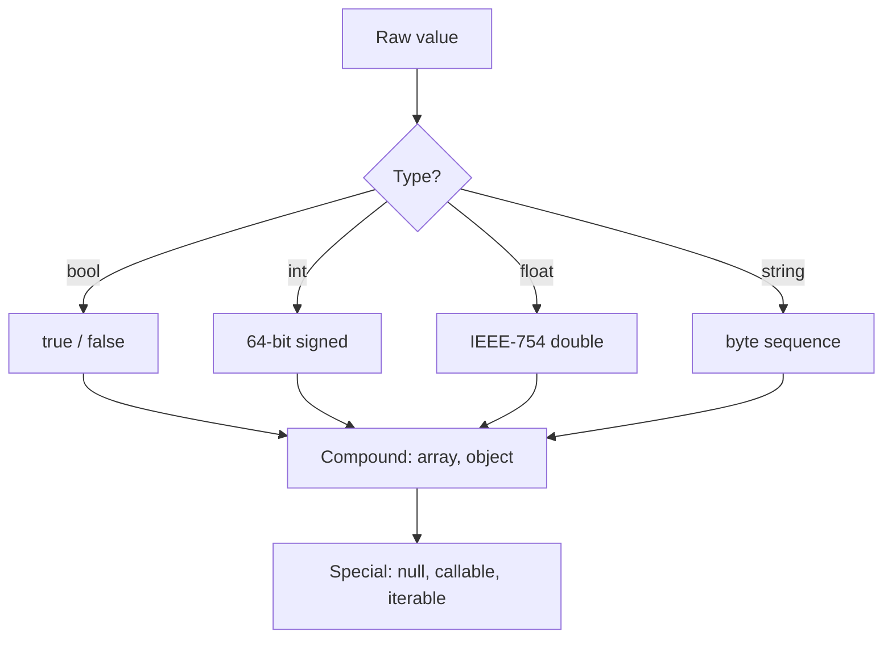
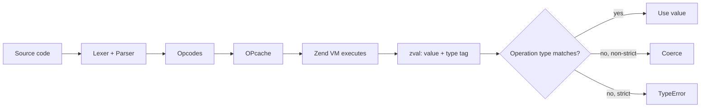
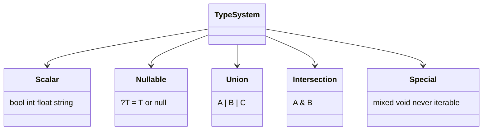
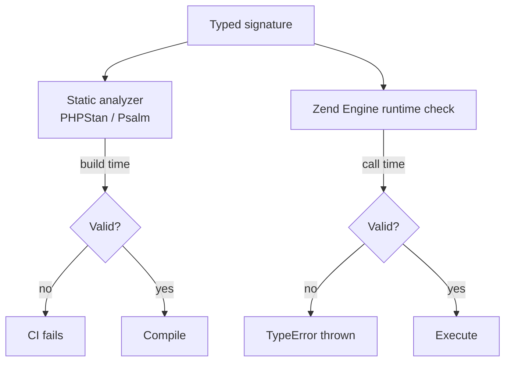
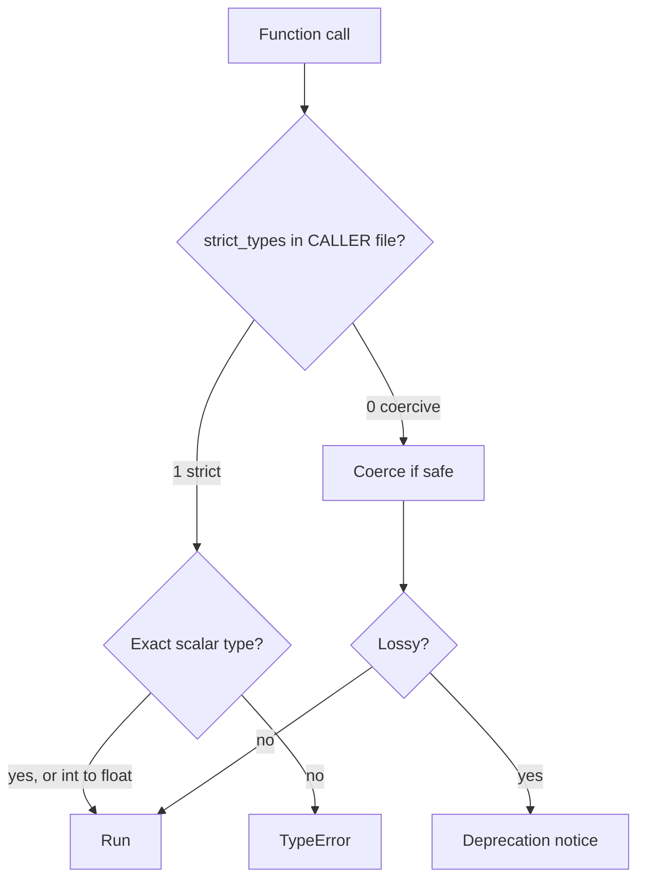
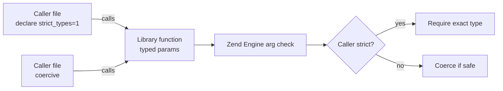

# PHP 8.4 - Complete Professional Guide

> **Category:** 01_programming_languages · **Language:** English

---

### Types, OOP, Enums, Attributes, Fibers, Property Hooks, Composer, PSR
**Edition for PHP 8.4**

> **Reference book (English).** Based on the official PHP documentation (php.net), the PHP RFC archive (wiki.php.net), and the PHP-FIG standards (php-fig.org). A professional, in-depth guide for developers, architects, and teams writing modern, typed, production-grade PHP.
>
> **Scope notice:** this book targets **PHP 8.4** and the idioms of *modern* PHP — strict types, value objects, enums, attributes, fibers, and the 8.4 additions (property hooks, asymmetric visibility, `new` without parentheses, the `#[\Deprecated]` attribute). It assumes you can already run a PHP script and read basic code; from there it builds toward enterprise practice. Each chapter follows the TO-BRAIN editorial standard (see `FILE_CONVENTIONS.md`).

---

## How to read this book

Progressive depth across five maturity levels:

| Level | Profile | Parts |
|-------|---------|-------|
| 1 — Beginner | New to typed/modern PHP | Part I |
| 2 — Intermediate | Functions, arrays, OOP basics | Parts II–III |
| 3 — Advanced | Modern features, errors, namespaces | Parts IV–V |
| 4 — Specialist | Stdlib, dates, database, HTTP | Part VI |
| 5 — Enterprise | Testing, performance, security, deployment | Parts VII–VIII |

**Target audience:** backend developers, full-stack engineers, software architects, tech leads, and CTOs building or modernizing PHP systems on 8.4.

**Structure of each chapter:** Introduction · Business context · Theoretical concepts · Architecture · Diagrams (Mermaid) · Real examples · Step by step · Complete code · Exercises · Challenges · Checklist · Best practices · Anti-patterns · Troubleshooting · Official references.

**Example format:** Scenario · Problem · Solution · Implementation · Result · Future improvements.

> **Note on prerequisites.** All code in this book uses `declare(strict_types=1);` and full type declarations. Where an 8.4 feature replaces an older pattern (e.g., property hooks vs. hand-written getters/setters), we show both so you can recognize and migrate legacy code.

---

## Table of Contents

**Part I – Language Foundations & Types**
1. Syntax, values, and the scalar type system
2. Type declarations: nullable, union, and intersection types
3. `strict_types`, coercion, and `mixed`/`never`/`void`

**Part II – Functions & Arrays**
4. Functions, parameters, named arguments, variadics
5. Arrays, the array functions, and the spread operator
6. Closures, arrow functions, and first-class callable syntax

**Part III – Object-Oriented PHP**
7. Classes, properties, constructor promotion, `readonly`
8. Interfaces, abstract classes, and traits
9. Enums (pure and backed) and first-class callables on methods

**Part IV – Modern Language Features**
10. Attributes and reflection
11. `match`, named args, and `new` in initializers
12. Fibers and cooperative concurrency
13. Property hooks and asymmetric visibility (8.4)

**Part V – Errors, Namespaces & Autoloading**
14. Errors vs. exceptions, the Throwable hierarchy
15. Namespaces, Composer, and PSR-4 autoloading
16. Deprecations with `#[\Deprecated]`

**Part VI – Standard Library, Dates, Database & HTTP**
17. Strings, `mb_*`, and the standard library
18. Dates and `DateTimeImmutable`
19. Databases with PDO
20. HTTP and PSR-7/PSR-15

**Part VII – Testing & Performance**
21. Testing with PHPUnit
22. Performance: OPcache and the JIT

**Part VIII – Security & Deployment**
23. Security: input, output, secrets, and crypto
24. Deployment: configuration, processes, and observability

> **Status of this edition:** phased delivery (each part keeps the same depth standard). **Ready:** Part I (Ch. 1–3). **In progress:** Parts II–VIII.

---

# Part I – Language Foundations & Types

Part I establishes the bedrock: how PHP represents values, how the type system constrains them, and how `strict_types` changes the rules. Modern PHP is a *typed* language in practice — the engine still runs untyped code, but professional codebases declare types everywhere and let the runtime enforce contracts. The three chapters here give you the vocabulary (scalars, compound types, special types) and the discipline (strict mode) that every later chapter assumes.

---

## Chapter 1 — Syntax, values, and the scalar type system

### 1.1 Introduction

PHP is a dynamically typed, interpreted language whose engine (the Zend Engine) compiles source to opcodes and executes them, optionally caching the opcodes (OPcache) and JIT-compiling hot paths. A *value* in PHP has one of a small set of primitive types: `bool`, `int`, `float`, `string`, plus the compound `array` and `object`, and the special `null`, `callable`, `iterable`, and `resource`. This chapter focuses on the **scalars** — `bool`, `int`, `float`, `string` — because they are the atoms from which every richer abstraction is built, and because misunderstanding their conversion rules is the single most common source of subtle bugs.

PHP 8.4 inherits the scalar model unchanged in shape but continues to tighten its edges: implicit, lossy conversions emit deprecation notices, and `strict_types=1` (covered in Chapter 3) lets you opt out of coercion entirely.

### 1.2 Business context

Scalars look trivial, yet they carry real money risk. A `float` used for currency loses cents to binary rounding; a numeric string from a form silently coerced to `int` can drop a leading zero in a postal code; a "truthy" string can flip a feature flag the wrong way. Teams that standardize early on *which scalar represents which concept* — integers in minor units for money, `DateTimeImmutable` for time, validated strings for identifiers — prevent entire classes of production incidents. The business case for understanding scalars is simply correctness at the boundary where untrusted input becomes typed program state.

### 1.3 Theoretical concepts

A scalar is a single, indivisible value. PHP's four scalar types have well-defined literals, ranges, and conversion rules:

- **`bool`** — `true` / `false`. Many values are *falsy*: `false`, `0`, `0.0`, `""`, `"0"`, `[]`, and `null`. Everything else is truthy (notably `"false"` and `"0.0"` are truthy).
- **`int`** — platform-width signed integer (64-bit on modern systems). Literals support `_` separators, hex `0x`, octal `0o`/`0`, and binary `0b`.
- **`float`** — IEEE-754 double. Never use for money. Compare with a tolerance, never with `===`.
- **`string`** — a byte sequence (not inherently Unicode); use `mb_*` functions for multibyte text.



### 1.4 Architecture

Where do scalars sit in the runtime? Every PHP value is stored in a `zval` container that tracks both the value and its type tag. Coercion happens when an operation expects a type different from the tag; the engine either converts (non-strict) or throws a `TypeError` (strict, for typed boundaries).



### 1.5 Real example

**Scenario.** A checkout service receives a price and a quantity from an HTTP form and must compute a line total.

**Problem.** Storing money as `float` produces rounding errors (`0.1 + 0.2 !== 0.3`), and the raw POST values arrive as strings.

**Solution.** Represent money as integer **cents**, validate the inputs explicitly, and never let a `float` touch the total.

**Implementation.**

```php
<?php

declare(strict_types=1);

/**
 * Parse a money string like "19.99" into integer cents (1999).
 */
function parseCents(string $amount): int
{
    if (!preg_match('/^\d+(?:\.\d{1,2})?$/', $amount)) {
        throw new InvalidArgumentException("Invalid money: {$amount}");
    }

    [$whole, $frac] = array_pad(explode('.', $amount), 2, '0');
    $frac = str_pad($frac, 2, '0');           // "9" -> "90"

    return (int) $whole * 100 + (int) $frac;
}

function lineTotalCents(string $unitPrice, string $qty): int
{
    $quantity = filter_var($qty, FILTER_VALIDATE_INT);
    if ($quantity === false || $quantity < 1) {
        throw new InvalidArgumentException("Invalid quantity: {$qty}");
    }

    return parseCents($unitPrice) * $quantity;
}

function formatCents(int $cents): string
{
    return number_format($cents / 100, 2, '.', ',');
}

$total = lineTotalCents('19.99', '3');
echo formatCents($total) . PHP_EOL;   // 59.97
```

**Result.** The total is exact, the inputs are validated, and `float` appears only at the final formatting step where rounding is harmless.

**Future improvements.** Promote money to a dedicated `readonly` value object (Chapter 7) with `Currency`, and use an enum for currency codes (Chapter 9), so the type system enforces that you never add USD to EUR.

### 1.6 Exercises

1. Write a function `isTruthy(mixed $v): bool` and predict the result for `"0"`, `"0.0"`, `"false"`, `[]`, and `0.0`.
2. Print the largest `int` (`PHP_INT_MAX`), then add 1 and observe the conversion to `float`.
3. Parse `"007"` with `(int)` and with `FILTER_VALIDATE_INT`; explain the difference for identifiers like a US zip code.
4. Demonstrate why `0.1 + 0.2 === 0.3` is `false` and write a tolerance-based comparison helper.

### 1.7 Challenges

1. Implement a `Money` parser that supports thousands separators (`"1,234.50"`) and rejects more than two decimal places, with full strict typing.
2. Build a tiny CSV cleaner that reads numeric columns as `int` cents and reports every row that fails validation, without throwing on the first error.

### 1.8 Checklist

- [ ] I know which values are falsy in PHP.
- [ ] I never store money as `float`.
- [ ] I compare floats with a tolerance, never `===`.
- [ ] I validate string-to-int conversions with `filter_var`/`FILTER_VALIDATE_INT`.
- [ ] I use `mb_*` functions for user-facing text.
- [ ] I understand that a PHP `string` is bytes, not Unicode code points.

### 1.9 Best practices

- Treat the HTTP/CLI boundary as untrusted: validate and convert once, then work with typed values internally.
- Prefer integer minor units for money and `DateTimeImmutable` for time.
- Use numeric separators (`1_000_000`) for readability in large literals.
- Reach for `filter_var` over bare casts when input correctness matters.

### 1.10 Anti-patterns

- Casting user input directly with `(int)`/`(float)` and trusting the result.
- Using `==` (loose equality) for security or business decisions — prefer `===`.
- Comparing floats for exact equality.
- Concatenating untrusted strings into SQL or HTML (covered in Chapters 19 and 23).

### 1.11 Troubleshooting

| Symptom | Likely cause | Fix |
|---|---|---|
| `0.1 + 0.2 !== 0.3` | IEEE-754 float rounding | Use integer cents or `bcmath`/tolerance |
| `"007"` becomes `7` | Lossy `(int)` cast | Keep IDs as validated strings |
| Deprecation on implicit conversion | Lossy float→int or null→string | Add explicit casts / enable strict mode |
| `"0"` treated as false in `if` | `"0"` is falsy | Test explicitly (`$s !== ''`) |
| `==` matches unexpected values | Loose type juggling | Use `===` |

### 1.12 Official references

- Types overview: https://www.php.net/manual/en/language.types.php
- Booleans: https://www.php.net/manual/en/language.types.boolean.php
- Integers: https://www.php.net/manual/en/language.types.integer.php
- Floats: https://www.php.net/manual/en/language.types.float.php
- Strings: https://www.php.net/manual/en/language.types.string.php
- Type juggling: https://www.php.net/manual/en/language.types.type-juggling.php

---

## Chapter 2 — Type declarations: nullable, union, and intersection types

### 2.1 Introduction

PHP lets you declare types on parameters, return values, properties, and class constants. Beyond the single scalar types of Chapter 1, the language supports **nullable** types (`?T`), **union** types (`A|B`), **intersection** types (`A&B`), and combinations of these. These declarations are not mere documentation: the engine enforces them at runtime and a static analyzer (PHPStan, Psalm) enforces them at build time. This chapter shows how to express precise contracts so that invalid states become unrepresentable.

### 2.2 Business context

Every untyped boundary is a place where a wrong value can slip through to production. Type declarations move whole categories of bugs from runtime (a 3 a.m. page) to either the developer's editor or the CI pipeline. For a business, that is cheaper defects, faster onboarding (signatures document intent), and safer refactors (the type checker finds every call site that breaks). Intersection types in particular let you say "this argument must satisfy two capabilities at once" — a powerful way to model rich domain contracts without fragile inheritance.

### 2.3 Theoretical concepts

- **Nullable `?T`** — equivalent to `T|null`; the value is either a `T` or `null`.
- **Union `A|B|C`** — the value is exactly one of the listed types. Useful for `int|string` identifiers or `Result|null`.
- **Intersection `A&B`** — the value must be an instance of *all* listed types (interfaces/classes only). Useful for "is both `Countable` and `Traversable`".
- **Special types** — `mixed` (any), `void` (returns nothing), `never` (never returns), `iterable` (`array|Traversable`), `self`/`static`/`parent`.



### 2.4 Architecture

Type declarations are checked at two layers that reinforce each other: the static analyzer at build time and the Zend Engine at runtime. A value that violates a declaration raises a `TypeError`. The architecture below shows the flow from a typed signature to enforcement.



### 2.5 Real example

**Scenario.** A notification service can deliver via email or SMS. A "channel" must be able to both *render* a message and *report* a delivery cost.

**Problem.** Modeling "supports two capabilities" via a deep inheritance tree is rigid; a single interface that bundles unrelated concerns is a leak.

**Solution.** Define two small interfaces and require their **intersection** at the boundary. Use a **union** return for the lookup that may yield a channel or `null`.

**Implementation.**

```php
<?php

declare(strict_types=1);

interface Renderable
{
    public function render(string $message): string;
}

interface Priced
{
    public function costCents(string $message): int;
}

final class EmailChannel implements Renderable, Priced
{
    public function render(string $message): string
    {
        return "Subject: Notification\n\n{$message}";
    }

    public function costCents(string $message): int
    {
        return 0; // email is free in this model
    }
}

final class SmsChannel implements Renderable, Priced
{
    public function render(string $message): string
    {
        return mb_substr($message, 0, 160);
    }

    public function costCents(string $message): int
    {
        return (int) ceil(mb_strlen($message) / 160) * 5;
    }
}

/** Requires BOTH capabilities via an intersection type. */
function dispatch(Renderable&Priced $channel, string $message): int
{
    echo $channel->render($message) . PHP_EOL;
    return $channel->costCents($message);
}

/** Union return: a channel or null when the name is unknown. */
function channelByName(string $name): (Renderable&Priced)|null
{
    return match ($name) {
        'email' => new EmailChannel(),
        'sms'   => new SmsChannel(),
        default => null,
    };
}

$channel = channelByName('sms') ?? throw new RuntimeException('Unknown channel');
$cost = dispatch($channel, 'Your order has shipped.');
echo "Cost: {$cost} cents" . PHP_EOL;
```

**Result.** The compiler and runtime both guarantee that anything passed to `dispatch` can render *and* price a message, with no shared base class.

**Future improvements.** Replace the string channel name with a backed enum (Chapter 9) so `channelByName` cannot be called with an invalid name, and add a `Channel` aggregate interface if the pair of capabilities is always required together.

### 2.6 Exercises

1. Write a function that accepts `int|string` as an identifier and normalizes it to a string.
2. Add a third channel (`PushChannel`) and confirm `dispatch` accepts it with no signature change.
3. Declare a property `private ?DateTimeImmutable $deletedAt` and explain when `null` is meaningful.
4. Change a return type to `never` for a function that always throws; show the analyzer benefits.

### 2.7 Challenges

1. Model a `PaymentMethod` that must be both `Tokenizable` and `Refundable`, then write a processor that only accepts the intersection.
2. Introduce a deliberate type violation and capture the exact `TypeError` message; then fix it and verify PHPStan at level 9 reports nothing.

### 2.8 Checklist

- [ ] Every public function declares parameter and return types.
- [ ] I use `?T` instead of relying on documentation for nullability.
- [ ] I model "all of these capabilities" with intersection types, not god-interfaces.
- [ ] I run a static analyzer at a high level in CI.
- [ ] I prefer `never` for functions that always throw.

### 2.9 Best practices

- Keep interfaces small (interface segregation) so intersections stay expressive.
- Prefer the narrowest type that still compiles; avoid `mixed` unless truly needed.
- Use union types sparingly — many unions hint at a missing abstraction.
- Let the type checker, not comments, document contracts.

### 2.10 Anti-patterns

- Declaring `mixed` everywhere to silence the analyzer.
- Using `@param`/`@return` PHPDoc as the *only* type source when native types exist.
- Wide unions (`int|string|array|object`) that defeat type safety.
- Nullable returns where an exception or a Null Object would be clearer.

### 2.11 Troubleshooting

| Symptom | Likely cause | Fix |
|---|---|---|
| `TypeError` at call site | Argument type mismatch | Fix the caller or widen the parameter |
| Intersection rejected | A type is a scalar/class, not interface-compatible | Use interfaces for intersections |
| Analyzer flags possible `null` | Nullable not handled | Add a guard or `??`/`?->` |
| `void` function "returns null" | Misuse of return value | Don't consume the result of a `void` function |
| `never` function flagged unreachable code | Code after it is dead | Remove the unreachable code |

### 2.12 Official references

- Type declarations: https://www.php.net/manual/en/language.types.declarations.php
- Union types: https://www.php.net/manual/en/language.types.type-system.php
- Intersection types: https://www.php.net/manual/en/language.types.declarations.php#language.types.declarations.composite.intersection
- `null` type: https://www.php.net/manual/en/language.types.null.php
- `never` return type: https://www.php.net/manual/en/migration81.new-features.php

---

## Chapter 3 — `strict_types`, coercion, and `mixed`/`never`/`void`

### 3.1 Introduction

By default PHP runs in *coercive* typing mode: when a typed parameter receives a value of a compatible-but-different scalar type, the engine quietly converts it (`"42"` to `int 42`). The `declare(strict_types=1);` directive flips that file into *strict* mode, where only exact scalar types are accepted (with the single exception of `int` widening to `float`). This chapter explains the two modes, where they apply, and how the special types `mixed`, `void`, and `never` interact with them. Choosing strict mode is the defining decision that separates casual scripts from disciplined applications.

### 3.2 Business context

Coercion is convenient until it hides a bug: a string `"0"` becomes `int 0`, a price `"abc"` becomes `0`, and the error surfaces three layers away as a wrong charge. Strict mode turns these into immediate, localized `TypeError`s at the boundary — failures that are cheap to diagnose. For organizations, mandating `strict_types=1` repository-wide is a low-cost policy with an outsized reduction in "works on my machine" defects, and it makes static analysis dramatically more accurate.

### 3.3 Theoretical concepts

- **Coercive mode (default).** Scalar arguments are converted to the declared type when safe; lossy conversions (e.g., `"1.5"` to `int`) trigger deprecation notices in modern PHP.
- **Strict mode (`declare(strict_types=1);`).** Must be the very first statement in a file. It governs the *calling* file's function calls, not the called function's definitions. Only `int`→`float` widening is allowed.
- **`mixed`** accepts any value; it is the top type and effectively disables checking for that slot.
- **`void`** declares that a function returns no value (you cannot `return $x;`).
- **`never`** declares that a function always throws or exits — control never returns to the caller.



### 3.4 Architecture

The key architectural subtlety: strictness is a property of the **caller's** file. A library can be written without `strict_types`, yet behave strictly when called from a strict file. The diagram shows how the directive at the top of the caller controls the conversion decision in the Zend Engine.



### 3.5 Real example

**Scenario.** A pricing endpoint multiplies a quantity by a unit price in cents and is shared by an HTTP controller and a CLI importer.

**Problem.** In coercive mode, a stray `"3 "` (trailing space) or `"three"` becomes `0`, silently producing a free order line.

**Solution.** Enable `strict_types=1` so the boundary rejects non-`int` quantities, and validate at the edge before calling the strict core.

**Implementation.**

```php
<?php

declare(strict_types=1);

/** Strict core: only true ints are accepted. */
function lineTotalCents(int $quantity, int $unitPriceCents): int
{
    if ($quantity < 1) {
        throw new InvalidArgumentException('Quantity must be >= 1');
    }
    return $quantity * $unitPriceCents;
}

/** Boundary adapter: validates untrusted input, then calls the strict core. */
function lineTotalFromRequest(string $qty, string $price): int
{
    $quantity = filter_var($qty, FILTER_VALIDATE_INT);
    if ($quantity === false) {
        throw new InvalidArgumentException("Bad quantity: {$qty}");
    }

    $cents = filter_var($price, FILTER_VALIDATE_INT);
    if ($cents === false) {
        throw new InvalidArgumentException("Bad price: {$price}");
    }

    return lineTotalCents($quantity, $cents);   // exact ints — passes strict check
}

/** never: this function always terminates the request. */
function abort(string $reason): never
{
    http_response_code(400);
    throw new RuntimeException($reason);
}

try {
    echo lineTotalFromRequest('3', '1999') . PHP_EOL;   // 5997
    echo lineTotalFromRequest('three', '1999');         // throws before reaching core
} catch (InvalidArgumentException $e) {
    abort($e->getMessage());
}
```

**Result.** In strict mode the typed core cannot be fed a coerced zero; bad input fails loudly at the validated boundary, and `never` documents that `abort` does not return.

**Future improvements.** Add a PHP-CS-Fixer rule that requires `declare(strict_types=1);` in every file, and a CI gate that fails the build if it is missing.

### 3.6 Exercises

1. Call `lineTotalCents("3", 1999)` from a strict file and from a coercive file; compare the outcomes.
2. Write a `void` function and confirm the engine rejects `return $value;`.
3. Implement a `redirect(string $url): never` and explain how the analyzer treats code after the call.
4. Trigger a lossy-conversion deprecation in coercive mode and then eliminate it.

### 3.7 Challenges

1. Take a small coercive script and convert it to strict mode, fixing every resulting `TypeError` by adding boundary validation rather than casts.
2. Write a static-analysis configuration that fails when a file is missing `strict_types`, and document the team policy around it.

### 3.8 Checklist

- [ ] Every file begins with `declare(strict_types=1);`.
- [ ] Untrusted input is validated *before* it reaches strict, typed cores.
- [ ] I use `void` for side-effecting functions and `never` for always-throwing ones.
- [ ] I avoid `mixed` unless I truly accept any value.
- [ ] CI enforces strict mode across the repository.

### 3.9 Best practices

- Put `declare(strict_types=1);` as the first line of every PHP file, no exceptions.
- Keep a thin "boundary" layer that validates and converts; keep the core strict and typed.
- Prefer explicit validation (`filter_var`) over relying on coercion to "fix" input.
- Use `never` to give both readers and the analyzer precise control-flow information.

### 3.10 Anti-patterns

- Mixing strict and coercive files and being surprised by inconsistent behavior.
- Sprinkling `(int)`/`(string)` casts to silence `TypeError`s instead of validating.
- Using `mixed` to avoid thinking about the real contract.
- Returning a value from a `void` function (or ignoring a `never` function's intent).

### 3.11 Troubleshooting

| Symptom | Likely cause | Fix |
|---|---|---|
| Same call works in one file, fails in another | Caller's `strict_types` differs | Standardize strict mode everywhere |
| `"3"` accepted as `int` | File is coercive | Add `declare(strict_types=1);` |
| Deprecation: implicit float→int | Lossy coercion | Validate/cast intentionally |
| `Cannot use return value in void` | Returning from `void` | Change the return type or remove the value |
| Analyzer warns of unreachable code | Code after a `never` call | Delete the dead code |

### 3.12 Official references

- `strict_types` / type juggling: https://www.php.net/manual/en/language.types.declarations.php#language.types.declarations.strict
- `declare`: https://www.php.net/manual/en/control-structures.declare.php
- `mixed` type: https://www.php.net/manual/en/language.types.mixed.php
- `void` return: https://www.php.net/manual/en/language.types.void.php
- `never` return: https://www.php.net/manual/en/language.types.never.php

---

> **End of Part I.** You now have the type vocabulary and the strict-mode discipline that every later chapter assumes: scalars and their conversion traps, the full declaration system (nullable, union, intersection), and the rules of coercive vs. strict typing. Part II builds on this foundation with functions, arrays, and closures — including named arguments, the spread operator, and the first-class callable syntax — before Part III takes the leap into modern object-oriented PHP, where the 8.4 additions (property hooks, asymmetric visibility) finally come into play.

<!--APPEND-PARTE-II-->
