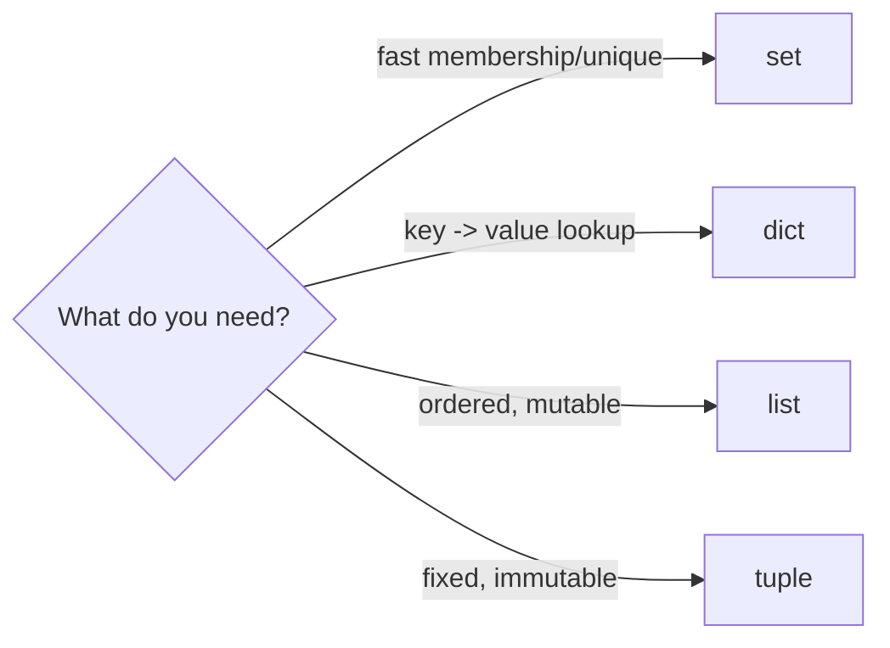
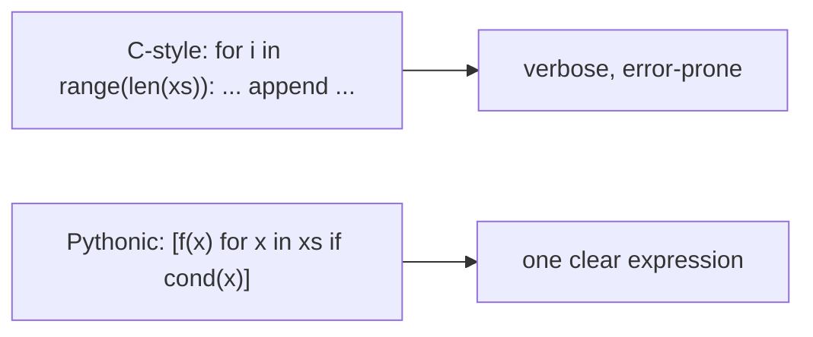
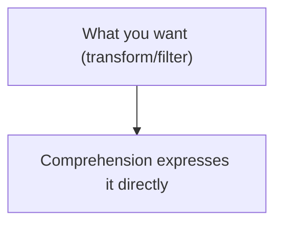

# Python 3.13 - Complete Professional Guide

> **Category:** 01_programming_languages · **Language:** English

---

### Pythonic style, data structures, and the data model
**Original guide written from first principles, current to 2026 (Python 3.13)**

> **Original reference book (English).** This is an **independent, originally written** guide. It is not an extract, summary, or paraphrase of any third-party book; it teaches Python from first principles with original examples. Canonical books are listed under **References** as pointers only. Each chapter follows the TO-BRAIN editorial standard (see `FILE_CONVENTIONS.md`).
>
> **Scope notice:** Python is a high-level, readable, batteries-included language. This guide covers its core data structures and the "Pythonic" idioms that make code clear and effective, current to 2026 (Python 3.13, type hints).

---

## How to read this guide

| Level | Profile | Parts |
|-------|---------|-------|
| 1 — Beginner | New to Python | Part I |
| 2 — Intermediate | Writing idiomatic Python | Part II |

**Target audience:** developers learning Python for scripting, web, data, or general use.

**Structure of each chapter:** Introduction · Business context · Theoretical concepts · Architecture · Diagrams (Mermaid) · Real examples · Step by step · Complete examples · Exercises · Challenges · Checklist · Best practices · Anti-patterns · Troubleshooting · References.

> **Note on prerequisites.** Assumes basic programming concepts.

---

## Table of Contents

**Part I – Foundations**
1. Core data structures (list, dict, set, tuple)
2. Pythonic idioms: comprehensions and iteration

**Part II – Larger programs**
3. Functions, modules, and type hints

> **Status of this guide:** phased delivery. **Ready:** Part I (Ch. 1–2). **In progress:** Part II.

---

## Part I – Foundations

Python's appeal is **readability** and a rich standard library — you can express a lot, clearly, with little code. Two things make someone effective in Python: fluency with the built-in **data structures** (which solve most problems directly) and writing **idiomatic** ("Pythonic") code rather than translating another language literally. This part builds both.

---

## Chapter 1 — Core data structures

### 1.1 Introduction

Python's built-in data structures cover most needs: **list** (ordered, mutable sequence), **dict** (key→value mapping), **set** (unordered unique items), and **tuple** (ordered, immutable). Choosing the right one makes code simpler and faster. Much of writing good Python is just reaching for the right built-in instead of building machinery by hand.

### 1.2 Business context

Using the wrong data structure makes code slower and more complex — e.g. scanning a list to check membership (O(n)) where a set or dict lookup is O(1). Fluency with these built-ins means common tasks (deduplication, counting, grouping, lookups) become a line or two of clear, fast code. This directly affects both performance and how quickly developers can write and read solutions — Python's productivity comes largely from these structures.

### 1.3 Theoretical concepts: pick the right structure

```mermaid
mindmap
  root((Built-in structures))
    list
      ordered, mutable
      indexing, iteration
    dict
      key -> value, O(1) lookup
      counting, grouping
    set
      unique items, O(1) membership
      dedupe, intersection
    tuple
      ordered, immutable
      fixed records, keys
```

- **list** `[...]` — default ordered collection; append, index, slice, iterate.
- **dict** `{k: v}` — fast key lookups; the workhorse for mappings, counting, grouping.
- **set** `{...}` — fast membership and dedup; set algebra (union/intersection).
- **tuple** `(...)` — immutable fixed-size records; usable as dict keys.

Pick by access pattern: need fast membership/uniqueness → set; key lookup → dict; ordered/mutable → list; fixed immutable → tuple.

### 1.4 Architecture: structure fits the access pattern



### 1.5 Real example

**Scenario.** Count how many times each word appears in a text.

**Problem.** A manual approach (list of pairs, scanning to update counts) is verbose and O(n²).

**Solution.** A dict (or `collections.Counter`) gives O(n) counting in a couple of lines.

**Implementation.**

```python
from collections import Counter

text = "the cat sat on the mat the cat"
counts = Counter(text.split())     # dict subclass: word -> count, O(n)
# counts == Counter({'the': 3, 'cat': 2, 'sat': 1, 'on': 1, 'mat': 1})
print(counts.most_common(2))       # [('the', 3), ('cat', 2)]
```

**Result.** Counting is one expressive line and runs in linear time, versus a manual, error-prone, slow approach. The right built-in (a dict-based Counter) solved it directly.

**Future improvements.** Use a `set` to get unique words, a `dict` to group, etc. — match the structure to each task.

### 1.6 Exercises

1. When do you choose a set over a list?
2. What's the lookup complexity of a dict vs scanning a list?
3. Why use a tuple instead of a list?

### 1.7 Challenges

- **Challenge.** Take a task you'd solve with nested loops over lists. Rewrite it using a dict or set for O(1) lookups. Compare clarity and speed.

### 1.8 Checklist

- [ ] I choose data structures by access pattern.
- [ ] I use sets for uniqueness/membership.
- [ ] I use dicts for lookups, counting, grouping.
- [ ] I use tuples for fixed, immutable records.

### 1.9 Best practices

- Reach for the right built-in before writing machinery.
- Use `collections` (Counter, defaultdict) for common patterns.
- Prefer O(1) set/dict lookups over scanning lists.

### 1.10 Anti-patterns

- Scanning lists for membership where a set fits.
- Parallel lists instead of a dict or list of records.
- Mutating data that should be an immutable tuple.

### 1.11 Troubleshooting

| Symptom | Likely cause | Action |
|---------|--------------|--------|
| Slow membership checks | Using a list | Use a set for O(1) membership |
| Verbose counting/grouping | Manual loops | Use dict / Counter / defaultdict |
| Accidental mutation | Wrong (mutable) structure | Use a tuple for fixed data |

### 1.12 References

- E. Matthes, *Python Crash Course*, 3rd ed. (No Starch Press, 2023) — ISBN 978-1718502703.
- Python docs, "Data Structures": https://docs.python.org/3/tutorial/datastructures.html.

---

## Chapter 2 — Pythonic idioms

### 2.1 Introduction

Writing **Pythonic** code means using Python's idioms rather than translating patterns from other languages. The signature example is the **comprehension** — building a list/dict/set from an iterable in one readable expression — and iterating directly over items instead of indices. Idiomatic Python is shorter, clearer, and often faster.

### 2.2 Business context

Non-idiomatic Python (C-style index loops, manual accumulation) is more verbose, more bug-prone, and harder for other Python developers to read. Writing idiomatic code makes it instantly readable to the broad Python community and to your future self, and often runs faster (comprehensions are optimized). Code readability is Python's core value proposition; writing Pythonic code is how you realize it — directly affecting maintainability and team velocity.

### 2.3 Theoretical concepts: comprehensions and direct iteration



A **comprehension** `[expr for item in iterable if condition]` builds a collection declaratively. Iterate directly over elements (`for x in xs`) rather than indices; use `enumerate` when you need the index, `zip` to iterate pairs, and unpacking (`a, b = pair`) for clarity. These idioms replace boilerplate with intent.

### 2.4 Architecture: express intent, not mechanics



### 2.5 Real example

**Scenario.** Build a list of the squares of even numbers from a list.

**Problem.** A C-style index loop with manual appends is verbose and obscures intent.

**Solution.** A single comprehension states the transform and filter directly.

**Implementation.**

```python
nums = [1, 2, 3, 4, 5, 6]

# NON-PYTHONIC: index loop + manual append
result = []
for i in range(len(nums)):
    if nums[i] % 2 == 0:
        result.append(nums[i] ** 2)

# PYTHONIC: one readable comprehension (transform + filter)
result = [n ** 2 for n in nums if n % 2 == 0]   # [4, 16, 36]
```

**Result.** The comprehension expresses the intent ("squares of the even numbers") in one line — clearer, less error-prone, and idiomatic. Any Python developer reads it instantly.

**Future improvements.** Use dict/set comprehensions and generator expressions (`(... for ...)`) for lazy iteration over large data.

### 2.6 Exercises

1. What is a comprehension and what does it replace?
2. Why iterate over items, not indices?
3. When do you use `enumerate` or `zip`?

### 2.7 Challenges

- **Challenge.** Find a C-style loop in your code that builds a list. Rewrite it as a comprehension. Is the intent clearer?

### 2.8 Checklist

- [ ] I use comprehensions for transform/filter.
- [ ] I iterate over items, not indices.
- [ ] I use `enumerate`/`zip`/unpacking idiomatically.
- [ ] My code reads as intent, not mechanics.

### 2.9 Best practices

- Prefer comprehensions for building collections.
- Iterate directly; use enumerate/zip when needed.
- Use generator expressions for large/lazy data.

### 2.10 Anti-patterns

- C-style `for i in range(len(...))` index loops.
- Manual accumulation where a comprehension fits.
- Over-long/nested comprehensions that hurt readability (use a loop then).

### 2.11 Troubleshooting

| Symptom | Likely cause | Action |
|---------|--------------|--------|
| Verbose, unidiomatic code | Translating from another language | Use comprehensions/direct iteration |
| Off-by-one/index bugs | Index-based loops | Iterate over items directly |
| Memory blowup on big data | Building full lists | Use generator expressions |

### 2.12 References

- E. Matthes, *Python Crash Course*, 3rd ed. (No Starch Press, 2023) — ISBN 978-1718502703.
- "PEP 8 – Style Guide for Python Code": https://peps.python.org/pep-0008/.

---

> **End of Part I.** You can now write effective Python: choose the right built-in **data structure** for each access pattern (list/dict/set/tuple, plus `collections`) to get simple, fast solutions, and write **Pythonic** code using comprehensions and direct iteration to express intent rather than mechanics. **Part II — Larger programs** (Chapter 3) covers structuring code with functions and modules, and adding type hints for clarity and tooling in bigger codebases.

<!--APPEND-PART-II-->
