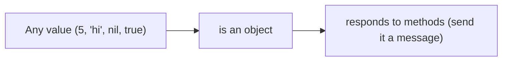
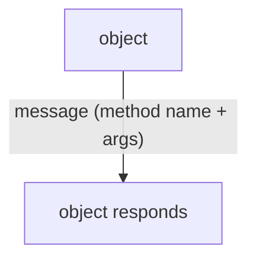
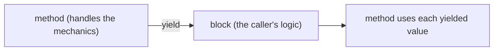
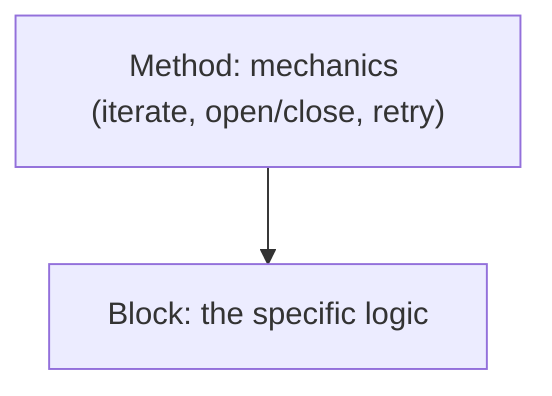

# Ruby 3.4 - Complete Professional Guide

> **Category:** 01_programming_languages · **Language:** English

---

### Everything is an object, blocks, and expressive code
**Original guide written from first principles, current to 2026 (Ruby 3.4)**

> **Original reference book (English).** This is an **independent, originally written** guide. It is not an extract, summary, or paraphrase of any third-party book; it teaches Ruby from first principles with original examples. Canonical books are listed under **References** as pointers only. Each chapter follows the TO-BRAIN editorial standard (see `FILE_CONVENTIONS.md`).
>
> **Scope notice:** Ruby is a dynamic, object-oriented language designed for programmer happiness and expressiveness. This guide covers its pure object model and blocks — what makes Ruby distinctive — current to 2026 (Ruby 3.4).

---

## How to read this guide

| Level | Profile | Parts |
|-------|---------|-------|
| 1 — Beginner | New to Ruby | Part I |
| 2 — Intermediate | Writing idiomatic Ruby | Part II |

**Target audience:** developers learning Ruby for web (Rails), scripting, or tooling.

**Structure of each chapter:** Introduction · Business context · Theoretical concepts · Architecture · Diagrams (Mermaid) · Real examples · Step by step · Complete examples · Exercises · Challenges · Checklist · Best practices · Anti-patterns · Troubleshooting · References.

> **Note on prerequisites.** Assumes basic programming and OO concepts.

---

## Table of Contents

**Part I – Distinctive Ruby**
1. Everything is an object
2. Blocks and iterators

**Part II – Idiomatic Ruby**
3. Modules, mixins, and expressiveness

> **Status of this guide:** phased delivery. **Ready:** Part I (Ch. 1–2). **In progress:** Part II.

---

## Part I – Distinctive Ruby

Ruby optimizes for **developer happiness** — readable, expressive code that often reads like English. Two design choices define it: **everything is an object** (even numbers and `nil`), making the model uniform and consistent, and **blocks** (anonymous chunks of code passed to methods), which power Ruby's elegant iteration and DSLs. Grasp these and Ruby's style clicks.

---

## Chapter 1 — Everything is an object

### 1.1 Introduction

In Ruby, **everything is an object** — integers, strings, `nil`, even classes themselves. Every value responds to **methods** (`5.times`, `"hi".upcase`, `nil.to_s`), and there are no primitives sitting outside the object model. This uniformity makes the language consistent: there are no special cases to remember, just objects and the messages (method calls) you send them.

### 1.2 Business context

A uniform object model makes Ruby predictable and highly malleable: the same rules apply everywhere, and you can extend or customize behavior consistently (even adding methods to core classes). This consistency and flexibility is why Ruby enables expressive libraries and DSLs (like Rails) that read almost like natural language — boosting developer productivity. Understanding "everything is an object" is the key to reading and writing idiomatic Ruby and leveraging its ecosystem.

### 1.3 Theoretical concepts: objects all the way down



Calling a method is **sending a message** to an object. Numbers have methods (`3.times { ... }`), `nil` is an object (`nil.to_a == []`), and classes are objects too. There are no operators that aren't methods (`1 + 2` is `1.+(2)`). This means you can ask any object what it can do (`obj.methods`) and extend behavior uniformly.

### 1.4 Architecture: send messages to objects



### 1.5 Real example

**Scenario.** Repeat an action a number of times.

**Problem.** In many languages this is a C-style `for` loop with an index; in Ruby that's unidiomatic.

**Solution.** Send the `times` message to the integer object — readable and object-oriented.

**Implementation.**

```ruby
# Unidiomatic (C-style): for i in 0...3 ...
# Idiomatic Ruby: the integer IS an object; call its method with a block
3.times { |i| puts "hello #{i}" }   # 3 is an object; .times takes a block

# even nil and true are objects:
nil.to_s      # ""  (nil responds to to_s)
true.class    # TrueClass
```

**Result.** Iteration reads as "3 times, do this" — expressive and consistent with the object model. There are no special primitive cases; you just send messages to objects.

**Future improvements.** Explore the rich methods on core objects (`Enumerable`, `Comparable`) — Ruby's expressiveness comes from these object methods plus blocks (Chapter 2).

### 1.6 Exercises

1. What does "everything is an object" mean in Ruby?
2. What is "sending a message"?
3. Give an example of a method on a number and on `nil`.

### 1.7 Challenges

- **Challenge.** Take a C-style loop and rewrite it using an object method + block (`times`, `each`, `map`). Is it more readable?

### 1.8 Checklist

- [ ] I treat all values as objects.
- [ ] I call methods (send messages) rather than use special syntax.
- [ ] I use object methods + blocks for iteration.
- [ ] I explore objects' methods to write idiomatic code.

### 1.9 Best practices

- Embrace the uniform object model; prefer methods over special forms.
- Use core object methods (Enumerable etc.) for expressiveness.
- Write code that reads like intent.

### 1.10 Anti-patterns

- C-style index loops instead of iterator methods.
- Treating Ruby like a procedural language.
- Ignoring the rich methods objects already provide.

### 1.11 Troubleshooting

| Symptom | Likely cause | Action |
|---------|--------------|--------|
| Verbose, non-Ruby-ish code | Procedural style | Use object methods + blocks |
| Reinventing built-ins | Unaware of core methods | Explore Enumerable/Comparable |
| NoMethodError on nil | nil is an object; method missing | Handle nil; use safe navigation `&.` |

### 1.12 References

- N. Rappin, D. Thomas, *Programming Ruby 3.3* (Pragmatic Bookshelf, 2024) — ISBN 978-1680509878.
- Ruby docs: https://ruby-doc.org; https://www.ruby-lang.org.

---

## Chapter 2 — Blocks and iterators

### 2.1 Introduction

A **block** is an anonymous piece of code you pass to a method, written with `{ ... }` or `do ... end`. Methods can **yield** to the block, running it (often repeatedly). Blocks power Ruby's elegant **iterators** (`each`, `map`, `select`) and are the basis of its expressive, almost-English style. They're Ruby's signature feature.

### 2.2 Business context

Blocks let methods handle the mechanics (iterating, opening/closing resources, setting up context) while the caller supplies the unique logic — a powerful separation that eliminates boilerplate. This is why Ruby code for transforming collections or managing resources is so concise and readable, and why DSLs (configuration, testing, Rails routes) read naturally. Fluency with blocks is essential to productivity in Ruby and its ecosystem.

### 2.3 Theoretical concepts: pass behavior to methods



A method `yield`s control to the block, optionally passing values. **Iterators** like `each` yield each element; `map` collects what the block returns; `select` keeps elements where the block is truthy. Blocks also wrap resource handling (`File.open(...) { |f| ... }` closes the file automatically) — the method manages setup/teardown, the block does the work.

### 2.4 Architecture: method + block division of labor



### 2.5 Real example

**Scenario.** Transform a list of names to uppercase and keep the long ones.

**Problem.** A manual loop with accumulation is verbose and mixes mechanics with logic.

**Solution.** Iterator methods + blocks express transform and filter declaratively.

**Implementation.**

```ruby
names = ["ana", "bob", "carolina"]

# blocks supply the logic; the iterator methods handle the looping
result = names
  .map { |n| n.upcase }            # transform: ["ANA", "BOB", "CAROLINA"]
  .select { |n| n.length > 3 }     # filter:    ["CAROLINA"]

# resource handling via block — file auto-closed after the block
File.open("out.txt", "w") { |f| f.puts(result) }
```

**Result.** Transform and filter read as intent (`map`, `select` with blocks), and the file is automatically closed by the block-based method. Mechanics (looping, resource lifecycle) are handled by the methods; the blocks hold just the logic.

**Future improvements.** Chain `Enumerable` methods (`reduce`, `group_by`, `each_with_object`) for richer data transforms; learn to write your own block-taking methods with `yield`.

### 2.6 Exercises

1. What is a block and how is one passed?
2. What does `yield` do?
3. Contrast `map` and `select`.

### 2.7 Challenges

- **Challenge.** Write a method that takes a block and yields to it (e.g. a `repeat(n)` that yields n times). Then use blocks to transform a collection with `map`/`select`.

### 2.8 Checklist

- [ ] I pass blocks to methods for logic.
- [ ] I use iterator methods (each/map/select) over manual loops.
- [ ] I use block-based resource handling.
- [ ] I can write methods that `yield`.

### 2.9 Best practices

- Use blocks to separate mechanics (method) from logic (block).
- Prefer Enumerable iterators over hand-written loops.
- Use block forms for resources (auto cleanup).

### 2.10 Anti-patterns

- Manual loops where `map`/`select`/`each` fit.
- Not using block-based resource methods (leaks).
- Over-long blocks that should be named methods.

### 2.11 Troubleshooting

| Symptom | Likely cause | Action |
|---------|--------------|--------|
| Verbose collection code | Manual loops | Use map/select/reduce with blocks |
| Leaked resources (files, etc.) | Not using block form | Use `File.open(...) { ... }` |
| Repeated mechanics | No block abstraction | Write a method that yields |

### 2.12 References

- N. Rappin, D. Thomas, *Programming Ruby 3.3* (Pragmatic Bookshelf, 2024) — ISBN 978-1680509878.
- Ruby `Enumerable` docs: https://ruby-doc.org/core/Enumerable.html.

---

> **End of Part I.** You can now work with Ruby's distinctive core: a **pure object model** where everything (numbers, `nil`, classes) is an object you send messages to — uniform and malleable — and **blocks** that pass logic to methods, powering expressive iterators and resource handling where the method owns the mechanics and the block owns the logic. **Part II — Idiomatic Ruby** (Chapter 3) covers modules and mixins for sharing behavior across classes, and the expressive idioms that make Ruby (and Rails) read so naturally.

<!--APPEND-PART-II-->
