# Rust 2024 - Complete Professional Guide

> **Category:** 01_programming_languages · **Language:** English

---

## Rust — Complete Professional Guide
### Ownership, Borrowing, Traits, Generics, Error Handling, Async, Cargo
**Edition for Rust (2024 edition)**

> **Reference book (English).** Based on the official Rust documentation (doc.rust-lang.org, the Rust Reference, the Cargo Book, and the standard library API docs). All prose, examples, and diagrams are original and written for this corpus. No copyrighted book text is reproduced.
>
> **Scope notice:** This guide targets the Rust 2024 edition and a stable toolchain (rustc 1.85+). It covers the language, the standard library, and the surrounding tooling that professional teams rely on. Each chapter follows the TO-BRAIN editorial standard.

---

## How to read this book

This book is organized by **maturity level**. Each level maps to a Part of the table of contents, so you can enter at the rung that matches your current experience and climb from there.

| Level | Profile | Focus | Maps to |
|-------|---------|-------|---------|
| 1 — Foundations | New to Rust | Toolchain, Cargo, syntax, ownership intuition | Part I |
| 2 — Core model | Can compile small programs | Borrowing, lifetimes, the type system, pattern matching | Parts II–III |
| 3 — Abstraction | Comfortable with the borrow checker | Traits, generics, collections, iterators, error handling | Parts IV–VI |
| 4 — Systems | Builds libraries and services | Modules, smart pointers, concurrency, async/await | Parts VI–VII |
| 5 — Mastery | Ships production crates | Macros, testing, unsafe/FFI, performance, releasing | Part VIII |

**Target audience:** developers coming from C, C++, Go, Java, C#, Python, or JavaScript who want a precise, professional working knowledge of Rust — not a tour, but a reference you can hold to while shipping.

**Structure of each chapter:** Introduction · Business context · Theoretical concepts · Architecture · Diagrams (Mermaid) · Real examples · Step by step · Complete code · Exercises · Challenges · Checklist · Best practices · Anti-patterns · Troubleshooting · Official references.

**Example format:** Scenario · Problem · Solution · Implementation · Result · Future improvements.

---

## Table of Contents

**Part I — Foundations, the toolchain, and Cargo**
1. Getting started: rustc, rustup, Cargo, and your first crate
2. Ownership and borrowing: the memory model that defines Rust
3. Types, structs, enums, and pattern matching

**Part II — The borrow model in depth**
4. References, mutability, and aliasing rules
5. Lifetimes and the lifetime elision rules
6. Slices, strings, and the `Sized` boundary

**Part III — The type system**
7. Scalar, compound, and user-defined types
8. Enums as sum types; `Option` and `Result` as data
9. Exhaustive pattern matching and guards

**Part IV — Traits and generics**
10. Defining and implementing traits; default methods
11. Generic functions, structs, and bounds
12. Trait objects, dynamic dispatch, and `dyn`
13. Associated types, supertraits, and coherence

**Part V — Collections and iterators**
14. `Vec`, `HashMap`, `BTreeMap`, `VecDeque`, `HashSet`
15. The `Iterator` trait and adapter chains
16. Closures: `Fn`, `FnMut`, `FnOnce`, and capture

**Part VI — Error handling, modules, and crates**
17. `Result`, `Option`, and the `?` operator
18. Custom error types with `thiserror`; application errors with `anyhow`
19. Modules, paths, visibility, and the crate graph
20. Smart pointers: `Box`, `Rc`, `Arc`, `RefCell`, `Cell`, `Weak`

**Part VII — Concurrency and async**
21. Threads, `Send`, `Sync`, and shared state with `Mutex`/`RwLock`
22. Message passing with channels
23. Futures, `async`/`await`, and the `tokio` runtime

**Part VIII — Macros, testing, unsafe, performance, and release**
24. Declarative and procedural macros
25. Unit tests, integration tests, doctests, and benchmarks
26. `unsafe`, raw pointers, and FFI
27. Performance: zero-cost abstractions, profiling, and allocation
28. Building and releasing: profiles, features, semver, and publishing

---

> **Status of this edition:** phased delivery. The book is published incrementally so that each Part is complete and accurate before the next is released. **Ready:** Parts I–III (Ch. 1–9). **In progress:** Parts IV–VIII.

---

## Part I – Foundations, the toolchain, and Cargo

Rust earns its reputation at the point where most languages force a trade: it gives you the control and predictability of a systems language while preventing entire classes of memory and concurrency bugs at compile time. Part I builds the foundation that makes the rest of the book legible. You will install and drive the toolchain, learn how Cargo structures real projects, and — most importantly — internalize ownership and borrowing, the single idea that everything else in Rust depends on. By the end of these three chapters you can read idiomatic Rust, model data with structs and enums, and reason about who owns what.

---

## Chapter 1 — Getting started: rustc, rustup, Cargo, and your first crate

### 1.1 Introduction

Rust is a compiled, statically typed language with no garbage collector and no runtime overhead in its core abstractions. You rarely call `rustc` directly; instead you work through two tools. **rustup** manages toolchain versions and components. **Cargo** is the build system and package manager — it compiles your code, resolves dependencies, runs tests, and publishes crates. This chapter gets you productive with both and explains what a *crate*, a *package*, and an *edition* actually are.

### 1.2 Business context

Toolchain consistency is a business concern, not a developer preference. When every engineer and every CI runner uses the same pinned toolchain (via a `rust-toolchain.toml` file) and the same locked dependency graph (`Cargo.lock`), builds become reproducible. Reproducible builds mean a bug reproduced locally is the same bug that shipped, audits are tractable, and onboarding a new hire is `git clone` plus `cargo build`. The 2024 edition lets teams adopt new language behavior per-package without forcing a global migration, so large organizations can modernize crate by crate.

### 1.3 Theoretical concepts

A **package** is a directory with a `Cargo.toml` manifest. A package contains one or more **crates** — the unit of compilation. A crate is either a **binary** (has a `main` function, produces an executable) or a **library** (produces a reusable artifact). The **edition** (2015, 2018, 2021, 2024) selects a set of language defaults; editions are opt-in and interoperable, so a 2024 crate can depend on a 2018 crate. The **module system** organizes items *inside* a crate; the dependency graph organizes crates *across* packages.

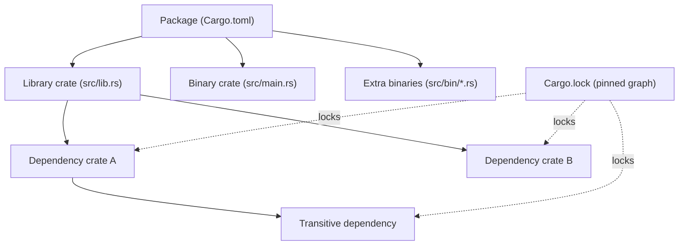

### 1.4 Architecture

The flow from source to running program passes through Cargo, which orchestrates `rustc`, fetches dependencies from the registry, and caches compiled artifacts under `target/`.

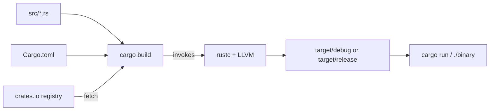

### 1.5 Real example

**Scenario.** Your team needs a small command-line tool that greets a configurable number of users, distributed as a reproducible binary.

**Problem.** New developers compile with different toolchain versions, producing subtly different binaries and "works on my machine" reports.

**Solution.** Create a Cargo package, pin the toolchain, and write a tiny but idiomatic program. Cargo plus `Cargo.lock` and `rust-toolchain.toml` makes the build deterministic.

**Implementation.**

```rust
// src/main.rs
fn greet(name: &str) -> String {
    format!("Hello, {name}!")
}

fn main() {
    let names = ["Ada", "Linus", "Grace"];
    for name in names {
        println!("{}", greet(name));
    }
    println!("Greeted {} users.", names.len());
}
```

```toml
# Cargo.toml
[package]
name = "greeter"
version = "0.1.0"
edition = "2024"

[dependencies]
```

```toml
# rust-toolchain.toml — every machine builds with the same compiler
[toolchain]
channel = "1.85.0"
components = ["rustfmt", "clippy"]
```

Run it with `cargo run`. Format with `cargo fmt` and lint with `cargo clippy`.

**Result.** A reproducible binary in `target/release/greeter` after `cargo build --release`. Every developer and CI runner uses channel 1.85.0, so the output and artifacts match.

**Future improvements.** Read the user list from arguments using the `clap` crate; add a `--lang` flag; emit a non-zero exit code when no names are supplied.

### 1.6 Exercises

1. Create a new binary package with `cargo new metrics` and a new library with `cargo new --lib units`.
2. Add `units` as a path dependency of `metrics` and call a function across the crate boundary.
3. Run `cargo build`, then inspect what changed in `Cargo.lock`.
4. Add a second binary at `src/bin/report.rs` and run it with `cargo run --bin report`.

### 1.7 Challenges

1. Pin a nightly toolchain only for a `bench` subcommand while keeping stable as the default, using `rustup override` or `cargo +nightly`.
2. Configure a `[profile.release]` section that enables `lto = true` and `codegen-units = 1`, then measure the binary-size and build-time impact.

### 1.8 Checklist

- [ ] `rustup`, `cargo`, `rustfmt`, and `clippy` are installed and on PATH.
- [ ] The package builds with `cargo build` and runs with `cargo run`.
- [ ] A `rust-toolchain.toml` pins the channel for the whole team.
- [ ] `Cargo.lock` is committed for binaries (and intentionally handled for libraries).
- [ ] `cargo fmt --check` and `cargo clippy` pass with no warnings.

### 1.9 Best practices

- Use `cargo new` and `cargo add` instead of hand-editing manifests; they keep formatting and versions correct.
- Commit `Cargo.lock` for applications to lock the exact dependency graph.
- Run `cargo clippy` in CI and treat its lints as errors with `-D warnings`.
- Keep `edition = "2024"` for new code to get the latest defaults.

### 1.10 Anti-patterns

- Calling `rustc` by hand for multi-file projects instead of letting Cargo manage the build.
- Deleting `Cargo.lock` to "fix" a dependency issue; this hides the real version conflict.
- Committing the `target/` directory; it is large, machine-specific, and rebuildable.
- Mixing global toolchain overrides with per-project pins, producing inconsistent builds.

### 1.11 Troubleshooting

| Symptom | Likely cause | Resolution |
|---------|--------------|------------|
| `command not found: cargo` | rustup PATH not loaded | Source the cargo env or restart the shell after install |
| `edition 2024 is unstable` | Toolchain too old | `rustup update`; ensure channel ≥ 1.85 |
| Dependency resolves to unexpected version | Stale `Cargo.lock` or wildcard version | `cargo update -p <crate>`; pin a caret version |
| Build is slow on every change | Whole-crate rebuild | Split into smaller crates; enable incremental builds (default in debug) |
| `linker cc not found` | Missing system C toolchain | Install build tools (e.g. `build-essential`, Xcode CLT, or MSVC) |

### 1.12 Official references

- The Cargo Book — https://doc.rust-lang.org/cargo/
- rustup documentation — https://rust-lang.github.io/rustup/
- Editions guide — https://doc.rust-lang.org/edition-guide/
- `cargo` command reference — https://doc.rust-lang.org/cargo/commands/

---

## Chapter 2 — Ownership and borrowing: the memory model that defines Rust

### 2.1 Introduction

Ownership is the rule system that lets Rust guarantee memory safety without a garbage collector and without manual `free`. Every value has exactly one owner; when the owner goes out of scope, the value is dropped. You can lend access through references — *borrows* — under rules the compiler enforces. This chapter teaches ownership, moves, copies, and the borrowing rules well enough that the borrow checker stops feeling like an obstacle and starts feeling like a design tool.

### 2.2 Business context

Memory-safety defects — use-after-free, double-free, data races, buffer overruns — account for a large share of critical security vulnerabilities in C and C++ codebases. Rust eliminates these at compile time, which converts a class of expensive production incidents into cheap compiler errors. For a business, that means fewer emergency patches, lower audit cost, and the ability to write performance-critical code without a garbage collector's latency spikes.

### 2.3 Theoretical concepts

There are three ownership rules: each value has one owner; there is exactly one owner at a time; when the owner leaves scope, the value is dropped. Assigning a non-`Copy` value **moves** it — the source is no longer usable. Types that are cheap and have no special drop logic (integers, `bool`, `char`, and tuples of such) implement `Copy` and are duplicated instead of moved. Borrowing produces references governed by two rules at any given moment: you may have **either** one mutable reference (`&mut T`) **or** any number of shared references (`&T`), but not both, and references must never outlive the data they point to.

```mermaid
stateDiagram-v2
    [*] --> Owned: let s = String::from("hi")
    Owned --> Moved: let t = s  (move)
    Moved --> [*]: s no longer usable
    Owned --> SharedBorrow: &s (one or many)
    Owned --> MutBorrow: &mut s (exclusive)
    SharedBorrow --> Owned: borrow ends
    MutBorrow --> Owned: borrow ends
    Owned --> Dropped: scope ends
    Dropped --> [*]
```

### 2.4 Architecture

A `String` is a fat pointer on the stack (pointer, length, capacity) that owns a buffer on the heap. Moving the `String` copies the three stack words and invalidates the source, so only one owner ever frees the heap buffer. A borrow is just a pointer into existing data and frees nothing.

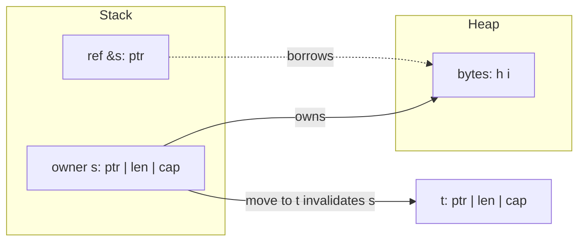

### 2.5 Real example

**Scenario.** A text-processing service must count word frequencies in a large document without copying the document repeatedly.

**Problem.** A naive implementation clones the input into every helper, multiplying memory use and time. The team wants borrowing so the data is read in place.

**Solution.** Pass the text by shared reference (`&str`) into a counting function. The function borrows the data, builds a count map of borrowed slices, and returns owned results only where ownership must transfer.

**Implementation.**

```rust
use std::collections::HashMap;

/// Borrows the text; returns owned counts. No copy of the document is made.
fn word_counts(text: &str) -> HashMap<&str, usize> {
    let mut counts: HashMap<&str, usize> = HashMap::new();
    for word in text.split_whitespace() {
        *counts.entry(word).or_insert(0) += 1;
    }
    counts
}

fn main() {
    let document = String::from("rust is fast rust is safe");
    let counts = word_counts(&document); // shared borrow, not a move

    // `document` is still usable here because it was only borrowed.
    println!("document has {} bytes", document.len());

    let mut pairs: Vec<(&str, usize)> = counts.into_iter().collect();
    pairs.sort_by(|a, b| b.1.cmp(&a.1).then(a.0.cmp(b.0)));
    for (word, n) in pairs {
        println!("{word}: {n}");
    }
}
```

The returned `HashMap<&str, usize>` borrows from `document`; it is valid only while `document` lives, which the compiler verifies through lifetimes (covered in Part II).

**Result.** Word counts are produced with a single pass and no duplication of the document. The borrow checker guarantees no key in the map outlives the source text.

**Future improvements.** Return `HashMap<String, usize>` if the caller needs the counts to outlive the input; parallelize the count with `rayon`; stream the input so documents larger than memory can be processed.

### 2.6 Exercises

1. Write a function that takes ownership of a `String` and returns it, then rewrite it to borrow `&str` instead. Compare the call sites.
2. Trigger a "value borrowed after move" error deliberately, then fix it with a `.clone()` and again with a borrow.
3. Create two shared references and one mutable reference in the same scope and explain the compiler error.

### 2.7 Challenges

1. Implement a function that returns the longest of two string slices without cloning, and explain why a lifetime annotation is required.
2. Build a small struct that owns a `Vec<String>` and exposes an iterator of `&str` over its contents without allocating.

### 2.8 Checklist

- [ ] You can predict whether an assignment moves or copies a value.
- [ ] You know when to take `T`, `&T`, or `&mut T` in a function signature.
- [ ] You can explain why two `&mut` borrows of the same value are rejected.
- [ ] You reach for borrowing before `.clone()` to avoid needless allocation.
- [ ] You understand that a value is dropped exactly once, at end of scope.

### 2.9 Best practices

- Prefer borrowing (`&T`/`&mut T`) over taking ownership unless the function truly needs to consume the value.
- Accept `&str` and `&[T]` parameters instead of `&String` and `&Vec<T>` for maximum flexibility.
- Let scopes end early (or use explicit blocks) so borrows release as soon as possible.
- Use `.clone()` deliberately and visibly; it is a signal, not a default.

### 2.10 Anti-patterns

- Cloning to silence the borrow checker without understanding the lifetime issue.
- Taking `self` (by value) on methods that only need `&self`, forcing callers to give up ownership.
- Returning a reference to a local variable (it would dangle; the compiler rejects it).
- Wrapping everything in `Rc<RefCell<T>>` to avoid learning the borrow rules.

### 2.11 Troubleshooting

| Symptom | Likely cause | Resolution |
|---------|--------------|------------|
| `value borrowed here after move` | Used a value after moving it | Borrow instead, or `.clone()` if you need a copy |
| `cannot borrow as mutable more than once` | Two `&mut` in the same scope | Sequence the mutations; shorten one borrow's scope |
| `cannot borrow as mutable, also borrowed as immutable` | Overlapping `&` and `&mut` | End the shared borrow before the mutable one begins |
| `returns a reference to data owned by the current function` | Returning `&local` | Return an owned value, or borrow from a parameter |
| Unexpected `Copy` vs move behavior | Type implements `Copy` | Check the type; `Copy` types duplicate on assignment |

### 2.12 Official references

- Ownership (the book) — https://doc.rust-lang.org/book/ch04-00-understanding-ownership.html
- References and borrowing — https://doc.rust-lang.org/book/ch04-02-references-and-borrowing.html
- The Rust Reference — https://doc.rust-lang.org/reference/
- `std::mem` (drop, swap, replace) — https://doc.rust-lang.org/std/mem/index.html

---

## Chapter 3 — Types, structs, enums, and pattern matching

### 3.1 Introduction

Rust's type system is its second pillar, working hand in hand with ownership. You compose data with **structs** (product types: "this *and* that") and **enums** (sum types: "this *or* that"). You then take values apart safely with **pattern matching**, which the compiler checks for exhaustiveness. Together these let you make illegal states unrepresentable — encoding business rules directly into types the compiler enforces.

### 3.2 Business context

Bugs cluster where invalid states are representable: a record that is "logged in" but has no user id, an order that is "shipped" with no address. By modeling state as enums whose variants carry exactly the data each state needs, you delete those bugs at the type level. Reviewers read the type and know every possible case; the compiler refuses to compile code that forgets one. This shrinks the test surface and turns specification ambiguity into a compile error.

### 3.3 Theoretical concepts

A **struct** groups named fields. A **tuple struct** groups positional fields. A **unit struct** has none. An **enum** defines a closed set of variants, each of which may carry data (unit, tuple, or struct-like). `Option<T>` and `Result<T, E>` are ordinary library enums. **Pattern matching** with `match` destructures values; it must be **exhaustive**, so every variant is handled or a wildcard `_` is provided. `if let` and `let ... else` handle a single pattern concisely.

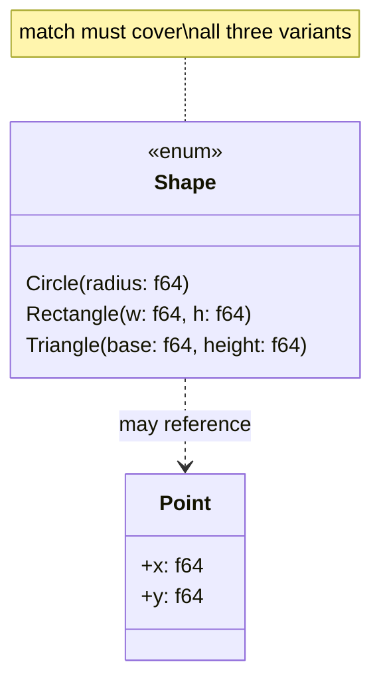

### 3.4 Architecture

A `match` expression routes a value to exactly one arm based on its variant, binding inner data along the way. Because the compiler knows the full set of variants, omitting one is a compile error — the safety property that makes enums a modeling tool rather than a convenience.

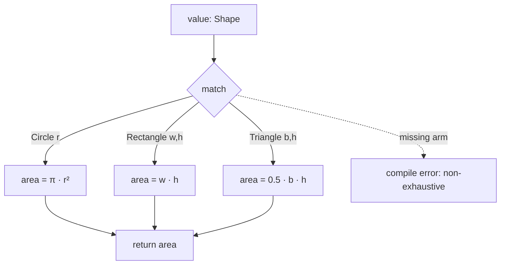

### 3.5 Real example

**Scenario.** A geometry module must compute the area of several shapes and reject impossible inputs.

**Problem.** Representing shape "type" as a string plus loose fields lets callers build nonsense (a "circle" with a width). The team wants the types to forbid invalid combinations.

**Solution.** Model the shapes as an enum where each variant carries exactly the fields it needs. Compute area with an exhaustive `match`. Validate construction so negative dimensions cannot exist.

**Implementation.**

```rust
#[derive(Debug, Clone, Copy)]
enum Shape {
    Circle { radius: f64 },
    Rectangle { width: f64, height: f64 },
    Triangle { base: f64, height: f64 },
}

#[derive(Debug)]
enum ShapeError {
    NonPositive(&'static str),
}

impl Shape {
    fn circle(radius: f64) -> Result<Shape, ShapeError> {
        if radius <= 0.0 {
            return Err(ShapeError::NonPositive("radius"));
        }
        Ok(Shape::Circle { radius })
    }

    fn area(&self) -> f64 {
        match self {
            Shape::Circle { radius } => std::f64::consts::PI * radius * radius,
            Shape::Rectangle { width, height } => width * height,
            Shape::Triangle { base, height } => 0.5 * base * height,
        }
    }
}

fn main() {
    let shapes = [
        Shape::circle(2.0),
        Ok(Shape::Rectangle { width: 3.0, height: 4.0 }),
        Shape::circle(-1.0), // rejected at construction
    ];

    for shape in shapes {
        match shape {
            Ok(s) => println!("{s:?} -> area {:.3}", s.area()),
            Err(e) => println!("invalid shape: {e:?}"),
        }
    }
}
```

If a fourth variant were added to `Shape`, the `area` match would fail to compile until the new case is handled — the compiler enforces that every shape has an area.

**Result.** Impossible shapes cannot be constructed, and adding a variant is caught everywhere it must be handled. The area logic is total and self-documenting.

**Future improvements.** Add a `perimeter` method; derive `PartialEq` for testing; introduce a `Shape::Polygon(Vec<Point>)` variant and let the compiler point you at every match that needs updating.

### 3.6 Exercises

1. Add a `Square { side: f64 }` variant and update `area`; observe the compiler guiding you.
2. Rewrite `area` using `if let` for one variant and explain why `match` is preferable here.
3. Add a tuple struct `Meters(f64)` and use it to make `radius` strongly typed.

### 3.7 Challenges

1. Model a finite state machine for an order (`Draft`, `Paid`, `Shipped { tracking: String }`, `Cancelled { reason: String }`) and write a transition function that the type system prevents from skipping states.
2. Implement a small calculator enum `Expr` (`Num`, `Add`, `Mul`) and evaluate it recursively with `match`.

### 3.8 Checklist

- [ ] You can choose between a struct and an enum for a given domain concept.
- [ ] Your enums carry exactly the data each variant needs — no shared optional fields.
- [ ] Every `match` is exhaustive or has a justified `_` arm.
- [ ] You use `if let` / `let ... else` for single-pattern cases.
- [ ] Construction validates invariants so invalid values cannot exist.

### 3.9 Best practices

- Make illegal states unrepresentable: push invariants into variants, not into runtime checks.
- Derive `Debug` on data types so they print in errors and logs.
- Prefer struct-like enum variants with named fields when a variant has more than one value.
- Favor exhaustive `match` over `_` so new variants force a deliberate decision.

### 3.10 Anti-patterns

- A "tagged" struct with a `kind: String` field plus many `Option` fields, simulating an enum unsafely.
- Catch-all `_ => {}` arms that silently ignore future variants.
- Boolean-flag soup (`is_paid`, `is_shipped`) instead of a single state enum.
- Deeply nested `match` where a guard (`match ... if`) or destructuring would read better.

### 3.11 Troubleshooting

| Symptom | Likely cause | Resolution |
|---------|--------------|------------|
| `non-exhaustive patterns` | A variant is unhandled | Add the missing arm or a justified `_` |
| `cannot move out of borrowed content` in a match | Matching by value on `&T` | Match on `&self`/bind with `ref`, or use the field by reference |
| `unreachable pattern` warning | A `_` or broad arm precedes specific ones | Reorder arms specific-to-general |
| Field is private when destructuring | Struct fields default to private | Add `pub` fields or a constructor/accessor |
| `match` arm types differ | Arms return different types | Make all arms produce the same type |

### 3.12 Official references

- Defining structs — https://doc.rust-lang.org/book/ch05-00-structs.html
- Enums and pattern matching — https://doc.rust-lang.org/book/ch06-00-enums.html
- The `match` control flow operator — https://doc.rust-lang.org/book/ch06-02-match.html
- Patterns and matching (reference) — https://doc.rust-lang.org/reference/patterns.html

---

> **End of Part I.** You can now drive Cargo, reason precisely about ownership and borrowing, and model domains with structs, enums, and exhaustive pattern matching — the foundation every later Part builds on. Parts II–VIII (lifetimes, traits and generics, collections and iterators, error handling, modules and smart pointers, concurrency and async, and the mastery topics of macros, testing, unsafe/FFI, performance, and release) continue the same chapter structure and will be appended in subsequent deliveries.

---

## Part II — The borrow model in depth

Part I introduced ownership. Part II goes deep on **borrowing** — the rules that let you access data without owning it, checked at compile time: **references and aliasing** (shared vs. mutable), **lifetimes** (how long a reference is valid), and **slices/strings** with the **`Sized`** boundary.

---

## Chapter 4 — References, mutability, and aliasing rules

### 4.1 Introduction

A **reference** borrows access to a value without taking ownership: `&T` is a **shared** (immutable) reference, `&mut T` is a **mutable** (exclusive) one. The borrow checker enforces one rule that defines safe Rust: at any time you may have **either** any number of shared references **or** exactly one mutable reference — **never both**. This "aliasing XOR mutability" rule is what eliminates data races and use-after-free *at compile time*, with no garbage collector. Borrowing lets functions read or modify data in place while ownership stays with the original.

### 4.2 Business context

Memory-safety bugs — data races, dangling pointers, iterator invalidation — are among the most expensive and dangerous in systems software (the majority of critical CVEs in C/C++ codebases). Rust's aliasing rule makes those bugs **unrepresentable**: code that would alias-and-mutate simply doesn't compile. For a business, that means a whole category of security vulnerabilities and heisenbugs never reaches production, achieved without the runtime cost of a garbage collector — which is why Rust is adopted for infrastructure, embedded, and performance-critical services where both safety and speed matter.

### 4.3 Theoretical concepts: aliasing XOR mutability

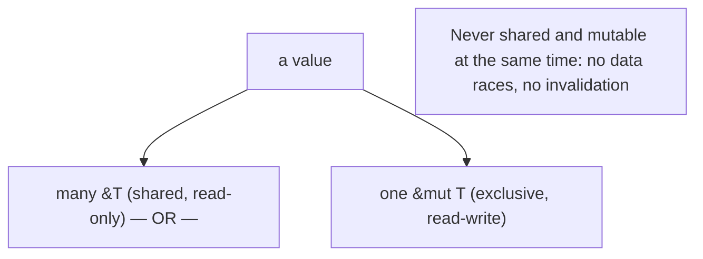

`&T` permits reading and may be copied freely; `&mut T` permits mutation and is **exclusive** — while it exists, no other reference (shared or mutable) to that value may be used. The borrow checker enforces this over the references' **scope** (non-lexical lifetimes: a borrow ends at its last use). This statically prevents two threads from writing simultaneously, and prevents mutating a collection while iterating it. You **dereference** with `*` to read/write through a reference.

### 4.4 Architecture: borrow instead of move or copy

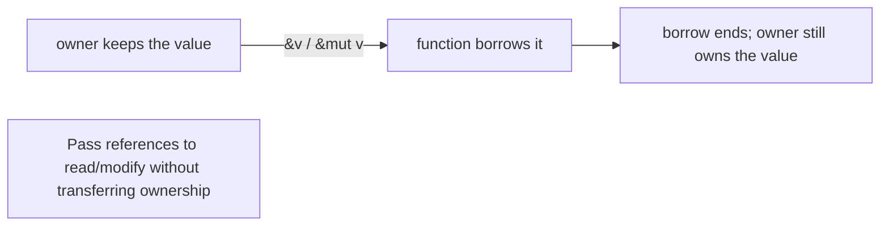

Functions usually **borrow** their arguments (`&T`/`&mut T`) so the caller retains ownership, avoiding needless moves or clones.

### 4.5 Real example

**Scenario.** A function appends to a vector the caller still needs afterward.

**Problem.** Taking the vector by value would move it (caller loses it); cloning wastes memory.

**Solution.** Borrow it **mutably** (`&mut Vec<T>`); ownership stays with the caller.

**Implementation.**

```rust
fn push_two(v: &mut Vec<i32>) {   // exclusive borrow: may mutate, caller keeps ownership
    v.push(1);
    v.push(2);
}

fn main() {
    let mut nums = vec![10];
    push_two(&mut nums);          // lend it mutably
    println!("{:?}", nums);       // [10, 1, 2] — still owned and usable here

    let a = &nums;                // shared borrow
    let b = &nums;                // another shared borrow — fine (no mutation)
    println!("{} {}", a.len(), b.len());
    // let m = &mut nums;         // ERROR if a/b still used: can't alias + mutate
}
```

**Result.** `push_two` modifies the vector in place via an exclusive `&mut` borrow, and `main` keeps ownership and uses `nums` afterward — no move, no clone. Multiple shared borrows (`a`, `b`) coexist because none mutates; introducing a `&mut` while they're live would be a compile error. The aliasing rule is enforced by the compiler, so the code is memory-safe by construction.

**Future improvements.** Prefer `&[T]`/`&str` parameters (Ch. 6) for read-only access so the function accepts more types; let non-lexical lifetimes end borrows early by structuring code so the `&mut` doesn't overlap shared reads.

### 4.6 Exercises

1. State the aliasing rule in one sentence.
2. Why can you have many `&T` but only one `&mut T`?
3. What real bug classes does this rule eliminate at compile time?

### 4.7 Challenges

- **Challenge.** Write a function that takes `&mut Vec<String>` and removes empty strings in place; show the caller still owns and uses the vector afterward. Then try to take a `&mut` while a `&` is live and read the compiler error.

### 4.8 Checklist

- [ ] I borrow (`&T`/`&mut T`) instead of moving when the caller keeps the value.
- [ ] I never hold a shared and a mutable reference to the same value at once.
- [ ] I use `&mut` only where mutation is needed (exclusive).
- [ ] I let borrows end at their last use (non-lexical lifetimes).

### 4.9 Best practices

- Default to shared `&T`; reach for `&mut T` only to mutate.
- Pass references rather than cloning to read/modify data.
- Keep mutable borrows short and non-overlapping with shared reads.

### 4.10 Anti-patterns

- Cloning to dodge the borrow checker instead of borrowing correctly.
- Long-lived `&mut` borrows that block other access unnecessarily.
- Fighting the checker with workarounds instead of restructuring ownership.

### 4.11 Troubleshooting

| Symptom | Likely cause | Action |
|---------|--------------|--------|
| "cannot borrow as mutable because also borrowed as immutable" | Shared + mutable overlap | End the shared borrow before the `&mut` |
| "use of moved value" | Took by value instead of borrowing | Pass `&T`/`&mut T` |
| "cannot borrow as mutable more than once" | Two `&mut` overlap | Restructure so only one is live |

### 4.12 References

- *The Rust Programming Language* (Klabnik & Nichols), ch. 4 "Understanding Ownership" — https://doc.rust-lang.org/book/ch04-00-understanding-ownership.html.
- J. Blandy, J. Orendorff, L. Tindall, *Programming Rust*, 2nd ed. (O'Reilly, 2021) — ISBN 978-1492052593.

---

## Chapter 5 — Lifetimes and the lifetime elision rules

### 5.1 Introduction

A **lifetime** is the compile-time scope for which a reference is valid. The borrow checker uses lifetimes to guarantee a reference never outlives the data it points to (no dangling references). Usually lifetimes are **inferred** and invisible, but when a function returns a reference derived from its inputs, you sometimes annotate them: `fn longest<'a>(x: &'a str, y: &'a str) -> &'a str`. The **lifetime elision rules** are the compiler's heuristics that let you omit these annotations in the common cases — which is why most Rust code has no explicit lifetimes.

### 5.2 Business context

Dangling pointers — references to freed memory — are a top source of crashes and exploitable vulnerabilities in systems code. Lifetimes let Rust prove, at compile time, that this can't happen, again without a garbage collector. Most of the time the **elision rules** make this free (no annotations), so developers get the safety without the ceremony; understanding when annotations *are* needed (and why) is the difference between fighting the compiler and working with it. The payoff is reference-heavy, zero-copy code (slices, string views) that is provably safe.

### 5.3 Theoretical concepts: references can't outlive their data

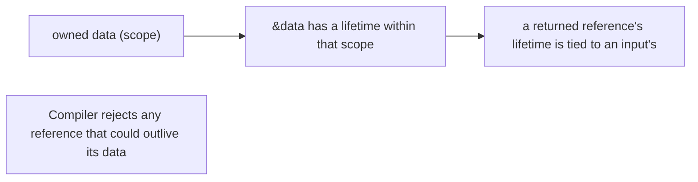

A lifetime parameter (`'a`) **relates** the lifetimes of references — e.g., "the returned reference lives as long as both inputs". It doesn't change how long anything lives; it lets the compiler check the relationship. The **elision rules**: (1) each input reference gets its own lifetime; (2) if there's exactly one input lifetime, it's assigned to all outputs; (3) for methods, the lifetime of `&self` is assigned to outputs. When these resolve the outputs unambiguously, no annotation is needed — covering most functions.

### 5.4 Architecture: tie outputs to inputs

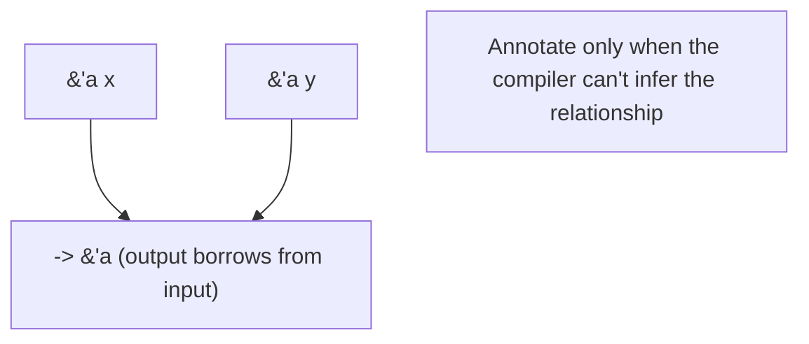

Explicit lifetimes appear where a returned reference could come from more than one input, telling the compiler (and reader) which data it borrows from.

### 5.5 Real example

**Scenario.** A function returns the longer of two string slices.

**Problem.** The compiler can't tell whether the returned reference borrows from `x` or `y`, so it can't prove it won't dangle.

**Solution.** Annotate a shared lifetime `'a` tying the output to both inputs.

**Implementation.**

```rust
fn longest<'a>(x: &'a str, y: &'a str) -> &'a str {   // output lives as long as both inputs
    if x.len() >= y.len() { x } else { y }
}

fn main() {
    let a = String::from("hello");
    let result;
    {
        let b = String::from("hi");
        result = longest(&a, &b);     // result borrows from a or b
        println!("{result}");         // OK: used while both a and b are alive
    }
    // println!("{result}");          // ERROR: b dropped; result might dangle
}
```

**Result.** The `'a` annotation tells the compiler the returned reference is valid only as long as **both** inputs are — so using `result` after `b` is dropped is a compile error, exactly the dangling-reference bug Rust prevents. Within the inner scope, where both strings live, it's safe. The annotation made the safety relationship explicit; without it, the function wouldn't compile.

**Future improvements.** Most functions need no annotations thanks to elision — reserve them for the genuinely ambiguous cases; if lifetimes get complex, consider returning an owned `String` instead of a borrowed `&str`.

### 5.6 Exercises

1. What does a lifetime guarantee about a reference?
2. Why does `longest` need an explicit lifetime when most functions don't?
3. State the three lifetime elision rules.

### 5.7 Challenges

- **Challenge.** Write a `first_word<'a>(s: &'a str) -> &'a str` returning the first word; confirm it compiles *without* an explicit annotation (elision rule 2) and explain why.

### 5.8 Checklist

- [ ] I understand a reference may not outlive its data.
- [ ] I add lifetime annotations only when the compiler can't infer them.
- [ ] I tie a returned reference to the correct input lifetime.
- [ ] I consider returning owned data when lifetimes get unwieldy.

### 5.9 Best practices

- Rely on elision; annotate only ambiguous returned references.
- Keep borrowed return values tied to clear input lifetimes.
- Prefer owned returns over fighting complex lifetime puzzles.

### 5.10 Anti-patterns

- Sprinkling lifetime annotations where elision already works.
- Returning references to local (soon-dropped) data.
- Over-complex lifetime gymnastics where an owned value is simpler.

### 5.11 Troubleshooting

| Symptom | Likely cause | Action |
|---------|--------------|--------|
| "missing lifetime specifier" | Ambiguous returned reference | Add `<'a>` tying output to inputs |
| "borrowed value does not live long enough" | Reference outlives its data | Restrict use to the data's scope or return owned |
| Lifetime errors everywhere | Returning borrows of locals | Return owned `String`/`Vec` instead |

### 5.12 References

- *The Rust Programming Language*, ch. 10.3 "Validating References with Lifetimes" — https://doc.rust-lang.org/book/ch10-03-lifetime-syntax.html.
- J. Blandy et al., *Programming Rust*, 2nd ed. (O'Reilly, 2021) — ISBN 978-1492052593.

---

## Chapter 6 — Slices, strings, and the `Sized` boundary

### 6.1 Introduction

A **slice** is a borrowed **view** into a contiguous sequence — `&[T]` into a `Vec<T>`/array, `&str` into a `String` — giving access to a range **without copying**. Strings come in two forms: the **owned, growable `String`** and the **borrowed view `&str`** (string slice). Slices and `str` are **dynamically sized types (DSTs)**: they don't implement **`Sized`** (their size isn't known at compile time), so they're always handled **behind a pointer** (`&str`, `&[T]`, `Box<str>`). Accepting `&str`/`&[T]` parameters makes functions maximally flexible.

### 6.2 Business context

Slices are how Rust does zero-copy data processing — parsing, networking, text handling — without the allocations that hurt throughput. Designing functions to take `&str`/`&[T]` rather than `&String`/`&Vec<T>` lets one function serve owned data, literals, and sub-ranges alike, reducing API friction and copies. Understanding the `String`/`&str` distinction (and why) prevents the most common beginner confusion and the needless `.clone()`s that bloat memory use. This directly affects the performance and ergonomics that draw teams to Rust.

### 6.3 Theoretical concepts: views, not copies

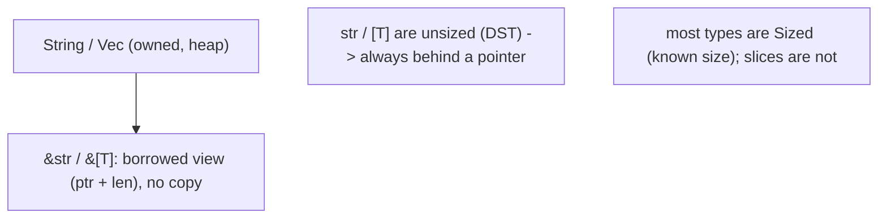

A slice is a **fat pointer**: a pointer plus a length. `&str` views UTF-8 bytes of a `String` or literal; `&[T]` views part of a `Vec`/array. Because `str` and `[T]` are **unsized**, you never hold them by value — only via `&str`, `&[T]`, `Box<[T]>`, etc. The **`Sized`** trait marks types whose size is known at compile time (the default); generic parameters are implicitly `Sized` unless relaxed with `?Sized`. Slicing (`&s[0..3]`) borrows a range and must fall on valid boundaries (for `str`, char boundaries).

### 6.4 Architecture: accept slices, return owned or borrowed deliberately

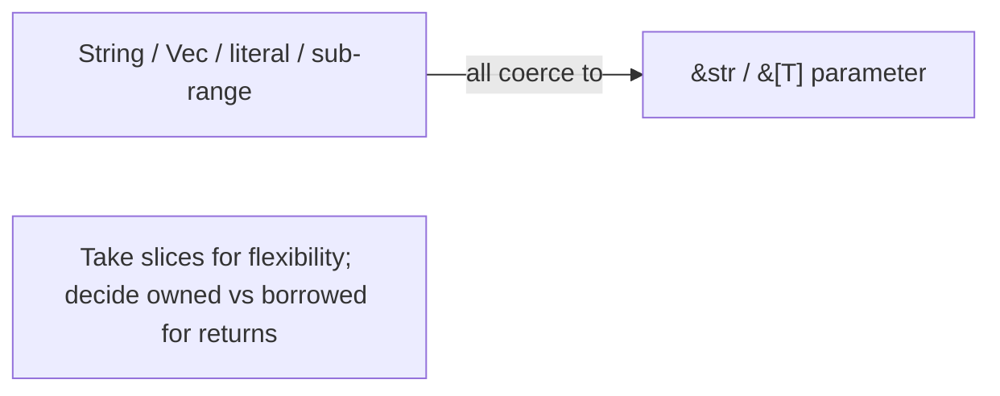

A function taking `&str`/`&[T]` accepts the widest set of inputs with no copies — the idiomatic parameter choice for read-only access.

### 6.5 Real example

**Scenario.** Count words in text that may come from a `String`, a literal, or a sub-range.

**Problem.** Taking `&String` forces callers to have an owned `String` and excludes literals/sub-slices.

**Solution.** Take a **`&str`** slice — every string form coerces to it, with no copy.

**Implementation.**

```rust
fn word_count(text: &str) -> usize {        // accepts String, &str literal, and sub-slices
    text.split_whitespace().count()
}

fn main() {
    let owned = String::from("the quick brown fox");
    println!("{}", word_count(&owned));     // String -> &str (deref coercion)
    println!("{}", word_count("a b c"));    // literal is already &str
    println!("{}", word_count(&owned[4..])); // a sub-slice view, no copy: "quick brown fox"
}
```

**Result.** `word_count` works for an owned `String`, a string literal, and a borrowed sub-range alike — all coerce to `&str` with zero copying. Taking the slice instead of `&String` made the function flexible and allocation-free. The `&owned[4..]` sub-slice is a view into the existing buffer, not a new allocation.

**Future improvements.** Return owned `String` only when the caller needs ownership; use `?Sized` bounds when writing generic code that should accept slices; slice on char boundaries to avoid panics with non-ASCII text.

### 6.6 Exercises

1. What is a slice, and why is it called a "fat pointer"?
2. Why are `str` and `[T]` always used behind a pointer?
3. Why prefer a `&str` parameter over `&String`?

### 6.7 Challenges

- **Challenge.** Write `fn longest_word(text: &str) -> &str` returning the longest word as a sub-slice (no allocation), and call it with a `String`, a literal, and a sub-range.

### 6.8 Checklist

- [ ] I take `&str`/`&[T]` parameters for flexible, zero-copy read access.
- [ ] I understand `String` (owned) vs `&str` (borrowed view).
- [ ] I handle unsized types behind pointers (`&str`, `Box<[T]>`).
- [ ] I slice on valid (char) boundaries.

### 6.9 Best practices

- Accept slices (`&str`/`&[T]`) rather than owned references in parameters.
- Return owned data only when ownership is genuinely needed.
- Use `?Sized` to write generics that also accept slices.

### 6.10 Anti-patterns

- `&String`/`&Vec<T>` parameters that needlessly restrict callers.
- `.clone()`/`.to_string()` to avoid slices where a borrow works.
- Slicing a `str` at a non-char boundary (panics).

### 6.11 Troubleshooting

| Symptom | Likely cause | Action |
|---------|--------------|--------|
| Function won't accept a literal | Parameter is `&String` | Change it to `&str` |
| "doesn't have a size known at compile-time" | Holding `str`/`[T]` by value | Use it behind a pointer (`&str`, `Box<[T]>`) |
| Panic slicing a string | Cut on a non-char boundary | Slice on char boundaries (e.g., via `char_indices`) |

### 6.12 References

- *The Rust Programming Language*, ch. 4.3 "The Slice Type" & ch. 19.4 (`Sized`/DSTs) — https://doc.rust-lang.org/book/ch04-03-slices.html.
- J. Blandy et al., *Programming Rust*, 2nd ed. (O'Reilly, 2021) — ISBN 978-1492052593.

---

> **End of Part II.** Rust's borrow model: **references** with the **aliasing-XOR-mutability** rule (many `&T` or one `&mut T`) eliminate data races and invalidation at compile time; **lifetimes** (mostly elided) prove references never dangle; and **slices**/`&str` give zero-copy views, with unsized `str`/`[T]` always behind a pointer (`Sized`). Part III covers Rust's **type system** — scalars, compounds, sum types (`enum`, `Option`, `Result`), and exhaustive pattern matching.

---

## Part III — The type system

Part III covers how Rust models data: **scalar and compound** built-in types and **user-defined** structs, **enums as sum types** (with `Option` and `Result` as the canonical examples), and **exhaustive pattern matching** that makes handling every case mandatory.

---

## Chapter 7 — Scalar, compound, and user-defined types

### 7.1 Introduction

Rust is **statically and strongly typed** with full inference. **Scalar** types are single values: integers (`i32`, `u64`, …), floats (`f64`), `bool`, and `char` (a Unicode scalar). **Compound** types group values: **tuples** (`(i32, &str)`, fixed heterogeneous) and **arrays** (`[T; N]`, fixed homogeneous). **User-defined** types are **structs** — named-field (`struct Point { x: f64, y: f64 }`), tuple structs, and unit structs — on which you implement methods via `impl`. Types are explicit at boundaries but inferred locally, giving safety without verbosity.

### 7.2 Business context

A precise type system is documentation the compiler enforces: a function that takes a `Celsius` newtype can't be passed a raw `f64` meant for something else, eliminating unit-confusion bugs (the kind that crashed spacecraft). Choosing the right integer width and signedness prevents overflow surprises. Modeling domain concepts as structs (rather than loose tuples or primitives) makes code self-explanatory and refactor-safe. Strong typing front-loads error detection to compile time, where fixing a mistake is cheapest — a major reason Rust code is reliable.

### 7.3 Theoretical concepts

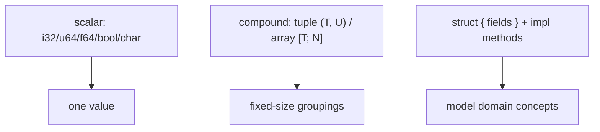

Integers have explicit width/signedness; overflow panics in debug and wraps in release (use `checked_/wrapping_/saturating_` for intent). **Tuples** group a fixed number of possibly-different types and destructure (`let (a, b) = pair`); **arrays** are fixed-length same-type (`[0; 5]`), distinct from the growable `Vec<T>`. **Structs** name their fields and gain behavior through `impl` blocks (associated functions like `new`, and methods taking `&self`). The **newtype** pattern (`struct Meters(f64)`) gives a primitive a distinct type for safety.

### 7.4 Architecture: model with structs

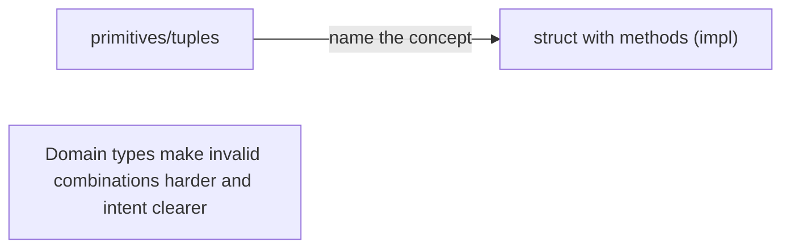

Promoting loose primitives/tuples into named structs with methods turns implicit conventions into compiler-checked types.

### 7.5 Real example

**Scenario.** Represent a 2-D point with a distance method.

**Problem.** Passing bare `(f64, f64)` tuples loses meaning and invites mixing up coordinates.

**Solution.** A **struct** with an `impl` block; a **newtype** keeps units distinct.

**Implementation.**

```rust
struct Point { x: f64, y: f64 }

impl Point {
    fn new(x: f64, y: f64) -> Self { Point { x, y } }   // associated function
    fn distance(&self, other: &Point) -> f64 {           // method borrows self
        ((self.x - other.x).powi(2) + (self.y - other.y).powi(2)).sqrt()
    }
}

fn main() {
    let a = Point::new(0.0, 0.0);
    let b = Point::new(3.0, 4.0);
    println!("{}", a.distance(&b));   // 5.0
}
```

**Result.** `Point` names its fields and carries its own behavior; `distance` borrows both points (no copies) and the type makes "a point" explicit instead of an anonymous tuple. The compiler now prevents passing a `Point` where some other 2-tuple is expected. Methods and the `new` constructor keep usage clean.

**Future improvements.** Add `#[derive(Clone, Copy, Debug, PartialEq)]` for ergonomics; use newtypes (`struct Meters(f64)`) where unit safety matters.

### 7.6 Exercises

1. What is the difference between a tuple and an array?
2. What does an `impl` block add to a struct?
3. What problem does the newtype pattern solve?

### 7.7 Challenges

- **Challenge.** Define a `Rectangle` struct with `width`/`height`, methods `area()` and `can_hold(&Rectangle) -> bool`, and an associated `square(size)` constructor.

### 7.8 Checklist

- [ ] I choose integer width/signedness deliberately.
- [ ] I model domain concepts as structs, not loose tuples/primitives.
- [ ] I add behavior via `impl` methods/associated functions.
- [ ] I use newtypes where type distinction prevents bugs.

### 7.9 Best practices

- Name concepts with structs; give them methods.
- Derive common traits (`Debug`, `Clone`, `PartialEq`) where useful.
- Use newtypes for units/IDs to avoid mix-ups.

### 7.10 Anti-patterns

- Passing anonymous tuples where a named struct would clarify.
- Ignoring integer overflow semantics.
- Primitive obsession — raw `f64`/`String` for distinct domain values.

### 7.11 Troubleshooting

| Symptom | Likely cause | Action |
|---------|--------------|--------|
| Mixed-up arguments of the same primitive type | Primitive obsession | Introduce newtypes/structs |
| Overflow panic in debug | Unchecked arithmetic | Use `checked_`/`wrapping_`/`saturating_` |
| Verbose tuple access (`.0`, `.1`) | Anonymous tuple | Use a named-field struct |

### 7.12 References

- *The Rust Programming Language*, ch. 3 (data types) & ch. 5 (structs) — https://doc.rust-lang.org/book/ch05-00-structs.html.
- J. Blandy et al., *Programming Rust*, 2nd ed. (O'Reilly, 2021) — ISBN 978-1492052593.

---

## Chapter 8 — Enums as sum types; `Option` and `Result` as data

### 8.1 Introduction

A Rust **enum** is a **sum type**: a value that is **exactly one** of several variants, and each variant can **carry data** (`enum Shape { Circle(f64), Rect { w: f64, h: f64 } }`). This is far more powerful than C-style enums. Two enums are so important they're built in: **`Option<T>`** (`Some(T)` or `None`) replaces null, and **`Result<T, E>`** (`Ok(T)` or `Err(E)`) models recoverable errors as **values**. Because the type forces you to handle every variant, "forgot to check for null/error" bugs are impossible.

### 8.2 Business context

The null reference ("billion-dollar mistake") and unchecked error codes cause a huge share of crashes and security holes. Rust replaces both with enums the type system forces you to handle: a `Option<User>` cannot be used as a `User` until you deal with the `None` case, and a `Result` must be inspected before you get the value. This moves "did you handle the missing/failed case?" from a runtime hope to a compile-time guarantee — eliminating null-pointer and ignored-error defects entirely, which is decisive for reliability-critical software.

### 8.3 Theoretical concepts

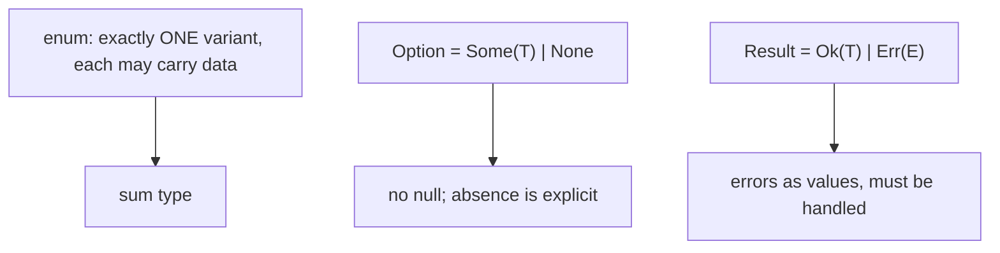

An enum variant can hold values, structs, or nothing; the whole value is tagged with which variant it is. **`Option<T>`** makes absence a distinct value you must unwrap (via `match`, `if let`, `?`, or combinators like `map`/`unwrap_or`). **`Result<T, E>`** makes failure a value carrying an error; the **`?`** operator propagates an `Err` early, making error handling concise yet explicit. There are no exceptions for recoverable errors — they flow as `Result`.

### 8.4 Architecture: make states and failures data

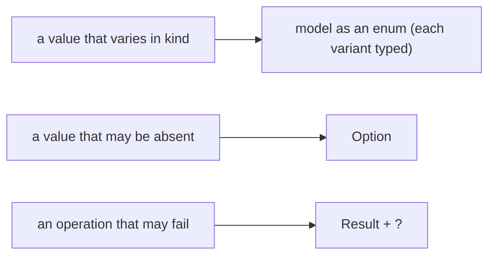

Encoding "one of several kinds", "maybe absent", and "might fail" as enums makes the compiler enforce that every possibility is addressed.

### 8.5 Real example

**Scenario.** Parse a config value that may be missing or invalid.

**Problem.** In many languages a missing key returns null and a parse error throws — both easy to forget.

**Solution.** Return **`Result<T, E>`**, use **`Option`** for the lookup, and propagate with **`?`**.

**Implementation.**

```rust
use std::collections::HashMap;

fn read_port(cfg: &HashMap<String, String>) -> Result<u16, String> {
    let raw = cfg.get("port")                       // Option<&String>
        .ok_or_else(|| "missing 'port'".to_string())?;   // None -> Err, propagate
    let port = raw.parse::<u16>()                   // Result<u16, ParseIntError>
        .map_err(|e| format!("bad port: {e}"))?;    // convert + propagate the error
    Ok(port)
}
```

**Result.** Absence (`get` → `Option`) and parse failure (`parse` → `Result`) are both **values** the compiler forces the code to handle; `?` propagates either as an `Err` without verbose branching. A caller of `read_port` must inspect the `Result` before using the port — there's no way to accidentally use a missing or invalid value. Null and ignored-error bugs are structurally impossible.

**Future improvements.** Use a typed error enum (Ch. 18) instead of `String`; provide defaults with `unwrap_or`/`unwrap_or_else` where a missing value is acceptable.

### 8.6 Exercises

1. What makes an enum a "sum type", and how is it more than a C enum?
2. How does `Option<T>` eliminate null-pointer bugs?
3. What does the `?` operator do with a `Result`?

### 8.7 Challenges

- **Challenge.** Model a `Command` enum with variants carrying data (`Move { x, y }`, `Write(String)`, `Quit`), and write a function returning `Result<Command, String>` that parses a line, propagating errors with `?`.

### 8.8 Checklist

- [ ] I model "one of several kinds" as a data-carrying enum.
- [ ] I use `Option<T>` for possibly-absent values (no null).
- [ ] I use `Result<T, E>` for fallible operations.
- [ ] I propagate errors with `?` rather than ignoring them.

### 8.9 Best practices

- Encode states/absence/failure as enums (`Option`/`Result`).
- Propagate with `?`; convert errors with `map_err`.
- Reserve `unwrap`/`expect` for cases that genuinely can't fail (and document why).

### 8.10 Anti-patterns

- `unwrap()`/`expect()` everywhere, turning recoverable errors into panics.
- Sentinel values (`-1`, empty string) instead of `Option`/`Result`.
- Stringly-typed errors where a typed enum belongs.

### 8.11 Troubleshooting

| Symptom | Likely cause | Action |
|---------|--------------|--------|
| Panic on `None`/`Err` | Careless `unwrap()` | Handle with `match`/`?`/`unwrap_or` |
| "cannot use Option<T> as T" | Used without unwrapping | Match/`if let`/`?` to extract |
| `?` won't compile | Error types don't convert | Implement `From`/use `map_err` |

### 8.12 References

- *The Rust Programming Language*, ch. 6 (enums & `Option`) & ch. 9 (`Result`) — https://doc.rust-lang.org/book/ch06-00-enums.html.
- J. Blandy et al., *Programming Rust*, 2nd ed. (O'Reilly, 2021) — ISBN 978-1492052593.

---

## Chapter 9 — Exhaustive pattern matching and guards

### 9.1 Introduction

**`match`** is Rust's primary control-flow tool over enums and values: it compares a value against **patterns** and runs the first arm that fits, **binding** the data inside. Its defining property is **exhaustiveness** — the compiler requires every possible case to be handled (or a `_` wildcard), so you can't forget a variant. Patterns can **destructure** structs/tuples/enums, include **guards** (`if` conditions on an arm), and match ranges and literals. **`if let`**/**`while let`** are concise forms for matching a single pattern.

### 9.2 Business context

Exhaustive matching is a powerful safety net for evolving software: add a new variant to an enum (a new order status, a new event), and the compiler flags **every** `match` that doesn't handle it — turning "we forgot to update one place" from a production incident into a build error. Combined with `Option`/`Result`, it guarantees missing and error cases are addressed. Guards and destructuring let complex business rules be expressed as a readable table of cases. This is a large part of why large Rust codebases refactor safely.

### 9.3 Theoretical concepts

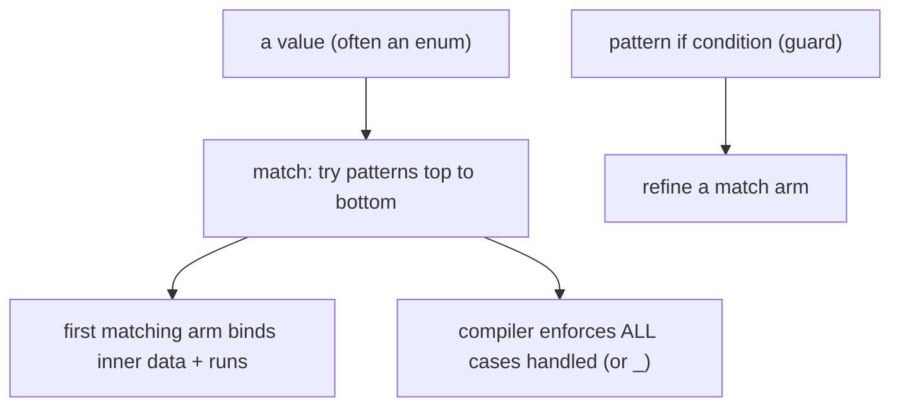

A `match` arm is `pattern => expression`; patterns **destructure** and bind (`Some(x)`, `Shape::Rect { w, h }`, `(a, b)`). **Exhaustiveness** means uncovered cases are a compile error — add `_` only when you truly want a catch-all. **Guards** (`Some(n) if n > 0 =>`) add a boolean condition. `match` is an **expression** (returns a value). **`if let`** handles one pattern concisely when you don't need exhaustiveness for the rest.

### 9.4 Architecture: handle every case, by construction

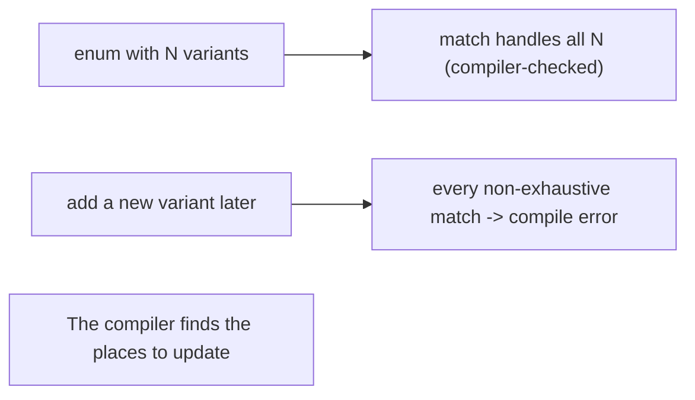

Exhaustive matching makes adding a variant a guided, compiler-driven refactor instead of a hunt for missed cases.

### 9.5 Real example

**Scenario.** Compute the area of different shapes.

**Problem.** A `switch` that silently ignores an unhandled shape (or a forgotten new one) returns wrong results.

**Solution.** A **`match`** over the enum — exhaustive, with **destructuring** and a **guard**.

**Implementation.**

```rust
enum Shape { Circle(f64), Rect { w: f64, h: f64 }, Triangle { base: f64, height: f64 } }

fn area(s: &Shape) -> f64 {
    match s {
        Shape::Circle(r) => std::f64::consts::PI * r * r,         // bind r
        Shape::Rect { w, h } if w == h => w * w,                   // guard: square case
        Shape::Rect { w, h } => w * h,                             // destructure fields
        Shape::Triangle { base, height } => 0.5 * base * height,
        // no `_` needed: every variant is handled — exhaustive
    }
}
```

**Result.** Every `Shape` variant is handled, destructured to its data, with a guard distinguishing the square case — and the compiler **guarantees** completeness, so no shape is silently mishandled. If a `Pentagon` variant were added later, this `match` would fail to compile until updated, pointing exactly here. The logic reads as a clear table of cases.

**Future improvements.** Use `if let Some(x) = opt` for single-case matches; avoid `_` catch-alls on domain enums so the compiler keeps guiding future changes.

### 9.6 Exercises

1. What does "exhaustive" mean for a `match`, and why is it valuable?
2. How does a guard refine a match arm?
3. When is `if let` preferable to a full `match`?

### 9.7 Challenges

- **Challenge.** Write a `match` over a `Result<i32, String>` that returns a message for `Ok` (with a guard for zero vs. positive vs. negative) and for `Err`, with no `_` arm.

### 9.8 Checklist

- [ ] I use `match` to handle every variant (exhaustive).
- [ ] I destructure to bind inner data directly.
- [ ] I use guards for conditional arms.
- [ ] I avoid `_` on domain enums so new variants surface as errors.

### 9.9 Best practices

- Prefer exhaustive `match` without catch-alls on domain types.
- Use `if let`/`while let` for single-pattern cases.
- Express conditional rules with guards and destructuring.

### 9.10 Anti-patterns

- Overusing `_` catch-alls, hiding unhandled new variants.
- Nested `if`/`else` where a `match` is clearer.
- Unwrapping instead of matching on `Option`/`Result`.

### 9.11 Troubleshooting

| Symptom | Likely cause | Action |
|---------|--------------|--------|
| "non-exhaustive patterns" | A case isn't handled | Add the missing arm (or `_` deliberately) |
| New variant silently ignored elsewhere | `_` catch-all used | Remove `_`; let the compiler flag matches |
| Verbose conditional logic | `if`/`else` chains | Use `match` with guards/destructuring |

### 9.12 References

- *The Rust Programming Language*, ch. 6.2 (`match`) & ch. 18 (patterns) — https://doc.rust-lang.org/book/ch06-02-match.html.
- J. Blandy et al., *Programming Rust*, 2nd ed. (O'Reilly, 2021) — ISBN 978-1492052593.

---

> **End of Part III.** Rust models data precisely: **scalar/compound** types and **structs** with methods; **enums as sum types** with `Option` (no null) and `Result` (errors as values, propagated with `?`); and **exhaustive `match`** with destructuring and guards that forces every case to be handled. Part IV covers **traits and generics** — Rust's tools for polymorphism and reuse.

<!--APPEND-PART-IV-->
