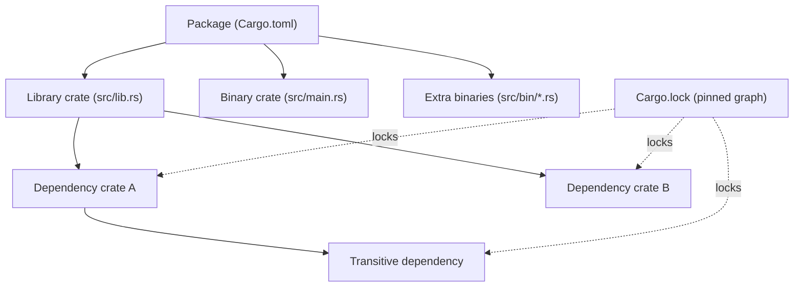
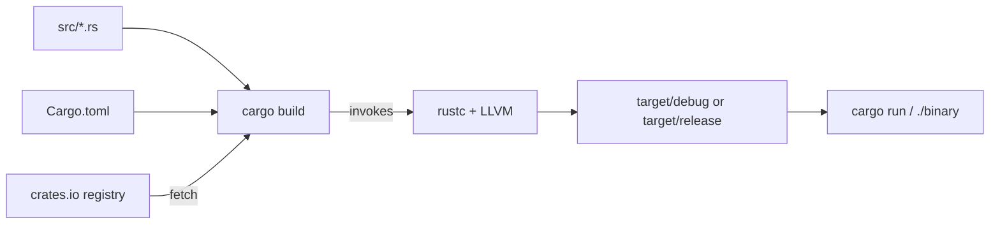
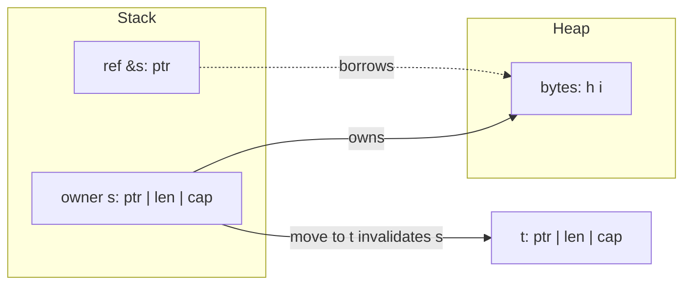
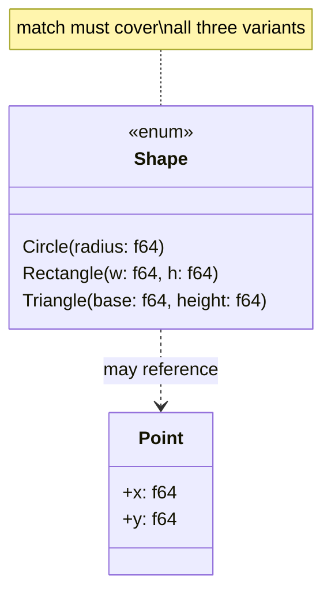
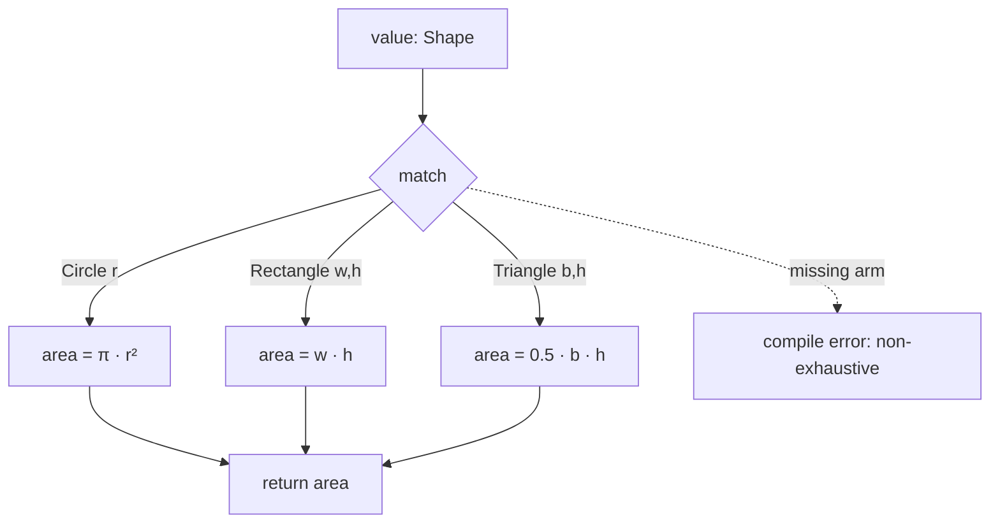

# Rust 2024 - Complete Professional Guide

> **Category:** 01_programming_languages · **Language:** English

---

## Rust — Complete Professional Guide
### Ownership, Borrowing, Traits, Generics, Error Handling, Async, Cargo
**Edition for Rust (2024 edition)**

> **Reference book (English).** Based on the official Rust documentation (doc.rust-lang.org, the Rust Reference, the Cargo Book, and the standard library API docs). All prose, examples, and diagrams are original and written for this corpus. No copyrighted book text is reproduced.
>
> **Scope notice:** This guide targets the Rust 2024 edition and a stable toolchain (rustc 1.85+). It covers the language, the standard library, and the surrounding tooling that professional teams rely on. Each chapter follows the TO-BRAIN editorial standard.

---

## How to read this book

This book is organized by **maturity level**. Each level maps to a Part of the table of contents, so you can enter at the rung that matches your current experience and climb from there.

| Level | Profile | Focus | Maps to |
|-------|---------|-------|---------|
| 1 — Foundations | New to Rust | Toolchain, Cargo, syntax, ownership intuition | Part I |
| 2 — Core model | Can compile small programs | Borrowing, lifetimes, the type system, pattern matching | Parts II–III |
| 3 — Abstraction | Comfortable with the borrow checker | Traits, generics, collections, iterators, error handling | Parts IV–VI |
| 4 — Systems | Builds libraries and services | Modules, smart pointers, concurrency, async/await | Parts VI–VII |
| 5 — Mastery | Ships production crates | Macros, testing, unsafe/FFI, performance, releasing | Part VIII |

**Target audience:** developers coming from C, C++, Go, Java, C#, Python, or JavaScript who want a precise, professional working knowledge of Rust — not a tour, but a reference you can hold to while shipping.

**Structure of each chapter:** Introduction · Business context · Theoretical concepts · Architecture · Diagrams (Mermaid) · Real examples · Step by step · Complete code · Exercises · Challenges · Checklist · Best practices · Anti-patterns · Troubleshooting · Official references.

**Example format:** Scenario · Problem · Solution · Implementation · Result · Future improvements.

---

## Table of Contents

**Part I — Foundations, the toolchain, and Cargo**
1. Getting started: rustc, rustup, Cargo, and your first crate
2. Ownership and borrowing: the memory model that defines Rust
3. Types, structs, enums, and pattern matching

**Part II — The borrow model in depth**
4. References, mutability, and aliasing rules
5. Lifetimes and the lifetime elision rules
6. Slices, strings, and the `Sized` boundary

**Part III — The type system**
7. Scalar, compound, and user-defined types
8. Enums as sum types; `Option` and `Result` as data
9. Exhaustive pattern matching and guards

**Part IV — Traits and generics**
10. Defining and implementing traits; default methods
11. Generic functions, structs, and bounds
12. Trait objects, dynamic dispatch, and `dyn`
13. Associated types, supertraits, and coherence

**Part V — Collections and iterators**
14. `Vec`, `HashMap`, `BTreeMap`, `VecDeque`, `HashSet`
15. The `Iterator` trait and adapter chains
16. Closures: `Fn`, `FnMut`, `FnOnce`, and capture

**Part VI — Error handling, modules, and crates**
17. `Result`, `Option`, and the `?` operator
18. Custom error types with `thiserror`; application errors with `anyhow`
19. Modules, paths, visibility, and the crate graph
20. Smart pointers: `Box`, `Rc`, `Arc`, `RefCell`, `Cell`, `Weak`

**Part VII — Concurrency and async**
21. Threads, `Send`, `Sync`, and shared state with `Mutex`/`RwLock`
22. Message passing with channels
23. Futures, `async`/`await`, and the `tokio` runtime

**Part VIII — Macros, testing, unsafe, performance, and release**
24. Declarative and procedural macros
25. Unit tests, integration tests, doctests, and benchmarks
26. `unsafe`, raw pointers, and FFI
27. Performance: zero-cost abstractions, profiling, and allocation
28. Building and releasing: profiles, features, semver, and publishing

---

> **Status of this edition:** phased delivery. The book is published incrementally so that each Part is complete and accurate before the next is released. **Ready:** Part I (Ch. 1–3). **In progress:** Parts II–VIII.

---

## Part I – Foundations, the toolchain, and Cargo

Rust earns its reputation at the point where most languages force a trade: it gives you the control and predictability of a systems language while preventing entire classes of memory and concurrency bugs at compile time. Part I builds the foundation that makes the rest of the book legible. You will install and drive the toolchain, learn how Cargo structures real projects, and — most importantly — internalize ownership and borrowing, the single idea that everything else in Rust depends on. By the end of these three chapters you can read idiomatic Rust, model data with structs and enums, and reason about who owns what.

---

## Chapter 1 — Getting started: rustc, rustup, Cargo, and your first crate

### 1.1 Introduction

Rust is a compiled, statically typed language with no garbage collector and no runtime overhead in its core abstractions. You rarely call `rustc` directly; instead you work through two tools. **rustup** manages toolchain versions and components. **Cargo** is the build system and package manager — it compiles your code, resolves dependencies, runs tests, and publishes crates. This chapter gets you productive with both and explains what a *crate*, a *package*, and an *edition* actually are.

### 1.2 Business context

Toolchain consistency is a business concern, not a developer preference. When every engineer and every CI runner uses the same pinned toolchain (via a `rust-toolchain.toml` file) and the same locked dependency graph (`Cargo.lock`), builds become reproducible. Reproducible builds mean a bug reproduced locally is the same bug that shipped, audits are tractable, and onboarding a new hire is `git clone` plus `cargo build`. The 2024 edition lets teams adopt new language behavior per-package without forcing a global migration, so large organizations can modernize crate by crate.

### 1.3 Theoretical concepts

A **package** is a directory with a `Cargo.toml` manifest. A package contains one or more **crates** — the unit of compilation. A crate is either a **binary** (has a `main` function, produces an executable) or a **library** (produces a reusable artifact). The **edition** (2015, 2018, 2021, 2024) selects a set of language defaults; editions are opt-in and interoperable, so a 2024 crate can depend on a 2018 crate. The **module system** organizes items *inside* a crate; the dependency graph organizes crates *across* packages.



### 1.4 Architecture

The flow from source to running program passes through Cargo, which orchestrates `rustc`, fetches dependencies from the registry, and caches compiled artifacts under `target/`.



### 1.5 Real example

**Scenario.** Your team needs a small command-line tool that greets a configurable number of users, distributed as a reproducible binary.

**Problem.** New developers compile with different toolchain versions, producing subtly different binaries and "works on my machine" reports.

**Solution.** Create a Cargo package, pin the toolchain, and write a tiny but idiomatic program. Cargo plus `Cargo.lock` and `rust-toolchain.toml` makes the build deterministic.

**Implementation.**

```rust
// src/main.rs
fn greet(name: &str) -> String {
    format!("Hello, {name}!")
}

fn main() {
    let names = ["Ada", "Linus", "Grace"];
    for name in names {
        println!("{}", greet(name));
    }
    println!("Greeted {} users.", names.len());
}
```

```toml
# Cargo.toml
[package]
name = "greeter"
version = "0.1.0"
edition = "2024"

[dependencies]
```

```toml
# rust-toolchain.toml — every machine builds with the same compiler
[toolchain]
channel = "1.85.0"
components = ["rustfmt", "clippy"]
```

Run it with `cargo run`. Format with `cargo fmt` and lint with `cargo clippy`.

**Result.** A reproducible binary in `target/release/greeter` after `cargo build --release`. Every developer and CI runner uses channel 1.85.0, so the output and artifacts match.

**Future improvements.** Read the user list from arguments using the `clap` crate; add a `--lang` flag; emit a non-zero exit code when no names are supplied.

### 1.6 Exercises

1. Create a new binary package with `cargo new metrics` and a new library with `cargo new --lib units`.
2. Add `units` as a path dependency of `metrics` and call a function across the crate boundary.
3. Run `cargo build`, then inspect what changed in `Cargo.lock`.
4. Add a second binary at `src/bin/report.rs` and run it with `cargo run --bin report`.

### 1.7 Challenges

1. Pin a nightly toolchain only for a `bench` subcommand while keeping stable as the default, using `rustup override` or `cargo +nightly`.
2. Configure a `[profile.release]` section that enables `lto = true` and `codegen-units = 1`, then measure the binary-size and build-time impact.

### 1.8 Checklist

- [ ] `rustup`, `cargo`, `rustfmt`, and `clippy` are installed and on PATH.
- [ ] The package builds with `cargo build` and runs with `cargo run`.
- [ ] A `rust-toolchain.toml` pins the channel for the whole team.
- [ ] `Cargo.lock` is committed for binaries (and intentionally handled for libraries).
- [ ] `cargo fmt --check` and `cargo clippy` pass with no warnings.

### 1.9 Best practices

- Use `cargo new` and `cargo add` instead of hand-editing manifests; they keep formatting and versions correct.
- Commit `Cargo.lock` for applications to lock the exact dependency graph.
- Run `cargo clippy` in CI and treat its lints as errors with `-D warnings`.
- Keep `edition = "2024"` for new code to get the latest defaults.

### 1.10 Anti-patterns

- Calling `rustc` by hand for multi-file projects instead of letting Cargo manage the build.
- Deleting `Cargo.lock` to "fix" a dependency issue; this hides the real version conflict.
- Committing the `target/` directory; it is large, machine-specific, and rebuildable.
- Mixing global toolchain overrides with per-project pins, producing inconsistent builds.

### 1.11 Troubleshooting

| Symptom | Likely cause | Resolution |
|---------|--------------|------------|
| `command not found: cargo` | rustup PATH not loaded | Source the cargo env or restart the shell after install |
| `edition 2024 is unstable` | Toolchain too old | `rustup update`; ensure channel ≥ 1.85 |
| Dependency resolves to unexpected version | Stale `Cargo.lock` or wildcard version | `cargo update -p <crate>`; pin a caret version |
| Build is slow on every change | Whole-crate rebuild | Split into smaller crates; enable incremental builds (default in debug) |
| `linker cc not found` | Missing system C toolchain | Install build tools (e.g. `build-essential`, Xcode CLT, or MSVC) |

### 1.12 Official references

- The Cargo Book — https://doc.rust-lang.org/cargo/
- rustup documentation — https://rust-lang.github.io/rustup/
- Editions guide — https://doc.rust-lang.org/edition-guide/
- `cargo` command reference — https://doc.rust-lang.org/cargo/commands/

---

## Chapter 2 — Ownership and borrowing: the memory model that defines Rust

### 2.1 Introduction

Ownership is the rule system that lets Rust guarantee memory safety without a garbage collector and without manual `free`. Every value has exactly one owner; when the owner goes out of scope, the value is dropped. You can lend access through references — *borrows* — under rules the compiler enforces. This chapter teaches ownership, moves, copies, and the borrowing rules well enough that the borrow checker stops feeling like an obstacle and starts feeling like a design tool.

### 2.2 Business context

Memory-safety defects — use-after-free, double-free, data races, buffer overruns — account for a large share of critical security vulnerabilities in C and C++ codebases. Rust eliminates these at compile time, which converts a class of expensive production incidents into cheap compiler errors. For a business, that means fewer emergency patches, lower audit cost, and the ability to write performance-critical code without a garbage collector's latency spikes.

### 2.3 Theoretical concepts

There are three ownership rules: each value has one owner; there is exactly one owner at a time; when the owner leaves scope, the value is dropped. Assigning a non-`Copy` value **moves** it — the source is no longer usable. Types that are cheap and have no special drop logic (integers, `bool`, `char`, and tuples of such) implement `Copy` and are duplicated instead of moved. Borrowing produces references governed by two rules at any given moment: you may have **either** one mutable reference (`&mut T`) **or** any number of shared references (`&T`), but not both, and references must never outlive the data they point to.

```mermaid
stateDiagram-v2
    [*] --> Owned: let s = String::from("hi")
    Owned --> Moved: let t = s  (move)
    Moved --> [*]: s no longer usable
    Owned --> SharedBorrow: &s (one or many)
    Owned --> MutBorrow: &mut s (exclusive)
    SharedBorrow --> Owned: borrow ends
    MutBorrow --> Owned: borrow ends
    Owned --> Dropped: scope ends
    Dropped --> [*]
```

### 2.4 Architecture

A `String` is a fat pointer on the stack (pointer, length, capacity) that owns a buffer on the heap. Moving the `String` copies the three stack words and invalidates the source, so only one owner ever frees the heap buffer. A borrow is just a pointer into existing data and frees nothing.



### 2.5 Real example

**Scenario.** A text-processing service must count word frequencies in a large document without copying the document repeatedly.

**Problem.** A naive implementation clones the input into every helper, multiplying memory use and time. The team wants borrowing so the data is read in place.

**Solution.** Pass the text by shared reference (`&str`) into a counting function. The function borrows the data, builds a count map of borrowed slices, and returns owned results only where ownership must transfer.

**Implementation.**

```rust
use std::collections::HashMap;

/// Borrows the text; returns owned counts. No copy of the document is made.
fn word_counts(text: &str) -> HashMap<&str, usize> {
    let mut counts: HashMap<&str, usize> = HashMap::new();
    for word in text.split_whitespace() {
        *counts.entry(word).or_insert(0) += 1;
    }
    counts
}

fn main() {
    let document = String::from("rust is fast rust is safe");
    let counts = word_counts(&document); // shared borrow, not a move

    // `document` is still usable here because it was only borrowed.
    println!("document has {} bytes", document.len());

    let mut pairs: Vec<(&str, usize)> = counts.into_iter().collect();
    pairs.sort_by(|a, b| b.1.cmp(&a.1).then(a.0.cmp(b.0)));
    for (word, n) in pairs {
        println!("{word}: {n}");
    }
}
```

The returned `HashMap<&str, usize>` borrows from `document`; it is valid only while `document` lives, which the compiler verifies through lifetimes (covered in Part II).

**Result.** Word counts are produced with a single pass and no duplication of the document. The borrow checker guarantees no key in the map outlives the source text.

**Future improvements.** Return `HashMap<String, usize>` if the caller needs the counts to outlive the input; parallelize the count with `rayon`; stream the input so documents larger than memory can be processed.

### 2.6 Exercises

1. Write a function that takes ownership of a `String` and returns it, then rewrite it to borrow `&str` instead. Compare the call sites.
2. Trigger a "value borrowed after move" error deliberately, then fix it with a `.clone()` and again with a borrow.
3. Create two shared references and one mutable reference in the same scope and explain the compiler error.

### 2.7 Challenges

1. Implement a function that returns the longest of two string slices without cloning, and explain why a lifetime annotation is required.
2. Build a small struct that owns a `Vec<String>` and exposes an iterator of `&str` over its contents without allocating.

### 2.8 Checklist

- [ ] You can predict whether an assignment moves or copies a value.
- [ ] You know when to take `T`, `&T`, or `&mut T` in a function signature.
- [ ] You can explain why two `&mut` borrows of the same value are rejected.
- [ ] You reach for borrowing before `.clone()` to avoid needless allocation.
- [ ] You understand that a value is dropped exactly once, at end of scope.

### 2.9 Best practices

- Prefer borrowing (`&T`/`&mut T`) over taking ownership unless the function truly needs to consume the value.
- Accept `&str` and `&[T]` parameters instead of `&String` and `&Vec<T>` for maximum flexibility.
- Let scopes end early (or use explicit blocks) so borrows release as soon as possible.
- Use `.clone()` deliberately and visibly; it is a signal, not a default.

### 2.10 Anti-patterns

- Cloning to silence the borrow checker without understanding the lifetime issue.
- Taking `self` (by value) on methods that only need `&self`, forcing callers to give up ownership.
- Returning a reference to a local variable (it would dangle; the compiler rejects it).
- Wrapping everything in `Rc<RefCell<T>>` to avoid learning the borrow rules.

### 2.11 Troubleshooting

| Symptom | Likely cause | Resolution |
|---------|--------------|------------|
| `value borrowed here after move` | Used a value after moving it | Borrow instead, or `.clone()` if you need a copy |
| `cannot borrow as mutable more than once` | Two `&mut` in the same scope | Sequence the mutations; shorten one borrow's scope |
| `cannot borrow as mutable, also borrowed as immutable` | Overlapping `&` and `&mut` | End the shared borrow before the mutable one begins |
| `returns a reference to data owned by the current function` | Returning `&local` | Return an owned value, or borrow from a parameter |
| Unexpected `Copy` vs move behavior | Type implements `Copy` | Check the type; `Copy` types duplicate on assignment |

### 2.12 Official references

- Ownership (the book) — https://doc.rust-lang.org/book/ch04-00-understanding-ownership.html
- References and borrowing — https://doc.rust-lang.org/book/ch04-02-references-and-borrowing.html
- The Rust Reference — https://doc.rust-lang.org/reference/
- `std::mem` (drop, swap, replace) — https://doc.rust-lang.org/std/mem/index.html

---

## Chapter 3 — Types, structs, enums, and pattern matching

### 3.1 Introduction

Rust's type system is its second pillar, working hand in hand with ownership. You compose data with **structs** (product types: "this *and* that") and **enums** (sum types: "this *or* that"). You then take values apart safely with **pattern matching**, which the compiler checks for exhaustiveness. Together these let you make illegal states unrepresentable — encoding business rules directly into types the compiler enforces.

### 3.2 Business context

Bugs cluster where invalid states are representable: a record that is "logged in" but has no user id, an order that is "shipped" with no address. By modeling state as enums whose variants carry exactly the data each state needs, you delete those bugs at the type level. Reviewers read the type and know every possible case; the compiler refuses to compile code that forgets one. This shrinks the test surface and turns specification ambiguity into a compile error.

### 3.3 Theoretical concepts

A **struct** groups named fields. A **tuple struct** groups positional fields. A **unit struct** has none. An **enum** defines a closed set of variants, each of which may carry data (unit, tuple, or struct-like). `Option<T>` and `Result<T, E>` are ordinary library enums. **Pattern matching** with `match` destructures values; it must be **exhaustive**, so every variant is handled or a wildcard `_` is provided. `if let` and `let ... else` handle a single pattern concisely.



### 3.4 Architecture

A `match` expression routes a value to exactly one arm based on its variant, binding inner data along the way. Because the compiler knows the full set of variants, omitting one is a compile error — the safety property that makes enums a modeling tool rather than a convenience.



### 3.5 Real example

**Scenario.** A geometry module must compute the area of several shapes and reject impossible inputs.

**Problem.** Representing shape "type" as a string plus loose fields lets callers build nonsense (a "circle" with a width). The team wants the types to forbid invalid combinations.

**Solution.** Model the shapes as an enum where each variant carries exactly the fields it needs. Compute area with an exhaustive `match`. Validate construction so negative dimensions cannot exist.

**Implementation.**

```rust
#[derive(Debug, Clone, Copy)]
enum Shape {
    Circle { radius: f64 },
    Rectangle { width: f64, height: f64 },
    Triangle { base: f64, height: f64 },
}

#[derive(Debug)]
enum ShapeError {
    NonPositive(&'static str),
}

impl Shape {
    fn circle(radius: f64) -> Result<Shape, ShapeError> {
        if radius <= 0.0 {
            return Err(ShapeError::NonPositive("radius"));
        }
        Ok(Shape::Circle { radius })
    }

    fn area(&self) -> f64 {
        match self {
            Shape::Circle { radius } => std::f64::consts::PI * radius * radius,
            Shape::Rectangle { width, height } => width * height,
            Shape::Triangle { base, height } => 0.5 * base * height,
        }
    }
}

fn main() {
    let shapes = [
        Shape::circle(2.0),
        Ok(Shape::Rectangle { width: 3.0, height: 4.0 }),
        Shape::circle(-1.0), // rejected at construction
    ];

    for shape in shapes {
        match shape {
            Ok(s) => println!("{s:?} -> area {:.3}", s.area()),
            Err(e) => println!("invalid shape: {e:?}"),
        }
    }
}
```

If a fourth variant were added to `Shape`, the `area` match would fail to compile until the new case is handled — the compiler enforces that every shape has an area.

**Result.** Impossible shapes cannot be constructed, and adding a variant is caught everywhere it must be handled. The area logic is total and self-documenting.

**Future improvements.** Add a `perimeter` method; derive `PartialEq` for testing; introduce a `Shape::Polygon(Vec<Point>)` variant and let the compiler point you at every match that needs updating.

### 3.6 Exercises

1. Add a `Square { side: f64 }` variant and update `area`; observe the compiler guiding you.
2. Rewrite `area` using `if let` for one variant and explain why `match` is preferable here.
3. Add a tuple struct `Meters(f64)` and use it to make `radius` strongly typed.

### 3.7 Challenges

1. Model a finite state machine for an order (`Draft`, `Paid`, `Shipped { tracking: String }`, `Cancelled { reason: String }`) and write a transition function that the type system prevents from skipping states.
2. Implement a small calculator enum `Expr` (`Num`, `Add`, `Mul`) and evaluate it recursively with `match`.

### 3.8 Checklist

- [ ] You can choose between a struct and an enum for a given domain concept.
- [ ] Your enums carry exactly the data each variant needs — no shared optional fields.
- [ ] Every `match` is exhaustive or has a justified `_` arm.
- [ ] You use `if let` / `let ... else` for single-pattern cases.
- [ ] Construction validates invariants so invalid values cannot exist.

### 3.9 Best practices

- Make illegal states unrepresentable: push invariants into variants, not into runtime checks.
- Derive `Debug` on data types so they print in errors and logs.
- Prefer struct-like enum variants with named fields when a variant has more than one value.
- Favor exhaustive `match` over `_` so new variants force a deliberate decision.

### 3.10 Anti-patterns

- A "tagged" struct with a `kind: String` field plus many `Option` fields, simulating an enum unsafely.
- Catch-all `_ => {}` arms that silently ignore future variants.
- Boolean-flag soup (`is_paid`, `is_shipped`) instead of a single state enum.
- Deeply nested `match` where a guard (`match ... if`) or destructuring would read better.

### 3.11 Troubleshooting

| Symptom | Likely cause | Resolution |
|---------|--------------|------------|
| `non-exhaustive patterns` | A variant is unhandled | Add the missing arm or a justified `_` |
| `cannot move out of borrowed content` in a match | Matching by value on `&T` | Match on `&self`/bind with `ref`, or use the field by reference |
| `unreachable pattern` warning | A `_` or broad arm precedes specific ones | Reorder arms specific-to-general |
| Field is private when destructuring | Struct fields default to private | Add `pub` fields or a constructor/accessor |
| `match` arm types differ | Arms return different types | Make all arms produce the same type |

### 3.12 Official references

- Defining structs — https://doc.rust-lang.org/book/ch05-00-structs.html
- Enums and pattern matching — https://doc.rust-lang.org/book/ch06-00-enums.html
- The `match` control flow operator — https://doc.rust-lang.org/book/ch06-02-match.html
- Patterns and matching (reference) — https://doc.rust-lang.org/reference/patterns.html

---

> **End of Part I.** You can now drive Cargo, reason precisely about ownership and borrowing, and model domains with structs, enums, and exhaustive pattern matching — the foundation every later Part builds on. Parts II–VIII (lifetimes, traits and generics, collections and iterators, error handling, modules and smart pointers, concurrency and async, and the mastery topics of macros, testing, unsafe/FFI, performance, and release) continue the same chapter structure and will be appended in subsequent deliveries.

<!--APPEND-PART-II-->
