# Rust 2024 - Complete Professional Guide

> **Category:** 01_programming_languages · **Language:** English

---

## Rust — Complete Professional Guide
### Ownership, Borrowing, Traits, Generics, Error Handling, Async, Cargo
**Edition for Rust (2024 edition)**

> **Reference book (English).** Based on the official Rust documentation (doc.rust-lang.org, the Rust Reference, the Cargo Book, and the standard library API docs). All prose, examples, and diagrams are original and written for this corpus. No copyrighted book text is reproduced.
>
> **Scope notice:** This guide targets the Rust 2024 edition and a stable toolchain (rustc 1.85+). It covers the language, the standard library, and the surrounding tooling that professional teams rely on. Each chapter follows the TO-BRAIN editorial standard.

---

## How to read this book

This book is organized by **maturity level**. Each level maps to a Part of the table of contents, so you can enter at the rung that matches your current experience and climb from there.

| Level | Profile | Focus | Maps to |
|-------|---------|-------|---------|
| 1 — Foundations | New to Rust | Toolchain, Cargo, syntax, ownership intuition | Part I |
| 2 — Core model | Can compile small programs | Borrowing, lifetimes, the type system, pattern matching | Parts II–III |
| 3 — Abstraction | Comfortable with the borrow checker | Traits, generics, collections, iterators, error handling | Parts IV–VI |
| 4 — Systems | Builds libraries and services | Modules, smart pointers, concurrency, async/await | Parts VI–VII |
| 5 — Mastery | Ships production crates | Macros, testing, unsafe/FFI, performance, releasing | Part VIII |

**Target audience:** developers coming from C, C++, Go, Java, C#, Python, or JavaScript who want a precise, professional working knowledge of Rust — not a tour, but a reference you can hold to while shipping.

**Structure of each chapter:** Introduction · Business context · Theoretical concepts · Architecture · Diagrams (Mermaid) · Real examples · Step by step · Complete code · Exercises · Challenges · Checklist · Best practices · Anti-patterns · Troubleshooting · Official references.

**Example format:** Scenario · Problem · Solution · Implementation · Result · Future improvements.

---

## Table of Contents

**Part I — Foundations, the toolchain, and Cargo**
1. Getting started: rustc, rustup, Cargo, and your first crate
2. Ownership and borrowing: the memory model that defines Rust
3. Types, structs, enums, and pattern matching

**Part II — The borrow model in depth**
4. References, mutability, and aliasing rules
5. Lifetimes and the lifetime elision rules
6. Slices, strings, and the `Sized` boundary

**Part III — The type system**
7. Scalar, compound, and user-defined types
8. Enums as sum types; `Option` and `Result` as data
9. Exhaustive pattern matching and guards

**Part IV — Traits and generics**
10. Defining and implementing traits; default methods
11. Generic functions, structs, and bounds
12. Trait objects, dynamic dispatch, and `dyn`
13. Associated types, supertraits, and coherence

**Part V — Collections and iterators**
14. `Vec`, `HashMap`, `BTreeMap`, `VecDeque`, `HashSet`
15. The `Iterator` trait and adapter chains
16. Closures: `Fn`, `FnMut`, `FnOnce`, and capture

**Part VI — Error handling, modules, and crates**
17. `Result`, `Option`, and the `?` operator
18. Custom error types with `thiserror`; application errors with `anyhow`
19. Modules, paths, visibility, and the crate graph
20. Smart pointers: `Box`, `Rc`, `Arc`, `RefCell`, `Cell`, `Weak`

**Part VII — Concurrency and async**
21. Threads, `Send`, `Sync`, and shared state with `Mutex`/`RwLock`
22. Message passing with channels
23. Futures, `async`/`await`, and the `tokio` runtime

**Part VIII — Macros, testing, unsafe, performance, and release**
24. Declarative and procedural macros
25. Unit tests, integration tests, doctests, and benchmarks
26. `unsafe`, raw pointers, and FFI
27. Performance: zero-cost abstractions, profiling, and allocation
28. Building and releasing: profiles, features, semver, and publishing

---

> **Status of this edition:** phased delivery. The book is published incrementally so that each Part is complete and accurate before the next is released. **Ready:** Parts I–VIII (Ch. 1–28) — guide complete.

---

## Part I – Foundations, the toolchain, and Cargo

Rust earns its reputation at the point where most languages force a trade: it gives you the control and predictability of a systems language while preventing entire classes of memory and concurrency bugs at compile time. Part I builds the foundation that makes the rest of the book legible. You will install and drive the toolchain, learn how Cargo structures real projects, and — most importantly — internalize ownership and borrowing, the single idea that everything else in Rust depends on. By the end of these three chapters you can read idiomatic Rust, model data with structs and enums, and reason about who owns what.

---

## Chapter 1 — Getting started: rustc, rustup, Cargo, and your first crate

### 1.1 Introduction

Rust is a compiled, statically typed language with no garbage collector and no runtime overhead in its core abstractions. You rarely call `rustc` directly; instead you work through two tools. **rustup** manages toolchain versions and components. **Cargo** is the build system and package manager — it compiles your code, resolves dependencies, runs tests, and publishes crates. This chapter gets you productive with both and explains what a *crate*, a *package*, and an *edition* actually are.

### 1.2 Business context

Toolchain consistency is a business concern, not a developer preference. When every engineer and every CI runner uses the same pinned toolchain (via a `rust-toolchain.toml` file) and the same locked dependency graph (`Cargo.lock`), builds become reproducible. Reproducible builds mean a bug reproduced locally is the same bug that shipped, audits are tractable, and onboarding a new hire is `git clone` plus `cargo build`. The 2024 edition lets teams adopt new language behavior per-package without forcing a global migration, so large organizations can modernize crate by crate.

### 1.3 Theoretical concepts

A **package** is a directory with a `Cargo.toml` manifest. A package contains one or more **crates** — the unit of compilation. A crate is either a **binary** (has a `main` function, produces an executable) or a **library** (produces a reusable artifact). The **edition** (2015, 2018, 2021, 2024) selects a set of language defaults; editions are opt-in and interoperable, so a 2024 crate can depend on a 2018 crate. The **module system** organizes items *inside* a crate; the dependency graph organizes crates *across* packages.

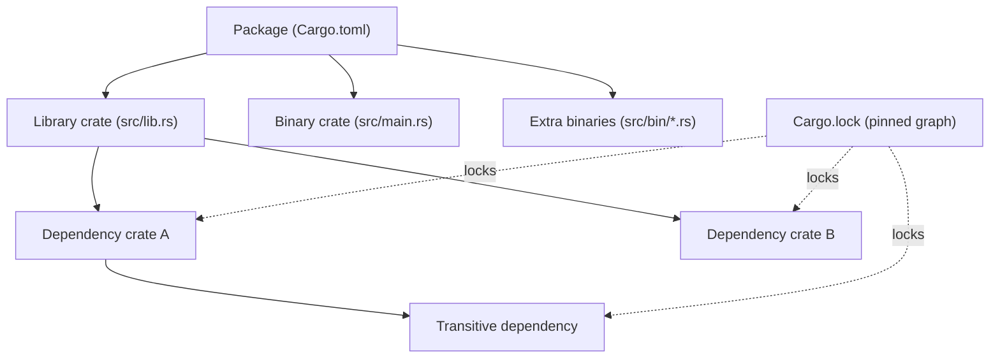

### 1.4 Architecture

The flow from source to running program passes through Cargo, which orchestrates `rustc`, fetches dependencies from the registry, and caches compiled artifacts under `target/`.

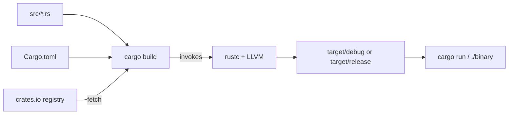

### 1.5 Real example

**Scenario.** Your team needs a small command-line tool that greets a configurable number of users, distributed as a reproducible binary.

**Problem.** New developers compile with different toolchain versions, producing subtly different binaries and "works on my machine" reports.

**Solution.** Create a Cargo package, pin the toolchain, and write a tiny but idiomatic program. Cargo plus `Cargo.lock` and `rust-toolchain.toml` makes the build deterministic.

**Implementation.**

```rust
// src/main.rs
fn greet(name: &str) -> String {
    format!("Hello, {name}!")
}

fn main() {
    let names = ["Ada", "Linus", "Grace"];
    for name in names {
        println!("{}", greet(name));
    }
    println!("Greeted {} users.", names.len());
}
```

```toml
# Cargo.toml
[package]
name = "greeter"
version = "0.1.0"
edition = "2024"

[dependencies]
```

```toml
# rust-toolchain.toml — every machine builds with the same compiler
[toolchain]
channel = "1.85.0"
components = ["rustfmt", "clippy"]
```

Run it with `cargo run`. Format with `cargo fmt` and lint with `cargo clippy`.

**Result.** A reproducible binary in `target/release/greeter` after `cargo build --release`. Every developer and CI runner uses channel 1.85.0, so the output and artifacts match.

**Future improvements.** Read the user list from arguments using the `clap` crate; add a `--lang` flag; emit a non-zero exit code when no names are supplied.

### 1.6 Exercises

1. Create a new binary package with `cargo new metrics` and a new library with `cargo new --lib units`.
2. Add `units` as a path dependency of `metrics` and call a function across the crate boundary.
3. Run `cargo build`, then inspect what changed in `Cargo.lock`.
4. Add a second binary at `src/bin/report.rs` and run it with `cargo run --bin report`.

### 1.7 Challenges

1. Pin a nightly toolchain only for a `bench` subcommand while keeping stable as the default, using `rustup override` or `cargo +nightly`.
2. Configure a `[profile.release]` section that enables `lto = true` and `codegen-units = 1`, then measure the binary-size and build-time impact.

### 1.8 Checklist

- [ ] `rustup`, `cargo`, `rustfmt`, and `clippy` are installed and on PATH.
- [ ] The package builds with `cargo build` and runs with `cargo run`.
- [ ] A `rust-toolchain.toml` pins the channel for the whole team.
- [ ] `Cargo.lock` is committed for binaries (and intentionally handled for libraries).
- [ ] `cargo fmt --check` and `cargo clippy` pass with no warnings.

### 1.9 Best practices

- Use `cargo new` and `cargo add` instead of hand-editing manifests; they keep formatting and versions correct.
- Commit `Cargo.lock` for applications to lock the exact dependency graph.
- Run `cargo clippy` in CI and treat its lints as errors with `-D warnings`.
- Keep `edition = "2024"` for new code to get the latest defaults.

### 1.10 Anti-patterns

- Calling `rustc` by hand for multi-file projects instead of letting Cargo manage the build.
- Deleting `Cargo.lock` to "fix" a dependency issue; this hides the real version conflict.
- Committing the `target/` directory; it is large, machine-specific, and rebuildable.
- Mixing global toolchain overrides with per-project pins, producing inconsistent builds.

### 1.11 Troubleshooting

| Symptom | Likely cause | Resolution |
|---------|--------------|------------|
| `command not found: cargo` | rustup PATH not loaded | Source the cargo env or restart the shell after install |
| `edition 2024 is unstable` | Toolchain too old | `rustup update`; ensure channel ≥ 1.85 |
| Dependency resolves to unexpected version | Stale `Cargo.lock` or wildcard version | `cargo update -p <crate>`; pin a caret version |
| Build is slow on every change | Whole-crate rebuild | Split into smaller crates; enable incremental builds (default in debug) |
| `linker cc not found` | Missing system C toolchain | Install build tools (e.g. `build-essential`, Xcode CLT, or MSVC) |

### 1.12 Official references

- The Cargo Book — https://doc.rust-lang.org/cargo/
- rustup documentation — https://rust-lang.github.io/rustup/
- Editions guide — https://doc.rust-lang.org/edition-guide/
- `cargo` command reference — https://doc.rust-lang.org/cargo/commands/

---

## Chapter 2 — Ownership and borrowing: the memory model that defines Rust

### 2.1 Introduction

Ownership is the rule system that lets Rust guarantee memory safety without a garbage collector and without manual `free`. Every value has exactly one owner; when the owner goes out of scope, the value is dropped. You can lend access through references — *borrows* — under rules the compiler enforces. This chapter teaches ownership, moves, copies, and the borrowing rules well enough that the borrow checker stops feeling like an obstacle and starts feeling like a design tool.

### 2.2 Business context

Memory-safety defects — use-after-free, double-free, data races, buffer overruns — account for a large share of critical security vulnerabilities in C and C++ codebases. Rust eliminates these at compile time, which converts a class of expensive production incidents into cheap compiler errors. For a business, that means fewer emergency patches, lower audit cost, and the ability to write performance-critical code without a garbage collector's latency spikes.

### 2.3 Theoretical concepts

There are three ownership rules: each value has one owner; there is exactly one owner at a time; when the owner leaves scope, the value is dropped. Assigning a non-`Copy` value **moves** it — the source is no longer usable. Types that are cheap and have no special drop logic (integers, `bool`, `char`, and tuples of such) implement `Copy` and are duplicated instead of moved. Borrowing produces references governed by two rules at any given moment: you may have **either** one mutable reference (`&mut T`) **or** any number of shared references (`&T`), but not both, and references must never outlive the data they point to.

```mermaid
stateDiagram-v2
    [*] --> Owned: let s = String::from("hi")
    Owned --> Moved: let t = s  (move)
    Moved --> [*]: s no longer usable
    Owned --> SharedBorrow: &s (one or many)
    Owned --> MutBorrow: &mut s (exclusive)
    SharedBorrow --> Owned: borrow ends
    MutBorrow --> Owned: borrow ends
    Owned --> Dropped: scope ends
    Dropped --> [*]
```

### 2.4 Architecture

A `String` is a fat pointer on the stack (pointer, length, capacity) that owns a buffer on the heap. Moving the `String` copies the three stack words and invalidates the source, so only one owner ever frees the heap buffer. A borrow is just a pointer into existing data and frees nothing.

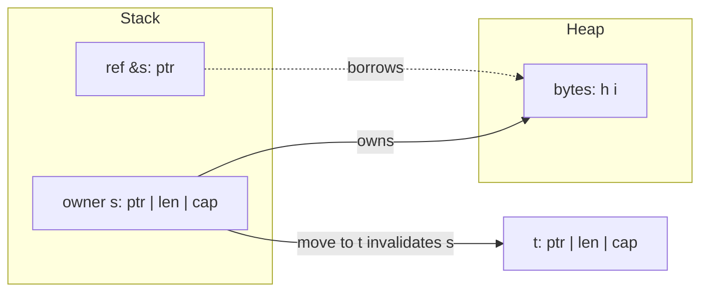

### 2.5 Real example

**Scenario.** A text-processing service must count word frequencies in a large document without copying the document repeatedly.

**Problem.** A naive implementation clones the input into every helper, multiplying memory use and time. The team wants borrowing so the data is read in place.

**Solution.** Pass the text by shared reference (`&str`) into a counting function. The function borrows the data, builds a count map of borrowed slices, and returns owned results only where ownership must transfer.

**Implementation.**

```rust
use std::collections::HashMap;

/// Borrows the text; returns owned counts. No copy of the document is made.
fn word_counts(text: &str) -> HashMap<&str, usize> {
    let mut counts: HashMap<&str, usize> = HashMap::new();
    for word in text.split_whitespace() {
        *counts.entry(word).or_insert(0) += 1;
    }
    counts
}

fn main() {
    let document = String::from("rust is fast rust is safe");
    let counts = word_counts(&document); // shared borrow, not a move

    // `document` is still usable here because it was only borrowed.
    println!("document has {} bytes", document.len());

    let mut pairs: Vec<(&str, usize)> = counts.into_iter().collect();
    pairs.sort_by(|a, b| b.1.cmp(&a.1).then(a.0.cmp(b.0)));
    for (word, n) in pairs {
        println!("{word}: {n}");
    }
}
```

The returned `HashMap<&str, usize>` borrows from `document`; it is valid only while `document` lives, which the compiler verifies through lifetimes (covered in Part II).

**Result.** Word counts are produced with a single pass and no duplication of the document. The borrow checker guarantees no key in the map outlives the source text.

**Future improvements.** Return `HashMap<String, usize>` if the caller needs the counts to outlive the input; parallelize the count with `rayon`; stream the input so documents larger than memory can be processed.

### 2.6 Exercises

1. Write a function that takes ownership of a `String` and returns it, then rewrite it to borrow `&str` instead. Compare the call sites.
2. Trigger a "value borrowed after move" error deliberately, then fix it with a `.clone()` and again with a borrow.
3. Create two shared references and one mutable reference in the same scope and explain the compiler error.

### 2.7 Challenges

1. Implement a function that returns the longest of two string slices without cloning, and explain why a lifetime annotation is required.
2. Build a small struct that owns a `Vec<String>` and exposes an iterator of `&str` over its contents without allocating.

### 2.8 Checklist

- [ ] You can predict whether an assignment moves or copies a value.
- [ ] You know when to take `T`, `&T`, or `&mut T` in a function signature.
- [ ] You can explain why two `&mut` borrows of the same value are rejected.
- [ ] You reach for borrowing before `.clone()` to avoid needless allocation.
- [ ] You understand that a value is dropped exactly once, at end of scope.

### 2.9 Best practices

- Prefer borrowing (`&T`/`&mut T`) over taking ownership unless the function truly needs to consume the value.
- Accept `&str` and `&[T]` parameters instead of `&String` and `&Vec<T>` for maximum flexibility.
- Let scopes end early (or use explicit blocks) so borrows release as soon as possible.
- Use `.clone()` deliberately and visibly; it is a signal, not a default.

### 2.10 Anti-patterns

- Cloning to silence the borrow checker without understanding the lifetime issue.
- Taking `self` (by value) on methods that only need `&self`, forcing callers to give up ownership.
- Returning a reference to a local variable (it would dangle; the compiler rejects it).
- Wrapping everything in `Rc<RefCell<T>>` to avoid learning the borrow rules.

### 2.11 Troubleshooting

| Symptom | Likely cause | Resolution |
|---------|--------------|------------|
| `value borrowed here after move` | Used a value after moving it | Borrow instead, or `.clone()` if you need a copy |
| `cannot borrow as mutable more than once` | Two `&mut` in the same scope | Sequence the mutations; shorten one borrow's scope |
| `cannot borrow as mutable, also borrowed as immutable` | Overlapping `&` and `&mut` | End the shared borrow before the mutable one begins |
| `returns a reference to data owned by the current function` | Returning `&local` | Return an owned value, or borrow from a parameter |
| Unexpected `Copy` vs move behavior | Type implements `Copy` | Check the type; `Copy` types duplicate on assignment |

### 2.12 Official references

- Ownership (the book) — https://doc.rust-lang.org/book/ch04-00-understanding-ownership.html
- References and borrowing — https://doc.rust-lang.org/book/ch04-02-references-and-borrowing.html
- The Rust Reference — https://doc.rust-lang.org/reference/
- `std::mem` (drop, swap, replace) — https://doc.rust-lang.org/std/mem/index.html

---

## Chapter 3 — Types, structs, enums, and pattern matching

### 3.1 Introduction

Rust's type system is its second pillar, working hand in hand with ownership. You compose data with **structs** (product types: "this *and* that") and **enums** (sum types: "this *or* that"). You then take values apart safely with **pattern matching**, which the compiler checks for exhaustiveness. Together these let you make illegal states unrepresentable — encoding business rules directly into types the compiler enforces.

### 3.2 Business context

Bugs cluster where invalid states are representable: a record that is "logged in" but has no user id, an order that is "shipped" with no address. By modeling state as enums whose variants carry exactly the data each state needs, you delete those bugs at the type level. Reviewers read the type and know every possible case; the compiler refuses to compile code that forgets one. This shrinks the test surface and turns specification ambiguity into a compile error.

### 3.3 Theoretical concepts

A **struct** groups named fields. A **tuple struct** groups positional fields. A **unit struct** has none. An **enum** defines a closed set of variants, each of which may carry data (unit, tuple, or struct-like). `Option<T>` and `Result<T, E>` are ordinary library enums. **Pattern matching** with `match` destructures values; it must be **exhaustive**, so every variant is handled or a wildcard `_` is provided. `if let` and `let ... else` handle a single pattern concisely.

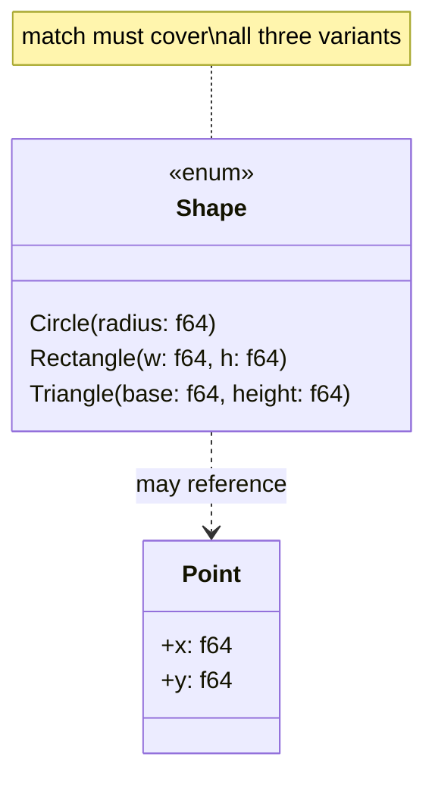

### 3.4 Architecture

A `match` expression routes a value to exactly one arm based on its variant, binding inner data along the way. Because the compiler knows the full set of variants, omitting one is a compile error — the safety property that makes enums a modeling tool rather than a convenience.

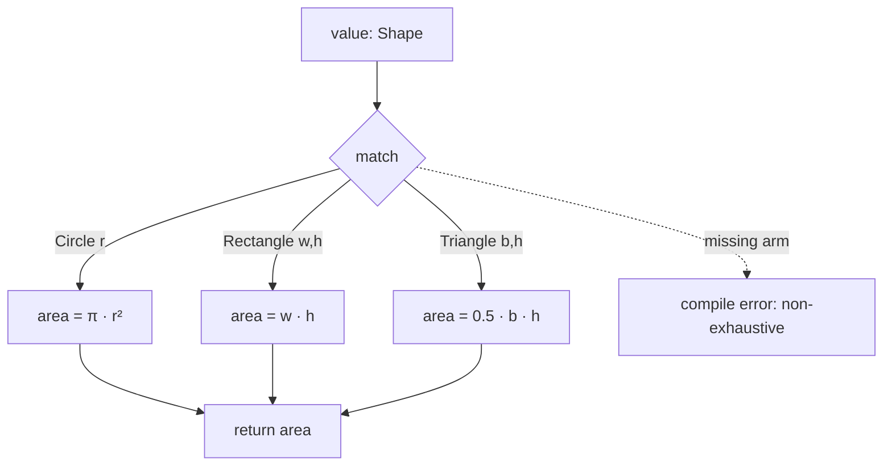

### 3.5 Real example

**Scenario.** A geometry module must compute the area of several shapes and reject impossible inputs.

**Problem.** Representing shape "type" as a string plus loose fields lets callers build nonsense (a "circle" with a width). The team wants the types to forbid invalid combinations.

**Solution.** Model the shapes as an enum where each variant carries exactly the fields it needs. Compute area with an exhaustive `match`. Validate construction so negative dimensions cannot exist.

**Implementation.**

```rust
#[derive(Debug, Clone, Copy)]
enum Shape {
    Circle { radius: f64 },
    Rectangle { width: f64, height: f64 },
    Triangle { base: f64, height: f64 },
}

#[derive(Debug)]
enum ShapeError {
    NonPositive(&'static str),
}

impl Shape {
    fn circle(radius: f64) -> Result<Shape, ShapeError> {
        if radius <= 0.0 {
            return Err(ShapeError::NonPositive("radius"));
        }
        Ok(Shape::Circle { radius })
    }

    fn area(&self) -> f64 {
        match self {
            Shape::Circle { radius } => std::f64::consts::PI * radius * radius,
            Shape::Rectangle { width, height } => width * height,
            Shape::Triangle { base, height } => 0.5 * base * height,
        }
    }
}

fn main() {
    let shapes = [
        Shape::circle(2.0),
        Ok(Shape::Rectangle { width: 3.0, height: 4.0 }),
        Shape::circle(-1.0), // rejected at construction
    ];

    for shape in shapes {
        match shape {
            Ok(s) => println!("{s:?} -> area {:.3}", s.area()),
            Err(e) => println!("invalid shape: {e:?}"),
        }
    }
}
```

If a fourth variant were added to `Shape`, the `area` match would fail to compile until the new case is handled — the compiler enforces that every shape has an area.

**Result.** Impossible shapes cannot be constructed, and adding a variant is caught everywhere it must be handled. The area logic is total and self-documenting.

**Future improvements.** Add a `perimeter` method; derive `PartialEq` for testing; introduce a `Shape::Polygon(Vec<Point>)` variant and let the compiler point you at every match that needs updating.

### 3.6 Exercises

1. Add a `Square { side: f64 }` variant and update `area`; observe the compiler guiding you.
2. Rewrite `area` using `if let` for one variant and explain why `match` is preferable here.
3. Add a tuple struct `Meters(f64)` and use it to make `radius` strongly typed.

### 3.7 Challenges

1. Model a finite state machine for an order (`Draft`, `Paid`, `Shipped { tracking: String }`, `Cancelled { reason: String }`) and write a transition function that the type system prevents from skipping states.
2. Implement a small calculator enum `Expr` (`Num`, `Add`, `Mul`) and evaluate it recursively with `match`.

### 3.8 Checklist

- [ ] You can choose between a struct and an enum for a given domain concept.
- [ ] Your enums carry exactly the data each variant needs — no shared optional fields.
- [ ] Every `match` is exhaustive or has a justified `_` arm.
- [ ] You use `if let` / `let ... else` for single-pattern cases.
- [ ] Construction validates invariants so invalid values cannot exist.

### 3.9 Best practices

- Make illegal states unrepresentable: push invariants into variants, not into runtime checks.
- Derive `Debug` on data types so they print in errors and logs.
- Prefer struct-like enum variants with named fields when a variant has more than one value.
- Favor exhaustive `match` over `_` so new variants force a deliberate decision.

### 3.10 Anti-patterns

- A "tagged" struct with a `kind: String` field plus many `Option` fields, simulating an enum unsafely.
- Catch-all `_ => {}` arms that silently ignore future variants.
- Boolean-flag soup (`is_paid`, `is_shipped`) instead of a single state enum.
- Deeply nested `match` where a guard (`match ... if`) or destructuring would read better.

### 3.11 Troubleshooting

| Symptom | Likely cause | Resolution |
|---------|--------------|------------|
| `non-exhaustive patterns` | A variant is unhandled | Add the missing arm or a justified `_` |
| `cannot move out of borrowed content` in a match | Matching by value on `&T` | Match on `&self`/bind with `ref`, or use the field by reference |
| `unreachable pattern` warning | A `_` or broad arm precedes specific ones | Reorder arms specific-to-general |
| Field is private when destructuring | Struct fields default to private | Add `pub` fields or a constructor/accessor |
| `match` arm types differ | Arms return different types | Make all arms produce the same type |

### 3.12 Official references

- Defining structs — https://doc.rust-lang.org/book/ch05-00-structs.html
- Enums and pattern matching — https://doc.rust-lang.org/book/ch06-00-enums.html
- The `match` control flow operator — https://doc.rust-lang.org/book/ch06-02-match.html
- Patterns and matching (reference) — https://doc.rust-lang.org/reference/patterns.html

---

> **End of Part I.** You can now drive Cargo, reason precisely about ownership and borrowing, and model domains with structs, enums, and exhaustive pattern matching — the foundation every later Part builds on. Parts II–VIII (lifetimes, traits and generics, collections and iterators, error handling, modules and smart pointers, concurrency and async, and the mastery topics of macros, testing, unsafe/FFI, performance, and release) continue the same chapter structure and will be appended in subsequent deliveries.

---

## Part II — The borrow model in depth

Part I introduced ownership. Part II goes deep on **borrowing** — the rules that let you access data without owning it, checked at compile time: **references and aliasing** (shared vs. mutable), **lifetimes** (how long a reference is valid), and **slices/strings** with the **`Sized`** boundary.

---

## Chapter 4 — References, mutability, and aliasing rules

### 4.1 Introduction

A **reference** borrows access to a value without taking ownership: `&T` is a **shared** (immutable) reference, `&mut T` is a **mutable** (exclusive) one. The borrow checker enforces one rule that defines safe Rust: at any time you may have **either** any number of shared references **or** exactly one mutable reference — **never both**. This "aliasing XOR mutability" rule is what eliminates data races and use-after-free *at compile time*, with no garbage collector. Borrowing lets functions read or modify data in place while ownership stays with the original.

### 4.2 Business context

Memory-safety bugs — data races, dangling pointers, iterator invalidation — are among the most expensive and dangerous in systems software (the majority of critical CVEs in C/C++ codebases). Rust's aliasing rule makes those bugs **unrepresentable**: code that would alias-and-mutate simply doesn't compile. For a business, that means a whole category of security vulnerabilities and heisenbugs never reaches production, achieved without the runtime cost of a garbage collector — which is why Rust is adopted for infrastructure, embedded, and performance-critical services where both safety and speed matter.

### 4.3 Theoretical concepts: aliasing XOR mutability

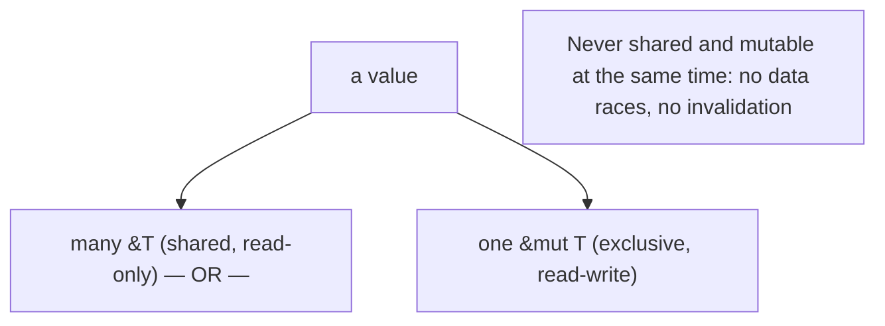

`&T` permits reading and may be copied freely; `&mut T` permits mutation and is **exclusive** — while it exists, no other reference (shared or mutable) to that value may be used. The borrow checker enforces this over the references' **scope** (non-lexical lifetimes: a borrow ends at its last use). This statically prevents two threads from writing simultaneously, and prevents mutating a collection while iterating it. You **dereference** with `*` to read/write through a reference.

### 4.4 Architecture: borrow instead of move or copy

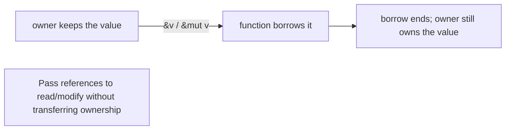

Functions usually **borrow** their arguments (`&T`/`&mut T`) so the caller retains ownership, avoiding needless moves or clones.

### 4.5 Real example

**Scenario.** A function appends to a vector the caller still needs afterward.

**Problem.** Taking the vector by value would move it (caller loses it); cloning wastes memory.

**Solution.** Borrow it **mutably** (`&mut Vec<T>`); ownership stays with the caller.

**Implementation.**

```rust
fn push_two(v: &mut Vec<i32>) {   // exclusive borrow: may mutate, caller keeps ownership
    v.push(1);
    v.push(2);
}

fn main() {
    let mut nums = vec![10];
    push_two(&mut nums);          // lend it mutably
    println!("{:?}", nums);       // [10, 1, 2] — still owned and usable here

    let a = &nums;                // shared borrow
    let b = &nums;                // another shared borrow — fine (no mutation)
    println!("{} {}", a.len(), b.len());
    // let m = &mut nums;         // ERROR if a/b still used: can't alias + mutate
}
```

**Result.** `push_two` modifies the vector in place via an exclusive `&mut` borrow, and `main` keeps ownership and uses `nums` afterward — no move, no clone. Multiple shared borrows (`a`, `b`) coexist because none mutates; introducing a `&mut` while they're live would be a compile error. The aliasing rule is enforced by the compiler, so the code is memory-safe by construction.

**Future improvements.** Prefer `&[T]`/`&str` parameters (Ch. 6) for read-only access so the function accepts more types; let non-lexical lifetimes end borrows early by structuring code so the `&mut` doesn't overlap shared reads.

### 4.6 Exercises

1. State the aliasing rule in one sentence.
2. Why can you have many `&T` but only one `&mut T`?
3. What real bug classes does this rule eliminate at compile time?

### 4.7 Challenges

- **Challenge.** Write a function that takes `&mut Vec<String>` and removes empty strings in place; show the caller still owns and uses the vector afterward. Then try to take a `&mut` while a `&` is live and read the compiler error.

### 4.8 Checklist

- [ ] I borrow (`&T`/`&mut T`) instead of moving when the caller keeps the value.
- [ ] I never hold a shared and a mutable reference to the same value at once.
- [ ] I use `&mut` only where mutation is needed (exclusive).
- [ ] I let borrows end at their last use (non-lexical lifetimes).

### 4.9 Best practices

- Default to shared `&T`; reach for `&mut T` only to mutate.
- Pass references rather than cloning to read/modify data.
- Keep mutable borrows short and non-overlapping with shared reads.

### 4.10 Anti-patterns

- Cloning to dodge the borrow checker instead of borrowing correctly.
- Long-lived `&mut` borrows that block other access unnecessarily.
- Fighting the checker with workarounds instead of restructuring ownership.

### 4.11 Troubleshooting

| Symptom | Likely cause | Action |
|---------|--------------|--------|
| "cannot borrow as mutable because also borrowed as immutable" | Shared + mutable overlap | End the shared borrow before the `&mut` |
| "use of moved value" | Took by value instead of borrowing | Pass `&T`/`&mut T` |
| "cannot borrow as mutable more than once" | Two `&mut` overlap | Restructure so only one is live |

### 4.12 References

- *The Rust Programming Language* (Klabnik & Nichols), ch. 4 "Understanding Ownership" — https://doc.rust-lang.org/book/ch04-00-understanding-ownership.html.
- J. Blandy, J. Orendorff, L. Tindall, *Programming Rust*, 2nd ed. (O'Reilly, 2021) — ISBN 978-1492052593.

---

## Chapter 5 — Lifetimes and the lifetime elision rules

### 5.1 Introduction

A **lifetime** is the compile-time scope for which a reference is valid. The borrow checker uses lifetimes to guarantee a reference never outlives the data it points to (no dangling references). Usually lifetimes are **inferred** and invisible, but when a function returns a reference derived from its inputs, you sometimes annotate them: `fn longest<'a>(x: &'a str, y: &'a str) -> &'a str`. The **lifetime elision rules** are the compiler's heuristics that let you omit these annotations in the common cases — which is why most Rust code has no explicit lifetimes.

### 5.2 Business context

Dangling pointers — references to freed memory — are a top source of crashes and exploitable vulnerabilities in systems code. Lifetimes let Rust prove, at compile time, that this can't happen, again without a garbage collector. Most of the time the **elision rules** make this free (no annotations), so developers get the safety without the ceremony; understanding when annotations *are* needed (and why) is the difference between fighting the compiler and working with it. The payoff is reference-heavy, zero-copy code (slices, string views) that is provably safe.

### 5.3 Theoretical concepts: references can't outlive their data

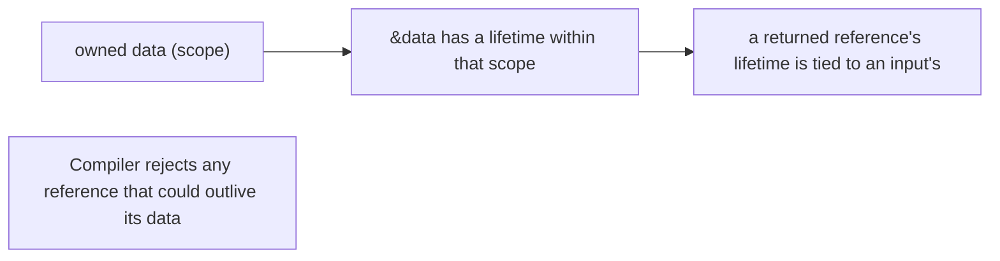

A lifetime parameter (`'a`) **relates** the lifetimes of references — e.g., "the returned reference lives as long as both inputs". It doesn't change how long anything lives; it lets the compiler check the relationship. The **elision rules**: (1) each input reference gets its own lifetime; (2) if there's exactly one input lifetime, it's assigned to all outputs; (3) for methods, the lifetime of `&self` is assigned to outputs. When these resolve the outputs unambiguously, no annotation is needed — covering most functions.

### 5.4 Architecture: tie outputs to inputs

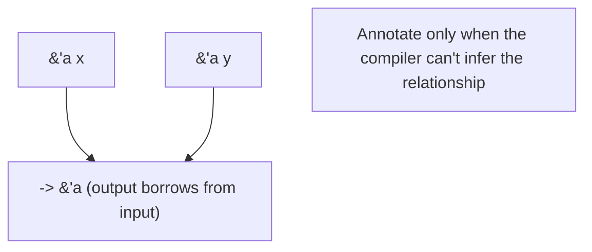

Explicit lifetimes appear where a returned reference could come from more than one input, telling the compiler (and reader) which data it borrows from.

### 5.5 Real example

**Scenario.** A function returns the longer of two string slices.

**Problem.** The compiler can't tell whether the returned reference borrows from `x` or `y`, so it can't prove it won't dangle.

**Solution.** Annotate a shared lifetime `'a` tying the output to both inputs.

**Implementation.**

```rust
fn longest<'a>(x: &'a str, y: &'a str) -> &'a str {   // output lives as long as both inputs
    if x.len() >= y.len() { x } else { y }
}

fn main() {
    let a = String::from("hello");
    let result;
    {
        let b = String::from("hi");
        result = longest(&a, &b);     // result borrows from a or b
        println!("{result}");         // OK: used while both a and b are alive
    }
    // println!("{result}");          // ERROR: b dropped; result might dangle
}
```

**Result.** The `'a` annotation tells the compiler the returned reference is valid only as long as **both** inputs are — so using `result` after `b` is dropped is a compile error, exactly the dangling-reference bug Rust prevents. Within the inner scope, where both strings live, it's safe. The annotation made the safety relationship explicit; without it, the function wouldn't compile.

**Future improvements.** Most functions need no annotations thanks to elision — reserve them for the genuinely ambiguous cases; if lifetimes get complex, consider returning an owned `String` instead of a borrowed `&str`.

### 5.6 Exercises

1. What does a lifetime guarantee about a reference?
2. Why does `longest` need an explicit lifetime when most functions don't?
3. State the three lifetime elision rules.

### 5.7 Challenges

- **Challenge.** Write a `first_word<'a>(s: &'a str) -> &'a str` returning the first word; confirm it compiles *without* an explicit annotation (elision rule 2) and explain why.

### 5.8 Checklist

- [ ] I understand a reference may not outlive its data.
- [ ] I add lifetime annotations only when the compiler can't infer them.
- [ ] I tie a returned reference to the correct input lifetime.
- [ ] I consider returning owned data when lifetimes get unwieldy.

### 5.9 Best practices

- Rely on elision; annotate only ambiguous returned references.
- Keep borrowed return values tied to clear input lifetimes.
- Prefer owned returns over fighting complex lifetime puzzles.

### 5.10 Anti-patterns

- Sprinkling lifetime annotations where elision already works.
- Returning references to local (soon-dropped) data.
- Over-complex lifetime gymnastics where an owned value is simpler.

### 5.11 Troubleshooting

| Symptom | Likely cause | Action |
|---------|--------------|--------|
| "missing lifetime specifier" | Ambiguous returned reference | Add `<'a>` tying output to inputs |
| "borrowed value does not live long enough" | Reference outlives its data | Restrict use to the data's scope or return owned |
| Lifetime errors everywhere | Returning borrows of locals | Return owned `String`/`Vec` instead |

### 5.12 References

- *The Rust Programming Language*, ch. 10.3 "Validating References with Lifetimes" — https://doc.rust-lang.org/book/ch10-03-lifetime-syntax.html.
- J. Blandy et al., *Programming Rust*, 2nd ed. (O'Reilly, 2021) — ISBN 978-1492052593.

---

## Chapter 6 — Slices, strings, and the `Sized` boundary

### 6.1 Introduction

A **slice** is a borrowed **view** into a contiguous sequence — `&[T]` into a `Vec<T>`/array, `&str` into a `String` — giving access to a range **without copying**. Strings come in two forms: the **owned, growable `String`** and the **borrowed view `&str`** (string slice). Slices and `str` are **dynamically sized types (DSTs)**: they don't implement **`Sized`** (their size isn't known at compile time), so they're always handled **behind a pointer** (`&str`, `&[T]`, `Box<str>`). Accepting `&str`/`&[T]` parameters makes functions maximally flexible.

### 6.2 Business context

Slices are how Rust does zero-copy data processing — parsing, networking, text handling — without the allocations that hurt throughput. Designing functions to take `&str`/`&[T]` rather than `&String`/`&Vec<T>` lets one function serve owned data, literals, and sub-ranges alike, reducing API friction and copies. Understanding the `String`/`&str` distinction (and why) prevents the most common beginner confusion and the needless `.clone()`s that bloat memory use. This directly affects the performance and ergonomics that draw teams to Rust.

### 6.3 Theoretical concepts: views, not copies

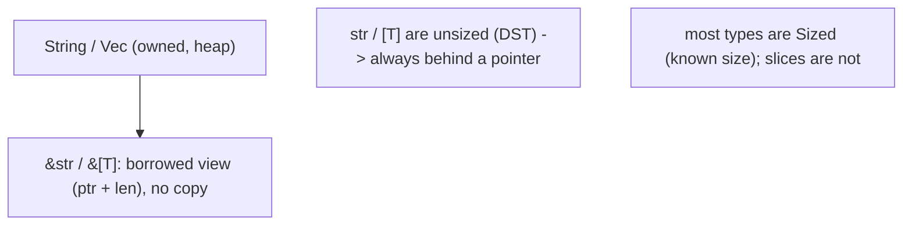

A slice is a **fat pointer**: a pointer plus a length. `&str` views UTF-8 bytes of a `String` or literal; `&[T]` views part of a `Vec`/array. Because `str` and `[T]` are **unsized**, you never hold them by value — only via `&str`, `&[T]`, `Box<[T]>`, etc. The **`Sized`** trait marks types whose size is known at compile time (the default); generic parameters are implicitly `Sized` unless relaxed with `?Sized`. Slicing (`&s[0..3]`) borrows a range and must fall on valid boundaries (for `str`, char boundaries).

### 6.4 Architecture: accept slices, return owned or borrowed deliberately

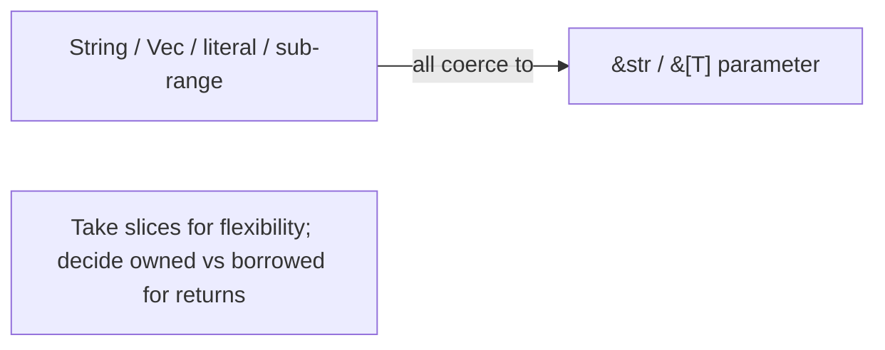

A function taking `&str`/`&[T]` accepts the widest set of inputs with no copies — the idiomatic parameter choice for read-only access.

### 6.5 Real example

**Scenario.** Count words in text that may come from a `String`, a literal, or a sub-range.

**Problem.** Taking `&String` forces callers to have an owned `String` and excludes literals/sub-slices.

**Solution.** Take a **`&str`** slice — every string form coerces to it, with no copy.

**Implementation.**

```rust
fn word_count(text: &str) -> usize {        // accepts String, &str literal, and sub-slices
    text.split_whitespace().count()
}

fn main() {
    let owned = String::from("the quick brown fox");
    println!("{}", word_count(&owned));     // String -> &str (deref coercion)
    println!("{}", word_count("a b c"));    // literal is already &str
    println!("{}", word_count(&owned[4..])); // a sub-slice view, no copy: "quick brown fox"
}
```

**Result.** `word_count` works for an owned `String`, a string literal, and a borrowed sub-range alike — all coerce to `&str` with zero copying. Taking the slice instead of `&String` made the function flexible and allocation-free. The `&owned[4..]` sub-slice is a view into the existing buffer, not a new allocation.

**Future improvements.** Return owned `String` only when the caller needs ownership; use `?Sized` bounds when writing generic code that should accept slices; slice on char boundaries to avoid panics with non-ASCII text.

### 6.6 Exercises

1. What is a slice, and why is it called a "fat pointer"?
2. Why are `str` and `[T]` always used behind a pointer?
3. Why prefer a `&str` parameter over `&String`?

### 6.7 Challenges

- **Challenge.** Write `fn longest_word(text: &str) -> &str` returning the longest word as a sub-slice (no allocation), and call it with a `String`, a literal, and a sub-range.

### 6.8 Checklist

- [ ] I take `&str`/`&[T]` parameters for flexible, zero-copy read access.
- [ ] I understand `String` (owned) vs `&str` (borrowed view).
- [ ] I handle unsized types behind pointers (`&str`, `Box<[T]>`).
- [ ] I slice on valid (char) boundaries.

### 6.9 Best practices

- Accept slices (`&str`/`&[T]`) rather than owned references in parameters.
- Return owned data only when ownership is genuinely needed.
- Use `?Sized` to write generics that also accept slices.

### 6.10 Anti-patterns

- `&String`/`&Vec<T>` parameters that needlessly restrict callers.
- `.clone()`/`.to_string()` to avoid slices where a borrow works.
- Slicing a `str` at a non-char boundary (panics).

### 6.11 Troubleshooting

| Symptom | Likely cause | Action |
|---------|--------------|--------|
| Function won't accept a literal | Parameter is `&String` | Change it to `&str` |
| "doesn't have a size known at compile-time" | Holding `str`/`[T]` by value | Use it behind a pointer (`&str`, `Box<[T]>`) |
| Panic slicing a string | Cut on a non-char boundary | Slice on char boundaries (e.g., via `char_indices`) |

### 6.12 References

- *The Rust Programming Language*, ch. 4.3 "The Slice Type" & ch. 19.4 (`Sized`/DSTs) — https://doc.rust-lang.org/book/ch04-03-slices.html.
- J. Blandy et al., *Programming Rust*, 2nd ed. (O'Reilly, 2021) — ISBN 978-1492052593.

---

> **End of Part II.** Rust's borrow model: **references** with the **aliasing-XOR-mutability** rule (many `&T` or one `&mut T`) eliminate data races and invalidation at compile time; **lifetimes** (mostly elided) prove references never dangle; and **slices**/`&str` give zero-copy views, with unsized `str`/`[T]` always behind a pointer (`Sized`). Part III covers Rust's **type system** — scalars, compounds, sum types (`enum`, `Option`, `Result`), and exhaustive pattern matching.

---

## Part III — The type system

Part III covers how Rust models data: **scalar and compound** built-in types and **user-defined** structs, **enums as sum types** (with `Option` and `Result` as the canonical examples), and **exhaustive pattern matching** that makes handling every case mandatory.

---

## Chapter 7 — Scalar, compound, and user-defined types

### 7.1 Introduction

Rust is **statically and strongly typed** with full inference. **Scalar** types are single values: integers (`i32`, `u64`, …), floats (`f64`), `bool`, and `char` (a Unicode scalar). **Compound** types group values: **tuples** (`(i32, &str)`, fixed heterogeneous) and **arrays** (`[T; N]`, fixed homogeneous). **User-defined** types are **structs** — named-field (`struct Point { x: f64, y: f64 }`), tuple structs, and unit structs — on which you implement methods via `impl`. Types are explicit at boundaries but inferred locally, giving safety without verbosity.

### 7.2 Business context

A precise type system is documentation the compiler enforces: a function that takes a `Celsius` newtype can't be passed a raw `f64` meant for something else, eliminating unit-confusion bugs (the kind that crashed spacecraft). Choosing the right integer width and signedness prevents overflow surprises. Modeling domain concepts as structs (rather than loose tuples or primitives) makes code self-explanatory and refactor-safe. Strong typing front-loads error detection to compile time, where fixing a mistake is cheapest — a major reason Rust code is reliable.

### 7.3 Theoretical concepts

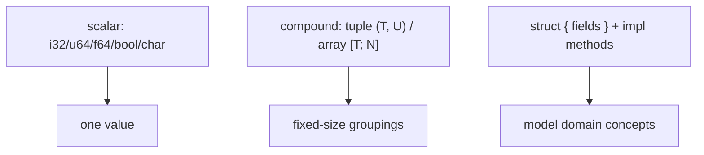

Integers have explicit width/signedness; overflow panics in debug and wraps in release (use `checked_/wrapping_/saturating_` for intent). **Tuples** group a fixed number of possibly-different types and destructure (`let (a, b) = pair`); **arrays** are fixed-length same-type (`[0; 5]`), distinct from the growable `Vec<T>`. **Structs** name their fields and gain behavior through `impl` blocks (associated functions like `new`, and methods taking `&self`). The **newtype** pattern (`struct Meters(f64)`) gives a primitive a distinct type for safety.

### 7.4 Architecture: model with structs

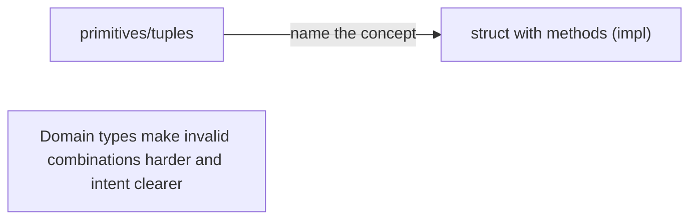

Promoting loose primitives/tuples into named structs with methods turns implicit conventions into compiler-checked types.

### 7.5 Real example

**Scenario.** Represent a 2-D point with a distance method.

**Problem.** Passing bare `(f64, f64)` tuples loses meaning and invites mixing up coordinates.

**Solution.** A **struct** with an `impl` block; a **newtype** keeps units distinct.

**Implementation.**

```rust
struct Point { x: f64, y: f64 }

impl Point {
    fn new(x: f64, y: f64) -> Self { Point { x, y } }   // associated function
    fn distance(&self, other: &Point) -> f64 {           // method borrows self
        ((self.x - other.x).powi(2) + (self.y - other.y).powi(2)).sqrt()
    }
}

fn main() {
    let a = Point::new(0.0, 0.0);
    let b = Point::new(3.0, 4.0);
    println!("{}", a.distance(&b));   // 5.0
}
```

**Result.** `Point` names its fields and carries its own behavior; `distance` borrows both points (no copies) and the type makes "a point" explicit instead of an anonymous tuple. The compiler now prevents passing a `Point` where some other 2-tuple is expected. Methods and the `new` constructor keep usage clean.

**Future improvements.** Add `#[derive(Clone, Copy, Debug, PartialEq)]` for ergonomics; use newtypes (`struct Meters(f64)`) where unit safety matters.

### 7.6 Exercises

1. What is the difference between a tuple and an array?
2. What does an `impl` block add to a struct?
3. What problem does the newtype pattern solve?

### 7.7 Challenges

- **Challenge.** Define a `Rectangle` struct with `width`/`height`, methods `area()` and `can_hold(&Rectangle) -> bool`, and an associated `square(size)` constructor.

### 7.8 Checklist

- [ ] I choose integer width/signedness deliberately.
- [ ] I model domain concepts as structs, not loose tuples/primitives.
- [ ] I add behavior via `impl` methods/associated functions.
- [ ] I use newtypes where type distinction prevents bugs.

### 7.9 Best practices

- Name concepts with structs; give them methods.
- Derive common traits (`Debug`, `Clone`, `PartialEq`) where useful.
- Use newtypes for units/IDs to avoid mix-ups.

### 7.10 Anti-patterns

- Passing anonymous tuples where a named struct would clarify.
- Ignoring integer overflow semantics.
- Primitive obsession — raw `f64`/`String` for distinct domain values.

### 7.11 Troubleshooting

| Symptom | Likely cause | Action |
|---------|--------------|--------|
| Mixed-up arguments of the same primitive type | Primitive obsession | Introduce newtypes/structs |
| Overflow panic in debug | Unchecked arithmetic | Use `checked_`/`wrapping_`/`saturating_` |
| Verbose tuple access (`.0`, `.1`) | Anonymous tuple | Use a named-field struct |

### 7.12 References

- *The Rust Programming Language*, ch. 3 (data types) & ch. 5 (structs) — https://doc.rust-lang.org/book/ch05-00-structs.html.
- J. Blandy et al., *Programming Rust*, 2nd ed. (O'Reilly, 2021) — ISBN 978-1492052593.

---

## Chapter 8 — Enums as sum types; `Option` and `Result` as data

### 8.1 Introduction

A Rust **enum** is a **sum type**: a value that is **exactly one** of several variants, and each variant can **carry data** (`enum Shape { Circle(f64), Rect { w: f64, h: f64 } }`). This is far more powerful than C-style enums. Two enums are so important they're built in: **`Option<T>`** (`Some(T)` or `None`) replaces null, and **`Result<T, E>`** (`Ok(T)` or `Err(E)`) models recoverable errors as **values**. Because the type forces you to handle every variant, "forgot to check for null/error" bugs are impossible.

### 8.2 Business context

The null reference ("billion-dollar mistake") and unchecked error codes cause a huge share of crashes and security holes. Rust replaces both with enums the type system forces you to handle: a `Option<User>` cannot be used as a `User` until you deal with the `None` case, and a `Result` must be inspected before you get the value. This moves "did you handle the missing/failed case?" from a runtime hope to a compile-time guarantee — eliminating null-pointer and ignored-error defects entirely, which is decisive for reliability-critical software.

### 8.3 Theoretical concepts

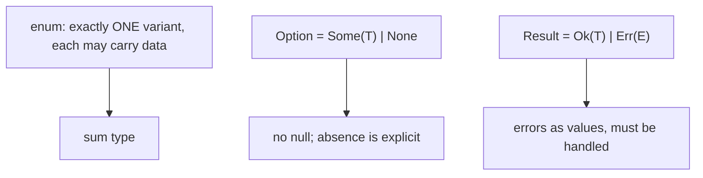

An enum variant can hold values, structs, or nothing; the whole value is tagged with which variant it is. **`Option<T>`** makes absence a distinct value you must unwrap (via `match`, `if let`, `?`, or combinators like `map`/`unwrap_or`). **`Result<T, E>`** makes failure a value carrying an error; the **`?`** operator propagates an `Err` early, making error handling concise yet explicit. There are no exceptions for recoverable errors — they flow as `Result`.

### 8.4 Architecture: make states and failures data

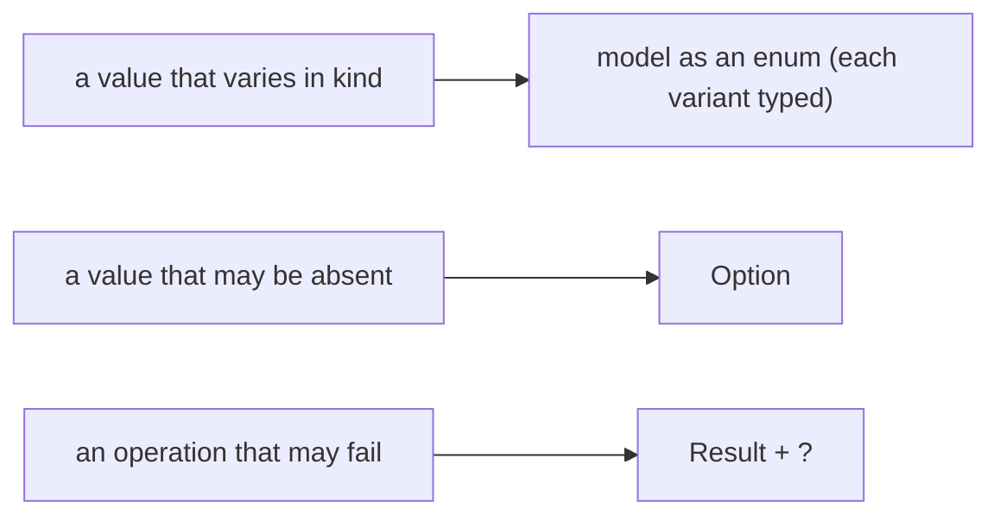

Encoding "one of several kinds", "maybe absent", and "might fail" as enums makes the compiler enforce that every possibility is addressed.

### 8.5 Real example

**Scenario.** Parse a config value that may be missing or invalid.

**Problem.** In many languages a missing key returns null and a parse error throws — both easy to forget.

**Solution.** Return **`Result<T, E>`**, use **`Option`** for the lookup, and propagate with **`?`**.

**Implementation.**

```rust
use std::collections::HashMap;

fn read_port(cfg: &HashMap<String, String>) -> Result<u16, String> {
    let raw = cfg.get("port")                       // Option<&String>
        .ok_or_else(|| "missing 'port'".to_string())?;   // None -> Err, propagate
    let port = raw.parse::<u16>()                   // Result<u16, ParseIntError>
        .map_err(|e| format!("bad port: {e}"))?;    // convert + propagate the error
    Ok(port)
}
```

**Result.** Absence (`get` → `Option`) and parse failure (`parse` → `Result`) are both **values** the compiler forces the code to handle; `?` propagates either as an `Err` without verbose branching. A caller of `read_port` must inspect the `Result` before using the port — there's no way to accidentally use a missing or invalid value. Null and ignored-error bugs are structurally impossible.

**Future improvements.** Use a typed error enum (Ch. 18) instead of `String`; provide defaults with `unwrap_or`/`unwrap_or_else` where a missing value is acceptable.

### 8.6 Exercises

1. What makes an enum a "sum type", and how is it more than a C enum?
2. How does `Option<T>` eliminate null-pointer bugs?
3. What does the `?` operator do with a `Result`?

### 8.7 Challenges

- **Challenge.** Model a `Command` enum with variants carrying data (`Move { x, y }`, `Write(String)`, `Quit`), and write a function returning `Result<Command, String>` that parses a line, propagating errors with `?`.

### 8.8 Checklist

- [ ] I model "one of several kinds" as a data-carrying enum.
- [ ] I use `Option<T>` for possibly-absent values (no null).
- [ ] I use `Result<T, E>` for fallible operations.
- [ ] I propagate errors with `?` rather than ignoring them.

### 8.9 Best practices

- Encode states/absence/failure as enums (`Option`/`Result`).
- Propagate with `?`; convert errors with `map_err`.
- Reserve `unwrap`/`expect` for cases that genuinely can't fail (and document why).

### 8.10 Anti-patterns

- `unwrap()`/`expect()` everywhere, turning recoverable errors into panics.
- Sentinel values (`-1`, empty string) instead of `Option`/`Result`.
- Stringly-typed errors where a typed enum belongs.

### 8.11 Troubleshooting

| Symptom | Likely cause | Action |
|---------|--------------|--------|
| Panic on `None`/`Err` | Careless `unwrap()` | Handle with `match`/`?`/`unwrap_or` |
| "cannot use Option<T> as T" | Used without unwrapping | Match/`if let`/`?` to extract |
| `?` won't compile | Error types don't convert | Implement `From`/use `map_err` |

### 8.12 References

- *The Rust Programming Language*, ch. 6 (enums & `Option`) & ch. 9 (`Result`) — https://doc.rust-lang.org/book/ch06-00-enums.html.
- J. Blandy et al., *Programming Rust*, 2nd ed. (O'Reilly, 2021) — ISBN 978-1492052593.

---

## Chapter 9 — Exhaustive pattern matching and guards

### 9.1 Introduction

**`match`** is Rust's primary control-flow tool over enums and values: it compares a value against **patterns** and runs the first arm that fits, **binding** the data inside. Its defining property is **exhaustiveness** — the compiler requires every possible case to be handled (or a `_` wildcard), so you can't forget a variant. Patterns can **destructure** structs/tuples/enums, include **guards** (`if` conditions on an arm), and match ranges and literals. **`if let`**/**`while let`** are concise forms for matching a single pattern.

### 9.2 Business context

Exhaustive matching is a powerful safety net for evolving software: add a new variant to an enum (a new order status, a new event), and the compiler flags **every** `match` that doesn't handle it — turning "we forgot to update one place" from a production incident into a build error. Combined with `Option`/`Result`, it guarantees missing and error cases are addressed. Guards and destructuring let complex business rules be expressed as a readable table of cases. This is a large part of why large Rust codebases refactor safely.

### 9.3 Theoretical concepts

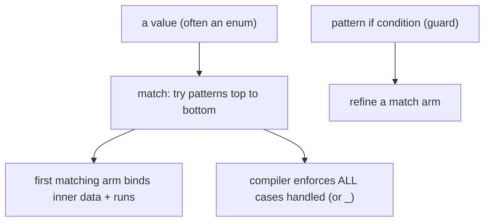

A `match` arm is `pattern => expression`; patterns **destructure** and bind (`Some(x)`, `Shape::Rect { w, h }`, `(a, b)`). **Exhaustiveness** means uncovered cases are a compile error — add `_` only when you truly want a catch-all. **Guards** (`Some(n) if n > 0 =>`) add a boolean condition. `match` is an **expression** (returns a value). **`if let`** handles one pattern concisely when you don't need exhaustiveness for the rest.

### 9.4 Architecture: handle every case, by construction

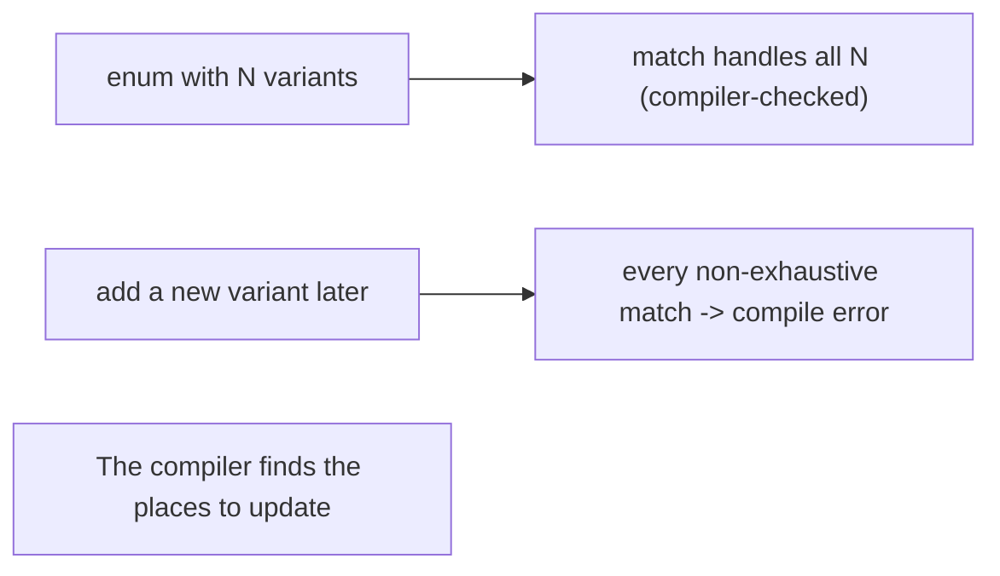

Exhaustive matching makes adding a variant a guided, compiler-driven refactor instead of a hunt for missed cases.

### 9.5 Real example

**Scenario.** Compute the area of different shapes.

**Problem.** A `switch` that silently ignores an unhandled shape (or a forgotten new one) returns wrong results.

**Solution.** A **`match`** over the enum — exhaustive, with **destructuring** and a **guard**.

**Implementation.**

```rust
enum Shape { Circle(f64), Rect { w: f64, h: f64 }, Triangle { base: f64, height: f64 } }

fn area(s: &Shape) -> f64 {
    match s {
        Shape::Circle(r) => std::f64::consts::PI * r * r,         // bind r
        Shape::Rect { w, h } if w == h => w * w,                   // guard: square case
        Shape::Rect { w, h } => w * h,                             // destructure fields
        Shape::Triangle { base, height } => 0.5 * base * height,
        // no `_` needed: every variant is handled — exhaustive
    }
}
```

**Result.** Every `Shape` variant is handled, destructured to its data, with a guard distinguishing the square case — and the compiler **guarantees** completeness, so no shape is silently mishandled. If a `Pentagon` variant were added later, this `match` would fail to compile until updated, pointing exactly here. The logic reads as a clear table of cases.

**Future improvements.** Use `if let Some(x) = opt` for single-case matches; avoid `_` catch-alls on domain enums so the compiler keeps guiding future changes.

### 9.6 Exercises

1. What does "exhaustive" mean for a `match`, and why is it valuable?
2. How does a guard refine a match arm?
3. When is `if let` preferable to a full `match`?

### 9.7 Challenges

- **Challenge.** Write a `match` over a `Result<i32, String>` that returns a message for `Ok` (with a guard for zero vs. positive vs. negative) and for `Err`, with no `_` arm.

### 9.8 Checklist

- [ ] I use `match` to handle every variant (exhaustive).
- [ ] I destructure to bind inner data directly.
- [ ] I use guards for conditional arms.
- [ ] I avoid `_` on domain enums so new variants surface as errors.

### 9.9 Best practices

- Prefer exhaustive `match` without catch-alls on domain types.
- Use `if let`/`while let` for single-pattern cases.
- Express conditional rules with guards and destructuring.

### 9.10 Anti-patterns

- Overusing `_` catch-alls, hiding unhandled new variants.
- Nested `if`/`else` where a `match` is clearer.
- Unwrapping instead of matching on `Option`/`Result`.

### 9.11 Troubleshooting

| Symptom | Likely cause | Action |
|---------|--------------|--------|
| "non-exhaustive patterns" | A case isn't handled | Add the missing arm (or `_` deliberately) |
| New variant silently ignored elsewhere | `_` catch-all used | Remove `_`; let the compiler flag matches |
| Verbose conditional logic | `if`/`else` chains | Use `match` with guards/destructuring |

### 9.12 References

- *The Rust Programming Language*, ch. 6.2 (`match`) & ch. 18 (patterns) — https://doc.rust-lang.org/book/ch06-02-match.html.
- J. Blandy et al., *Programming Rust*, 2nd ed. (O'Reilly, 2021) — ISBN 978-1492052593.

---

> **End of Part III.** Rust models data precisely: **scalar/compound** types and **structs** with methods; **enums as sum types** with `Option` (no null) and `Result` (errors as values, propagated with `?`); and **exhaustive `match`** with destructuring and guards that forces every case to be handled. Part IV covers **traits and generics** — Rust's tools for polymorphism and reuse.

---

## Part IV — Traits and generics

Part IV covers Rust's polymorphism: **traits** (shared behavior contracts), **generics** with **trait bounds** (compile-time, monomorphized reuse), **trait objects** (`dyn`) for runtime dispatch, and **associated types/supertraits/coherence**.

---

## Chapter 10 — Defining and implementing traits; default methods

### 10.1 Introduction

A **trait** defines shared behavior — a set of method signatures a type can implement, like an interface. You declare `trait Summary { fn summarize(&self) -> String; }` and implement it for a type with `impl Summary for Article { ... }`. Traits can provide **default method** bodies that implementers inherit or override. Standard traits (`Display`, `Debug`, `Clone`, `Iterator`, `PartialOrd`) are everywhere, and many can be auto-generated with `#[derive(...)]`. Traits are the foundation of both generics (Ch. 11) and dynamic dispatch (Ch. 12).

### 10.2 Business context

Traits let code depend on **behavior** rather than concrete types: a function that works with anything `Display`able, a sorting routine for anything `Ord`. This decoupling makes code reusable and testable, and the **coherence** rules (Ch. 13) keep implementations unambiguous across a large dependency graph. Default methods let a trait grow shared functionality without forcing every implementer to rewrite it. Deriving common traits removes boilerplate. The result is highly reusable abstractions with no runtime cost when used generically — reuse and performance together.

### 10.3 Theoretical concepts

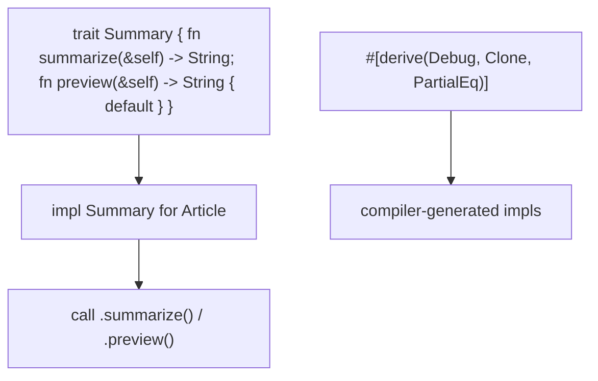

A trait lists required methods (and optional **default** implementations). `impl Trait for Type` provides them; a type may implement many traits. **Default methods** can call other (required) trait methods, so implementing one unlocks several. The **orphan rule** (coherence): you can implement a trait for a type only if you own the trait or the type — preventing conflicting impls. `#[derive]` auto-implements standard traits (`Debug`, `Clone`, `PartialEq`, etc.).

### 10.4 Architecture: depend on behavior

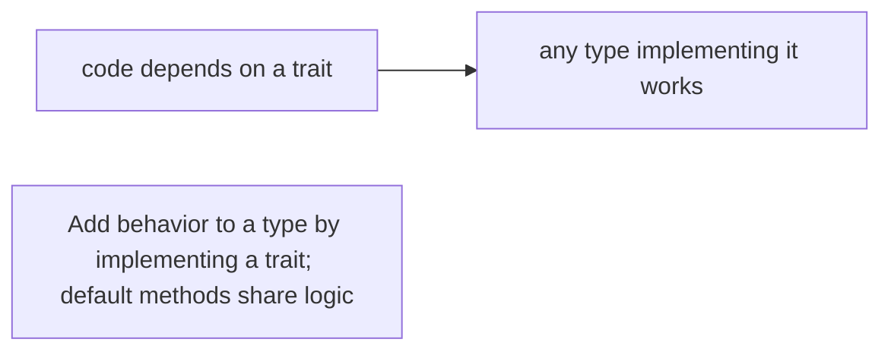

Programming against traits decouples consumers from concrete types, the basis for Rust's generic reuse.

### 10.5 Real example

**Scenario.** Several content types need a summary, with a shared default preview.

**Problem.** Duplicating preview logic per type is wasteful; coupling code to each concrete type blocks reuse.

**Solution.** A **trait** with a required method and a **default** method.

**Implementation.**

```rust
trait Summary {
    fn summarize(&self) -> String;                       // required
    fn preview(&self) -> String {                        // default, uses summarize()
        format!("{}…", &self.summarize()[..self.summarize().len().min(20)])
    }
}

struct Article { title: String, body: String }
impl Summary for Article {
    fn summarize(&self) -> String { format!("{}: {}", self.title, self.body) }
    // preview() inherited from the default
}

fn print_preview(item: &impl Summary) {                  // works for ANY Summary type
    println!("{}", item.preview());
}
```

**Result.** `Article` implements only `summarize`; it gets `preview` for free from the default. `print_preview` accepts any `Summary` implementer, so adding a `Tweet` type means one `impl` and no change to consumers. Behavior is shared via the default method and abstracted via the trait — reuse without duplication.

**Future improvements.** Derive standard traits where applicable; split large traits into focused ones; use `impl Trait` in argument/return position for concise generic signatures.

### 10.6 Exercises

1. What is a trait, and how is it like/unlike an interface?
2. What does a default method let implementers avoid?
3. What is the orphan rule and why does it exist?

### 10.7 Challenges

- **Challenge.** Define a `Describe` trait with a required `name()` and a default `describe()` using it; implement it for two structs and write a function taking `&impl Describe`.

### 10.8 Checklist

- [ ] I define shared behavior as traits and depend on them.
- [ ] I provide default methods to share logic.
- [ ] I respect the orphan rule when implementing traits.
- [ ] I derive standard traits to cut boilerplate.

### 10.9 Best practices

- Program to traits; keep them small and focused.
- Use default methods for shared behavior; override where needed.
- Derive `Debug`/`Clone`/`PartialEq`/etc. when appropriate.

### 10.10 Anti-patterns

- God traits bundling unrelated behavior.
- Reimplementing what a default method could provide.
- Hand-writing impls that `#[derive]` would generate.

### 10.11 Troubleshooting

| Symptom | Likely cause | Action |
|---------|--------------|--------|
| "trait not implemented" | Type missing the `impl` | Implement the trait (or derive it) |
| "cannot implement foreign trait for foreign type" | Orphan-rule violation | Use a newtype wrapper you own |
| Duplicated method bodies | No default method | Add a default in the trait |

### 10.12 References

- *The Rust Programming Language*, ch. 10.2 "Traits" — https://doc.rust-lang.org/book/ch10-02-traits.html.
- J. Blandy et al., *Programming Rust*, 2nd ed. (O'Reilly, 2021) — ISBN 978-1492052593.

---

## Chapter 11 — Generic functions, structs, and bounds

### 11.1 Introduction

**Generics** let you write functions, structs, and enums parameterized over types (`fn largest<T>(list: &[T]) -> &T`). To do anything meaningful with a generic `T`, you constrain it with **trait bounds** (`T: PartialOrd`), which specify the behavior `T` must provide. Rust **monomorphizes** generics — it generates a specialized copy per concrete type at compile time — so generic code has **zero runtime cost** (no boxing, no dynamic dispatch). Generics plus bounds are how Rust achieves reusable, type-safe abstractions as fast as hand-written specific code.

### 11.2 Business context

Generics eliminate the duplication of writing the same logic per type while keeping full type safety and speed — `Vec<T>`, `HashMap<K, V>`, and your own data structures are generic. Trait bounds make requirements explicit and checked: a `sort` over `T: Ord` won't compile for a type that isn't ordered, catching misuse at build time. Because monomorphization specializes each instantiation, there's no performance penalty, so teams get reuse **and** the bare-metal speed Rust is chosen for. This combination is rare and valuable.

### 11.3 Theoretical concepts

```mermaid
flowchart TB
    gen["fn largest<T: PartialOrd>(list: &[T]) -> &T"] --> bound["bound: T must be comparable"]
    bound --> ops["unlocks the operations on T"]
    mono["monomorphization: a specialized copy per concrete T"] --> zero["zero-cost, no dynamic dispatch"]
```

A **bound** (`T: Trait`, or a `where` clause for many) restricts the type parameter and grants its methods to the body. Multiple bounds combine (`T: Clone + Debug`). At compile time, **monomorphization** stamps out a concrete version for each `T` actually used — so `largest::<i32>` and `largest::<char>` are separate, fully optimized functions. This is **static dispatch**: the called method is known at compile time (contrast `dyn`, Ch. 12).

### 11.4 Architecture: one definition, specialized per type

```mermaid
flowchart LR
    one["generic definition + bounds"] --> mono["compiler specializes per concrete type"]
    mono --> fast["as fast as hand-written, type-safe"]
```

Generic code is written once and compiled into efficient, type-specific machine code wherever it's used.

### 11.5 Real example

**Scenario.** Find the largest element of any comparable slice.

**Problem.** Writing `largest_i32`, `largest_char`, etc. duplicates logic; using a non-comparable type should be rejected.

**Solution.** A **generic** function with a `PartialOrd` **bound**.

**Implementation.**

```rust
fn largest<T: PartialOrd + Copy>(list: &[T]) -> T {   // bound: comparable + copyable
    let mut max = list[0];
    for &item in &list[1..] {
        if item > max { max = item; }                  // `>` available because T: PartialOrd
    }
    max
}

fn main() {
    println!("{}", largest(&[3, 7, 2, 9, 4]));   // i32
    println!("{}", largest(&['c', 'a', 'z']));   // char — same code, specialized
}
```

**Result.** One `largest` serves any `PartialOrd + Copy` type; the compiler monomorphizes a specialized, fully-optimized version for `i32` and `char`. A type without ordering would be a compile error (the bound isn't satisfied), and there's no runtime dispatch cost. Reuse and native speed, type-checked.

**Future improvements.** Use a `where` clause for readability when bounds grow; relax `Copy` to returning `&T` to support non-copy types; consider returning `Option<T>` for empty slices.

### 11.6 Exercises

1. Why does a generic `T` usually need a trait bound to be useful?
2. What is monomorphization, and what does it cost at runtime?
3. How do you express multiple bounds on a type parameter?

### 11.7 Challenges

- **Challenge.** Write a generic `struct Pair<T>` with a method that prints the larger field, bounded by `T: PartialOrd + Display`. Instantiate it for two types.

### 11.8 Checklist

- [ ] I use generics to avoid per-type duplication.
- [ ] I add the trait bounds that enable the operations I use.
- [ ] I rely on monomorphization for zero-cost generic reuse.
- [ ] I use `where` clauses when bounds get long.

### 11.9 Best practices

- Constrain type parameters with the minimal bounds needed.
- Prefer generics (static dispatch) for performance-sensitive reuse.
- Use `where` clauses for readable complex bounds.

### 11.10 Anti-patterns

- Duplicating logic per concrete type instead of generalizing.
- Over- or under-constraining type parameters.
- Reaching for `dyn` where generics would be zero-cost.

### 11.11 Troubleshooting

| Symptom | Likely cause | Action |
|---------|--------------|--------|
| "method not found for T" | Missing trait bound | Add `T: Trait` to enable it |
| Code bloat / long compiles | Heavy monomorphization | Consider `dyn` for cold paths (Ch. 12) |
| Bounds hard to read | Many inline bounds | Move them to a `where` clause |

### 11.12 References

- *The Rust Programming Language*, ch. 10.1 "Generic Data Types" — https://doc.rust-lang.org/book/ch10-01-syntax.html.
- J. Blandy et al., *Programming Rust*, 2nd ed. (O'Reilly, 2021) — ISBN 978-1492052593.

---

## Chapter 12 — Trait objects, dynamic dispatch, and `dyn`

### 12.1 Introduction

Generics dispatch statically (one type per instantiation). Sometimes you need a **collection of different types** that share a trait — e.g., a `Vec` of various drawable widgets. A **trait object** (`dyn Trait`, used behind a pointer like `Box<dyn Draw>` or `&dyn Draw`) enables this: it stores a value of *some* type implementing the trait, and method calls go through **dynamic dispatch** (a runtime vtable lookup). You trade a small runtime cost and lose monomorphization for the flexibility of heterogeneous collections and runtime-chosen behavior.

### 12.2 Business context

Some designs are inherently runtime-polymorphic: plugin systems, UI widget trees, lists of handlers of mixed concrete types. Trait objects make these expressible while keeping type safety — every element is guaranteed to implement the trait. The choice between generics (`impl Trait`/bounds) and trait objects (`dyn`) is a real engineering trade-off: static dispatch is faster and inlinable but monomorphizes (code size, homogeneous), while `dyn` is flexible and compact but adds an indirect call. Knowing when each fits keeps both performance and design clean.

### 12.3 Theoretical concepts

```mermaid
flowchart TB
    static["generics: static dispatch, monomorphized, homogeneous"]
    dynamic["dyn Trait (Box<dyn T> / &dyn T): dynamic dispatch via vtable, heterogeneous"]
    note["Trait must be object-safe to be used as dyn"]
```

A **trait object** is a fat pointer: a data pointer plus a **vtable** pointer; calls look up the method at runtime. Stored behind `Box<dyn Trait>`, `&dyn Trait`, etc. (it's unsized, like slices). This allows a `Vec<Box<dyn Draw>>` holding different concrete types. A trait must be **object-safe** (roughly: no generic methods, no `Self`-returning methods) to be used as `dyn`. Use `dyn` for heterogeneous collections/runtime choice; use generics for hot, homogeneous code.

### 12.4 Architecture: choose static vs dynamic dispatch

```mermaid
flowchart LR
    q{"need different types together / runtime choice?"} -->|yes| dyn["Box<dyn Trait> (dynamic)"]
    q -->|no, perf-critical| gen["generics + bounds (static)"]
```

The dispatch choice follows the design: heterogeneity/runtime flexibility → `dyn`; homogeneity/performance → generics.

### 12.5 Real example

**Scenario.** A screen renders a list of differently-typed UI components.

**Problem.** Generics produce a homogeneous collection — you can't put `Button` and `Checkbox` in the same `Vec<T>`.

**Solution.** A **`Vec<Box<dyn Draw>>`** holding any `Draw` implementer, dispatched dynamically.

**Implementation.**

```rust
trait Draw { fn draw(&self); }

struct Button { label: String }
struct Checkbox { checked: bool }
impl Draw for Button   { fn draw(&self) { println!("[ {} ]", self.label); } }
impl Draw for Checkbox { fn draw(&self) { println!("[{}]", if self.checked {"x"} else {" "}); } }

fn render(components: &[Box<dyn Draw>]) {     // heterogeneous list
    for c in components { c.draw(); }          // dynamic dispatch via vtable
}

fn main() {
    let screen: Vec<Box<dyn Draw>> = vec![
        Box::new(Button { label: "OK".into() }),
        Box::new(Checkbox { checked: true }),
    ];
    render(&screen);
}
```

**Result.** Different concrete types (`Button`, `Checkbox`) live in one `Vec<Box<dyn Draw>>`, and `render` calls `draw()` on each via dynamic dispatch — impossible with a homogeneous generic collection. The type system still guarantees every element implements `Draw`. The small vtable-call cost buys the heterogeneous, extensible design a UI needs.

**Future improvements.** Prefer generics on hot, homogeneous paths; keep traits object-safe if they'll be used as `dyn`; use enums instead of `dyn` when the set of types is closed and known.

### 12.6 Exercises

1. What is a trait object, and how does its dispatch differ from generics?
2. Why can a `Vec<Box<dyn Trait>>` hold different concrete types?
3. When would you choose `dyn` over generics, and vice versa?

### 12.7 Challenges

- **Challenge.** Build a `Vec<Box<dyn Fn(i32) -> i32>>` of different closures, iterate, and apply each to a value — a heterogeneous list of behaviors.

### 12.8 Checklist

- [ ] I use `dyn Trait` (behind a pointer) for heterogeneous collections.
- [ ] I use generics for homogeneous, performance-critical code.
- [ ] I keep traits object-safe when they're used as `dyn`.
- [ ] I consider enums for a closed set of types.

### 12.9 Best practices

- Match dispatch to the design (heterogeneity vs performance).
- Keep `dyn`-used traits object-safe.
- Reach for generics first on hot paths; `dyn` for flexibility.

### 12.10 Anti-patterns

- `dyn` on hot, homogeneous paths where generics are free.
- Trait objects for a small closed set (an enum is simpler/faster).
- Non-object-safe traits forced into `dyn`.

### 12.11 Troubleshooting

| Symptom | Likely cause | Action |
|---------|--------------|--------|
| "trait cannot be made into an object" | Not object-safe | Remove generic/`Self`-returning methods, or use generics |
| Can't mix types in a `Vec<T>` | Generic = homogeneous | Use `Vec<Box<dyn Trait>>` |
| Unexpected indirect-call cost | Dynamic dispatch on a hot path | Switch to generics (static dispatch) |

### 12.12 References

- *The Rust Programming Language*, ch. 18.2 "Trait Objects" — https://doc.rust-lang.org/book/ch18-02-trait-objects.html.
- J. Blandy et al., *Programming Rust*, 2nd ed. (O'Reilly, 2021) — ISBN 978-1492052593.

---

## Chapter 13 — Associated types, supertraits, and coherence

### 13.1 Introduction

Three features round out Rust's trait system. **Associated types** let a trait declare a placeholder type that each implementer fixes — `trait Iterator { type Item; fn next(&mut self) -> Option<Self::Item>; }` — giving cleaner signatures than extra generic parameters. **Supertraits** require that implementing one trait also implies another (`trait Ord: PartialOrd`), so a trait can rely on another's methods. **Coherence** (the orphan rule) guarantees there's at most one implementation of a trait for a type across the whole program, keeping dispatch unambiguous.

### 13.2 Business context

These features make trait-based APIs precise and conflict-free at scale. Associated types are why `Iterator` reads cleanly and why adapter chains (Ch. 15) type-check nicely — without them, every use would carry extra type parameters. Supertraits express real dependencies between capabilities, so building a richer abstraction on a simpler one is checked. Coherence is what lets thousands of crates define and implement traits without two of them silently conflicting — essential for a large, decentralized ecosystem. Together they keep big Rust codebases coherent and ergonomic.

### 13.3 Theoretical concepts

```mermaid
flowchart TB
    assoc["trait Iterator { type Item; ... }"] --> fixed["each impl picks Item (one per type)"]
    super["trait Ord: PartialOrd"] --> requires["implementers must also be PartialOrd"]
    coherence["orphan rule: own the trait OR the type"] --> unique["at most one impl globally"]
```

An **associated type** is an output type the implementer chooses (`impl Iterator for Counter { type Item = u32; ... }`), used as `Self::Item`. A **supertrait** (`trait B: A`) means any `B` is also an `A`, so `B`'s defaults/methods may call `A`'s. **Coherence/the orphan rule**: a trait impl is allowed only if you define the trait or the type (or use a local newtype), preventing two crates from giving conflicting impls — there is exactly one for any (trait, type) pair.

### 13.4 Architecture: precise, non-conflicting abstractions

```mermaid
flowchart LR
    trait["trait with associated type + supertrait"] --> clean["clean signatures, layered capabilities"]
    orphan["orphan rule"] --> safe["no conflicting impls across crates"]
```

These rules let traits compose into rich, unambiguous APIs that scale across a dependency graph.

### 13.5 Real example

**Scenario.** Implement a custom iterator and a trait that builds on another.

**Problem.** Extra generic parameters clutter iterator signatures, and a richer trait needs a base trait's behavior.

**Solution.** An **associated type** for the iterator's item and a **supertrait** for the layered capability.

**Implementation.**

```rust
struct Counter { n: u32 }

impl Iterator for Counter {
    type Item = u32;                          // associated type fixed here
    fn next(&mut self) -> Option<Self::Item> {
        if self.n < 3 { self.n += 1; Some(self.n) } else { None }
    }
}

trait Named { fn name(&self) -> String; }
trait Greet: Named {                          // supertrait: every Greet is also Named
    fn greet(&self) -> String { format!("Hello, {}", self.name()) }   // uses Named::name
}
```

**Result.** `Counter` is a real `Iterator` with `Item = u32`, so it works with all iterator adapters (Ch. 15) and `for` loops — no extra generic parameters needed thanks to the associated type. `Greet` requires `Named`, so its default `greet` can call `name()`; a type must implement both. Coherence guarantees these impls don't conflict with any other crate's. Clean, layered, unambiguous.

**Future improvements.** Use associated types over generic parameters when there's exactly one logical output type; wrap foreign types in a newtype to implement foreign traits within the orphan rule.

### 13.6 Exercises

1. When is an associated type preferable to a generic type parameter?
2. What does a supertrait bound (`trait B: A`) guarantee?
3. What does the orphan rule prevent, and how do you work around it?

### 13.7 Challenges

- **Challenge.** Define a trait `Container` with an associated `type Item` and a method `get(&self, i: usize) -> Option<&Self::Item>`; implement it for a wrapper around `Vec<T>`.

### 13.8 Checklist

- [ ] I use associated types for a trait's single output type.
- [ ] I use supertraits to express capability dependencies.
- [ ] I implement foreign traits only via owned types/newtypes (coherence).
- [ ] I rely on the orphan rule to avoid conflicting impls.

### 13.9 Best practices

- Prefer associated types when there's one natural output type.
- Layer traits with supertraits to build richer capabilities.
- Use newtypes to satisfy coherence for foreign trait/type pairs.

### 13.10 Anti-patterns

- Extra generic parameters where an associated type is clearer.
- Trying to implement a foreign trait on a foreign type (won't compile).
- Deeply nested supertrait chains that obscure requirements.

### 13.11 Troubleshooting

| Symptom | Likely cause | Action |
|---------|--------------|--------|
| Cluttered generic signatures | Generic param instead of associated type | Use `type Item` |
| "the trait bound is not satisfied: PartialOrd" | Supertrait not implemented | Implement the supertrait too |
| "only traits defined in the current crate…" | Orphan-rule violation | Wrap in a local newtype |

### 13.12 References

- *The Rust Programming Language*, ch. 19.2 (advanced traits: associated types, supertraits) — https://doc.rust-lang.org/book/ch19-03-advanced-traits.html.
- J. Blandy et al., *Programming Rust*, 2nd ed. (O'Reilly, 2021) — ISBN 978-1492052593.

---

> **End of Part IV.** Rust's polymorphism: **traits** define shared behavior (with default methods); **generics + bounds** give monomorphized, zero-cost reuse (static dispatch); **trait objects** (`dyn`) give heterogeneous, runtime dispatch; and **associated types, supertraits, and coherence** keep trait APIs precise and conflict-free. Part V covers **collections and iterators** — the standard containers and Rust's powerful iterator/closure machinery.

---

## Part V — Collections and iterators

Part V covers Rust's standard **collections** (`Vec`, `HashMap`, and friends), the **`Iterator`** trait with its lazy adapter chains, and **closures** (`Fn`/`FnMut`/`FnOnce`) — the machinery that makes data processing both expressive and zero-cost.

---

## Chapter 14 — `Vec`, `HashMap`, `BTreeMap`, `VecDeque`, `HashSet`

### 14.1 Introduction

The standard library provides a collection for every need. **`Vec<T>`** is the growable array — the default sequence. **`HashMap<K, V>`** is an unordered key-value map with O(1) average operations; **`BTreeMap<K, V>`** keeps keys **sorted** (O(log n), ordered iteration). **`HashSet<T>`**/**`BTreeSet<T>`** store unique values. **`VecDeque<T>`** is a double-ended queue (push/pop both ends). Choosing by access pattern — and ownership semantics — is a core Rust skill, and the borrow checker ensures you never invalidate a collection while iterating it.

### 14.2 Business context

The right collection is a free performance and correctness win: a `HashSet` membership check is O(1) versus O(n) scanning a `Vec`; a `BTreeMap` gives sorted iteration without re-sorting. Rust's ownership rules additionally prevent the iterator-invalidation bugs (mutating a collection mid-iteration) that crash other languages — at compile time. Picking deliberately keeps data-heavy code fast and bug-free, which matters most exactly in the systems and services where Rust is deployed.

### 14.3 Theoretical concepts

```mermaid
flowchart TB
    vec["Vec<T>: growable sequence, index O(1)"]
    hash["HashMap<K,V> / HashSet<T>: O(1) avg, unordered"]
    btree["BTreeMap<K,V> / BTreeSet<T>: O(log n), sorted"]
    deque["VecDeque<T>: push/pop both ends"]
```

Pick by operation: sequence/index → `Vec`; keyed lookup → `HashMap` (or `BTreeMap` for sorted order); uniqueness → `HashSet`/`BTreeSet`; queue/stack at both ends → `VecDeque`. Keys/elements of hashed collections must implement `Hash + Eq`; ordered ones need `Ord`. Methods like `entry()` enable efficient insert-or-update. Because of borrowing, you can't hold a reference into a collection while mutating it — preventing invalidation.

### 14.4 Architecture: match container to access pattern

```mermaid
flowchart LR
    need["dominant operation?"] --> seq["sequence -> Vec"]
    need --> key["lookup -> HashMap / BTreeMap"]
    need --> uniq["uniqueness -> HashSet"]
    need --> ends["both ends -> VecDeque"]
```

The collection choice is an O(...) decision, just as in the algorithms guide.

### 14.5 Real example

**Scenario.** Count word frequencies and report them in sorted order.

**Problem.** A `Vec` of pairs needs O(n) lookups to accumulate counts, and isn't sorted.

**Solution.** A **`HashMap`** with `entry()` for O(1) counting, then a **`BTreeMap`** for sorted output.

**Implementation.**

```rust
use std::collections::{HashMap, BTreeMap};

fn word_freq(text: &str) -> BTreeMap<&str, u32> {
    let mut counts: HashMap<&str, u32> = HashMap::new();
    for word in text.split_whitespace() {
        *counts.entry(word).or_insert(0) += 1;   // insert-or-update, O(1) avg
    }
    counts.into_iter().collect()                  // collect into a sorted BTreeMap
}

fn main() {
    for (word, n) in word_freq("the cat the dog the cat") {
        println!("{word}: {n}");                  // printed in sorted key order
    }
}
```

**Result.** Counting uses a `HashMap` with `entry().or_insert()` for O(1) accumulation; collecting into a `BTreeMap` yields sorted iteration with no manual sort. The borrow checker guarantees no element is invalidated during the process. The right containers made the solution both fast and ordered.

**Future improvements.** Use `HashSet` for membership-only needs; pre-size with `with_capacity` when the count is known; consider `VecDeque` for sliding-window processing.

### 14.6 Exercises

1. When do you choose `BTreeMap` over `HashMap`?
2. What does `entry().or_insert()` accomplish in one step?
3. Why can't you mutate a collection while holding a reference into it?

### 14.7 Challenges

- **Challenge.** Given a slice of integers, use a `HashSet` to report duplicates in one pass and a `BTreeSet` to list the unique values in sorted order.

### 14.8 Checklist

- [ ] I pick the collection by its dominant operation's cost.
- [ ] I use `HashMap`/`HashSet` for O(1) lookup/uniqueness.
- [ ] I use `BTreeMap`/`BTreeSet` when sorted order matters.
- [ ] I use `entry()` for efficient insert-or-update.

### 14.9 Best practices

- Default to `Vec`; switch to maps/sets for lookup/uniqueness.
- Use `entry` APIs to avoid double lookups.
- Pre-size with `with_capacity` when size is known.

### 14.10 Anti-patterns

- Linear scans of a `Vec` where a `HashMap`/`HashSet` is O(1).
- Re-sorting a `Vec` repeatedly instead of using a `BTreeMap`.
- Ignoring `Hash`/`Ord` requirements on keys.

### 14.11 Troubleshooting

| Symptom | Likely cause | Action |
|---------|--------------|--------|
| Slow lookups/dedup | Scanning a `Vec` | Use `HashMap`/`HashSet` |
| Need sorted iteration | `HashMap` is unordered | Use `BTreeMap` |
| "cannot borrow as mutable while borrowed" | Mutating mid-iteration | Restructure; collect indices/keys first |

### 14.12 References

- *The Rust Programming Language*, ch. 8 "Common Collections" — https://doc.rust-lang.org/book/ch08-00-common-collections.html.
- Rust `std::collections` docs: https://doc.rust-lang.org/std/collections/.

---

## Chapter 15 — The `Iterator` trait and adapter chains

### 15.1 Introduction

The **`Iterator`** trait (one required method, `next() -> Option<Item>`) underlies all sequential processing in Rust. Iterators are **lazy**: **adapters** like `map`, `filter`, `take`, and `enumerate` build a new iterator without doing any work, and nothing runs until a **consumer** (`collect`, `sum`, `for`, `count`, `fold`) drives it. Chaining adapters expresses transformations declaratively, and because everything monomorphizes and inlines, an iterator chain compiles to code **as fast as a hand-written loop** — Rust's "zero-cost abstraction" in action.

### 15.2 Business context

Iterator chains make data transformation readable and correct — `data.iter().filter(...).map(...).sum()` states intent directly, like LINQ in C# — while compiling to optimal machine code with no allocation or indirection overhead. This is rare: most languages make you choose between expressive (slow) and manual (fast); Rust gives both. Laziness also enables processing infinite or large streams without building intermediates. For performance-critical data pipelines, iterators are the idiomatic, fast, and clear choice.

### 15.3 Theoretical concepts

```mermaid
flowchart LR
    src["iter()/into_iter()"] --> adapt["lazy adapters: filter -> map -> take (no work yet)"]
    adapt --> consume["consumer: collect/sum/for (drives it)"]
    note["Lazy until consumed; monomorphized + inlined = zero-cost"]
```

Get an iterator with `iter()` (yields `&T`), `iter_mut()` (`&mut T`), or `into_iter()` (owned `T`). **Adapters** return a new iterator (lazy); **consumers** force evaluation. `collect()` gathers into a chosen collection (type-annotated). `fold`/`reduce` aggregate; `enumerate`/`zip` combine. Because the chain is one monomorphized type, the compiler inlines it into a tight loop — no per-step allocation.

### 15.4 Architecture: declarative, zero-cost pipelines

```mermaid
flowchart TB
    data["collection"] --> pipe["iter -> filter -> map -> ..."] --> result["consumer -> value/collection"]
    note["Reads as intent; compiles like a manual loop"]
```

An iterator chain expresses the *what* and the compiler produces the efficient *how*.

### 15.5 Real example

**Scenario.** Sum the squares of the even numbers in a slice.

**Problem.** A manual loop with conditionals and a running total is verbose and easy to get subtly wrong.

**Solution.** A lazy **iterator chain** consumed by `sum`.

**Implementation.**

```rust
fn sum_even_squares(nums: &[i32]) -> i32 {
    nums.iter()                       // &i32
        .filter(|&&n| n % 2 == 0)     // keep evens (lazy)
        .map(|&n| n * n)              // square them (lazy)
        .sum()                        // consumer: drives the chain
}

fn main() {
    println!("{}", sum_even_squares(&[1, 2, 3, 4, 5, 6]));   // 4 + 16 + 36 = 56
}
```

**Result.** The chain reads as the problem statement — filter evens, square, sum — with no manual index, accumulator, or branch bugs. It's lazy (no intermediate `Vec` is allocated) and monomorphizes into a single tight loop, so it's as fast as the hand-written version. Expressive and zero-cost together.

**Future improvements.** Use `collect::<Vec<_>>()` only when you need the materialized result; reach for `fold` for custom aggregation; use `rayon`'s `par_iter()` to parallelize CPU-bound chains.

### 15.6 Exercises

1. What does it mean that iterators are lazy, and what triggers evaluation?
2. Difference between `iter()`, `iter_mut()`, and `into_iter()`?
3. Why is an iterator chain as fast as a manual loop?

### 15.7 Challenges

- **Challenge.** Given a slice of words, build a `Vec<String>` of the uppercased words longer than three characters, using `filter`, `map`, and `collect`.

### 15.8 Checklist

- [ ] I express transformations as iterator adapter chains.
- [ ] I understand adapters are lazy; consumers drive them.
- [ ] I choose `iter`/`iter_mut`/`into_iter` by the access I need.
- [ ] I `collect` only when materialization is needed.

### 15.9 Best practices

- Prefer iterator chains over manual index loops.
- Keep chains readable; name intermediate closures if complex.
- Use `fold`/`reduce` for custom aggregation; parallelize with `rayon` when CPU-bound.

### 15.10 Anti-patterns

- Manual `for`+index loops where an iterator is clearer.
- Collecting into a `Vec` just to iterate again.
- Heavy side effects inside `map` (use `for_each`/a loop for clarity).

### 15.11 Troubleshooting

| Symptom | Likely cause | Action |
|---------|--------------|--------|
| Chain "does nothing" | No consumer (still lazy) | Add `collect`/`sum`/`for`/etc. |
| `collect` type error | Target type not inferred | Annotate: `collect::<Vec<_>>()` |
| Borrow errors in a chain | Wrong `iter` variant | Use `into_iter`/`iter_mut` as needed |

### 15.12 References

- *The Rust Programming Language*, ch. 13.2 "Iterators" — https://doc.rust-lang.org/book/ch13-02-iterators.html.
- J. Blandy et al., *Programming Rust*, 2nd ed. (O'Reilly, 2021) — ISBN 978-1492052593.

---

## Chapter 16 — Closures: `Fn`, `FnMut`, `FnOnce`, and capture

### 16.1 Introduction

A **closure** is an anonymous function that can **capture** variables from its environment: `|x| x + base`. Rust classifies closures by how they use captures into three traits: **`Fn`** (captures by shared reference — callable many times), **`FnMut`** (captures by mutable reference — may mutate), and **`FnOnce`** (consumes captures — callable once). The compiler infers the least-restrictive one. The **`move`** keyword forces capture by value (taking ownership), essential when a closure outlives its scope (e.g., passed to a thread). Closures power the iterator adapters of Ch. 15.

### 16.2 Business context

Closures are how Rust passes behavior — predicates to `filter`, mappers to `map`, callbacks, thread bodies. The `Fn`/`FnMut`/`FnOnce` distinction is the borrow model applied to captured data: it lets the compiler guarantee a closure passed to a thread doesn't reference data that might be freed, eliminating a notorious class of concurrency bugs at compile time. `move` makes ownership transfer explicit for closures sent across threads or stored. Understanding capture is essential to using iterators, async, and concurrency correctly and safely.

### 16.3 Theoretical concepts

```mermaid
flowchart TB
    fn["Fn: captures by &T (call many times)"]
    fnmut["FnMut: captures by &mut T (mutates)"]
    fnonce["FnOnce: consumes captures (call once)"]
    move["move: capture by value (take ownership)"]
    note["Compiler infers the least restrictive trait from how captures are used"]
```

A closure captures only the variables it uses, by the **weakest** access that works: shared (`Fn`), mutable (`FnMut`), or by value/consume (`FnOnce`). These traits form a hierarchy (`Fn: FnMut: FnOnce`). Functions accept closures via bounds (`F: Fn(i32) -> i32`). **`move`** forces by-value capture regardless of usage — required to send a closure to another thread (Ch. 21) or return it from a function, so it doesn't dangle. A closure with no captures coerces to a plain `fn` pointer.

### 16.4 Architecture: pass behavior with the right capture

```mermaid
flowchart LR
    consumer["function bound F: Fn/FnMut/FnOnce"] --> closure["closure capturing environment"]
    closure -->|"move when it must outlive scope"| owned["owns its captures"]
```

The capture mode is chosen by how the closure uses its environment and whether it must outlive the current scope.

### 16.5 Real example

**Scenario.** Build a configurable filter and a counter that mutates captured state.

**Problem.** Passing behavior and mutable state safely is error-prone in many languages.

**Solution.** An **`Fn`** closure capturing a threshold and an **`FnMut`** closure mutating a count; `move` to own captures.

**Implementation.**

```rust
fn main() {
    let threshold = 3;
    let above = |&n: &i32| n > threshold;            // Fn: captures threshold by &
    let big: Vec<i32> = (1..=6).filter(above).collect();   // [4,5,6]

    let mut count = 0;
    let mut tally = |_| count += 1;                  // FnMut: mutates captured count
    (0..big.len()).for_each(&mut tally);
    println!("{count}");                              // 3

    let owned = String::from("hi");
    let make = move || owned.len();                  // move: take ownership of `owned`
    println!("{}", make());                           // closure owns its capture
}
```

**Result.** `above` reads the captured `threshold` (`Fn`), `tally` mutates the captured `count` (`FnMut`), and `make` takes ownership of `owned` via `move` so it could safely outlive the current scope (e.g., go to a thread). The compiler inferred the right trait for each and enforced the borrow rules on captures — behavior and state passed safely, no dangling.

**Future improvements.** Use `move` closures for thread/async bodies; return `impl Fn(...)` to hand back a closure; prefer function pointers (`fn`) when no capture is needed.

### 16.6 Exercises

1. What distinguishes `Fn`, `FnMut`, and `FnOnce`?
2. What does the `move` keyword change about capture, and when is it required?
3. Why does the closure-capture model help concurrency safety?

### 16.7 Challenges

- **Challenge.** Write a function `make_adder(n: i32) -> impl Fn(i32) -> i32` returning a `move` closure that adds `n`; call it and explain why `move` is needed here.

### 16.8 Checklist

- [ ] I let the compiler infer the least-restrictive closure trait.
- [ ] I use `move` when a closure must outlive its scope (threads/returns).
- [ ] I bound functions with `Fn`/`FnMut`/`FnOnce` appropriately.
- [ ] I use plain `fn` pointers when no capture is needed.

### 16.9 Best practices

- Capture by the weakest access that works; let inference choose.
- Use `move` for thread/async/returned closures.
- Bound APIs with the broadest closure trait they can accept (`FnOnce` if called once).

### 16.10 Anti-patterns

- Unnecessary `move` that needlessly takes ownership.
- Over-restrictive closure bounds rejecting valid closures.
- Capturing large data by value when a reference would do.

### 16.11 Troubleshooting

| Symptom | Likely cause | Action |
|---------|--------------|--------|
| "closure may outlive borrowed value" | Captured by reference, needs ownership | Add `move` |
| "expected Fn, found FnMut/FnOnce" | Closure mutates/consumes captures | Adjust the bound or the closure |
| "cannot move out of captured variable" | `FnOnce` used like `Fn` | Call once, or clone the capture |

### 16.12 References

- *The Rust Programming Language*, ch. 13.1 "Closures" — https://doc.rust-lang.org/book/ch13-01-closures.html.
- J. Blandy et al., *Programming Rust*, 2nd ed. (O'Reilly, 2021) — ISBN 978-1492052593.

---

> **End of Part V.** Rust's data machinery: standard **collections** chosen by access pattern (`Vec`, `HashMap`, `BTreeMap`, `HashSet`, `VecDeque`), the lazy, **zero-cost `Iterator`** with its adapter chains, and **closures** classified by capture (`Fn`/`FnMut`/`FnOnce`, with `move`) that power them. Part VI covers **error handling, modules, crates, and smart pointers**.

---

## Part VI — Error handling, modules, and crates

Part VI covers building real programs: idiomatic **error handling** with `Result` and `?`, **custom error types** (`thiserror`/`anyhow`), code organization with **modules and crates**, and **smart pointers** (`Box`, `Rc`, `Arc`, `RefCell`) for heap allocation and shared/interior-mutable ownership.

---

## Chapter 17 — `Result`, `Option`, and the `?` operator

### 17.1 Introduction

Rust has **no exceptions** for recoverable errors; failures are **values** of type **`Result<T, E>`** (Ch. 8), and the caller must handle them. The **`?`** operator is the idiom that makes this ergonomic: applied to a `Result`, it returns the value on `Ok` and **propagates** the `Err` (returning early from the function) — converting the error via `From` if needed. The same `?` works on `Option` (propagating `None`). For unrecoverable bugs there's **`panic!`** (and `unwrap`/`expect`), but day-to-day error handling is `Result` + `?`.

### 17.2 Business context

Treating errors as values the compiler forces you to handle is a major reliability advantage: there's no invisible exception path, no forgotten `catch`, no silently-swallowed failure. The `?` operator keeps this explicitness from becoming verbose — error propagation reads almost as cleanly as exception-based code but with none of the hidden control flow. The clear split between **recoverable** (`Result`) and **unrecoverable** (`panic!`) makes intent obvious. This is why Rust services tend to fail predictably and surface actionable errors.

### 17.3 Theoretical concepts

```mermaid
flowchart LR
    call["let x = fallible()?"] --> ok["Ok(v) -> x = v, continue"]
    call --> err["Err(e) -> return Err(e.into()) early"]
    note["? propagates errors; converts via From; works on Result and Option"]
```

`?` desugars to "match: on `Ok(v)` evaluate to `v`; on `Err(e)` `return Err(From::from(e))`". The `From` conversion lets a function return one error type while inner calls produce others (implement `From<InnerErr> for MyErr`). A function using `?` must itself return a compatible `Result`/`Option`. **`panic!`** aborts the thread (use for invariants that should be impossible); **`unwrap`/`expect`** panic on `Err`/`None` and are for prototypes, tests, or genuinely-can't-fail cases (document why).

### 17.4 Architecture: propagate with `?`, panic only on bugs

```mermaid
flowchart TB
    rec["recoverable failure"] --> result["Result<T,E> + ? up the stack"]
    bug["invariant violated (a bug)"] --> panic["panic! / unwrap (deliberate)"]
    result --> top["caller handles or reports it"]
```

Recoverable errors flow as `Result` via `?` to a handling point; panics are reserved for programming errors.

### 17.5 Real example

**Scenario.** Read a file and parse its first line as a number.

**Problem.** Both the read and the parse can fail with **different** error types.

**Solution.** Return `Result` and use **`?`** to propagate, letting `From` unify the error types.

**Implementation.**

```rust
use std::num::ParseIntError;

fn first_number(path: &str) -> Result<i32, Box<dyn std::error::Error>> {
    let text = std::fs::read_to_string(path)?;        // io::Error -> Box<dyn Error> via From
    let first = text.lines().next().unwrap_or("");
    let n: i32 = first.trim().parse()?;               // ParseIntError -> Box<dyn Error>
    Ok(n)
}
```

**Result.** Each fallible step uses `?` to propagate its error early, and the two distinct error types (`io::Error`, `ParseIntError`) both convert into the function's `Box<dyn Error>` return via `From`. The happy path reads top-to-bottom with no nested matching, yet every failure is handled explicitly — the caller receives a `Result` it must inspect. Concise *and* exhaustive.

**Future improvements.** Replace `Box<dyn Error>` with a typed error enum (Ch. 18) for libraries; reserve `unwrap` for cases proven impossible and add `expect("reason")` to document them.

### 17.6 Exercises

1. What does the `?` operator do on an `Err`?
2. How does `From` let `?` unify different error types?
3. When is `panic!`/`unwrap` appropriate versus `Result`?

### 17.7 Challenges

- **Challenge.** Write a function returning `Result<i32, Box<dyn Error>>` that reads an env var and parses it, propagating both possible errors with `?`.

### 17.8 Checklist

- [ ] Recoverable failures return `Result`/`Option`.
- [ ] I propagate with `?` instead of manual matching.
- [ ] My error types convert via `From` so `?` unifies them.
- [ ] I reserve `panic!`/`unwrap` for true bugs/can't-fail cases.

### 17.9 Best practices

- Use `Result` + `?` for recoverable errors.
- Implement `From` for clean propagation.
- Use `expect("why")` over bare `unwrap` to document assumptions.

### 17.10 Anti-patterns

- `unwrap()`/`expect()` on recoverable errors (panics in production).
- Swallowing errors (`let _ = fallible();`).
- Stringly-typed errors in libraries (use typed enums).

### 17.11 Troubleshooting

| Symptom | Likely cause | Action |
|---------|--------------|--------|
| `?` won't compile | Function doesn't return `Result`/`Option` | Change the return type |
| "`?` couldn't convert the error" | No `From` impl | Implement `From<Inner> for MyErr` |
| Production panic | `unwrap` on a recoverable error | Handle with `?`/`match` |

### 17.12 References

- *The Rust Programming Language*, ch. 9 "Error Handling" — https://doc.rust-lang.org/book/ch09-00-error-handling.html.
- J. Blandy et al., *Programming Rust*, 2nd ed. (O'Reilly, 2021) — ISBN 978-1492052593.

---

## Chapter 18 — Custom error types with `thiserror`; application errors with `anyhow`

### 18.1 Introduction

For real programs you define **typed errors**. The **`thiserror`** crate makes a custom error **enum** ergonomic: a `#[derive(Error)]` plus `#[error("...")]` messages and `#[from]` conversions generate the `Display`, `Error`, and `From` impls you'd otherwise hand-write — ideal for **libraries**, where callers want to match on specific error variants. The **`anyhow`** crate provides a single boxed `anyhow::Error` with easy context (`.context("...")`) — ideal for **applications**, where you mostly want to propagate and report. The rule of thumb: **`thiserror` for libraries, `anyhow` for applications**.

### 18.2 Business context

Good error types are the difference between a debuggable failure and a mystery. In a library, a typed error enum lets consumers programmatically distinguish "not found" from "permission denied" and react appropriately — part of a stable API contract. In an application, `anyhow` with context strings turns a raw failure into a readable chain ("while loading config: while reading file: permission denied") that slashes incident diagnosis time. Choosing the right approach per layer keeps both library ergonomics and application observability high, with minimal boilerplate.

### 18.3 Theoretical concepts

```mermaid
flowchart TB
    lib["library -> thiserror: typed enum, #[from], #[error]"] --> match["callers match on variants"]
    app["application -> anyhow::Result + .context()"] --> report["readable error chain for logs"]
```

**`thiserror`**: annotate an `enum AppError { #[error("not found")] NotFound, #[error(transparent)] Io(#[from] std::io::Error) }`; the derive generates `Display`/`Error`/`From`, so `?` converts inner errors automatically and callers can `match`. **`anyhow`**: functions return `anyhow::Result<T>`; `?` accepts any `Error`, and `.context("doing X")` attaches a message, building a chain. Don't expose `anyhow` types in a library's public API (callers can't match them); do use it freely in binaries.

### 18.4 Architecture: typed at the boundary, contextual in the app

```mermaid
flowchart LR
    inner["inner errors (io, parse, ...)"] -->|"#[from] / ?"| libErr["library: typed enum (thiserror)"]
    libErr -->|"?"| appErr["application: anyhow::Error + context"]
    appErr --> log["clear, chained report"]
```

Libraries surface precise typed errors; the application layer adds context and reports them.

### 18.5 Real example

**Scenario.** A config library exposes typed errors; the app adds context and reports.

**Problem.** Hand-writing `Display`/`Error`/`From` is tedious; raw errors in the app lack context.

**Solution.** **`thiserror`** in the library, **`anyhow`** with `.context()` in the app.

**Implementation.**

```rust
// library: typed error with thiserror
#[derive(thiserror::Error, Debug)]
pub enum ConfigError {
    #[error("config file not found")]
    NotFound,
    #[error("invalid config: {0}")]
    Invalid(String),
    #[error(transparent)]
    Io(#[from] std::io::Error),     // ? auto-converts io::Error
}

pub fn load(path: &str) -> Result<String, ConfigError> {
    let text = std::fs::read_to_string(path)?;   // io::Error -> ConfigError::Io
    if text.is_empty() { return Err(ConfigError::Invalid("empty".into())); }
    Ok(text)
}

// application: anyhow with context
fn run() -> anyhow::Result<()> {
    use anyhow::Context;
    let cfg = load("app.toml").context("loading application config")?;
    println!("{}", cfg.len());
    Ok(())
}
```

**Result.** The library's `ConfigError` enum lets callers `match` on `NotFound`/`Invalid`/`Io`, with `Display`/`From` generated by `thiserror` (no boilerplate). The application uses `anyhow` and `.context("loading application config")`, so a failure reports a readable chain down to the underlying io error — typed precision in the library, contextual reporting in the app.

**Future improvements.** Add `#[error]` messages aligned with user-facing wording; in the app, log the full `{:?}` chain; keep `anyhow` out of public library signatures.

### 18.6 Exercises

1. Why use `thiserror` for libraries and `anyhow` for applications?
2. What does `#[from]` generate, and how does it help `?`?
3. What does `.context()` add to an error?

### 18.7 Challenges

- **Challenge.** Define a `thiserror` enum with three variants (one `#[from]` an `io::Error`) for a small "store" library, then consume it in a `main` using `anyhow` with `.context()`.

### 18.8 Checklist

- [ ] Libraries expose typed error enums (`thiserror`).
- [ ] Applications use `anyhow::Result` with `.context()`.
- [ ] `#[from]` enables automatic `?` conversion.
- [ ] I keep `anyhow` out of public library APIs.

### 18.9 Best practices

- `thiserror` for libraries, `anyhow` for binaries.
- Attach context at each layer for a readable chain.
- Make error messages clear and aligned with user wording.

### 18.10 Anti-patterns

- Hand-rolling `Display`/`Error`/`From` that `thiserror` generates.
- Exposing `anyhow::Error` in a library's public API.
- Context-free errors that are hard to diagnose.

### 18.11 Troubleshooting

| Symptom | Likely cause | Action |
|---------|--------------|--------|
| Boilerplate error impls | Manual `Display`/`From` | Use `thiserror` derives |
| Callers can't match errors | Library returns `anyhow::Error` | Return a typed `thiserror` enum |
| Unclear failure in logs | No context attached | Add `.context("...")` (anyhow) |

### 18.12 References

- `thiserror` & `anyhow` crate docs: https://docs.rs/thiserror · https://docs.rs/anyhow.
- *The Rust Programming Language*, ch. 9; J. Blandy et al., *Programming Rust* — ISBN 978-1492052593.

---

## Chapter 19 — Modules, paths, visibility, and the crate graph

### 19.1 Introduction

Rust organizes code with **modules** (`mod`), **paths** (`crate::billing::Invoice`), and **visibility** (`pub`). A **crate** is the unit of compilation: a **binary** crate (has `main`) or a **library** crate; a **package** (a `Cargo.toml`) contains one or more crates and declares dependencies. Items are **private by default** and exposed with `pub`; `use` brings paths into scope. Cargo resolves the **dependency graph** of crates from crates.io. This module-and-crate system is how Rust scales from a script to a large workspace.

### 19.2 Business context

Clear module boundaries and visibility are what keep a growing codebase navigable and its internals protected — `pub` is a deliberate decision about a module's public surface, so refactoring private code can't break consumers. Cargo's crate graph and semantic-versioned dependencies let teams reuse the vast crates.io ecosystem reliably and reproducibly (via `Cargo.lock`). Workspaces let a large project be split into focused crates that compile and test independently. This structure directly affects build times, encapsulation, and how safely a team can evolve the code.

### 19.3 Theoretical concepts

```mermaid
flowchart TB
    pkg["package (Cargo.toml)"] --> crate["crate (bin or lib)"]
    crate --> mods["mod tree: crate::a::b"]
    mods --> vis["private by default; pub to expose"]
    cargo["Cargo: resolves dependency graph + Cargo.lock"]
```

A **module** groups items and forms a path tree rooted at `crate`. **Visibility**: items are private to their module unless marked `pub` (or `pub(crate)` for crate-internal). `use` imports a path. A **package** builds one library and/or binary crates; **`Cargo.toml`** declares dependencies (with semver ranges) and Cargo writes **`Cargo.lock`** for reproducible builds. A **workspace** groups related packages sharing a lock file and `target/`.

### 19.4 Architecture: encapsulated modules, reproducible crates

```mermaid
flowchart LR
    code["modules with intentional pub surface"] --> encap["internals hidden, API stable"]
    cargo["Cargo: dependency graph + lock"] --> repro["reproducible, ecosystem-ready builds"]
```

Deliberate visibility plus Cargo's reproducible dependency resolution keep large projects encapsulated and buildable.

### 19.5 Real example

**Scenario.** Organize a small library with a public API and hidden internals, using a dependency.

**Problem.** A flat, all-public module exposes internals and can't be refactored safely.

**Solution.** A **module tree** with deliberate **`pub`**, and a Cargo dependency.

**Implementation.**

```toml
# Cargo.toml
[dependencies]
uuid = { version = "1", features = ["v4"] }
```

```rust
// src/lib.rs
pub mod billing {                       // public module
    use uuid::Uuid;                     // dependency from the crate graph

    pub struct Invoice { pub id: String }     // public type/field
    impl Invoice {
        pub fn new() -> Self { Invoice { id: Uuid::new_v4().to_string() } }
    }

    fn internal_helper() -> u32 { 42 }  // private: not part of the public API
}

// consumer: use crate::billing::Invoice;  -> can use Invoice, NOT internal_helper
```

**Result.** `billing::Invoice` and `new` are public API; `internal_helper` stays private, so it can change freely without breaking consumers. The `uuid` dependency is resolved from the crate graph and pinned by `Cargo.lock` for reproducibility. The module's `pub` surface is an intentional contract, and encapsulation is enforced by the compiler.

**Future improvements.** Use `pub(crate)` for crate-internal sharing; split into a workspace of focused crates as it grows; re-export a curated API with `pub use` at the crate root.

### 19.6 Exercises

1. What is the difference between a package, a crate, and a module?
2. What is the default visibility of an item, and how do you expose it?
3. What does `Cargo.lock` guarantee?

### 19.7 Challenges

- **Challenge.** Create a library crate with two modules where one exposes a `pub` function that calls a private helper in the other module via a `pub(crate)` path.

### 19.8 Checklist

- [ ] Modules have an intentional `pub` surface; internals are private.
- [ ] I use `use` for clean paths and `pub use` to curate the API.
- [ ] Dependencies are declared in `Cargo.toml`; `Cargo.lock` is committed (for binaries).
- [ ] Large projects are split into a workspace of crates.

### 19.9 Best practices

- Keep modules private by default; expose a deliberate API.
- Use `pub(crate)` for internal sharing.
- Commit `Cargo.lock` for applications; use workspaces to scale.

### 19.10 Anti-patterns

- Everything `pub`, exposing internals and freezing refactors.
- Giant single-module files instead of a module tree.
- Unpinned dependencies / not committing the lock for binaries.

### 19.11 Troubleshooting

| Symptom | Likely cause | Action |
|---------|--------------|--------|
| "function is private" | Item not `pub` | Mark `pub`/`pub(crate)` as appropriate |
| Refactor broke consumers | Internals were public | Narrow the `pub` surface |
| Irreproducible builds | Lock not committed | Commit `Cargo.lock` (binaries) |

### 19.12 References

- *The Rust Programming Language*, ch. 7 "Managing Growing Projects with Packages, Crates, and Modules" — https://doc.rust-lang.org/book/ch07-00-managing-growing-projects-with-packages-crates-and-modules.html.
- The Cargo Book: https://doc.rust-lang.org/cargo/.

---

## Chapter 20 — Smart pointers: `Box`, `Rc`, `Arc`, `RefCell`, `Cell`, `Weak`

### 20.1 Introduction

**Smart pointers** are types that own data and add behavior. **`Box<T>`** heap-allocates a single owner — for recursive types, large values, or trait objects. **`Rc<T>`** enables **multiple shared owners** in a single thread (reference-counted); **`Arc<T>`** is its **thread-safe** (atomic) counterpart. **`RefCell<T>`** (and `Cell<T>`) provide **interior mutability** — mutating data through a shared reference, with `RefCell` enforcing the borrow rules **at runtime** (panicking on violation). **`Weak<T>`** is a non-owning reference that breaks reference **cycles** that would otherwise leak.

### 20.2 Business context

These types handle ownership shapes the basic move/borrow model can't express alone: shared graph nodes, observers, caches, and recursive structures. `Rc`/`Arc` enable shared ownership safely; `RefCell` enables the controlled mutation that designs like the observer pattern need; `Weak` prevents the memory leaks that reference cycles cause even in a "safe" language. Picking correctly (and knowing `Arc<Mutex<T>>` is the thread-safe shared-mutable combo, Ch. 21) is essential for non-trivial data structures and concurrency — common in the systems Rust targets.

### 20.3 Theoretical concepts

```mermaid
flowchart TB
    box["Box<T>: single owner on the heap"]
    rc["Rc<T>: shared owners (single-thread, non-atomic)"]
    arc["Arc<T>: shared owners (thread-safe, atomic)"]
    cell["RefCell<T>/Cell<T>: interior mutability (RefCell checks borrows at RUNTIME)"]
    weak["Weak<T>: non-owning ref, breaks cycles"]
```

**`Box<T>`**: one owner, heap-allocated; needed for recursive types (`enum List { Cons(i32, Box<List>) }`) and to store `dyn Trait`. **`Rc<T>`**: `clone()` bumps a count; data dropped when the last `Rc` goes — single-threaded only. **`Arc<T>`**: same, with atomic counting for cross-thread sharing. **`RefCell<T>`**: `borrow()`/`borrow_mut()` enforce aliasing-XOR-mutability **at runtime** (panic if violated), enabling mutation behind a shared `Rc`. **`Weak<T>`**: created via `Rc::downgrade`; doesn't keep data alive, so parent↔child cycles don't leak. Common combos: `Rc<RefCell<T>>` (shared mutable, single-thread), `Arc<Mutex<T>>` (shared mutable, multi-thread).

### 20.4 Architecture: pick the ownership shape

```mermaid
flowchart LR
    q1{"shared ownership?"} -->|no| boxx["Box<T>"]
    q1 -->|"yes, 1 thread"| rc2["Rc<T> (+ RefCell for mutation)"]
    q1 -->|"yes, threads"| arc2["Arc<T> (+ Mutex for mutation)"]
    cyc["risk of a cycle?"] --> weak2["use Weak<T> for back-references"]
```

The right smart pointer follows from how many owners, which threads, whether mutation is needed, and whether cycles are possible.

### 20.5 Real example

**Scenario.** A tree node shared by several parents that occasionally needs mutation, in one thread.

**Problem.** Plain ownership allows only one owner; you also need to mutate through shared references without breaking the rules.

**Solution.** **`Rc<RefCell<T>>`** for shared, interior-mutable nodes (and `Weak` for back-edges to avoid cycles).

**Implementation.**

```rust
use std::rc::Rc;
use std::cell::RefCell;

#[derive(Debug)]
struct Node { value: i32, children: Vec<Rc<RefCell<Node>>> }

fn main() {
    let leaf = Rc::new(RefCell::new(Node { value: 3, children: vec![] }));
    let root = Rc::new(RefCell::new(Node { value: 1, children: vec![Rc::clone(&leaf)] }));

    leaf.borrow_mut().value += 10;            // mutate through a shared Rc (RefCell)
    println!("leaf via root: {}", root.borrow().children[0].borrow().value);  // 13
    println!("owners of leaf: {}", Rc::strong_count(&leaf));                  // 2 (leaf + root's child)
}
```

**Result.** `leaf` is owned by both `leaf` and `root.children` (`Rc`, count 2), and `RefCell` lets it be mutated (`value += 10`) through a shared reference — the borrow rules checked at runtime. The change is visible through every owner. For a child→parent back-reference you'd use `Weak` so the `Rc` cycle doesn't leak memory. The combo expresses shared, mutable graph data safely.

**Future improvements.** For multithreaded sharing, switch to `Arc<Mutex<T>>` (Ch. 21); add `Weak` parent pointers to prevent reference cycles; prefer plain ownership/borrowing when sharing isn't truly needed.

### 20.6 Exercises

1. When do you need `Box<T>` specifically?
2. What's the difference between `Rc<T>` and `Arc<T>`, and when does it matter?
3. What does `RefCell` move from compile time to runtime, and what's the risk?

### 20.7 Challenges

- **Challenge.** Build a small graph with `Rc<RefCell<Node>>` where two parents share a child; mutate the child through one parent and observe the change through the other. Add a `Weak` back-edge.

### 20.8 Checklist

- [ ] I use `Box<T>` for recursive types/trait objects/large values.
- [ ] I use `Rc`/`Arc` for single-thread/multi-thread shared ownership.
- [ ] I use `RefCell`/`Cell` for interior mutability (aware of runtime panics).
- [ ] I use `Weak` to break reference cycles.

### 20.9 Best practices

- Reach for smart pointers only when plain ownership won't express the shape.
- Pair `Rc`/`Arc` with `RefCell`/`Mutex` for shared mutation.
- Use `Weak` for back-references to prevent leaks.

### 20.10 Anti-patterns

- `Rc<RefCell<...>>` everywhere when plain ownership/borrowing suffices.
- `Rc` across threads (won't compile — use `Arc`).
- Reference cycles with no `Weak` (memory leak).

### 20.11 Troubleshooting

| Symptom | Likely cause | Action |
|---------|--------------|--------|
| "`Rc` cannot be sent between threads" | `Rc` used across threads | Use `Arc` |
| Runtime panic "already borrowed" | `RefCell` borrow rules violated | Fix overlapping `borrow_mut`/`borrow` |
| Memory not freed (leak) | Reference cycle of `Rc`s | Use `Weak` for one direction |

### 20.12 References

- *The Rust Programming Language*, ch. 15 "Smart Pointers" — https://doc.rust-lang.org/book/ch15-00-smart-pointers.html.
- J. Blandy et al., *Programming Rust*, 2nd ed. (O'Reilly, 2021) — ISBN 978-1492052593.

---

> **End of Part VI.** Building real Rust programs: recoverable **errors as `Result`** propagated with **`?`**, **typed errors** via `thiserror` (libraries) and contextual `anyhow` (apps), code organized into **modules and crates** with deliberate visibility and Cargo's reproducible graph, and **smart pointers** (`Box`, `Rc`/`Arc`, `RefCell`, `Weak`) for ownership shapes beyond move/borrow. Part VII covers **concurrency and async**.

---

## Part VII — Concurrency and async

Part VII covers Rust's "fearless concurrency": **threads** with the **`Send`/`Sync`** marker traits and shared state via **`Mutex`/`RwLock`**, **message passing** with **channels**, and **async/await** futures on the **`tokio`** runtime.

---

## Chapter 21 — Threads, `Send`, `Sync`, and shared state with `Mutex`/`RwLock`

### 21.1 Introduction

Rust spawns OS threads with `std::thread::spawn`, typically passing a **`move`** closure (Ch. 16) so the thread owns its data. What makes Rust concurrency "fearless" is that **data races are caught at compile time** via two marker traits: **`Send`** (a type is safe to **transfer** to another thread) and **`Sync`** (safe to **share** via `&T` across threads). To share **mutable** state, you wrap it in a **`Mutex<T>`** (exclusive lock) or **`RwLock<T>`** (many readers or one writer) inside an **`Arc`** (Ch. 20) — the canonical **`Arc<Mutex<T>>`**.

### 21.2 Business context

Concurrency bugs — data races, torn reads, deadlocks — are among the hardest and most dangerous defects, often non-deterministic and unreproducible. Rust's `Send`/`Sync` system makes data races **impossible to compile**: sharing non-thread-safe data across threads simply won't build. This lets teams write parallel code aggressively without the usual fear, capturing multicore performance safely. `Arc<Mutex<T>>` provides correct shared mutable state, and the type system even prevents forgetting to lock. For performance-critical, concurrent systems, this is a decisive advantage.

### 21.3 Theoretical concepts

```mermaid
flowchart TB
    spawn["thread::spawn(move || ...)"] --> own["thread owns moved data"]
    send["Send: type can move to another thread"]
    sync["Sync: &T can be shared across threads"]
    shared["shared mutable state -> Arc<Mutex<T>> / Arc<RwLock<T>>"]
    note["Non-Send/Sync data across threads = compile error (no data races)"]
```

`spawn` returns a `JoinHandle`; `.join()` waits for the thread. **`Send`/`Sync`** are auto-implemented for types built from `Send`/`Sync` parts; `Rc` is neither (use `Arc`). To mutate shared data, lock a **`Mutex`** (`lock()` returns a guard; the lock releases when the guard drops) or use **`RwLock`** for read-heavy data (concurrent readers). Wrap it in `Arc` so multiple threads co-own it. Beware **deadlock** from lock ordering — Rust prevents data races, not all logic errors.

### 21.4 Architecture: own-per-thread or share via `Arc<Mutex>`

```mermaid
flowchart LR
    data["data to share mutably"] --> arc["Arc (shared ownership)"] --> mutex["Mutex/RwLock (exclusive/Read-write)"]
    arc --> t1["thread 1 locks to access"]
    arc --> t2["thread 2 locks to access"]
```

Threads either own their data outright (moved in) or co-own shared mutable state through `Arc<Mutex<T>>`.

### 21.5 Real example

**Scenario.** Several threads increment a shared counter.

**Problem.** A plain shared integer would be a data race (and won't compile if shared unsafely).

**Solution.** **`Arc<Mutex<T>>`** — shared ownership plus a lock for safe mutation.

**Implementation.**

```rust
use std::sync::{Arc, Mutex};
use std::thread;

fn main() {
    let counter = Arc::new(Mutex::new(0));
    let mut handles = vec![];

    for _ in 0..5 {
        let counter = Arc::clone(&counter);          // shared owner per thread
        handles.push(thread::spawn(move || {         // move the Arc into the thread
            let mut n = counter.lock().unwrap();      // lock -> exclusive access
            *n += 1;                                   // safe mutation; guard unlocks at scope end
        }));
    }
    for h in handles { h.join().unwrap(); }          // wait for all
    println!("{}", *counter.lock().unwrap());         // 5
}
```

**Result.** Five threads safely increment the counter: each holds an `Arc` clone (shared ownership) and must `lock()` the `Mutex` to mutate, so accesses are serialized — no data race, guaranteed by the type system (a non-`Send`/`Sync` attempt wouldn't compile). The lock auto-releases when the guard drops. Correct concurrent mutation with no manual unlock.

**Future improvements.** Use `RwLock` for read-heavy shared data; prefer message passing (Ch. 22) or `rayon` for data parallelism to avoid shared-state locking entirely; watch lock ordering to avoid deadlocks.

### 21.6 Exercises

1. What do `Send` and `Sync` each guarantee, and what bug do they prevent?
2. Why `Arc<Mutex<T>>` rather than `Rc<RefCell<T>>` across threads?
3. When does a `Mutex` guard release the lock?

### 21.7 Challenges

- **Challenge.** Spawn four threads that each append their id to a shared `Arc<Mutex<Vec<u32>>>`; join them and print the collected ids.

### 21.8 Checklist

- [ ] I `move` data into threads or share it via `Arc`.
- [ ] Shared mutable state uses `Mutex`/`RwLock` inside `Arc`.
- [ ] I rely on `Send`/`Sync` to prevent data races at compile time.
- [ ] I `join` threads and watch for deadlock-prone lock ordering.

### 21.9 Best practices

- Prefer message passing / `rayon` over shared mutable state where possible.
- Use `RwLock` for read-heavy data; keep critical sections small.
- Keep a consistent lock order to avoid deadlocks.

### 21.10 Anti-patterns

- Trying to share `Rc`/`RefCell` across threads (won't compile).
- Holding locks across long operations (contention/deadlock).
- Manual unsafe sharing to "go faster".

### 21.11 Troubleshooting

| Symptom | Likely cause | Action |
|---------|--------------|--------|
| "`Rc` cannot be shared between threads" | Non-`Send`/`Sync` type | Use `Arc` (+ `Mutex`) |
| Deadlock (threads hang) | Inconsistent lock ordering | Lock in a consistent order; shrink critical sections |
| Contention/slow under load | Coarse `Mutex` | Use `RwLock` / finer-grained locks / messaging |

### 21.12 References

- *The Rust Programming Language*, ch. 16 "Fearless Concurrency" — https://doc.rust-lang.org/book/ch16-00-concurrency.html.
- J. Blandy et al., *Programming Rust*, 2nd ed. (O'Reilly, 2021) — ISBN 978-1492052593.

---

## Chapter 22 — Message passing with channels

### 22.1 Introduction

Rust embraces the maxim **"do not communicate by sharing memory; share memory by communicating."** A **channel** is a one-way pipe between threads: a **sender** (`tx`) and a **receiver** (`rx`), created with `std::sync::mpsc::channel()` (**m**ultiple **p**roducer, **s**ingle **c**onsumer). One thread `send`s values; another `recv`s them (or iterates). Because ownership of a sent value **moves** through the channel, there's no shared mutable state to lock — concurrency without `Mutex`, and without data races by construction.

### 22.2 Business context

Shared-state concurrency (locks) is error-prone — deadlocks, contention, forgotten locks. Message passing sidesteps that entire class of problems: each value is owned by exactly one thread at a time, transferred by sending. This models pipelines, work queues, and actor-style designs cleanly, and tends to be easier to reason about and scale than lock-heavy code. For many concurrent workloads (producers/consumers, fan-out/fan-in), channels are the simpler, safer, and often faster design — a better default than shared `Mutex` state.

### 22.3 Theoretical concepts

```mermaid
flowchart LR
    prod["producer thread(s)"] -->|"tx.send(v) — moves ownership"| chan[("channel")]
    chan -->|"rx.recv() / for v in rx"| cons["consumer thread"]
    note["mpsc: many senders, one receiver; value owned by one thread at a time"]
```

`channel()` returns `(Sender, Receiver)`. **`send`** transfers ownership of a value into the channel (the sender can't use it afterward — enforced by move semantics). The receiver `recv()`s (blocking) or iterates (`for v in rx`), ending when all senders drop. **Clone** the sender for multiple producers. For bounded backpressure use `sync_channel(n)`. The single-consumer model fits fan-in; fan-out uses multiple channels or a work-stealing pool.

### 22.4 Architecture: pipelines of owned messages

```mermaid
flowchart TB
    src["producers"] --> ch[("channel (ownership transfer)")] --> sink["consumer processes in order"]
    note["No shared mutable state; no locks needed"]
```

Threads cooperate by passing owned messages through channels, eliminating shared-state locking.

### 22.5 Real example

**Scenario.** Worker threads produce results a collector aggregates.

**Problem.** Sharing a result buffer behind a `Mutex` adds locking and contention.

**Solution.** Each worker **sends** its result on a **channel**; the main thread **receives** them.

**Implementation.**

```rust
use std::sync::mpsc;
use std::thread;

fn main() {
    let (tx, rx) = mpsc::channel();

    for id in 0..3 {
        let tx = tx.clone();                  // multiple producers
        thread::spawn(move || {
            let result = id * 10;              // some work
            tx.send(result).unwrap();          // ownership moves into the channel
        });
    }
    drop(tx);                                  // drop the original so rx ends when workers finish

    let total: i32 = rx.iter().sum();          // receive all, no locks
    println!("{total}");                        // 0 + 10 + 20 = 30
}
```

**Result.** Each worker computes independently and **sends** its result; the main thread sums everything received — with **no shared mutable state and no `Mutex`**. Ownership of each result moves through the channel, so there's nothing to lock and no data race possible. Dropping the original sender lets `rx.iter()` terminate when the last worker finishes. Simpler and contention-free versus shared-buffer locking.

**Future improvements.** Use `sync_channel(n)` for bounded backpressure; for CPU-bound data parallelism reach for `rayon`; for async pipelines use `tokio::sync::mpsc` (Ch. 23).

### 22.6 Exercises

1. What does "share memory by communicating" mean in practice?
2. Why can't a sender use a value after `send`-ing it?
3. How does the receiver know when to stop iterating?

### 22.7 Challenges

- **Challenge.** Build a producer/consumer: one thread sends 10 numbers over a channel; another receives and prints their running total. Then add a second producer via a cloned sender.

### 22.8 Checklist

- [ ] I model thread cooperation as message passing where it fits.
- [ ] I clone the sender for multiple producers.
- [ ] I drop senders so the receiver loop terminates.
- [ ] I prefer channels over shared `Mutex` state when ownership can transfer.

### 22.9 Best practices

- Default to message passing for producer/consumer and pipeline designs.
- Use bounded channels (`sync_channel`) for backpressure.
- Reserve shared-state locking for genuinely shared mutable data.

### 22.10 Anti-patterns

- Shared `Mutex` buffers where a channel would be simpler.
- Forgetting to drop senders (receiver never terminates).
- Unbounded channels under load (memory growth) when backpressure is needed.

### 22.11 Troubleshooting

| Symptom | Likely cause | Action |
|---------|--------------|--------|
| Receiver loop never ends | A sender still alive | Drop all senders when done |
| "use of moved value" after send | Value moved into the channel | Don't use it after `send` |
| Memory grows under load | Unbounded channel | Use `sync_channel(n)` for backpressure |

### 22.12 References

- *The Rust Programming Language*, ch. 16.2 "Message Passing" — https://doc.rust-lang.org/book/ch16-02-message-passing.html.
- J. Blandy et al., *Programming Rust*, 2nd ed. (O'Reilly, 2021) — ISBN 978-1492052593.

---

## Chapter 23 — Futures, `async`/`await`, and the `tokio` runtime

### 23.1 Introduction

For high-concurrency **I/O**, Rust offers **async/await**. An **`async fn`** returns a **`Future`** — a lazy value representing work that will complete later; **`.await`** drives a future, suspending the current task (not the thread) until it's ready. Crucially, futures do **nothing until polled** by an **executor**; Rust's standard library has no runtime, so you use one — most commonly **`tokio`**. Async lets a few threads handle thousands of concurrent I/O tasks (network servers, clients), the same idea as C#'s async (freeing the thread during waits), with Rust's zero-cost, no-GC guarantees.

### 23.2 Business context

Network services spend most time waiting on I/O; a thread-per-connection model caps concurrency and wastes memory. Async lets one Rust process handle enormous concurrent load efficiently — which is why high-performance web frameworks and infrastructure (proxies, databases, services) are built on `tokio`. The borrow/`Send` rules extend to async, so concurrent tasks are still data-race-free at compile time. Choosing async (for I/O-bound concurrency) versus threads (for CPU-bound parallelism) is a key design decision that determines a service's scalability and cost.

### 23.3 Theoretical concepts

```mermaid
flowchart LR
    asyncfn["async fn -> returns a Future (lazy)"] --> await["caller .await drives it"]
    await --> suspend["task suspends on I/O wait, thread freed"]
    exec["executor (tokio) polls futures to completion"] --> run["nothing runs until polled"]
    note["async = I/O-bound concurrency; threads = CPU-bound parallelism"]
```

An `async fn`'s body becomes a state machine implementing `Future`; `.await` yields control when the awaited work isn't ready, letting the executor run other tasks on the same thread. A **runtime** (`#[tokio::main]`) provides the executor, timers, and async I/O. Spawn concurrent tasks with `tokio::spawn`; await many with `tokio::join!`/`try_join!`. Async I/O types (`tokio::fs`, `tokio::net`) are non-blocking — **don't** call blocking std I/O inside async tasks (it stalls the executor; use `spawn_blocking`).

### 23.4 Architecture: many tasks, few threads

```mermaid
flowchart TB
    tasks["thousands of async tasks (I/O-bound)"] --> rt["tokio runtime (few worker threads)"]
    rt --> mux["multiplex: suspend on await, run others"]
    note["Don't block the executor; offload blocking work to spawn_blocking"]
```

The runtime multiplexes a huge number of suspended-on-I/O tasks onto a small thread pool — high concurrency, low overhead.

### 23.5 Real example

**Scenario.** Fetch two URLs concurrently and combine the results.

**Problem.** Sequential awaits are slow; blocking I/O per request doesn't scale.

**Solution.** **`async`** functions awaited **concurrently** with `tokio::join!` on the `tokio` runtime.

**Implementation.**

```rust
async fn fetch(url: &str) -> Result<String, reqwest::Error> {
    reqwest::get(url).await?.text().await           // non-blocking I/O; .await suspends, frees the thread
}

#[tokio::main]                                       // sets up the tokio runtime/executor
async fn main() -> Result<(), reqwest::Error> {
    let (a, b) = tokio::join!(                        // run both concurrently
        fetch("https://example.com/a"),
        fetch("https://example.com/b"),
    );
    println!("{} / {} bytes", a?.len(), b?.len());
    Ok(())
}
```

**Result.** Both fetches run **concurrently** on the runtime; each `.await` suspends its task during network waits, freeing the worker thread to drive the other — so a small thread pool can handle many simultaneous requests. `tokio::join!` awaits both. The code reads sequentially while executing concurrently, with Rust's compile-time safety intact. Blocking the thread is avoided entirely.

**Future improvements.** Use `tokio::spawn` for independent background tasks; offload CPU-bound or blocking work with `spawn_blocking`; add timeouts (`tokio::time::timeout`) and cancellation; pick async only for I/O-bound concurrency (threads/`rayon` for CPU-bound).

### 23.6 Exercises

1. What does an `async fn` return, and when does its work actually run?
2. How does `.await` differ from blocking the thread?
3. Why must you avoid blocking std I/O inside async tasks?

### 23.7 Challenges

- **Challenge.** Write two `async` functions that sleep different durations (`tokio::time::sleep`) and run them concurrently with `tokio::join!`, showing total time ≈ the longer one.

### 23.8 Checklist

- [ ] I use async/await for I/O-bound concurrency (threads for CPU-bound).
- [ ] I run a runtime (`#[tokio::main]`/`tokio::spawn`) to drive futures.
- [ ] I await independent work concurrently (`join!`), not sequentially.
- [ ] I keep blocking work out of async tasks (`spawn_blocking`).

### 23.9 Best practices

- Choose async for I/O-bound, threads/`rayon` for CPU-bound.
- Use non-blocking async I/O; offload blocking calls with `spawn_blocking`.
- Run independent futures concurrently and add timeouts.

### 23.10 Anti-patterns

- Blocking std I/O (or heavy CPU work) inside async tasks (stalls the executor).
- Awaiting independent futures sequentially.
- Using async for CPU-bound work expecting parallelism.

### 23.11 Troubleshooting

| Symptom | Likely cause | Action |
|---------|--------------|--------|
| Async code "does nothing" | Future never awaited/spawned | `.await` it or `tokio::spawn` |
| Whole runtime stalls | Blocking call in an async task | Use async I/O or `spawn_blocking` |
| No speedup from concurrency | Sequential awaits / CPU-bound | Use `join!`; offload CPU work to threads |

### 23.12 References

- *The Rust Programming Language*, ch. 17 "Async and Await" — https://doc.rust-lang.org/book/ch17-00-async-await.html.
- The Tokio docs/tutorial: https://tokio.rs.

---

> **End of Part VII.** Rust's fearless concurrency: **threads** with compile-time **`Send`/`Sync`** safety and shared mutable state via **`Arc<Mutex<T>>`**; **channels** for lock-free message passing ("share by communicating"); and **async/await** futures on **`tokio`** for massive I/O-bound concurrency. Part VIII closes the guide with **macros, testing, `unsafe`, performance, and release**.

---

## Part VIII — Macros, testing, unsafe, performance, and release

The final part covers the professional toolkit: **macros** (metaprogramming), **testing** (unit/integration/doctest/bench), **`unsafe`** and FFI, **performance** discipline, and **building and releasing** crates.

---

## Chapter 24 — Declarative and procedural macros

### 24.1 Introduction

**Macros** generate code at compile time. **Declarative macros** (`macro_rules!`) match **patterns** of tokens and expand to code — `vec!`, `println!`, and `assert!` are examples; you write them for repetitive patterns that functions can't capture (variadic, syntax-level). **Procedural macros** are functions that take token streams and produce code, in three forms: **derive** (`#[derive(Serialize)]`), **attribute** (`#[tokio::main]`), and **function-like**. Procedural macros power much of the ecosystem (serde, tokio). Macros are powerful but should be reached for only when functions/generics can't do the job.

### 24.2 Business context

Macros eliminate boilerplate that no function could — deriving serialization for a struct (serde), generating builders, wiring an async `main`. That saves enormous amounts of hand-written, error-prone code and keeps it in sync with the type it's generated from. But macros are harder to read, debug, and maintain than ordinary code, so the discipline is to use **library** macros liberally and **write** your own sparingly, only when generics and functions genuinely fall short. Knowing the difference keeps a codebase both DRY and approachable.

### 24.3 Theoretical concepts

```mermaid
flowchart TB
    decl["macro_rules!: match token patterns -> expand"] --> ex["vec!, println!, assert!"]
    proc["procedural: TokenStream in -> TokenStream out"] --> kinds["derive / attribute / function-like"]
    note["Prefer functions/generics; use macros when they can't express it"]
```

A **declarative** macro is a set of `(pattern) => { expansion }` rules over token trees, supporting repetition (`$(...)* `) for variadics. A **procedural** macro is a crate of type `proc-macro` that manipulates `TokenStream`s (usually via the `syn`/`quote` crates): **derive** macros add impls to a type, **attribute** macros transform an item, **function-like** macros act like `name!(...)`. Expansion is hygienic and checked by the normal compiler after expansion.

### 24.4 Architecture: generate, don't repeat

```mermaid
flowchart LR
    pattern["repetitive code pattern"] --> macro["macro generates it"] --> checked["expanded code type-checked normally"]
    note["Use library macros freely; author your own only when necessary"]
```

Macros move repetitive or syntax-level generation to compile time, with the output checked like any code.

### 24.5 Real example

**Scenario.** A small variadic helper that builds a `HashMap` from key-value pairs.

**Problem.** A function can't take an arbitrary number of differently-positioned literal pairs ergonomically.

**Solution.** A **declarative macro** with repetition.

**Implementation.**

```rust
macro_rules! map {
    ( $( $k:expr => $v:expr ),* $(,)? ) => {{      // repetition over key => value pairs
        let mut m = std::collections::HashMap::new();
        $( m.insert($k, $v); )*                     // expand one insert per pair
        m
    }};
}

fn main() {
    let scores = map!{ "ana" => 10, "bob" => 7 };   // expands to inserts
    println!("{:?}", scores.get("ana"));            // Some(10)
}
```

**Result.** The `map!` macro accepts any number of `key => value` pairs and expands to the equivalent `HashMap::new()` + `insert` calls — something a function can't do ergonomically with heterogeneous literal pairs. The expansion is ordinary, type-checked code. For most needs, though, you'd reach for existing library macros (serde's `derive`, etc.) rather than authoring your own.

**Future improvements.** For type-driven generation (serialization, builders), use a **derive** procedural macro (serde) instead of declarative macros; keep custom macros small and well-documented.

### 24.6 Exercises

1. When is a macro appropriate instead of a function or generic?
2. Name the three kinds of procedural macro.
3. What does `$(...)*` express in a declarative macro?

### 24.7 Challenges

- **Challenge.** Write a `vecof!` declarative macro that builds a `Vec` from repeated elements with a count (`vecof![0; 5]` style) using repetition, and test it.

### 24.8 Checklist

- [ ] I use library macros (serde derive, etc.) where they fit.
- [ ] I author macros only when functions/generics can't express the pattern.
- [ ] My custom macros are small and documented.
- [ ] I prefer derive macros for type-driven code generation.

### 24.9 Best practices

- Reach for functions/generics first; macros last.
- Use `syn`/`quote` for procedural macros.
- Keep macros simple and well-tested.

### 24.10 Anti-patterns

- Complex macros where a generic function would do.
- Unhygienic, hard-to-debug macro soup.
- Reinventing derive macros that crates already provide.

### 24.11 Troubleshooting

| Symptom | Likely cause | Action |
|---------|--------------|--------|
| Cryptic macro expansion errors | Over-complex macro | Simplify; `cargo expand` to inspect output |
| Could be a function | Macro overused | Replace with a generic function |
| Boilerplate impls per type | Not using derive | Use/author a derive macro |

### 24.12 References

- *The Rust Programming Language*, ch. 19.5 "Macros" — https://doc.rust-lang.org/book/ch19-06-macros.html.
- The Little Book of Rust Macros; `syn`/`quote` docs.

---

## Chapter 25 — Unit tests, integration tests, doctests, and benchmarks

### 25.1 Introduction

Rust has **first-class testing** built into the language and Cargo. **Unit tests** live next to the code in a `#[cfg(test)] mod tests` block, marked `#[test]`, asserting with `assert!`/`assert_eq!`. **Integration tests** live in `tests/` and exercise the crate's public API as a user would. **Doctests** are code examples in `///` doc comments that are **compiled and run** as tests — so documentation can't go stale. `cargo test` runs all three. Benchmarks measure performance (via `#[bench]` on nightly, or the `criterion` crate on stable).

### 25.2 Business context

Tests are the safety net that makes Rust's already-strong compile-time guarantees complete — they catch **logic** errors the type system can't. Cargo's zero-config testing lowers the barrier so teams actually write them. Doctests are uniquely valuable: they guarantee the examples in your documentation **work**, so users copying them succeed — eliminating the "docs are wrong" frustration. Integration tests verify the public API contract. Together they let teams refactor and ship confidently, and benchmarks (criterion) catch performance regressions before users do.

### 25.3 Theoretical concepts

```mermaid
flowchart TB
    unit["unit: #[cfg(test)] mod tests, #[test] (private access)"] --> near["next to the code"]
    integ["integration: tests/ dir (public API only)"] --> user["tests like a consumer"]
    doc["doctests: examples in /// comments, compiled+run"] --> fresh["docs stay correct"]
    bench["benchmarks: criterion (stable)"] --> perf["catch perf regressions"]
```

`cargo test` builds a test harness, runs all `#[test]` functions (in parallel), and reports. Unit tests can access private items (same module); integration tests in `tests/` see only `pub` API. Doctests run each ` ``` ` block in doc comments (use `?`/`no_run`/`ignore` annotations as needed). Use `assert_eq!`/`assert!`, `#[should_panic]`, and return `Result` from tests for `?`. **criterion** provides statistically rigorous benchmarks on stable Rust.

### 25.4 Architecture: tests at every level, runnable docs

```mermaid
flowchart LR
    code["library"] --> unit2["unit tests (internals)"]
    code --> integ2["integration tests (public API)"]
    code --> doc2["doctests (examples verified)"]
    code --> bench2["benchmarks (criterion)"]
```

Rust covers internal logic, public contract, documentation, and performance with one built-in test workflow.

### 25.5 Real example

**Scenario.** Test a small `add` function with a unit test and a doctest.

**Problem.** Logic bugs slip through; documentation examples drift out of date.

**Solution.** A `#[test]` unit test plus a **doctest** in the function's doc comment.

**Implementation.**

```rust
/// Adds two numbers.
///
/// ```
/// assert_eq!(mycrate::add(2, 3), 5);   // this example is COMPILED and RUN by `cargo test`
/// ```
pub fn add(a: i32, b: i32) -> i32 { a + b }

#[cfg(test)]
mod tests {
    use super::*;
    #[test]
    fn adds_positives() { assert_eq!(add(2, 2), 4); }
    #[test]
    fn adds_negatives() { assert_eq!(add(-1, -1), -2); }
}
```

**Result.** `cargo test` runs the unit tests **and** the doctest — so the documentation example is guaranteed correct (if `add` changed to subtract, the doctest would fail). The unit tests cover edge cases with private access. One command verifies logic and docs together, and the suite gates CI to catch regressions.

**Future improvements.** Add integration tests in `tests/` for the public API; use `criterion` for benchmarks; return `Result` from tests to use `?`; cover error paths with `#[should_panic]` or `Result` assertions.

### 25.6 Exercises

1. Where do unit, integration, and doctests each live?
2. Why are doctests uniquely valuable?
3. What can unit tests access that integration tests cannot?

### 25.7 Challenges

- **Challenge.** Write a function with a unit test, an integration test in `tests/`, and a doctest example; run all with `cargo test` and confirm the doctest fails if you break the example.

### 25.8 Checklist

- [ ] Unit tests live in `#[cfg(test)] mod tests` next to the code.
- [ ] Integration tests in `tests/` exercise the public API.
- [ ] Doc examples are real doctests (compiled and run).
- [ ] Benchmarks (criterion) guard against performance regressions.

### 25.9 Best practices

- Test logic at every level; keep the suite fast and CI-gated.
- Write doctests so documentation stays correct.
- Benchmark with criterion before optimizing.

### 25.10 Anti-patterns

- No tests, relying on the compiler alone (it can't catch logic bugs).
- Documentation examples that aren't doctests (drift).
- Micro-optimizing without a benchmark baseline.

### 25.11 Troubleshooting

| Symptom | Likely cause | Action |
|---------|--------------|--------|
| Doc example out of date | Not a runnable doctest | Put it in a ` ``` ` block; `cargo test` runs it |
| Test can't see a private item | Written as an integration test | Move to a unit test (same module) |
| Noisy/unreliable benchmarks | Ad-hoc timing | Use `criterion` for rigorous stats |

### 25.12 References

- *The Rust Programming Language*, ch. 11 "Writing Automated Tests" — https://doc.rust-lang.org/book/ch11-00-testing.html.
- The `criterion` crate: https://docs.rs/criterion.

---

## Chapter 26 — `unsafe`, raw pointers, and FFI

### 26.1 Introduction

Most Rust is **safe** — the compiler guarantees memory safety. **`unsafe`** is an escape hatch for the few operations the compiler can't verify: dereferencing **raw pointers** (`*const T`/`*mut T`), calling `unsafe` functions, implementing `unsafe` traits, accessing mutable statics, and **FFI** (calling C). `unsafe` does **not** turn off the borrow checker generally — it unlocks a small set of superpowers in a marked block, and **you** become responsible for upholding the invariants the compiler normally checks. The idiom is to keep `unsafe` minimal and wrap it in a **safe abstraction**.

### 26.2 Business context

`unsafe` is essential for systems work: interfacing with C libraries (FFI), writing certain high-performance data structures, and low-level/embedded code. It's also where memory-safety bugs can re-enter — so it must be used deliberately, kept tiny, audited, and encapsulated behind a safe API so the rest of the codebase stays provably safe. The discipline ("safe by default, `unsafe` as a reviewed exception") is what lets Rust interoperate with the C ecosystem and reach the metal while keeping the overall safety guarantee that makes it valuable.

### 26.3 Theoretical concepts

```mermaid
flowchart TB
    safe["safe Rust (compiler-checked)"] --> unsafeblk["unsafe { } — 5 superpowers"]
    unsafeblk --> raw["deref raw pointers, call unsafe fns/FFI, mut statics, unsafe traits"]
    wrap["wrap unsafe in a SAFE abstraction + uphold invariants"]
    note["unsafe doesn't disable the borrow checker; you uphold the invariants"]
```

`unsafe` enables exactly five things; everything else stays checked. **Raw pointers** can be created safely but only **dereferenced** in `unsafe`. **FFI** uses `extern "C"` blocks to declare C functions (and `#[no_mangle] pub extern "C"` to expose Rust to C), with `unsafe` calls and careful type/lifetime mapping. The contract: inside `unsafe`, you must manually guarantee the invariants (valid pointers, no aliasing violations, correct lifetimes) the compiler usually enforces — then expose a safe wrapper so callers can't misuse it.

### 26.4 Architecture: tiny unsafe core, safe shell

```mermaid
flowchart LR
    callers["safe callers"] --> api["safe wrapper API"] --> core["minimal unsafe block (audited)"]
    note["Confine and encapsulate unsafe; keep its invariants documented"]
```

`unsafe` is confined to small, reviewed cores behind safe interfaces, so the rest of the program remains fully safe.

### 26.5 Real example

**Scenario.** Call a function from the C standard library.

**Problem.** Crossing the FFI boundary is inherently unchecked by Rust.

**Solution.** Declare the C function in an `extern "C"` block and call it inside a minimal **`unsafe`** block, behind a safe wrapper.

**Implementation.**

```rust
extern "C" {
    fn abs(input: i32) -> i32;    // C standard library function
}

pub fn c_abs(n: i32) -> i32 {     // SAFE wrapper exposed to the rest of the program
    unsafe { abs(n) }             // the only unsafe: calling the foreign function
}

fn main() {
    println!("{}", c_abs(-7));    // 7 — callers use the safe wrapper, no unsafe
}
```

**Result.** The FFI call to C's `abs` happens in a one-line `unsafe` block, wrapped by the safe `c_abs` so the rest of the code calls it without any `unsafe`. The `unsafe` surface is minimal and auditable; the invariant (the C function is sound for any `i32`) is upheld by us, documented at the boundary. Rust interoperates with C while keeping the program's safety guarantee everywhere else.

**Future improvements.** Use `bindgen` to generate FFI declarations for large C APIs; validate/convert types at the boundary; document each `unsafe` block's safety invariants with a `// SAFETY:` comment.

### 26.6 Exercises

1. What five operations does `unsafe` unlock?
2. Does `unsafe` disable the borrow checker? What does it actually change?
3. Why wrap `unsafe` in a safe abstraction?

### 26.7 Challenges

- **Challenge.** Create a raw pointer to a value, dereference it inside an `unsafe` block to read it, and explain the invariant you're upholding. Then expose the read behind a safe function.

### 26.8 Checklist

- [ ] I keep `unsafe` blocks minimal and encapsulated.
- [ ] I document each block's safety invariants (`// SAFETY:`).
- [ ] FFI boundaries validate/convert types carefully.
- [ ] Callers use safe wrappers, never raw `unsafe`.

### 26.9 Best practices

- Default to safe Rust; treat `unsafe` as a reviewed exception.
- Confine `unsafe` to small cores behind safe APIs.
- Document and audit every `unsafe` invariant.

### 26.10 Anti-patterns

- Large or unexplained `unsafe` blocks.
- Leaking raw pointers/`unsafe` into public APIs.
- Using `unsafe` to "silence" the borrow checker instead of fixing the design.

### 26.11 Troubleshooting

| Symptom | Likely cause | Action |
|---------|--------------|--------|
| Memory corruption/UB | Violated invariant in `unsafe` | Audit the block; uphold validity/aliasing rules |
| FFI crashes/garbage | Type/lifetime mismatch at boundary | Map types carefully; use `bindgen` |
| `unsafe` spreading through code | Not encapsulated | Wrap in a minimal safe abstraction |

### 26.12 References

- *The Rust Programming Language*, ch. 19.1 "Unsafe Rust" — https://doc.rust-lang.org/book/ch19-01-unsafe-rust.html.
- The Rustonomicon (advanced unsafe): https://doc.rust-lang.org/nomicon/.

---

## Chapter 27 — Performance: zero-cost abstractions, profiling, and allocation

### 27.1 Introduction

Rust's headline is **zero-cost abstractions**: high-level constructs (iterators, generics, `Option`, async) compile to code as fast as hand-written low-level equivalents — you don't pay at runtime for the abstraction. Performance work is then about the things that *do* cost: **allocations** (heap `Box`/`Vec`/`String` vs. stack/borrowed data), **copying** vs. borrowing, and algorithmic complexity (the algorithms guide). And as always, you **measure first** — profile to find the real hotspot rather than guessing, because intuition about performance is famously unreliable.

### 27.2 Business context

Teams choose Rust for predictable, high performance without a garbage collector. Realizing that means writing idiomatic code (iterators, borrowing) confident it's already fast, and spending optimization effort where profiling shows it matters — usually reducing allocations, avoiding needless `clone()`, or fixing an algorithm, not micro-tweaking. Measuring before optimizing avoids wasted effort and regressions. Combined with release-mode builds and benchmarks (Ch. 25), this discipline delivers the speed Rust promises while keeping code clean — the whole point of "zero-cost".

### 27.3 Theoretical concepts

```mermaid
flowchart TB
    zca["iterators / generics / Option / async = zero-cost (compile to optimal code)"] --> free["abstraction is free at runtime"]
    costs["real costs: heap allocation, cloning, complexity class"] --> measure["profile to find the hotspot"]
    measure --> fix["reduce allocations/clones; fix the algorithm"]
```

Trust that idiomatic abstractions are zero-cost (in **release** builds — `cargo build --release` enables optimizations; debug builds are much slower and not representative). Real costs come from **heap allocations** and **copies**: prefer borrowing (`&str`/`&[T]`) over owning, reuse buffers, avoid gratuitous `.clone()`/`.to_string()`. **Profile** (perf, `cargo flamegraph`, `criterion` for micro-benchmarks) to locate the true bottleneck, then address it — algorithm first (complexity), then allocations, then micro-optimizations.

### 27.4 Architecture: trust abstractions, measure, cut allocations

```mermaid
flowchart LR
    write["idiomatic, abstract code (zero-cost)"] --> profile["profile in release mode"] --> target["cut allocations/clones; fix complexity at the hotspot"]
```

Write clean code, measure in release, and optimize the measured hotspot — usually by reducing allocation or improving the algorithm.

### 27.5 Real example

**Scenario.** A text-processing function is slow on large inputs.

**Problem.** The team guesses the iterator chain is slow and considers a manual loop.

**Solution.** **Profile** (it's allocation, not the iterators), then cut allocations by **borrowing** instead of cloning.

**Implementation.**

```rust
// Before: allocates a new String per word (profiling shows allocation is the hotspot)
fn shout_slow(words: &[&str]) -> Vec<String> {
    words.iter().map(|w| w.to_string().to_uppercase()).collect()  // to_string() = needless alloc
}

// After: avoid the intermediate allocation; the iterator itself is already zero-cost
fn shout_fast(words: &[&str]) -> Vec<String> {
    words.iter().map(|w| w.to_uppercase()).collect()              // one allocation per result, not two
}
```

**Result.** Profiling showed the cost was the **extra `to_string()` allocation**, not the iterator chain (which is zero-cost). Removing the redundant allocation — letting `to_uppercase()` produce the only needed `String` — speeds it up, with no change to the clean iterator style. The lesson: the abstraction was free; the allocation wasn't, and measurement (not intuition) found it.

**Future improvements.** Reuse a buffer or write into a pre-sized `Vec`/`String`; build in `--release` for real numbers; use `cargo flamegraph`/`criterion` to confirm gains; parallelize the hot chain with `rayon` if CPU-bound.

### 27.6 Exercises

1. What does "zero-cost abstraction" mean, and in which build mode does it hold?
2. What are the main *real* runtime costs to look for?
3. Why profile before optimizing?

### 27.7 Challenges

- **Challenge.** Take a function that `clone()`s in a loop; profile or reason about it, remove the unnecessary allocations by borrowing, and benchmark the before/after with `criterion`.

### 27.8 Checklist

- [ ] I trust idiomatic abstractions to be zero-cost (in release).
- [ ] I benchmark/profile in `--release`, not debug.
- [ ] I reduce allocations and gratuitous `clone()`s at hotspots.
- [ ] I fix the algorithm/complexity before micro-optimizing.

### 27.9 Best practices

- Write clean, idiomatic code; it's already fast.
- Always measure in release mode before optimizing.
- Cut allocations/copies and fix complexity at the proven hotspot.

### 27.10 Anti-patterns

- Optimizing by guesswork instead of profiling.
- Benchmarking debug builds.
- Reaching for `unsafe`/manual loops to "speed up" zero-cost abstractions.

### 27.11 Troubleshooting

| Symptom | Likely cause | Action |
|---------|--------------|--------|
| "Rust feels slow" | Ran a debug build | Build/measure with `--release` |
| Hotspot is allocation | Needless `clone()`/`to_string()` | Borrow; reuse buffers |
| Optimized, no gain | Wrong target (not the bottleneck) | Profile; fix the measured hotspot |

### 27.12 References

- *The Rust Performance Book*: https://nnethercote.github.io/perf-book/.
- `cargo flamegraph`, `criterion`; J. Blandy et al., *Programming Rust* — ISBN 978-1492052593.

---

## Chapter 28 — Building and releasing: profiles, features, semver, and publishing

### 28.1 Introduction

Shipping a Rust crate is managed by **Cargo**. **Profiles** configure builds: `dev` (fast compile, unoptimized) and `release` (`--release`: optimized, for production), tunable in `Cargo.toml` (`opt-level`, `lto`, `strip`). **Features** are named, optional capabilities/dependencies (`[features]`) that let consumers opt in to functionality and keep builds lean. **Semantic versioning** (`MAJOR.MINOR.PATCH`) communicates compatibility, which Cargo's resolver relies on. **Publishing** a library to **crates.io** is `cargo publish` (with metadata and docs auto-built on docs.rs). This is how Rust software is built reproducibly and shared.

### 28.2 Business context

Release engineering determines whether software is fast, lean, and trustworthy to depend on. A production binary must be a `--release` build (debug builds are dramatically slower, Ch. 27). Features let a library serve many users without forcing everyone to compile everything (smaller, faster builds). Honoring **semver** is a promise to consumers — a patch never breaks them, a major signals migration — which is the foundation of trust in the crates.io ecosystem. Getting these right makes a crate adoptable and an application deployable with confidence.

### 28.3 Theoretical concepts

```mermaid
flowchart TB
    dev["dev profile: fast compile, unoptimized"]
    rel["release profile: optimized (opt-level, lto, strip)"]
    feat["features: optional capabilities/deps, opt-in"]
    semver["semver MAJOR.MINOR.PATCH: compatibility contract"]
    pub["cargo publish -> crates.io (+ docs.rs)"]
```

Build production artifacts with **`cargo build --release`**; tune the `[profile.release]` section (`lto = true`, `opt-level = 3`, `strip = true`) for speed/size. **Features** (`[features] default = [...]`) gate optional code/dependencies (`#[cfg(feature = "x")]`); consumers enable them as needed. **Semver**: bump PATCH for fixes, MINOR for backward-compatible additions, MAJOR for breaking changes; Cargo's resolver picks compatible versions and `Cargo.lock` pins them. **`cargo publish`** uploads to crates.io (after `cargo login`), with required metadata (license, description) and docs built automatically on docs.rs.

### 28.4 Architecture: optimized, feature-gated, versioned, published

```mermaid
flowchart LR
    code["crate"] --> rel2["release build (optimized)"]
    code --> feat2["features (opt-in capabilities)"]
    code --> ver["semver + Cargo.lock"]
    ver --> pubr["cargo publish -> crates.io / docs.rs"]
```

A shippable crate is an optimized, feature-gated, semver-versioned package published reproducibly.

### 28.5 Real example

**Scenario.** Prepare a library for release with an optimized profile and an optional feature.

**Problem.** Shipping a debug build is slow; forcing an optional dependency on all users bloats their builds.

**Solution.** Configure the **release profile**, gate the optional capability behind a **feature**, and publish with semver.

**Implementation.**

```toml
# Cargo.toml
[package]
name = "mylib"
version = "1.2.0"            # semver: MINOR bump for a new backward-compatible feature
license = "MIT"
description = "A small example library"

[features]
default = []
json = ["dep:serde_json"]   # optional capability, opt-in

[dependencies]
serde_json = { version = "1", optional = true }

[profile.release]
lto = true                  # link-time optimization
strip = true                # strip symbols (smaller binary)
```

```rust
#[cfg(feature = "json")]    // compiled only when the `json` feature is enabled
pub fn to_json(/* ... */) -> String { /* uses serde_json */ String::new() }
```

**Result.** `cargo build --release` produces an optimized, stripped artifact; the `json` capability (and its `serde_json` dependency) compiles **only** for users who enable the feature, keeping default builds lean. The `1.2.0` version signals a backward-compatible addition under semver, so existing consumers upgrade safely. `cargo publish` ships it to crates.io with docs on docs.rs. Fast, lean, trustworthy to depend on.

**Future improvements.** Add a CI release workflow (test, build, publish); document features in the README; use `cargo-semver-checks` to catch accidental breaking changes before a non-major release.

### 28.6 Exercises

1. Why must production binaries be release builds?
2. What problem do Cargo features solve?
3. What does each part of `MAJOR.MINOR.PATCH` communicate?

### 28.7 Challenges

- **Challenge.** Add a release profile with `lto = true` and an optional feature gating a function behind `#[cfg(feature = "...")]`; build with and without the feature and compare.

### 28.8 Checklist

- [ ] Production artifacts are `--release` builds (optimized).
- [ ] Optional capabilities/dependencies are behind features.
- [ ] Versions follow semver; `Cargo.lock` pins them for binaries.
- [ ] Published crates have complete metadata (license, description, docs).

### 28.9 Best practices

- Ship release builds; tune `[profile.release]` for speed/size.
- Gate optional functionality behind features (lean default builds).
- Honor semver; verify with `cargo-semver-checks`.

### 28.10 Anti-patterns

- Deploying debug builds.
- Forcing optional dependencies on all consumers (no features).
- Breaking changes in a non-major release (semver violation).

### 28.11 Troubleshooting

| Symptom | Likely cause | Action |
|---------|--------------|--------|
| Slow production binary | Debug build shipped | Build with `--release` |
| Bloated/over-heavy default build | No feature gating | Move optional code/deps behind features |
| Consumers' builds broke on a minor bump | Accidental breaking change | Follow semver; run `cargo-semver-checks` |

### 28.12 References

- The Cargo Book — profiles, features, publishing: https://doc.rust-lang.org/cargo/reference/profiles.html.
- Semantic Versioning: https://semver.org; crates.io & docs.rs.

---

> **End of Part VIII — and of the guide.** The professional toolkit: **macros** for compile-time generation, first-class **testing** (unit/integration/doctest/bench), **`unsafe`/FFI** confined behind safe abstractions, **performance** discipline (zero-cost abstractions, profile, cut allocations), and **release** engineering (release profiles, features, semver, publishing). From **ownership and borrowing** through the **type system, traits, collections, errors, and concurrency** to **shipping**, you now have a complete working model of professional Rust (2024 edition) — code that is safe, fast, and fearless.
