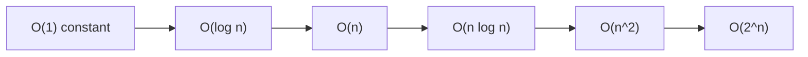
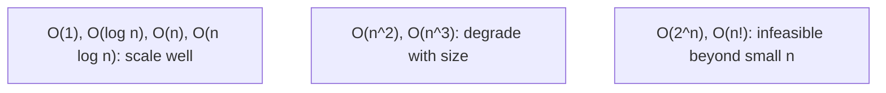
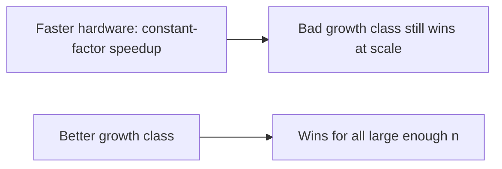
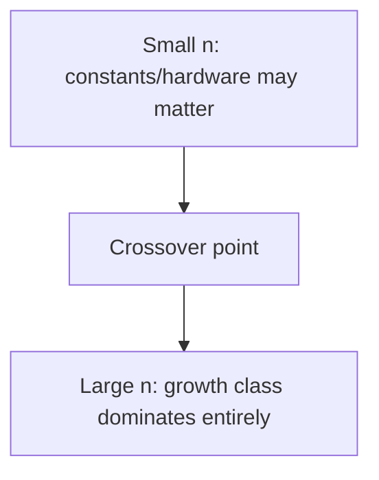
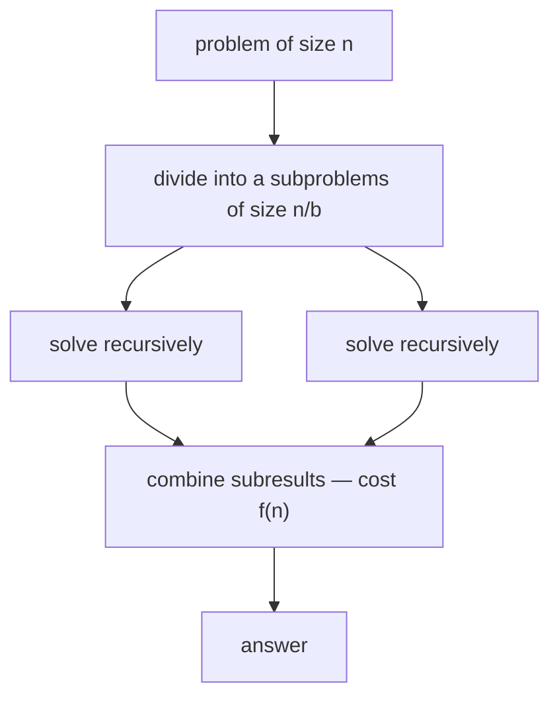
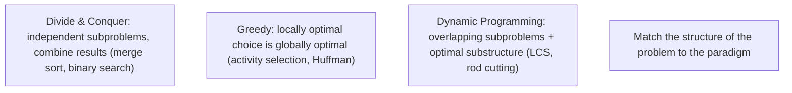
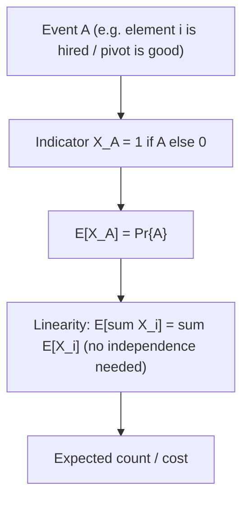
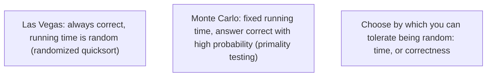
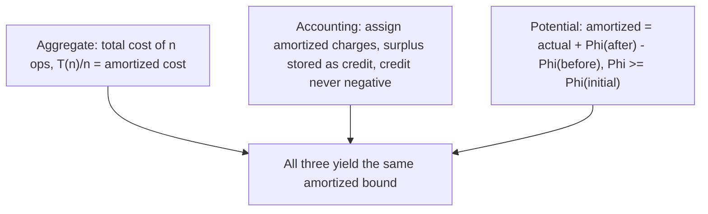
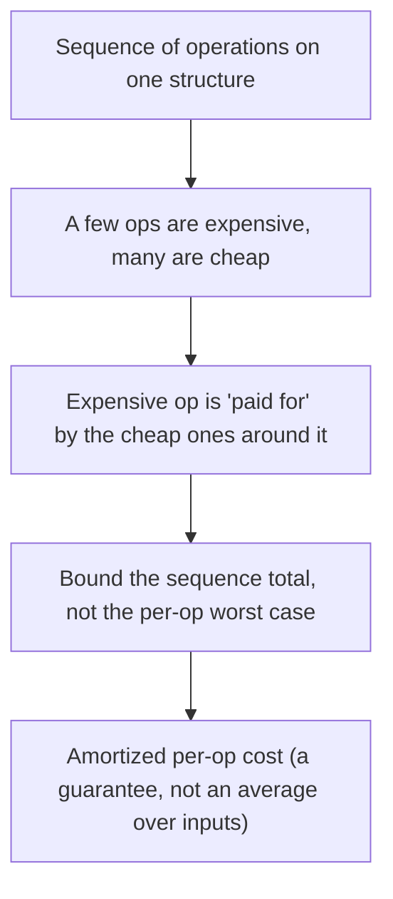

# Algorithm Design and Analysis - Complete Professional Guide

> **Category:** 02_algorithms_and_data_structures · **Language:** English

---

### Asymptotic analysis, design paradigms, sorting, data structures, and graphs
**Original guide written from first principles, current to 2026**

> **Original reference book (English).** This is an **independent, originally written** guide. It is not an extract, summary, or paraphrase of any third-party book; it teaches algorithm design and analysis from first principles with original examples. Canonical books are listed under **References** as pointers only. Each chapter follows the TO-BRAIN editorial standard (see `FILE_CONVENTIONS.md`).
>
> **Scope notice:** algorithms are step-by-step procedures, and analysis tells us how their cost grows with input size. This guide covers the full professional curriculum, current to 2026: asymptotic (Big-O) analysis, probabilistic and amortized analysis, the core design paradigms (divide and conquer, dynamic programming, greedy), sorting and order statistics, fundamental and advanced data structures, graph algorithms, and a survey of selected advanced topics.

---

## How to read this guide

| Level | Profile | Parts |
|-------|---------|-------|
| 1 — Beginner | New to analysis | Part I |
| 2 — Intermediate | Designing algorithms | Parts II–IV |
| 3 — Advanced | Sorting, data structures, graphs | Parts V–VIII |

**Target audience:** developers and CS students who want to reason about algorithm efficiency and design.

**Structure of each chapter:** Introduction · Business context · Theoretical concepts · Architecture · Diagrams (Mermaid) · Real examples · Step by step · Complete examples · Exercises · Challenges · Checklist · Best practices · Anti-patterns · Troubleshooting · References.

> **Note on prerequisites.** Assumes basic programming and some discrete math comfort.

---

## Table of Contents

**Part I – Analysis**
1. Asymptotic analysis: Big-O
2. Why growth rate dominates

**Part II – Design**
3. Divide and conquer (and other techniques)

**Part III – Probabilistic and amortized analysis**
4. Randomized algorithms and probabilistic analysis
5. Amortized analysis

> **Status of this guide:** complete for its declared scope. **Ready:** Parts I–III (Ch. 1–5).

---

## Part I – Analysis

Two algorithms can solve the same problem with vastly different efficiency, and the difference often only shows at scale. **Asymptotic analysis** lets us compare algorithms by how their cost **grows** with input size, independent of hardware or constants — so we can predict which will scale and which will collapse. This is the foundation of all algorithm work.

---

## Chapter 1 — Asymptotic analysis: Big-O

### 1.1 Introduction

**Big-O notation** describes an algorithm's cost as a function of input size **n**, capturing the **growth rate** as n gets large and ignoring constants and lower-order terms. `O(n)` means cost grows linearly; `O(n²)` quadratically; `O(log n)` logarithmically. Big-O lets us compare algorithms abstractly — which scales — without measuring on a specific machine.

### 1.2 Business context

Performance problems often hide until data grows: an `O(n²)` algorithm is fine on 100 items and catastrophic on 100,000. Big-O analysis predicts this *before* it happens, so you choose algorithms that scale and avoid the production incidents caused by quadratic (or worse) code on large inputs. For a business, reasoning about complexity is cheap insurance against systems that work in testing and fall over with real-world data volumes.

### 1.3 Theoretical concepts: growth, not constants



Big-O captures the **dominant term** as n→∞. `3n + 5` is `O(n)` (constants and the `+5` drop out). What matters is the **class**: `O(log n)` and `O(n log n)` scale well; `O(n²)` degrades fast; `O(2^n)` is infeasible beyond tiny inputs. Two algorithms in the same class are "similar"; a class difference dominates any constant-factor tuning at scale.

### 1.4 Architecture: classes ranked by scalability



### 1.5 Real example

**Scenario.** Check whether a list has any duplicate values.

**Problem.** The obvious nested-loop approach compares every pair — `O(n²)` — fine for small lists, ruinous for large ones.

**Solution.** Use a hash set: one pass, `O(n)`.

**Implementation.**

```text
# O(n^2): compare every pair (slow on large n)
for i in 0..n: for j in i+1..n: if a[i] == a[j] -> duplicate

# O(n): track seen values in a set, one pass
seen = set()
for x in a:
    if x in seen: -> duplicate        # O(1) membership
    seen.add(x)
```

**Result.** At n = 100,000 the `O(n²)` version does ~5 billion comparisons; the `O(n)` version does ~100,000 set operations — milliseconds vs minutes. The class difference, not tuning, is what makes it scale.

**Future improvements.** Recognize the pattern: replacing nested-loop scans with hash-based lookups turns many `O(n²)` algorithms into `O(n)`.

### 1.6 Exercises

1. What does Big-O describe, and what does it ignore?
2. Rank `O(n²)`, `O(log n)`, `O(n log n)`, `O(1)` by scalability.
3. Why does `3n + 5` simplify to `O(n)`?

### 1.7 Challenges

- **Challenge.** Find an `O(n²)` loop in code you know. Can a hash set/map make it `O(n)`? Estimate the difference at n = 1,000,000.

### 1.8 Checklist

- [ ] I express algorithm cost as Big-O in n.
- [ ] I focus on growth class, not constants.
- [ ] I avoid `O(n²)`+ on large inputs where possible.
- [ ] I predict scaling before deploying.

### 1.9 Best practices

- Analyze complexity before choosing an algorithm.
- Prefer lower growth classes for large inputs.
- Replace nested scans with hash lookups where possible.

### 1.10 Anti-patterns

- Nested loops over large data (`O(n²)`) when avoidable.
- Micro-optimizing constants while ignoring the growth class.
- Assuming small-data speed predicts large-data behavior.

### 1.11 Troubleshooting

| Symptom | Likely cause | Action |
|---------|--------------|--------|
| Fast in test, slow in prod | Higher complexity class on big data | Analyze Big-O; reduce the class |
| Tuning doesn't help at scale | Wrong growth class | Change the algorithm, not constants |
| Quadratic blowup | Nested scans | Use hashing/sorting to lower the class |

### 1.12 References

- T. Cormen, C. Leiserson, R. Rivest, C. Stein, *Introduction to Algorithms*, 4th ed. (MIT Press, 2022), ch. 3 "Characterizing Running Times" (§3.1 asymptotic notation) — ISBN 978-0262046305.
- J. Kleinberg, É. Tardos, *Algorithm Design* (Pearson, 2005), ch. 2 (basics of algorithm analysis) — ISBN 978-0321295354.

---

## Chapter 2 — Why growth rate dominates

### 2.1 Introduction

A faster computer doesn't save a bad algorithm: hardware gives a constant-factor speedup, but a worse **growth class** overtakes any constant as n grows. This chapter drives home why the **asymptotic** class is what matters for scalability, and why choosing the right algorithm beats faster hardware or micro-optimization for large inputs.

### 2.2 Business context

Teams sometimes try to fix slow systems by buying bigger machines — which helps a bad algorithm only by a constant factor, soon outrun by data growth. Recognizing that algorithmic complexity dominates redirects effort to the real fix (a better algorithm), which can turn an intractable problem into an easy one. This is often the single highest-leverage performance change available, far exceeding hardware upgrades.

### 2.3 Theoretical concepts: class beats constant



For large enough n, an `O(n log n)` algorithm beats an `O(n²)` one **regardless** of constants or machine speed — the curves cross and never re-cross. So the asymptotic class is the dominant lever: doubling hardware halves time once; switching from `O(n²)` to `O(n log n)` changes the *shape* of the curve forever.

### 2.4 Architecture: curves cross, then diverge



### 2.5 Real example

**Scenario.** A nightly job sorts and processes growing data; it's getting slow.

**Problem.** The team considers a bigger server. But the sort is a hand-rolled `O(n²)` selection sort.

**Solution.** Switch to an `O(n log n)` sort — a far bigger win than any hardware upgrade.

**Implementation (class change vs hardware).**

```text
Data: n = 1,000,000
O(n^2) selection sort:   ~10^12 operations  (hours; faster CPU -> still hours)
O(n log n) merge/quick:  ~2x10^7 operations (seconds)
=> changing the algorithm class beats any realistic hardware upgrade
```

**Result.** The `O(n log n)` sort runs in seconds where the `O(n²)` one took hours; a hardware upgrade would have shaved a constant factor off "hours." The growth class was the real problem and the real fix.

**Future improvements.** Use well-tested library sorts (already `O(n log n)`); reserve custom algorithms for cases the standard library can't handle.

### 2.6 Exercises

1. Why can't faster hardware fix a bad growth class?
2. What happens at the "crossover point"?
3. When do constants/hardware actually matter?

### 2.7 Challenges

- **Challenge.** For a slow process, identify its complexity class. Is the bottleneck the algorithm (class) or constants? Propose a class-lowering change.

### 2.8 Checklist

- [ ] I prioritize growth class over constants for scale.
- [ ] I fix slow algorithms before buying hardware.
- [ ] I use library algorithms with good complexity.
- [ ] I know where the crossover makes class decisive.

### 2.9 Best practices

- Choose the algorithm class first; tune constants later.
- Prefer proven library implementations.
- Reserve micro-optimization for hot, correct-class code.

### 2.10 Anti-patterns

- Throwing hardware at an algorithmic problem.
- Hand-rolling `O(n²)` where `O(n log n)` exists.
- Optimizing constants in a bad-class algorithm.

### 2.11 Troubleshooting

| Symptom | Likely cause | Action |
|---------|--------------|--------|
| "Bigger server didn't help" | Bad growth class | Improve the algorithm's class |
| Slowness scales with data | High complexity class | Replace with a lower-class algorithm |
| Custom algorithm slow | Reinvented a worse sort/search | Use the standard library |

### 2.12 References

- T. Cormen et al., *Introduction to Algorithms*, 4th ed. (MIT Press, 2022), §1.2 "Algorithms as a technology" (insertion sort vs. merge sort at scale) — ISBN 978-0262046305.
- S. Skiena, *The Algorithm Design Manual*, 3rd ed. (Springer, 2020) — ISBN 978-3030542559.

---

> **End of Part I.** You can now analyze algorithms by **asymptotic growth** (Big-O), comparing them by how cost scales with input size while ignoring constants, and you understand why the **growth class dominates** — a better class beats any constant-factor hardware speedup for large enough inputs, making algorithm choice the highest-leverage performance decision. **Part II — Design** (Chapter 3) covers core design techniques, especially **divide and conquer** (break a problem into smaller subproblems, solve recursively, combine — as in merge sort and binary search) and a survey of greedy and dynamic-programming approaches.

---

## Part II – Design

Analysis (Part I) tells you how an algorithm scales; **design** is about producing one with a good growth class in the first place. Most efficient algorithms come from a handful of reusable **paradigms**. This part covers the most important one, **divide and conquer**, and surveys two others — **greedy** and **dynamic programming** — so you can recognize which fits a problem.

---

## Chapter 3 — Divide and conquer (and other techniques)

### 3.1 Introduction

**Divide and conquer** solves a problem in three steps: **divide** it into smaller subproblems of the same kind, **conquer** each by solving it recursively (a small enough subproblem is solved directly), and **combine** the subresults into the answer. Merge sort and binary search are the classic examples. Two other paradigms round out the toolkit: **greedy** algorithms, which build a solution from locally optimal choices, and **dynamic programming**, which solves overlapping subproblems once and reuses the results. Recognizing the paradigm is most of the design work.

### 3.2 Business context

The difference between a feature that ships and one that times out is often the design paradigm. Divide and conquer is what makes sorting `O(n log n)` instead of `O(n²)` and search `O(log n)` instead of `O(n)` — the gap that decides whether a job finishes in seconds or hours (Part I). Dynamic programming turns exponential brute force into polynomial time for problems like scheduling, diffing, and routing; greedy algorithms give fast, optimal answers when a problem has the right structure. Knowing these paradigms lets a team reach for a proven `O(n log n)` shape instead of inventing a slow one.

### 3.3 Theoretical concepts: divide, conquer, combine



A divide-and-conquer algorithm's cost is a **recurrence**: `T(n) = a·T(n/b) + f(n)`, where `a` is the number of subproblems, `n/b` their size, and `f(n)` the divide-plus-combine cost. The **master method** (CLRS §4.5) reads the growth class straight off `a`, `b`, and `f(n)`. Merge sort splits into 2 halves and merges in linear time — `T(n) = 2T(n/2) + O(n)` — which the master method resolves to **`O(n log n)`**. Binary search makes one recursive call on half the input — `T(n) = T(n/2) + O(1)` — giving **`O(log n)`**.

### 3.4 Architecture: choosing a paradigm



Use **divide and conquer** when subproblems are independent. Use **greedy** when a locally optimal choice provably leads to a global optimum (it needs the *greedy-choice property* and *optimal substructure*). Use **dynamic programming** when subproblems **overlap** and the problem has *optimal substructure* — solve each subproblem once and store it (memoization or tabulation) instead of recomputing exponentially.

### 3.5 Real example

**Scenario.** Sort a large list efficiently and predictably.

**Problem.** A nested-comparison sort is `O(n²)` and collapses at scale (Part I).

**Solution.** **Merge sort** — divide the list in half, sort each half recursively, then merge the two sorted halves.

**Implementation.**

```text
merge_sort(a):
    if len(a) <= 1: return a                  # base case (conquer directly)
    mid = len(a) // 2
    left  = merge_sort(a[:mid])               # divide + recurse
    right = merge_sort(a[mid:])
    return merge(left, right)                 # combine: O(n) merge of sorted halves

# Recurrence: T(n) = 2T(n/2) + O(n)  ->  master method  ->  O(n log n)
```

**Result.** Merge sort runs in `O(n log n)` for every input — no quadratic worst case — so it stays fast as data grows. The recurrence makes the cost predictable: two half-size subproblems plus a linear merge is the textbook `O(n log n)` shape.

**Future improvements.** Prefer the standard library's sort (already `O(n log n)`, tuned); reach for a hand-written divide-and-conquer only when the problem isn't a plain sort (e.g., counting inversions, closest pair of points).

### 3.6 Exercises

1. What are the three steps of divide and conquer, and what is the base case for?
2. Write the recurrence for merge sort and state the class the master method gives.
3. When do you prefer dynamic programming over plain divide and conquer?

### 3.7 Challenges

- **Challenge.** Implement binary search and write its recurrence. Then take a problem with overlapping subproblems (e.g., Fibonacci or longest common subsequence) and make it polynomial with memoization; compare against the naive exponential recursion.

### 3.8 Checklist

- [ ] I identify whether subproblems are independent (D&C) or overlapping (DP).
- [ ] I write the recurrence and use the master method to get the class.
- [ ] I use greedy only when the greedy-choice property and optimal substructure hold.
- [ ] I memoize/tabulate overlapping subproblems instead of recomputing them.

### 3.9 Best practices

- Match the paradigm to the problem's structure before coding.
- Derive the recurrence and confirm the growth class up front.
- Lean on proven library implementations for standard cases (sorting, searching).

### 3.10 Anti-patterns

- Naive recursion over **overlapping** subproblems (exponential blowup — needs DP).
- Applying greedy where the greedy-choice property doesn't hold (wrong answer).
- Re-implementing merge/quick sort by hand instead of using the standard library.

### 3.11 Troubleshooting

| Symptom | Likely cause | Action |
|---------|--------------|--------|
| Exponential recursive blowup | Overlapping subproblems recomputed | Memoize or tabulate (dynamic programming) |
| Greedy gives a wrong answer | No greedy-choice property | Switch to dynamic programming or D&C |
| Recursion never terminates | Missing/incorrect base case | Add the base case that solves the smallest subproblem |

### 3.12 References

- T. Cormen, C. Leiserson, R. Rivest, C. Stein, *Introduction to Algorithms*, 4th ed. (MIT Press, 2022), ch. 4 "Divide-and-Conquer" (§4.5 the master method) & §2.3 (merge sort); ch. 14 "Dynamic Programming"; ch. 15 "Greedy Algorithms" — ISBN 978-0262046305.
- J. Kleinberg, É. Tardos, *Algorithm Design* (Pearson, 2005), ch. 5–6 (divide & conquer, dynamic programming) — ISBN 978-0321295354.

---

> **End of Part II.** Efficient algorithms come from recognizing a **paradigm**: **divide and conquer** splits a problem into independent subproblems, solves them recursively, and combines them (merge sort, binary search), with cost read from a **recurrence** via the **master method**; **greedy** builds from locally optimal choices when the structure allows; **dynamic programming** solves overlapping subproblems once. With Part I's **asymptotic analysis**, you can now both **measure** an algorithm's scaling and **design** one with the growth class you need.

---

## Part III – Probabilistic and amortized analysis

Worst-case analysis (Parts I–II) is sometimes too pessimistic or simply the wrong question. Two refinements complete the analyst's toolkit. **Probabilistic analysis** reasons about the *expected* cost over a distribution of inputs, and **randomized algorithms** make their own random choices so that no single input is reliably bad. **Amortized analysis** measures the *average* cost of an operation across a worst-case *sequence* — the right lens when an occasional expensive operation pays for many cheap ones. Together they explain why algorithms that look risky on paper (quicksort, dynamic arrays, hash tables) are fast and dependable in practice.

---

## Chapter 4 — Randomized algorithms and probabilistic analysis

### 4.1 Introduction

**Probabilistic analysis** computes the *expected* running time of an algorithm by averaging its cost over an assumed distribution of inputs. **Randomized algorithms** go one step further: the algorithm itself makes random choices (a coin flip, a random pivot, a random permutation), so its behavior depends on the random bits, **not** on which input an adversary hands it. The key tool is the **indicator random variable** — a 0/1 variable for "did event A happen?" — whose expectation equals the probability of A, letting us turn a hard counting problem into a sum of simple probabilities via linearity of expectation. The payoff is robustness: a randomized algorithm has **no** worst-case input, only worst-case luck, which a good design makes astronomically unlikely.

### 4.2 Business context

Expected-case guarantees are what make many production algorithms trustworthy. Quicksort is the default sort in countless standard libraries because *randomizing the pivot* gives expected `O(n log n)` on **every** input — including the already-sorted and adversarial inputs that wreck a fixed-pivot quicksort. Hash tables give expected `O(1)` lookups only because a good (often randomized) hash function spreads keys evenly, defeating the worst-case collisions that would otherwise let a malicious user trigger `O(n)` operations (a real denial-of-service vector — "hash flooding"). Randomization also buys **simplicity**: a randomized algorithm is frequently shorter and faster than the deterministic one with the same guarantee. For a business, "expected `O(n log n)` with negligible variance" is a stronger, cheaper guarantee than a fragile worst case that an attacker or an unlucky data shape can break.

### 4.3 Theoretical concepts: expectation via indicator variables



An **indicator random variable** `I{A}` is `1` when event `A` occurs and `0` otherwise; its expectation is exactly `Pr{A}`. The decisive trick is **linearity of expectation**: `E[X₁ + … + Xₙ] = E[X₁] + … + E[Xₙ]` holds **whether or not** the variables are independent. So to find an expected count, define one indicator per "thing that might happen," compute each one's probability, and sum. CLRS develops this on the **hiring problem** (how many times do you replace your best candidate while interviewing in random order? — the answer is the harmonic number, `O(log n)`) and uses the same machinery to prove **randomized quicksort** runs in expected `O(n log n)` by counting the expected number of element comparisons.

### 4.4 Architecture: two kinds of guarantee



Randomized algorithms split into two families. A **Las Vegas** algorithm always returns the correct answer; only its *running time* is a random variable (randomized quicksort always sorts — it just occasionally takes longer). A **Monte Carlo** algorithm runs in a fixed time but is allowed a small, controllable probability of a wrong answer (Miller–Rabin primality testing). The engineering distinction is which property you let chance touch. Crucially, randomizing **inside** the algorithm (e.g. permuting the input before quicksort) converts an assumption about the *input distribution* into a property of the *algorithm* — you no longer have to trust that real inputs are random.

### 4.5 Real example

**Scenario.** A service sorts user-supplied batches. The team ships a textbook quicksort that always pivots on the last element.

**Problem.** Latency spikes in production. The cause: some clients send **already-sorted** or reverse-sorted batches, the exact worst case for last-element-pivot quicksort, which degrades to `O(n²)` — and an attacker who knows this can deliberately send sorted input to exhaust CPU.

**Solution.** **Randomize the pivot** (or randomly permute the array first). With a random pivot, the probability of repeatedly choosing bad pivots vanishes, and the expected running time is `O(n log n)` for *every* input — there is no longer a sorted-input worst case to trigger.

**Implementation.**

```text
randomized_partition(A, p, r):
    i = random integer in [p, r]      # random pivot — the only change
    swap A[i], A[r]
    return partition(A, p, r)         # standard Lomuto/Hoare partition

randomized_quicksort(A, p, r):
    if p < r:
        q = randomized_partition(A, p, r)
        randomized_quicksort(A, p, q-1)
        randomized_quicksort(A, q+1, r)

# Expected comparisons (indicator-variable analysis): sum over i<j of
# Pr{z_i and z_j are compared} = 2/(j-i+1)  ->  total  =  O(n log n)
```

**Result.** Worst-case-by-input disappears: latency becomes flat and predictable regardless of how clients order their data, and the sorted-input DoS vector is closed. The expected cost is `O(n log n)` with low variance; the rare slow run depends on internal coin flips no attacker controls.

**Future improvements.** Production sorts (e.g. introsort) combine a randomized/median-of-three quicksort with a **heapsort fallback** once recursion depth exceeds `O(log n)`, guaranteeing `O(n log n)` *worst case* while keeping quicksort's small constants — the deterministic safety net on top of the randomized common case.

### 4.6 Exercises

1. Define an indicator random variable and state why `E[I{A}] = Pr{A}`.
2. Why does linearity of expectation **not** require independence, and why does that matter?
3. Distinguish a Las Vegas from a Monte Carlo algorithm with one example of each.
4. Why does randomizing the pivot remove quicksort's worst-case *input* (rather than just making it rarer for a fixed distribution)?

### 4.7 Challenges

- **Challenge.** Implement randomized quicksort and, on the same machine, compare it with last-element-pivot quicksort on (a) random data and (b) already-sorted data of size 100,000. Reproduce the `O(n²)` blow-up on sorted input for the deterministic version and confirm the randomized version stays fast. Then use indicator variables to derive the `2/(j−i+1)` comparison probability yourself.

### 4.8 Checklist

- [ ] I know whether I need an *expected-case* or a *worst-case* guarantee.
- [ ] I randomize **inside** the algorithm rather than assuming inputs are random.
- [ ] I model expected counts with indicator variables and linearity of expectation.
- [ ] I know whether each randomized algorithm I use is Las Vegas or Monte Carlo.
- [ ] I use randomized/seeded hashing where adversarial collisions are a risk.

### 4.9 Best practices

- Prefer a randomized pivot (or an up-front random permutation) for quicksort-style algorithms.
- Use linearity of expectation to decompose a hard expected-cost analysis into simple per-event probabilities.
- For Monte Carlo algorithms, repeat independent trials to drive the error probability as low as required.
- Seed hash functions where untrusted input could otherwise force worst-case collisions.

### 4.10 Anti-patterns

- Fixed-pivot quicksort on possibly-sorted or attacker-controlled input.
- Assuming "inputs are random in practice" instead of randomizing inside the algorithm.
- Treating an expected-case bound as a worst-case guarantee (e.g. promising hard real-time latency from average-case hashing).
- Reusing a single fixed hash seed in a public service (hash-flooding exposure).

### 4.11 Troubleshooting

| Symptom | Likely cause | Action |
|---------|--------------|--------|
| Quicksort slow only on some inputs | Deterministic pivot hitting its worst case (sorted data) | Randomize the pivot or permute the input |
| Hash-table latency spikes under load | Adversarial key collisions on a fixed hash | Use a seeded/randomized hash function |
| Expected-case algorithm misses a latency SLO | Worst-case run cannot be ruled out | Add a deterministic fallback (e.g. introsort's heapsort) |
| "Random" algorithm gives wrong answers | Monte Carlo error probability too high | Increase independent repetitions to shrink the error |

### 4.12 References

- T. Cormen, C. Leiserson, R. Rivest, C. Stein, *Introduction to Algorithms*, 4th ed. (MIT Press, 2022), ch. 5 "Probabilistic Analysis and Randomized Algorithms" (§5.1 the hiring problem, §5.2 indicator random variables, §5.3 randomized algorithms); §7.3 "A randomized version of quicksort" & §7.4 — ISBN 978-0262046305.
- R. Motwani, P. Raghavan, *Randomized Algorithms* (Cambridge University Press, 1995) — ISBN 978-0521474658.

---

## Chapter 5 — Amortized analysis

### 5.1 Introduction

**Amortized analysis** measures the average cost of an operation over a worst-case *sequence* of operations, with **no probability involved** — it is a guarantee, not an expectation. The point is that some operations are occasionally expensive but, because they make later operations cheap (or were paid for by earlier cheap ones), the *average per operation across the whole sequence* is small. CLRS presents three techniques: **aggregate analysis** (bound the total cost of `n` operations, then divide by `n`), the **accounting method** (overcharge cheap operations and store the surplus as "credit" to pay for expensive ones), and the **potential method** (define a potential function on the data structure's state so that each operation's amortized cost = actual cost + change in potential). All three give the same bound; they differ in which is easiest to apply.

### 5.2 Business context

Amortized bounds are why everyday data structures are fast *and* safe to reason about. A **dynamic array** (Java `ArrayList`, C++ `std::vector`, Python `list`, Go slice) gives **`O(1)` amortized** `append` even though an occasional append triggers an `O(n)` reallocation-and-copy — because doubling the capacity means those expensive copies are rare enough to average out to a constant. Without this analysis a team might wrongly fear that "append is sometimes `O(n)`" makes a loop of `n` appends `O(n²)`; amortized analysis proves it is `O(n)` total. The same reasoning underlies hash-table resizing, the union-find structure's near-constant operations, and the `O(1)`-amortized increment of a binary counter. Knowing the *amortized* cost — not the per-operation worst case — is what lets you correctly budget the cost of a *workload*.

### 5.3 Theoretical concepts: three methods, one bound



The **potential method** generalizes the other two and is usually the most powerful. Define a potential `Φ` mapping each state of the data structure to a real number, with `Φ(D₀) = 0` and `Φ(Dᵢ) ≥ 0` always. The **amortized cost** of operation `i` is `ĉᵢ = cᵢ + Φ(Dᵢ) − Φ(Dᵢ₋₁)`. Summing telescopes: `Σĉᵢ = Σcᵢ + Φ(Dₙ) − Φ(D₀) ≥ Σcᵢ`, so the total amortized cost **upper-bounds** the total actual cost. The art is choosing `Φ` so that cheap operations *raise* potential (banking work) and expensive operations *release* it (spending the bank), making every amortized cost small. The **accounting method** is the same idea told concretely: charge each cheap operation a little extra, store the surplus as credit on specific objects, and require credit to stay non-negative.

### 5.4 Architecture: when to reach for amortized analysis



Use amortized analysis whenever a structure's cost is **uneven across a sequence** but the expensive steps are structurally tied to the cheap ones — table doubling, lazy rebalancing, the binary-counter increment, union-find. Do **not** confuse it with average-case (probabilistic) analysis: amortized cost holds for the *worst-case sequence* and involves no randomness. And remember its limit: an `O(1)` *amortized* bound does **not** promise any *single* operation is `O(1)` — a particular `append` can still stall for `O(n)` while it copies, which matters for hard real-time or tail-latency-sensitive systems.

### 5.5 Real example

**Scenario.** A buffer accumulates an unknown number of incoming records; the team uses a growable array and appends one record at a time.

**Problem.** Each append is `O(1)` *until* the array is full, when it must allocate a bigger block and copy everything — an `O(n)` step. A reviewer worries that `n` appends could therefore cost `O(n²)`.

**Solution.** Grow by **doubling** the capacity on each resize. Then resizes happen at sizes `1, 2, 4, …, n`, and the total copying work across all of them is `1 + 2 + 4 + … + n < 2n = O(n)`. Spread over `n` appends, that is **`O(1)` amortized** per append.

**Implementation.**

```text
append(arr, x):
    if arr.count == arr.capacity:
        new_capacity = max(1, 2 * arr.capacity)   # DOUBLING is the key
        allocate block of new_capacity
        copy arr.count elements into it            # this single step is O(n)
        arr.capacity = new_capacity
    arr.data[arr.count] = x
    arr.count += 1

# Potential method: let Phi = 2*count - capacity  (>= 0 just after a resize).
# Non-resizing append: actual 1, Phi rises by 2  -> amortized 3 = O(1).
# Resizing append (count == capacity): actual count+1, but Phi DROPS by ~count
#   -> amortized still O(1). Total over n appends: O(n).
```

**Result.** `n` appends cost `O(n)` total, not `O(n²)`; the worry is unfounded *because of the doubling*. The potential `Φ = 2·count − capacity` banks two credits per cheap append and releases them all to fund the copy — every amortized cost is constant.

**Future improvements.** Growth factor is a real tradeoff: doubling wastes up to ~50% memory but minimizes copies; a smaller factor (e.g. 1.5×, as some `std::vector` and `ArrayList` implementations use) trims wasted memory at the cost of more frequent resizes. For predictable workloads, **reserve** the final capacity up front to avoid resizes entirely — turning amortized `O(1)` into guaranteed `O(1)` per append.

### 5.6 Exercises

1. State the difference between amortized analysis and average-case (probabilistic) analysis.
2. Name the three amortized-analysis methods and the core idea of each.
3. Write `Φ = 2·count − capacity` for the doubling array and show a non-resizing append has amortized cost `3`.
4. Why does growing a dynamic array by a *constant amount* (e.g. +1 each time) make `n` appends `O(n²)` instead of `O(n)`?

### 5.7 Challenges

- **Challenge.** Implement a dynamic array with a configurable growth factor. Empirically count total element-copies over 1,000,000 appends for factors 2×, 1.5×, and "+1 (constant)". Confirm the constant-increment version is `O(n²)` while the multiplicative ones are `O(n)`, and relate the measured copy counts to the potential-method bound.

### 5.8 Checklist

- [ ] I bound the cost of a *sequence*, not just a single worst-case operation, when costs are uneven.
- [ ] I distinguish amortized (worst-case sequence, no randomness) from average-case (over an input distribution).
- [ ] I grow dynamic structures **multiplicatively** (doubling / 1.5×), never by a constant.
- [ ] I remember amortized `O(1)` still allows an individual `O(n)` spike (relevant for tail latency).
- [ ] I reserve capacity up front when the final size is known.

### 5.9 Best practices

- Reach for the **potential method** first for a clean, reusable proof; fall back to aggregate/accounting when potential is hard to define.
- Choose a growth factor deliberately, trading wasted memory against resize frequency.
- Pre-size containers (`reserve`/`ensureCapacity`) in hot paths with known sizes.
- Document amortized vs. worst-case bounds in latency-sensitive APIs so callers know a rare spike is possible.

### 5.10 Anti-patterns

- Growing a buffer by a fixed increment in a loop (`O(n²)` total).
- Quoting an amortized `O(1)` bound where a hard real-time path needs per-operation `O(1)`.
- Confusing amortized with average-case and assuming a "bad input" can break the bound.
- Repeatedly resizing in a tight loop instead of reserving capacity once.

### 5.11 Troubleshooting

| Symptom | Likely cause | Action |
|---------|--------------|--------|
| Loop of appends is unexpectedly `O(n²)` | Constant-increment growth instead of doubling | Grow multiplicatively, or reserve capacity up front |
| Occasional latency spike on insert | Amortized `O(1)` includes a rare `O(n)` resize copy | Pre-size the structure, or use a structure with worst-case bounds |
| Memory usage ~2× the data | Doubling growth leaves up to half the array unused | Use a smaller growth factor or shrink-to-fit after fill |
| "Average" analysis disputed for adversarial input | Conflating amortized with average-case | Re-derive with the potential method (holds for any sequence) |

### 5.12 References

- T. Cormen, C. Leiserson, R. Rivest, C. Stein, *Introduction to Algorithms*, 4th ed. (MIT Press, 2022), ch. 16 "Amortized Analysis" (§16.1 aggregate analysis, §16.2 the accounting method, §16.3 the potential method, §16.4 dynamic tables) — ISBN 978-0262046305.
- R. Sedgewick, K. Wayne, *Algorithms*, 4th ed. (Addison-Wesley, 2011), §1.4 (amortized analysis of resizing arrays) — ISBN 978-0321573513.

---

> **End of Part III.** Two refinements complete the analyst's toolkit beyond worst-case Big-O. **Probabilistic analysis** and **randomized algorithms** reason about *expected* cost and make the algorithm's own coin flips — not the input — the source of randomness, so quicksort and hashing have no worst-case *input* to exploit; the **indicator random variable** plus **linearity of expectation** is the engine of these proofs. **Amortized analysis** bounds the *average cost over a worst-case sequence* (no probability) via **aggregate**, **accounting**, or **potential** methods, explaining why doubling dynamic arrays give `O(1)`-amortized append. **Part IV — Sorting and order statistics** applies all of this to the most-studied problem in the field.
