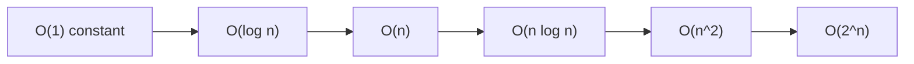
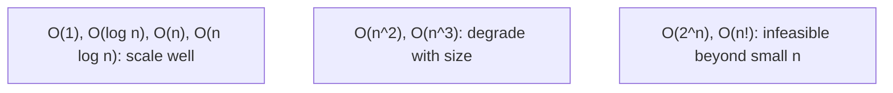
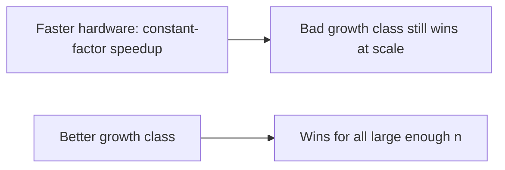
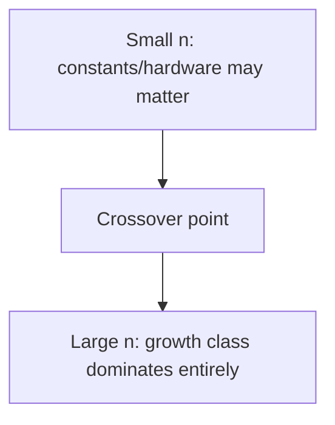

# Algorithm Design and Analysis - Complete Professional Guide

> **Category:** 02_algorithms_and_data_structures · **Language:** English

---

### Asymptotic analysis, divide and conquer, and core techniques
**Original guide written from first principles, current to 2026**

> **Original reference book (English).** This is an **independent, originally written** guide. It is not an extract, summary, or paraphrase of any third-party book; it teaches algorithm design and analysis from first principles with original examples. Canonical books are listed under **References** as pointers only. Each chapter follows the TO-BRAIN editorial standard (see `FILE_CONVENTIONS.md`).
>
> **Scope notice:** algorithms are step-by-step procedures, and analysis tells us how their cost grows with input size. This guide covers asymptotic (Big-O) analysis and core design techniques (divide and conquer), current to 2026.

---

## How to read this guide

| Level | Profile | Parts |
|-------|---------|-------|
| 1 — Beginner | New to analysis | Part I |
| 2 — Intermediate | Designing algorithms | Part II |

**Target audience:** developers and CS students who want to reason about algorithm efficiency and design.

**Structure of each chapter:** Introduction · Business context · Theoretical concepts · Architecture · Diagrams (Mermaid) · Real examples · Step by step · Complete examples · Exercises · Challenges · Checklist · Best practices · Anti-patterns · Troubleshooting · References.

> **Note on prerequisites.** Assumes basic programming and some discrete math comfort.

---

## Table of Contents

**Part I – Analysis**
1. Asymptotic analysis: Big-O
2. Why growth rate dominates

**Part II – Design**
3. Divide and conquer (and other techniques)

> **Status of this guide:** phased delivery. **Ready:** Part I (Ch. 1–2). **In progress:** Part II.

---

## Part I – Analysis

Two algorithms can solve the same problem with vastly different efficiency, and the difference often only shows at scale. **Asymptotic analysis** lets us compare algorithms by how their cost **grows** with input size, independent of hardware or constants — so we can predict which will scale and which will collapse. This is the foundation of all algorithm work.

---

## Chapter 1 — Asymptotic analysis: Big-O

### 1.1 Introduction

**Big-O notation** describes an algorithm's cost as a function of input size **n**, capturing the **growth rate** as n gets large and ignoring constants and lower-order terms. `O(n)` means cost grows linearly; `O(n²)` quadratically; `O(log n)` logarithmically. Big-O lets us compare algorithms abstractly — which scales — without measuring on a specific machine.

### 1.2 Business context

Performance problems often hide until data grows: an `O(n²)` algorithm is fine on 100 items and catastrophic on 100,000. Big-O analysis predicts this *before* it happens, so you choose algorithms that scale and avoid the production incidents caused by quadratic (or worse) code on large inputs. For a business, reasoning about complexity is cheap insurance against systems that work in testing and fall over with real-world data volumes.

### 1.3 Theoretical concepts: growth, not constants



Big-O captures the **dominant term** as n→∞. `3n + 5` is `O(n)` (constants and the `+5` drop out). What matters is the **class**: `O(log n)` and `O(n log n)` scale well; `O(n²)` degrades fast; `O(2^n)` is infeasible beyond tiny inputs. Two algorithms in the same class are "similar"; a class difference dominates any constant-factor tuning at scale.

### 1.4 Architecture: classes ranked by scalability



### 1.5 Real example

**Scenario.** Check whether a list has any duplicate values.

**Problem.** The obvious nested-loop approach compares every pair — `O(n²)` — fine for small lists, ruinous for large ones.

**Solution.** Use a hash set: one pass, `O(n)`.

**Implementation.**

```text
# O(n^2): compare every pair (slow on large n)
for i in 0..n: for j in i+1..n: if a[i] == a[j] -> duplicate

# O(n): track seen values in a set, one pass
seen = set()
for x in a:
    if x in seen: -> duplicate        # O(1) membership
    seen.add(x)
```

**Result.** At n = 100,000 the `O(n²)` version does ~5 billion comparisons; the `O(n)` version does ~100,000 set operations — milliseconds vs minutes. The class difference, not tuning, is what makes it scale.

**Future improvements.** Recognize the pattern: replacing nested-loop scans with hash-based lookups turns many `O(n²)` algorithms into `O(n)`.

### 1.6 Exercises

1. What does Big-O describe, and what does it ignore?
2. Rank `O(n²)`, `O(log n)`, `O(n log n)`, `O(1)` by scalability.
3. Why does `3n + 5` simplify to `O(n)`?

### 1.7 Challenges

- **Challenge.** Find an `O(n²)` loop in code you know. Can a hash set/map make it `O(n)`? Estimate the difference at n = 1,000,000.

### 1.8 Checklist

- [ ] I express algorithm cost as Big-O in n.
- [ ] I focus on growth class, not constants.
- [ ] I avoid `O(n²)`+ on large inputs where possible.
- [ ] I predict scaling before deploying.

### 1.9 Best practices

- Analyze complexity before choosing an algorithm.
- Prefer lower growth classes for large inputs.
- Replace nested scans with hash lookups where possible.

### 1.10 Anti-patterns

- Nested loops over large data (`O(n²)`) when avoidable.
- Micro-optimizing constants while ignoring the growth class.
- Assuming small-data speed predicts large-data behavior.

### 1.11 Troubleshooting

| Symptom | Likely cause | Action |
|---------|--------------|--------|
| Fast in test, slow in prod | Higher complexity class on big data | Analyze Big-O; reduce the class |
| Tuning doesn't help at scale | Wrong growth class | Change the algorithm, not constants |
| Quadratic blowup | Nested scans | Use hashing/sorting to lower the class |

### 1.12 References

- T. Cormen, C. Leiserson, R. Rivest, C. Stein, *Introduction to Algorithms*, 4th ed. (MIT Press, 2022) — ISBN 978-0262046305.
- J. Kleinberg, É. Tardos, *Algorithm Design* (Pearson, 2005) — ISBN 978-0321295354.

---

## Chapter 2 — Why growth rate dominates

### 2.1 Introduction

A faster computer doesn't save a bad algorithm: hardware gives a constant-factor speedup, but a worse **growth class** overtakes any constant as n grows. This chapter drives home why the **asymptotic** class is what matters for scalability, and why choosing the right algorithm beats faster hardware or micro-optimization for large inputs.

### 2.2 Business context

Teams sometimes try to fix slow systems by buying bigger machines — which helps a bad algorithm only by a constant factor, soon outrun by data growth. Recognizing that algorithmic complexity dominates redirects effort to the real fix (a better algorithm), which can turn an intractable problem into an easy one. This is often the single highest-leverage performance change available, far exceeding hardware upgrades.

### 2.3 Theoretical concepts: class beats constant



For large enough n, an `O(n log n)` algorithm beats an `O(n²)` one **regardless** of constants or machine speed — the curves cross and never re-cross. So the asymptotic class is the dominant lever: doubling hardware halves time once; switching from `O(n²)` to `O(n log n)` changes the *shape* of the curve forever.

### 2.4 Architecture: curves cross, then diverge



### 2.5 Real example

**Scenario.** A nightly job sorts and processes growing data; it's getting slow.

**Problem.** The team considers a bigger server. But the sort is a hand-rolled `O(n²)` selection sort.

**Solution.** Switch to an `O(n log n)` sort — a far bigger win than any hardware upgrade.

**Implementation (class change vs hardware).**

```text
Data: n = 1,000,000
O(n^2) selection sort:   ~10^12 operations  (hours; faster CPU -> still hours)
O(n log n) merge/quick:  ~2x10^7 operations (seconds)
=> changing the algorithm class beats any realistic hardware upgrade
```

**Result.** The `O(n log n)` sort runs in seconds where the `O(n²)` one took hours; a hardware upgrade would have shaved a constant factor off "hours." The growth class was the real problem and the real fix.

**Future improvements.** Use well-tested library sorts (already `O(n log n)`); reserve custom algorithms for cases the standard library can't handle.

### 2.6 Exercises

1. Why can't faster hardware fix a bad growth class?
2. What happens at the "crossover point"?
3. When do constants/hardware actually matter?

### 2.7 Challenges

- **Challenge.** For a slow process, identify its complexity class. Is the bottleneck the algorithm (class) or constants? Propose a class-lowering change.

### 2.8 Checklist

- [ ] I prioritize growth class over constants for scale.
- [ ] I fix slow algorithms before buying hardware.
- [ ] I use library algorithms with good complexity.
- [ ] I know where the crossover makes class decisive.

### 2.9 Best practices

- Choose the algorithm class first; tune constants later.
- Prefer proven library implementations.
- Reserve micro-optimization for hot, correct-class code.

### 2.10 Anti-patterns

- Throwing hardware at an algorithmic problem.
- Hand-rolling `O(n²)` where `O(n log n)` exists.
- Optimizing constants in a bad-class algorithm.

### 2.11 Troubleshooting

| Symptom | Likely cause | Action |
|---------|--------------|--------|
| "Bigger server didn't help" | Bad growth class | Improve the algorithm's class |
| Slowness scales with data | High complexity class | Replace with a lower-class algorithm |
| Custom algorithm slow | Reinvented a worse sort/search | Use the standard library |

### 2.12 References

- T. Cormen et al., *Introduction to Algorithms*, 4th ed. (MIT Press, 2022) — ISBN 978-0262046305.
- S. Skiena, *The Algorithm Design Manual*, 3rd ed. (Springer, 2020) — ISBN 978-3030542559.

---

> **End of Part I.** You can now analyze algorithms by **asymptotic growth** (Big-O), comparing them by how cost scales with input size while ignoring constants, and you understand why the **growth class dominates** — a better class beats any constant-factor hardware speedup for large enough inputs, making algorithm choice the highest-leverage performance decision. **Part II — Design** (Chapter 3) covers core design techniques, especially **divide and conquer** (break a problem into smaller subproblems, solve recursively, combine — as in merge sort and binary search) and a survey of greedy and dynamic-programming approaches.

<!--APPEND-PART-II-->
