# Algorithm Design and Analysis - Complete Professional Guide

> **Category:** 02_algorithms_and_data_structures · **Language:** English

---

### Asymptotic analysis, design paradigms, sorting, data structures, and graphs
**Original guide written from first principles, current to 2026**

> **Original reference book (English).** This is an **independent, originally written** guide. It is not an extract, summary, or paraphrase of any third-party book; it teaches algorithm design and analysis from first principles with original examples. Canonical books are listed under **References** as pointers only. Each chapter follows the TO-BRAIN editorial standard (see `FILE_CONVENTIONS.md`).
>
> **Scope notice:** algorithms are step-by-step procedures, and analysis tells us how their cost grows with input size. This guide covers the full professional curriculum, current to 2026: asymptotic (Big-O) analysis, probabilistic and amortized analysis, the core design paradigms (divide and conquer, dynamic programming, greedy), sorting and order statistics, fundamental and advanced data structures, graph algorithms, and a survey of selected advanced topics.

---

## How to read this guide

| Level | Profile | Parts |
|-------|---------|-------|
| 1 — Beginner | New to analysis | Part I |
| 2 — Intermediate | Designing algorithms | Parts II–IV |
| 3 — Advanced | Sorting, data structures, graphs | Parts V–VIII |

**Target audience:** developers and CS students who want to reason about algorithm efficiency and design.

**Structure of each chapter:** Introduction · Business context · Theoretical concepts · Architecture · Diagrams (Mermaid) · Real examples · Step by step · Complete examples · Exercises · Challenges · Checklist · Best practices · Anti-patterns · Troubleshooting · References.

> **Note on prerequisites.** Assumes basic programming and some discrete math comfort.

---

## Canonical source map

Every chapter is **originally written** but **grounded** in a canonical reference for accuracy and coverage; the per-chapter **References** sections cite the exact chapter and section. The primary source throughout is *Introduction to Algorithms*, 4th ed. (Cormen, Leiserson, Rivest, Stein; MIT Press, 2022; ISBN 978-0262046305) — abbreviated **CLRS**. This table maps each guide chapter to its canonical CLRS location so the grounding is verifiable at a glance.

| Guide chapter | Canonical source (CLRS 4th ed.) |
|---|---|
| 1 — Asymptotic analysis: Big-O | Ch. 3 (§3.1–3.2 asymptotic notation) |
| 2 — Why growth rate dominates | §1.2 (algorithms as a technology) |
| 3 — Divide and conquer | Ch. 4 (§4.5 master method), §2.3 (merge sort) |
| 4 — Randomized & probabilistic analysis | Ch. 5 (§5.1–5.3), §7.3–7.4 (randomized quicksort) |
| 5 — Amortized analysis | Ch. 16 (§16.1 aggregate, §16.2 accounting, §16.3 potential, §16.4 dynamic tables) |
| 6 — Heapsort and quicksort | Ch. 6 (§6.1–6.5), Ch. 7 (§7.1–7.2) |
| 7 — Linear-time sorting & selection | Ch. 8 (§8.1–8.4), Ch. 9 (§9.2–9.3) |
| 8 — Dynamic programming | Ch. 14 (§14.1–14.4) |
| 9 — Greedy algorithms | Ch. 15 (§15.1–15.3) |
| 10 — Elementary structures & hashing | Ch. 10 (§10.1–10.2), Ch. 11 (§11.2–11.4) |
| 11 — Balanced search trees & disjoint sets | Ch. 12, Ch. 13 (§13.2–13.3), Ch. 18, Ch. 19 (§19.3–19.4) |
| 12 — Graph search & MST | Ch. 20 (§20.1–20.5), Ch. 21 (§21.2) |
| 13 — Shortest paths & network flow | Ch. 22 (§22.1, §22.3), Ch. 23 (§23.2), Ch. 24 (§24.2–24.3) |
| 14 — Strings, number theory & FFT | Ch. 30 (§30.2), Ch. 31 (§31.2, §31.6–31.7), Ch. 32 (§32.2, §32.4) |
| 15 — NP-completeness & approximation | Ch. 34 (§34.1–34.3, §34.5), Ch. 35 (§35.1–35.2); survey Ch. 26, 27, 33 |

---

## Table of Contents

**Part I – Analysis**
1. Asymptotic analysis: Big-O
2. Why growth rate dominates

**Part II – Design**
3. Divide and conquer (and other techniques)

**Part III – Probabilistic and amortized analysis**
4. Randomized algorithms and probabilistic analysis
5. Amortized analysis

**Part IV – Sorting and order statistics**
6. Comparison sorts: heapsort and quicksort
7. Sorting in linear time and selection

**Part V – Algorithmic paradigms in depth**
8. Dynamic programming
9. Greedy algorithms

**Part VI – Data structures**
10. Elementary data structures and hashing
11. Balanced search trees and disjoint sets

**Part VII – Graph algorithms**
12. Graph search and minimum spanning trees
13. Shortest paths and network flow

**Part VIII – Selected advanced topics**
14. Strings, number theory, and the FFT
15. Intractability: NP-completeness and approximation

> **Status of this guide:** complete for its declared scope. **Ready:** Parts I–VIII (Ch. 1–15).

---

## Part I – Analysis

Two algorithms can solve the same problem with vastly different efficiency, and the difference often only shows at scale. **Asymptotic analysis** lets us compare algorithms by how their cost **grows** with input size, independent of hardware or constants — so we can predict which will scale and which will collapse. This is the foundation of all algorithm work.

---

## Chapter 1 — Asymptotic analysis: Big-O

### 1.1 Introduction

**Big-O notation** describes an algorithm's cost as a function of input size **n**, capturing the **growth rate** as n gets large and ignoring constants and lower-order terms. `O(n)` means cost grows linearly; `O(n²)` quadratically; `O(log n)` logarithmically. Big-O lets us compare algorithms abstractly — which scales — without measuring on a specific machine.

### 1.2 Business context

Performance problems often hide until data grows: an `O(n²)` algorithm is fine on 100 items and catastrophic on 100,000. Big-O analysis predicts this *before* it happens, so you choose algorithms that scale and avoid the production incidents caused by quadratic (or worse) code on large inputs. For a business, reasoning about complexity is cheap insurance against systems that work in testing and fall over with real-world data volumes.

### 1.3 Theoretical concepts: growth, not constants

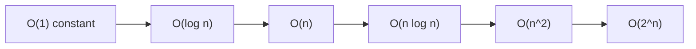

Big-O captures the **dominant term** as n→∞. `3n + 5` is `O(n)` (constants and the `+5` drop out). What matters is the **class**: `O(log n)` and `O(n log n)` scale well; `O(n²)` degrades fast; `O(2^n)` is infeasible beyond tiny inputs. Two algorithms in the same class are "similar"; a class difference dominates any constant-factor tuning at scale.

### 1.4 Architecture: classes ranked by scalability

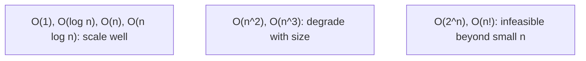

### 1.5 Real example

**Scenario.** Check whether a list has any duplicate values.

**Problem.** The obvious nested-loop approach compares every pair — `O(n²)` — fine for small lists, ruinous for large ones.

**Solution.** Use a hash set: one pass, `O(n)`.

**Implementation.**

```text
# O(n^2): compare every pair (slow on large n)
for i in 0..n: for j in i+1..n: if a[i] == a[j] -> duplicate

# O(n): track seen values in a set, one pass
seen = set()
for x in a:
    if x in seen: -> duplicate        # O(1) membership
    seen.add(x)
```

**Result.** At n = 100,000 the `O(n²)` version does ~5 billion comparisons; the `O(n)` version does ~100,000 set operations — milliseconds vs minutes. The class difference, not tuning, is what makes it scale.

**Future improvements.** Recognize the pattern: replacing nested-loop scans with hash-based lookups turns many `O(n²)` algorithms into `O(n)`.

### 1.6 Exercises

1. What does Big-O describe, and what does it ignore?
2. Rank `O(n²)`, `O(log n)`, `O(n log n)`, `O(1)` by scalability.
3. Why does `3n + 5` simplify to `O(n)`?

### 1.7 Challenges

- **Challenge.** Find an `O(n²)` loop in code you know. Can a hash set/map make it `O(n)`? Estimate the difference at n = 1,000,000.

### 1.8 Checklist

- [ ] I express algorithm cost as Big-O in n.
- [ ] I focus on growth class, not constants.
- [ ] I avoid `O(n²)`+ on large inputs where possible.
- [ ] I predict scaling before deploying.

### 1.9 Best practices

- Analyze complexity before choosing an algorithm.
- Prefer lower growth classes for large inputs.
- Replace nested scans with hash lookups where possible.

### 1.10 Anti-patterns

- Nested loops over large data (`O(n²)`) when avoidable.
- Micro-optimizing constants while ignoring the growth class.
- Assuming small-data speed predicts large-data behavior.

### 1.11 Troubleshooting

| Symptom | Likely cause | Action |
|---------|--------------|--------|
| Fast in test, slow in prod | Higher complexity class on big data | Analyze Big-O; reduce the class |
| Tuning doesn't help at scale | Wrong growth class | Change the algorithm, not constants |
| Quadratic blowup | Nested scans | Use hashing/sorting to lower the class |

### 1.12 References

- T. Cormen, C. Leiserson, R. Rivest, C. Stein, *Introduction to Algorithms*, 4th ed. (MIT Press, 2022), ch. 3 "Characterizing Running Times" (§3.1 asymptotic notation) — ISBN 978-0262046305.
- J. Kleinberg, É. Tardos, *Algorithm Design* (Pearson, 2005), ch. 2 (basics of algorithm analysis) — ISBN 978-0321295354.

---

## Chapter 2 — Why growth rate dominates

### 2.1 Introduction

A faster computer doesn't save a bad algorithm: hardware gives a constant-factor speedup, but a worse **growth class** overtakes any constant as n grows. This chapter drives home why the **asymptotic** class is what matters for scalability, and why choosing the right algorithm beats faster hardware or micro-optimization for large inputs.

### 2.2 Business context

Teams sometimes try to fix slow systems by buying bigger machines — which helps a bad algorithm only by a constant factor, soon outrun by data growth. Recognizing that algorithmic complexity dominates redirects effort to the real fix (a better algorithm), which can turn an intractable problem into an easy one. This is often the single highest-leverage performance change available, far exceeding hardware upgrades.

### 2.3 Theoretical concepts: class beats constant

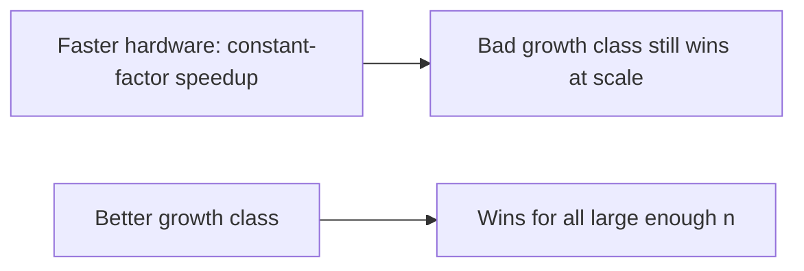

For large enough n, an `O(n log n)` algorithm beats an `O(n²)` one **regardless** of constants or machine speed — the curves cross and never re-cross. So the asymptotic class is the dominant lever: doubling hardware halves time once; switching from `O(n²)` to `O(n log n)` changes the *shape* of the curve forever.

### 2.4 Architecture: curves cross, then diverge

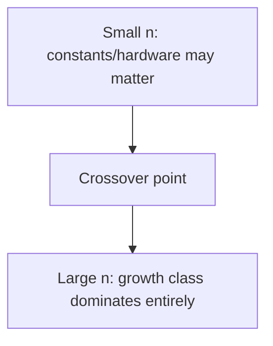

### 2.5 Real example

**Scenario.** A nightly job sorts and processes growing data; it's getting slow.

**Problem.** The team considers a bigger server. But the sort is a hand-rolled `O(n²)` selection sort.

**Solution.** Switch to an `O(n log n)` sort — a far bigger win than any hardware upgrade.

**Implementation (class change vs hardware).**

```text
Data: n = 1,000,000
O(n^2) selection sort:   ~10^12 operations  (hours; faster CPU -> still hours)
O(n log n) merge/quick:  ~2x10^7 operations (seconds)
=> changing the algorithm class beats any realistic hardware upgrade
```

**Result.** The `O(n log n)` sort runs in seconds where the `O(n²)` one took hours; a hardware upgrade would have shaved a constant factor off "hours." The growth class was the real problem and the real fix.

**Future improvements.** Use well-tested library sorts (already `O(n log n)`); reserve custom algorithms for cases the standard library can't handle.

### 2.6 Exercises

1. Why can't faster hardware fix a bad growth class?
2. What happens at the "crossover point"?
3. When do constants/hardware actually matter?

### 2.7 Challenges

- **Challenge.** For a slow process, identify its complexity class. Is the bottleneck the algorithm (class) or constants? Propose a class-lowering change.

### 2.8 Checklist

- [ ] I prioritize growth class over constants for scale.
- [ ] I fix slow algorithms before buying hardware.
- [ ] I use library algorithms with good complexity.
- [ ] I know where the crossover makes class decisive.

### 2.9 Best practices

- Choose the algorithm class first; tune constants later.
- Prefer proven library implementations.
- Reserve micro-optimization for hot, correct-class code.

### 2.10 Anti-patterns

- Throwing hardware at an algorithmic problem.
- Hand-rolling `O(n²)` where `O(n log n)` exists.
- Optimizing constants in a bad-class algorithm.

### 2.11 Troubleshooting

| Symptom | Likely cause | Action |
|---------|--------------|--------|
| "Bigger server didn't help" | Bad growth class | Improve the algorithm's class |
| Slowness scales with data | High complexity class | Replace with a lower-class algorithm |
| Custom algorithm slow | Reinvented a worse sort/search | Use the standard library |

### 2.12 References

- T. Cormen et al., *Introduction to Algorithms*, 4th ed. (MIT Press, 2022), §1.2 "Algorithms as a technology" (insertion sort vs. merge sort at scale) — ISBN 978-0262046305.
- S. Skiena, *The Algorithm Design Manual*, 3rd ed. (Springer, 2020) — ISBN 978-3030542559.

---

> **End of Part I.** You can now analyze algorithms by **asymptotic growth** (Big-O), comparing them by how cost scales with input size while ignoring constants, and you understand why the **growth class dominates** — a better class beats any constant-factor hardware speedup for large enough inputs, making algorithm choice the highest-leverage performance decision. **Part II — Design** (Chapter 3) covers core design techniques, especially **divide and conquer** (break a problem into smaller subproblems, solve recursively, combine — as in merge sort and binary search) and a survey of greedy and dynamic-programming approaches.

---

## Part II – Design

Analysis (Part I) tells you how an algorithm scales; **design** is about producing one with a good growth class in the first place. Most efficient algorithms come from a handful of reusable **paradigms**. This part covers the most important one, **divide and conquer**, and surveys two others — **greedy** and **dynamic programming** — so you can recognize which fits a problem.

---

## Chapter 3 — Divide and conquer (and other techniques)

### 3.1 Introduction

**Divide and conquer** solves a problem in three steps: **divide** it into smaller subproblems of the same kind, **conquer** each by solving it recursively (a small enough subproblem is solved directly), and **combine** the subresults into the answer. Merge sort and binary search are the classic examples. Two other paradigms round out the toolkit: **greedy** algorithms, which build a solution from locally optimal choices, and **dynamic programming**, which solves overlapping subproblems once and reuses the results. Recognizing the paradigm is most of the design work.

### 3.2 Business context

The difference between a feature that ships and one that times out is often the design paradigm. Divide and conquer is what makes sorting `O(n log n)` instead of `O(n²)` and search `O(log n)` instead of `O(n)` — the gap that decides whether a job finishes in seconds or hours (Part I). Dynamic programming turns exponential brute force into polynomial time for problems like scheduling, diffing, and routing; greedy algorithms give fast, optimal answers when a problem has the right structure. Knowing these paradigms lets a team reach for a proven `O(n log n)` shape instead of inventing a slow one.

### 3.3 Theoretical concepts: divide, conquer, combine

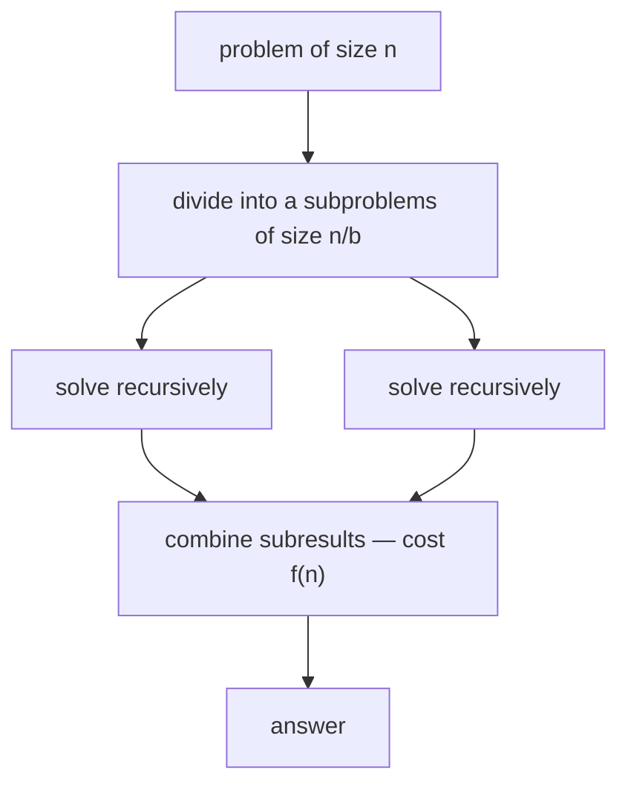

A divide-and-conquer algorithm's cost is a **recurrence**: `T(n) = a·T(n/b) + f(n)`, where `a` is the number of subproblems, `n/b` their size, and `f(n)` the divide-plus-combine cost. The **master method** (CLRS §4.5) reads the growth class straight off `a`, `b`, and `f(n)`. Merge sort splits into 2 halves and merges in linear time — `T(n) = 2T(n/2) + O(n)` — which the master method resolves to **`O(n log n)`**. Binary search makes one recursive call on half the input — `T(n) = T(n/2) + O(1)` — giving **`O(log n)`**.

### 3.4 Architecture: choosing a paradigm

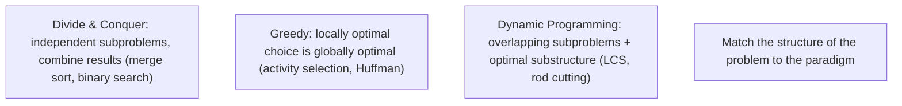

Use **divide and conquer** when subproblems are independent. Use **greedy** when a locally optimal choice provably leads to a global optimum (it needs the *greedy-choice property* and *optimal substructure*). Use **dynamic programming** when subproblems **overlap** and the problem has *optimal substructure* — solve each subproblem once and store it (memoization or tabulation) instead of recomputing exponentially.

### 3.5 Real example

**Scenario.** Sort a large list efficiently and predictably.

**Problem.** A nested-comparison sort is `O(n²)` and collapses at scale (Part I).

**Solution.** **Merge sort** — divide the list in half, sort each half recursively, then merge the two sorted halves.

**Implementation.**

```text
merge_sort(a):
    if len(a) <= 1: return a                  # base case (conquer directly)
    mid = len(a) // 2
    left  = merge_sort(a[:mid])               # divide + recurse
    right = merge_sort(a[mid:])
    return merge(left, right)                 # combine: O(n) merge of sorted halves

# Recurrence: T(n) = 2T(n/2) + O(n)  ->  master method  ->  O(n log n)
```

**Result.** Merge sort runs in `O(n log n)` for every input — no quadratic worst case — so it stays fast as data grows. The recurrence makes the cost predictable: two half-size subproblems plus a linear merge is the textbook `O(n log n)` shape.

**Future improvements.** Prefer the standard library's sort (already `O(n log n)`, tuned); reach for a hand-written divide-and-conquer only when the problem isn't a plain sort (e.g., counting inversions, closest pair of points).

### 3.6 Exercises

1. What are the three steps of divide and conquer, and what is the base case for?
2. Write the recurrence for merge sort and state the class the master method gives.
3. When do you prefer dynamic programming over plain divide and conquer?

### 3.7 Challenges

- **Challenge.** Implement binary search and write its recurrence. Then take a problem with overlapping subproblems (e.g., Fibonacci or longest common subsequence) and make it polynomial with memoization; compare against the naive exponential recursion.

### 3.8 Checklist

- [ ] I identify whether subproblems are independent (D&C) or overlapping (DP).
- [ ] I write the recurrence and use the master method to get the class.
- [ ] I use greedy only when the greedy-choice property and optimal substructure hold.
- [ ] I memoize/tabulate overlapping subproblems instead of recomputing them.

### 3.9 Best practices

- Match the paradigm to the problem's structure before coding.
- Derive the recurrence and confirm the growth class up front.
- Lean on proven library implementations for standard cases (sorting, searching).

### 3.10 Anti-patterns

- Naive recursion over **overlapping** subproblems (exponential blowup — needs DP).
- Applying greedy where the greedy-choice property doesn't hold (wrong answer).
- Re-implementing merge/quick sort by hand instead of using the standard library.

### 3.11 Troubleshooting

| Symptom | Likely cause | Action |
|---------|--------------|--------|
| Exponential recursive blowup | Overlapping subproblems recomputed | Memoize or tabulate (dynamic programming) |
| Greedy gives a wrong answer | No greedy-choice property | Switch to dynamic programming or D&C |
| Recursion never terminates | Missing/incorrect base case | Add the base case that solves the smallest subproblem |

### 3.12 References

- T. Cormen, C. Leiserson, R. Rivest, C. Stein, *Introduction to Algorithms*, 4th ed. (MIT Press, 2022), ch. 4 "Divide-and-Conquer" (§4.5 the master method) & §2.3 (merge sort); ch. 14 "Dynamic Programming"; ch. 15 "Greedy Algorithms" — ISBN 978-0262046305.
- J. Kleinberg, É. Tardos, *Algorithm Design* (Pearson, 2005), ch. 5–6 (divide & conquer, dynamic programming) — ISBN 978-0321295354.

---

> **End of Part II.** Efficient algorithms come from recognizing a **paradigm**: **divide and conquer** splits a problem into independent subproblems, solves them recursively, and combines them (merge sort, binary search), with cost read from a **recurrence** via the **master method**; **greedy** builds from locally optimal choices when the structure allows; **dynamic programming** solves overlapping subproblems once. With Part I's **asymptotic analysis**, you can now both **measure** an algorithm's scaling and **design** one with the growth class you need.

---

## Part III – Probabilistic and amortized analysis

Worst-case analysis (Parts I–II) is sometimes too pessimistic or simply the wrong question. Two refinements complete the analyst's toolkit. **Probabilistic analysis** reasons about the *expected* cost over a distribution of inputs, and **randomized algorithms** make their own random choices so that no single input is reliably bad. **Amortized analysis** measures the *average* cost of an operation across a worst-case *sequence* — the right lens when an occasional expensive operation pays for many cheap ones. Together they explain why algorithms that look risky on paper (quicksort, dynamic arrays, hash tables) are fast and dependable in practice.

---

## Chapter 4 — Randomized algorithms and probabilistic analysis

### 4.1 Introduction

**Probabilistic analysis** computes the *expected* running time of an algorithm by averaging its cost over an assumed distribution of inputs. **Randomized algorithms** go one step further: the algorithm itself makes random choices (a coin flip, a random pivot, a random permutation), so its behavior depends on the random bits, **not** on which input an adversary hands it. The key tool is the **indicator random variable** — a 0/1 variable for "did event A happen?" — whose expectation equals the probability of A, letting us turn a hard counting problem into a sum of simple probabilities via linearity of expectation. The payoff is robustness: a randomized algorithm has **no** worst-case input, only worst-case luck, which a good design makes astronomically unlikely.

### 4.2 Business context

Expected-case guarantees are what make many production algorithms trustworthy. Quicksort is the default sort in countless standard libraries because *randomizing the pivot* gives expected `O(n log n)` on **every** input — including the already-sorted and adversarial inputs that wreck a fixed-pivot quicksort. Hash tables give expected `O(1)` lookups only because a good (often randomized) hash function spreads keys evenly, defeating the worst-case collisions that would otherwise let a malicious user trigger `O(n)` operations (a real denial-of-service vector — "hash flooding"). Randomization also buys **simplicity**: a randomized algorithm is frequently shorter and faster than the deterministic one with the same guarantee. For a business, "expected `O(n log n)` with negligible variance" is a stronger, cheaper guarantee than a fragile worst case that an attacker or an unlucky data shape can break.

### 4.3 Theoretical concepts: expectation via indicator variables

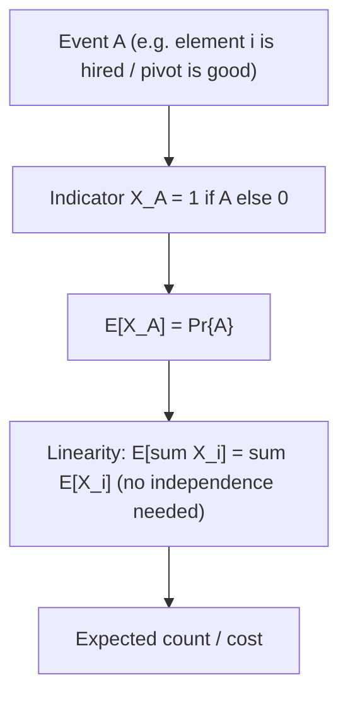

An **indicator random variable** `I{A}` is `1` when event `A` occurs and `0` otherwise; its expectation is exactly `Pr{A}`. The decisive trick is **linearity of expectation**: `E[X₁ + … + Xₙ] = E[X₁] + … + E[Xₙ]` holds **whether or not** the variables are independent. So to find an expected count, define one indicator per "thing that might happen," compute each one's probability, and sum. CLRS develops this on the **hiring problem** (how many times do you replace your best candidate while interviewing in random order? — the answer is the harmonic number, `O(log n)`) and uses the same machinery to prove **randomized quicksort** runs in expected `O(n log n)` by counting the expected number of element comparisons.

### 4.4 Architecture: two kinds of guarantee

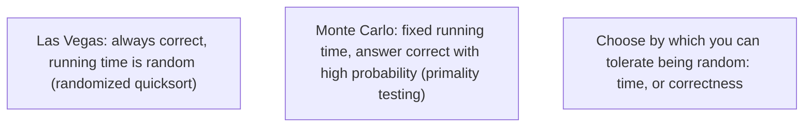

Randomized algorithms split into two families. A **Las Vegas** algorithm always returns the correct answer; only its *running time* is a random variable (randomized quicksort always sorts — it just occasionally takes longer). A **Monte Carlo** algorithm runs in a fixed time but is allowed a small, controllable probability of a wrong answer (Miller–Rabin primality testing). The engineering distinction is which property you let chance touch. Crucially, randomizing **inside** the algorithm (e.g. permuting the input before quicksort) converts an assumption about the *input distribution* into a property of the *algorithm* — you no longer have to trust that real inputs are random.

### 4.5 Real example

**Scenario.** A service sorts user-supplied batches. The team ships a textbook quicksort that always pivots on the last element.

**Problem.** Latency spikes in production. The cause: some clients send **already-sorted** or reverse-sorted batches, the exact worst case for last-element-pivot quicksort, which degrades to `O(n²)` — and an attacker who knows this can deliberately send sorted input to exhaust CPU.

**Solution.** **Randomize the pivot** (or randomly permute the array first). With a random pivot, the probability of repeatedly choosing bad pivots vanishes, and the expected running time is `O(n log n)` for *every* input — there is no longer a sorted-input worst case to trigger.

**Implementation.**

```text
randomized_partition(A, p, r):
    i = random integer in [p, r]      # random pivot — the only change
    swap A[i], A[r]
    return partition(A, p, r)         # standard Lomuto/Hoare partition

randomized_quicksort(A, p, r):
    if p < r:
        q = randomized_partition(A, p, r)
        randomized_quicksort(A, p, q-1)
        randomized_quicksort(A, q+1, r)

# Expected comparisons (indicator-variable analysis): sum over i<j of
# Pr{z_i and z_j are compared} = 2/(j-i+1)  ->  total  =  O(n log n)
```

**Result.** Worst-case-by-input disappears: latency becomes flat and predictable regardless of how clients order their data, and the sorted-input DoS vector is closed. The expected cost is `O(n log n)` with low variance; the rare slow run depends on internal coin flips no attacker controls.

**Future improvements.** Production sorts (e.g. introsort) combine a randomized/median-of-three quicksort with a **heapsort fallback** once recursion depth exceeds `O(log n)`, guaranteeing `O(n log n)` *worst case* while keeping quicksort's small constants — the deterministic safety net on top of the randomized common case.

### 4.6 Exercises

1. Define an indicator random variable and state why `E[I{A}] = Pr{A}`.
2. Why does linearity of expectation **not** require independence, and why does that matter?
3. Distinguish a Las Vegas from a Monte Carlo algorithm with one example of each.
4. Why does randomizing the pivot remove quicksort's worst-case *input* (rather than just making it rarer for a fixed distribution)?

### 4.7 Challenges

- **Challenge.** Implement randomized quicksort and, on the same machine, compare it with last-element-pivot quicksort on (a) random data and (b) already-sorted data of size 100,000. Reproduce the `O(n²)` blow-up on sorted input for the deterministic version and confirm the randomized version stays fast. Then use indicator variables to derive the `2/(j−i+1)` comparison probability yourself.

### 4.8 Checklist

- [ ] I know whether I need an *expected-case* or a *worst-case* guarantee.
- [ ] I randomize **inside** the algorithm rather than assuming inputs are random.
- [ ] I model expected counts with indicator variables and linearity of expectation.
- [ ] I know whether each randomized algorithm I use is Las Vegas or Monte Carlo.
- [ ] I use randomized/seeded hashing where adversarial collisions are a risk.

### 4.9 Best practices

- Prefer a randomized pivot (or an up-front random permutation) for quicksort-style algorithms.
- Use linearity of expectation to decompose a hard expected-cost analysis into simple per-event probabilities.
- For Monte Carlo algorithms, repeat independent trials to drive the error probability as low as required.
- Seed hash functions where untrusted input could otherwise force worst-case collisions.

### 4.10 Anti-patterns

- Fixed-pivot quicksort on possibly-sorted or attacker-controlled input.
- Assuming "inputs are random in practice" instead of randomizing inside the algorithm.
- Treating an expected-case bound as a worst-case guarantee (e.g. promising hard real-time latency from average-case hashing).
- Reusing a single fixed hash seed in a public service (hash-flooding exposure).

### 4.11 Troubleshooting

| Symptom | Likely cause | Action |
|---------|--------------|--------|
| Quicksort slow only on some inputs | Deterministic pivot hitting its worst case (sorted data) | Randomize the pivot or permute the input |
| Hash-table latency spikes under load | Adversarial key collisions on a fixed hash | Use a seeded/randomized hash function |
| Expected-case algorithm misses a latency SLO | Worst-case run cannot be ruled out | Add a deterministic fallback (e.g. introsort's heapsort) |
| "Random" algorithm gives wrong answers | Monte Carlo error probability too high | Increase independent repetitions to shrink the error |

### 4.12 References

- T. Cormen, C. Leiserson, R. Rivest, C. Stein, *Introduction to Algorithms*, 4th ed. (MIT Press, 2022), ch. 5 "Probabilistic Analysis and Randomized Algorithms" (§5.1 the hiring problem, §5.2 indicator random variables, §5.3 randomized algorithms); §7.3 "A randomized version of quicksort" & §7.4 — ISBN 978-0262046305.
- R. Motwani, P. Raghavan, *Randomized Algorithms* (Cambridge University Press, 1995) — ISBN 978-0521474658.

---

## Chapter 5 — Amortized analysis

### 5.1 Introduction

**Amortized analysis** measures the average cost of an operation over a worst-case *sequence* of operations, with **no probability involved** — it is a guarantee, not an expectation. The point is that some operations are occasionally expensive but, because they make later operations cheap (or were paid for by earlier cheap ones), the *average per operation across the whole sequence* is small. CLRS presents three techniques: **aggregate analysis** (bound the total cost of `n` operations, then divide by `n`), the **accounting method** (overcharge cheap operations and store the surplus as "credit" to pay for expensive ones), and the **potential method** (define a potential function on the data structure's state so that each operation's amortized cost = actual cost + change in potential). All three give the same bound; they differ in which is easiest to apply.

### 5.2 Business context

Amortized bounds are why everyday data structures are fast *and* safe to reason about. A **dynamic array** (Java `ArrayList`, C++ `std::vector`, Python `list`, Go slice) gives **`O(1)` amortized** `append` even though an occasional append triggers an `O(n)` reallocation-and-copy — because doubling the capacity means those expensive copies are rare enough to average out to a constant. Without this analysis a team might wrongly fear that "append is sometimes `O(n)`" makes a loop of `n` appends `O(n²)`; amortized analysis proves it is `O(n)` total. The same reasoning underlies hash-table resizing, the union-find structure's near-constant operations, and the `O(1)`-amortized increment of a binary counter. Knowing the *amortized* cost — not the per-operation worst case — is what lets you correctly budget the cost of a *workload*.

### 5.3 Theoretical concepts: three methods, one bound

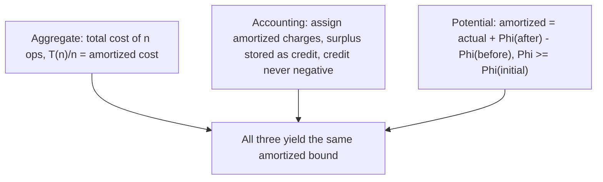

The **potential method** generalizes the other two and is usually the most powerful. Define a potential `Φ` mapping each state of the data structure to a real number, with `Φ(D₀) = 0` and `Φ(Dᵢ) ≥ 0` always. The **amortized cost** of operation `i` is `ĉᵢ = cᵢ + Φ(Dᵢ) − Φ(Dᵢ₋₁)`. Summing telescopes: `Σĉᵢ = Σcᵢ + Φ(Dₙ) − Φ(D₀) ≥ Σcᵢ`, so the total amortized cost **upper-bounds** the total actual cost. The art is choosing `Φ` so that cheap operations *raise* potential (banking work) and expensive operations *release* it (spending the bank), making every amortized cost small. The **accounting method** is the same idea told concretely: charge each cheap operation a little extra, store the surplus as credit on specific objects, and require credit to stay non-negative.

### 5.4 Architecture: when to reach for amortized analysis

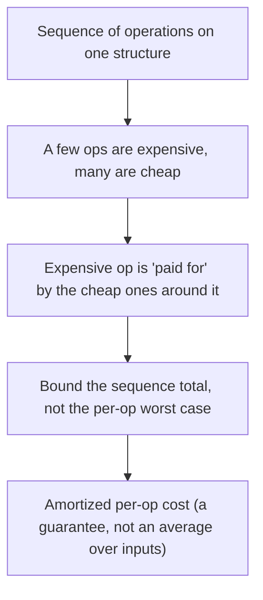

Use amortized analysis whenever a structure's cost is **uneven across a sequence** but the expensive steps are structurally tied to the cheap ones — table doubling, lazy rebalancing, the binary-counter increment, union-find. Do **not** confuse it with average-case (probabilistic) analysis: amortized cost holds for the *worst-case sequence* and involves no randomness. And remember its limit: an `O(1)` *amortized* bound does **not** promise any *single* operation is `O(1)` — a particular `append` can still stall for `O(n)` while it copies, which matters for hard real-time or tail-latency-sensitive systems.

### 5.5 Real example

**Scenario.** A buffer accumulates an unknown number of incoming records; the team uses a growable array and appends one record at a time.

**Problem.** Each append is `O(1)` *until* the array is full, when it must allocate a bigger block and copy everything — an `O(n)` step. A reviewer worries that `n` appends could therefore cost `O(n²)`.

**Solution.** Grow by **doubling** the capacity on each resize. Then resizes happen at sizes `1, 2, 4, …, n`, and the total copying work across all of them is `1 + 2 + 4 + … + n < 2n = O(n)`. Spread over `n` appends, that is **`O(1)` amortized** per append.

**Implementation.**

```text
append(arr, x):
    if arr.count == arr.capacity:
        new_capacity = max(1, 2 * arr.capacity)   # DOUBLING is the key
        allocate block of new_capacity
        copy arr.count elements into it            # this single step is O(n)
        arr.capacity = new_capacity
    arr.data[arr.count] = x
    arr.count += 1

# Potential method: let Phi = 2*count - capacity  (>= 0 just after a resize).
# Non-resizing append: actual 1, Phi rises by 2  -> amortized 3 = O(1).
# Resizing append (count == capacity): actual count+1, but Phi DROPS by ~count
#   -> amortized still O(1). Total over n appends: O(n).
```

**Result.** `n` appends cost `O(n)` total, not `O(n²)`; the worry is unfounded *because of the doubling*. The potential `Φ = 2·count − capacity` banks two credits per cheap append and releases them all to fund the copy — every amortized cost is constant.

**Future improvements.** Growth factor is a real tradeoff: doubling wastes up to ~50% memory but minimizes copies; a smaller factor (e.g. 1.5×, as some `std::vector` and `ArrayList` implementations use) trims wasted memory at the cost of more frequent resizes. For predictable workloads, **reserve** the final capacity up front to avoid resizes entirely — turning amortized `O(1)` into guaranteed `O(1)` per append.

### 5.6 Exercises

1. State the difference between amortized analysis and average-case (probabilistic) analysis.
2. Name the three amortized-analysis methods and the core idea of each.
3. Write `Φ = 2·count − capacity` for the doubling array and show a non-resizing append has amortized cost `3`.
4. Why does growing a dynamic array by a *constant amount* (e.g. +1 each time) make `n` appends `O(n²)` instead of `O(n)`?

### 5.7 Challenges

- **Challenge.** Implement a dynamic array with a configurable growth factor. Empirically count total element-copies over 1,000,000 appends for factors 2×, 1.5×, and "+1 (constant)". Confirm the constant-increment version is `O(n²)` while the multiplicative ones are `O(n)`, and relate the measured copy counts to the potential-method bound.

### 5.8 Checklist

- [ ] I bound the cost of a *sequence*, not just a single worst-case operation, when costs are uneven.
- [ ] I distinguish amortized (worst-case sequence, no randomness) from average-case (over an input distribution).
- [ ] I grow dynamic structures **multiplicatively** (doubling / 1.5×), never by a constant.
- [ ] I remember amortized `O(1)` still allows an individual `O(n)` spike (relevant for tail latency).
- [ ] I reserve capacity up front when the final size is known.

### 5.9 Best practices

- Reach for the **potential method** first for a clean, reusable proof; fall back to aggregate/accounting when potential is hard to define.
- Choose a growth factor deliberately, trading wasted memory against resize frequency.
- Pre-size containers (`reserve`/`ensureCapacity`) in hot paths with known sizes.
- Document amortized vs. worst-case bounds in latency-sensitive APIs so callers know a rare spike is possible.

### 5.10 Anti-patterns

- Growing a buffer by a fixed increment in a loop (`O(n²)` total).
- Quoting an amortized `O(1)` bound where a hard real-time path needs per-operation `O(1)`.
- Confusing amortized with average-case and assuming a "bad input" can break the bound.
- Repeatedly resizing in a tight loop instead of reserving capacity once.

### 5.11 Troubleshooting

| Symptom | Likely cause | Action |
|---------|--------------|--------|
| Loop of appends is unexpectedly `O(n²)` | Constant-increment growth instead of doubling | Grow multiplicatively, or reserve capacity up front |
| Occasional latency spike on insert | Amortized `O(1)` includes a rare `O(n)` resize copy | Pre-size the structure, or use a structure with worst-case bounds |
| Memory usage ~2× the data | Doubling growth leaves up to half the array unused | Use a smaller growth factor or shrink-to-fit after fill |
| "Average" analysis disputed for adversarial input | Conflating amortized with average-case | Re-derive with the potential method (holds for any sequence) |

### 5.12 References

- T. Cormen, C. Leiserson, R. Rivest, C. Stein, *Introduction to Algorithms*, 4th ed. (MIT Press, 2022), ch. 16 "Amortized Analysis" (§16.1 aggregate analysis, §16.2 the accounting method, §16.3 the potential method, §16.4 dynamic tables) — ISBN 978-0262046305.
- R. Sedgewick, K. Wayne, *Algorithms*, 4th ed. (Addison-Wesley, 2011), §1.4 (amortized analysis of resizing arrays) — ISBN 978-0321573513.

---

> **End of Part III.** Two refinements complete the analyst's toolkit beyond worst-case Big-O. **Probabilistic analysis** and **randomized algorithms** reason about *expected* cost and make the algorithm's own coin flips — not the input — the source of randomness, so quicksort and hashing have no worst-case *input* to exploit; the **indicator random variable** plus **linearity of expectation** is the engine of these proofs. **Amortized analysis** bounds the *average cost over a worst-case sequence* (no probability) via **aggregate**, **accounting**, or **potential** methods, explaining why doubling dynamic arrays give `O(1)`-amortized append. **Part IV — Sorting and order statistics** applies all of this to the most-studied problem in the field.

---

## Part IV – Sorting and order statistics

Sorting is the most-studied problem in algorithms, and for good reason: it is a subroutine inside countless others, and it is the cleanest setting to see design paradigms, analysis techniques, and lower bounds meet. This part covers the two great `O(n log n)` **comparison sorts** that complement merge sort — **heapsort** (worst-case `O(n log n)`, in place) and **quicksort** (the fast in-practice default) — then proves the **`Ω(n log n)` lower bound** that says no comparison sort can do better, and shows how to **beat** it by *not comparing*: counting, radix, and bucket sort. It closes with **order statistics** — finding the `k`-th smallest element (e.g. the median) in linear time without fully sorting.

---

## Chapter 6 — Comparison sorts: heapsort and quicksort

### 6.1 Introduction

A **comparison sort** orders elements using only pairwise comparisons (`≤`). Merge sort (Part II) is one; this chapter adds the other two textbook `O(n log n)` comparison sorts, each with a distinct engineering profile. **Heapsort** builds a **binary heap** — a nearly complete binary tree where every parent dominates its children — then repeatedly extracts the maximum; it sorts **in place** with **worst-case** `O(n log n)`, the best of both merge sort (good bound) and quicksort (in place). **Quicksort** partitions the array around a **pivot** so that smaller elements go left and larger go right, then recurses on each side; it is `O(n²)` in the pathological worst case but, with a randomized pivot (Part III), **expected** `O(n log n)` with such small constants that it is the default sort in most libraries. The heap also gives us the **priority queue**, a workhorse data structure in its own right.

### 6.2 Business context

The choice among these sorts is a real engineering decision. **Quicksort**'s tiny constant factors and cache-friendly in-place partitioning make it the fastest general comparison sort in practice — which is why it (or a hybrid built on it) backs `Arrays.sort` for primitives in Java, `std::sort` in C++, and many others. **Heapsort**'s value is its **guarantee**: `O(n log n)` *worst case* in `O(1)` extra space, so it is the safety net production sorts fall back to (introsort switches quicksort→heapsort when recursion gets too deep) and the right choice for hard latency bounds. The **priority queue** behind heapsort is itself everywhere: task schedulers, Dijkstra's and Prim's algorithms (Part VII), event simulation, and "top-k" queries. Understanding heaps therefore pays off twice — as a sort and as a data structure.

### 6.3 Theoretical concepts: heaps and partitioning

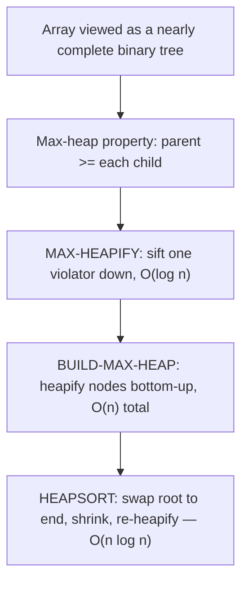

A **binary heap** is stored implicitly in an array: node `i`'s children are `2i` and `2i+1`. `MAX-HEAPIFY` restores the heap property at one node by sifting it down in `O(log n)`. A subtle but important result: `BUILD-MAX-HEAP` running `MAX-HEAPIFY` bottom-up is **`O(n)`**, *not* `O(n log n)`, because most nodes are shallow. **Heapsort** then swaps the maximum (root) to the end, shrinks the heap, and re-heapifies — `n` extractions × `O(log n)` = `O(n log n)`. **Quicksort**'s engine is `PARTITION`: pick a pivot, rearrange so everything ≤ pivot precedes it and everything > pivot follows, in linear time and in place. The recurrence `T(n) = T(q−1) + T(n−q) + Θ(n)` is `Θ(n log n)` when partitions are balanced and `Θ(n²)` when maximally unbalanced — which is exactly why pivot choice (Part III) matters.

### 6.4 Architecture: picking a comparison sort

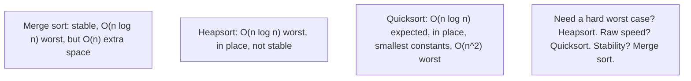

The three `O(n log n)` comparison sorts trade off along three axes: **worst-case guarantee**, **extra space**, and **stability** (does the sort preserve the relative order of equal keys?). Merge sort is **stable** but needs `O(n)` scratch space; heapsort is **in place** with a **worst-case** bound but is **not stable**; quicksort is **in place** and **fastest in practice** but has an `O(n²)` worst case and is not stable. Real libraries combine them: **introsort** (quicksort + heapsort fallback) for raw speed with a worst-case guarantee, and **Timsort** (a stable, adaptive merge sort) where stability and real-world partially-ordered data matter (Python `sorted`, Java `Arrays.sort` for objects).

### 6.5 Real example

**Scenario.** A scheduler must always process the highest-priority pending job next, with jobs arriving and completing continuously.

**Problem.** Re-sorting the whole job list on every insertion is `O(n log n)` *per insert*; a linear scan for the max is `O(n)` per extraction. Both are too slow as the queue grows.

**Solution.** Use a **binary heap as a priority queue**: `insert` and `extract-max` are each `O(log n)`, and reading the max is `O(1)`.

**Implementation.**

```text
# Max-heap in an array A[1..n], children of i are 2i and 2i+1.
max_heapify(A, i, n):
    l, r = 2i, 2i+1
    largest = i
    if l <= n and A[l] > A[largest]: largest = l
    if r <= n and A[r] > A[largest]: largest = r
    if largest != i:
        swap A[i], A[largest]
        max_heapify(A, largest, n)          # sift down, O(log n)

heap_extract_max(A, n):                      # priority-queue pop
    max = A[1]
    A[1] = A[n]; n -= 1
    max_heapify(A, 1, n)                      # O(log n)
    return max

# HEAPSORT: build once O(n), then extract-max n times.
heapsort(A, n):
    build_max_heap(A, n)                      # O(n)
    for i = n downto 2:
        swap A[1], A[i]                       # max to its final slot
        max_heapify(A, 1, i-1)               # O(log n)  ->  O(n log n) total
```

**Result.** Insert and extract-max are `O(log n)`; the scheduler keeps up as the queue grows to millions of jobs. The same heap, run as a sort, gives a worst-case `O(n log n)` in-place ordering — no quadratic surprise, no extra array.

**Future improvements.** For decrease-key-heavy workloads (Dijkstra, Prim), a **binary heap** with a position index, or a **Fibonacci/pairing heap** for better amortized `decrease-key`, can help; for the sort itself, reach for the library (introsort/Timsort) unless you specifically need heapsort's in-place worst-case guarantee.

### 6.6 Exercises

1. Why is `BUILD-MAX-HEAP` `O(n)` and not `O(n log n)`?
2. Give the array index formulas for a node's parent and two children in a 1-based heap.
3. Compare heapsort, quicksort, and merge sort on worst-case time, extra space, and stability.
4. What property of `PARTITION` makes quicksort `O(n²)` in the worst case, and how does Part III remove the worst-case *input*?

### 6.7 Challenges

- **Challenge.** Implement a binary-heap priority queue with `insert`, `extract-max`, and `increase-key`. Then build heapsort on top of it and benchmark against your merge sort and a randomized quicksort on random, sorted, and all-equal inputs of size 1,000,000. Explain each algorithm's behavior on the all-equal input.

### 6.8 Checklist

- [ ] I can view an array as a binary heap and restore the heap property in `O(log n)`.
- [ ] I use a heap-based priority queue for "repeatedly take the best" workloads.
- [ ] I choose heapsort when I need a worst-case `O(n log n)` in-place sort.
- [ ] I know whether I need a **stable** sort (then merge sort / Timsort).
- [ ] I rely on the standard library's hybrid sort unless I have a specific reason not to.

### 6.9 Best practices

- Default to the standard library's sort (introsort/Timsort); hand-roll only for a specific guarantee.
- Use a binary heap (priority queue) instead of repeatedly re-sorting or scanning for the extreme.
- Pick heapsort when worst-case time and `O(1)` space both matter (hard real-time, constrained memory).
- Pick a stable sort when records carry secondary order that must be preserved.

### 6.10 Anti-patterns

- Re-sorting an entire collection to repeatedly fetch the maximum (use a heap).
- Choosing plain quicksort for hard-real-time paths (its `O(n²)` worst case can fire).
- Assuming a sort is stable when it is not (heapsort and quicksort are not).
- Hand-writing heapsort/quicksort where a tuned library sort would be faster and safer.

### 6.11 Troubleshooting

| Symptom | Likely cause | Action |
|---------|--------------|--------|
| "Top priority" lookups are slow | Re-sorting or scanning each time | Use a binary-heap priority queue (`O(log n)`) |
| Quicksort occasionally `O(n²)` | Unbalanced partitions on bad pivots | Randomize the pivot or fall back to heapsort (introsort) |
| Equal-keyed records reorder unexpectedly | Using a non-stable sort | Switch to a stable sort (merge sort / Timsort) |
| Sort uses too much memory | Merge sort's `O(n)` scratch space | Use heapsort (in place) if stability is not required |

### 6.12 References

- T. Cormen, C. Leiserson, R. Rivest, C. Stein, *Introduction to Algorithms*, 4th ed. (MIT Press, 2022), ch. 6 "Heapsort" (§6.1–6.4 heaps and the algorithm, §6.5 priority queues) and ch. 7 "Quicksort" (§7.1 description, §7.2 performance) — ISBN 978-0262046305.
- R. Sedgewick, K. Wayne, *Algorithms*, 4th ed. (Addison-Wesley, 2011), §2.3 (quicksort) & §2.4 (heaps/priority queues) — ISBN 978-0321573513.

---

## Chapter 7 — Sorting in linear time and selection

### 7.1 Introduction

Two questions complete the sorting story. First: **can any comparison sort beat `O(n log n)`?** No — there is a **`Ω(n log n)` lower bound** for sorting by comparisons, proved with a **decision tree** argument. Second: **can we sort faster by not comparing?** Yes — when keys are small integers or have bounded structure, **counting sort**, **radix sort**, and **bucket sort** run in **linear time** by using the keys to index into arrays instead of comparing them. Finally, **selection** (order statistics) asks for the `k`-th smallest element — the minimum, the maximum, or the **median** — and we can answer it in **linear time** without sorting at all, via a quickselect-style partition (expected `O(n)`) or the median-of-medians algorithm (worst-case `O(n)`).

### 7.2 Business context

The `Ω(n log n)` lower bound is practical knowledge: it tells you when to **stop optimizing** a comparison sort (you have hit the wall) and when to **change the model** instead. Linear-time sorts are not academic curiosities — **radix sort** orders fixed-width keys (integers, IP addresses, fixed-length strings, timestamps) faster than any comparison sort, and **counting sort** is the stable subroutine that makes radix sort work. **Selection** matters whenever you need a quantile but not a full ordering: the **median** for robust statistics, the **`k`-th largest** for "top-k" and percentile-latency (p99) computations, and selection is the partition engine behind efficient `nth_element`. Computing a median in `O(n)` instead of sorting in `O(n log n)` is a routine, meaningful win on large data.

### 7.3 Theoretical concepts: the lower bound, and beating it

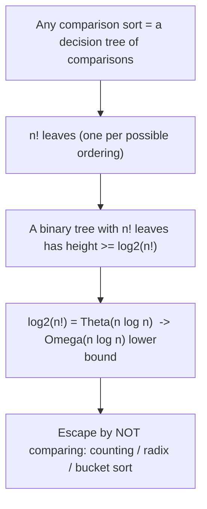

A comparison sort's execution is a path down a **decision tree** whose leaves are the `n!` possible orderings; a binary tree with `n!` leaves has height `≥ log₂(n!) = Θ(n log n)`, so **some** input forces `Ω(n log n)` comparisons. The escape is to exploit key structure. **Counting sort** counts occurrences of each of `k` possible key values, then places elements by prefix sums — `O(n + k)`, **stable**, and the foundation of radix sort. **Radix sort** sorts `d`-digit keys one digit at a time, least-significant first, using a stable counting sort per digit — `O(d(n + k))`, linear when `d` and `k` are bounded. **Bucket sort** scatters uniformly-distributed keys into `n` buckets, sorts each, and concatenates — **expected** `O(n)`. For **selection**, `PARTITION` (from quicksort) recurses into only *one* side: expected `O(n)` (randomized select), and median-of-medians chooses a provably good pivot for **worst-case** `O(n)`.

### 7.4 Architecture: which sort, and when to select instead of sort

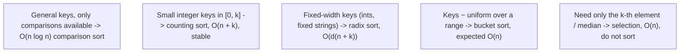

The decision is driven by what you know about the keys. With only comparisons, `O(n log n)` is optimal — use the library sort. With **bounded integer keys**, counting/radix sort beat it. With keys **uniform over a range**, bucket sort is expected linear. And when you need a **single order statistic** (median, p99) rather than the whole order, **selection** in `O(n)` dominates sorting in `O(n log n)`. The recurring lesson: a more restrictive input model or a narrower question admits a faster algorithm than the general case allows.

### 7.5 Real example

**Scenario.** A monitoring system computes the **median** (and p99) request latency from a batch of millions of latency samples every minute.

**Problem.** Sorting all samples to read the middle one is `O(n log n)` per batch — wasteful, since the system needs only one element's value, not the full ordering.

**Solution.** Use **selection**: partition around a (randomized) pivot and recurse into only the side containing the target rank. Expected `O(n)` per query; median-of-medians gives worst-case `O(n)` if a hard bound is required.

**Implementation.**

```text
# Expected O(n): like quicksort, but recurse into ONE side only.
randomized_select(A, p, r, i):              # i-th smallest in A[p..r]
    if p == r: return A[p]
    q = randomized_partition(A, p, r)        # random pivot (Part III)
    k = q - p + 1                            # rank of the pivot within A[p..r]
    if i == k: return A[q]                    # pivot is the answer
    elif i < k: return randomized_select(A, p, q-1, i)
    else:       return randomized_select(A, q+1, r, i-k)

# Recurrence (balanced, expected): T(n) = T(n/2) + O(n) = O(n)  -- NOT O(n log n)
# median  = randomized_select(A, 1, n, floor((n+1)/2))
```

**Result.** The median (and any percentile) is computed in expected **linear** time, roughly a `log n` factor faster than sorting — a clear win on million-sample batches recomputed every minute. Only one side of each partition is explored, so the work is `n + n/2 + n/4 + … = O(n)`.

**Future improvements.** For **streaming** percentiles (samples arriving continuously, no batch), switch models again to approximate sketches (t-digest, HdrHistogram) that estimate quantiles in sublinear space; for fixed-width latency buckets, a **counting/histogram** approach reads percentiles directly in `O(n + k)`.

### 7.6 Exercises

1. Sketch the decision-tree argument for the `Ω(n log n)` comparison-sort lower bound.
2. Why must the per-digit sort inside radix sort be **stable**?
3. Give the running times of counting, radix, and bucket sort and the assumptions each needs.
4. Why is selection `O(n)` while sorting is `O(n log n)`, given both use `PARTITION`?

### 7.7 Challenges

- **Challenge.** Implement counting sort and radix sort for 32-bit integers and benchmark against the library comparison sort on 10,000,000 integers — show radix sort winning. Then implement `randomized_select` and confirm it finds the median faster than sorting; add the median-of-medians pivot and verify it removes the `O(n²)` worst case.

### 7.8 Checklist

- [ ] I recognize when `O(n log n)` is optimal (general comparison sort) and stop tuning there.
- [ ] I use counting/radix sort for bounded-integer or fixed-width keys.
- [ ] I keep the per-digit sort **stable** when building radix sort.
- [ ] I use **selection** (`O(n)`) when I need one order statistic, not a full sort.
- [ ] I switch to streaming sketches when percentiles must be computed online.

### 7.9 Best practices

- Match the sort to the key model: comparison sort for general keys, radix/counting for bounded integers.
- Build radix sort on a **stable** counting sort, least-significant digit first.
- Compute medians/percentiles with selection rather than a full sort.
- For online/streaming quantiles, use approximate sketches instead of re-sorting.

### 7.10 Anti-patterns

- Trying to beat `O(n log n)` with a *comparison* sort (the lower bound forbids it).
- Using a non-stable per-digit sort inside radix sort (it produces wrong results).
- Sorting an entire array to read a single percentile (use selection).
- Applying bucket sort to badly non-uniform keys (buckets skew, losing the linear bound).

### 7.11 Troubleshooting

| Symptom | Likely cause | Action |
|---------|--------------|--------|
| Comparison sort "can't get below `n log n`" | That is the proven lower bound | Change the model — radix/counting sort if keys allow |
| Radix sort produces wrong order | Per-digit sort is not stable | Use a stable counting sort for each digit |
| Bucket sort degrades to `O(n^2)` | Keys not uniform; buckets overflow | Re-hash/re-range buckets or use a different sort |
| Median computation too slow | Full sort used for one order statistic | Use `randomized_select` (expected `O(n)`) |

### 7.12 References

- T. Cormen, C. Leiserson, R. Rivest, C. Stein, *Introduction to Algorithms*, 4th ed. (MIT Press, 2022), ch. 8 "Sorting in Linear Time" (§8.1 lower bounds, §8.2 counting sort, §8.3 radix sort, §8.4 bucket sort) and ch. 9 "Medians and Order Statistics" (§9.2 expected linear-time selection, §9.3 worst-case linear-time selection) — ISBN 978-0262046305.
- J. Kleinberg, É. Tardos, *Algorithm Design* (Pearson, 2005), ch. 13 (randomized selection) — ISBN 978-0321295354.

---

> **End of Part IV.** Sorting ties the whole field together. Beyond merge sort (Part II), **heapsort** gives a worst-case `O(n log n)` in-place sort and the **priority queue**, while **quicksort** is the fast in-practice default (expected `O(n log n)` with a randomized pivot). The **`Ω(n log n)` lower bound** — a decision-tree argument — proves no comparison sort can do better, but **counting, radix, and bucket sort** beat it in **linear time** by exploiting key structure, and **selection** finds the `k`-th smallest (the median, a percentile) in `O(n)` without sorting at all. **Part V — Algorithmic paradigms in depth** returns to design, developing **dynamic programming** and **greedy** algorithms fully.

---

## Part V – Algorithmic paradigms in depth

Part II introduced the design paradigms; this part develops the two that turn exponential problems into polynomial ones. **Dynamic programming (DP)** solves problems with *overlapping subproblems* and *optimal substructure* by computing each subproblem once and reusing the answer — converting naive exponential recursion into polynomial time. **Greedy algorithms** make a single locally optimal choice at each step and never reconsider it; when the problem has the *greedy-choice property*, that gives a globally optimal answer faster and more simply than DP. The crucial skill is telling them apart: both rely on optimal substructure, but greedy works only when a local choice is provably safe, while DP is the fallback when it is not.

---

## Chapter 8 — Dynamic programming

### 8.1 Introduction

**Dynamic programming** applies when a problem has two properties: **optimal substructure** (an optimal solution is built from optimal solutions to subproblems) and **overlapping subproblems** (the same subproblems recur many times in a naive recursion). DP solves each distinct subproblem **once** and stores its result, either **top-down with memoization** (recurse, but cache each answer) or **bottom-up with tabulation** (fill a table from the smallest subproblems up). Either way, the number of *distinct* subproblems times the cost per subproblem gives the running time — usually turning an exponential brute force into a polynomial algorithm. The canonical examples are rod cutting, matrix-chain multiplication, longest common subsequence, and edit distance.

### 8.2 Business context

DP is the engine behind features that would otherwise be intractable. **Edit distance** (a DP) powers spell-checkers, fuzzy search, DNA sequence alignment, and the `diff` that every version-control system and code-review tool runs. **Longest common subsequence** underlies file diffing and plagiarism detection. DP also drives **resource optimization**: knapsack-style budget allocation, optimal scheduling, shortest-path routing (Bellman–Ford and Floyd–Warshall in Part VII are DP), and sequence-to-sequence alignment in bioinformatics and NLP. The business value is concrete: a naive Fibonacci or LCS is `O(2ⁿ)` and dies at `n ≈ 40`, while the DP version is `O(n)` or `O(nm)` and handles inputs millions of times larger. Recognizing "overlapping subproblems" is what lets a team ship a feature instead of declaring it impossible.

### 8.3 Theoretical concepts: solve each subproblem once

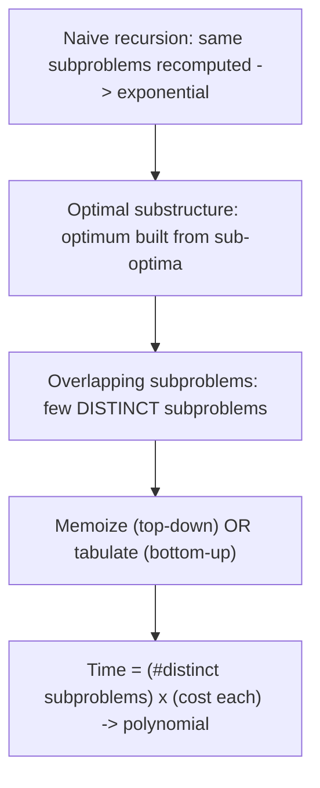

The defining move is to recognize that the recursion tree, though exponentially large, contains only a **polynomial number of distinct nodes**. Fibonacci recursion makes `O(2ⁿ)` calls but only `n` distinct values `F(0)…F(n)`; caching them makes it `O(n)`. **Memoization** keeps the natural recursive structure and adds a cache, computing only the subproblems actually needed (good for sparse subproblem spaces). **Tabulation** fills every cell of a DP table in dependency order, avoiding recursion overhead and enabling space optimizations (often you only need the last row or two). The running time is the **number of distinct subproblems** multiplied by the **work to combine** their sub-answers — for LCS, `Θ(nm)` cells × `O(1)` each = `Θ(nm)`.

### 8.4 Architecture: recognizing and structuring a DP

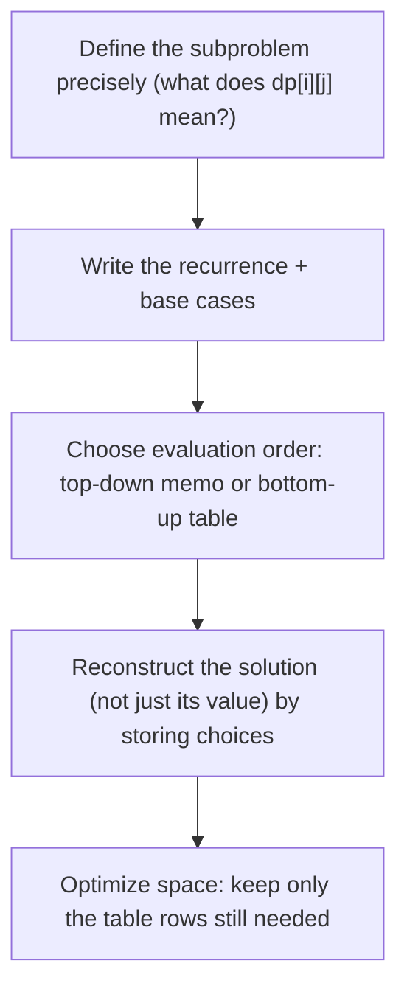

A DP is designed in four steps: **(1)** define the subproblem and what its value means; **(2)** write the **recurrence** relating a subproblem to smaller ones, plus base cases; **(3)** pick an evaluation order (memoized recursion or a bottom-up table); **(4)** if you need the *solution itself* and not just its optimal *value*, store the **choice** made at each cell and trace back. A frequent final optimization: when `dp[i]` depends only on `dp[i-1]`, collapse the table to `O(width)` space. Getting step (1) right — a precise subproblem definition — is the hardest and most important part; the recurrence usually follows from it.

### 8.5 Real example

**Scenario.** A code-review tool must show the minimal set of edits (insertions, deletions, substitutions) that turns one version of a file into another.

**Problem.** Naively exploring all alignments of two sequences of lengths `n` and `m` is exponential — unusable on real files.

**Solution.** Compute the **edit (Levenshtein) distance** with DP. Let `dp[i][j]` be the minimum edits to transform the first `i` characters of `A` into the first `j` characters of `B`; each cell depends on three neighbors, giving `Θ(nm)` time.

**Implementation.**

```text
edit_distance(A[1..n], B[1..m]):
    dp = table (n+1) x (m+1)
    for i in 0..n: dp[i][0] = i        # i deletions
    for j in 0..m: dp[0][j] = j        # j insertions
    for i in 1..n:
        for j in 1..m:
            cost = 0 if A[i] == B[j] else 1
            dp[i][j] = min(
                dp[i-1][j]   + 1,       # delete A[i]
                dp[i][j-1]   + 1,       # insert B[j]
                dp[i-1][j-1] + cost)    # match or substitute
    return dp[n][m]

# Optimal substructure + overlapping subproblems -> Theta(n*m) time, O(min(n,m)) space.
# Store which neighbor each cell chose to RECONSTRUCT the actual edit script.
```

**Result.** The minimal edit script for real files is computed in milliseconds where brute force would never finish; storing each cell's chosen neighbor lets the tool reconstruct and display the exact insert/delete/substitute operations, not just the distance number.

**Future improvements.** For very long, similar sequences use the **Hirschberg** divide-and-conquer refinement (linear space) or band-limited DP (only compute cells near the diagonal when the distance is known to be small); for huge corpora, anchor on exact-match k-mers first and run DP only between anchors.

### 8.6 Exercises

1. State the two properties a problem must have for dynamic programming to apply.
2. Contrast memoization (top-down) with tabulation (bottom-up); when is each preferable?
3. Why is naive recursive Fibonacci `O(2ⁿ)` but the DP version `O(n)`?
4. How do you recover the *solution* (e.g. the LCS itself) rather than just its optimal value?

### 8.7 Challenges

- **Challenge.** Implement longest common subsequence both as naive recursion and as a `Θ(nm)` DP; show the naive version blowing up around length 30 while the DP handles thousands. Then add traceback to print the actual subsequence, and reduce the table to two rows for `O(min(n,m))` space.

### 8.8 Checklist

- [ ] I confirmed the problem has **optimal substructure** and **overlapping subproblems**.
- [ ] I wrote a precise subproblem definition before the recurrence.
- [ ] I chose memoization or tabulation deliberately.
- [ ] I store choices when I need to reconstruct the solution, not just its value.
- [ ] I collapsed the DP table to the rows still needed when space matters.

### 8.9 Best practices

- Define `dp[...]`'s meaning in one sentence before writing the recurrence.
- Prefer tabulation when all subproblems are needed; memoization when the space is sparse.
- Keep a parallel "choice" table to reconstruct the optimal solution.
- Reduce space by retaining only the still-referenced portion of the table.

### 8.10 Anti-patterns

- Naive recursion over overlapping subproblems (exponential — the thing DP exists to fix).
- Applying DP where subproblems do **not** overlap (plain divide and conquer is simpler).
- Computing only the optimal *value* when the task actually needs the optimal *solution*.
- Allocating a full 2-D table when only the last row is ever read.

### 8.11 Troubleshooting

| Symptom | Likely cause | Action |
|---------|--------------|--------|
| Recursive solution times out around n≈30–40 | Overlapping subproblems recomputed | Memoize or tabulate |
| DP gives the right number but you need the path | Choices not recorded | Store each cell's decision and trace back |
| Out-of-memory on a large 2-D DP | Whole table kept needlessly | Keep only the rows the recurrence still references |
| DP feels forced / no reuse | Subproblems don't overlap | Use divide and conquer or greedy instead |

### 8.12 References

- T. Cormen, C. Leiserson, R. Rivest, C. Stein, *Introduction to Algorithms*, 4th ed. (MIT Press, 2022), ch. 14 "Dynamic Programming" (§14.1 rod cutting, §14.2 matrix-chain multiplication, §14.3 elements of dynamic programming, §14.4 longest common subsequence) — ISBN 978-0262046305.
- J. Kleinberg, É. Tardos, *Algorithm Design* (Pearson, 2005), ch. 6 (dynamic programming) — ISBN 978-0321295354.

---

## Chapter 9 — Greedy algorithms

### 9.1 Introduction

A **greedy algorithm** builds a solution by repeatedly making the choice that looks best *right now* — the locally optimal move — and never backtracking. This is simpler and usually faster than dynamic programming, but it is only **correct** when the problem has the **greedy-choice property**: a globally optimal solution can always be reached by a sequence of locally optimal choices. Together with **optimal substructure**, that property is what you must prove (typically by an *exchange argument*) before trusting a greedy algorithm. The classic correct examples are **activity selection** (pick the compatible activity that finishes earliest), **Huffman coding** (repeatedly merge the two least-frequent symbols), and the minimum-spanning-tree algorithms of Part VII.

### 9.2 Business context

When greedy *is* valid, it is the best tool: short, fast, and often optimal. **Huffman coding** — a greedy algorithm — is the basis of real compression (DEFLATE/zip, JPEG, MP3 entropy coding), assigning shorter codes to frequent symbols to minimize total size. **Activity selection** models interval scheduling: booking the most non-overlapping meetings in a room, assigning jobs to a machine, allocating non-conflicting reservations. Greedy also drives **MST** algorithms (Kruskal, Prim) for network/cluster design and **Dijkstra**'s shortest paths (Part VII). The danger is using greedy where the greedy-choice property fails — the classic trap is making change or filling a 0/1 knapsack greedily, which can give a *wrong* answer. Knowing when greedy is provably safe versus when you must fall back to DP is a high-value distinction.

### 9.3 Theoretical concepts: when local choices are globally safe

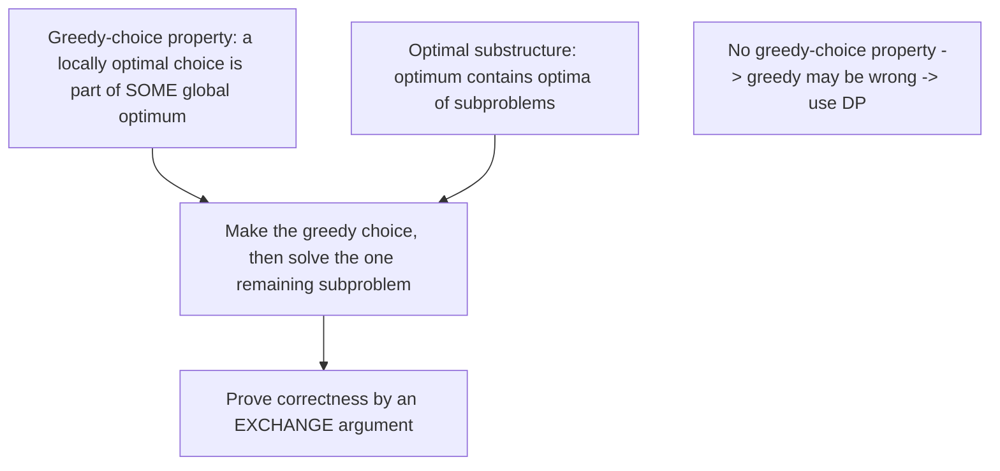

DP considers *all* choices at each step and keeps the best; greedy commits to *one* and never revisits it. That shortcut is valid only when the **greedy-choice property** holds — i.e., there is always a globally optimal solution that includes the greedy choice. The standard proof technique is an **exchange (or cut-and-paste) argument**: take any optimal solution, show you can swap in the greedy choice without making it worse, and conclude the greedy choice is safe. Where this property fails (0/1 knapsack, making change with arbitrary coin denominations), greedy gives a locally-good-but-globally-suboptimal answer, and you must use dynamic programming, which explores the alternatives greedy discarded.

### 9.4 Architecture: greedy vs. dynamic programming

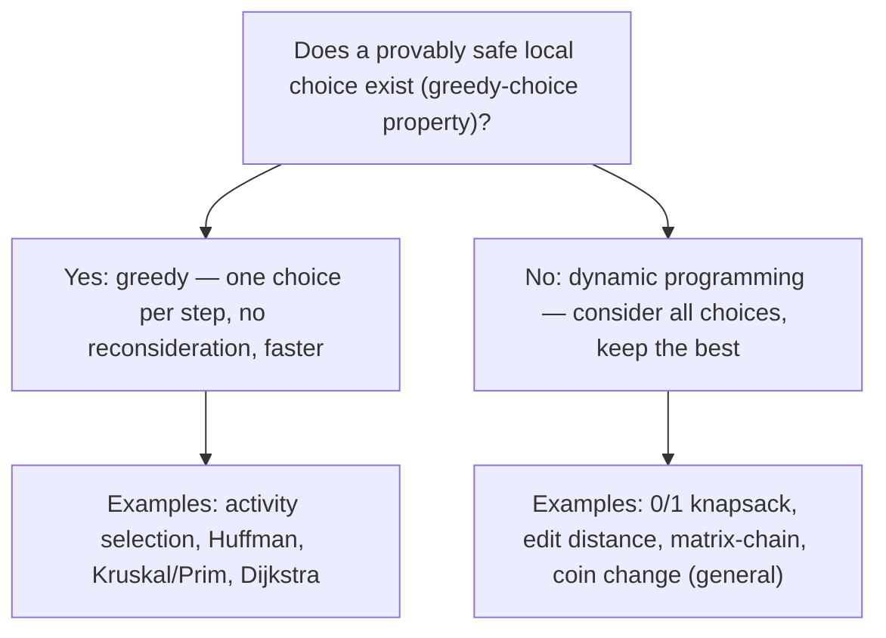

The two paradigms sit on a spectrum of how much they trust a local choice. Both need **optimal substructure**; the divide is the **greedy-choice property**. If you can *prove* a local optimum is always extendable to a global one, greedy is correct and cheaper. If you cannot — if a locally inferior choice can lead to a globally better solution — you need DP's exhaustive-but-memoized search. A practical heuristic: try to construct a small counterexample where greedy fails; if you can, use DP; if you genuinely cannot and an exchange argument goes through, greedy is safe.

### 9.5 Real example

**Scenario.** A single conference room must host as many non-overlapping talks as possible from a set of requested time intervals.

**Problem.** Trying all subsets of talks to find the largest compatible set is exponential. Intuitive greedy rules like "pick the shortest talk" or "pick the one starting earliest" can be shown to be **wrong** on simple inputs.

**Solution.** The provably optimal greedy rule is **earliest finish time**: repeatedly pick the compatible activity that *finishes* soonest. An exchange argument proves this is always part of an optimal schedule.

**Implementation.**

```text
activity_selection(activities):              # each has (start, finish)
    sort activities by finish time ascending     # O(n log n)
    chosen = []
    last_finish = -infinity
    for a in activities:                          # O(n)
        if a.start >= last_finish:                # compatible with last pick
            chosen.append(a)
            last_finish = a.finish
    return chosen

# Greedy-choice property: the earliest-finishing activity is in SOME optimum
# (exchange argument). Optimal substructure: the rest is the same problem on
# the activities that start after last_finish.  Total: O(n log n).
```

**Result.** The room hosts the maximum possible number of talks in `O(n log n)` (dominated by the sort), where brute force was exponential. The earliest-finish rule is optimal; the tempting "shortest talk" and "fewest conflicts" rules are not — a reminder that *which* greedy criterion you choose must be proved, not guessed.

**Future improvements.** If talks carry weights/values (maximize total value, not count), the greedy-choice property breaks and you need **weighted interval scheduling** by DP (sort by finish time, `dp[i] = max(skip, value + dp[previous compatible])`); for multiple rooms, switch to an interval-graph coloring / min-heap-of-end-times approach.

### 9.6 Exercises

1. State the greedy-choice property and how it differs from optimal substructure.
2. Outline an exchange argument proving the earliest-finish-time rule is optimal for activity selection.
3. Give a concrete input where greedy "make change" fails but DP succeeds.
4. Why does Huffman coding repeatedly merge the *two least-frequent* symbols?

### 9.7 Challenges

- **Challenge.** Implement activity selection and empirically verify that "earliest finish" beats "shortest duration" and "earliest start" on adversarial inputs. Then implement Huffman coding, build the code table for a sample text, and measure the compression ratio against fixed-length encoding.

### 9.8 Checklist

- [ ] I proved (or cited) the **greedy-choice property** before trusting a greedy algorithm.
- [ ] I confirmed **optimal substructure** holds.
- [ ] I tried to construct a counterexample where greedy fails.
- [ ] I fall back to dynamic programming when a local choice is not provably safe.
- [ ] I picked the *correct* greedy criterion (e.g. earliest finish, not shortest).

### 9.9 Best practices

- Justify greedy with an exchange argument, not intuition.
- Default to DP when in doubt; switch to greedy only once correctness is proven.
- Use Huffman/greedy for compression and interval scheduling where the property holds.
- Re-examine the greedy criterion when the objective changes (count vs. weighted value).

### 9.10 Anti-patterns

- Assuming a greedy rule is optimal without proof (classic source of subtle bugs).
- Greedy 0/1 knapsack or general coin change (wrong answers — needs DP).
- Choosing a plausible-but-wrong greedy criterion (shortest interval, earliest start).
- Reaching for greedy on a weighted objective where only the unweighted version is greedy-safe.

### 9.11 Troubleshooting

| Symptom | Likely cause | Action |
|---------|--------------|--------|
| Greedy gives a suboptimal result | No greedy-choice property for this objective | Switch to dynamic programming |
| Coin change returns too many coins | Greedy invalid for these denominations | Use the DP coin-change algorithm |
| Greedy "works on examples" but fails in prod | Criterion never proven | Construct a counterexample; prove or replace the rule |
| Right count, wrong total value | Objective is weighted, not a count | Use weighted interval scheduling (DP) |

### 9.12 References

- T. Cormen, C. Leiserson, R. Rivest, C. Stein, *Introduction to Algorithms*, 4th ed. (MIT Press, 2022), ch. 15 "Greedy Algorithms" (§15.1 activity-selection problem, §15.2 elements of the greedy strategy, §15.3 Huffman codes) — ISBN 978-0262046305.
- J. Kleinberg, É. Tardos, *Algorithm Design* (Pearson, 2005), ch. 4 (greedy algorithms; exchange arguments) — ISBN 978-0321295354.

---

> **End of Part V.** The two paradigms that defeat exponential blow-up both rest on **optimal substructure**, and the line between them is the **greedy-choice property**. **Dynamic programming** solves *overlapping subproblems* once — via memoization or tabulation — turning exponential recursion into polynomial time (edit distance, LCS, knapsack); design it by defining the subproblem, writing the recurrence, and reconstructing the solution from stored choices. **Greedy** commits to a provably safe local choice at each step (activity selection, Huffman) — simpler and faster, but correct *only* when an exchange argument holds; otherwise fall back to DP. **Part VI — Data structures** turns from designing algorithms to the structures that make them fast.

---

## Part VI – Data structures

Algorithms are only as fast as the data structures they query. The right structure turns an `O(n)` operation into `O(1)` or `O(log n)`, and that choice often matters more than the surrounding algorithm. This part covers the structures every professional uses daily: the **elementary** ones (stacks, queues, linked lists) and the **hash table** that gives expected `O(1)` lookup; then the **balanced binary search trees** (red-black, B-trees) that guarantee `O(log n)` ordered operations, and the **disjoint-set (union-find)** structure whose operations are effectively constant time. Each exists to make a specific access pattern cheap; knowing the menu is what lets you pick the structure that fits the workload.

---

## Chapter 10 — Elementary data structures and hashing

### 10.1 Introduction

The **elementary structures** are the building blocks: **stacks** (last-in-first-out), **queues** (first-in-first-out), and **linked lists** (`O(1)` insert/delete given a node, but `O(n)` search). Built on arrays or nodes, they give `O(1)` access to their designated end. The star of this chapter is the **hash table**: it maps keys to array slots via a **hash function**, giving **expected `O(1)`** insert, delete, and lookup — the data structure behind every language's dictionary/map/set. Collisions (two keys hashing to one slot) are resolved by **chaining** (a list per slot) or **open addressing** (probe for the next free slot); a good hash function and a controlled **load factor** keep operations constant on average.

### 10.2 Business context

Hash tables are arguably the most-used data structure in software: the `dict` in Python, `HashMap` in Java, `object`/`Map` in JavaScript, `map` in Go, every database's in-memory index and join, every cache (Redis is essentially a giant hash table), deduplication, and membership tests. Their expected `O(1)` lookup is what makes "look this up by key" effectively free, and replacing an `O(n²)` nested scan with a hash-based join or set is the single most common large-scale performance fix (Part I). Stacks and queues are equally foundational: the **call stack**, undo/redo, expression evaluation, BFS queues, task/work queues, and rate limiters. The cost of getting these wrong is real — an unbounded queue causes memory blowups, and a hash table with a poor hash or an adversarial key set degrades to `O(n)` (the hash-flooding DoS from Part III).

### 10.3 Theoretical concepts: hashing and collision resolution

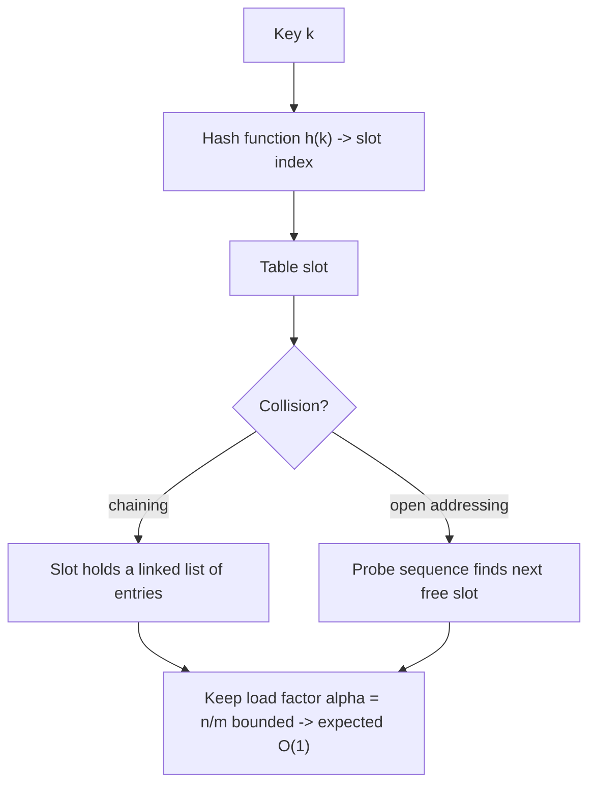

A **hash function** `h` maps a key to one of `m` slots; ideally it spreads keys uniformly (simple uniform hashing). When two keys collide, **chaining** stores them in a per-slot linked list — expected search cost is `Θ(1 + α)` where `α = n/m` is the **load factor** — while **open addressing** stores all entries in the table itself and probes a sequence of slots (linear, quadratic, or double hashing) until it finds the key or an empty slot. Keeping `α` bounded (e.g. resizing — an amortized `O(1)` operation from Part V — when the table gets too full) keeps expected operations constant. The worst case is still `O(n)` (all keys collide), which is why adversarial inputs need a **randomized/seeded** hash.

### 10.4 Architecture: choosing an elementary structure

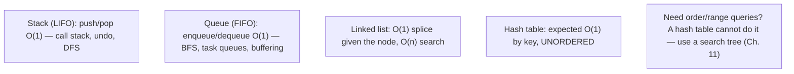

Each structure makes one access pattern cheap. Use a **stack** for LIFO (recursion, backtracking, undo), a **queue** for FIFO (BFS, pipelines, buffering), a **linked list** when you splice nodes in the middle and rarely search, and a **hash table** for lookup-by-key when order does not matter. The decisive limitation of a hash table is that it is **unordered**: it cannot answer "smallest key ≥ x", "keys in `[a, b]`", or "elements in sorted order" — those need a **balanced search tree** (Chapter 11). Picking the structure is choosing which operation you want to be `O(1)`.

### 10.5 Real example

**Scenario.** A service must detect duplicate request IDs in a stream of millions of requests and reject repeats.

**Problem.** Checking each new ID against all previously seen IDs with a linear scan is `O(n)` per request — `O(n²)` overall — and collapses under load.

**Solution.** Keep seen IDs in a **hash set**: membership test and insert are each expected `O(1)`, so the whole stream is `O(n)`.

**Implementation.**

```text
seen = hash_set()                   # expected O(1) operations
for request in stream:
    if request.id in seen:           # expected O(1) membership
        reject(request)              # duplicate
    else:
        seen.add(request.id)         # expected O(1) insert
        process(request)

# Expected O(1) per request because a good hash spreads IDs across slots and
# the load factor is kept bounded by resizing (amortized O(1), Part V).
# Adversarial IDs? Use a SEEDED hash to avoid worst-case O(n) collisions.
```

**Result.** Duplicate detection runs in `O(n)` total instead of `O(n²)`; the service keeps up with millions of requests. The only caveats are bounding memory (evict old IDs, or use a fixed-size structure) and seeding the hash so untrusted IDs cannot force worst-case collisions.

**Future improvements.** When the exact set is too large to keep in memory, switch to a **Bloom filter** (probabilistic membership in tiny space, with a tunable false-positive rate) or a sliding-window cache that expires old IDs; when ordering or range queries are also needed, use a balanced search tree instead.

### 10.6 Exercises

1. State the expected and worst-case time of hash-table lookup, and what causes each.
2. Define the load factor `α` and explain its role in chaining's `Θ(1 + α)` cost.
3. Contrast chaining with open addressing for collision resolution.
4. Name one query a hash table *cannot* answer efficiently and the structure that can.

### 10.7 Challenges

- **Challenge.** Implement a hash table with chaining and one with open addressing (linear probing). Measure average probe length as the load factor rises from 0.5 to 0.95 for each, and observe open addressing degrading faster. Then trigger worst-case `O(n)` behavior with deliberately colliding keys and fix it with a seeded hash.

### 10.8 Checklist

- [ ] I use a hash table/set for expected `O(1)` lookup-by-key.
- [ ] I keep the load factor bounded (resize) to preserve expected `O(1)`.
- [ ] I seed/randomize the hash when keys are untrusted.
- [ ] I reach for a search tree when I need ordering or range queries.
- [ ] I bound queue/set memory to avoid unbounded growth.

### 10.9 Best practices

- Replace nested-scan membership/joins with hash sets/maps.
- Resize the table to keep the load factor in a healthy range.
- Use a seeded hash function in any public-facing service.
- Match the structure to the access pattern: LIFO→stack, FIFO→queue, by-key→hash, ordered→tree.

### 10.10 Anti-patterns

- Linear scans for membership where a hash set gives expected `O(1)`.
- Letting a hash table's load factor approach 1 (operations degrade).
- A fixed, unseeded hash in a service exposed to untrusted keys (hash flooding).
- Forcing ordering/range queries onto a hash table instead of using a tree.

### 10.11 Troubleshooting

| Symptom | Likely cause | Action |
|---------|--------------|--------|
| Lookups slow as data grows | Linear scan instead of hashing | Use a hash set/map (expected `O(1)`) |
| Hash table latency spikes | High load factor or adversarial collisions | Resize to lower `α`; use a seeded hash |
| "Sorted order / range" needed but missing | Hash tables are unordered | Switch to a balanced search tree (Ch. 11) |
| Queue exhausts memory | Unbounded growth | Bound capacity / apply backpressure |

### 10.12 References

- T. Cormen, C. Leiserson, R. Rivest, C. Stein, *Introduction to Algorithms*, 4th ed. (MIT Press, 2022), ch. 10 "Elementary Data Structures" (§10.1 stacks and queues, §10.2 linked lists) and ch. 11 "Hash Tables" (§11.2 hash tables, §11.3 hash functions, §11.4 open addressing) — ISBN 978-0262046305.
- R. Sedgewick, K. Wayne, *Algorithms*, 4th ed. (Addison-Wesley, 2011), §3.4 (hash tables) & §1.3 (stacks/queues) — ISBN 978-0321573513.

---

## Chapter 11 — Balanced search trees and disjoint sets

### 11.1 Introduction

When you need **order** — sorted iteration, range queries, "next larger key" — a hash table cannot help; you need a **binary search tree (BST)**, where an in-order walk yields sorted keys and search follows the tree downward. A plain BST is `O(h)` per operation, where `h` is the height — great when balanced (`O(log n)`) but `O(n)` when it degenerates into a list. **Balanced** BSTs fix this: **red-black trees** maintain `O(log n)` height with colored nodes and rotations, and **B-trees** generalize to high branching factor so each node fills a disk block, the structure behind databases and filesystems. This chapter also covers the **disjoint-set (union-find)** structure, whose `union` and `find` run in near-constant **amortized** time and which underpins Kruskal's MST and connectivity queries.

### 11.2 Business context

Balanced search trees are the ordered counterpart to hash tables, and they power systems where range and order matter. **B-trees / B⁺-trees** are *the* index structure in relational databases (PostgreSQL, MySQL/InnoDB), key-value stores, and filesystems — chosen because their high fan-out minimizes slow disk/SSD reads, turning a lookup into a handful of block fetches. In-memory ordered maps (C++ `std::map`, Java `TreeMap`) are red-black trees, used whenever you need sorted keys, range scans, or floor/ceiling queries. **Union-find** is the workhorse of connectivity: detecting cycles while building a minimum spanning tree (Kruskal, Part VII), grouping connected components, image segmentation, and "are these two accounts in the same fraud ring?" queries. The business payoff is keeping ordered and connectivity operations at `O(log n)` or near-`O(1)` as data scales to billions of rows.

### 11.3 Theoretical concepts: keeping trees balanced; union-find

```mermaid
flowchart TB
    bst["BST: in-order walk = sorted; search/insert/delete O(h)"] --> bal["Unbalanced -> h = O(n); balanced -> h = O(log n)"]
    bal --> rb["Red-black tree: color invariants + rotations keep h = O(log n)"]
    bal --> bt["B-tree: high fan-out, every leaf at the same depth — disk-friendly"]
    rb --> uf["Union-find (disjoint sets)"]
    uf --> opt["Union by rank + path compression -> near-constant amortized"]
```

A BST stores keys so that left subtree < node < right subtree, making search, insert, and delete `O(h)`. The whole game is bounding `h`. **Red-black trees** color nodes red/black and enforce invariants (no two reds in a row; equal black-height on all paths) that force `h ≤ 2 log(n+1)`; **rotations** restore the invariants after insert/delete in `O(log n)`. **B-trees** instead make each node hold many keys and children (fan-out in the hundreds), so the tree is very shallow and each node maps to one disk block — minimizing I/O. **Union-find** keeps elements in disjoint sets with two optimizations — **union by rank** (attach the shorter tree under the taller) and **path compression** (flatten the find path) — giving a sequence of `m` operations a cost of `O(m·α(n))`, where `α` (inverse Ackermann) is ≤ 4 for any practical `n`: effectively constant.

### 11.4 Architecture: which ordered/connectivity structure

```mermaid
flowchart TB
    rb["Red-black / balanced BST: in-memory ordered map, O(log n), range + floor/ceiling"]
    bt["B-tree / B+-tree: on-disk index, high fan-out, minimizes block reads"]
    uf["Union-find: dynamic connectivity, near-O(1) union/find"]
    hash["(Hash table from Ch. 10: faster by-key, but UNORDERED)"]
    note["Order/range -> tree; pure key lookup -> hash; grouping/connectivity -> union-find"]
```

The choice follows the access pattern. For **in-memory ordered** data with range and successor queries, a balanced BST (red-black) gives `O(log n)`. For data **on disk** (databases, filesystems), a **B-tree** wins because its fan-out turns a lookup into a few block reads rather than `log₂ n` pointer chases. For **dynamic connectivity / grouping**, **union-find** is unbeatable at near-constant amortized cost. And remember Chapter 10's contrast: if you need *only* key lookup and never order, a hash table is faster — the tree's `O(log n)` buys you ordering you would otherwise lack.

### 11.5 Real example

**Scenario.** Build a minimum spanning tree of a large network, which requires repeatedly asking "would adding this edge create a cycle?" — i.e., "are these two endpoints already connected?"

**Problem.** Recomputing connectivity from scratch for each candidate edge (e.g. a graph traversal) is `O(V + E)` per query — far too slow across all edges.

**Solution.** Use **union-find**: each vertex starts in its own set; `find` returns a vertex's set representative, and two vertices are connected iff they share one. Adding an edge does a `union`. With union by rank + path compression, each operation is near-constant amortized.

**Implementation.**

```text
make_set(x):  parent[x] = x;  rank[x] = 0

find(x):                                   # with PATH COMPRESSION
    if parent[x] != x:
        parent[x] = find(parent[x])         # point x straight at the root
    return parent[x]

union(x, y):                               # with UNION BY RANK
    rx, ry = find(x), find(y)
    if rx == ry: return false               # already connected -> edge makes a cycle
    if rank[rx] < rank[ry]: rx, ry = ry, rx
    parent[ry] = rx
    if rank[rx] == rank[ry]: rank[rx] += 1
    return true                             # merged two components

# Kruskal: sort edges by weight, add an edge iff union() returns true.
# m operations cost O(m * alpha(n)) — alpha(n) <= 4 in practice: effectively O(m).
```

**Result.** Connectivity queries that powered the MST build run in effectively constant time each, so Kruskal's algorithm is dominated by the `O(E log E)` edge sort rather than connectivity checks. The same structure answers "are these two nodes in the same component?" across billions of operations at near-`O(1)`.

**Future improvements.** For connectivity that also supports **deletion** (edges removed over time), union-find alone is insufficient (it only merges) — use a link-cut tree or an offline/dynamic-connectivity algorithm; for ordered keys with heavy concurrent access, consider lock-free skip lists as an alternative to balanced trees.

### 11.6 Exercises

1. Why is a plain BST `O(n)` in the worst case, and how do red-black trees prevent it?
2. Why are B-trees preferred over red-black trees for on-disk indexes?
3. Explain how union by rank and path compression each reduce union-find's cost.
4. Which queries force a search tree over a hash table?

### 11.7 Challenges

- **Challenge.** Implement union-find with both union by rank and path compression, then use it to build Kruskal's MST on a large random graph. Empirically show the near-constant per-operation cost. Separately, insert sorted data into a plain BST (watch it degenerate to `O(n)` height) and compare with a balanced (red-black or library `TreeMap`) tree.

### 11.8 Checklist

- [ ] I use a balanced BST (not a plain BST) when worst-case `O(log n)` matters.
- [ ] I use a B-tree/B⁺-tree for on-disk or block-oriented indexes.
- [ ] I use union-find for dynamic connectivity / grouping.
- [ ] I apply both union by rank and path compression to union-find.
- [ ] I choose a tree over a hash table only when I need order or range queries.

### 11.9 Best practices

- Prefer the standard library's balanced map (`TreeMap`, `std::map`) over hand-rolled BSTs.
- Use B-trees for anything backed by disk/SSD to minimize block reads.
- Always pair union by rank with path compression for near-constant union-find.
- Reach for a search tree precisely when ordering, range, or floor/ceiling queries are needed.

### 11.10 Anti-patterns

- Inserting ordered data into an unbalanced BST (degenerates to an `O(n)` list).
- Using red-black trees for large on-disk indexes where B-trees fit the block model.
- Union-find without path compression (loses the near-constant bound).
- Choosing an ordered tree when a hash table's faster unordered lookup would do.

### 11.11 Troubleshooting

| Symptom | Likely cause | Action |
|---------|--------------|--------|
| BST operations are `O(n)` | Tree degenerated (sorted inserts) | Use a balanced tree (red-black) or library map |
| Disk index does too many reads | Low fan-out structure (e.g. binary tree) | Use a B-tree/B⁺-tree to match block size |
| Connectivity checks too slow | Re-traversing the graph per query | Use union-find with rank + path compression |
| Range/sorted queries impossible | Data kept in a hash table | Move to a balanced search tree |

### 11.12 References

- T. Cormen, C. Leiserson, R. Rivest, C. Stein, *Introduction to Algorithms*, 4th ed. (MIT Press, 2022), ch. 12 "Binary Search Trees", ch. 13 "Red-Black Trees" (§13.2 rotations, §13.3 insertion), ch. 18 "B-Trees", and ch. 19 "Data Structures for Disjoint Sets" (§19.3 disjoint-set forests, §19.4 union by rank with path compression) — ISBN 978-0262046305.
- R. Sedgewick, K. Wayne, *Algorithms*, 4th ed. (Addison-Wesley, 2011), §3.3 (balanced search trees) & §1.5 (union-find) — ISBN 978-0321573513.

---

> **End of Part VI.** The right data structure decides an algorithm's speed. **Hash tables** give expected `O(1)` lookup-by-key (dictionaries, caches, dedup, joins) but are **unordered**; **stacks**, **queues**, and **linked lists** make one access pattern `O(1)`. When **order** matters, **balanced search trees** guarantee `O(log n)` — **red-black trees** in memory, **B-trees** on disk (the index behind every database) — and the **disjoint-set (union-find)** structure answers connectivity queries in near-constant amortized time via union by rank and path compression. **Part VII — Graph algorithms** builds directly on these structures (priority queues, union-find) to traverse and optimize networks.

---

## Part VII – Graph algorithms

A **graph** — vertices joined by edges — models almost any network: roads, social connections, dependencies, the web, supply chains, circuits. Graph algorithms are how we traverse, order, and optimize these networks, and they bring together everything so far: BFS/DFS use **queues and stacks**, Prim and Dijkstra use a **priority queue (heap)**, and Kruskal uses **union-find**. This part covers the two pillars: **graph search** (BFS, DFS, topological sort, strongly connected components) and **minimum spanning trees**, then the optimization classics — **shortest paths** (Dijkstra, Bellman–Ford, Floyd–Warshall) and **network flow** (max-flow / min-cut and bipartite matching).

---

## Chapter 12 — Graph search and minimum spanning trees

### 12.1 Introduction

The two fundamental graph traversals are **breadth-first search (BFS)**, which explores level by level from a source using a **queue** and finds **shortest paths in unweighted graphs**, and **depth-first search (DFS)**, which dives as deep as possible using a **stack**/recursion and reveals structure through its edge classification. DFS powers **topological sort** (a linear order of a DAG respecting all dependencies) and **strongly connected components** (maximal mutually-reachable groups). Both run in **`O(V + E)`** on an adjacency-list representation. The chapter's second theme is the **minimum spanning tree (MST)** — the cheapest set of edges connecting all vertices — solved greedily by **Kruskal**'s algorithm (sort edges, add if no cycle, using union-find) and **Prim**'s (grow a tree using a priority queue).

### 12.2 Business context

Graph search is everywhere a network needs traversing. **BFS** finds shortest hop-distance: degrees of separation in a social graph, the fewest moves in a puzzle, web crawling by proximity, GPS routing on unweighted maps. **DFS** drives dependency resolution and cycle detection — and **topological sort** is *the* algorithm behind build systems (Make, Bazel), package managers (npm, Maven resolving install order), task schedulers, and spreadsheet recalculation: anything that must order steps so each runs after its prerequisites. **Strongly connected components** find tightly-coupled modules, deadlock cycles, and link-farm clusters. **MST** is direct cost optimization: laying minimum-cost cable/road/pipe networks, clustering, and approximation building blocks (Part VIII). These are bread-and-butter algorithms whose absence forces teams to reinvent slow, buggy versions.

### 12.3 Theoretical concepts: traversal and the greedy MST

```mermaid
flowchart TB
    rep["Adjacency list: O(V+E) space, iterate neighbors fast"] --> bfs["BFS: queue, level order -> unweighted shortest paths, O(V+E)"]
    rep --> dfs["DFS: stack/recursion, edge classification, O(V+E)"]
    dfs --> topo["Topological sort of a DAG (DFS finish order)"]
    dfs --> scc["Strongly connected components"]
    rep --> mst["MST: Kruskal (sort edges + union-find) / Prim (priority queue)"]
```

A graph is usually stored as an **adjacency list** (`O(V + E)` space, efficient neighbor iteration) rather than an adjacency matrix (`O(V²)`, good only for dense graphs). **BFS** processes vertices in a FIFO queue, so it discovers them in increasing distance from the source — giving unweighted shortest paths. **DFS** recurses (or uses an explicit stack), and the order in which vertices *finish* gives a **topological sort** of a DAG; running DFS twice (on the graph and its transpose) yields **strongly connected components**. **MST** algorithms are greedy (Part V): **Kruskal** sorts all edges and adds the next-cheapest that does not form a cycle (cycle test = union-find `find`), `O(E log E)`; **Prim** grows one tree, repeatedly adding the cheapest edge leaving it via a **min-priority queue**, `O(E log V)`.

### 12.4 Architecture: which traversal/MST algorithm

```mermaid
flowchart TB
    bfs["Unweighted shortest path / fewest hops -> BFS"]
    dfs["Reachability, cycle detection, structure -> DFS"]
    topo["Order tasks with dependencies (DAG) -> topological sort"]
    scc["Find mutually-reachable groups -> strongly connected components"]
    kruskal["Sparse graph, edges easy to sort -> Kruskal (+ union-find)"]
    prim["Dense graph / streaming edges from a start -> Prim (+ heap)"]
```

Pick the traversal by the question: **BFS** for fewest-hops/unweighted-shortest-path, **DFS** for reachability, cycle detection, and the structural algorithms (topo sort, SCC). For **MST**, both Kruskal and Prim are correct and greedy; **Kruskal** (edge-centric, union-find) is natural for sparse graphs or when edges arrive as a sortable list, while **Prim** (vertex-centric, heap) suits dense graphs or growing a tree from a seed. Both depend on data structures from Part VI — which is why graph algorithms are where the whole curriculum converges.

### 12.5 Real example

**Scenario.** A build system must run tasks so that every task runs only after the tasks it depends on, and must reject impossible (cyclic) dependency graphs.

**Problem.** Dependencies form a directed graph; running tasks in arbitrary order breaks builds, and a dependency cycle (A needs B needs A) must be detected, not looped on forever.

**Solution.** Model tasks as a DAG and compute a **topological sort** with DFS: a vertex is emitted only after all its dependents finish, and a *back edge* discovered during DFS signals a cycle.

**Implementation.**

```text
topological_sort(G):                         # G is a DAG of tasks
    visited = {}; on_stack = {}; order = []   # order built in reverse
    def dfs(u):
        visited[u] = true; on_stack[u] = true
        for v in G.adj[u]:
            if not visited[v]: dfs(v)
            elif on_stack[v]: raise CycleError  # back edge -> cyclic deps
        on_stack[u] = false
        order.append(u)                        # u FINISHES -> prepend later
    for u in G.vertices:
        if not visited[u]: dfs(u)
    return reverse(order)                       # dependencies before dependents

# O(V + E): each vertex and edge visited once. A back edge means the build
# graph has a cycle and cannot be ordered.
```

**Result.** Tasks run in a valid dependency order in `O(V + E)`, and cyclic dependency graphs are rejected with a clear error instead of hanging. This is exactly how Make, Bazel, and package managers schedule work.

**Future improvements.** For **parallel** builds, use Kahn's algorithm (BFS over in-degrees) to expose all currently-runnable tasks (in-degree 0) as a frontier you can execute concurrently; for incremental builds, recompute the topological order only over the affected subgraph.

### 12.6 Exercises

1. Why does BFS find shortest paths in *unweighted* graphs but not weighted ones?
2. How does DFS's finish order produce a topological sort, and what edge type signals a cycle?
3. Compare Kruskal and Prim — data structures used, complexity, and when each fits.
4. Why is an adjacency list usually preferred over an adjacency matrix?

### 12.7 Challenges

- **Challenge.** Implement BFS and DFS on an adjacency-list graph. Use DFS for a topological sort with cycle detection, then re-implement the topo sort with Kahn's in-degree BFS and expose the parallelizable frontier. Separately, build an MST with both Kruskal (union-find) and Prim (heap) and confirm they produce equal total weight.

### 12.8 Checklist

- [ ] I store graphs as adjacency lists unless they are dense.
- [ ] I use BFS for unweighted shortest paths and DFS for structure/cycles.
- [ ] I topologically sort dependency DAGs and detect cycles via back edges.
- [ ] I build MSTs greedily with Kruskal (union-find) or Prim (heap).
- [ ] I reuse the right Part VI structure (queue, stack, heap, union-find) for each.

### 12.9 Best practices

- Default to adjacency lists for `O(V + E)` traversals.
- Detect dependency cycles explicitly (back edges / in-degree never reaching 0).
- Use Kahn's algorithm when you want to parallelize independent tasks.
- Lean on union-find (Kruskal) and priority queues (Prim) rather than re-deriving them.

### 12.10 Anti-patterns

- Using an adjacency matrix for a sparse graph (`O(V²)` space wasted).
- Applying BFS to a *weighted* graph expecting shortest paths (use Dijkstra).
- Running tasks without topologically ordering their dependencies.
- Ignoring cycle detection and looping forever on cyclic input.

### 12.11 Troubleshooting

| Symptom | Likely cause | Action |
|---------|--------------|--------|
| "Shortest path" wrong on weighted graph | BFS ignores edge weights | Use Dijkstra / Bellman–Ford (Ch. 13) |
| Build runs tasks out of order | No topological sort | Topologically sort the dependency DAG |
| Scheduler hangs on cyclic deps | No cycle detection | Detect back edges / in-degree stall and error out |
| Graph traversal uses too much memory | Adjacency matrix on a sparse graph | Switch to an adjacency list |

### 12.12 References

- T. Cormen, C. Leiserson, R. Rivest, C. Stein, *Introduction to Algorithms*, 4th ed. (MIT Press, 2022), ch. 20 "Elementary Graph Algorithms" (§20.1 representations, §20.2 breadth-first search, §20.3 depth-first search, §20.4 topological sort, §20.5 strongly connected components) and ch. 21 "Minimum Spanning Trees" (§21.2 Kruskal and Prim) — ISBN 978-0262046305.
- J. Kleinberg, É. Tardos, *Algorithm Design* (Pearson, 2005), ch. 3 (graph traversal) & ch. 4 (MST) — ISBN 978-0321295354.

---

## Chapter 13 — Shortest paths and network flow

### 13.1 Introduction

When edges carry **weights** (distance, cost, time), BFS no longer finds shortest paths; we need dedicated algorithms. **Dijkstra**'s algorithm finds single-source shortest paths in graphs with **non-negative** weights, using a min-priority queue to greedily settle the closest vertex, in `O(E log V)`. **Bellman–Ford** handles **negative** edge weights and **detects negative cycles**, in `O(VE)`. **Floyd–Warshall** computes **all-pairs** shortest paths with a compact dynamic program in `O(V³)`. The chapter's second topic is **network flow**: the **maximum-flow / minimum-cut** problem (Ford–Fulkerson / Edmonds–Karp) and its elegant reduction of **bipartite matching** — assigning one set to another optimally — to a flow computation.

### 13.2 Business context

Shortest-path algorithms are the math behind navigation and networking. **Dijkstra** powers GPS routing, network packet routing (a variant underlies OSPF), and any "cheapest/fastest path" query; **Bellman–Ford** is used where weights can be negative (currency-exchange arbitrage detection, where a negative cycle is a profit loop) and in distributed distance-vector routing; **Floyd–Warshall** precomputes all pairwise distances for small dense graphs (transit maps, game AI). **Network flow** models throughput and assignment: maximum traffic through a pipeline/network, **bipartite matching** for job/worker assignment, ad-to-slot allocation, scheduling, and the famous min-cut for image segmentation and reliability (the cheapest set of links whose failure disconnects the network). These are direct optimizations with measurable money and latency attached.

### 13.3 Theoretical concepts: relaxation, and flow/cut duality

```mermaid
flowchart TB
    relax["Relaxation: if dist[u]+w(u,v) < dist[v], update dist[v]"] --> dij["Dijkstra: settle nearest via min-heap (non-negative weights), O(E log V)"]
    relax --> bf["Bellman-Ford: relax all edges V-1 times; extra pass detects negative cycle, O(VE)"]
    relax --> fw["Floyd-Warshall: DP over intermediate vertices, all-pairs, O(V^3)"]
    flow["Max-flow (Ford-Fulkerson/Edmonds-Karp): augmenting paths"] --> mincut["Max-flow = min-cut; models bipartite matching"]
```

All shortest-path algorithms share one primitive: **relaxation** — try to improve `dist[v]` using the edge `(u, v)`. **Dijkstra** relaxes greedily, always finalizing the closest unsettled vertex (correct only with non-negative weights, because a settled vertex's distance must never improve later). **Bellman–Ford** relaxes *every* edge `V−1` times (a shortest path has at most `V−1` edges); a further relaxation that still improves something proves a **negative cycle**. **Floyd–Warshall** is a DP: `dist[i][j]` allowing intermediate vertices `1..k` is built from `k−1`. For **flow**, the **Ford–Fulkerson** method repeatedly pushes flow along an augmenting path in the residual graph until none remains; the **max-flow min-cut theorem** says the maximum flow equals the capacity of the cheapest cut — and modeling each match as a unit-capacity edge reduces **bipartite matching** to max flow.

### 13.4 Architecture: choosing a shortest-path / flow method

```mermaid
flowchart TB
    dij["Non-negative weights, single source -> Dijkstra (min-heap)"]
    bf["Negative weights / detect negative cycle -> Bellman-Ford"]
    fw["All pairs, small dense graph -> Floyd-Warshall"]
    bfs2["Unweighted -> plain BFS (Ch. 12)"]
    flow["Throughput / assignment / matching -> max-flow (min-cut)"]
```

Choose by the weight model and the question. **Unweighted?** BFS (Chapter 12). **Non-negative weights, one source?** Dijkstra. **Negative weights, or need to detect a negative cycle?** Bellman–Ford. **Every pair of distances on a small dense graph?** Floyd–Warshall. For **throughput or optimal assignment**, formulate it as **max-flow**: matching, scheduling, and connectivity reliability all reduce to flow, and the **min-cut** dual often answers the "what's the bottleneck?" question directly. Recognizing that a business problem *is* a flow/matching problem is frequently the hardest and most valuable step.

### 13.5 Real example

**Scenario.** A navigation feature must compute the fastest route between two points on a road network where each road segment has a travel time.

**Problem.** The graph is weighted, so BFS (Chapter 12) gives the fewest *segments*, not the fastest *time*. We need shortest paths by weight, and travel times are non-negative.

**Solution.** Run **Dijkstra**'s algorithm from the origin with a min-priority queue keyed on tentative distance; settle the closest vertex each step until the destination is finalized.

**Implementation.**

```text
dijkstra(G, source):
    dist = {v: +infinity for v in G};  dist[source] = 0
    pq = min_heap()                      # keyed on tentative distance
    pq.push(source, 0)
    while pq not empty:
        u, d = pq.pop_min()              # closest unsettled vertex
        if d > dist[u]: continue          # stale entry
        for (v, w) in G.adj[u]:           # RELAX each outgoing edge
            if dist[u] + w < dist[v]:
                dist[v] = dist[u] + w
                pq.push(v, dist[v])
    return dist                           # store predecessors to rebuild the path

# O(E log V) with a binary heap. Correct because weights are non-negative:
# once popped, a vertex's distance is final. Negative weights? Use Bellman-Ford.
```

**Result.** The fastest route by travel time is computed in `O(E log V)`; storing each vertex's predecessor lets the feature reconstruct the actual road sequence. The min-heap from Part VI is what makes "settle the nearest vertex" efficient.

**Future improvements.** For continental-scale maps, plain Dijkstra is too slow; production routers add a **goal-directed heuristic (A\*)**, **bidirectional search**, or heavy **preprocessing** (contraction hierarchies) to answer queries in microseconds. If some weights could be negative (e.g. rebates), switch to Bellman–Ford or Johnson's algorithm.

### 13.6 Exercises

1. Why does Dijkstra require non-negative edge weights to be correct?
2. How does Bellman–Ford detect a negative-weight cycle?
3. State the running times of Dijkstra, Bellman–Ford, and Floyd–Warshall and when each is the right choice.
4. Explain how bipartite matching reduces to a maximum-flow problem.

### 13.7 Challenges

- **Challenge.** Implement Dijkstra with a binary heap and Bellman–Ford. Construct a graph with a negative cycle and confirm Bellman–Ford reports it while Dijkstra gives wrong answers. Then model a small job-assignment problem as bipartite matching, solve it via max-flow (Edmonds–Karp), and verify the matching size equals the max flow.

### 13.8 Checklist

- [ ] I use Dijkstra for non-negative weighted single-source shortest paths.
- [ ] I use Bellman–Ford when weights may be negative or I must detect negative cycles.
- [ ] I use Floyd–Warshall for all-pairs distances on small dense graphs.
- [ ] I recognize assignment/throughput problems as max-flow / bipartite matching.
- [ ] I store predecessors to reconstruct the actual path, not just its length.

### 13.9 Best practices

- Match the algorithm to the weight model (unweighted→BFS, non-negative→Dijkstra, negative→Bellman–Ford).
- Use a min-priority queue (heap) to keep Dijkstra at `O(E log V)`.
- Reduce assignment/scheduling problems to flow/matching rather than ad-hoc heuristics.
- For huge graphs, add A\*/bidirectional/preprocessing on top of Dijkstra.

### 13.10 Anti-patterns

- Running Dijkstra on a graph with negative edges (silently wrong).
- Using Floyd–Warshall (`O(V³)`) on a large sparse graph (run Dijkstra per source instead).
- Hand-rolling assignment heuristics where a clean max-flow/matching formulation is optimal.
- Returning only the distance when the application needs the path itself.

### 13.11 Troubleshooting

| Symptom | Likely cause | Action |
|---------|--------------|--------|
| Shortest paths wrong with some edges | Negative weights under Dijkstra | Switch to Bellman–Ford (or Johnson's) |
| All-pairs computation too slow | Floyd–Warshall on a large sparse graph | Run Dijkstra from each source instead |
| "Infinite" / inconsistent distances | Negative-weight cycle present | Detect it with Bellman–Ford and reject |
| Assignment solution suboptimal | Greedy heuristic instead of matching | Model as bipartite matching / max-flow |

### 13.12 References

- T. Cormen, C. Leiserson, R. Rivest, C. Stein, *Introduction to Algorithms*, 4th ed. (MIT Press, 2022), ch. 22 "Single-Source Shortest Paths" (§22.1 Bellman–Ford, §22.3 Dijkstra), ch. 23 "All-Pairs Shortest Paths" (§23.2 Floyd–Warshall), and ch. 24 "Maximum Flow" (§24.2 the Ford–Fulkerson method, §24.3 maximum bipartite matching) — ISBN 978-0262046305.
- J. Kleinberg, É. Tardos, *Algorithm Design* (Pearson, 2005), ch. 6 (shortest paths) & ch. 7 (network flow) — ISBN 978-0321295354.

---

> **End of Part VII.** Graphs model networks, and their algorithms tie the whole curriculum together. **BFS** (queue) and **DFS** (stack) traverse in `O(V + E)`, with DFS yielding **topological sort** and **strongly connected components**; **MST** algorithms (**Kruskal** with union-find, **Prim** with a heap) connect everything at minimum cost. With weights, **relaxation** drives **Dijkstra** (non-negative, `O(E log V)`), **Bellman–Ford** (negative weights / cycle detection), and **Floyd–Warshall** (all-pairs); and **max-flow / min-cut** solves throughput and **bipartite matching**. Every one of these leans on the data structures of Part VI. **Part VIII — Selected advanced topics** surveys the frontier: strings, number theory and cryptography, the FFT, and the theory of intractability.

---

## Part VIII – Selected advanced topics

The final part surveys specialized algorithms that power real infrastructure and frames the field's deepest practical question: **which problems are efficiently solvable at all?** Chapter 14 covers three high-impact domains — **string matching** (the engine of search and `grep`), **number-theoretic algorithms** (the basis of RSA cryptography), and the **Fast Fourier Transform** (which multiplies polynomials and large numbers in `O(n log n)` and underlies all digital signal processing). Chapter 15 confronts **intractability**: the theory of **NP-completeness** — strong evidence that thousands of important problems have no efficient exact algorithm — and the **approximation algorithms** that deliver provably-near-optimal answers anyway, with a closing survey of **parallel**, **online**, and **machine-learning** algorithms.

---

## Chapter 14 — Strings, number theory, and the FFT

### 14.1 Introduction

Three classic domains show algorithm design at its most powerful. **String matching** finds a pattern of length `m` inside a text of length `n`: the naive scan is `O(nm)`, but **Knuth–Morris–Pratt (KMP)** preprocesses the pattern to achieve `O(n + m)`, and **Rabin–Karp** uses a rolling hash for efficient multi-pattern search. **Number-theoretic algorithms** operate on integers: **Euclid's algorithm** for the greatest common divisor, **modular exponentiation**, and **primality testing** combine into the **RSA** public-key cryptosystem that secures the internet. The **Fast Fourier Transform (FFT)** evaluates and interpolates polynomials in `O(n log n)` via divide and conquer, enabling fast polynomial and big-integer multiplication and all of digital signal processing.

### 14.2 Business context

These algorithms are infrastructure. **String matching** is `grep`, `Ctrl-F`, log scanning, intrusion-detection signature matching, and DNA sequence search — KMP's linear bound is what makes searching gigabyte texts instant. **Number-theoretic algorithms** are **cryptography**: RSA and Diffie–Hellman rely on modular exponentiation being fast while factoring is believed hard, so every HTTPS handshake, signed software update, and encrypted message runs these algorithms; an `O(log n)` modular exponentiation (square-and-multiply) versus a naive `O(n)` one is the difference between practical and impossible. The **FFT** is the most-used algorithm in signal processing — audio/video compression (MP3, JPEG), radar, telecommunications, and fast multiplication of the huge integers in cryptography. Each turns an `O(n²)` (or exponential) naive approach into something fast enough to deploy.

### 14.3 Theoretical concepts: preprocessing, modular arithmetic, divide-and-conquer transforms

```mermaid
flowchart TB
    naive["Naive string match: re-check from scratch on mismatch, O(nm)"] --> kmp["KMP: precompute failure function -> never re-scan text, O(n+m)"]
    euclid["Euclid: gcd(a,b)=gcd(b, a mod b) -> O(log) steps"] --> modexp["Modular exponentiation by squaring -> O(log e)"]
    modexp --> rsa["RSA: easy to encrypt/decrypt, hard to factor"]
    fft["FFT: evaluate polynomial at roots of unity, divide & conquer -> O(n log n)"]
```

Each domain has one key idea. **KMP** precomputes a **failure function** that says, on a mismatch, how far the pattern can shift without missing a match — so the text pointer never moves backward, giving `O(n + m)`. **Number theory** rests on **modular arithmetic**: Euclid's `gcd(a, b) = gcd(b, a mod b)` terminates in `O(log)` steps, and **modular exponentiation by repeated squaring** computes `aᵉ mod n` in `O(log e)` multiplications — the operation that makes RSA practical while its inverse (factoring) stays hard. The **FFT** applies divide and conquer (Part II): it evaluates a degree-`n` polynomial at the `n` complex **roots of unity**, exploiting their symmetry so the recurrence `T(n) = 2T(n/2) + O(n)` gives `O(n log n)` instead of the naive `O(n²)`; multiplying two polynomials (or big integers) becomes pointwise multiplication in the transformed domain.

### 14.4 Architecture: matching the algorithm to the domain

```mermaid
flowchart TB
    kmp["Single pattern, large text -> KMP, O(n+m)"]
    rk["Multiple / streaming patterns -> Rabin-Karp rolling hash"]
    crypto["Public-key crypto -> modular exponentiation + primality (RSA)"]
    fft["Convolution / polynomial or big-integer multiply / DSP -> FFT, O(n log n)"]
```

Use **KMP** (or the library regex/substring engine built on similar ideas) for single-pattern search in large texts; **Rabin–Karp** when scanning for many patterns or a streaming hash fits. Reach for **modular exponentiation, Euclid, and primality testing** whenever cryptography is involved — but in practice call a vetted crypto library, never hand-roll RSA. Use the **FFT** for any **convolution**: multiplying large polynomials or integers, filtering signals, or fast correlation. The unifying lesson of this chapter is that clever preprocessing (KMP), the right algebraic structure (modular arithmetic, roots of unity), or a divide-and-conquer reformulation (FFT) collapses a quadratic or exponential cost to near-linear.

### 14.5 Real example

**Scenario.** A log-monitoring tool must find every occurrence of a fixed alert pattern inside a continuously growing, multi-gigabyte log.

**Problem.** The naive matcher re-compares the pattern from scratch after every mismatch — `O(nm)` — which is far too slow at gigabyte scale.

**Solution.** Use **KMP**: precompute the pattern's failure function once, then scan the text once without ever backing up the text pointer — `O(n + m)`.

**Implementation.**

```text
build_failure(P[1..m]):                      # longest proper prefix that is also a suffix
    fail = array of m zeros;  k = 0
    for i in 2..m:
        while k > 0 and P[k+1] != P[i]: k = fail[k]
        if P[k+1] == P[i]: k += 1
        fail[i] = k
    return fail

kmp_search(T[1..n], P[1..m]):
    fail = build_failure(P);  k = 0
    for i in 1..n:                            # text pointer i NEVER moves backward
        while k > 0 and P[k+1] != T[i]: k = fail[k]
        if P[k+1] == T[i]: k += 1
        if k == m:                            # full match ending at i
            report match at i - m + 1
            k = fail[k]                       # keep searching for overlaps

# O(n + m): the failure function lets a mismatch shift the pattern instead of
# re-scanning the text. Naive matching is O(nm).
```

**Result.** The tool scans gigabyte logs in a single linear pass, finding all matches in `O(n + m)`; the one-time `O(m)` preprocessing is negligible. The failure function is what guarantees the text is never re-read.

**Future improvements.** For many patterns at once, use the **Aho–Corasick** automaton (KMP generalized to a trie of patterns); for approximate/fuzzy matching, combine with the edit-distance DP (Part V); for indexed search over a fixed corpus, build a **suffix array/automaton** so repeated queries are sublinear.

### 14.6 Exercises

1. How does KMP's failure function avoid re-scanning the text after a mismatch?
2. Why is modular exponentiation by repeated squaring `O(log e)` and why does RSA need it?
3. What property of the roots of unity lets the FFT reach `O(n log n)`?
4. When would you choose Rabin–Karp over KMP?

### 14.7 Challenges

- **Challenge.** Implement naive matching and KMP, then benchmark both searching a 100 MB text — show KMP's linear scan winning, especially on adversarial patterns like `aaaa…ab`. Separately, implement modular exponentiation by squaring and confirm it computes `a^e mod n` for cryptographically large `e` in milliseconds where the naive loop would never finish.

### 14.8 Checklist

- [ ] I use a linear-time matcher (KMP / library) instead of naive `O(nm)` search.
- [ ] I use Rabin–Karp / Aho–Corasick for multi-pattern or streaming search.
- [ ] I use modular exponentiation by squaring for any large-exponent modular math.
- [ ] I rely on vetted crypto libraries rather than hand-rolling RSA.
- [ ] I reach for the FFT when a problem is really a convolution.

### 14.9 Best practices

- Prefer the standard library's substring/regex engine; understand KMP to know its bounds.
- Use rolling hashes (Rabin–Karp) for multiple or streaming patterns.
- Compute `aᵉ mod n` by repeated squaring, never by iterated multiplication.
- Recognize convolutions (polynomial/integer multiply, filtering) and apply the FFT.

### 14.10 Anti-patterns

- Naive `O(nm)` substring search on large texts.
- Naive `O(n²)` polynomial or big-integer multiplication where the FFT gives `O(n log n)`.
- Hand-rolling cryptographic primitives (RSA, primality) instead of using audited libraries.
- Iterated modular multiplication (`O(e)`) instead of square-and-multiply (`O(log e)`).

### 14.11 Troubleshooting

| Symptom | Likely cause | Action |
|---------|--------------|--------|
| Substring search slow on big text | Naive `O(nm)` matcher | Use KMP / the library matcher (`O(n+m)`) |
| Multi-pattern scan slow | One KMP pass per pattern | Use Aho–Corasick or Rabin–Karp |
| Crypto operation infeasibly slow | Naive modular exponentiation | Use repeated squaring (`O(log e)`) |
| Large polynomial/integer multiply too slow | Schoolbook `O(n²)` | Use FFT-based multiplication |

### 14.12 References

- T. Cormen, C. Leiserson, R. Rivest, C. Stein, *Introduction to Algorithms*, 4th ed. (MIT Press, 2022), ch. 30 "Polynomials and the FFT" (§30.2 the DFT and FFT), ch. 31 "Number-Theoretic Algorithms" (§31.2 GCD, §31.6 powers of an element, §31.7 RSA), and ch. 32 "String Matching" (§32.2 Rabin–Karp, §32.4 Knuth–Morris–Pratt) — ISBN 978-0262046305.
- D. Gusfield, *Algorithms on Strings, Trees, and Sequences* (Cambridge University Press, 1997) — ISBN 978-0521585194.

---

## Chapter 15 — Intractability: NP-completeness and approximation

### 15.1 Introduction

Not every problem has an efficient (polynomial-time) algorithm — and for a large, important class, we have strong evidence that none exists. A problem is in **P** if it is solvable in polynomial time, and in **NP** if a proposed solution can be *verified* in polynomial time. The famous open question **P vs NP** asks whether these are the same. **NP-complete** problems are the hardest in NP: if any one had a polynomial algorithm, *all* of NP would — and thousands of practical problems (SAT, the traveling salesperson, graph coloring, knapsack, set cover) are NP-complete. We show a problem is NP-complete by **reduction** from a known one. When a problem is intractable, we do not give up — we use **approximation algorithms** that run in polynomial time and provably come within a guaranteed factor of optimal.

### 15.2 Business context

Recognizing NP-completeness is one of the most valuable practical skills an engineer can have: it tells you to **stop hunting for an exact efficient algorithm** that almost certainly does not exist, and to pivot to approximation, heuristics, or constraints. A huge number of real problems are NP-complete — **vehicle routing** and logistics (TSP), **scheduling** and timetabling, **bin packing** and resource allocation, **register allocation** in compilers (graph coloring), and circuit/SAT-based verification. The response is not despair but engineering: **approximation algorithms** with proven bounds (a 2-approximation for vertex cover; a `(1+ε)` scheme for subset-sum), **heuristics** (simulated annealing, genetic algorithms) that work well in practice, **exact solvers** (modern SAT/ILP solvers) that handle real instances despite worst-case exponential bounds, and **fixed-parameter** algorithms when a key parameter is small. Knowing the boundary turns a hopeless "make it fast" task into a tractable "make it good enough, provably."

### 15.3 Theoretical concepts: P, NP, completeness, and reduction

```mermaid
flowchart TB
    p["P: solvable in polynomial time"] --> np["NP: a solution is VERIFIABLE in polynomial time"]
    np --> npc["NP-complete: hardest in NP; all NP reduces to it"]
    npc --> red["Prove NP-completeness by REDUCTION from a known NP-complete problem"]
    npc --> resp["Intractable in practice -> approximate / heuristic / restrict"]
    resp --> apx["Approximation: polynomial time, provably within a factor of OPT"]
```

The key relationships: **P ⊆ NP** (solving implies verifying), and **NP-complete** problems are those in NP to which *every* NP problem reduces in polynomial time. To prove a new problem `X` is NP-complete, you (1) show `X ∈ NP` (a solution is checkable quickly) and (2) **reduce** a known NP-complete problem to `X` — transform its instances into `X`'s such that the answers agree — proving `X` is at least as hard. The Cook–Levin theorem gives the first NP-complete problem (SAT) to bootstrap from. Since no polynomial algorithm is known for any NP-complete problem (and one would collapse them all), the engineering response is **approximation**: a polynomial algorithm whose output is guaranteed within a factor `ρ` of optimal (e.g. ≤ 2× for vertex cover), trading exactness for tractability with a *proven* quality bound.

### 15.4 Architecture: responding to an intractable problem

```mermaid
flowchart TB
    detect["Suspect intractability? Try to reduce a known NP-complete problem to yours"] --> conf["Confirmed NP-complete"]
    conf --> approx["Approximation algorithm with a proven ratio"]
    conf --> heur["Heuristic / metaheuristic (annealing, genetic) — no guarantee, good in practice"]
    conf --> exact["Exact solver (SAT/ILP) or fixed-parameter algorithm when an input parameter is small"]
    conf --> restrict["Restrict the input (special graph classes, small dimensions)"]
```

Once a problem is identified as NP-complete, you choose a coping strategy by what the application tolerates. If you need a **provable quality guarantee**, use an **approximation algorithm**. If you only need good answers in practice, use a **heuristic/metaheuristic**. If instances are moderate and you need *exact* answers, modern **SAT/ILP/CP solvers** routinely crack NP-complete instances with thousands of variables despite the worst-case bound. If a key parameter is small (treewidth, solution size), a **fixed-parameter tractable** algorithm may be exact and fast. And often the real instances belong to a **restricted class** (interval graphs, planar graphs, low dimension) where a polynomial algorithm *does* exist. The skill is matching the coping strategy to the constraints, not insisting on an impossible exact-and-fast solution.

### 15.5 Real example

**Scenario.** A delivery company must route a driver through a set of stops with minimum total distance — the **traveling salesperson problem (TSP)**.

**Problem.** TSP is **NP-complete** (its optimization form NP-hard); the exact optimum needs, in the worst case, time exponential in the number of stops, so it is infeasible to solve exactly for hundreds of stops.

**Solution.** Stop seeking the exact optimum. For metric TSP (distances obey the triangle inequality), use a **2-approximation**: build a minimum spanning tree (Part VII), do a preorder walk, and shortcut repeats — the resulting tour is provably at most twice the optimal length, in polynomial time.

**Implementation.**

```text
tsp_2_approx(cities):                         # metric TSP (triangle inequality)
    T = minimum_spanning_tree(cities)          # Prim/Kruskal — Part VII
    tour = preorder_walk(T, root=cities[0])    # DFS visit order of the MST
    tour = remove_duplicates(tour)             # "shortcut" repeated visits
    return tour + [tour[0]]                     # return to start

# Guarantee: cost(tour) <= 2 * cost(OPT).  Why: MST cost <= OPT (dropping an
# edge of the optimal tour leaves a spanning tree), a full walk costs 2*MST,
# and shortcutting only helps under the triangle inequality.  Polynomial time.
```

**Result.** The company gets routes provably within 2× of optimal in polynomial time, where computing the exact optimum was infeasible — and in practice the tours are far better than the worst-case bound. The approximation reuses the MST algorithm from Part VII, showing how the curriculum composes.

**Future improvements.** **Christofides' algorithm** improves the metric-TSP bound to **1.5×** (MST + minimum-weight matching on odd-degree vertices); for real fleets, industrial solvers (LKH heuristic, Google OR-Tools, ILP with cutting planes) get within a fraction of a percent of optimal on thousands of stops despite the NP-hardness.

### 15.6 Exercises

1. Define P, NP, and NP-complete, and state what P = NP would mean.
2. What two things must you show to prove a problem NP-complete?
3. What does a "2-approximation" guarantee, and why is the MST-based TSP tour one?
4. List four engineering responses to an NP-complete problem and when each fits.

### 15.7 Challenges

- **Challenge.** Implement the MST-based 2-approximation for metric TSP and compare its tour length to the exact optimum (brute force) on small instances (≤ 10 cities) to confirm it stays within 2×. Then scale to hundreds of cities where brute force is impossible and observe the approximation still running in polynomial time. Optionally add Christofides and compare the 1.5× bound.

### 15.8 Checklist

- [ ] I try to recognize NP-completeness (via reduction) before chasing an exact efficient algorithm.
- [ ] I distinguish "verifiable in polynomial time" (NP) from "solvable in polynomial time" (P).
- [ ] I choose an approximation with a proven ratio when I need a quality guarantee.
- [ ] I consider exact solvers (SAT/ILP) or FPT algorithms for moderate or low-parameter instances.
- [ ] I check whether my real inputs fall in a tractable restricted class.

### 15.9 Best practices

- Reduce from a known NP-complete problem to confirm intractability before pivoting.
- Prefer approximation algorithms with proven bounds when correctness-quality must be guaranteed.
- Use mature SAT/ILP/CP solvers for exact answers on real-world-sized instances.
- Exploit structure: restricted input classes often admit polynomial exact algorithms.

### 15.10 Anti-patterns

- Searching indefinitely for an efficient *exact* algorithm for an NP-complete problem.
- Deploying an unbounded heuristic where a provable approximation ratio was required.
- Assuming worst-case exponential means "unsolvable in practice" (modern solvers often succeed).
- Ignoring that the real instances may be a special, tractable case.

### 15.11 Troubleshooting

| Symptom | Likely cause | Action |
|---------|--------------|--------|
| No efficient exact algorithm found | Problem is (likely) NP-complete | Prove it by reduction; switch to approximation/heuristic |
| Heuristic results vary wildly in quality | No approximation guarantee | Use an algorithm with a proven ratio |
| Exact solver too slow on big instances | Worst-case exponential blow-up | Try ILP/SAT tuning, decomposition, or approximation |
| Approximation "too loose" for the use case | Generic bound on general inputs | Exploit input structure or use a tighter scheme (e.g. Christofides, PTAS) |

### 15.12 References

- T. Cormen, C. Leiserson, R. Rivest, C. Stein, *Introduction to Algorithms*, 4th ed. (MIT Press, 2022), ch. 34 "NP-Completeness" (§34.1 polynomial time, §34.2 polynomial-time verification, §34.3 reducibility, §34.5 NP-complete problems) and ch. 35 "Approximation Algorithms" (§35.1 vertex cover, §35.2 the traveling-salesperson problem); survey: ch. 26 "Parallel Algorithms", ch. 27 "Online Algorithms", ch. 33 "Machine-Learning Algorithms" — ISBN 978-0262046305.
- M. Garey, D. Johnson, *Computers and Intractability: A Guide to the Theory of NP-Completeness* (W. H. Freeman, 1979) — ISBN 978-0716710455.

---

> **End of Part VIII.** The frontier rewards the same instincts as the rest of the field. **String matching** (KMP, `O(n+m)`), **number-theoretic algorithms** (Euclid, modular exponentiation, RSA), and the **FFT** (`O(n log n)` convolution) each collapse a naive quadratic or exponential cost through preprocessing, algebraic structure, or divide and conquer — and they run the search, cryptography, and signal processing of modern infrastructure. The theory of **NP-completeness** marks the boundary of efficient solvability: thousands of problems are NP-complete (proved by **reduction**), and the professional response is not to chase the impossible but to **approximate** with proven bounds, use exact solvers on real instances, or exploit input structure. With this, the guide spans the full curriculum — from asymptotic analysis to the limits of computation itself.
