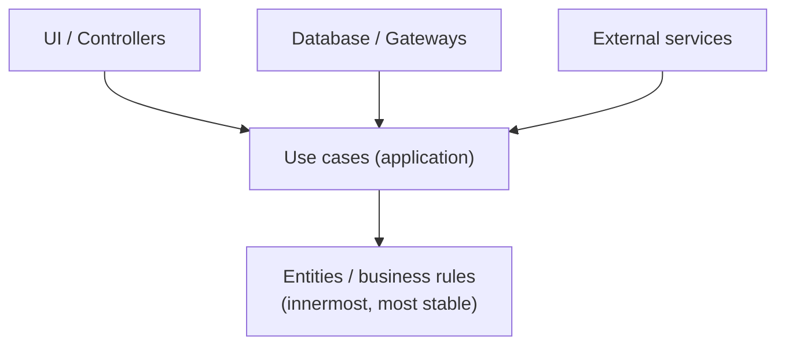
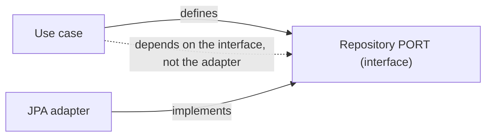
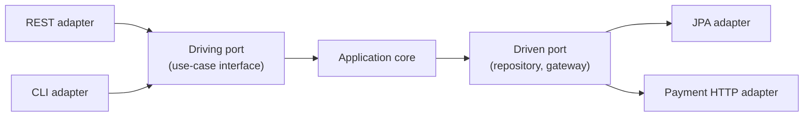
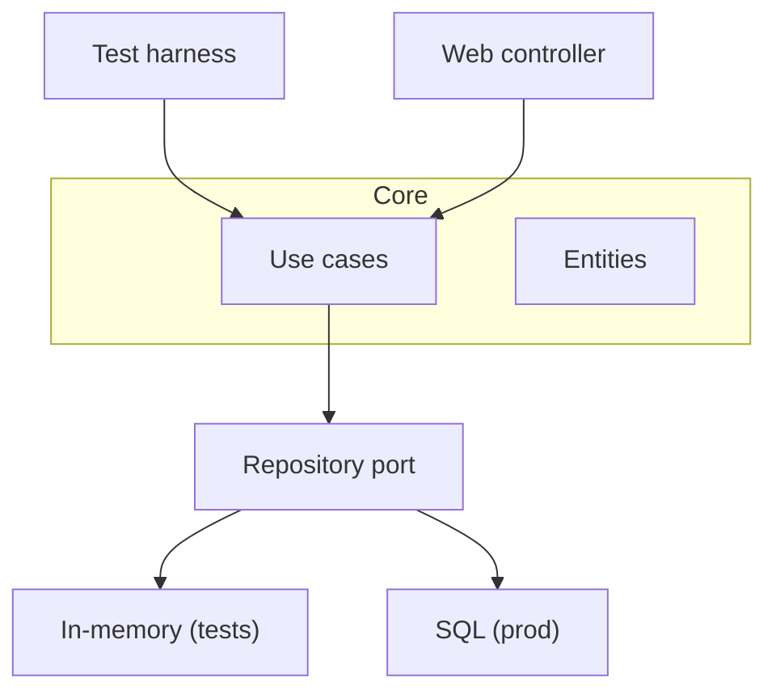

# Architecture Boundaries and the Dependency Rule - Complete Professional Guide

> **Category:** 03_design_and_architecture · **Language:** English

---

### Keeping business rules independent of frameworks, databases, and delivery mechanisms
**Original guide written from first principles, current to 2026**

> **Original reference book (English).** This is an **independent, originally written** guide. It is not an extract, summary, or paraphrase of any third-party book; it teaches architectural boundaries from first principles. Canonical books on the subject are listed under **References** as pointers only. Each chapter follows the TO-BRAIN editorial standard (see `FILE_CONVENTIONS.md`).
>
> **Scope notice:** this guide is about **where to draw lines** in a system so that the parts that change for different reasons can change independently. It covers the dependency rule, ports and adapters (hexagonal), and how to keep business logic free of I/O — with 2026 notes on how this maps to services, serverless, and testability.

---

## How to read this guide

| Level | Profile | Parts |
|-------|---------|-------|
| 1 — Beginner | New to layering | Part I |
| 2 — Intermediate | Designing boundaries | Part II |

**Target audience:** backend engineers, architects, and tech leads deciding how to structure a non-trivial application.

**Structure of each chapter:** Introduction · Business context · Theoretical concepts · Architecture · Diagrams (Mermaid) · Real examples · Step by step · Complete examples · Exercises · Challenges · Checklist · Best practices · Anti-patterns · Troubleshooting · References.

> **Note on prerequisites.** Assumes interfaces/dependency injection and basic layering. The principles are language- and framework-neutral.

---

## Table of Contents

**Part I – The core idea**
1. The dependency rule: point dependencies at stable things
2. Ports and adapters (hexagonal architecture)

**Part II – Applying it**
3. Keeping business rules free of I/O

> **Status of this guide:** phased delivery. **Ready:** Part I (Ch. 1–2). **In progress:** Part II.

---

## Part I – The core idea

Most architectures are really one decision repeated: **which way do the dependencies point?** Get that right and the system stays soft — you can swap a database, change a web framework, or test the rules in isolation. Get it wrong and the business logic is welded to incidental technology, so every infrastructure change becomes a domain change.

---

## Chapter 1 — The dependency rule

### 1.1 Introduction

The **dependency rule** says: source-code dependencies point **inward**, toward higher-level, more stable policy — never outward toward volatile detail. Your business rules must not depend on the database, the web framework, or the UI; those details depend on the rules. This single constraint is what makes an architecture survive technology churn.

### 1.2 Business context

Frameworks, databases, and delivery channels change far faster than core business rules. If the rules depend on those details, every vendor change, framework upgrade, or new channel forces a risky rewrite of logic that should have been stable. Pointing dependencies inward isolates the valuable, slow-changing part from the cheap, fast-changing part — protecting the asset that actually encodes the business.

### 1.3 Theoretical concepts: stable vs volatile



Dependencies flow toward the center. **Entities** (enterprise rules) are the most stable and depend on nothing external. **Use cases** orchestrate them. Everything volatile — UI, DB, frameworks — sits on the outside and depends inward. To call outward (e.g. a use case needs to save data) you **invert** the dependency: the use case defines an interface (a *port*) that an outer adapter implements.

### 1.4 Architecture: dependency inversion at the boundary



The arrow that would naturally point from logic to database is **flipped** by an interface owned by the inner layer. At runtime, dependency injection supplies the adapter; at compile time, the use case knows only the port. This is the mechanism behind "the database is a detail."

### 1.5 Real example

**Scenario.** An order use case must persist orders, today in PostgreSQL, maybe tomorrow elsewhere.

**Problem.** Calling the ORM directly welds the use case to PostgreSQL and makes unit testing require a database.

**Solution.** The use case depends on an `OrderRepository` **port** it defines; a JPA **adapter** implements it on the outside.

**Implementation.**

```java
// inner layer (application) — owns the port, knows nothing about JPA
public interface OrderRepository { Order save(Order o); }

public final class PlaceOrder {
    private final OrderRepository orders;          // depends on the PORT
    public PlaceOrder(OrderRepository orders) { this.orders = orders; }
    public OrderId handle(NewOrder cmd) {
        Order o = Order.create(cmd);               // pure business rule
        return orders.save(o).id();
    }
}

// outer layer (infrastructure) — the detail depends inward
final class JpaOrderRepository implements OrderRepository {
    public Order save(Order o) { /* map + persist via JPA */ return o; }
}
```

**Result.** `PlaceOrder` is unit-testable with an in-memory fake; swapping PostgreSQL for another store changes only the adapter.

**Future improvements.** Define the same pattern for outbound calls (payment, email) so all I/O lives behind ports.

### 1.6 Exercises

1. State the dependency rule in one sentence.
2. How do you call "outward" without depending outward?
3. Why does this make business rules unit-testable without infrastructure?

### 1.7 Challenges

- **Challenge.** Find a use case in your code that imports an ORM or HTTP client directly. Introduce a port it owns and move the concrete call to an adapter. Unit-test the use case with a fake.

### 1.8 Checklist

- [ ] Source dependencies point inward, toward stable policy.
- [ ] Business rules import no framework/DB types.
- [ ] Outbound needs are expressed as ports owned by inner layers.
- [ ] Adapters are injected at runtime.

### 1.9 Best practices

- Let inner layers define interfaces; outer layers implement them.
- Keep entities and use cases free of annotations tied to infrastructure where feasible.
- Treat the database and framework as replaceable details.

### 1.10 Anti-patterns

- Business logic that imports ORM/web-framework classes directly.
- "Layers" that all depend on the database at the bottom (dependencies point outward).
- Ports defined by the adapter (outer) layer, defeating inversion.

### 1.11 Troubleshooting

| Symptom | Likely cause | Action |
|---------|--------------|--------|
| Can't unit-test logic without a DB | Logic depends on infrastructure | Introduce ports; inject fakes |
| Framework upgrade forces domain edits | Rules coupled to the framework | Move framework calls to adapters |
| Swapping a vendor touches many files | No boundary around the detail | Put the vendor behind a single adapter |

### 1.12 References

- R. C. Martin, *Clean Architecture* (Prentice Hall, 2017) — ISBN 978-0134494166.
- A. Cockburn, "Hexagonal Architecture" (ports and adapters), https://alistair.cockburn.us/hexagonal-architecture/.

---

## Chapter 2 — Ports and adapters (hexagonal architecture)

### 2.1 Introduction

**Hexagonal architecture** (ports and adapters) is a concrete shape for the dependency rule. The application sits in the middle, exposing **ports** (interfaces) for everything it offers and everything it needs. **Adapters** on the outside connect those ports to specific technologies — a REST controller, a JPA repository, a Kafka consumer. The application core never names a technology.

### 2.2 Business context

Ports and adapters let you defer and change technology decisions cheaply, and — crucially — test the core in isolation at high speed. The same core can be driven by HTTP, a CLI, a message queue, or a test harness, because each is just another adapter. This flexibility is what keeps a long-lived system from being held hostage by an early framework choice.

### 2.3 Theoretical concepts: driving vs driven



- **Driving (primary) ports** are how the outside *calls in* — the use-case interfaces. Driving adapters (web, CLI, tests) invoke them.
- **Driven (secondary) ports** are what the core *needs from* the outside — repositories, gateways. Driven adapters implement them.

The core depends only on its own ports; adapters depend on the core. Symmetry by design.

### 2.4 Architecture: one core, many adapters



In tests the driven port is backed by an in-memory adapter; in production by SQL. Same core, different wiring — which is exactly why the core tests are fast and deterministic.

### 2.5 Real example

**Scenario.** A pricing service must be callable by both an HTTP API and a nightly batch job.

**Problem.** Embedding the logic in the HTTP controller makes the batch job duplicate it.

**Solution.** Put pricing in a driving port (`CalculatePrice`); the controller and the batch job are two driving adapters over the same core.

**Implementation.**

```java
public interface CalculatePrice { Money handle(PriceRequest r); }   // driving port

@RestController
class PriceController {
    private final CalculatePrice calc;                              // driving adapter #1
    PriceController(CalculatePrice calc) { this.calc = calc; }
    @PostMapping("/price") Money price(@RequestBody PriceRequest r) { return calc.handle(r); }
}

class NightlyRepricingJob {
    private final CalculatePrice calc;                              // driving adapter #2
    NightlyRepricingJob(CalculatePrice calc) { this.calc = calc; }
    void run(List<PriceRequest> batch) { batch.forEach(calc::handle); }
}
```

**Result.** One implementation of pricing, reused by two delivery mechanisms; the core has no idea whether it was called by HTTP or a scheduler.

**Future improvements.** Add a test adapter that drives `CalculatePrice` directly for fast scenario tests.

### 2.6 Exercises

1. Distinguish a driving port from a driven port.
2. Why can the same core be tested without a web server or database?
3. Give two adapters that could drive the same use case.

### 2.7 Challenges

- **Challenge.** Take logic currently inside a controller. Extract a driving port, move the controller to be a thin adapter over it, then add a second adapter (CLI or test) calling the same port.

### 2.8 Checklist

- [ ] The core exposes ports for what it offers and needs.
- [ ] Technologies live only in adapters.
- [ ] Driving and driven ports are clearly separated.
- [ ] The core is tested via an in-memory/test adapter.

### 2.9 Best practices

- Keep controllers and repositories thin — translation only, no business rules.
- Name ports in domain terms, not technology terms.
- Back driven ports with in-memory adapters for fast core tests.

### 2.10 Anti-patterns

- Business logic living in controllers or ORM entities.
- "Hexagonal" in name but the core imports framework types anyway.
- One adapter per use case forced into the core, erasing the boundary.

### 2.11 Troubleshooting

| Symptom | Likely cause | Action |
|---------|--------------|--------|
| Logic duplicated across HTTP and batch | No shared driving port | Extract a use-case port; make both adapters |
| Core tests need a running server | Core coupled to web framework | Drive the core through its port directly |
| Adapters contain business rules | Boundary blurred | Move rules into the core; keep adapters thin |

### 2.12 References

- A. Cockburn, "Hexagonal Architecture," https://alistair.cockburn.us/hexagonal-architecture/.
- R. C. Martin, *Clean Architecture* (Prentice Hall, 2017) — ISBN 978-0134494166.

---

> **End of Part I.** You can now point dependencies inward toward stable policy, invert outward calls through ports, and shape an application as a technology-agnostic core surrounded by driving and driven adapters — making the database and framework replaceable details and the core fast to test. **Part II — Applying it** (Chapter 3) shows how to keep business rules entirely free of I/O so they remain pure, deterministic, and portable.

<!--APPEND-PART-II-->
