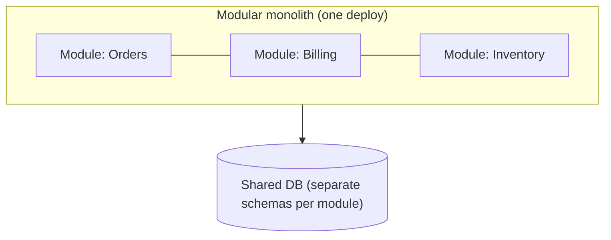
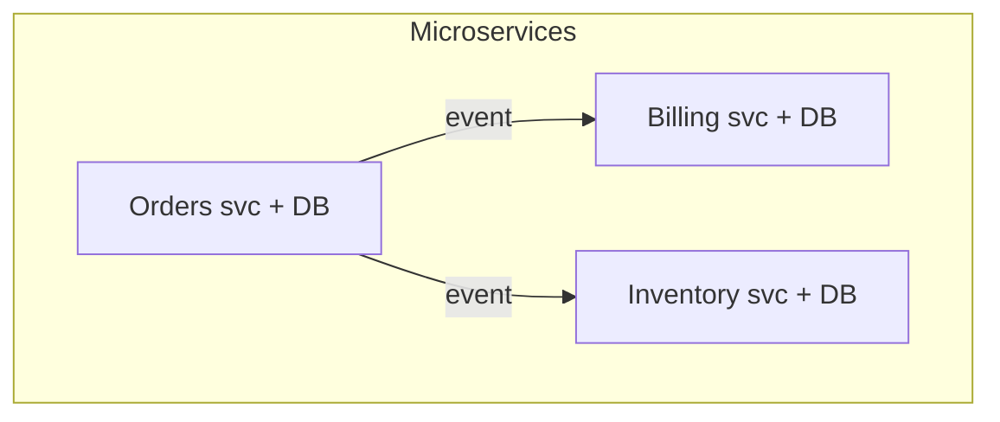
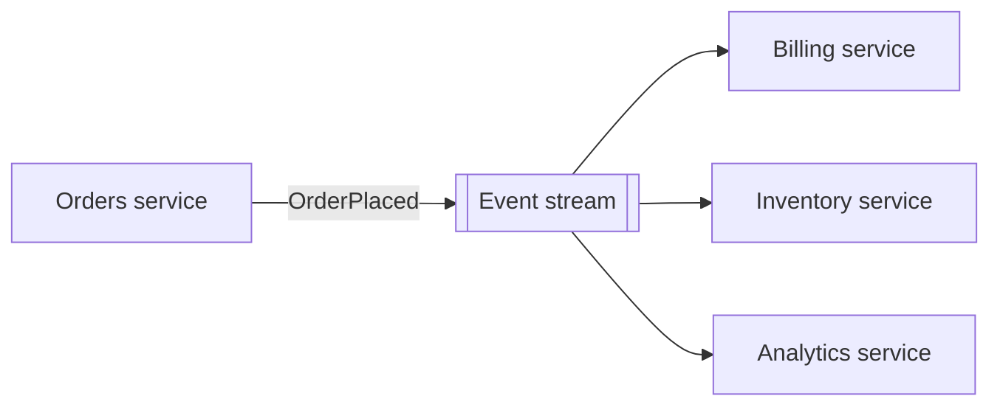

# Architecture Styles and Trade-offs - Complete Professional Guide

> **Category:** 03_design_and_architecture · **Language:** English

---

### Monolith, modular monolith, microservices, event-driven — and how to choose
**Original guide written from first principles, current to 2026**

> **Original reference book (English).** This is an **independent, originally written** guide. It is not an extract, summary, or paraphrase of any third-party book; it explains architecture styles from first principles. Canonical books are listed under **References** as pointers only. Each chapter follows the TO-BRAIN editorial standard (see `FILE_CONVENTIONS.md`).
>
> **Scope notice:** an architecture **style** is a named, reusable arrangement of components with characteristic trade-offs. This guide surveys the styles you actually choose between in 2026 — layered/modular monolith, microservices, event-driven — and gives a method for choosing by quality attributes rather than hype.

---

## How to read this guide

| Level | Profile | Parts |
|-------|---------|-------|
| 1 — Beginner | New to styles | Part I |
| 2 — Intermediate | Choosing a style | Part II |

**Target audience:** architects, senior engineers, and tech leads deciding how to decompose a system.

**Structure of each chapter:** Introduction · Business context · Theoretical concepts · Architecture · Diagrams (Mermaid) · Real examples · Step by step · Complete examples · Exercises · Challenges · Checklist · Best practices · Anti-patterns · Troubleshooting · References.

> **Note on prerequisites.** Assumes the quality-attribute thinking from the architecture-quality-attributes guide.

---

## Table of Contents

**Part I – The styles**
1. Monolith and modular monolith
2. Microservices and event-driven

**Part II – Choosing**
3. Selecting a style by trade-off, not trend

> **Status of this guide:** phased delivery. **Ready:** Part I (Ch. 1–2). **In progress:** Part II.

---

## Part I – The styles

Every architecture style buys some quality attributes at the cost of others. There is no universally best style — only the one whose trade-offs match your prioritized attributes and your team's reality. This part describes the main families so the choice (Part II) is informed rather than fashionable.

---

## Chapter 1 — Monolith and modular monolith

### 1.1 Introduction

A **monolith** deploys as a single unit: all modules run in one process, sharing a codebase and usually one database. A **modular monolith** keeps that single deployment but enforces **strong internal module boundaries** — so you get operational simplicity *and* a clean structure. For most systems in 2026 this is the right default starting point.

### 1.2 Business context

A monolith maximizes early speed and simplicity: one thing to build, test, deploy, and debug; no network between modules; transactions are local. The risk is that without discipline it becomes a "big ball of mud." The modular monolith captures the simplicity while preserving the option to extract services later — the lowest-regret choice for most new products, where the domain is still being discovered.

### 1.3 Theoretical concepts: deployment vs structure



The key insight: **deployment topology** and **internal structure** are independent. You can have one deployment (monolith) with excellent modularity (clear module APIs, no cross-module reaching into internals). Modularity is a property you design; distribution is a deployment choice with its own costs.

### 1.4 Architecture: enforced module boundaries


Module boundaries are enforced (by package structure, build rules, or tooling) so modules talk only through defined interfaces. This is what keeps a monolith from rotting and makes a later extraction to a service mechanical rather than archaeological.

### 1.5 Real example

**Scenario.** A startup building a new product with an unstable domain.

**Problem.** Jumping to microservices now means paying distribution costs while boundaries are still wrong — every model change spans services.

**Solution.** A modular monolith: one deployment, strict module APIs, separate DB schema per module. Extract a service only when a module proves it needs independent scaling or deploy cadence.

**Implementation (boundary enforcement sketch).**

```text
# Build rule: Billing may depend on Orders' public API package only.
allow:  billing.* -> orders.api.*
deny:   billing.* -> orders.internal.*     # fails the build if violated
```

**Result.** Clean boundaries today, cheap operations, and a clear seam to extract microservices later if the business actually needs them.

**Future improvements.** Add architecture-fitness tests in CI that fail on illegal cross-module dependencies.

### 1.6 Exercises

1. Distinguish deployment topology from internal modularity.
2. Why is a modular monolith often the lowest-regret default?
3. What enforces module boundaries inside a monolith?

### 1.7 Challenges

- **Challenge.** Pick a monolith you know. Identify two modules and check whether either reaches into the other's internals. Propose a public API to cut that dependency.

### 1.8 Checklist

- [ ] I treat modularity and distribution as separate decisions.
- [ ] My monolith has enforced module boundaries.
- [ ] Each module owns its data (separate schema).
- [ ] Extraction seams are intentional, not accidental.

### 1.9 Best practices

- Default to a modular monolith for new systems; distribute only on evidence.
- Enforce module boundaries with build/fitness rules, not good intentions.
- Give each module its own schema to keep data ownership clear.

### 1.10 Anti-patterns

- Big ball of mud: a monolith with no internal boundaries.
- Premature microservices before boundaries are understood.
- Shared mutable tables coupling "separate" modules.

### 1.11 Troubleshooting

| Symptom | Likely cause | Action |
|---------|--------------|--------|
| Monolith is unchangeable | No module boundaries | Introduce and enforce module APIs |
| Distributed system with chatty calls | Premature service split | Consider recombining into a modular monolith |
| Modules share tables | No data ownership | Separate schemas per module |

### 1.12 References

- M. Richards, N. Ford, *Fundamentals of Software Architecture*, 2nd ed. (O'Reilly, 2025) — ISBN 978-1098175511.
- S. Newman, *Monolith to Microservices* (O'Reilly, 2019) — ISBN 978-1492047841.

---

## Chapter 2 — Microservices and event-driven

### 2.1 Introduction

**Microservices** decompose a system into independently deployable services, each owning its data and aligned to a business capability. **Event-driven** architecture has components communicate by producing and reacting to events rather than direct calls. Both buy independence and scalability at the price of distributed-systems complexity. They often combine.

### 2.2 Business context

These styles exist to let many teams deploy and scale independently and to absorb load and failure gracefully. That independence is valuable at scale — large organizations, high traffic, differing scaling needs per capability. But the cost is real: network failures, eventual consistency, distributed debugging, and operational overhead. Adopting them without that scale is paying the bill without the benefit.

### 2.3 Theoretical concepts: independence and its price



Each service owns its database (no shared DB) and is deployed on its own cadence. Communication is via APIs or, preferably for decoupling, **events**. The defining benefits — independent deployability and fault isolation — depend entirely on services not sharing data stores and not forming synchronous chains.

### 2.4 Architecture: event-driven decoupling



Producers don't know consumers; new consumers attach to the stream without changing producers. This maximizes decoupling and extensibility — at the cost of harder end-to-end reasoning and eventual consistency (see the data-intensive-systems and messaging guides).

### 2.5 Real example

**Scenario.** A large platform where billing must scale and deploy independently of ordering.

**Problem.** In a monolith, billing's scaling needs and release cadence are chained to everything else.

**Solution.** Extract billing as a microservice with its own DB; integrate via `OrderPlaced` events so ordering doesn't call billing synchronously.

**Implementation (ownership + event integration).**

```text
orders-service:   owns orders DB; publishes OrderPlaced
billing-service:  owns billing DB; subscribes to OrderPlaced; charges async
# No shared DB. No synchronous orders->billing call on the hot path.
```

**Result.** Billing scales and deploys on its own; an order is not blocked by billing being slow or down (it catches up from the stream).

**Future improvements.** Add idempotency keys on charge handling; define the event schema contract and version it.

### 2.6 Exercises

1. What two properties define microservices, and what breaks them?
2. Why does event-driven communication increase decoupling?
3. Name two costs you accept moving from monolith to microservices.

### 2.7 Challenges

- **Challenge.** For a capability in your system, decide whether it deserves to be its own service. Justify using scaling/deploy-independence evidence, not preference.

### 2.8 Checklist

- [ ] Each service owns its data (no shared DB).
- [ ] Services integrate via APIs/events, not shared tables.
- [ ] I avoid synchronous chains on hot paths.
- [ ] I accept and plan for eventual consistency.

### 2.9 Best practices

- Split by business capability/bounded context, not technical layer.
- Prefer events over synchronous calls for cross-service work.
- Make consumers idempotent; version event contracts.

### 2.10 Anti-patterns

- Distributed monolith: services that must deploy together / share a DB.
- Synchronous call chains recreating tight coupling over the network.
- Microservices adopted for resume value, not scale need.

### 2.11 Troubleshooting

| Symptom | Likely cause | Action |
|---------|--------------|--------|
| Services must release together | Hidden coupling / shared DB | Give each its own data; decouple via events |
| One slow service stalls requests | Synchronous chains | Make cross-service work asynchronous |
| Duplicate processing on retries | Non-idempotent consumers | Add idempotency keys |

### 2.12 References

- M. Richards, N. Ford, *Fundamentals of Software Architecture*, 2nd ed. (O'Reilly, 2025) — ISBN 978-1098175511.
- S. Newman, *Building Microservices*, 2nd ed. (O'Reilly, 2021) — ISBN 978-1492034025.

---

> **End of Part I.** You can now describe the main architecture styles — modular monolith, microservices, event-driven — and the quality attributes each buys and sacrifices, treating modularity and distribution as separate decisions. **Part II — Choosing** (Chapter 3) gives a method to select a style from your prioritized quality attributes and team context, rather than from industry fashion.

<!--APPEND-PART-II-->
