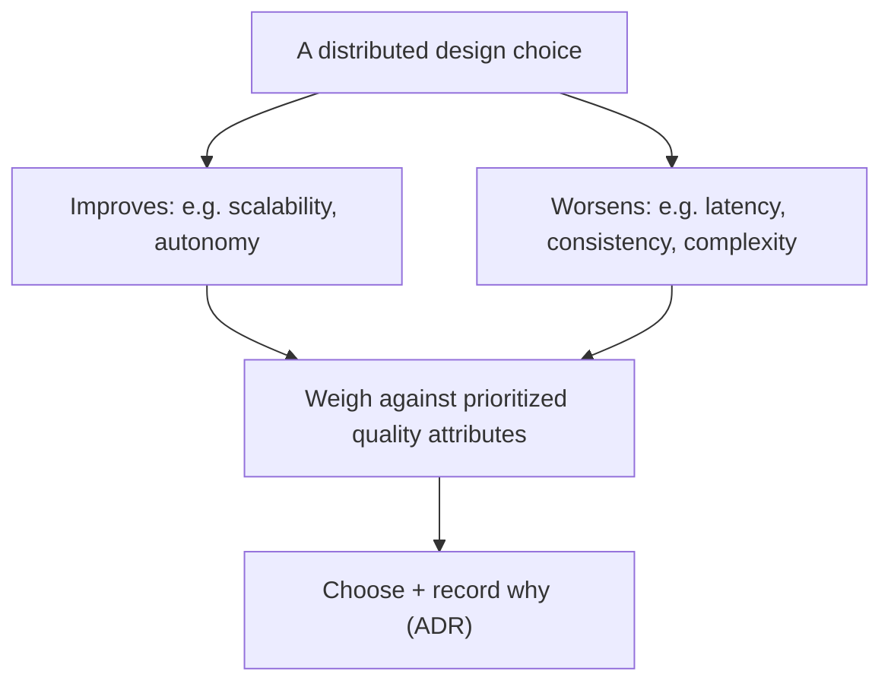
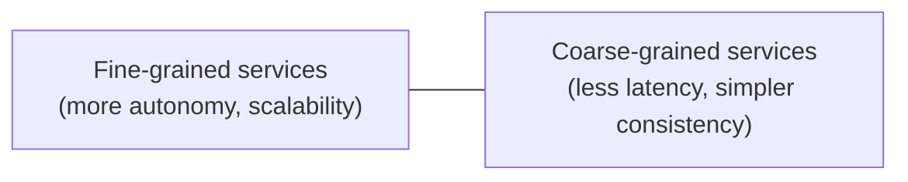
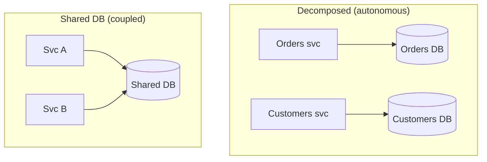
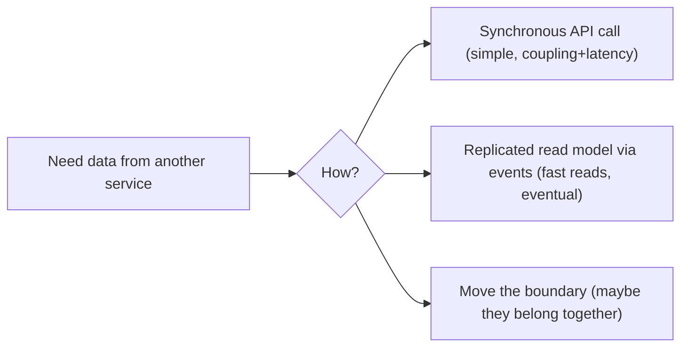

# Distributed Architecture Decisions - Complete Professional Guide

> **Category:** 03_design_and_architecture · **Language:** English

---

### Decomposing data, coordinating transactions, and the trade-offs with no easy answer
**Original guide written from first principles, current to 2026**

> **Original reference book (English).** This is an **independent, originally written** guide. It is not an extract, summary, or paraphrase of any third-party book; it teaches distributed architecture trade-offs from first principles. Canonical books are listed under **References** as pointers only. Each chapter follows the TO-BRAIN editorial standard (see `FILE_CONVENTIONS.md`).
>
> **Scope notice:** the "hard parts" of distributed architecture are the decisions with **no clearly right answer** — how to split data, how to keep things consistent across services, how to coordinate workflows. This guide gives a method for analyzing those trade-offs and the patterns (sagas, data decomposition) that 2026 systems rely on.

---

## How to read this guide

| Level | Profile | Parts |
|-------|---------|-------|
| 1 — Beginner | New to distributed design | Part I |
| 2 — Intermediate | Splitting services & data | Part II |

**Target audience:** architects and senior engineers moving from monoliths to distributed systems.

**Structure of each chapter:** Introduction · Business context · Theoretical concepts · Architecture · Diagrams (Mermaid) · Real examples · Step by step · Complete examples · Exercises · Challenges · Checklist · Best practices · Anti-patterns · Troubleshooting · References.

> **Note on prerequisites.** Assumes the architecture-styles and data-intensive-systems guides.

---

## Table of Contents

**Part I – Decomposition**
1. There are no best practices, only trade-offs
2. Decomposing data along with services

**Part II – Coordination**
3. Distributed transactions and the Saga pattern

> **Status of this guide:** phased delivery. **Ready:** Part I (Ch. 1–2). **In progress:** Part II.

---

## Part I – Decomposition

In distributed architecture the easy decisions are already made; what's left are genuine dilemmas where every option has serious downsides. The professional skill is not knowing "the answer" — there isn't one — but being able to **enumerate the trade-offs**, weigh them against your priorities, and document why you chose as you did.

---

## Chapter 1 — Trade-offs, not best practices

### 1.1 Introduction

In distributed systems, "best practice" is usually a trap: the same decision that helps one quality attribute hurts another. Splitting a service improves scalability and team autonomy but worsens performance (network hops) and consistency. The mature approach is **trade-off analysis** — make the competing forces explicit and choose deliberately, not by slogan.

### 1.2 Business context

Cargo-culting "best practices" into a distributed system causes expensive rework when the unstated downsides surface in production. Treating each decision as a trade-off — naming what you gain and what you give up — leads to choices that fit the actual priorities and lets you defend them when challenged. It also sets honest expectations: stakeholders learn there is a cost, not a free win.

### 1.3 Theoretical concepts: every choice cuts both ways



The method: for each decision, list what it improves and what it degrades, map those to your **prioritized** quality attributes (from the QA guide), choose, and record the reasoning. The goal is the least-bad fit for *your* priorities, not a universal optimum.

### 1.4 Architecture: the canonical tension



Granularity is the recurring dilemma: smaller services maximize independence and scaling but multiply network calls, failure modes, and consistency headaches. There is no correct point on this axis — only the point that best serves your prioritized attributes.

### 1.5 Real example

**Scenario.** Should "order" and "payment" be one service or two?

**Problem.** Splitting gives independent scaling but turns a local transaction into a distributed one.

**Solution.** Trade-off analysis against priorities.

**Implementation (the analysis).**

```text
Option A: one service (order+payment)
  + simple ACID transaction, low latency
  - they scale and deploy together
Option B: two services
  + independent scaling/deploy, team autonomy
  - distributed transaction (saga), eventual consistency, more ops
Priorities: consistency > independent scaling (payments must be exact)
Decision: ONE service for now; revisit if payment scaling diverges. (ADR-0012)
```

**Result.** The team chose the option fitting their top priority (consistency) and recorded the trigger to revisit — no dogma, a defensible call.

**Future improvements.** Re-evaluate when payment throughput requirements diverge from ordering.

### 1.6 Exercises

1. Why is "best practice" risky language in distributed design?
2. Give a choice that improves one attribute and degrades another.
3. What makes a trade-off decision defensible later?

### 1.7 Challenges

- **Challenge.** Take a "should we split this service?" question in your system. Write the +/- for each option against your top two quality attributes and make a recorded call.

### 1.8 Checklist

- [ ] I frame distributed decisions as trade-offs, not best practices.
- [ ] I list what each option improves and degrades.
- [ ] I weigh against prioritized quality attributes.
- [ ] I record the decision and its revisit trigger.

### 1.9 Best practices

- Make competing forces explicit before choosing.
- Tie each choice to prioritized quality attributes.
- Record decisions (ADRs) with the conditions that would change them.

### 1.10 Anti-patterns

- Adopting a pattern because it's trendy, ignoring its costs.
- Maximizing one attribute (e.g. autonomy) blind to the others.
- Undocumented distributed decisions nobody can defend.

### 1.11 Troubleshooting

| Symptom | Likely cause | Action |
|---------|--------------|--------|
| Pattern adopted, now hurting | Ignored trade-offs | Re-analyze; consider reversing |
| Endless granularity debates | No priority ranking | Rank quality attributes first |
| Can't justify a past split | No recorded rationale | Capture trade-offs in an ADR |

### 1.12 References

- N. Ford, M. Richards, P. Sadalage, Z. Dehghani, *Software Architecture: The Hard Parts* (O'Reilly, 2021) — ISBN 978-1492086895.
- M. Kleppmann, *Designing Data-Intensive Applications* (O'Reilly, 2017) — ISBN 978-1449373320.

---

## Chapter 2 — Decomposing data with services

### 2.1 Introduction

Splitting services is the easy half; splitting the **data** is the hard half. If services share a database they aren't really independent. True decomposition gives each service its **own** data — which immediately raises the questions this chapter addresses: how to draw data boundaries, and what to do about the joins and transactions that used to be free.

### 2.2 Business context

A shared database is the silent killer of microservice benefits: it couples deploys, scaling, and schema changes across "independent" teams. Decomposing data restores real autonomy but forces hard work — denormalization, data duplication, and eventual consistency. Doing this deliberately (rather than discovering the coupling in production) is what determines whether a distributed system actually delivers its promised independence.

### 2.3 Theoretical concepts: data ownership



Each service **owns** its data and is the only writer; others get it via APIs or events, never by reaching into its database. Cross-service queries that used to be SQL joins become either API composition, data duplication (a read model fed by events), or a deliberate redesign of the boundary.

### 2.4 Architecture: replacing joins



When a "join" keeps reappearing across two services, that's evidence the boundary may be wrong — sometimes the right fix is to merge them, not to engineer around the split.

### 2.5 Real example

**Scenario.** An order list page needs customer names, owned by the Customers service.

**Problem.** A cross-service join per row would be slow and couple the services.

**Solution.** Maintain a small replicated read model in Orders, updated by `CustomerRenamed` events.

**Implementation (sketch).**

```text
Customers svc: on rename -> publish CustomerRenamed{ id, name }
Orders svc:    subscribe -> upsert local customer_names{ id -> name }
Order list:    read names from the LOCAL read model (no cross-service call)
```

**Result.** The page reads from one local store (fast, decoupled); names are eventually consistent, refreshed by events — acceptable for a display name.

**Future improvements.** Add a reconciliation job to catch missed events; bound staleness with a TTL refresh.

### 2.6 Exercises

1. Why does a shared database defeat microservice independence?
2. Give three ways to replace a cross-service join.
3. What does a recurring cross-service join suggest about the boundary?

### 2.7 Challenges

- **Challenge.** Find two services (or modules) that share data. Decide an ownership boundary and pick how the other side gets what it needs (API, event-fed read model, or merge).

### 2.8 Checklist

- [ ] Each service owns and solely writes its data.
- [ ] No service reaches into another's database.
- [ ] Cross-service data needs use API/events/read models.
- [ ] Frequent cross-boundary joins trigger a boundary review.

### 2.9 Best practices

- Give every service its own datastore; integrate via contracts.
- Use event-fed read models for fast cross-service reads.
- Treat a persistent join across a boundary as a boundary smell.

### 2.10 Anti-patterns

- Shared database behind "independent" services.
- Chatty synchronous calls replacing every former join.
- Splitting data that is always used together.

### 2.11 Troubleshooting

| Symptom | Likely cause | Action |
|---------|--------------|--------|
| Services must deploy together | Shared database | Decompose data; own per service |
| Pages slow from cross-service calls | Synchronous join replacement | Build an event-fed local read model |
| Same join keeps reappearing | Wrong boundary | Consider merging the services |

### 2.12 References

- N. Ford, M. Richards, P. Sadalage, Z. Dehghani, *Software Architecture: The Hard Parts* (O'Reilly, 2021) — ISBN 978-1492086895.
- S. Newman, *Building Microservices*, 2nd ed. (O'Reilly, 2021) — ISBN 978-1492034025.

---

> **End of Part I.** You can now approach distributed architecture as deliberate trade-off analysis rather than best-practice copying, and decompose data alongside services — giving each service sole ownership of its data and replacing former joins with APIs, event-fed read models, or boundary changes. **Part II — Coordination** (Chapter 3) covers keeping workflows correct across services without distributed ACID transactions, using the Saga pattern and compensating actions.

<!--APPEND-PART-II-->
