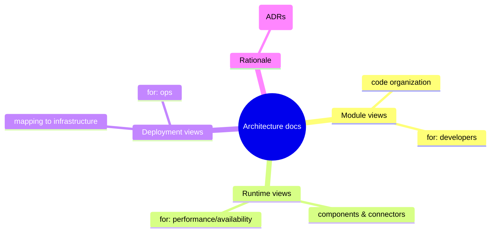
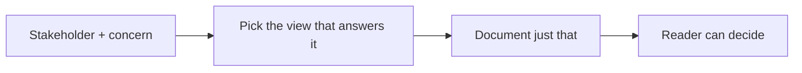
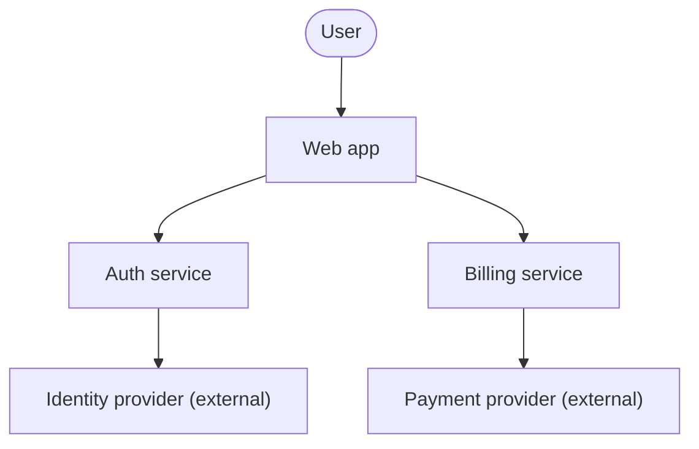
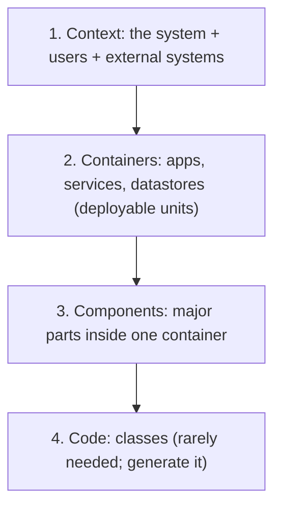
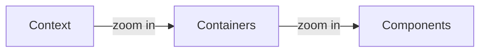
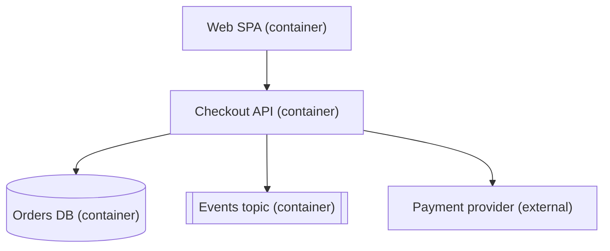
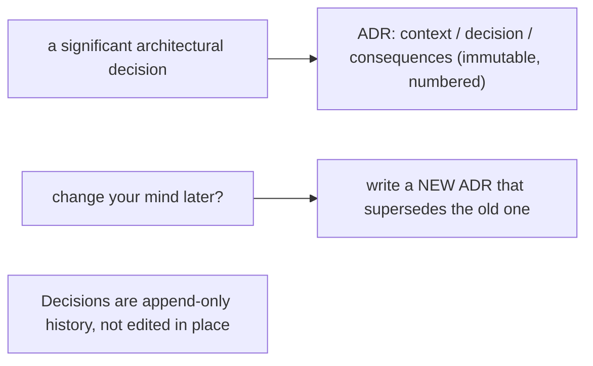
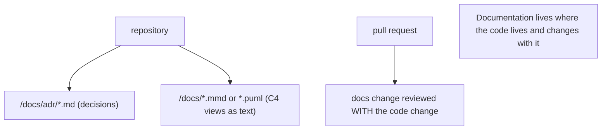

# Documenting Software Architecture - Complete Professional Guide

> **Category:** 03_design_and_architecture · **Language:** English

---

### Views, viewpoints, and just-enough diagrams that stay true
**Original guide written from first principles, current to 2026**

> **Original reference book (English).** This is an **independent, originally written** guide. It is not an extract, summary, or paraphrase of any third-party book; it teaches architecture documentation from first principles. Canonical books are listed under **References** as pointers only. Each chapter follows the TO-BRAIN editorial standard (see `FILE_CONVENTIONS.md`).
>
> **Scope notice:** documentation exists to help people **understand and decide** — not to satisfy a process. This guide covers the idea that architecture is documented as a set of **views** for different stakeholders, a lightweight modern approach (C4-style levels), and how to keep docs true with decision records. Current to 2026 practice (diagrams-as-code, ADRs).

---

## How to read this guide

| Level | Profile | Parts |
|-------|---------|-------|
| 1 — Beginner | New to documenting | Part I |
| 2 — Intermediate | Choosing views | Part II |

**Target audience:** architects, tech leads, and engineers who must communicate a design so others can build and change it.

**Structure of each chapter:** Introduction · Business context · Theoretical concepts · Architecture · Diagrams (Mermaid) · Real examples · Step by step · Complete examples · Exercises · Challenges · Checklist · Best practices · Anti-patterns · Troubleshooting · References.

> **Note on prerequisites.** Assumes basic architecture vocabulary (see the architecture-quality-attributes guide).

---

## Table of Contents

**Part I – Foundations**
1. Architecture as a set of views
2. A practical level-based model (context → containers → components)

**Part II – Keeping it true**
3. Architecture Decision Records and diagrams-as-code

> **Status of this guide:** complete for its declared scope. **Ready:** Parts I–II (Ch. 1–3).

---

## Part I – Foundations

No single diagram can show a non-trivial system — a security reviewer, a new developer, and an ops engineer need different things. So architecture is documented as a set of **views**, each answering one audience's questions. The skill is choosing the **fewest** views that serve real readers, and keeping them honest.

---

## Chapter 1 — Architecture as a set of views

### 1.1 Introduction

A **view** is a representation of the system from one perspective, addressing the concerns of a particular set of stakeholders. You can't capture a whole architecture in one picture, so you pick a handful of views — each with a clear audience and purpose. Documentation is the union of those views plus the rationale behind the big decisions.

### 1.2 Business context

Architecture documentation is read by people making decisions: a new hire orienting, a reviewer assessing risk, an ops team planning a deploy. Poor or absent docs slow all of them and push knowledge into a few people's heads (a bus-factor risk). Right-sized docs accelerate onboarding and reduce the cost of every cross-team decision — while over-documenting wastes effort on diagrams nobody reads and that rot immediately.

### 1.3 Theoretical concepts: views and viewpoints



A **viewpoint** defines the conventions for a kind of view; a **view** is that applied to your system. The three broad categories mirror the structures from architecture fundamentals: **module** (code), **component-and-connector** (runtime), **allocation** (deployment). Pick views by **stakeholder concern**, not by "what tool can draw."

### 1.4 Architecture: choosing views by audience



Start from "who needs to understand what, to do what?" and produce only the views that answer real questions. A view with no audience is waste.

### 1.5 Real example

**Scenario.** A new engineer must add a feature touching auth and billing.

**Problem.** There's either no documentation, or a 60-page document nobody maintains — both useless.

**Solution.** A small context view (systems and their relationships) plus a component view of the two relevant services answers their actual question in minutes.

**Implementation (a context view as a diagram-as-code).**



**Result.** The newcomer sees the systems, boundaries, and externals at a glance, then drills into the component view for billing. No 60-page read.

**Future improvements.** Keep the diagram in the repo as code so it updates with the system; link each box to its component view.

### 1.6 Exercises

1. Why can't one diagram document a whole architecture?
2. Define view vs viewpoint.
3. How do you decide which views are worth producing?

### 1.7 Challenges

- **Challenge.** For your system, list three stakeholders and the one question each most needs answered. Produce exactly the views that answer them — no more.

### 1.8 Checklist

- [ ] I document architecture as a small set of purposeful views.
- [ ] Each view has a named audience and concern.
- [ ] I cover module, runtime, and deployment perspectives as needed.
- [ ] I capture rationale, not just structure.

### 1.9 Best practices

- Produce the fewest views that serve real readers.
- Choose views by stakeholder concern, not tooling.
- Keep diagrams in version control as code.

### 1.10 Anti-patterns

- One giant diagram trying to show everything.
- Exhaustive documentation nobody reads or maintains.
- Pictures with no stated audience or purpose.

### 1.11 Troubleshooting

| Symptom | Likely cause | Action |
|---------|--------------|--------|
| Docs ignored | Too big / no audience | Cut to purposeful views |
| Newcomers still lost | Missing context/component view | Add the view answering their question |
| Diagrams always stale | Drawn by hand, out of band | Move to diagrams-as-code in the repo |

### 1.12 References

- P. Clements et al., *Documenting Software Architectures: Views and Beyond*, 2nd ed. (Addison-Wesley, 2010), the Prologue ("Software Architectures and Documentation", the "Views" concept) & ch. 9 "Choosing the Views" — ISBN 978-0321552686.
- S. Brown, "The C4 model for visualising software architecture," https://c4model.com.

---

## Chapter 2 — A practical level-based model

### 2.1 Introduction

A pragmatic, widely-used way to document structure is a small hierarchy of levels, zooming from the outside in: **system context** → **containers** (deployable/runnable units) → **components** (major parts inside a container) → (optionally) **code**. Each level is one diagram for one audience, and you only go as deep as questions require.

### 2.2 Business context

A consistent, leveled notation means everyone reads diagrams the same way and can zoom to the right altitude for their decision — executives stay at context, developers drop to components. This shared, scalable structure removes the ambiguity of ad-hoc box-and-line drawings where nobody knows whether a box is a service, a class, or a server.

### 2.3 Theoretical concepts: the levels



- **Context** — the system as one box among users and external systems. For everyone.
- **Container** — the runnable/deployable units (web app, API, database, queue) and how they talk. For developers and ops.
- **Component** — the major building blocks inside a container. For developers of that container.
- **Code** — class-level; usually unnecessary and best generated, not hand-drawn.

### 2.4 Architecture: zoom only as needed



Most teams need only the first two or three levels. Going to code-level diagrams by hand is almost always wasted effort that's stale on day one.

### 2.5 Real example

**Scenario.** Document a checkout system for two audiences: ops (deployables) and the checkout team (internals).

**Problem.** One diagram conflated services, classes, and servers, confusing both.

**Solution.** A container view for ops; a component view of the checkout service for its developers.

**Implementation (container view).**



**Result.** Ops sees exactly what deploys and connects; the checkout team gets a separate component view of the API's internals. No conflation.

**Future improvements.** Generate the component view from code annotations so it can't drift.

### 2.6 Exercises

1. Name the four levels and the audience for each.
2. Why is the code level usually unnecessary to draw by hand?
3. What distinguishes a "container" from a "component" here?

### 2.7 Challenges

- **Challenge.** Draw a context and a container diagram for a system you work on. Stop there unless a specific question demands a component view.

### 2.8 Checklist

- [ ] My diagrams use one consistent, leveled notation.
- [ ] I label what each box is (container vs component vs external).
- [ ] I zoom only as deep as a real question needs.
- [ ] I avoid hand-drawn code-level diagrams.

### 2.9 Best practices

- Stay at context/container level unless deeper is genuinely needed.
- Use one notation consistently so readers don't re-learn each diagram.
- Generate low-level views from code instead of drawing them.

### 2.10 Anti-patterns

- Mixing abstraction levels in one diagram (service + class + server).
- Hand-maintained code diagrams that rot immediately.
- Inconsistent shapes/notation across the team.

### 2.11 Troubleshooting

| Symptom | Likely cause | Action |
|---------|--------------|--------|
| Readers misread boxes | Mixed abstraction levels | Separate into leveled views |
| Diagrams contradict reality | Hand-drawn, drifted | Generate from code / keep as code |
| Every diagram looks different | No agreed notation | Adopt one leveled model |

### 2.12 References

- S. Brown, "The C4 model," https://c4model.com.
- P. Clements et al., *Documenting Software Architectures: Views and Beyond*, 2nd ed. (Addison-Wesley, 2010), ch. 1 "The Module Viewtype" & ch. 2 "Styles of the Module Viewtype" (§2.4 "The Layered Style") — ISBN 978-0321552686.

---

> **End of Part I.** You can now document architecture as a small set of stakeholder-driven views across module/runtime/deployment perspectives, and use a leveled context→container→component model to zoom only as deep as real questions require. **Part II — Keeping it true** (Chapter 3) covers Architecture Decision Records for capturing rationale and diagrams-as-code so documentation stays synchronized with the system.

---

## Part II – Keeping it true

Part I covered which **views** to document and for whom. Part II is about documentation that stays **true** as the system changes: capturing the *why* in **Architecture Decision Records** and generating diagrams from text (**diagrams-as-code**) so they don't rot.

---

## Chapter 3 — Architecture Decision Records and diagrams-as-code

### 3.1 Introduction

Most architecture documentation rots because it's prose and pictures maintained by hand, separate from the code. Two practices fix that. An **Architecture Decision Record (ADR)** is a small, immutable, numbered file capturing **one** significant decision — its **context**, the **decision**, and its **consequences** — so the *why* survives even when people leave. **Diagrams-as-code** (PlantUML, Mermaid, Structurizr/C4) describe diagrams in **text** kept in the repo, so they're versioned, reviewed in pull requests, and regenerated rather than redrawn. Together they keep documentation cheap to maintain and therefore actually maintained.

### 3.2 Business context

The most expensive question on any mature system is "why was it built this way?" — and the answer usually left with someone who quit. ADRs preserve that reasoning so teams stop re-litigating settled decisions and stop accidentally reversing ones made for good reasons. Hand-drawn diagrams that disagree with reality are worse than none: they mislead newcomers and reviewers. Text-based diagrams live next to the code, change in the same pull request, and so stay trustworthy — turning documentation from a stale liability into a living asset that speeds onboarding and change.

### 3.3 Theoretical concepts: capture decisions, generate pictures



An ADR is short and **append-only**: you don't edit a past decision, you write a new ADR that **supersedes** it, preserving the trail of how thinking evolved. Diagrams-as-code follow the same spirit — a Mermaid or PlantUML/C4 source file is the single source of truth, rendered on demand, diffed like code, and impossible to leave silently out of date because it's reviewed alongside the change it documents.

### 3.4 Architecture: docs in the repo, reviewed with the code



Keeping ADRs and diagram sources in the repository means documentation is versioned, searchable, and updated in the same pull request as the code — the only reliable way to keep it true.

### 3.5 Real example

**Scenario.** A team picks a message broker over synchronous calls and needs both the decision and a current context diagram to survive.

**Problem.** The rationale lives in a chat thread, and the architecture diagram is a slide nobody updates.

**Solution.** Write an **ADR** for the decision and a **diagram-as-code** for the view, both in the repo.

**Implementation.**

```text
# docs/adr/0007-async-messaging.md  (immutable, numbered)
# 7. Use a message broker for order events
## Status: Accepted (supersedes none)
## Context: services must react to orders without tight coupling; sync calls cascade failures
## Decision: publish order events to a broker; consumers subscribe
## Consequences: + decoupling, resilience;  - eventual consistency, broker to operate

# docs/c4-context.mmd  (diagram-as-code, rendered in CI)
flowchart LR
  Order --> Broker
  Broker --> Inventory
  Broker --> Billing
```

**Result.** The *why* is captured once in ADR-0007 and never re-argued; if the team later moves off the broker, ADR-0008 supersedes it, leaving the history intact. The context diagram is text in the repo, reviewed with the code and regenerated, so it can't silently drift. Documentation stays true at near-zero maintenance cost.

**Future improvements.** Render diagrams in CI and fail the build if sources don't compile; adopt the C4 model for consistent levels (context, container, component).

### 3.6 Exercises

1. What three things does an ADR capture, and why is it immutable?
2. How do you record a change of mind without editing a past ADR?
3. Why do diagrams-as-code stay accurate when hand-drawn diagrams rot?

### 3.7 Challenges

- **Challenge.** Write an ADR for a real decision in your project (context/decision/consequences) and replace one hand-drawn diagram with a Mermaid or PlantUML/C4 source committed to the repo.

### 3.8 Checklist

- [ ] Significant decisions are captured as numbered, immutable ADRs.
- [ ] Reversals are new ADRs that supersede old ones (append-only history).
- [ ] Diagrams are text (Mermaid/PlantUML/C4) in the repo.
- [ ] Docs change in the same pull request as the code.

### 3.9 Best practices

- Keep ADRs short: context, decision, consequences.
- Supersede rather than edit; preserve the decision trail.
- Generate diagrams from versioned text reviewed with the code.

### 3.10 Anti-patterns

- Decisions buried in chat threads or someone's memory.
- Editing past ADRs (losing the history of why).
- Binary diagrams in a wiki that no one updates.

### 3.11 Troubleshooting

| Symptom | Likely cause | Action |
|---------|--------------|--------|
| "Why is it built this way?" has no answer | No ADRs | Start an ADR log; record decisions going forward |
| Diagram contradicts the system | Hand-drawn, never updated | Move to diagrams-as-code reviewed with changes |
| Old decision keeps getting reversed | No superseding trail | Write a new ADR that supersedes the prior one |

### 3.12 References

- P. Clements et al., *Documenting Software Architectures: Views and Beyond*, 2nd ed. (Addison-Wesley, 2010) — ISBN 978-0321552686.
- M. Nygard, "Documenting Architecture Decisions" (ADRs); S. Brown, the C4 model — https://c4model.com.

---

> **End of Part II.** Documentation stays true when the **why** is captured in immutable, superseding **ADRs** and the **diagrams are code** (Mermaid/PlantUML/C4) versioned in the repo and reviewed with each change. With Part I's choice of views and audiences, you can now keep architecture documentation a living asset instead of a stale liability.
