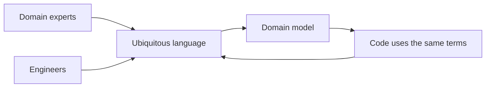
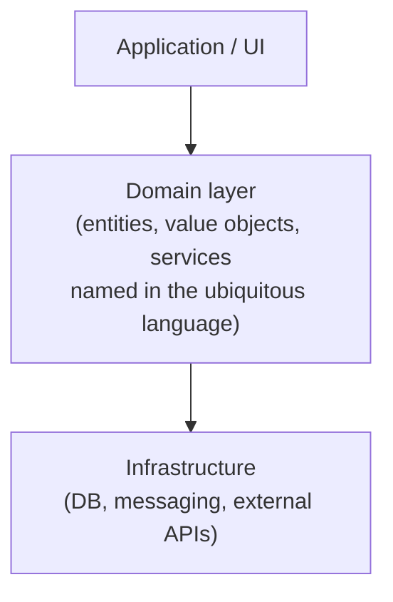
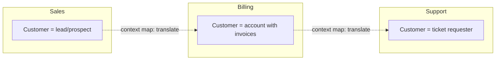
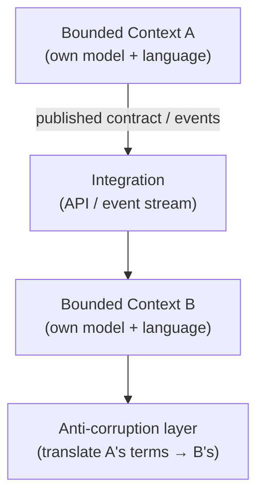

# Domain-Driven Design - Complete Professional Guide

> **Category:** 03_design_and_architecture · **Language:** English

---

### Modeling complex domains with a shared language and explicit boundaries
**Original guide written from first principles, current to 2026**

> **Original reference book (English).** This is an **independent, originally written** guide. It is not an extract, summary, or paraphrase of any third-party book; it teaches domain-driven design from first principles. Canonical books on the subject are listed under **References** as pointers only. Each chapter follows the TO-BRAIN editorial standard (see `FILE_CONVENTIONS.md`).
>
> **Scope notice:** domain-driven design (DDD) is an approach to building software for **complex domains** by putting the domain model — and the language around it — at the center. This guide covers the strategic side (ubiquitous language, bounded contexts, context mapping) and the tactical side (entities, value objects, aggregates, domain events), with 2026 notes on how these map to services, events, and modern architectures.

---

## How to read this guide

| Level | Profile | Parts |
|-------|---------|-------|
| 1 — Beginner | New to modeling | Part I |
| 2 — Intermediate | Building a model | Part II |
| 3 — Advanced | Multiple teams/contexts | Part III |

**Target audience:** backend engineers, architects, and tech leads working on non-trivial business software where the rules — not the plumbing — are the hard part.

**Structure of each chapter:** Introduction · Business context · Theoretical concepts · Architecture · Diagrams (Mermaid) · Real examples · Step by step · Complete examples · Exercises · Challenges · Checklist · Best practices · Anti-patterns · Troubleshooting · References.

> **Note on prerequisites.** Assumes OO or functional modeling basics and some exposure to layered architecture. DDD is most valuable on **complex** domains; for CRUD apps it is overkill.

---

## Table of Contents

**Part I – Strategic design**
1. Ubiquitous language: one vocabulary for code and conversation
2. Bounded contexts and context mapping

**Part II – Tactical design**
3. Entities, value objects, and aggregates
4. Domain events and the model boundary

**Part III – In practice**
5. DDD with services, events, and modern architectures

> **Status of this guide:** phased delivery. **Ready:** Part I (Ch. 1–2). **In progress:** Parts II–III.

---

## Part I – Strategic design

The most common reason business software rots is not bad code — it is a **fuzzy model**: terms mean different things to different people, and one giant model tries to serve the whole company. DDD's strategic tools attack this directly. Before any class is written, you fix the **language** and draw the **boundaries** within which that language is precise.

---

## Chapter 1 — Ubiquitous language

### 1.1 Introduction

A **ubiquitous language** is a single, shared vocabulary — used by domain experts, product, and engineers, and reflected literally in the code — for one part of the business. When the code says `settleInvoice()` and the business says "settle the invoice," there is no translation layer to drift or mistranslate. Building and ruthlessly maintaining this language is the foundation of DDD.

### 1.2 Business context

Most expensive defects are misunderstandings, not typos: the developer modeled "shipment" one way, the warehouse means another. A ubiquitous language removes that translation gap, so requirements, conversations, tests, and code all describe the same concepts the same way. The payoff is fewer wrong features and a model that experts can actually validate.

### 1.3 Theoretical concepts: language drives the model



The language and the model evolve **together**. When a conversation reveals a term the model lacks — or a model concept the business has no word for — that is a signal to refine one or the other. The language is not documentation written once; it is a living agreement.

### 1.4 Architecture: where the language lives



The domain layer is the home of the language: its types and methods *are* the business vocabulary. Infrastructure (persistence, messaging) is kept at arm's length so technical concerns don't pollute the model's words — the same separation the layered/hexagonal architectures enforce.

### 1.5 Real example

**Scenario.** A logistics team keeps shipping the wrong status transitions.

**Problem.** "Dispatched," "shipped," and "in transit" are used interchangeably in tickets but mean distinct things to the warehouse.

**Solution.** Pin the terms with the experts, then encode exactly those terms — and only legal transitions — in the model.

**Implementation.**

```java
// The type names ARE the agreed language; illegal transitions can't compile/run.
enum ShipmentStatus { CREATED, DISPATCHED, IN_TRANSIT, DELIVERED }

final class Shipment {
    private ShipmentStatus status = ShipmentStatus.CREATED;

    void dispatch()   { require(status == ShipmentStatus.CREATED);   status = ShipmentStatus.DISPATCHED; }
    void markInTransit() { require(status == ShipmentStatus.DISPATCHED); status = ShipmentStatus.IN_TRANSIT; }
    void deliver()    { require(status == ShipmentStatus.IN_TRANSIT);  status = ShipmentStatus.DELIVERED; }
}
```

**Result.** The code speaks the warehouse's language and makes the illegal "deliver before dispatch" path impossible — a whole class of bugs disappears.

**Future improvements.** Emit a domain event on each transition (Ch. 4) so other contexts react without coupling to `Shipment` internals.

### 1.6 Exercises

1. Define "ubiquitous language" in one sentence and say who shares it.
2. Why should the language and the model evolve together?
3. Give an example of a translation gap causing a wrong feature.

### 1.7 Challenges

- **Challenge.** Sit with a domain expert for 20 minutes on one workflow. List every term that is ambiguous or has two meanings. Pick the agreed term for each and grep your code for the others.

### 1.8 Checklist

- [ ] My code uses the exact terms the domain experts use.
- [ ] Ambiguous terms have been pinned to one agreed meaning.
- [ ] The model and language evolve together, not separately.
- [ ] Technical concerns don't leak into the domain vocabulary.

### 1.9 Best practices

- Treat every naming disagreement as a modeling question worth resolving.
- Keep the domain layer free of framework/persistence words.
- Encode rules as types and methods so the language is enforced, not just documented.

### 1.10 Anti-patterns

- A glossary nobody updates while the code uses different words.
- One company-wide model forced on every team (no boundaries — see Ch. 2).
- Anemic models where the language lives in service names but entities are bags of getters/setters.

### 1.11 Troubleshooting

| Symptom | Likely cause | Action |
|---------|--------------|--------|
| Recurrent "we meant different things" bugs | No agreed language | Pin terms with experts; encode them |
| Domain code littered with DB/HTTP terms | Infrastructure leaking in | Push it behind the domain boundary |
| Glossary and code disagree | Language treated as static docs | Make the code the source of the language |

### 1.12 References

- E. Evans, *Domain-Driven Design* (Addison-Wesley, 2003) — ISBN 978-0321125217.
- V. Khononov, *Learning Domain-Driven Design* (O'Reilly, 2021) — ISBN 978-1098100131.

---

## Chapter 2 — Bounded contexts and context mapping

### 2.1 Introduction

No single model can serve a whole company without becoming a contradictory mess: "customer" means something different to sales, billing, and support. A **bounded context** is an explicit boundary within which one model and one ubiquitous language are consistent. **Context mapping** describes how different contexts relate and integrate. Together they are the most important — and most skipped — part of DDD.

### 2.2 Business context

Trying to force one universal model across teams produces a brittle, over-coupled system where every change ripples everywhere. Bounded contexts let each team move at its own pace with a model that fits its slice of the business, while context maps make the integration costs and dependencies explicit rather than accidental. This is also the natural seam along which to split services and teams.

### 2.3 Theoretical concepts: boundaries and relationships



Each context owns its meaning of "customer." Where they integrate, a **translation** is made explicit (an anti-corruption layer, a shared kernel, or a published contract). Common relationship patterns: **partnership**, **customer–supplier**, **conformist**, **anti-corruption layer** (translate to protect your model), and **open host service / published language** (a stable contract for many consumers).

### 2.4 Architecture: contexts as integration units



The boundary is where you decide **how much** of another team's model you let into yours. An anti-corruption layer keeps a messy or foreign model from leaking in and corrupting your language — invaluable when integrating legacy or third-party systems.

### 2.5 Real example

**Scenario.** Billing needs customer data that originates in the CRM, whose model is sprawling and unstable.

**Problem.** Importing the CRM's `Customer` directly would drag its quirks and churn into Billing's clean model.

**Solution.** Put an anti-corruption layer at the boundary that translates CRM payloads into Billing's own `Account` concept.

**Implementation.**

```java
// Billing speaks "Account"; the ACL absorbs the CRM's shape and instability.
final class CrmAntiCorruptionLayer {
    Account toAccount(CrmCustomerDto crm) {
        return new Account(
            new AccountId(crm.externalId()),
            BillingName.of(crm.firstName(), crm.lastName()),
            Email.of(crm.primaryEmail())
        );
        // CRM fields Billing doesn't care about simply never enter the model.
    }
}
```

**Result.** Billing's model stays clean and stable; CRM changes are absorbed in one translation point instead of rippling through the domain.

**Future improvements.** Subscribe to CRM change events so the translation runs on updates, not just imports; version the contract.

### 2.6 Exercises

1. Why can't one model serve an entire enterprise well?
2. What does an anti-corruption layer protect, and from what?
3. Name two context-mapping relationship patterns and when each fits.

### 2.7 Challenges

- **Challenge.** Map your system into bounded contexts. For each pair that integrates, label the relationship (shared kernel, customer–supplier, ACL, …) and the term that means different things across the boundary.

### 2.8 Checklist

- [ ] Each context has one consistent model and language.
- [ ] Integrations between contexts are explicit, not accidental.
- [ ] Foreign/legacy models are kept out via translation where needed.
- [ ] Context boundaries inform service and team boundaries.

### 2.9 Best practices

- Draw the context map before designing services — boundaries first.
- Use an anti-corruption layer when integrating anything you don't control.
- Let bounded contexts, not database tables, define ownership.

### 2.10 Anti-patterns

- One enterprise-wide canonical model everyone must conform to.
- Sharing a database across contexts, coupling them invisibly.
- Letting a third-party model's terms become your domain's terms.

### 2.11 Troubleshooting

| Symptom | Likely cause | Action |
|---------|--------------|--------|
| A change ripples across many teams | Missing/blurred context boundaries | Split into bounded contexts |
| Your model warps to match a vendor's | No anti-corruption layer | Add translation at the boundary |
| Endless "whose customer is canonical?" fights | One model forced on all | Give each context its own meaning |

### 2.12 References

- E. Evans, *Domain-Driven Design* (Addison-Wesley, 2003) — ISBN 978-0321125217.
- V. Khononov, *Learning Domain-Driven Design* (O'Reilly, 2021) — ISBN 978-1098100131.
- S. Newman, *Building Microservices*, 2nd ed. (O'Reilly, 2021) — ISBN 978-1492034025, on context-aligned service boundaries.

---

> **End of Part I.** You can now establish a ubiquitous language shared by experts and code, and carve a complex domain into bounded contexts with explicit integration via context mapping — protecting each model with anti-corruption layers where needed. **Part II — Tactical design** (Chapters 3–4) drops into the building blocks inside a context: entities vs value objects, aggregates as consistency boundaries, and domain events.

<!--APPEND-PART-II-->
