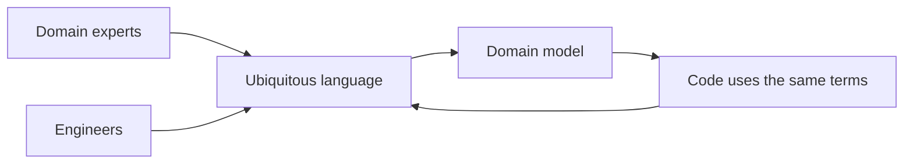
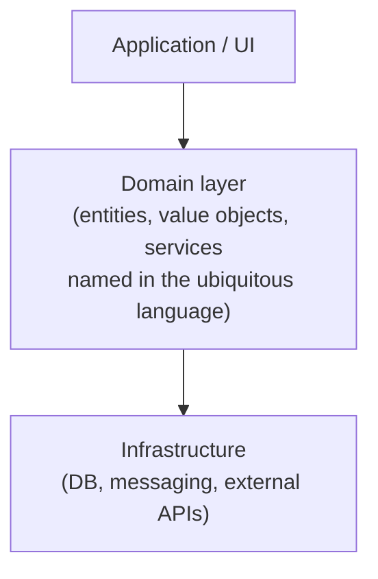
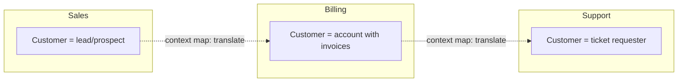
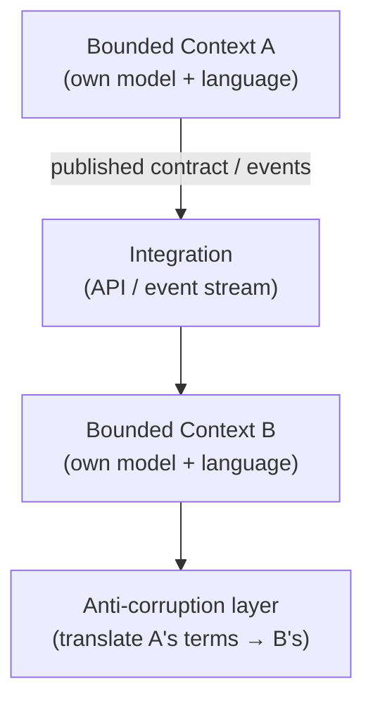
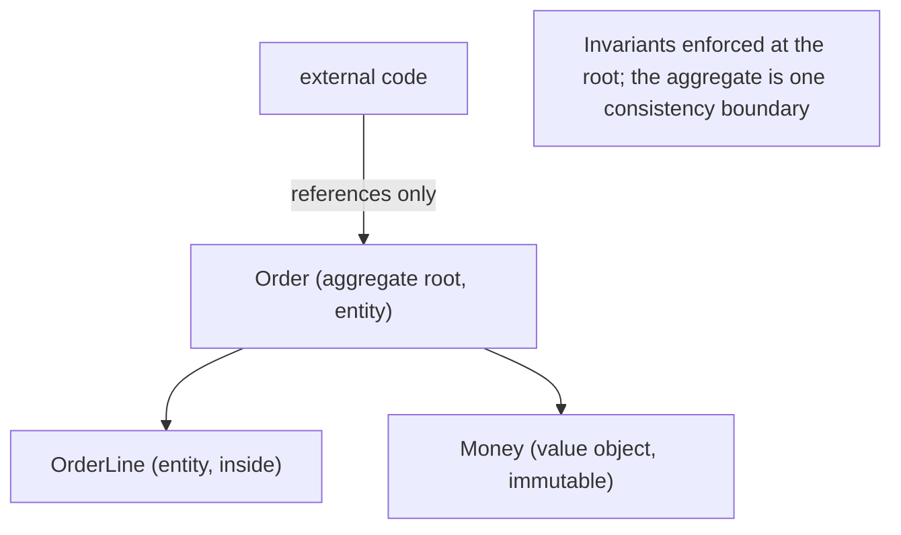
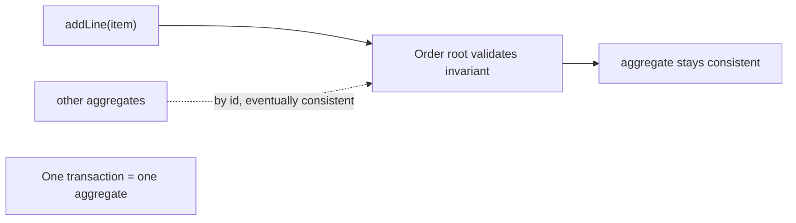
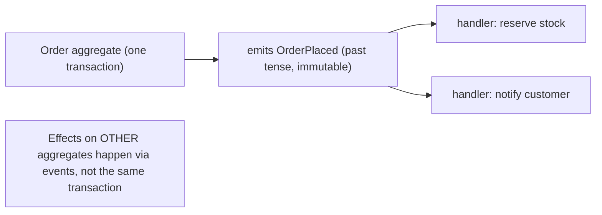
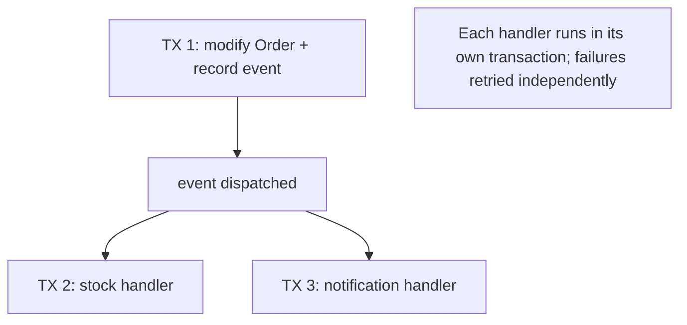
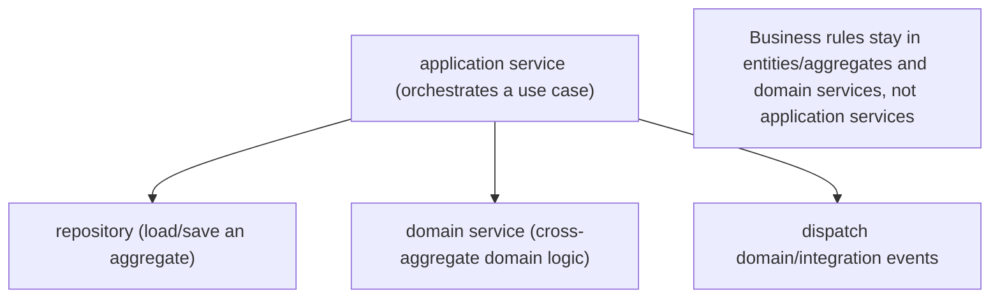
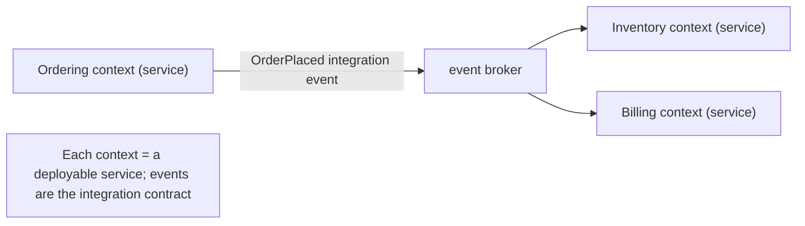

# Domain-Driven Design - Complete Professional Guide

> **Category:** 03_design_and_architecture · **Language:** English

---

### Modeling complex domains with a shared language and explicit boundaries
**Original guide written from first principles, current to 2026**

> **Original reference book (English).** This is an **independent, originally written** guide. It is not an extract, summary, or paraphrase of any third-party book; it teaches domain-driven design from first principles. Canonical books on the subject are listed under **References** as pointers only. Each chapter follows the TO-BRAIN editorial standard (see `FILE_CONVENTIONS.md`).
>
> **Scope notice:** domain-driven design (DDD) is an approach to building software for **complex domains** by putting the domain model — and the language around it — at the center. This guide covers the strategic side (ubiquitous language, bounded contexts, context mapping) and the tactical side (entities, value objects, aggregates, domain events), with 2026 notes on how these map to services, events, and modern architectures.

---

## How to read this guide

| Level | Profile | Parts |
|-------|---------|-------|
| 1 — Beginner | New to modeling | Part I |
| 2 — Intermediate | Building a model | Part II |
| 3 — Advanced | Multiple teams/contexts | Part III |

**Target audience:** backend engineers, architects, and tech leads working on non-trivial business software where the rules — not the plumbing — are the hard part.

**Structure of each chapter:** Introduction · Business context · Theoretical concepts · Architecture · Diagrams (Mermaid) · Real examples · Step by step · Complete examples · Exercises · Challenges · Checklist · Best practices · Anti-patterns · Troubleshooting · References.

> **Note on prerequisites.** Assumes OO or functional modeling basics and some exposure to layered architecture. DDD is most valuable on **complex** domains; for CRUD apps it is overkill.

---

## Table of Contents

**Part I – Strategic design**
1. Ubiquitous language: one vocabulary for code and conversation
2. Bounded contexts and context mapping

**Part II – Tactical design**
3. Entities, value objects, and aggregates
4. Domain events and the model boundary

**Part III – In practice**
5. DDD with services, events, and modern architectures

> **Status of this guide:** complete for its declared scope. **Ready:** Parts I–III (Ch. 1–5).

---

## Part I – Strategic design

The most common reason business software rots is not bad code — it is a **fuzzy model**: terms mean different things to different people, and one giant model tries to serve the whole company. DDD's strategic tools attack this directly. Before any class is written, you fix the **language** and draw the **boundaries** within which that language is precise.

---

## Chapter 1 — Ubiquitous language

### 1.1 Introduction

A **ubiquitous language** is a single, shared vocabulary — used by domain experts, product, and engineers, and reflected literally in the code — for one part of the business. When the code says `settleInvoice()` and the business says "settle the invoice," there is no translation layer to drift or mistranslate. Building and ruthlessly maintaining this language is the foundation of DDD.

### 1.2 Business context

Most expensive defects are misunderstandings, not typos: the developer modeled "shipment" one way, the warehouse means another. A ubiquitous language removes that translation gap, so requirements, conversations, tests, and code all describe the same concepts the same way. The payoff is fewer wrong features and a model that experts can actually validate.

### 1.3 Theoretical concepts: language drives the model



The language and the model evolve **together**. When a conversation reveals a term the model lacks — or a model concept the business has no word for — that is a signal to refine one or the other. The language is not documentation written once; it is a living agreement.

### 1.4 Architecture: where the language lives



The domain layer is the home of the language: its types and methods *are* the business vocabulary. Infrastructure (persistence, messaging) is kept at arm's length so technical concerns don't pollute the model's words — the same separation the layered/hexagonal architectures enforce.

### 1.5 Real example

**Scenario.** A logistics team keeps shipping the wrong status transitions.

**Problem.** "Dispatched," "shipped," and "in transit" are used interchangeably in tickets but mean distinct things to the warehouse.

**Solution.** Pin the terms with the experts, then encode exactly those terms — and only legal transitions — in the model.

**Implementation.**

```java
// The type names ARE the agreed language; illegal transitions can't compile/run.
enum ShipmentStatus { CREATED, DISPATCHED, IN_TRANSIT, DELIVERED }

final class Shipment {
    private ShipmentStatus status = ShipmentStatus.CREATED;

    void dispatch()   { require(status == ShipmentStatus.CREATED);   status = ShipmentStatus.DISPATCHED; }
    void markInTransit() { require(status == ShipmentStatus.DISPATCHED); status = ShipmentStatus.IN_TRANSIT; }
    void deliver()    { require(status == ShipmentStatus.IN_TRANSIT);  status = ShipmentStatus.DELIVERED; }
}
```

**Result.** The code speaks the warehouse's language and makes the illegal "deliver before dispatch" path impossible — a whole class of bugs disappears.

**Future improvements.** Emit a domain event on each transition (Ch. 4) so other contexts react without coupling to `Shipment` internals.

### 1.6 Exercises

1. Define "ubiquitous language" in one sentence and say who shares it.
2. Why should the language and the model evolve together?
3. Give an example of a translation gap causing a wrong feature.

### 1.7 Challenges

- **Challenge.** Sit with a domain expert for 20 minutes on one workflow. List every term that is ambiguous or has two meanings. Pick the agreed term for each and grep your code for the others.

### 1.8 Checklist

- [ ] My code uses the exact terms the domain experts use.
- [ ] Ambiguous terms have been pinned to one agreed meaning.
- [ ] The model and language evolve together, not separately.
- [ ] Technical concerns don't leak into the domain vocabulary.

### 1.9 Best practices

- Treat every naming disagreement as a modeling question worth resolving.
- Keep the domain layer free of framework/persistence words.
- Encode rules as types and methods so the language is enforced, not just documented.

### 1.10 Anti-patterns

- A glossary nobody updates while the code uses different words.
- One company-wide model forced on every team (no boundaries — see Ch. 2).
- Anemic models where the language lives in service names but entities are bags of getters/setters.

### 1.11 Troubleshooting

| Symptom | Likely cause | Action |
|---------|--------------|--------|
| Recurrent "we meant different things" bugs | No agreed language | Pin terms with experts; encode them |
| Domain code littered with DB/HTTP terms | Infrastructure leaking in | Push it behind the domain boundary |
| Glossary and code disagree | Language treated as static docs | Make the code the source of the language |

### 1.12 References

- E. Evans, *Domain-Driven Design* (Addison-Wesley, 2003) — ISBN 978-0321125217.
- V. Khononov, *Learning Domain-Driven Design* (O'Reilly, 2021) — ISBN 978-1098100131.

---

## Chapter 2 — Bounded contexts and context mapping

### 2.1 Introduction

No single model can serve a whole company without becoming a contradictory mess: "customer" means something different to sales, billing, and support. A **bounded context** is an explicit boundary within which one model and one ubiquitous language are consistent. **Context mapping** describes how different contexts relate and integrate. Together they are the most important — and most skipped — part of DDD.

### 2.2 Business context

Trying to force one universal model across teams produces a brittle, over-coupled system where every change ripples everywhere. Bounded contexts let each team move at its own pace with a model that fits its slice of the business, while context maps make the integration costs and dependencies explicit rather than accidental. This is also the natural seam along which to split services and teams.

### 2.3 Theoretical concepts: boundaries and relationships



Each context owns its meaning of "customer." Where they integrate, a **translation** is made explicit (an anti-corruption layer, a shared kernel, or a published contract). Common relationship patterns: **partnership**, **customer–supplier**, **conformist**, **anti-corruption layer** (translate to protect your model), and **open host service / published language** (a stable contract for many consumers).

### 2.4 Architecture: contexts as integration units



The boundary is where you decide **how much** of another team's model you let into yours. An anti-corruption layer keeps a messy or foreign model from leaking in and corrupting your language — invaluable when integrating legacy or third-party systems.

### 2.5 Real example

**Scenario.** Billing needs customer data that originates in the CRM, whose model is sprawling and unstable.

**Problem.** Importing the CRM's `Customer` directly would drag its quirks and churn into Billing's clean model.

**Solution.** Put an anti-corruption layer at the boundary that translates CRM payloads into Billing's own `Account` concept.

**Implementation.**

```java
// Billing speaks "Account"; the ACL absorbs the CRM's shape and instability.
final class CrmAntiCorruptionLayer {
    Account toAccount(CrmCustomerDto crm) {
        return new Account(
            new AccountId(crm.externalId()),
            BillingName.of(crm.firstName(), crm.lastName()),
            Email.of(crm.primaryEmail())
        );
        // CRM fields Billing doesn't care about simply never enter the model.
    }
}
```

**Result.** Billing's model stays clean and stable; CRM changes are absorbed in one translation point instead of rippling through the domain.

**Future improvements.** Subscribe to CRM change events so the translation runs on updates, not just imports; version the contract.

### 2.6 Exercises

1. Why can't one model serve an entire enterprise well?
2. What does an anti-corruption layer protect, and from what?
3. Name two context-mapping relationship patterns and when each fits.

### 2.7 Challenges

- **Challenge.** Map your system into bounded contexts. For each pair that integrates, label the relationship (shared kernel, customer–supplier, ACL, …) and the term that means different things across the boundary.

### 2.8 Checklist

- [ ] Each context has one consistent model and language.
- [ ] Integrations between contexts are explicit, not accidental.
- [ ] Foreign/legacy models are kept out via translation where needed.
- [ ] Context boundaries inform service and team boundaries.

### 2.9 Best practices

- Draw the context map before designing services — boundaries first.
- Use an anti-corruption layer when integrating anything you don't control.
- Let bounded contexts, not database tables, define ownership.

### 2.10 Anti-patterns

- One enterprise-wide canonical model everyone must conform to.
- Sharing a database across contexts, coupling them invisibly.
- Letting a third-party model's terms become your domain's terms.

### 2.11 Troubleshooting

| Symptom | Likely cause | Action |
|---------|--------------|--------|
| A change ripples across many teams | Missing/blurred context boundaries | Split into bounded contexts |
| Your model warps to match a vendor's | No anti-corruption layer | Add translation at the boundary |
| Endless "whose customer is canonical?" fights | One model forced on all | Give each context its own meaning |

### 2.12 References

- E. Evans, *Domain-Driven Design* (Addison-Wesley, 2003) — ISBN 978-0321125217.
- V. Khononov, *Learning Domain-Driven Design* (O'Reilly, 2021) — ISBN 978-1098100131.
- S. Newman, *Building Microservices*, 2nd ed. (O'Reilly, 2021) — ISBN 978-1492034025, on context-aligned service boundaries.

---

> **End of Part I.** You can now establish a ubiquitous language shared by experts and code, and carve a complex domain into bounded contexts with explicit integration via context mapping — protecting each model with anti-corruption layers where needed. **Part II — Tactical design** (Chapters 3–4) drops into the building blocks inside a context: entities vs value objects, aggregates as consistency boundaries, and domain events.

---

## Part II – Tactical design

Part I worked at the strategic level: a **ubiquitous language** and **bounded contexts**. Part II drops inside a single context to the building blocks that express the model in code — **entities, value objects, and aggregates**, then **domain events** and the **consistency boundary** they cross.

---

## Chapter 3 — Entities, value objects, and aggregates

### 3.1 Introduction

Inside a model, objects fall into two kinds. An **entity** has an **identity** that persists through change — a `Customer` is the same customer even as their name and address change; equality is by id, not attributes. A **value object** is defined entirely by its **attributes**, has no identity, and is **immutable** — `Money(10, "BRL")` or an `Address` is interchangeable with any equal value. An **aggregate** is a cluster of entities and value objects with a single **root** entity that guards the cluster's invariants; outside code references only the root, and the aggregate is the unit of **transactional consistency**.

### 3.2 Business context

Mixing up these kinds is a common source of subtle bugs and tangled code. Treating something with identity (an account) as a value, or a value (money) as an entity, leads to wrong equality, accidental sharing, and broken invariants. Aggregates draw the line that keeps data **consistent**: by routing all changes through the root and keeping each aggregate small, the system enforces business rules ("an order's total equals its lines") without sprawling transactions. Getting these boundaries right is what keeps a complex domain correct and changeable as it grows.

### 3.3 Theoretical concepts: identity, value, and the aggregate root



Decide **entity vs. value** by asking whether identity matters: if two instances with the same attributes are *the same thing*, it's a value object (make it immutable); if it has a lifecycle and continuity, it's an entity (give it an id). An **aggregate** groups what must stay consistent together; its **root** is the only entry point, so all invariants are checked in one place. Keep aggregates **small** — large ones cause contention and force unnatural transactions. References **between** aggregates are by **id**, not direct object links.

### 3.4 Architecture: change goes through the root



A well-formed write touches **one aggregate in one transaction**; cross-aggregate effects are handled afterward (Ch. 4) rather than in the same transaction. This keeps consistency local and the system scalable.

### 3.5 Real example

**Scenario.** An order must keep its total equal to the sum of its lines, in the domain's currency.

**Problem.** If lines and totals can be edited independently from anywhere, the invariant breaks and money becomes inconsistent.

**Solution.** Model `Order` as an **aggregate root**, `OrderLine` inside it, and `Money` as a **value object**; mutate only through the root.

**Implementation.**

```text
value Money(amount, currency):           # immutable, equality by value
    add(other): require currency == other.currency; return Money(amount+other.amount, currency)

entity Order(id):                        # identity by id
    lines = []                           # OrderLine entities, internal
    addLine(item, qty):                  # the ONLY way to change lines
        lines.add(OrderLine(item, qty))
        recomputeTotal()                 # invariant enforced at the root
    total(): return reduce(lines, Money(0, currency), (m, l) -> m.add(l.subtotal()))

# external code holds an Order (root) and calls order.addLine(...); never edits lines directly
```

**Result.** The "total = sum of lines" invariant holds because every change goes through the root, which recomputes it; `Money` can't drift because it's immutable and value-compared. External code references the `Order` only, so no one can corrupt its internals. The aggregate is one clean consistency boundary.

**Future improvements.** Reference other aggregates (Customer, Product) by id; keep the aggregate small enough to load and save as a unit.

### 3.6 Exercises

1. How do you decide whether a concept is an entity or a value object?
2. What does an aggregate root guarantee, and why reference other aggregates by id?
3. Why should value objects be immutable?

### 3.7 Challenges

- **Challenge.** Model a `ShoppingCart` aggregate: identify the root, which inner objects are entities vs. value objects, and one invariant the root must enforce. Make all mutation go through the root.

### 3.8 Checklist

- [ ] Entities have identity; value objects are immutable and value-compared.
- [ ] Each aggregate has one root that enforces its invariants.
- [ ] External code references only aggregate roots, others by id.
- [ ] One transaction modifies one aggregate.

### 3.9 Best practices

- Make value objects immutable; compare by attributes.
- Keep aggregates small and route all changes through the root.
- Reference other aggregates by identity, not direct links.

### 3.10 Anti-patterns

- Anemic objects with public setters that let anyone break invariants.
- Huge aggregates that force wide transactions and contention.
- Treating money/dates as primitives instead of value objects (Primitive Obsession).

### 3.11 Troubleshooting

| Symptom | Likely cause | Action |
|---------|--------------|--------|
| Invariant breaks under concurrent edits | Mutation bypasses the root | Route all changes through the aggregate root |
| Wrong equality / accidental sharing | Entity vs. value confused | Make values immutable, compare by attributes |
| Transactions span many tables/objects | Aggregate too large | Split into smaller aggregates; link by id |

### 3.12 References

- E. Evans, *Domain-Driven Design* (Addison-Wesley, 2003), Entities, Value Objects, Aggregates — ISBN 978-0321125217.
- V. Khononov, *Learning Domain-Driven Design* (O'Reilly, 2021), tactical patterns — ISBN 978-1098100131.

---

## Chapter 4 — Domain events and the model boundary

### 4.1 Introduction

A **domain event** records that something meaningful happened in the domain — `OrderPlaced`, `PaymentReceived`. Events are named in the **past tense**, are **immutable**, and carry the facts of what occurred. They are how one aggregate tells the rest of the system about a change **without** reaching into another aggregate's transaction. This makes the **model boundary** explicit: each aggregate stays internally consistent, and events propagate effects across aggregate and context boundaries, often with **eventual consistency**.

### 4.2 Business context

Real business processes are chains of reactions: an order being placed should decrement stock, start fulfillment, and notify the customer. Wiring those directly couples the order aggregate to everything downstream and forces giant transactions. Domain events decouple the trigger from the reactions: the order simply records "OrderPlaced", and independent handlers react. The business gains extensibility (add a new reaction without touching the order) and resilience (a slow downstream step doesn't block the order), at the cost of embracing eventual consistency between aggregates.

### 4.3 Theoretical concepts: facts that cross boundaries



Within an aggregate, changes are **immediately** consistent (Ch. 3). Across aggregates, you raise a domain event and let handlers act in their **own** transactions — the boundary where strong consistency gives way to **eventual** consistency. Events are part of the ubiquitous language (domain experts recognize "order placed"), and because they are immutable facts, they can be logged, replayed, and audited.

### 4.4 Architecture: one aggregate per transaction, events between



The rule of thumb — **one aggregate per transaction** — is what makes events necessary: anything beyond the aggregate is reached through an event, keeping each write small and each reaction independently retryable.

### 4.5 Real example

**Scenario.** Placing an order must also reserve inventory and email the customer.

**Problem.** Doing all three in one transaction couples the order to inventory and email and makes the write fragile.

**Solution.** Have the `Order` aggregate **emit `OrderPlaced`**; separate handlers react in their own transactions.

**Implementation.**

```text
entity Order:
    place():
        this.status = PLACED
        record(OrderPlaced(orderId, items, customerId))   # immutable fact, past tense

# elsewhere, decoupled handlers subscribe:
on OrderPlaced(e):  inventory.reserve(e.items)            # own transaction
on OrderPlaced(e):  mailer.sendConfirmation(e.customerId) # own transaction
# add a new reaction (loyalty points) => new handler, Order code unchanged
```

**Result.** The order transaction stays small (just the order), and stock reservation and notification happen as independent reactions that can be retried on failure. Adding a new reaction means adding a handler, not editing the order — the model boundary is explicit and the system is open to extension.

**Future improvements.** Persist events with the aggregate (transactional outbox) so they aren't lost on crash; promote selected domain events to **integration events** for other bounded contexts (Ch. 5).

### 4.6 Exercises

1. Why are domain events named in the past tense and made immutable?
2. Where does strong consistency end and eventual consistency begin in an event-driven model?
3. How do events keep an aggregate decoupled from downstream reactions?

### 4.7 Challenges

- **Challenge.** Take a process that currently does several things in one transaction and split it: keep one aggregate's change transactional, emit a domain event, and move the rest into handlers. Add a new reaction without touching the original aggregate.

### 4.8 Checklist

- [ ] Domain events are past-tense, immutable facts in the ubiquitous language.
- [ ] One aggregate is modified per transaction; cross-aggregate effects use events.
- [ ] Handlers run in their own transactions and are independently retryable.
- [ ] New reactions are added as handlers, not edits to the source aggregate.

### 4.9 Best practices

- Model significant domain changes as events and react via handlers.
- Keep each write to one aggregate; cross boundaries with events.
- Use a transactional outbox so events aren't lost.

### 4.10 Anti-patterns

- Modifying several aggregates in one transaction "to stay consistent".
- Events named as commands or in the present tense (they're facts, not orders).
- Hidden, synchronous chains disguised as events (still tightly coupled).

### 4.11 Troubleshooting

| Symptom | Likely cause | Action |
|---------|--------------|--------|
| One write locks many aggregates | Cross-aggregate transaction | Split; communicate via domain events |
| Lost side effects after a crash | Event not persisted with the change | Use a transactional outbox |
| Adding a reaction edits core logic | Reactions wired inline | Move them to event handlers |

### 4.12 References

- E. Evans, *Domain-Driven Design* (Addison-Wesley, 2003), the model boundary; Domain Events (added in later DDD literature) — ISBN 978-0321125217.
- V. Khononov, *Learning Domain-Driven Design* (O'Reilly, 2021), domain events & consistency — ISBN 978-1098100131.

---

## Part III – In practice

Tactical building blocks live inside services and modern, distributed architectures. Part III connects aggregates and events to **domain/application services**, **repositories**, and the mapping from **bounded context to microservice**.

---

## Chapter 5 — DDD with services, events, and modern architectures

### 5.1 Introduction

Not all behavior belongs to an entity. A **domain service** holds domain logic that spans aggregates or has no natural home on one (e.g., a funds-transfer between two accounts). An **application service** orchestrates a use case — load an aggregate via a **repository**, call its methods, save, dispatch events — without holding business rules itself. At larger scale, a **bounded context** maps naturally to a **microservice**, and domain events become **integration events** published between contexts, making DDD the design backbone of event-driven, distributed systems.

### 5.2 Business context

These pieces are what keep a growing system aligned with the business. Repositories isolate the domain from persistence so the model stays pure (and testable) regardless of database. Application services give each use case a clear entry point. Mapping bounded contexts to services lets independent teams own and deploy their part without stepping on each other — the organizational payoff of strategic DDD. Integration events let those services cooperate while staying decoupled, so the whole moves at the speed of small teams rather than one monolith.

### 5.3 Theoretical concepts: services, repositories, and context boundaries



A **repository** provides a collection-like interface for **one aggregate type**, hiding the datastore. A **domain service** is stateless domain logic that doesn't fit a single entity; an **application service** is a thin orchestrator (no business rules). When a context becomes a **microservice**, its internal domain events are translated into **integration events** at the boundary — a deliberate, versioned contract — so other contexts react without sharing the model.

### 5.4 Architecture: bounded context to microservice



Strategic boundaries (Part I) become deployment boundaries; tactical building blocks (Part II) live inside each; events tie them together with eventual consistency — DDD scaling cleanly into microservices.

### 5.5 Real example

**Scenario.** A "transfer money" use case moves funds between two accounts and notifies billing in another context.

**Problem.** The logic spans two aggregates (two accounts) and another bounded context, so it fits no single entity and shouldn't be a fat controller.

**Solution.** Use a **domain service** for the cross-aggregate rule, an **application service** to orchestrate via **repositories**, and an **integration event** to reach billing.

**Implementation.**

```text
domain service Transfer:                       # domain logic across aggregates
    execute(from: Account, to: Account, amt):
        from.withdraw(amt); to.deposit(amt)    # each aggregate enforces its own invariant

application service TransferMoney:             # orchestration only, no rules
    handle(cmd):
        from = accounts.get(cmd.fromId)        # repository load
        to   = accounts.get(cmd.toId)
        Transfer.execute(from, to, cmd.amount)
        accounts.save(from); accounts.save(to)
        publish(MoneyTransferred(...))         # integration event -> Billing context

# Billing service (another bounded context) reacts:
on MoneyTransferred(e): billing.record(e)
```

**Result.** Business rules live in the accounts and the `Transfer` domain service; the application service only orchestrates; persistence is hidden behind the repository; and the other context reacts to an integration event without sharing the model. The use case is clean, testable, and distributed-ready.

**Future improvements.** Make the cross-account change consistent via a process manager/saga if the accounts live in different aggregates/services; version integration events as published contracts.

### 5.6 Exercises

1. When does logic belong in a domain service rather than an entity?
2. What does an application service do — and what must it *not* contain?
3. How does a domain event become an integration event at a context boundary?

### 5.7 Challenges

- **Challenge.** Design a use case that spans two aggregates: put the cross-aggregate rule in a domain service, orchestrate it in an application service using repositories, and publish an integration event for another context to consume.

### 5.8 Checklist

- [ ] Cross-aggregate or homeless domain logic lives in a domain service.
- [ ] Application services orchestrate only (no business rules).
- [ ] Repositories hide persistence, one per aggregate type.
- [ ] Bounded contexts integrate via versioned integration events.

### 5.9 Best practices

- Keep business rules in entities, aggregates, and domain services.
- Make application services thin orchestrators over repositories and events.
- Align each bounded context with a service and integrate through events.

### 5.10 Anti-patterns

- Fat application services / controllers holding business rules.
- A "repository" that leaks queries for arbitrary objects instead of one aggregate.
- Sharing the domain model across contexts instead of using integration events.

### 5.11 Troubleshooting

| Symptom | Likely cause | Action |
|---------|--------------|--------|
| Business rules scattered in controllers | Logic in application services | Move rules to entities/domain services |
| Domain code tied to the database | No repository abstraction | Introduce a repository per aggregate |
| Contexts tightly coupled | Shared model across services | Integrate via versioned integration events |

### 5.12 References

- E. Evans, *Domain-Driven Design* (Addison-Wesley, 2003), Services & Repositories — ISBN 978-0321125217.
- V. Khononov, *Learning Domain-Driven Design* (O'Reilly, 2021) — ISBN 978-1098100131; S. Newman, *Building Microservices*, 2nd ed. (O'Reilly, 2021), context-aligned services — ISBN 978-1492034025.

---

> **End of Part III.** DDD turns a model into a system: **entities, value objects, and aggregates** keep each context internally consistent (one aggregate per transaction); **domain events** carry change across boundaries with eventual consistency; and **domain/application services**, **repositories**, and the **bounded-context-to-microservice** mapping place those building blocks into modern, event-driven architectures. With Part I's strategic design, you now have DDD end to end — from ubiquitous language to deployable services.
