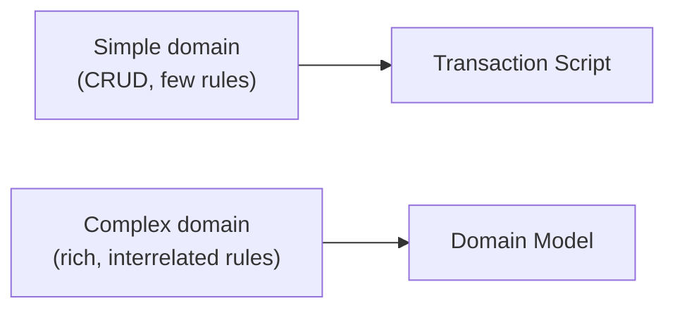
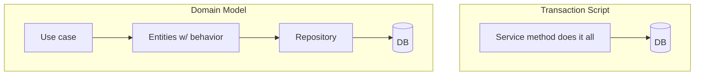
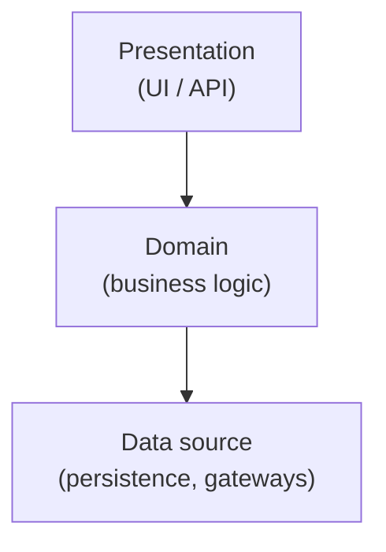
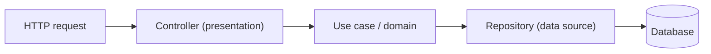
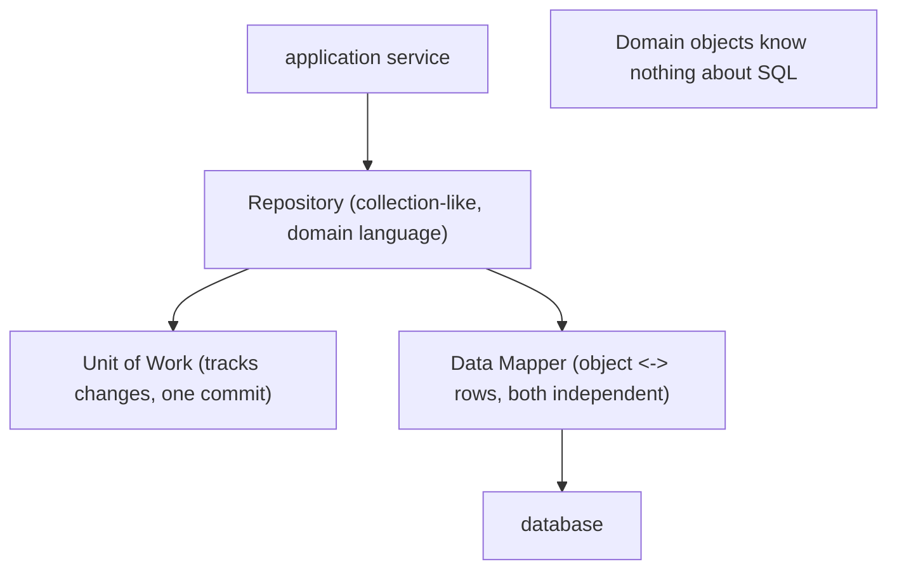
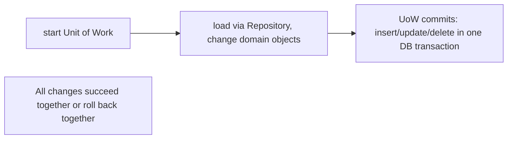

# Enterprise Application Architecture Patterns - Complete Professional Guide

> **Category:** 03_design_and_architecture · **Language:** English

---

### Organizing domain logic and data access in business applications
**Original guide written from first principles, current to 2026**

> **Original reference book (English).** This is an **independent, originally written** guide. It is not an extract, summary, or paraphrase of any third-party book; it explains application architecture patterns from first principles with original examples. Canonical books are listed under **References** as pointers only. Each chapter follows the TO-BRAIN editorial standard (see `FILE_CONVENTIONS.md`).
>
> **Scope notice:** business applications repeatedly face the same questions — where does domain logic live, and how do objects map to a database? This guide covers the patterns that answer them (Transaction Script, Domain Model, Data Mapper, Repository, Unit of Work) and when each fits, with 2026 notes on ORMs and CQRS.

---

## How to read this guide

| Level | Profile | Parts |
|-------|---------|-------|
| 1 — Beginner | New to layering business apps | Part I |
| 2 — Intermediate | Choosing logic/data patterns | Part II |

**Target audience:** backend engineers and architects building data-backed business systems.

**Structure of each chapter:** Introduction · Business context · Theoretical concepts · Architecture · Diagrams (Mermaid) · Real examples · Step by step · Complete examples · Exercises · Challenges · Checklist · Best practices · Anti-patterns · Troubleshooting · References.

> **Note on prerequisites.** Assumes SQL basics and OO modeling. Examples use Java-like syntax.

---

## Table of Contents

**Part I – Organizing domain logic**
1. Transaction Script vs Domain Model
2. Layering a business application

**Part II – Mapping to data**
3. Data Mapper, Repository, and Unit of Work

> **Status of this guide:** complete for its declared scope. **Ready:** Parts I–II (Ch. 1–3).

---

## Part I – Organizing domain logic

The first big decision in a business application is **how to structure the domain logic**. Two ends of a spectrum dominate: simple procedural scripts per use case, or a rich object model. Picking wrongly — a heavyweight model for trivial logic, or scripts for a complex domain — is a common, costly mistake. This part frames the choice.

---

## Chapter 1 — Transaction Script vs Domain Model

### 1.1 Introduction

A **Transaction Script** organizes logic as one procedure per use case: input comes in, the procedure does the work (often straight against the database), a result goes out. A **Domain Model** distributes logic across an object graph that mirrors the business, where objects hold both data and behavior. Each suits a different level of domain complexity.

### 1.2 Business context

The cost curves cross over. For simple, mostly-CRUD logic, Transaction Scripts are fastest to write and easiest to read — a Domain Model would be over-engineering. As business rules grow and interweave, scripts duplicate logic and rot, while a Domain Model's up-front investment pays back by keeping rules cohesive and changeable. Matching the pattern to the domain's actual complexity is the lever on long-term cost.

### 1.3 Theoretical concepts: the spectrum



- **Transaction Script** — procedural, one method per business transaction. Easy to understand for small logic; duplicates and tangles as logic grows.
- **Domain Model** — OO; behavior lives on the entities/value objects that own the data. Higher entry cost; scales gracefully with rule complexity. Pairs naturally with the modeling discipline in domain-driven design.

### 1.4 Architecture: where logic lives



In a Transaction Script the service holds the logic and the entities are passive data. In a Domain Model the entities hold the logic; services just orchestrate.

### 1.5 Real example

**Scenario.** Apply a loyalty discount when placing an order.

**Problem (Transaction Script grows).** The discount rule, copied into several scripts, drifts out of sync.

**Solution.** Move the rule onto the `Order`/`Customer` domain objects so there is one home for it.

**Implementation.**

```java
// Transaction Script (fine when trivial; duplicates as rules grow)
class OrderService {
    Money total(OrderInput in) {
        Money sum = sumLines(in);
        if (in.customerTier().equals("GOLD")) sum = sum.times(0.9);  // copied in N scripts
        return sum;
    }
}

// Domain Model (one home for the rule, reused everywhere)
class Order {
    Money total() { return lines.total().minus(customer.discountOn(lines.total())); }
}
class Customer {
    Money discountOn(Money base) { return tier.discount(base); }     // rule lives here
}
```

**Result.** The discount rule has a single source of truth on the domain object; every caller gets the same behavior.

**Future improvements.** As tiers multiply, model `Tier` as a value object with its own discount policy.

### 1.6 Exercises

1. When is a Transaction Script the right choice?
2. What problem appears as Transaction Scripts accumulate rules?
3. Where does behavior live in a Domain Model?

### 1.7 Challenges

- **Challenge.** Find a business rule duplicated across two service methods. Move it onto a domain object and have both call it. Did clarity improve?

### 1.8 Checklist

- [ ] I match logic style to domain complexity.
- [ ] I don't over-engineer simple CRUD with a heavy model.
- [ ] In complex domains, behavior lives with the data.
- [ ] Business rules have a single home.

### 1.9 Best practices

- Start with Transaction Scripts for genuinely simple logic; evolve to a Domain Model as rules deepen.
- Keep each business rule in exactly one place.
- Let entities own the invariants over their own data.

### 1.10 Anti-patterns

- Anemic Domain Model: entities are getters/setters, logic in services (a Transaction Script wearing OO clothes).
- A full Domain Model for trivial CRUD (needless ceremony).
- The same rule re-implemented in many scripts.

### 1.11 Troubleshooting

| Symptom | Likely cause | Action |
|---------|--------------|--------|
| Same rule edited in many services | Transaction Scripts outgrew their fit | Move rules onto domain objects |
| Heavy model for a CRUD app | Over-engineering | Simplify toward scripts |
| Entities are data-only, services huge | Anemic model | Push behavior onto entities |

### 1.12 References

- M. Fowler, *Patterns of Enterprise Application Architecture* (Addison-Wesley, 2002), ch. 9 "Domain Logic Patterns" (Transaction Script; Domain Model) — ISBN 978-0321127426.
- E. Evans, *Domain-Driven Design* (Addison-Wesley, 2003) — ISBN 978-0321125217.

---

## Chapter 2 — Layering a business application

### 2.1 Introduction

A business application is conventionally split into **presentation**, **domain (business logic)**, and **data source** layers. The point of layering is **separation of concerns**: each layer has one responsibility and depends only downward, so you can change the UI without touching rules, or the database without touching the UI. This chapter sets the layering that the data-access patterns (Part II) slot into.

### 2.2 Business context

Layers localize change and risk. When presentation, logic, and persistence are tangled, every change is dangerous and testing requires the whole stack. Clean layering lets teams work and test in parallel, swap technologies at one layer, and reason about the system one concern at a time — directly lowering change cost and defect rate.

### 2.3 Theoretical concepts: the three layers



- **Presentation** — handles interaction (HTTP, UI). No business rules.
- **Domain** — the business logic; the heart of the application. Independent of UI and database.
- **Data source** — talks to the database and external systems.

Dependencies point downward; the domain must not depend on presentation, and ideally is insulated from the data source via interfaces (see Repository, Part II) — the same inward-pointing principle as hexagonal architecture.

### 2.4 Architecture: a request through the layers



Each layer translates and delegates: the controller turns HTTP into a domain call; the domain applies rules; the data source persists. No layer reaches around another.

### 2.5 Real example

**Scenario.** A REST endpoint to register a user.

**Problem.** Putting validation and SQL in the controller couples HTTP, rules, and persistence into one untestable lump.

**Solution.** Split across layers: controller parses, domain validates and decides, data source persists.

**Implementation.**

```java
@RestController
class UserController {                         // presentation
    private final RegisterUser registerUser;
    @PostMapping("/users") UserId create(@RequestBody UserDto dto) {
        return registerUser.handle(dto.toCommand());   // delegate down
    }
}
class RegisterUser {                            // domain
    private final UserRepository users;
    UserId handle(RegisterCommand c) {
        User u = User.register(c);              // business rules/invariants here
        return users.save(u).id();
    }
}
```

**Result.** Each layer is independently testable; HTTP details, rules, and persistence change without disturbing each other.

**Future improvements.** Insulate the domain from the data source with a repository interface owned by the domain (Part II).

### 2.6 Exercises

1. Name the three classic layers and each one's single responsibility.
2. Which way do inter-layer dependencies point, and why?
3. What goes wrong when validation lives in the controller?

### 2.7 Challenges

- **Challenge.** Take an endpoint that mixes parsing, rules, and SQL. Split it into the three layers and write a unit test for the domain layer alone.

### 2.8 Checklist

- [ ] Presentation holds no business rules.
- [ ] The domain layer is independent of UI and database.
- [ ] Dependencies point downward only.
- [ ] Each layer is testable in isolation.

### 2.9 Best practices

- Keep business logic out of controllers and out of the database layer.
- Insulate the domain from persistence behind interfaces.
- Test the domain layer without spinning up the web or DB.

### 2.10 Anti-patterns

- Smart UI: business rules embedded in controllers/views.
- The domain layer importing web or ORM types directly.
- Layers that bypass each other (presentation hitting the DB).

### 2.11 Troubleshooting

| Symptom | Likely cause | Action |
|---------|--------------|--------|
| Can't test rules without HTTP/DB | Logic tangled across layers | Extract a pure domain layer |
| UI change breaks business rules | Rules living in presentation | Move rules into the domain |
| DB change ripples into controllers | Layers bypassed | Route access through the data layer |

### 2.12 References

- M. Fowler, *Patterns of Enterprise Application Architecture* (Addison-Wesley, 2002), ch. 1 "Layering" & ch. 9 "Domain Logic Patterns" (Service Layer) — ISBN 978-0321127426.
- A. Cockburn, "Hexagonal Architecture," https://alistair.cockburn.us/hexagonal-architecture/.

---

> **End of Part I.** You can now choose between Transaction Script and Domain Model by the domain's real complexity, keep each business rule in one home, and layer an application into presentation/domain/data-source with dependencies pointing downward and a testable domain at the center. **Part II — Mapping to data** (Chapter 3) covers Data Mapper, Repository as a collection-like domain interface, and Unit of Work for coordinating changes in one transaction.

---

## Part II – Mapping to data

Part I surveyed how enterprise apps organize domain logic. Part II tackles the boundary every such app must cross: getting objects in and out of a relational database without letting the database shape — or corrupt — the domain model. The patterns are **Data Mapper**, **Repository**, and **Unit of Work**.

---

## Chapter 3 — Data Mapper, Repository, and Unit of Work

### 3.1 Introduction

Three Fowler patterns separate a rich domain model from its database. A **Data Mapper** moves data between objects and the database while keeping them **independent** of each other — the domain class knows nothing about SQL, and vice versa (unlike Active Record, where the object *is* the row). A **Repository** sits on top and offers a **collection-like** interface for one aggregate type (`orders.findById`, `orders.add`), hiding the query layer behind domain language. A **Unit of Work** tracks the objects touched in a business transaction and writes all the changes in **one** coordinated commit, managing order and concurrency.

### 3.2 Business context

In a complex domain, letting persistence leak into business objects is what makes them hard to test and change: every rule drags a database with it, and a schema change ripples into the model. Data Mapper keeps the domain pure (testable without a database, evolvable independently of the schema). Repository gives application code a clean, intention-revealing way to fetch and store aggregates. Unit of Work prevents the classic bugs of partial writes and N scattered `UPDATE`s by committing a consistent set of changes once. Together they let an enterprise model grow in complexity without drowning in data-access code.

### 3.3 Theoretical concepts: separate the model from the store



**Data Mapper** is the translation layer; the domain object and the table evolve independently. **Repository** is the domain-facing abstraction — code asks for objects by domain criteria, not by writing SQL — which also makes it trivial to substitute a fake in tests. **Unit of Work** records new/dirty/removed objects during a business transaction and, on commit, writes them in the right order within one database transaction, also handling optimistic concurrency. Contrast with **Active Record**, which fuses object and row — simpler for CRUD, but it couples the model to the schema and struggles with rich domains.

### 3.4 Architecture: one transaction, coordinated writes



The Unit of Work turns a business operation that touches several objects into a single atomic write, so the database never sees a half-applied change.

### 3.5 Real example

**Scenario.** Confirming an order updates the order, decrements line stock, and writes an audit entry.

**Problem.** Doing three separate saves risks partial writes, and embedding SQL in the domain objects makes them untestable and schema-coupled.

**Solution.** Fetch via a **Repository**, change pure domain objects, and let a **Unit of Work** commit all changes via a **Data Mapper** in one transaction.

**Implementation.**

```text
# Domain stays pure (no SQL); Data Mapper handles persistence elsewhere.
uow = UnitOfWork.begin()
order = orders.findById(id)        # Repository -> Data Mapper loads the object
order.confirm()                    # pure domain logic, marks objects dirty
audit.add(AuditEntry.for(order))   # Repository registers a new object
uow.commit()                       # ONE DB transaction: update order, update stock, insert audit
# on failure: uow.rollback() — nothing partially applied
```

**Result.** The domain objects contain only business logic and can be unit-tested without a database; the Repository reads as domain language; the Unit of Work guarantees the three changes commit together or not at all. Swapping the datastore or schema touches the mappers, not the model.

**Future improvements.** Add optimistic locking (version column) in the Unit of Work; for simple CRUD entities with no rich behavior, Active Record may be the lighter choice — match the pattern to the complexity.

### 3.6 Exercises

1. How does Data Mapper differ from Active Record, and when does each fit?
2. What does a Repository hide, and why does that help testing?
3. What problem does a Unit of Work solve across multiple object changes?

### 3.7 Challenges

- **Challenge.** Implement a Repository interface for one aggregate with an in-memory fake and a DB-backed Data Mapper. Write a use case that changes two objects and commits them through a Unit of Work in one transaction.

### 3.8 Checklist

- [ ] Domain objects contain no SQL (Data Mapper handles persistence).
- [ ] Application code fetches/stores aggregates via Repositories.
- [ ] Multi-object changes commit through a Unit of Work in one transaction.
- [ ] I choose Active Record vs. Data Mapper by domain complexity.

### 3.9 Best practices

- Keep the domain ignorant of persistence; map at the boundary.
- Expose collection-like Repositories per aggregate type.
- Commit business transactions through a Unit of Work.

### 3.10 Anti-patterns

- SQL and ORM annotations spread through domain logic.
- Saving each object separately (partial-write bugs).
- Repositories that leak arbitrary query methods instead of domain intent.

### 3.11 Troubleshooting

| Symptom | Likely cause | Action |
|---------|--------------|--------|
| Domain untestable without a database | Persistence embedded in the model | Introduce a Data Mapper; keep the model pure |
| Partial writes on failure | Independent saves | Coordinate changes in a Unit of Work |
| Data-access code everywhere | No Repository abstraction | Add Repositories per aggregate |

### 3.12 References

- M. Fowler, *Patterns of Enterprise Application Architecture* (Addison-Wesley, 2002), Data Mapper, Repository, Unit of Work — ISBN 978-0321127426.
- E. Evans, *Domain-Driven Design* (Addison-Wesley, 2003), Repositories — ISBN 978-0321125217.

---

> **End of Part II.** Enterprise apps keep a rich domain free of the database with a **Data Mapper** (object and table independent), a **Repository** (collection-like, domain-language access per aggregate), and a **Unit of Work** (track changes, commit once) — choosing Active Record only for simple CRUD. With Part I's domain-logic patterns, you can now cross the object-relational boundary without letting it corrupt the model.
