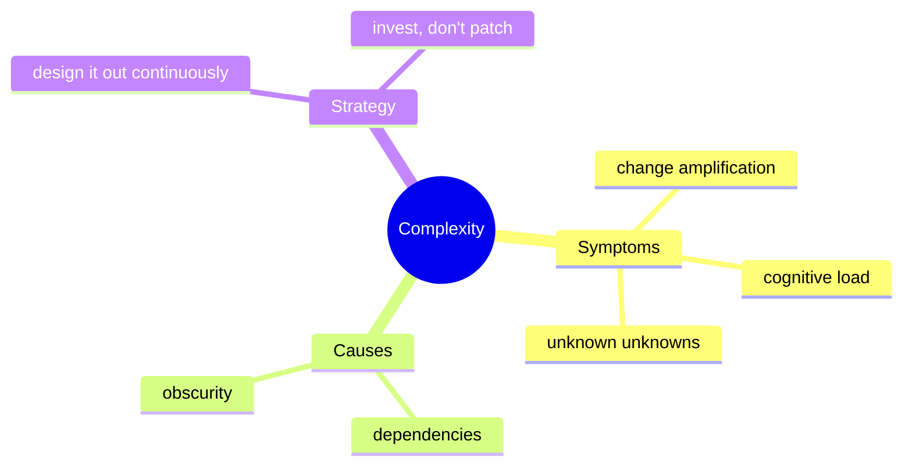
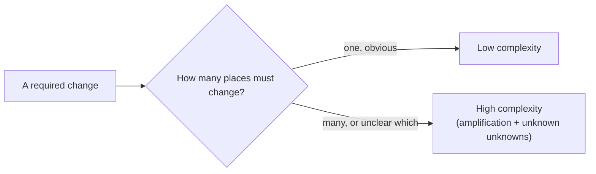
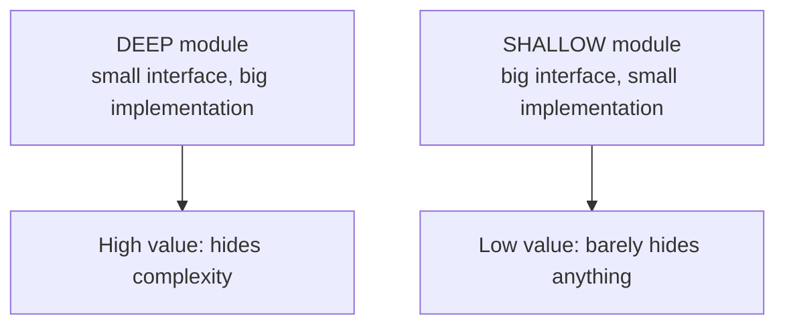
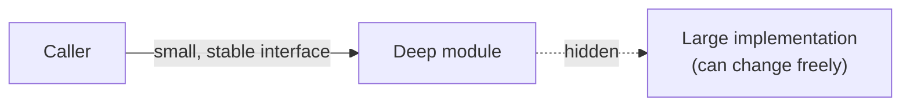

# Managing Software Complexity - Complete Professional Guide

> **Category:** 03_design_and_architecture · **Language:** English

---

### Deep modules, information hiding, and designing complexity out
**Original guide written from first principles, current to 2026**

> **Original reference book (English).** This is an **independent, originally written** guide. It is not an extract, summary, or paraphrase of any third-party book; it teaches complexity management from first principles. Canonical books are listed under **References** as pointers only. Each chapter follows the TO-BRAIN editorial standard (see `FILE_CONVENTIONS.md`).
>
> **Scope notice:** the central problem of long-lived software is **complexity** — the thing that makes a system hard to understand and change. This guide defines complexity precisely, names its symptoms, and gives design moves (deep modules, information hiding, defining errors out of existence) that reduce it.

---

## How to read this guide

| Level | Profile | Parts |
|-------|---------|-------|
| 1 — Beginner | New to design thinking | Part I |
| 2 — Intermediate | Designing modules | Part II |

**Target audience:** developers and tech leads who want their code to stay understandable as it grows.

**Structure of each chapter:** Introduction · Business context · Theoretical concepts · Architecture · Diagrams (Mermaid) · Real examples · Step by step · Complete examples · Exercises · Challenges · Checklist · Best practices · Anti-patterns · Troubleshooting · References.

> **Note on prerequisites.** Assumes you write and review code regularly. Language-neutral.

---

## Table of Contents

**Part I – Understanding complexity**
1. What complexity is and how to recognize it
2. Modules should be deep

**Part II – Reducing it**
3. Information hiding and defining errors out of existence

> **Status of this guide:** phased delivery. **Ready:** Part I (Ch. 1–2). **In progress:** Part II.

---

## Part I – Understanding complexity

Complexity is anything about a system's structure that makes it **hard to understand or modify**. It is not a single big thing; it accumulates in small increments — a slightly unclear name here, an extra dependency there — until no one fully understands the system. Fighting it is the central, continuous job of design, not a one-time cleanup.

---

## Chapter 1 — What complexity is

### 1.1 Introduction

**Complexity** is whatever makes software hard to understand and change. It manifests in three symptoms: **change amplification** (a simple change touches many places), **cognitive load** (how much you must know to make a change), and **unknown unknowns** (it's not even obvious what you must know or change). Good design attacks all three; the most insidious is the third.

### 1.2 Business context

Complexity is the tax on every future change: as it grows, each feature costs more and risks more, and eventually the system resists change entirely. Because it accumulates incrementally and invisibly, teams rarely notice until velocity has already collapsed. Treating complexity reduction as ongoing design work — not optional polish — is what keeps a codebase economically viable over years.

### 1.3 Theoretical concepts: symptoms and causes



Complexity has two root causes: **dependencies** (code that can't be understood or changed in isolation) and **obscurity** (important information that isn't obvious). Reduce dependencies and eliminate obscurity, and complexity falls. The mindset matters: a **strategic** approach invests a little extra design effort continuously, versus a **tactical** approach that ships the quickest patch and lets complexity pile up.

### 1.4 Architecture: where complexity hides



The test is concrete: when a typical change comes in, how many places must you touch, and is it obvious which? If a small requirement ripples widely or you can't tell what to change without reading everything, the design is too complex there.

### 1.5 Real example

**Scenario.** Adding a new field to a form requires edits in the UI, a DTO, a validator, a mapper, and the database layer — five files for one field.

**Problem.** Change amplification: the field's knowledge is smeared across five modules.

**Solution.** Concentrate that knowledge so the change is local — e.g. derive the DTO/validation from one schema definition.

**Implementation (sketch).**

```text
# BEFORE: field knowledge duplicated in 5 places (amplification)
ui_form, dto, validator, mapper, db_migration   # all edited per field

# AFTER: one source of truth, the rest derived
field_schema = { name, type, required, max_length }   # declare once
# UI, validation, mapping generated/driven from field_schema
```

**Result.** Adding a field is one declaration; the layers consume it. Change amplification collapses.

**Future improvements.** Add a test that fails if a layer hand-codes a field instead of reading the schema.

### 1.6 Exercises

1. Name the three symptoms of complexity and which is worst.
2. What are the two root causes of complexity?
3. Contrast tactical and strategic programming.

### 1.7 Challenges

- **Challenge.** Take a recent small change. Count how many files you touched and whether it was obvious which. If many/unclear, find the dependency or obscurity behind it.

### 1.8 Checklist

- [ ] I can spot change amplification and unknown unknowns.
- [ ] I attribute complexity to dependencies or obscurity.
- [ ] I invest small, continuous design effort (strategic).
- [ ] I judge designs by how local a typical change is.

### 1.9 Best practices

- Treat reducing complexity as part of every change, not a separate task.
- Spend a little extra now to keep the system understandable (strategic > tactical).
- Make "how local is a typical change?" a design review question.

### 1.10 Anti-patterns

- Tactical tornado: always shipping the fastest patch, complexity be damned.
- Knowledge of one concept smeared across many modules.
- Obscure code that "works" but no one can safely change.

### 1.11 Troubleshooting

| Symptom | Likely cause | Action |
|---------|--------------|--------|
| One small change edits many files | Change amplification | Concentrate the knowledge; one source of truth |
| Devs must read everything to change anything | High cognitive load | Reduce dependencies; clarify interfaces |
| Bugs from "I didn't know I had to change that" | Unknown unknowns | Make required info obvious; reduce obscurity |

### 1.12 References

- J. Ousterhout, *A Philosophy of Software Design*, 2nd ed. (Yaknyam Press, 2021) — ISBN 978-1732102217.
- F. Brooks, "No Silver Bullet" (1986), on essential vs accidental complexity.

---

## Chapter 2 — Modules should be deep

### 2.1 Introduction

A **module** (class, function, service) has an **interface** (what users must know) and an **implementation** (what it does inside). A **deep** module hides a lot of functionality behind a simple interface — much benefit, little cost to use. A **shallow** module has a complex interface relative to what it does — its abstraction barely pays for itself. Designing deep modules is the most reliable way to keep complexity down.

### 2.2 Business context

Every interface a developer must learn is cognitive load and a future change point. Deep modules minimize the total interface surface a team must understand to build features, so the system stays learnable as it grows. Shallow modules do the opposite: they multiply abstractions without hiding much, so "more structure" makes the code *harder*, not easier.

### 2.3 Theoretical concepts: depth = benefit / cost



Think of a module as benefit (functionality provided) over cost (interface you must learn). A garbage collector is extremely deep: a vast implementation behind essentially no interface. A pass-through method that just forwards a call with the same signature is shallow — pure cost. Favor fewer, deeper modules over many shallow ones.

### 2.4 Architecture: interface vs implementation



The smaller and more stable the interface relative to the implementation, the freer you are to change the inside without breaking callers — and the less anyone has to learn to use it.

### 2.5 Real example

**Scenario.** A file-store abstraction is needed by the app.

**Problem.** A shallow design exposes `open`, `seek`, `read`, `decode`, `close` — callers orchestrate five calls and must know the order.

**Solution.** A deep interface: `read(path) -> bytes` hides all of it.

**Implementation.**

```java
// SHALLOW: caller must know the dance (big interface, little hidden)
f = store.open(path); store.seek(f, 0); var b = store.read(f, len); store.close(f);

// DEEP: one obvious call, everything hidden (small interface, lots hidden)
byte[] data = store.read(path);
```

**Result.** Callers learn one method; the implementation can change buffering, retries, or backend with no caller impact.

**Future improvements.** Keep the interface stable as you add caching/retry inside — depth lets you do that invisibly.

### 2.6 Exercises

1. Define a deep vs a shallow module with an example of each.
2. Why is a pass-through method usually a bad sign?
3. How does interface stability relate to module depth?

### 2.7 Challenges

- **Challenge.** Find a shallow module you own (big interface, little hidden). Redesign a deeper interface that hides more, and check how much caller code simplifies.

### 2.8 Checklist

- [ ] I judge modules by benefit-over-interface-cost.
- [ ] I prefer fewer, deeper modules to many shallow ones.
- [ ] My interfaces are small relative to what they hide.
- [ ] I avoid pass-through methods that add no value.

### 2.9 Best practices

- Push complexity *down* into the module, away from its users.
- Design the interface for the common case to be simplest.
- Keep interfaces stable while implementations evolve.

### 2.10 Anti-patterns

- Shallow classes/methods that add an interface without hiding much.
- "Classitis": many tiny classes that each must be learned.
- Leaking implementation details into the interface.

### 2.11 Troubleshooting

| Symptom | Likely cause | Action |
|---------|--------------|--------|
| Callers orchestrate many calls in order | Shallow interface | Provide a deep, single-call interface |
| Too many tiny modules to learn | Over-decomposition | Consolidate into fewer deep modules |
| Interface changes break many callers | Implementation leaking out | Hide details behind a stable interface |

### 2.12 References

- J. Ousterhout, *A Philosophy of Software Design*, 2nd ed. (Yaknyam Press, 2021) — ISBN 978-1732102217.
- D. Parnas, "On the Criteria To Be Used in Decomposing Systems into Modules" (CACM, 1972).

---

> **End of Part I.** You can now define complexity by its symptoms (change amplification, cognitive load, unknown unknowns) and root causes (dependencies, obscurity), adopt a strategic rather than tactical mindset, and design **deep** modules that hide much behind small, stable interfaces. **Part II — Reducing it** (Chapter 3) covers information hiding, choosing what to expose, and "defining errors out of existence" so whole classes of edge cases disappear.

<!--APPEND-PART-II-->
