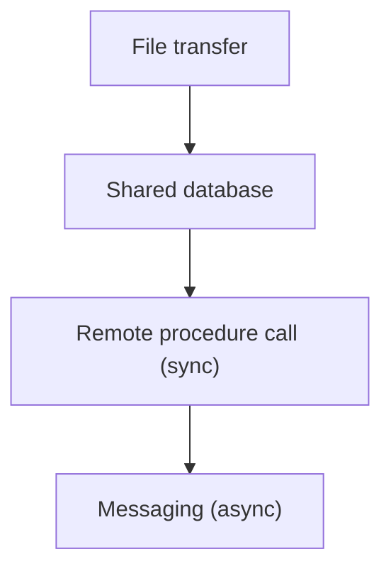
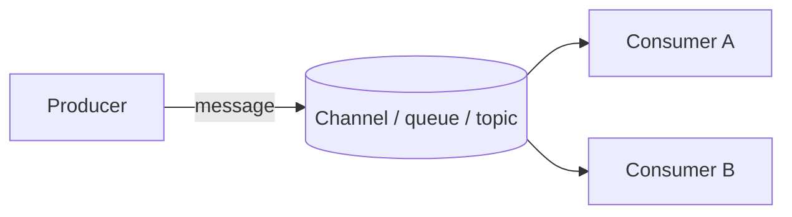
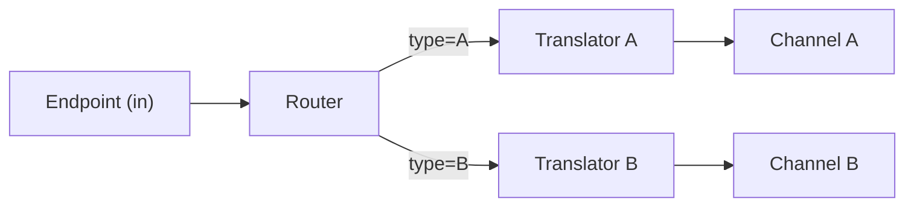
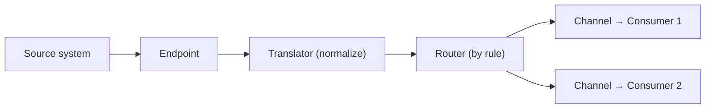
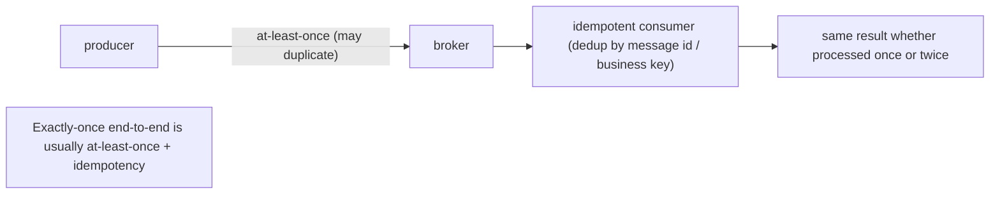
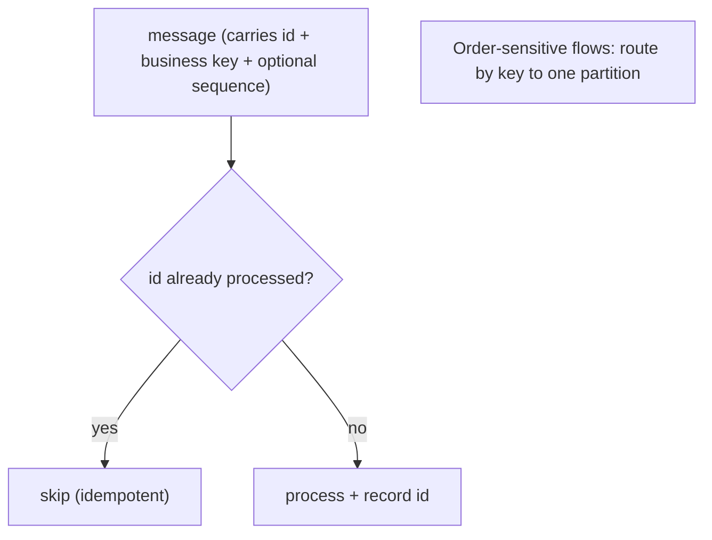

# Messaging and Integration Patterns - Complete Professional Guide

> **Category:** 03_design_and_architecture · **Language:** English

---

### Connecting systems reliably with asynchronous messages
**Original guide written from first principles, current to 2026**

> **Original reference book (English).** This is an **independent, originally written** guide. It is not an extract, summary, or paraphrase of any third-party book; it explains integration patterns from first principles with original examples. Canonical books are listed under **References** as pointers only. Each chapter follows the TO-BRAIN editorial standard (see `FILE_CONVENTIONS.md`).
>
> **Scope notice:** when independent systems must cooperate, **asynchronous messaging** is usually the most robust glue. This guide covers channels, messages, routing, and transformation, plus the delivery guarantees that decide correctness — grounded in how 2026 brokers (Kafka, RabbitMQ, cloud queues) actually behave.

---

## How to read this guide

| Level | Profile | Parts |
|-------|---------|-------|
| 1 — Beginner | New to async integration | Part I |
| 2 — Intermediate | Designing message flows | Part II |

**Target audience:** backend, integration, and platform engineers wiring services together without tight coupling.

**Structure of each chapter:** Introduction · Business context · Theoretical concepts · Architecture · Diagrams (Mermaid) · Real examples · Step by step · Complete examples · Exercises · Challenges · Checklist · Best practices · Anti-patterns · Troubleshooting · References.

> **Note on prerequisites.** Assumes basic networking and that you've called an API. No prior broker experience required.

---

## Table of Contents

**Part I – Foundations**
1. Why messaging: coupling, time, and failure
2. Channels, messages, and the building blocks

**Part II – Guarantees**
3. Delivery semantics, idempotency, and ordering

> **Status of this guide:** complete for its declared scope. **Ready:** Parts I–II (Ch. 1–3).

---

## Part I – Foundations

Integrating systems by synchronous calls couples them in **time**: if the callee is down or slow, the caller is too. Asynchronous messaging breaks that coupling — the sender hands a message to a channel and moves on; the receiver processes when it can. The cost is new concerns (ordering, duplicates, eventual consistency) that this guide makes explicit.

---

## Chapter 1 — Why messaging

### 1.1 Introduction

**Messaging** lets one system send data to another through a **channel** without both being available at the same instant. The sender is decoupled from the receiver in time, location, and rate. This is the foundation of resilient integration: a spike or an outage in one component becomes a queue depth, not a cascade of failures.

### 1.2 Business context

Systems that integrate synchronously fail together: one slow downstream drags down everything upstream, and an outage propagates instantly. Messaging converts hard coupling into a buffer — work accumulates safely and drains when capacity returns. For the business this means higher availability, smoother load handling (absorbing spikes), and the freedom to evolve services independently behind stable message contracts.

### 1.3 Theoretical concepts: four integration styles



Systems can integrate by **shared files**, a **shared database**, **synchronous RPC**, or **messaging**. Each trades immediacy against coupling. Messaging is favored when you need loose coupling and resilience: the systems agree only on a **message format** and a **channel**, nothing about each other's internals or uptime.

### 1.4 Architecture: sender, channel, receiver



A **message** is a self-describing packet (header + payload). A **channel** carries messages from producers to consumers. A **point-to-point** channel (queue) delivers each message to exactly one consumer; a **publish-subscribe** channel (topic) delivers a copy to every subscriber. Choosing between them is the first design decision.

### 1.5 Real example

**Scenario.** Placing an order must trigger inventory reservation, a confirmation email, and analytics.

**Problem.** Calling all three synchronously inside the order request makes checkout slow and fragile — any one being down fails the order.

**Solution.** The order service publishes an `OrderPlaced` event to a pub-sub topic; the three consumers react independently, on their own time.

**Implementation (sketch).**

```text
# Order service (producer) — fast, only its own work + publish
place_order(cmd):
    order = persist(cmd)
    publish("orders", OrderPlaced{ id: order.id, items: order.items })
    return order.id                  # checkout returns immediately

# Independent consumers, each subscribed to "orders"
inventory_service:  on OrderPlaced -> reserve(items)
email_service:      on OrderPlaced -> send_confirmation(id)
analytics_service:  on OrderPlaced -> record(id)
```

**Result.** Checkout is fast and resilient; a downstream outage only delays that consumer's work (it catches up from the channel), without failing the order.

**Future improvements.** Add a dead-letter channel for messages a consumer repeatedly fails to process; version the `OrderPlaced` schema.

### 1.6 Exercises

1. What kind of coupling does messaging remove that RPC keeps?
2. Contrast point-to-point and publish-subscribe channels.
3. Give a workflow that becomes more resilient when made asynchronous.

### 1.7 Challenges

- **Challenge.** Take a synchronous fan-out call in your system (one request triggering several downstream calls). Redesign it as a published event with independent consumers. What new failure modes appear?

### 1.8 Checklist

- [ ] I can explain time/space decoupling from messaging.
- [ ] I choose queue vs topic deliberately.
- [ ] I treat the message format as the integration contract.
- [ ] I plan for downstream outages as queue depth, not cascading failure.

### 1.9 Best practices

- Integrate via stable message contracts, not shared databases.
- Use pub-sub when several independent consumers need the same event.
- Provide a dead-letter channel for poison messages.

### 1.10 Anti-patterns

- A shared database used as a covert integration channel.
- Synchronous chains where one slow hop stalls the whole request.
- Messages that leak a producer's internal schema to all consumers.

### 1.11 Troubleshooting

| Symptom | Likely cause | Action |
|---------|--------------|--------|
| One outage cascades across services | Synchronous coupling | Introduce a channel/buffer |
| A bad message blocks a consumer | No dead-letter handling | Route poison messages to a DLQ |
| Consumers break on producer changes | Leaky/unversioned schema | Define and version the contract |

### 1.12 References

- G. Hohpe, B. Woolf, *Enterprise Integration Patterns* (Addison-Wesley, 2003), ch. 2 "Messaging Systems" (the "Messaging" pattern; "Why Use Messaging?") — ISBN 978-0321200686.
- Official docs: Apache Kafka (https://kafka.apache.org/documentation/), RabbitMQ (https://www.rabbitmq.com/docs).

---

## Chapter 2 — Channels, messages, and building blocks

### 2.1 Introduction

Beyond producer/channel/consumer, a small set of building blocks composes almost every integration: **routers** decide where a message goes, **translators** change its shape, and **endpoints** connect applications to channels. Knowing these lets you describe any flow as a pipeline of simple, testable steps.

### 2.2 Business context

Integration logic tends to sprawl into tangled, one-off glue code that nobody can change safely. Decomposing a flow into named building blocks (route here, transform there) makes it inspectable and modifiable, and lets teams reason about and monitor each hop independently — turning fragile glue into a maintainable pipeline.

### 2.3 Theoretical concepts: the core blocks

- **Message channel** — the conduit (queue or topic).
- **Message router** — sends a message to different channels based on content or rules (e.g. route premium orders to a priority channel).
- **Message translator** — converts between formats so systems with different schemas can talk (an anti-corruption point).
- **Message endpoint** — the adapter that connects an application to the messaging system (produces/consumes).



### 2.4 Architecture: a pipeline of steps



Each block does one thing, so the flow is a readable pipeline you can test stage by stage and observe per hop.

### 2.5 Real example

**Scenario.** Incoming orders arrive in several formats and must be split by region.

**Problem.** A single handler with nested conditionals for format and region is unmaintainable.

**Solution.** A translator normalizes every format to a canonical order; a content-based router sends each to its regional channel.

**Implementation (sketch).**

```text
endpoint(raw):
    order = translate_to_canonical(raw)         # translator: many formats -> one
    region = order.shipping.country_region
    route(order, channel = "orders." + region)  # router: by content
```

**Result.** Adding a new source format means one new translator; adding a region means one routing rule — neither touches existing logic.

**Future improvements.** Emit metrics per channel to watch regional volume; add schema validation in the endpoint.

### 2.6 Exercises

1. What does a message router decide, and based on what?
2. Why is a translator also an anti-corruption point?
3. Decompose a flow you know into endpoint/translator/router steps.

### 2.7 Challenges

- **Challenge.** Model an integration as a pipeline of named blocks (endpoint → translator → router → channels). Identify which single block changes for each likely new requirement.

### 2.8 Checklist

- [ ] I decompose flows into routers, translators, endpoints.
- [ ] I normalize to a canonical format at the boundary.
- [ ] Each block is independently testable and observable.
- [ ] Routing rules are explicit, not buried in conditionals.

### 2.9 Best practices

- Normalize foreign formats to a canonical model on entry.
- Keep each block single-purpose; compose flows from them.
- Instrument each hop so you can see where messages go and stall.

### 2.10 Anti-patterns

- One mega-handler with nested format/region conditionals.
- Translating in many places instead of once at the boundary.
- Routing logic duplicated across consumers.

### 2.11 Troubleshooting

| Symptom | Likely cause | Action |
|---------|--------------|--------|
| New source format touches many files | No canonical translation point | Normalize once at the endpoint |
| Hard to see why a message went somewhere | Implicit routing | Make routing rules explicit and logged |
| Consumers re-parse raw formats | Missing translator | Convert to canonical before routing |

### 2.12 References

- G. Hohpe, B. Woolf, *Enterprise Integration Patterns* (Addison-Wesley, 2003), the "Messaging Channels" & "Message Construction" pattern chapters (Message Channel; Message) — ISBN 978-0321200686.
- Apache Camel docs (EIP implementations): https://camel.apache.org/components/latest/eips/enterprise-integration-patterns.html.

---

> **End of Part I.** You can now choose messaging to decouple systems in time and failure, pick queues vs topics deliberately, and decompose any integration into a readable pipeline of channels, routers, translators, and endpoints. **Part II — Guarantees** (Chapter 3) tackles the hard part: at-least-once vs exactly-once delivery, designing idempotent consumers, and when ordering actually matters.

---

## Part II – Guarantees

Part I covered the messaging channels and patterns that decouple systems. Part II is about the guarantees those channels actually provide — and the ones they don't: **delivery semantics**, **idempotency**, and **ordering**. Getting these wrong is the most common source of subtle integration bugs.

---

## Chapter 3 — Delivery semantics, idempotency, and ordering

### 3.1 Introduction

Asynchronous messaging trades strong, synchronous guarantees for decoupling, and you must design around what's left. **Delivery semantics** come in three flavors: **at-most-once** (may lose messages), **at-least-once** (may deliver duplicates), and **exactly-once** (ideal but expensive and often illusory across systems). Real brokers almost always give **at-least-once**, so consumers must be **idempotent** — processing the same message twice has the same effect as once. And messaging generally guarantees ordering only within limits, so code must not assume global order. Design for duplicates and reordering, not against them.

### 3.2 Business context

These guarantees decide whether an integration is correct or quietly corrupts data. If a payment message is delivered twice and the consumer isn't idempotent, a customer is charged twice — a real incident, not a theoretical one. If two events arrive out of order, an "account closed" can be processed before "account opened". Teams that assume exactly-once, in-order delivery build systems that work in testing and fail under retries and failover. Designing for at-least-once with idempotent consumers makes the system **safe under the retries that production guarantees will happen**.

### 3.3 Theoretical concepts: assume duplicates, design idempotency



Because at-least-once means a message can arrive more than once (on retry, redelivery, or failover), the consumer must **deduplicate** — track processed message ids, or make the operation naturally idempotent (e.g., "set status = PAID" rather than "increment balance"). What people call "exactly-once" is typically **at-least-once delivery plus idempotent processing**. **Ordering** is usually guaranteed only per-partition/per-queue, not globally; if order matters, key related messages to the same partition or carry a sequence number and handle out-of-order arrival.

### 3.4 Architecture: dedup at the consumer, key for order



Idempotency lives at the **consumer**: a processed-id store or a naturally idempotent write. Ordering, when needed, is arranged at the **producer**: route messages that must stay ordered (same account, same order) to the same partition/queue so they're delivered in sequence.

### 3.5 Real example

**Scenario.** A billing service consumes `PaymentReceived` events to mark invoices paid.

**Problem.** The broker is at-least-once, so `PaymentReceived` can arrive twice on retry; a naive consumer would record the payment twice.

**Solution.** Make the consumer **idempotent** using the payment's id, and key events by account to preserve per-account order.

**Implementation.**

```text
on PaymentReceived(e):
    if processed.contains(e.paymentId): return        # dedup -> idempotent
    invoice = invoices.find(e.invoiceId)
    invoice.markPaid(e.amount)                         # naturally idempotent set, not increment
    processed.add(e.paymentId)

# producer side: route by accountId so an account's events stay ordered
publish(topic, key = e.accountId, msg = e)
```

**Result.** A duplicated `PaymentReceived` is ignored (the id is already recorded), so no double-charge; using a "mark paid" set instead of a balance increment makes reprocessing harmless; keying by account keeps each account's events in order. The integration is correct under the retries production will produce.

**Future improvements.** Use a transactional outbox so producing the event and committing the state change are atomic; add a dead-letter queue for poison messages.

### 3.6 Exercises

1. Name the three delivery semantics and which one brokers typically provide.
2. Why must an at-least-once consumer be idempotent, and how do you make it so?
3. What is the usual scope of ordering guarantees, and how do you preserve order when you need it?

### 3.7 Challenges

- **Challenge.** Make a message consumer idempotent two ways: (a) a processed-id store, and (b) a naturally idempotent write. Then arrange producer-side keying so related messages stay ordered.

### 3.8 Checklist

- [ ] I assume at-least-once delivery (design for duplicates).
- [ ] Consumers deduplicate by message id or use idempotent writes.
- [ ] Order-sensitive messages are keyed to the same partition/queue.
- [ ] I don't rely on global ordering or true exactly-once.

### 3.9 Best practices

- Make every consumer idempotent; prefer idempotent operations over counters.
- Key related messages for per-entity ordering.
- Use a transactional outbox to publish events atomically with state.

### 3.10 Anti-patterns

- Assuming exactly-once, in-order delivery across systems.
- Non-idempotent consumers (double effects on retry).
- Relying on global message order.

### 3.11 Troubleshooting

| Symptom | Likely cause | Action |
|---------|--------------|--------|
| Duplicate effects (double charge) | At-least-once + non-idempotent consumer | Dedup by id / use idempotent writes |
| Events processed out of order | No partition keying | Route related messages to one partition |
| Event lost after a crash | State committed but event not published | Use a transactional outbox |

### 3.12 References

- G. Hohpe, B. Woolf, *Enterprise Integration Patterns* (Addison-Wesley, 2003), channels, idempotent receiver, guaranteed delivery — ISBN 978-0321200686.
- M. Kleppmann, *Designing Data-Intensive Applications* (O'Reilly, 2017), delivery semantics & ordering — ISBN 978-1449373320.

---

> **End of Part II.** Messaging guarantees are limited by design: assume **at-least-once** delivery, make consumers **idempotent** (dedup by id or idempotent writes), and arrange **ordering** only where the broker provides it (per-partition keying). With Part I's integration patterns, you can now build integrations that stay correct under the retries and reordering production guarantees.
