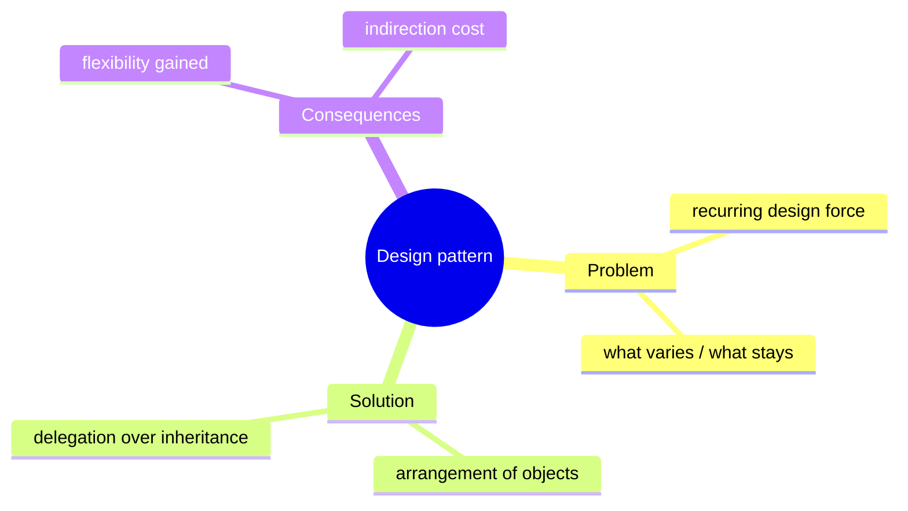
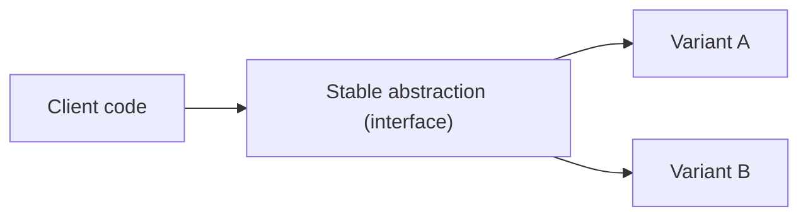
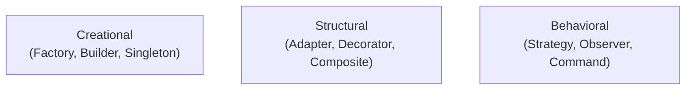

# Object-Oriented Design Patterns - Complete Professional Guide

> **Category:** 03_design_and_architecture · **Language:** English

---

### Reusable solutions to recurring design problems — and when not to use them
**Original guide written from first principles, current to 2026**

> **Original reference book (English).** This is an **independent, originally written** guide. It is not an extract, summary, or paraphrase of any third-party book; it explains design patterns from first principles with original examples. Canonical books are listed under **References** as pointers only. Each chapter follows the TO-BRAIN editorial standard (see `FILE_CONVENTIONS.md`).
>
> **Scope notice:** a design pattern is a **named, reusable solution** to a problem that recurs in object-oriented design. This guide explains the vocabulary, a representative pattern from each family (creational, structural, behavioral), and — critically — the judgment to apply them sparingly, with 2026 notes on how language features have absorbed several classic patterns.

---

## How to read this guide

| Level | Profile | Parts |
|-------|---------|-------|
| 1 — Beginner | Learning the vocabulary | Part I |
| 2 — Intermediate | Applying with judgment | Part II |

**Target audience:** OO developers and reviewers who want a shared vocabulary for design without over-engineering.

**Structure of each chapter:** Introduction · Business context · Theoretical concepts · Architecture · Diagrams (Mermaid) · Real examples · Step by step · Complete examples · Exercises · Challenges · Checklist · Best practices · Anti-patterns · Troubleshooting · References.

> **Note on prerequisites.** Assumes classes, interfaces, and polymorphism. Examples use Java-like syntax.

---

## Table of Contents

**Part I – Foundations**
1. What a pattern is — and the cost of overusing them
2. The three families with one example each

**Part II – Judgment**
3. Patterns absorbed by modern language features

> **Status of this guide:** phased delivery. **Ready:** Part I (Ch. 1–2). **In progress:** Part II.

---

## Part I – Foundations

Patterns are a **vocabulary** first and a toolbox second. Their biggest value is letting a team say "use a Strategy here" and everyone picture the same structure. Their biggest danger is treating them as goals — sprinkling patterns where a plain function would do. This part gives you the vocabulary and the restraint to match.

---

## Chapter 1 — What a pattern is (and overuse)

### 1.1 Introduction

A **design pattern** names a proven arrangement of classes and objects that solves a recurring design problem, along with the trade-offs it carries. Patterns are discovered, not invented — they are the shapes good designers kept arriving at independently. Knowing them speeds communication and gives you tested starting points. Misusing them buries simple problems under needless indirection.

### 1.2 Business context

A shared pattern vocabulary makes design discussions and code reviews faster and less ambiguous, and gives newcomers recognizable structures to latch onto. But every pattern adds indirection, and indirection has a comprehension cost. The business value is in using the *right amount* — enough structure to absorb known change, not so much that simple code becomes a maze.

### 1.3 Theoretical concepts: pattern = problem + solution + consequences



A pattern is only justified when there is a real **force** — something that varies and must be isolated. The guiding principle behind most patterns is "**program to an interface, not an implementation**" and "**favor composition over inheritance**": isolate what varies behind an abstraction so the rest of the code is closed to that change.

### 1.4 Architecture: where patterns sit



Almost every pattern is a variation on this: the client depends on a stable abstraction; the thing that varies is swapped behind it. The pattern names *how* the swap is wired (construction, structure, or behavior).

### 1.5 Real example

**Scenario.** A report exporter must support several formats, with more coming.

**Problem.** A growing `if/else` on format type is edited for every new format and mixes concerns.

**Solution.** Isolate "how to format" behind an interface (a Strategy) — new formats are new classes, not edits to existing code.

**Implementation.**

```java
interface ReportFormatter { String format(Report r); }      // the abstraction

class CsvFormatter  implements ReportFormatter { public String format(Report r){ /* ... */ return ""; } }
class JsonFormatter implements ReportFormatter { public String format(Report r){ /* ... */ return ""; } }

class ReportExporter {
    private final ReportFormatter formatter;                 // depends on abstraction
    ReportExporter(ReportFormatter formatter){ this.formatter = formatter; }
    String export(Report r){ return formatter.format(r); }
}
```

**Result.** Adding XML is a new `XmlFormatter` class; `ReportExporter` never changes — open for extension, closed for modification.

**Future improvements.** Only introduce this when a second format actually arrives; one format needs no Strategy.

### 1.6 Exercises

1. Define a design pattern in terms of problem, solution, and consequences.
2. What two principles underlie most OO patterns?
3. Give a sign that a pattern is being overused.

### 1.7 Challenges

- **Challenge.** Find a growing type-switch in your code. If (and only if) it changes often, refactor it to Strategy. Note the indirection you added and whether it paid off.

### 1.8 Checklist

- [ ] I can name the force a pattern addresses before applying it.
- [ ] I program to interfaces and favor composition.
- [ ] I add a pattern only when something real varies.
- [ ] I can explain the indirection cost I'm accepting.

### 1.9 Best practices

- Reach for a pattern when a *second* reason to vary appears, not the first.
- Use pattern names as communication shortcuts in review and design.
- Keep the abstraction small and focused on what actually varies.

### 1.10 Anti-patterns

- Pattern-driven design: choosing a pattern, then finding a place for it.
- Wrapping trivial code in factories/strategies "for flexibility" never needed.
- Deep inheritance where composition would be clearer.

### 1.11 Troubleshooting

| Symptom | Likely cause | Action |
|---------|--------------|--------|
| New requirement edits many `if` branches | Variation not isolated | Introduce Strategy/polymorphism |
| Simple feature buried in indirection | Pattern overuse | Inline it back to plain code |
| Team argues about structure | No shared vocabulary | Adopt pattern names as shorthand |

### 1.12 References

- E. Gamma, R. Helm, R. Johnson, J. Vlissides, *Design Patterns* (Addison-Wesley, 1994) — ISBN 978-0201633610.
- E. Freeman, E. Robson, *Head First Design Patterns*, 2nd ed. (O'Reilly, 2020) — ISBN 978-1492078005.

---

## Chapter 2 — The three families, one example each

### 2.1 Introduction

Classic patterns group into three families by what they organize: **creational** (how objects are made), **structural** (how objects are composed), and **behavioral** (how objects collaborate and share responsibility). One well-understood example from each gives you the mental map for the rest.

### 2.2 Business context

You rarely need to memorize all patterns; you need to recognize the *family* of a problem ("this is about object creation" / "about composing parts" / "about who does what") and reach for the simplest member that fits. That recognition is what prevents both reinventing wheels and over-engineering.

### 2.3 Theoretical concepts: the three families



- **Creational — Factory Method:** defer which concrete class to instantiate to a method, so client code depends on the abstraction, not the constructor.
- **Structural — Decorator:** wrap an object to add behavior without changing it, composing features at runtime instead of via subclass explosion.
- **Behavioral — Observer:** let objects subscribe to an event source so they react to changes without the source knowing them — the basis of event-driven UIs and pub/sub.

### 2.4 Architecture: Decorator as composition


Each decorator implements the same interface and wraps the next, so cross-cutting behaviors (logging, retry) stack without modifying the base or exploding into subclasses for every combination.

### 2.5 Real example

**Scenario.** Notifications must optionally be logged and retried.

**Problem.** Subclassing for every combination (`LoggingEmail`, `RetryingEmail`, `LoggingRetryingEmail`, …) explodes.

**Solution.** Decorators that each add one behavior and wrap any `Notifier`.

**Implementation.**

```java
interface Notifier { void send(String msg); }

class EmailNotifier implements Notifier { public void send(String m){ /* SMTP */ } }

class LoggingNotifier implements Notifier {            // structural: Decorator
    private final Notifier inner;
    LoggingNotifier(Notifier inner){ this.inner = inner; }
    public void send(String m){ log(m); inner.send(m); }
}

// compose at runtime: log + send
Notifier n = new LoggingNotifier(new EmailNotifier());
```

**Result.** Behaviors combine freely by wrapping; no combinatorial subclasses, and each decorator is independently testable.

**Future improvements.** Add a `RetryingNotifier` decorator; the order of wrapping expresses the policy.

### 2.6 Exercises

1. Name the three pattern families and what each organizes.
2. Why does Decorator beat subclassing for combinable behaviors?
3. What problem does Observer solve and where do you see it daily?

### 2.7 Challenges

- **Challenge.** Identify a place you used inheritance to combine optional behaviors. Re-express it with decorators and compare flexibility and testability.

### 2.8 Checklist

- [ ] I can classify a design problem into one of the three families.
- [ ] I prefer composition (Decorator) over subclass explosions.
- [ ] I recognize Observer behind event/pub-sub systems.
- [ ] I pick the simplest pattern that fits the force.

### 2.9 Best practices

- Identify the family first, then the simplest member.
- Compose behaviors at runtime where combinations multiply.
- Keep each pattern participant single-purpose.

### 2.10 Anti-patterns

- Singleton as a global variable in disguise, hiding dependencies.
- Decorator chains so deep the flow is unreadable.
- Forcing a Factory where a plain constructor is clearer.

### 2.11 Troubleshooting

| Symptom | Likely cause | Action |
|---------|--------------|--------|
| Subclass count explodes with options | Inheritance for combination | Switch to Decorator composition |
| Global Singleton makes tests flaky | Hidden shared state | Inject the dependency instead |
| Hard to add a new variant | Construction hard-coded | Introduce a Factory Method |

### 2.12 References

- E. Gamma, R. Helm, R. Johnson, J. Vlissides, *Design Patterns* (Addison-Wesley, 1994) — ISBN 978-0201633610.
- E. Freeman, E. Robson, *Head First Design Patterns*, 2nd ed. (O'Reilly, 2020) — ISBN 978-1492078005.

---

> **End of Part I.** You now treat patterns as a shared vocabulary applied with restraint: name the force before reaching for a pattern, classify problems into creational/structural/behavioral, and prefer the simplest member — composition over inheritance. **Part II — Judgment** (Chapter 3) covers patterns that modern language features (first-class functions, records, enums, built-in iterators) have largely absorbed, so you don't hand-roll what the language now gives you.

<!--APPEND-PART-II-->
