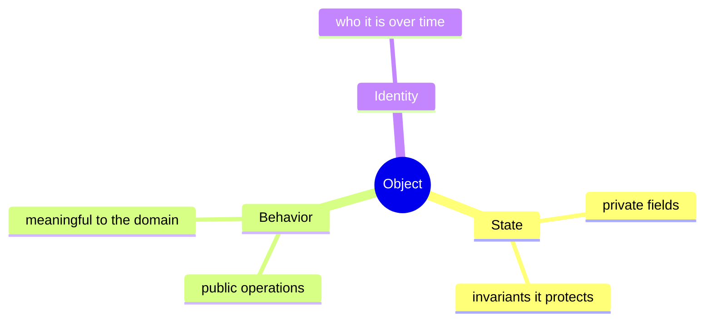
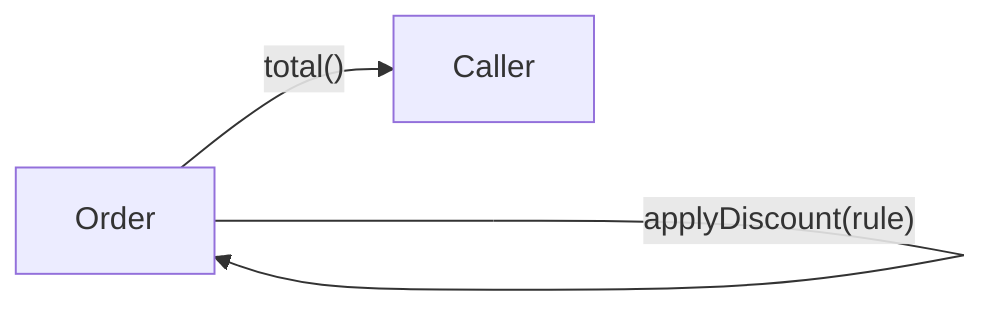
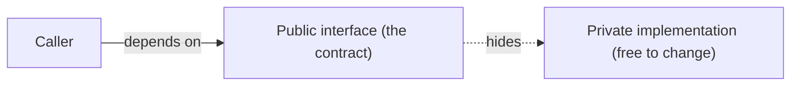
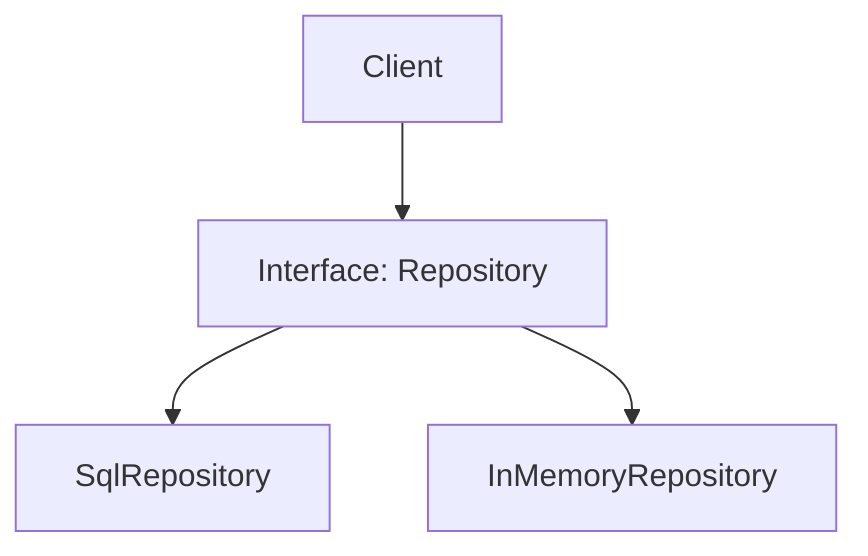

# Object-Oriented Thinking - Complete Professional Guide

> **Category:** 03_design_and_architecture · **Language:** English

---

### Encapsulation, polymorphism, and composition as ways of thinking
**Original guide written from first principles, current to 2026**

> **Original reference book (English).** This is an **independent, originally written** guide. It is not an extract, summary, or paraphrase of any third-party book; it teaches object-oriented thinking from first principles. Canonical books are listed under **References** as pointers only. Each chapter follows the TO-BRAIN editorial standard (see `FILE_CONVENTIONS.md`).
>
> **Scope notice:** object orientation is first a **way of thinking** about a problem — in terms of collaborating objects that own data and behavior — and only second a set of language features. This guide builds the mental model (objects, encapsulation, polymorphism) and the judgment to prefer composition, with 2026 notes on where OO meets functional style.

---

## How to read this guide

| Level | Profile | Parts |
|-------|---------|-------|
| 1 — Beginner | New to OO | Part I |
| 2 — Intermediate | Designing types | Part II |

**Target audience:** developers solidifying their object-modeling instincts and reviewers guiding others.

**Structure of each chapter:** Introduction · Business context · Theoretical concepts · Architecture · Diagrams (Mermaid) · Real examples · Step by step · Complete examples · Exercises · Challenges · Checklist · Best practices · Anti-patterns · Troubleshooting · References.

> **Note on prerequisites.** Assumes basic classes and methods in one language. Examples use Java-like syntax.

---

## Table of Contents

**Part I – Foundations**
1. Objects: data and behavior together
2. Encapsulation and interface vs implementation

**Part II – Polymorphism & reuse**
3. Polymorphism and composition over inheritance

> **Status of this guide:** phased delivery. **Ready:** Part I (Ch. 1–2). **In progress:** Part II.

---

## Part I – Foundations

The shift to object thinking is shifting from "data structures plus functions that act on them" to "objects that **own** their data and expose **behavior**." A well-designed object is responsible for protecting its own invariants and offering meaningful operations — not a passive bag of fields manipulated from outside.

---

## Chapter 1 — Objects: data and behavior together

### 1.1 Introduction

An **object** bundles **state** (data) with the **behavior** that operates on it, exposing a public interface and hiding its internals. The core mental move of OO is asking "what objects are involved, what does each *know*, and what can each *do*?" — assigning responsibility to the object best positioned to hold it.

### 1.2 Business context

Code organized around responsible objects localizes change: a rule about an `Account` lives on `Account`, so changing it touches one place and can't be bypassed. This containment lowers defect rates and makes systems safe to evolve. The opposite — data in one place, logic scattered in "manager" procedures — spreads every rule across the codebase and invites inconsistency.

### 1.3 Theoretical concepts: responsibility



Good objects are defined by **responsibility**, not data. Ask "who should be responsible for this?" and put behavior where the data it needs lives. An object should protect its own consistency: you don't reach in and set fields that could violate its rules — you ask it to perform an operation that keeps them valid.

### 1.4 Architecture: objects collaborate via messages



Objects collaborate by sending **messages** (calling methods) rather than reading each other's data. The set of messages an object responds to is its contract; the data behind it is nobody else's business.

### 1.5 Real example

**Scenario.** A bank account must never go negative.

**Problem.** If `balance` is public, any code can set it directly and break the invariant.

**Solution.** Make state private; expose operations that enforce the rule.

**Implementation.**

```java
final class Account {
    private long balanceCents;                       // hidden state

    void withdraw(long cents) {                      // behavior protects the invariant
        if (cents <= 0) throw new IllegalArgumentException("amount must be positive");
        if (cents > balanceCents) throw new InsufficientFunds();
        balanceCents -= cents;
    }
    long balanceCents() { return balanceCents; }     // read-only view
}
```

**Result.** The "never negative" rule is enforced in one place and cannot be bypassed; callers send `withdraw`, they don't poke `balance`.

**Future improvements.** Introduce a `Money` value object so amounts carry currency and rounding rules.

### 1.6 Exercises

1. What two things does an object bundle, and why together?
2. Why assign behavior to the object that owns the data?
3. What does "objects collaborate via messages" mean in code?

### 1.7 Challenges

- **Challenge.** Find a class that's just public fields manipulated elsewhere. Move one rule about its data onto it as a method, make the fields private, and see what breaks.

### 1.8 Checklist

- [ ] My objects own both state and the behavior over it.
- [ ] State is private; invariants are protected by methods.
- [ ] I assign responsibility by who holds the relevant data.
- [ ] Objects collaborate via methods, not field access.

### 1.9 Best practices

- Put behavior where the data lives; ask "whose responsibility is this?"
- Keep fields private; expose intent-revealing operations.
- Let objects protect their own invariants.

### 1.10 Anti-patterns

- Anemic objects: public data, logic in external "manager" classes.
- Reaching into another object's fields instead of asking it.
- God objects responsible for everything.

### 1.11 Troubleshooting

| Symptom | Likely cause | Action |
|---------|--------------|--------|
| A rule is enforced inconsistently | Logic scattered off the object | Move it onto the owning object |
| Invariants get violated | Public mutable state | Make state private; guard via methods |
| Classes are data-only | Behavior lives elsewhere | Relocate behavior to the data's owner |

### 1.12 References

- M. Weisfeld, *The Object-Oriented Thought Process*, 5th ed. (Addison-Wesley, 2019) — ISBN 978-0135181966.
- D. West, *Object Thinking* (Microsoft Press, 2004) — ISBN 978-0735619654.

---

## Chapter 2 — Encapsulation and interface vs implementation

### 2.1 Introduction

**Encapsulation** is hiding an object's internals behind an interface, so callers depend on *what* it does, not *how*. This is the single most practical OO principle: it lets implementations change freely and keeps invariants enforceable. The discipline is exposing the **smallest useful interface** and hiding everything else.

### 2.2 Business context

Encapsulation is what makes large systems changeable: when internals are hidden, you can fix, optimize, or replace an implementation without a ripple through callers. When internals leak, every change risks distant breakage, and the system calcifies. Encapsulation directly buys the freedom to evolve — the thing businesses need most from long-lived code.

### 2.3 Theoretical concepts: minimal interfaces



Expose only what callers genuinely need. Every public member is a promise you must keep; every hidden one is freedom retained. The "interface vs implementation" split is the same idea as deep modules (see the complexity guide) and ports (see the boundaries guide) — different names for hiding *how* behind *what*.

### 2.4 Architecture: program to interfaces



Depending on an **interface type** rather than a concrete class lets you swap implementations (production vs test, vendor A vs B) without touching the client — the basis of testability and flexibility across this whole library.

### 2.5 Real example

**Scenario.** A cache's internals (a map today, maybe Redis tomorrow) must be hidden.

**Problem.** If callers use the map directly, switching to Redis rewrites them all.

**Solution.** Expose a tiny `Cache` interface; hide the storage entirely.

**Implementation.**

```java
interface Cache { void put(String k, String v); Optional<String> get(String k); }

final class InMemoryCache implements Cache {        // implementation hidden behind the interface
    private final Map<String,String> map = new ConcurrentHashMap<>();
    public void put(String k, String v) { map.put(k, v); }
    public Optional<String> get(String k) { return Optional.ofNullable(map.get(k)); }
}
```

**Result.** Callers know only `put`/`get`. Replacing `InMemoryCache` with a Redis-backed class changes nothing for them.

**Future improvements.** Add TTL to the interface only if callers truly need it — keep the contract minimal.

### 2.6 Exercises

1. Define encapsulation and the benefit it buys.
2. Why is every public member a cost?
3. Why depend on an interface type rather than a concrete class?

### 2.7 Challenges

- **Challenge.** Pick a class exposing internals (a public collection, say). Hide it behind a minimal interface and update callers to use only that.

### 2.8 Checklist

- [ ] I expose the smallest useful interface.
- [ ] Internals are private and free to change.
- [ ] Clients depend on interfaces, not concretions.
- [ ] Each public member is a promise I intend to keep.

### 2.9 Best practices

- Hide everything not part of the contract.
- Program to interfaces to enable swapping and testing.
- Resist adding public members "just in case."

### 2.10 Anti-patterns

- Exposing collections/fields that let callers mutate internals.
- Wide interfaces that lock in implementation details.
- Depending on concrete classes everywhere, blocking substitution.

### 2.11 Troubleshooting

| Symptom | Likely cause | Action |
|---------|--------------|--------|
| Changing internals breaks callers | Leaky encapsulation | Narrow the interface; hide internals |
| Can't substitute a test double | Depending on concretions | Introduce and depend on an interface |
| Interface keeps growing | Exposing implementation needs | Trim to what callers actually use |

### 2.12 References

- M. Weisfeld, *The Object-Oriented Thought Process*, 5th ed. (Addison-Wesley, 2019) — ISBN 978-0135181966.
- D. Parnas, "On the Criteria To Be Used in Decomposing Systems into Modules" (CACM, 1972).

---

> **End of Part I.** You can now think in terms of responsible objects that bundle state with behavior and protect their own invariants, and apply encapsulation — minimal interfaces hiding free-to-change implementations — to keep systems substitutable and evolvable. **Part II — Polymorphism & reuse** (Chapter 3) covers polymorphism for open-ended extension and why composition usually beats inheritance for reuse.

<!--APPEND-PART-II-->
