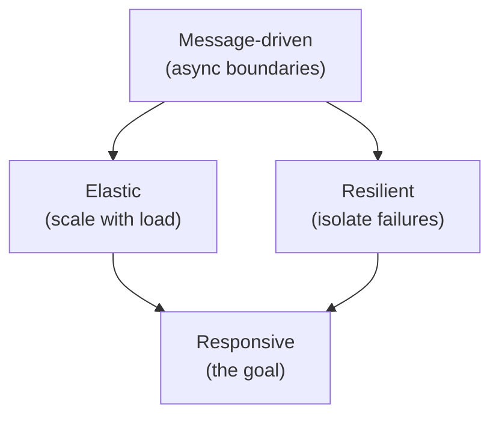
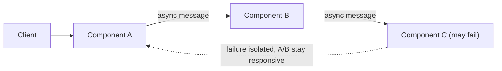
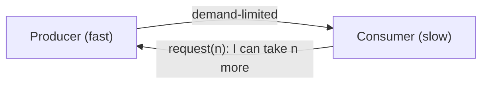
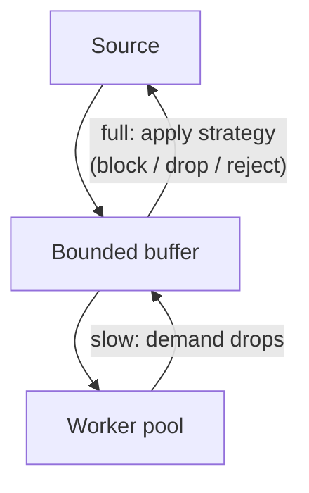

# Reactive Systems - Complete Professional Guide

> **Category:** 03_design_and_architecture · **Language:** English

---

### Responsive, resilient, elastic, message-driven systems
**Original guide written from first principles, current to 2026**

> **Original reference book (English).** This is an **independent, originally written** guide. It is not an extract, summary, or paraphrase of any third-party book; it teaches reactive system design from first principles. Canonical sources are listed under **References** as pointers only. Each chapter follows the TO-BRAIN editorial standard (see `FILE_CONVENTIONS.md`).
>
> **Scope notice:** "reactive" describes systems built to stay **responsive** under load and failure by being **resilient**, **elastic**, and **message-driven**. This guide covers those properties, back-pressure, and how they map to 2026 runtimes (reactive streams, virtual threads, async I/O) — and, importantly, when you do *not* need them.

---

## How to read this guide

| Level | Profile | Parts |
|-------|---------|-------|
| 1 — Beginner | New to reactive ideas | Part I |
| 2 — Intermediate | Designing for load/failure | Part II |

**Target audience:** backend engineers and architects building systems that must stay responsive under variable load and partial failure.

**Structure of each chapter:** Introduction · Business context · Theoretical concepts · Architecture · Diagrams (Mermaid) · Real examples · Step by step · Complete examples · Exercises · Challenges · Checklist · Best practices · Anti-patterns · Troubleshooting · References.

> **Note on prerequisites.** Assumes basic concurrency and HTTP. Pairs with the messaging and data-intensive-systems guides.

---

## Table of Contents

**Part I – The properties**
1. The four reactive properties
2. Message-driven design and back-pressure

**Part II – Applying it**
3. When to go reactive (and when not to)

> **Status of this guide:** phased delivery. **Ready:** Part I (Ch. 1–2). **In progress:** Part II.

---

## Part I – The properties

"Reactive" is a coherent set of properties, not a library. A system is reactive when it stays **responsive** — gives timely answers — even as load spikes and components fail. The other three properties (resilient, elastic, message-driven) are the means to that end. Understanding the relationships keeps you from cargo-culting "reactive" as just async code.

---

## Chapter 1 — The four reactive properties

### 1.1 Introduction

A reactive system aims to remain **responsive** under all conditions. It achieves this by being **resilient** (stays responsive under failure), **elastic** (stays responsive under varying load), and **message-driven** (uses asynchronous message passing as the foundation that enables the other two). Responsiveness is the goal; the rest are how.

### 1.2 Business context

Responsiveness *is* the user experience and often the SLA. Systems that freeze under load spikes or collapse when a dependency fails lose users and money exactly when demand is highest. The reactive properties are a blueprint for staying usable under the conditions that matter most commercially — peak traffic and partial outages — instead of only in the happy path.

### 1.3 Theoretical concepts: how they relate



- **Responsive** — responds in a timely way; bounded latency even under stress.
- **Resilient** — stays responsive under failure via **isolation**, **replication**, and **delegation**; a failure is contained, not cascaded.
- **Elastic** — stays responsive under varying load by adding/removing resources; no central bottleneck.
- **Message-driven** — async, non-blocking message passing between components, which is what makes isolation (resilience) and distribution (elasticity) possible.

### 1.4 Architecture: isolation via async boundaries



Because components communicate by messages across async boundaries (not blocking calls), a slow or failed component becomes a queue or a handled error — not a thread blocked all the way up the stack. That isolation is the mechanical basis of resilience.

### 1.5 Real example

**Scenario.** A product page aggregates price, reviews, and recommendations; recommendations occasionally time out.

**Problem.** A synchronous, blocking aggregation makes the whole page hang when recommendations are slow.

**Solution.** Fetch the three concurrently with timeouts; degrade gracefully — render without recommendations if they don't arrive.

**Implementation (sketch, non-blocking with bounded wait).**

```text
render_product(id):
    price   = async getPrice(id)            # concurrent, non-blocking
    reviews = async getReviews(id)
    recs    = async getRecs(id).timeout(80ms).orElse(EMPTY)   # degrade, don't block
    await all-with-bounded-wait
    return page(price, reviews, recs)
```

**Result.** The page stays responsive (bounded latency); a recommendations outage degrades one section instead of hanging the page — responsiveness preserved through resilience.

**Future improvements.** Add a circuit breaker on recommendations so repeated failures stop being attempted; cache last-good recs.

### 1.6 Exercises

1. Which property is the goal and which three are the means?
2. How does message-driven design enable resilience?
3. Give an example of graceful degradation preserving responsiveness.

### 1.7 Challenges

- **Challenge.** Find a synchronous aggregation in your system. Redesign it to fetch concurrently with per-call timeouts and a graceful fallback. Measure tail latency before/after.

### 1.8 Checklist

- [ ] I treat responsiveness as the goal, under load and failure.
- [ ] Failures are isolated, not cascaded.
- [ ] Load is handled by scaling, not a central bottleneck.
- [ ] Components communicate asynchronously where it buys isolation.

### 1.9 Best practices

- Bound every cross-service wait with a timeout and a fallback.
- Isolate failure domains so one slow dependency can't hang the system.
- Use async boundaries where resilience/elasticity require them — not everywhere.

### 1.10 Anti-patterns

- "Reactive" meaning "I used async everywhere," with no isolation or back-pressure.
- Unbounded blocking calls that cascade a single failure system-wide.
- A shared bottleneck (one DB, one thread pool) defeating elasticity.

### 1.11 Troubleshooting

| Symptom | Likely cause | Action |
|---------|--------------|--------|
| One slow dependency hangs everything | Blocking, no isolation | Async boundary + timeout + fallback |
| Can't scale out under load | Central bottleneck | Remove shared chokepoints |
| Repeated calls to a dead service | No circuit breaker | Add one to fail fast and recover |

### 1.12 References

- The Reactive Manifesto, https://www.reactivemanifesto.org.
- M. Nygard, *Release It!*, 2nd ed. (Pragmatic Bookshelf, 2018) — ISBN 978-1680502398, on stability patterns.

---

## Chapter 2 — Message-driven design and back-pressure

### 2.1 Introduction

The foundation under the reactive properties is **asynchronous message passing**, and its essential companion is **back-pressure**: a mechanism by which a slow consumer can tell a fast producer to slow down, so queues don't grow without bound and the system fails safely instead of running out of memory. Back-pressure is what separates robust reactive systems from ones that simply defer their collapse.

### 2.2 Business context

Without back-pressure, a load spike doesn't gracefully slow — it silently piles up work until memory exhausts and the system crashes hard, often taking unrelated services with it. Back-pressure converts overload into controlled slowdown or explicit rejection, which is recoverable and observable. For the business that is the difference between "degraded for a minute" and "outage."

### 2.3 Theoretical concepts: bounded flow



In a back-pressured stream the **consumer signals demand** ("send me at most n more"); the producer never pushes faster than the consumer pulls. Bounded buffers and demand signaling keep memory flat under overload. Reactive Streams (and the runtimes implementing it) standardize exactly this protocol.

### 2.4 Architecture: where back-pressure lives



When the buffer fills, you choose a strategy: **slow the source** (block/demand), **drop** lower-value messages, or **reject** with a clear error (e.g. HTTP 429). The point is an explicit, bounded policy instead of unbounded growth.

### 2.5 Real example

**Scenario.** An ingestion endpoint receives bursts faster than the database can persist.

**Problem.** Unbounded queuing buffers the burst in memory until an OOM crash.

**Solution.** A bounded queue with back-pressure: when full, reject new requests with 429 so clients retry with backoff.

**Implementation (sketch).**

```text
on request:
    if queue.size >= CAPACITY:
        return 429 Too Many Requests (Retry-After: 2s)   # explicit back-pressure
    queue.offer(request)                                  # bounded
workers: drain queue at DB's sustainable rate
```

**Result.** Memory stays bounded; overload becomes visible, recoverable 429s instead of a crash. Clients back off and the system self-heals as the burst passes.

**Future improvements.** Shed load by priority (drop low-value first); expose queue depth as a metric and autoscale workers on it.

### 2.6 Exercises

1. What problem does back-pressure solve?
2. Name three strategies when a bounded buffer fills.
3. Why is rejecting with 429 better than unbounded queuing?

### 2.7 Challenges

- **Challenge.** Find an unbounded queue/buffer in your system. Bound it and add a back-pressure strategy (reject or drop). Load-test past capacity and confirm it degrades instead of crashing.

### 2.8 Checklist

- [ ] Queues and buffers are bounded.
- [ ] Slow consumers can signal demand to producers.
- [ ] Overload has an explicit strategy (slow/drop/reject).
- [ ] Queue depth is observable and drives scaling.

### 2.9 Best practices

- Never use unbounded queues in production paths.
- Make overload explicit and recoverable (429 + Retry-After).
- Surface back-pressure signals as metrics for autoscaling.

### 2.10 Anti-patterns

- Unbounded in-memory queues that defer collapse to an OOM.
- Async pipelines with no demand signaling (fast producer floods slow consumer).
- Silent message dropping with no metric or policy.

### 2.11 Troubleshooting

| Symptom | Likely cause | Action |
|---------|--------------|--------|
| OOM crash under load spikes | Unbounded buffering | Bound buffers; apply back-pressure |
| Consumers overwhelmed by producers | No demand signaling | Use a demand-based (pull) stream |
| Overload causes hard outage | No load-shedding policy | Reject/drop explicitly past capacity |

### 2.12 References

- Reactive Streams specification, https://www.reactive-streams.org.
- The Reactive Manifesto, https://www.reactivemanifesto.org.

---

> **End of Part I.** You can now describe a reactive system as one that stays responsive under load and failure by being resilient, elastic, and message-driven, and you can apply back-pressure to keep async pipelines bounded and failing safely. **Part II — Applying it** (Chapter 3) gives the judgment for when reactive design earns its complexity — and when a simpler synchronous model (or virtual threads) is the better 2026 choice.

<!--APPEND-PART-II-->
