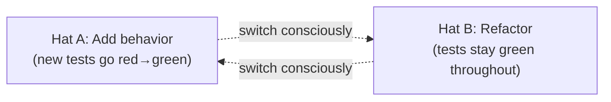
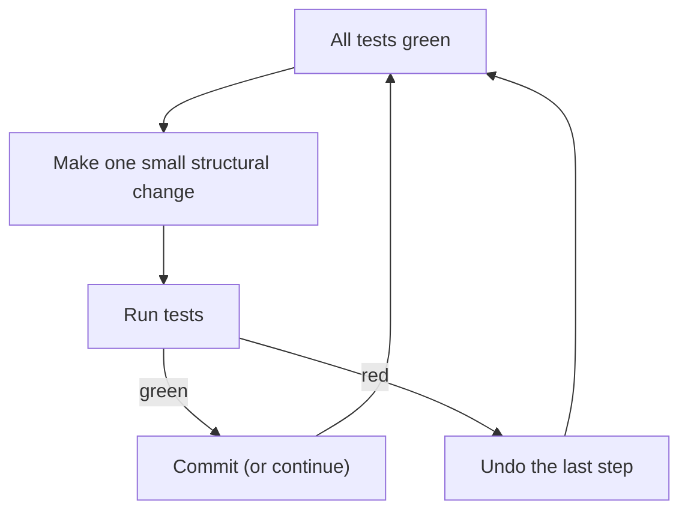
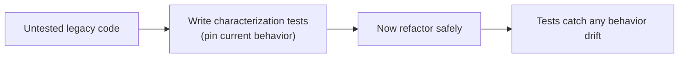
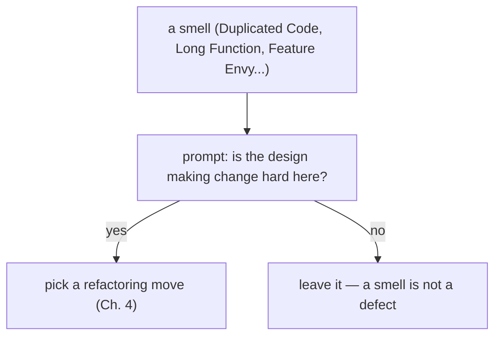
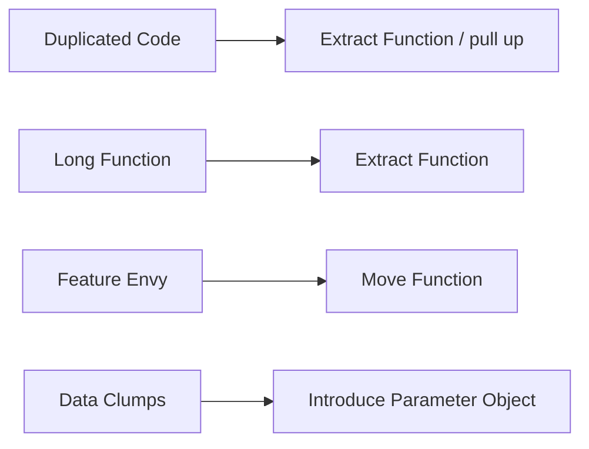
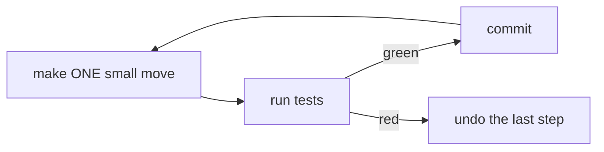
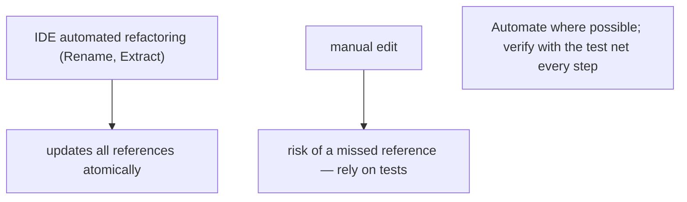
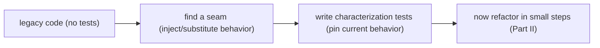
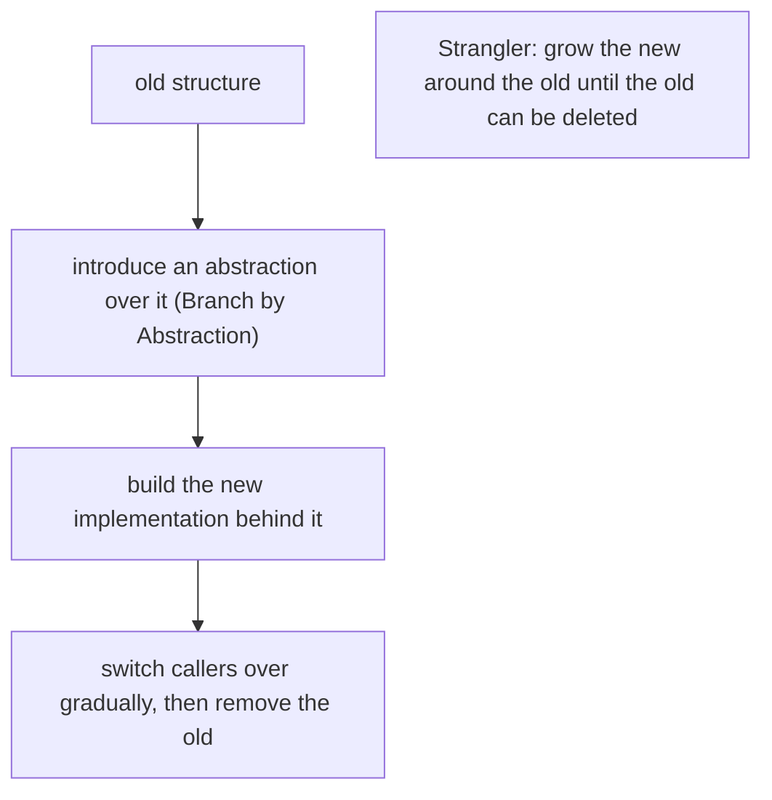

# Refactoring and Code Improvement - Complete Professional Guide

> **Category:** 03_design_and_architecture · **Language:** English

---

### Improving the design of existing code without changing its behavior
**Original guide written from first principles, current to 2026**

> **Original reference book (English).** This is an **independent, originally written** guide. It is not an extract, summary, or paraphrase of any third-party book; it teaches the practice of refactoring from first principles. Canonical books on the subject are listed under **References** as pointers only. Each chapter follows the TO-BRAIN editorial standard (see `FILE_CONVENTIONS.md`).
>
> **Scope notice:** refactoring is changing the **internal structure** of code while keeping its **observable behavior** the same. This guide covers when to do it, how to do it safely, the smells that prompt it, and the 2026 toolchain (IDE automation, test harnesses, and LLM-assisted transformations under guardrails).

---

## How to read this guide

| Level | Profile | Parts |
|-------|---------|-------|
| 1 — Beginner | New to disciplined change | Part I |
| 2 — Intermediate | Daily refactoring | Part II |
| 3 — Advanced | Large/legacy refactors | Part III |

**Target audience:** software engineers, tech leads, and reviewers who change existing code under deadline pressure and want to do it without breaking things.

**Structure of each chapter:** Introduction · Business context · Theoretical concepts · Architecture · Diagrams (Mermaid) · Real examples · Step by step · Complete examples · Exercises · Challenges · Checklist · Best practices · Anti-patterns · Troubleshooting · References.

> **Note on prerequisites.** Assumes you can write a unit test and use version control. Examples are in language-neutral pseudocode or Java-like syntax.

---

## Table of Contents

**Part I – Foundations**
1. What refactoring is (and is not)
2. Tests as the safety net

**Part II – The practice**
3. Code smells: the prompts to refactor
4. Core moves and how to apply them safely

**Part III – At scale**
5. Refactoring legacy code and large structures

> **Status of this guide:** complete for its declared scope. **Ready:** Parts I–III (Ch. 1–5).

---

## Part I – Foundations

Refactoring is a **disciplined technique**, not a synonym for "rewriting" or "cleaning up whenever." Its defining constraint — behavior stays the same — is what makes it safe to do continuously, in tiny steps, between feature work. Two things make it work: a clear definition of "behavior unchanged," and a fast way to verify it after every step.

---

## Chapter 1 — What refactoring is (and is not)

### 1.1 Introduction

**Refactoring** is a behavior-preserving transformation of code, applied in small, reversible steps, to make the code easier to understand and cheaper to change. The key discipline: you are **either** adding behavior **or** refactoring — never both in the same step. Mixing the two is how "a quick cleanup" turns into a multi-day bug hunt.

### 1.2 Business context

Code is read far more often than it is written, and most of a system's cost is in **changing** it after it ships. Refactoring is the mechanism that keeps change cost from compounding: it pays down the interest on accidental complexity so the next feature is cheap. Skipped indefinitely, the codebase ossifies and velocity collapses — the business feels this as "everything takes longer now."

### 1.3 Theoretical concepts: the two hats



You wear one **hat** at a time. Adding a feature: you may add or change tests, behavior changes. Refactoring: tests do **not** change their assertions and stay green at every step. Knowing which hat you wear tells you whether a failing test is expected (feature) or a mistake (refactor).

### 1.4 Architecture: the refactoring loop



The loop is tight on purpose: each step is small enough that if tests go red, the cause is obvious — it was the last move. This is why refactoring leans on fast tests and frequent commits.

### 1.5 Real example

**Scenario.** A pricing function has grown into a 60-line method mixing tax rules, discounts, and formatting.

**Problem.** Every change risks the others; nobody fully trusts it.

**Solution.** Extract cohesive pieces into named functions, one tiny step at a time, tests green throughout — no behavior change.

**Implementation (before → after, behavior identical).**

```java
// BEFORE: one method does everything
double price(Order o) {
    double base = 0;
    for (Item i : o.items()) base += i.qty() * i.unit();
    double discounted = base;
    if (o.coupon() != null) discounted = base * (1 - o.coupon().rate());
    double taxed = discounted * (1 + 0.20);          // VAT
    return Math.round(taxed * 100) / 100.0;
}

// AFTER: same result, named steps (Extract Function applied 3×)
double price(Order o)        { return round(applyTax(applyCoupon(subtotal(o), o.coupon()))); }
double subtotal(Order o)     { return o.items().stream().mapToDouble(i -> i.qty()*i.unit()).sum(); }
double applyCoupon(double b, Coupon c) { return c == null ? b : b * (1 - c.rate()); }
double applyTax(double v)    { return v * (1 + VAT); }
double round(double v)       { return Math.round(v*100)/100.0; }
```

**Result.** Each rule is named, independently testable, and changeable in isolation — and the output for every input is unchanged.

**Future improvements.** Make `VAT` configurable; add a focused test per extracted function so future changes are pinned.

### 1.6 Exercises

1. State the one-sentence definition of refactoring and the constraint it must preserve.
2. Why must you never add a feature and refactor in the same commit?
3. What signals tell you which "hat" you should be wearing right now?

### 1.7 Challenges

- **Challenge.** Take a long method you own. Apply Extract Function three times, running tests after each. Commit after each green step. Did behavior change? Prove it didn't.

### 1.8 Checklist

- [ ] I can define refactoring as behavior-preserving structural change.
- [ ] I keep feature work and refactoring in separate commits.
- [ ] I run tests after every small step.
- [ ] I commit on green so I can always revert one step.

### 1.9 Best practices

- Work in the smallest steps that still make progress; commit on every green.
- Lean on the IDE's automated refactorings (Rename, Extract, Inline) — they are behavior-preserving by construction.
- Refactor *opportunistically* around the code you're about to change (leave it cleaner than you found it).

### 1.10 Anti-patterns

- "Refactoring" that quietly changes behavior — that's just an unreviewed rewrite.
- Big-bang rewrites justified as "refactoring" with no tests and no small steps.
- Refactoring on a red build, so you can't tell new breakage from old.

### 1.11 Troubleshooting

| Symptom | Likely cause | Action |
|---------|--------------|--------|
| Tests red mid-refactor, cause unclear | Steps too large | Revert; redo in smaller steps |
| "Refactor" PR also changes outputs | Two hats at once | Split into a behavior PR and a structure PR |
| Afraid to touch a module | No tests covering it | Add characterization tests first (Ch. 2/5) |

### 1.12 References

- M. Fowler, *Refactoring: Improving the Design of Existing Code*, 2nd ed. (Addison-Wesley, 2018) — ISBN 978-0134757599.
- IDE refactoring docs: IntelliJ IDEA (https://www.jetbrains.com/help/idea/refactoring-source-code.html), VS Code (https://code.visualstudio.com/docs/editor/refactoring).

---

## Chapter 2 — Tests as the safety net

### 2.1 Introduction

Refactoring without tests is editing and hoping. The tests are what let you make a change and **know** in seconds whether behavior moved. This chapter covers the kind of tests that make refactoring safe, and how to add them to code that has none (**characterization tests**).

### 2.2 Business context

The willingness to refactor is directly proportional to the speed and trust of the test suite. Fast, reliable tests turn refactoring into a low-risk reflex; slow or flaky tests make every change scary, so cleanup never happens and the code rots. Investing in the test net is investing in future change speed.

### 2.3 Theoretical concepts: what kind of tests

- **Fast** — milliseconds, so you run them after every step. Slow suites break the loop.
- **Behavior-focused** — assert observable outputs/effects, not internal structure. Tests coupled to internals break during refactoring even when behavior is intact, defeating the point.
- **Deterministic** — no flakiness; a red must mean a real regression.

**Characterization tests** pin the *current* behavior of code you don't fully understand (legacy). You don't assert what it *should* do — you capture what it *does*, so any change during refactoring is caught.

### 2.4 Architecture: net before change



### 2.5 Real example

**Scenario.** A tax routine with no tests must be restructured.

**Problem.** No one is sure exactly what edge cases it handles, so changing it is risky.

**Solution.** Capture its current outputs across representative inputs as characterization tests, then refactor under that net.

**Implementation.**

```java
// Pin CURRENT behavior (whatever it is) before touching the code.
@ParameterizedTest
@CsvSource({ "100,0.0,120.00", "100,0.1,108.00", "0,0.5,0.00" })
void characterize(double base, double rate, double expected) {
    assertEquals(expected, legacyTax(base, rate), 0.001);
}
```

**Result.** Any refactor that changes an output for these inputs fails immediately. You can now restructure with confidence.

**Future improvements.** As you understand the code, promote characterization tests into intentional specification tests; add cases for newly discovered edges.

### 2.6 Exercises

1. Why should tests assert behavior, not internal structure, when supporting refactoring?
2. What is a characterization test and when do you write one?
3. Why does suite speed determine how much refactoring actually happens?

### 2.7 Challenges

- **Challenge.** Find untested code you fear. Write characterization tests until you can predict its output, then refactor one smell out of it under that net.

### 2.8 Checklist

- [ ] My refactoring tests are fast, deterministic, and behavior-focused.
- [ ] I characterize legacy behavior before restructuring it.
- [ ] I don't assert on private internals that refactoring will move.

### 2.9 Best practices

- Keep a fast "refactor loop" test subset you can run in seconds.
- Add the missing test *before* the risky change, not after the bug.
- Treat flaky tests as broken — they erode the trust refactoring depends on.

### 2.10 Anti-patterns

- Refactoring code with zero coverage and calling the result "safe."
- Tests so coupled to structure that every refactor rewrites them.
- Tolerating a slow suite, so the refactor loop is never run.

### 2.11 Troubleshooting

| Symptom | Likely cause | Action |
|---------|--------------|--------|
| Every refactor rewrites many tests | Tests assert internals | Re-target tests at observable behavior |
| Can't refactor legacy safely | No coverage | Add characterization tests first |
| Team avoids running tests | Suite too slow | Carve a fast subset for the inner loop |

### 2.12 References

- M. Feathers, *Working Effectively with Legacy Code* (Prentice Hall, 2004) — ISBN 978-0131177055.
- K. Beck, *Test-Driven Development by Example* (Addison-Wesley, 2002) — ISBN 978-0321146533.

---

> **End of Part I.** You can now define refactoring as small, behavior-preserving change, separate it cleanly from feature work, and stand up the test net that makes it safe — including characterization tests for legacy code. **Part II — The practice** (Chapters 3–4) catalogs the code smells that prompt a refactor and the core moves (Extract, Inline, Move, Rename) with the safe steps to apply each.

---

## Part II – The practice

Part I defined refactoring as small, behavior-preserving change protected by tests. Part II is the day-to-day practice: recognizing the **code smells** that prompt a refactor, and applying the **core moves** in safe, tiny steps.

---

## Chapter 3 — Code smells: the prompts to refactor

### 3.1 Introduction

A **code smell** is a surface symptom that *suggests* a deeper problem — not a rule violation, but a prompt to look closer. Fowler's catalog gives the symptoms names so a team can talk about them: **Duplicated Code**, **Long Function**, **Long Parameter List**, **Mysterious Name**, **Divergent Change** (one module changed for many reasons), **Shotgun Surgery** (one change touches many modules), **Feature Envy**, **Data Clumps**, and **Primitive Obsession**. A smell is the *prompt*; whether to refactor — and which move to use — is a judgment.

### 3.2 Business context

Smells are early warnings that change is getting expensive. Duplicated code means a fix must be made in several places (and one will be missed); Shotgun Surgery means a single requirement scatters across the codebase; a Long Function hides bugs. Naming these patterns turns vague unease ("this code is messy") into specific, actionable items a team can prioritize against the cost of the next feature. Catching smells early keeps refactoring small and continuous instead of a risky big-bang rewrite later.

### 3.3 Theoretical concepts: a shared vocabulary of symptoms



Smells cluster around the things that make code hard to change. **Duplicated Code** → unify with Extract Function. **Long Function** / **Long Parameter List** → Extract Function, Introduce Parameter Object. **Divergent Change** → split a module that has too many reasons to change; **Shotgun Surgery** → the opposite, gather scattered logic together. **Feature Envy** (a method more interested in another object's data) → Move Function. The point is recognition: once you can name the smell, the catalog of moves tells you the fix.

### 3.4 Architecture: from smell to move



The catalog pairs each smell with proven moves, so refactoring is diagnosis-then-treatment rather than guesswork.

### 3.5 Real example

**Scenario.** Three call sites format a customer's address with the same five lines of code.

**Problem.** This is **Duplicated Code**: a change to the format must be made in three places, and the third will eventually be forgotten.

**Solution.** Name the smell, then apply **Extract Function** to unify it.

**Implementation.**

```text
# Smell: Duplicated Code (same 5 lines in 3 places)
# at each site:
line = street + ", " + number + " - " + city + "/" + state

# After Extract Function: one definition, three callers
formatAddress(a): return a.street + ", " + a.number + " - " + a.city + "/" + a.state
# every site now calls formatAddress(a)
```

**Result.** The format lives in one place; a change is made once and can't be partially applied. Naming the smell ("Duplicated Code") pointed directly to the move ("Extract Function") — the whole purpose of the catalog.

**Future improvements.** Watch for the next smells the change reveals (a Long Parameter List or Data Clump often hides behind duplication) and address them in separate, tiny steps.

### 3.6 Exercises

1. What is a code smell, and why is it a prompt rather than a defect?
2. Contrast Divergent Change and Shotgun Surgery.
3. Which smell does Feature Envy describe, and which move typically fixes it?

### 3.7 Challenges

- **Challenge.** Scan a file and list every smell you can name from the catalog. For each, write the move you'd apply — without yet applying it. Notice how naming sharpens the diagnosis.

### 3.8 Checklist

- [ ] I can name the smell before reaching for a fix.
- [ ] I treat a smell as a prompt to evaluate, not an automatic change.
- [ ] I map each smell to a specific refactoring move.
- [ ] I address smells in small, separate steps.

### 3.9 Best practices

- Learn the catalog so unease becomes a named, shared diagnosis.
- Pair each smell with the move that resolves it.
- Refactor smells when they make an imminent change harder, not for their own sake.

### 3.10 Anti-patterns

- "Cleaning up" code with no smell and no upcoming change (churn for its own sake).
- Treating every smell as a defect that must be fixed now.
- Fixing many smells in one giant commit instead of small steps.

### 3.11 Troubleshooting

| Symptom | Likely smell | Action |
|---------|--------------|--------|
| A fix must be made in several places | Duplicated Code | Extract Function and unify |
| One requirement touches many files | Shotgun Surgery | Gather the scattered logic together |
| A method uses another object's data a lot | Feature Envy | Move Function to that object |

### 3.12 References

- M. Fowler, *Refactoring: Improving the Design of Existing Code*, 2nd ed. (Addison-Wesley, 2018), ch. 3 "Bad Smells in Code" — ISBN 978-0134757599.
- K. Beck, M. Fowler, "Bad Smells in Code" (catalog of smells and their refactorings).

---

## Chapter 4 — Core moves and how to apply them safely

### 4.1 Introduction

Most refactoring is a handful of **core moves** applied in tiny, reversible steps: **Extract Function**, **Inline Function**, **Extract Variable**, **Rename** (variable/function), **Move Function**, and **Change Function Declaration**. The safety comes not from the move but from the **discipline**: make one small change, run the tests, commit; repeat. Modern IDEs automate several of these moves correctly, which is safer than editing by hand.

### 4.2 Business context

A refactor that takes a system down for a day is a refactor a team stops doing. The small-steps discipline keeps the code **green and shippable at every moment**, so refactoring fits between features instead of becoming a scary project. Automated IDE refactorings (Rename, Extract) remove a whole class of human error — a rename that updates every reference can't leave a dangling one. The result is that improving the design becomes a routine, low-risk activity rather than a gamble.

### 4.3 Theoretical concepts: tiny steps, green after each



Each move has mechanics designed to keep behavior identical: **Extract Function** (pull a fragment into a named function, pass what it needs), **Inline** (the reverse), **Extract Variable** (name a sub-expression), **Rename** (improve a name everywhere it's used), **Move Function** (relocate to the class that owns the data — fixes Feature Envy), **Change Function Declaration** (add/rename/reorder parameters safely). The constant is the loop: one step, tests green, commit — so any breakage is isolated to the last tiny change and trivially reverted.

### 4.4 Architecture: prefer automated, reversible moves



Lean on the IDE for the mechanical moves and on the test suite for the rest. A fast suite (Part I) is what makes the one-step-then-test loop practical dozens of times an hour.

### 4.5 Real example

**Scenario.** A long `printOwing` function computes totals and prints a banner, details, and footer.

**Problem.** It's a **Long Function** mixing levels; you want to restructure it without changing output.

**Solution.** Apply **Extract Function** repeatedly, running tests after each extraction.

**Implementation.**

```text
# Step 1: extract the banner — run tests (green) — commit
printBanner()
# Step 2: extract the details calculation, name the variable — tests — commit
outstanding = calculateOutstanding(invoice)
# Step 3: extract the footer — tests — commit
printDetails(invoice, outstanding)

printOwing(invoice):     # now reads as named steps, behavior identical
    printBanner()
    outstanding = calculateOutstanding(invoice)
    printDetails(invoice, outstanding)
```

**Result.** The function became a readable sequence of named steps with **no behavior change** — verified by green tests after every extraction. Because each step was committed, any mistake would have been a one-step revert. This is the whole method: small moves, continuously verified.

**Future improvements.** Once extracted, apply Move Function to relocate any piece that belongs on another object; use the IDE's Rename to sharpen the new names.

### 4.6 Exercises

1. What is the core loop that makes each move safe?
2. Which move fixes Feature Envy, and why?
3. Why are IDE-automated Rename/Extract safer than hand edits?

### 4.7 Challenges

- **Challenge.** Take a long function and reduce it to a sequence of named steps using only Extract Function and Extract Variable, committing after each step with tests green. Do not change any output.

### 4.8 Checklist

- [ ] I make one small move at a time and run tests after each.
- [ ] I commit on green so any breakage is a one-step revert.
- [ ] I use IDE-automated refactorings where available.
- [ ] I never mix a refactoring step with a behavior change (Part I).

### 4.9 Best practices

- Work in tiny, reversible steps verified by a fast test suite.
- Prefer automated refactorings for mechanical moves.
- Commit frequently on green to keep the system shippable.

### 4.10 Anti-patterns

- Large, multi-move refactors with no intermediate test runs.
- Hand-editing a rename and missing a reference.
- Refactoring on a red build, so you can't tell new breakage from old.

### 4.11 Troubleshooting

| Symptom | Likely cause | Action |
|---------|--------------|--------|
| Refactor introduced a bug | Steps too large to localize | Smaller moves; test and commit each |
| Rename left a dangling reference | Manual edit | Use the IDE's Rename refactoring |
| Can't tell what broke | Many moves before testing | Revert to last green; redo one step at a time |

### 4.12 References

- M. Fowler, *Refactoring: Improving the Design of Existing Code*, 2nd ed. (Addison-Wesley, 2018), ch. 6–7 (Extract/Inline/Move/Rename; the mechanics) — ISBN 978-0134757599.
- K. Beck, *Test-Driven Development by Example* (Addison-Wesley, 2002), on the small-step rhythm — ISBN 978-0321146533.

---

## Part III – At scale

The moves of Part II assume tests already exist. Part III handles the hard cases: **legacy code** without tests, and **large structural** changes that can't be done in a single step.

---

## Chapter 5 — Refactoring legacy code and large structures

### 5.1 Introduction

Feathers defines **legacy code** simply as **code without tests** — you can't refactor it safely because you can't tell if you changed behavior. The way in is to find a **seam** (a place where you can substitute behavior without editing in place), write **characterization tests** that pin down what the code *currently* does (bugs included), and only then refactor. **Large** restructurings are done **incrementally** — Branch by Abstraction, or the Strangler pattern around the edges — never as a big-bang rewrite.

### 5.2 Business context

The riskiest, highest-value code is often the oldest and least-tested. A big-bang rewrite of it is the classic way to halt delivery for months and reintroduce old bugs. Characterization tests plus incremental restructuring let a team improve critical legacy systems **while keeping them running and shippable**, turning a feared rewrite into steady, low-risk progress. This is what keeps a business moving on top of code it can't afford to freeze.

### 5.3 Theoretical concepts: seams and characterization tests



A **characterization test** asserts the code's *actual* current output — not what it *should* do — so it becomes a safety net even for code whose intended behavior is unclear. A **seam** lets you get the code under test without first changing it (e.g., inject a dependency, subclass-and-override). Once the net exists, the Part II moves apply.

### 5.4 Architecture: change large structures incrementally



Large refactorings are sequenced as many safe small steps behind a stable interface, so the system stays releasable throughout and the change can be paused or reversed at any point.

### 5.5 Real example

**Scenario.** A critical pricing module has no tests and must be restructured.

**Problem.** Any edit risks silently changing prices; there's no net to catch it.

**Solution.** Pin current behavior with **characterization tests** through a **seam**, then refactor in small steps.

**Implementation.**

```text
# 1. Find a seam: feed inputs, capture current outputs (even if "wrong")
test: assert price(cart=A) == 19.90      # whatever it currently returns
test: assert price(cart=B) == 0.00       # captures existing behavior, bug and all

# 2. With the net green, apply Part II moves (Extract Function, Rename) in tiny steps
# 3. For the big change, Branch by Abstraction:
interface Pricing { price(cart) }        # abstraction over old + new
# build NewPricing behind it; switch callers gradually; delete the old
```

**Result.** The characterization tests catch any accidental change to prices during refactoring, so the legacy module can be cleaned up safely. The large restructuring proceeds behind an abstraction, keeping the system shippable at every step rather than betting on a rewrite.

**Future improvements.** As behavior is understood, upgrade characterization tests into intention-revealing tests; once callers are migrated, delete the old implementation and the abstraction if no longer needed.

### 5.6 Exercises

1. What is Feathers' definition of legacy code, and why does it block safe refactoring?
2. What does a characterization test assert, and how is that different from a normal unit test?
3. How does Branch by Abstraction keep a large change shippable?

### 5.7 Challenges

- **Challenge.** Pick an untested function, write characterization tests that capture its current output for several inputs, then refactor it in small steps keeping those tests green. Resist "fixing" behavior until the net exists.

### 5.8 Checklist

- [ ] I add characterization tests before refactoring untested code.
- [ ] I find a seam to get code under test without editing it first.
- [ ] I sequence large changes behind a stable abstraction.
- [ ] I keep the system shippable at every step (no big-bang rewrite).

### 5.9 Best practices

- Pin current behavior with characterization tests, then refactor.
- Use seams (dependency injection, subclass-and-override) to insert tests.
- Restructure large code incrementally (Branch by Abstraction / Strangler).

### 5.10 Anti-patterns

- Refactoring untested legacy code "carefully" without a net.
- Big-bang rewrites of critical systems.
- Fixing perceived bugs while characterizing (changing behavior before it's pinned).

### 5.11 Troubleshooting

| Symptom | Likely cause | Action |
|---------|--------------|--------|
| Afraid to touch a module | No tests (legacy) | Add characterization tests via a seam |
| Can't insert a test | No seam | Introduce one (inject dependency, subclass-and-override) |
| Big restructure stalled/unshippable | Big-bang approach | Switch to Branch by Abstraction / Strangler |

### 5.12 References

- M. Feathers, *Working Effectively with Legacy Code* (Prentice Hall, 2004) — seams, characterization tests — ISBN 978-0131177055.
- M. Fowler, *Refactoring*, 2nd ed. (Addison-Wesley, 2018), ch. 12 (big refactorings) & Branch by Abstraction — ISBN 978-0134757599.

---

> **End of Part III.** Refactoring scales by getting **legacy code** under **characterization tests** through a **seam** before changing it, and by restructuring **large** code **incrementally** behind a stable abstraction rather than rewriting. With Part I's discipline (behavior-preserving, test-backed) and Part II's smells-and-moves, you can now improve any codebase — even untested, critical, or large — safely and continuously.
