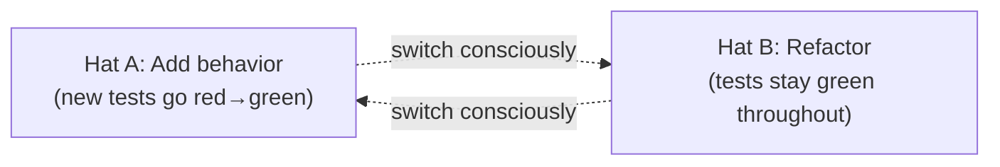
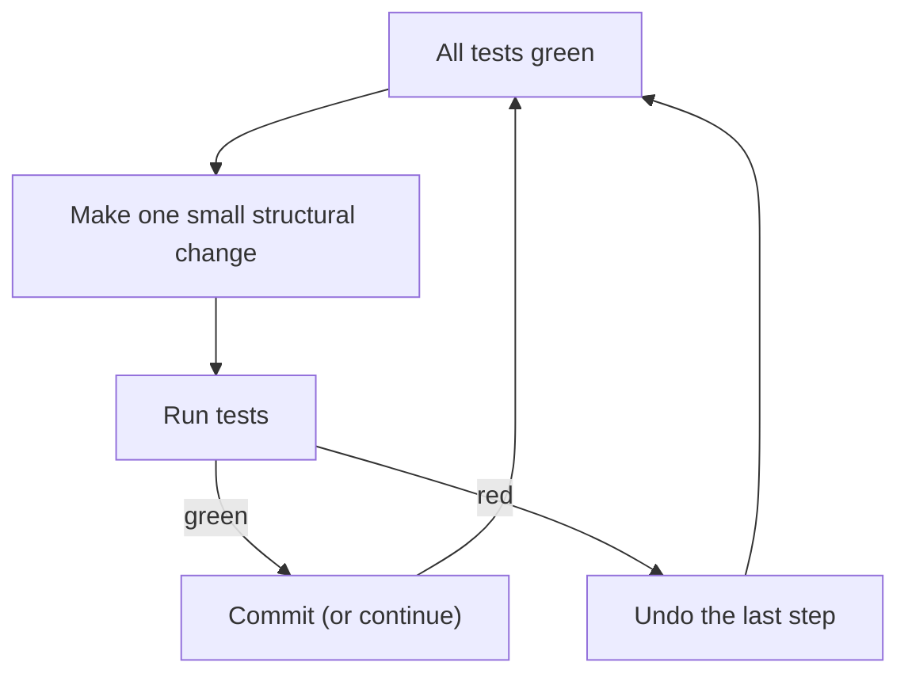
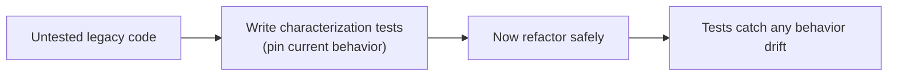

# Refactoring and Code Improvement - Complete Professional Guide

> **Category:** 03_design_and_architecture · **Language:** English

---

### Improving the design of existing code without changing its behavior
**Original guide written from first principles, current to 2026**

> **Original reference book (English).** This is an **independent, originally written** guide. It is not an extract, summary, or paraphrase of any third-party book; it teaches the practice of refactoring from first principles. Canonical books on the subject are listed under **References** as pointers only. Each chapter follows the TO-BRAIN editorial standard (see `FILE_CONVENTIONS.md`).
>
> **Scope notice:** refactoring is changing the **internal structure** of code while keeping its **observable behavior** the same. This guide covers when to do it, how to do it safely, the smells that prompt it, and the 2026 toolchain (IDE automation, test harnesses, and LLM-assisted transformations under guardrails).

---

## How to read this guide

| Level | Profile | Parts |
|-------|---------|-------|
| 1 — Beginner | New to disciplined change | Part I |
| 2 — Intermediate | Daily refactoring | Part II |
| 3 — Advanced | Large/legacy refactors | Part III |

**Target audience:** software engineers, tech leads, and reviewers who change existing code under deadline pressure and want to do it without breaking things.

**Structure of each chapter:** Introduction · Business context · Theoretical concepts · Architecture · Diagrams (Mermaid) · Real examples · Step by step · Complete examples · Exercises · Challenges · Checklist · Best practices · Anti-patterns · Troubleshooting · References.

> **Note on prerequisites.** Assumes you can write a unit test and use version control. Examples are in language-neutral pseudocode or Java-like syntax.

---

## Table of Contents

**Part I – Foundations**
1. What refactoring is (and is not)
2. Tests as the safety net

**Part II – The practice**
3. Code smells: the prompts to refactor
4. Core moves and how to apply them safely

**Part III – At scale**
5. Refactoring legacy code and large structures

> **Status of this guide:** phased delivery. **Ready:** Part I (Ch. 1–2). **In progress:** Parts II–III.

---

## Part I – Foundations

Refactoring is a **disciplined technique**, not a synonym for "rewriting" or "cleaning up whenever." Its defining constraint — behavior stays the same — is what makes it safe to do continuously, in tiny steps, between feature work. Two things make it work: a clear definition of "behavior unchanged," and a fast way to verify it after every step.

---

## Chapter 1 — What refactoring is (and is not)

### 1.1 Introduction

**Refactoring** is a behavior-preserving transformation of code, applied in small, reversible steps, to make the code easier to understand and cheaper to change. The key discipline: you are **either** adding behavior **or** refactoring — never both in the same step. Mixing the two is how "a quick cleanup" turns into a multi-day bug hunt.

### 1.2 Business context

Code is read far more often than it is written, and most of a system's cost is in **changing** it after it ships. Refactoring is the mechanism that keeps change cost from compounding: it pays down the interest on accidental complexity so the next feature is cheap. Skipped indefinitely, the codebase ossifies and velocity collapses — the business feels this as "everything takes longer now."

### 1.3 Theoretical concepts: the two hats



You wear one **hat** at a time. Adding a feature: you may add or change tests, behavior changes. Refactoring: tests do **not** change their assertions and stay green at every step. Knowing which hat you wear tells you whether a failing test is expected (feature) or a mistake (refactor).

### 1.4 Architecture: the refactoring loop



The loop is tight on purpose: each step is small enough that if tests go red, the cause is obvious — it was the last move. This is why refactoring leans on fast tests and frequent commits.

### 1.5 Real example

**Scenario.** A pricing function has grown into a 60-line method mixing tax rules, discounts, and formatting.

**Problem.** Every change risks the others; nobody fully trusts it.

**Solution.** Extract cohesive pieces into named functions, one tiny step at a time, tests green throughout — no behavior change.

**Implementation (before → after, behavior identical).**

```java
// BEFORE: one method does everything
double price(Order o) {
    double base = 0;
    for (Item i : o.items()) base += i.qty() * i.unit();
    double discounted = base;
    if (o.coupon() != null) discounted = base * (1 - o.coupon().rate());
    double taxed = discounted * (1 + 0.20);          // VAT
    return Math.round(taxed * 100) / 100.0;
}

// AFTER: same result, named steps (Extract Function applied 3×)
double price(Order o)        { return round(applyTax(applyCoupon(subtotal(o), o.coupon()))); }
double subtotal(Order o)     { return o.items().stream().mapToDouble(i -> i.qty()*i.unit()).sum(); }
double applyCoupon(double b, Coupon c) { return c == null ? b : b * (1 - c.rate()); }
double applyTax(double v)    { return v * (1 + VAT); }
double round(double v)       { return Math.round(v*100)/100.0; }
```

**Result.** Each rule is named, independently testable, and changeable in isolation — and the output for every input is unchanged.

**Future improvements.** Make `VAT` configurable; add a focused test per extracted function so future changes are pinned.

### 1.6 Exercises

1. State the one-sentence definition of refactoring and the constraint it must preserve.
2. Why must you never add a feature and refactor in the same commit?
3. What signals tell you which "hat" you should be wearing right now?

### 1.7 Challenges

- **Challenge.** Take a long method you own. Apply Extract Function three times, running tests after each. Commit after each green step. Did behavior change? Prove it didn't.

### 1.8 Checklist

- [ ] I can define refactoring as behavior-preserving structural change.
- [ ] I keep feature work and refactoring in separate commits.
- [ ] I run tests after every small step.
- [ ] I commit on green so I can always revert one step.

### 1.9 Best practices

- Work in the smallest steps that still make progress; commit on every green.
- Lean on the IDE's automated refactorings (Rename, Extract, Inline) — they are behavior-preserving by construction.
- Refactor *opportunistically* around the code you're about to change (leave it cleaner than you found it).

### 1.10 Anti-patterns

- "Refactoring" that quietly changes behavior — that's just an unreviewed rewrite.
- Big-bang rewrites justified as "refactoring" with no tests and no small steps.
- Refactoring on a red build, so you can't tell new breakage from old.

### 1.11 Troubleshooting

| Symptom | Likely cause | Action |
|---------|--------------|--------|
| Tests red mid-refactor, cause unclear | Steps too large | Revert; redo in smaller steps |
| "Refactor" PR also changes outputs | Two hats at once | Split into a behavior PR and a structure PR |
| Afraid to touch a module | No tests covering it | Add characterization tests first (Ch. 2/5) |

### 1.12 References

- M. Fowler, *Refactoring: Improving the Design of Existing Code*, 2nd ed. (Addison-Wesley, 2018) — ISBN 978-0134757599.
- IDE refactoring docs: IntelliJ IDEA (https://www.jetbrains.com/help/idea/refactoring-source-code.html), VS Code (https://code.visualstudio.com/docs/editor/refactoring).

---

## Chapter 2 — Tests as the safety net

### 2.1 Introduction

Refactoring without tests is editing and hoping. The tests are what let you make a change and **know** in seconds whether behavior moved. This chapter covers the kind of tests that make refactoring safe, and how to add them to code that has none (**characterization tests**).

### 2.2 Business context

The willingness to refactor is directly proportional to the speed and trust of the test suite. Fast, reliable tests turn refactoring into a low-risk reflex; slow or flaky tests make every change scary, so cleanup never happens and the code rots. Investing in the test net is investing in future change speed.

### 2.3 Theoretical concepts: what kind of tests

- **Fast** — milliseconds, so you run them after every step. Slow suites break the loop.
- **Behavior-focused** — assert observable outputs/effects, not internal structure. Tests coupled to internals break during refactoring even when behavior is intact, defeating the point.
- **Deterministic** — no flakiness; a red must mean a real regression.

**Characterization tests** pin the *current* behavior of code you don't fully understand (legacy). You don't assert what it *should* do — you capture what it *does*, so any change during refactoring is caught.

### 2.4 Architecture: net before change



### 2.5 Real example

**Scenario.** A tax routine with no tests must be restructured.

**Problem.** No one is sure exactly what edge cases it handles, so changing it is risky.

**Solution.** Capture its current outputs across representative inputs as characterization tests, then refactor under that net.

**Implementation.**

```java
// Pin CURRENT behavior (whatever it is) before touching the code.
@ParameterizedTest
@CsvSource({ "100,0.0,120.00", "100,0.1,108.00", "0,0.5,0.00" })
void characterize(double base, double rate, double expected) {
    assertEquals(expected, legacyTax(base, rate), 0.001);
}
```

**Result.** Any refactor that changes an output for these inputs fails immediately. You can now restructure with confidence.

**Future improvements.** As you understand the code, promote characterization tests into intentional specification tests; add cases for newly discovered edges.

### 2.6 Exercises

1. Why should tests assert behavior, not internal structure, when supporting refactoring?
2. What is a characterization test and when do you write one?
3. Why does suite speed determine how much refactoring actually happens?

### 2.7 Challenges

- **Challenge.** Find untested code you fear. Write characterization tests until you can predict its output, then refactor one smell out of it under that net.

### 2.8 Checklist

- [ ] My refactoring tests are fast, deterministic, and behavior-focused.
- [ ] I characterize legacy behavior before restructuring it.
- [ ] I don't assert on private internals that refactoring will move.

### 2.9 Best practices

- Keep a fast "refactor loop" test subset you can run in seconds.
- Add the missing test *before* the risky change, not after the bug.
- Treat flaky tests as broken — they erode the trust refactoring depends on.

### 2.10 Anti-patterns

- Refactoring code with zero coverage and calling the result "safe."
- Tests so coupled to structure that every refactor rewrites them.
- Tolerating a slow suite, so the refactor loop is never run.

### 2.11 Troubleshooting

| Symptom | Likely cause | Action |
|---------|--------------|--------|
| Every refactor rewrites many tests | Tests assert internals | Re-target tests at observable behavior |
| Can't refactor legacy safely | No coverage | Add characterization tests first |
| Team avoids running tests | Suite too slow | Carve a fast subset for the inner loop |

### 2.12 References

- M. Feathers, *Working Effectively with Legacy Code* (Prentice Hall, 2004) — ISBN 978-0131177055.
- K. Beck, *Test-Driven Development by Example* (Addison-Wesley, 2002) — ISBN 978-0321146533.

---

> **End of Part I.** You can now define refactoring as small, behavior-preserving change, separate it cleanly from feature work, and stand up the test net that makes it safe — including characterization tests for legacy code. **Part II — The practice** (Chapters 3–4) catalogs the code smells that prompt a refactor and the core moves (Extract, Inline, Move, Rename) with the safe steps to apply each.

<!--APPEND-PART-II-->
