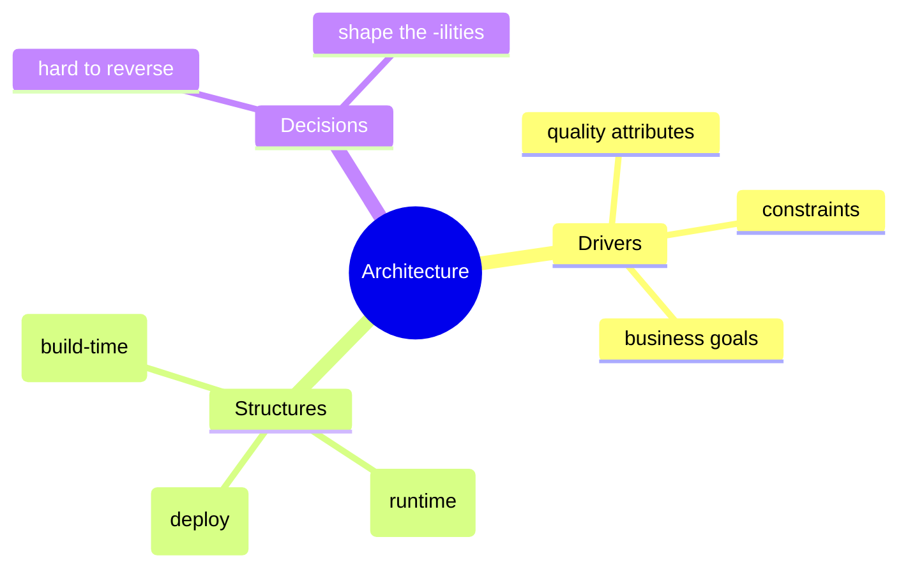
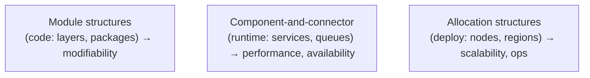
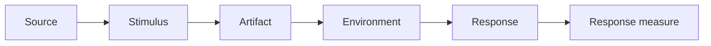
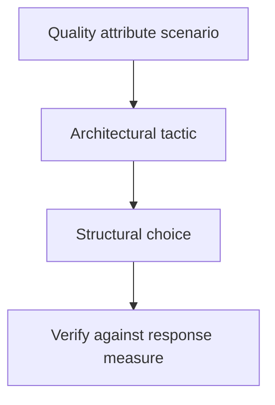
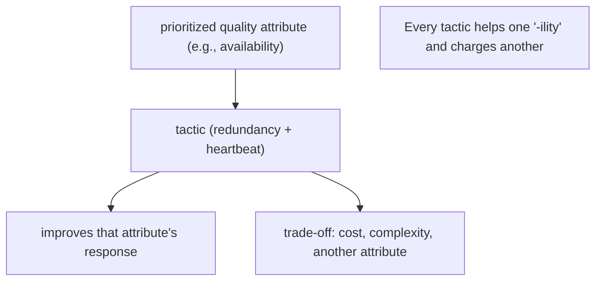
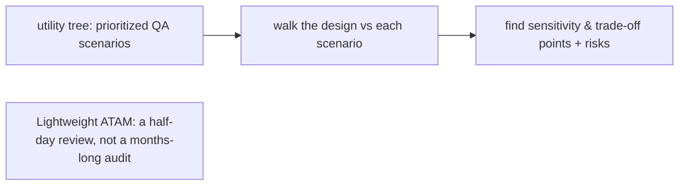

# Software Architecture and Quality Attributes - Complete Professional Guide

> **Category:** 03_design_and_architecture · **Language:** English

---

### Designing for the -ilities: availability, performance, modifiability, security
**Original guide written from first principles, current to 2026**

> **Original reference book (English).** This is an **independent, originally written** guide. It is not an extract, summary, or paraphrase of any third-party book; it teaches architecture-by-quality-attribute from first principles. Canonical books are listed under **References** as pointers only. Each chapter follows the TO-BRAIN editorial standard (see `FILE_CONVENTIONS.md`).
>
> **Scope notice:** architecture is the set of structures that are **hard to change later** and that determine a system's quality attributes — its availability, performance, modifiability, security, and so on. This guide shows how to make those attributes concrete (scenarios), reason about trade-offs, and evaluate a design before building it.

---

## How to read this guide

| Level | Profile | Parts |
|-------|---------|-------|
| 1 — Beginner | New to architecture | Part I |
| 2 — Intermediate | Driving design by QAs | Part II |

**Target audience:** architects, senior engineers, and tech leads making structural decisions with long-lived consequences.

**Structure of each chapter:** Introduction · Business context · Theoretical concepts · Architecture · Diagrams (Mermaid) · Real examples · Step by step · Complete examples · Exercises · Challenges · Checklist · Best practices · Anti-patterns · Troubleshooting · References.

> **Note on prerequisites.** Assumes general development experience and exposure to at least one production system.

---

## Table of Contents

**Part I – Foundations**
1. What architecture is: structures and quality attributes
2. Quality attribute scenarios: making "-ilities" testable

**Part II – Deciding**
3. Tactics, trade-offs, and lightweight evaluation

> **Status of this guide:** complete for its declared scope. **Ready:** Parts I–II (Ch. 1–3).

---

## Part I – Foundations

Architecture is not boxes-and-lines art; it is the set of **early, expensive-to-reverse decisions** that fix what the system can and cannot do well. Functionality can be achieved by almost any structure — but the **quality attributes** (how available, how fast, how changeable, how secure) are won or lost in the architecture. So architecture is best driven by those attributes, stated precisely.

---

## Chapter 1 — What architecture is

### 1.1 Introduction

A system's **software architecture** is the set of structures needed to reason about it — its elements, their relationships, and their externally visible properties. The decisions that belong in architecture are the ones that are **hard to change** and that **shape quality attributes**. Naming them explicitly, early, is the architect's core job.

### 1.2 Business context

Quality attributes are where business risk concentrates: a system that works in the demo but can't stay up, scale, or be changed cheaply fails commercially even if every feature "works." Because architectural decisions are costly to reverse, getting them wrong is expensive in a way feature bugs are not. Treating architecture as deliberate, attribute-driven design is risk management for the parts you can't easily redo.

### 1.3 Theoretical concepts: functionality vs quality



**Functionality** says *what* the system does; **quality attributes** say *how well* — and the same functionality can be delivered by structures with wildly different availability, performance, or modifiability. Architecture is the discipline of choosing structures so the required quality attributes are met. The major attributes: availability, performance, modifiability, security, usability, testability, deployability, scalability.

### 1.4 Architecture: three kinds of structure



You design in three views at once: **module** (how code is organized — drives modifiability), **component-and-connector** (what runs and talks at runtime — drives performance/availability), and **allocation** (where it deploys — drives scalability/operability). Confusing them ("the layered diagram is the deployment") is a classic mistake.

### 1.5 Real example

**Scenario.** A payments platform must stay available during a regional cloud outage.

**Problem.** A single-region deployment fails entirely if that region goes down — unacceptable for payments.

**Solution.** An allocation decision: deploy active-active across two regions with health-checked failover; a runtime decision: make services stateless so any region can serve any request.

**Implementation (allocation sketch).**

```text
Region A (active) ─┐
                   ├─ global load balancer (health-checked)
Region B (active) ─┘
- services: stateless (session/state in a replicated store)
- data: multi-region store with defined consistency for payments
- failover: unhealthy region drained automatically
```

**Result.** A region outage degrades capacity, not availability — traffic shifts to the healthy region. The cost (cross-region data complexity) is accepted deliberately.

**Future improvements.** Run game-day failover drills; measure RTO/RPO against the stated availability target.

### 1.6 Exercises

1. Which decisions belong in "architecture" and which don't?
2. Give two quality attributes the same feature set could fail at.
3. Name the three structure types and the attribute each most affects.

### 1.7 Challenges

- **Challenge.** For a system you know, list the three architectural decisions that would be most expensive to reverse. For each, name the quality attribute it protects.

### 1.8 Checklist

- [ ] I separate functionality from quality attributes.
- [ ] I identify the decisions that are hard to reverse.
- [ ] I reason in module, runtime, and allocation views distinctly.
- [ ] I tie each structural choice to a quality attribute.

### 1.9 Best practices

- Drive architecture from prioritized quality attributes, not technology fashion.
- Keep the three structural views distinct and consistent.
- Record significant decisions (and their rationale) as ADRs.

### 1.10 Anti-patterns

- Designing only for functionality, discovering the -ilities in production.
- One diagram claiming to be code, runtime, and deployment at once.
- "Resume-driven" technology choices unrelated to the quality goals.

### 1.11 Troubleshooting

| Symptom | Likely cause | Action |
|---------|--------------|--------|
| System works but can't stay up/scale | QAs not designed for | Make attributes explicit; add tactics |
| Diagrams disagree with reality | Views conflated/stale | Separate module/runtime/allocation views |
| Costly rework on every change | Modifiability not considered | Revisit module boundaries |

### 1.12 References

- L. Bass, P. Clements, R. Kazman, *Software Architecture in Practice*, 4th ed. (Addison-Wesley, 2021) — ISBN 978-0136886099.
- ISO/IEC 25010 (product quality model): https://iso25000.com/index.php/en/iso-25000-standards/iso-25010.

---

## Chapter 2 — Quality attribute scenarios

### 2.1 Introduction

"The system shall be highly available" is untestable. A **quality attribute scenario** makes it concrete: a **stimulus** hits the system in an **environment**, and you specify the **response** and a **measurable response measure**. Scenarios turn vague -ilities into things you can design for and verify.

### 2.2 Business context

Vague non-functional requirements are where projects quietly fail: everyone agrees the system should be "fast" and "reliable," then argues after launch about whether it is. Measurable scenarios create shared, testable targets up front — aligning stakeholders, enabling objective acceptance, and giving architects a clear thing to optimize against instead of a feeling.

### 2.3 Theoretical concepts: the six parts



A scenario has: **source** (who/what triggers it), **stimulus** (the event), **artifact** (what's affected), **environment** (under what conditions), **response** (what should happen), and **response measure** (the number that makes it testable). The last two are what make it engineering rather than aspiration.

### 2.4 Architecture: scenarios drive tactics



Each scenario points to **tactics** — design moves known to affect that attribute (e.g. for availability: redundancy, health monitoring, failover; for performance: caching, concurrency, load balancing). Tactics become structures; the response measure is the acceptance test.

### 2.5 Real example

**Scenario (written formally).**

```text
Source:          a user request
Stimulus:        arrives during a node failure
Artifact:        the checkout service
Environment:     normal operation, peak traffic
Response:        request is served by a healthy node
Response measure: 99.95% success; added latency < 100 ms
```

**Problem.** "Be reliable" gave no target to design or test against.

**Solution.** The measurable scenario points to redundancy + health-checked failover tactics, and defines the acceptance test (99.95%, <100 ms).

**Result.** The team designs to a number and can prove it with a fault-injection test, not a debate.

**Future improvements.** Add scenarios for the other top attributes (a modifiability scenario: "add a payment provider in < 2 person-days").

### 2.6 Exercises

1. List the six parts of a quality attribute scenario.
2. Rewrite "the app must be fast" as a measurable scenario.
3. Why is the response measure the most important part?

### 2.7 Challenges

- **Challenge.** Write three scenarios for one system — one availability, one performance, one modifiability — each with a concrete response measure. Identify the tactic each implies.

### 2.8 Checklist

- [ ] My quality requirements are scenarios with response measures.
- [ ] Each scenario implies a known tactic.
- [ ] Response measures double as acceptance tests.
- [ ] Stakeholders agreed the numbers up front.

### 2.9 Best practices

- Express every important -ility as a measurable scenario.
- Prioritize scenarios (by business value × risk) — you can't optimize all at once.
- Map each scenario to explicit tactics and verify with a test.

### 2.10 Anti-patterns

- Non-functional requirements as adjectives ("fast," "secure") with no numbers.
- Optimizing an attribute nobody prioritized at the expense of one that mattered.
- Treating scenarios as docs, never verifying the response measure.

### 2.11 Troubleshooting

| Symptom | Likely cause | Action |
|---------|--------------|--------|
| Post-launch fights over "is it fast enough?" | No response measure agreed | Write measurable scenarios up front |
| Over-engineered in one dimension | Unprioritized attributes | Rank scenarios; design to the top ones |
| Can't tell if a QA is met | Scenario never tested | Turn the response measure into a test |

### 2.12 References

- L. Bass, P. Clements, R. Kazman, *Software Architecture in Practice*, 4th ed. (Addison-Wesley, 2021) — ISBN 978-0136886099.
- SEI, Architecture Tradeoff Analysis Method (ATAM): https://www.sei.cmu.edu/.

---

> **End of Part I.** You can now treat architecture as the hard-to-reverse decisions that determine a system's quality attributes, reason in distinct module/runtime/allocation views, and turn vague -ilities into measurable quality attribute scenarios that drive tactics and serve as acceptance tests. **Part II — Deciding** (Chapter 3) covers the tactic catalog, making trade-offs explicit, and lightweight ATAM-style evaluation before you commit.

---

## Part II – Deciding

Part I framed architecture as structures chosen to meet **quality attributes**, made testable with **scenarios**. Part II is how you actually move the needle: applying **tactics** that influence one attribute, weighing the **trade-offs** they impose on others, and checking the design with a **lightweight evaluation**.

---

## Chapter 3 — Tactics, trade-offs, and lightweight evaluation

### 3.1 Introduction

A **tactic** is a single design decision that influences the response of **one** quality attribute — add **redundancy** and a **heartbeat** to improve availability; add a **cache** to improve performance; add an **authorization** check to improve security. Architecture is built by composing tactics, but every tactic has a **trade-off**: a cache improves latency but hurts consistency and adds memory; redundancy improves availability but raises cost and complexity. A **lightweight evaluation** (a scaled-down ATAM) checks, against concrete scenarios, that the chosen tactics meet the prioritized attributes and that you understand what each costs.

### 3.2 Business context

Quality attributes are where architecture meets the business: availability targets, response-time budgets, and security requirements are commitments to customers. Tactics are the concrete levers to meet them, but applying them blindly trades away something that matters — caching everything until data goes stale, or replicating everything until the bill explodes. Naming the trade-off makes it a **decision** rather than an accident, and a cheap evaluation catches a design that won't meet its scenarios *before* it's built, when changing it costs a meeting instead of a re-platforming.

### 3.3 Theoretical concepts: tactics influence one attribute, at a cost



Tactics are catalogued per attribute: availability (redundancy, failover, health monitoring), performance (caching, concurrency, load balancing), modifiability (encapsulation, intermediaries), security (authenticate, authorize, audit). A **sensitivity point** is a decision that strongly affects one attribute; a **trade-off point** is one that affects several in opposite directions (a thread pool size that trades throughput against memory). Good architecture makes these points explicit and chooses deliberately.

### 3.4 Architecture: evaluate against scenarios, cheaply



A lightweight evaluation builds a **utility tree** (the prioritized, concrete quality-attribute scenarios), then walks the architecture against each, recording where it's sensitive, where attributes trade off, and what the **risks** are. It's a few hours with the right people — cheap insurance that the tactics actually meet the priorities.

### 3.5 Real example

**Scenario.** A checkout service must meet "99.95% availability" and "p99 latency < 300 ms".

**Problem.** Adding an in-memory cache for product data improves latency but risks serving stale prices; adding replicas improves availability but raises cost — the two goals pull on each other.

**Solution.** Apply tactics deliberately, name the trade-off, and check against the two scenarios in a lightweight review.

**Implementation.**

```text
Quality-attribute scenarios (utility tree, prioritized):
  - Availability: node failure -> requests still served within 5s, 99.95%
  - Performance:  p99 read latency < 300ms under peak load

Tactics chosen + trade-offs (recorded):
  - Redundancy + health check  -> availability;   trade-off: +cost, +ops complexity
  - Cache product reads (short TTL) -> latency;    trade-off: staleness window (bounded by TTL)
Trade-off point: cache TTL  (lower = fresher but slower/costlier; higher = faster but staler)
Lightweight eval: walk both scenarios -> risk: price staleness; mitigate with event-based cache invalidation
```

**Result.** Each tactic is tied to the scenario it serves and the cost it imposes; the cache TTL is identified as a **trade-off point** and given a mitigation. The half-day evaluation surfaced the staleness risk before launch, when it was cheap to address. The "-ilities" became concrete, decided, and checked.

**Future improvements.** Add event-based cache invalidation to shrink the staleness window; re-run the lightweight evaluation whenever a prioritized scenario changes.

### 3.6 Exercises

1. What is a tactic, and why does every tactic carry a trade-off?
2. Distinguish a sensitivity point from a trade-off point.
3. What does a lightweight (ATAM-style) evaluation produce, and roughly what does it cost?

### 3.7 Challenges

- **Challenge.** For a system you know, write two prioritized quality-attribute scenarios, list the tactics you'd apply, and name the trade-off each imposes. Identify one trade-off point and a mitigation.

### 3.8 Checklist

- [ ] I tie each tactic to the quality attribute it serves.
- [ ] I name the trade-off (cost or another attribute) each tactic imposes.
- [ ] I express requirements as concrete quality-attribute scenarios.
- [ ] I run a lightweight evaluation against those scenarios before building.

### 3.9 Best practices

- Choose tactics from prioritized quality-attribute scenarios, not habit.
- Make sensitivity and trade-off points explicit.
- Evaluate early and cheaply (utility tree + scenario walkthrough).

### 3.10 Anti-patterns

- Applying tactics (cache everything, replicate everything) without naming the cost.
- "-ilities" stated as vague goals instead of testable scenarios.
- Skipping evaluation until the architecture is built and expensive to change.

### 3.11 Troubleshooting

| Symptom | Likely cause | Action |
|---------|--------------|--------|
| Meets latency but data is stale | Cache tactic with no invalidation | Treat TTL as a trade-off point; add invalidation |
| Costs ballooned for availability | Redundancy applied beyond the scenario | Right-size to the availability scenario |
| Discovered a design flaw late | No early evaluation | Run a lightweight ATAM against the utility tree |

### 3.12 References

- L. Bass, P. Clements, R. Kazman, *Software Architecture in Practice*, 4th ed. (Addison-Wesley, 2021), quality-attribute tactics & the ATAM — ISBN 978-0136886099.
- R. Kazman et al., "The Architecture Tradeoff Analysis Method (ATAM)" (SEI).

---

> **End of Part II.** Architecture meets its quality attributes by composing **tactics** — each improving one attribute at a cost to another — with **sensitivity** and **trade-off points** made explicit, then checking the design against prioritized **scenarios** in a cheap **lightweight evaluation**. With Part I's structures and quality-attribute scenarios, you can now decide deliberately and verify before building.
