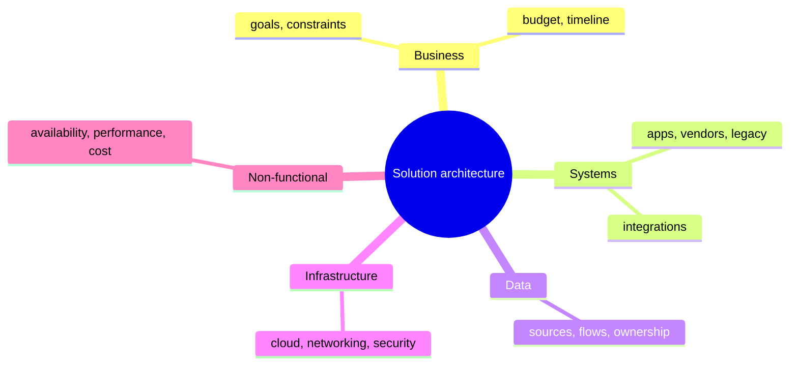
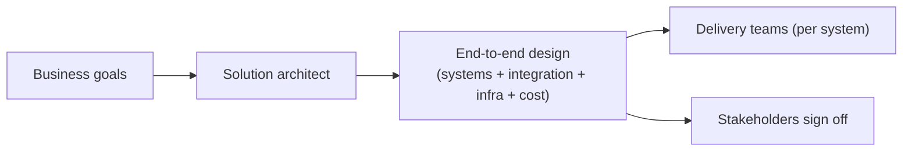
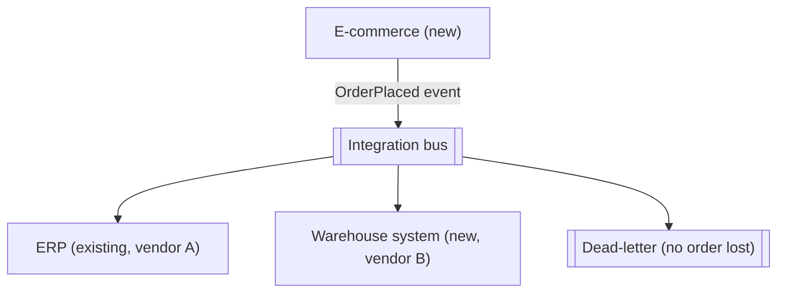
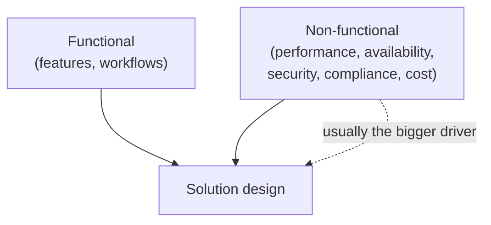
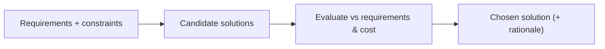

# Solution Architecture - Complete Professional Guide

> **Category:** 03_design_and_architecture · **Language:** English

---

### Designing end-to-end solutions across systems, cloud, and cost
**Original guide written from first principles, current to 2026**

> **Original reference book (English).** This is an **independent, originally written** guide. It is not an extract, summary, or paraphrase of any third-party book; it teaches solution architecture from first principles. Canonical books are listed under **References** as pointers only. Each chapter follows the TO-BRAIN editorial standard (see `FILE_CONVENTIONS.md`).
>
> **Scope notice:** solution architecture designs an **end-to-end answer to a business problem** — spanning multiple systems, integrations, infrastructure, cost, and non-functional needs — rather than the internals of one application. This guide covers the role, requirement gathering, and cloud/cost trade-offs as practiced in 2026.

---

## How to read this guide

| Level | Profile | Parts |
|-------|---------|-------|
| 1 — Beginner | New to solution scope | Part I |
| 2 — Intermediate | Designing solutions | Part II |

**Target audience:** solution architects, senior engineers interfacing with business stakeholders, and tech leads scoping cross-system work.

**Structure of each chapter:** Introduction · Business context · Theoretical concepts · Architecture · Diagrams (Mermaid) · Real examples · Step by step · Complete examples · Exercises · Challenges · Checklist · Best practices · Anti-patterns · Troubleshooting · References.

> **Note on prerequisites.** Assumes the architecture-styles and quality-attributes guides.

---

## Table of Contents

**Part I – The role and requirements**
1. What solution architecture is
2. Gathering functional and non-functional requirements

**Part II – Designing**
3. Cloud, cost, and integration trade-offs

> **Status of this guide:** phased delivery. **Ready:** Part I (Ch. 1–2). **In progress:** Part II.

---

## Part I – The role and requirements

Where software architecture focuses inside one system, **solution architecture** zooms out: it answers a business problem with a coherent design across whatever systems, vendors, data flows, and infrastructure are needed. The solution architect translates between business goals and technical reality, and owns the trade-offs (cost, time-to-market, risk) that cross system boundaries.

---

## Chapter 1 — What solution architecture is

### 1.1 Introduction

A **solution architecture** is the end-to-end design that solves a specific business problem: which systems are involved, how they integrate, where data lives and flows, what infrastructure runs it, and how non-functional needs (security, availability, cost) are met. The solution architect bridges stakeholders and engineering, ensuring the pieces add up to a working, affordable whole.

### 1.2 Business context

Many initiatives fail not because any single component is wrong but because the **seams** between systems, teams, and vendors were never owned. Solution architecture exists to own those seams — aligning the technical design with business goals, budget, and timeline before money is spent building. Its value is catching the integration, cost, and risk problems on paper, when they are cheap to fix.

### 1.3 Theoretical concepts: breadth over depth



The solution architect works **broad**: enough depth in each area to make sound trade-offs, but the job is coherence across all of them. Communication is half the role — translating business language to technical and back, and keeping many stakeholders aligned on one design.

### 1.4 Architecture: the architect as integrator



The solution architect produces a design that delivery teams can build against and stakeholders can fund, holding the whole together while each team owns its part.

### 1.5 Real example

**Scenario.** A retailer wants online orders to flow into an existing ERP and a new warehouse system.

**Problem.** Three systems, two vendors, one business outcome — and no one owns how they connect.

**Solution.** A solution architecture defining the integration (events between store, ERP, warehouse), data ownership, and the non-functional needs (order must not be lost).

**Implementation (solution sketch).**



**Result.** One coherent design with explicit integration, data ownership, and a no-lost-order guarantee — buildable by separate teams, fundable by the business.

**Future improvements.** Add a reconciliation report across the three systems; define SLAs per integration.

### 1.6 Exercises

1. How does solution architecture differ from software architecture?
2. Why are the "seams" between systems the architect's main concern?
3. Name three areas a solution design must cover beyond code.

### 1.7 Challenges

- **Challenge.** For a cross-system initiative you know, draw the systems, the integrations, and where data is owned. Identify the seam most likely to fail.

### 1.8 Checklist

- [ ] I design the end-to-end solution, not just one app.
- [ ] I own the integration seams between systems/vendors.
- [ ] I cover data ownership, infra, and non-functionals.
- [ ] I align the design to business goals and budget.

### 1.9 Best practices

- Make integration points and data ownership explicit and first-class.
- Communicate the design in both business and technical terms.
- Validate cost and timeline against the design before building.

### 1.10 Anti-patterns

- Designing one system well while ignoring the seams.
- Technical design disconnected from business goals/budget.
- No single owner for cross-vendor integration.

### 1.11 Troubleshooting

| Symptom | Likely cause | Action |
|---------|--------------|--------|
| Integration fails late, expensively | Seams unowned in design | Make integration first-class up front |
| Solution over budget | Cost not designed in | Include TCO in the design (Ch. 3) |
| Stakeholders misaligned | Design only in tech terms | Communicate in business language too |

### 1.12 References

- S. Shrivastava, N. Srivastav, *Solutions Architect's Handbook*, 3rd ed. (Packt, 2024) — ISBN 978-1835084236.
- C. Fernando, *Solution Architecture Patterns for Enterprise* (Apress, 2023) — ISBN 978-1484288368.

---

## Chapter 2 — Gathering requirements

### 2.1 Introduction

A solution is only as good as the requirements behind it. Solution architects must elicit both **functional** requirements (what it must do) and **non-functional** requirements (how well — performance, availability, security, compliance, cost), because the non-functionals usually drive the architecture more than the features do. This chapter is about asking the right questions before designing.

### 2.2 Business context

Most expensive solution failures trace back to a missed or vague requirement — a compliance rule discovered after launch, a load level nobody stated, a budget never made explicit. Rigorous requirement gathering surfaces these while they are cheap to address and sets the criteria the solution will be judged against. It also manages stakeholder expectations by making constraints explicit early.

### 2.3 Theoretical concepts: functional vs non-functional



Capture functionals as use cases/flows. Capture non-functionals as **measurable** targets (the quality-attribute scenarios from the architecture guide): "99.9% availability," "p99 < 200ms," "GDPR-compliant data residency in the EU," "under €X/month." Constraints (existing systems, mandated vendors, deadlines) are a third input that bounds the design space.

### 2.4 Architecture: requirements shape options



Requirements don't just feed one design — they let you generate and **compare** options objectively, which is the heart of solution work (and the basis of the cost trade-offs in Chapter 3).

### 2.5 Real example

**Scenario.** A health-data platform.

**Problem.** The team scoped features but missed that health data has strict residency and audit requirements.

**Solution.** A non-functional pass surfaces compliance (data must stay in-region, full audit trail), reshaping the infrastructure choice.

**Implementation (requirements captured).**

```text
Functional:     intake, store, share patient records
Non-functional: data residency = EU only (compliance)
                audit log of every access (compliance)
                availability 99.9%; p99 read < 300ms
                budget <= €8k/month
Constraints:    must integrate with existing identity provider
```

**Result.** Residency and audit — non-functionals — dictate region selection and logging architecture; catching them now avoids a post-launch re-platform.

**Future improvements.** Trace each non-functional to a test/control so compliance is verifiable, not assumed.

### 2.6 Exercises

1. Distinguish functional from non-functional requirements with examples.
2. Why do non-functionals often drive the architecture more than features?
3. How should non-functional requirements be written to be useful?

### 2.7 Challenges

- **Challenge.** For a solution you know, list five non-functional requirements as measurable targets. Identify which one most constrains the design.

### 2.8 Checklist

- [ ] I capture both functional and non-functional requirements.
- [ ] Non-functionals are measurable targets, not adjectives.
- [ ] I record constraints (systems, vendors, deadlines, budget).
- [ ] Requirements let me compare options objectively.

### 2.9 Best practices

- Treat non-functionals as primary architecture drivers.
- Write quality requirements as measurable scenarios.
- Surface compliance and cost constraints before designing.

### 2.10 Anti-patterns

- Scoping only features, discovering non-functionals in production.
- Vague "fast/secure/scalable" with no numbers.
- Ignoring budget until the design is fixed.

### 2.11 Troubleshooting

| Symptom | Likely cause | Action |
|---------|--------------|--------|
| Post-launch compliance scramble | Non-functional missed | Add a non-functional/compliance pass |
| Design can't be objectively compared | Requirements too vague | Make them measurable |
| Budget blown | Cost not a captured requirement | Add cost/TCO as a requirement |

### 2.12 References

- S. Shrivastava, N. Srivastav, *Solutions Architect's Handbook*, 3rd ed. (Packt, 2024) — ISBN 978-1835084236.
- ISO/IEC 25010 (quality model): https://iso25000.com/index.php/en/iso-25000-standards/iso-25010.

---

> **End of Part I.** You can now frame solution architecture as the end-to-end design that solves a business problem across systems, owning the integration seams, data ownership, and infrastructure — driven by both functional and (especially) measurable non-functional requirements and constraints. **Part II — Designing** (Chapter 3) covers cloud and cost trade-offs, total cost of ownership, and choosing between integration approaches.

<!--APPEND-PART-II-->
