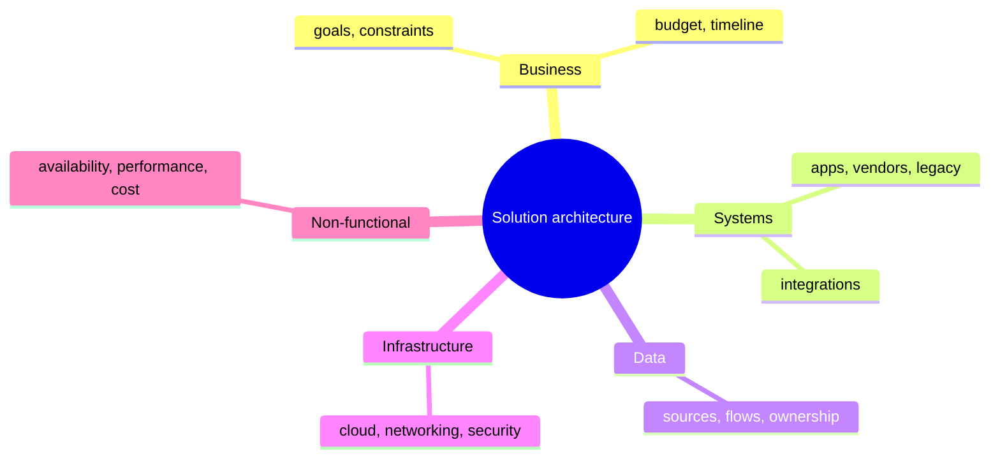
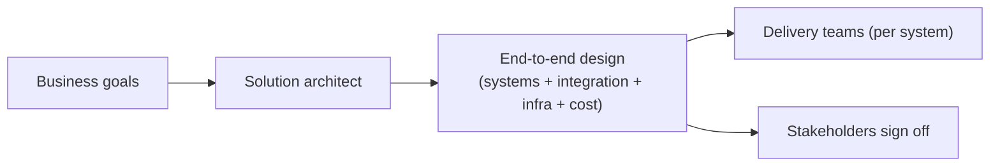
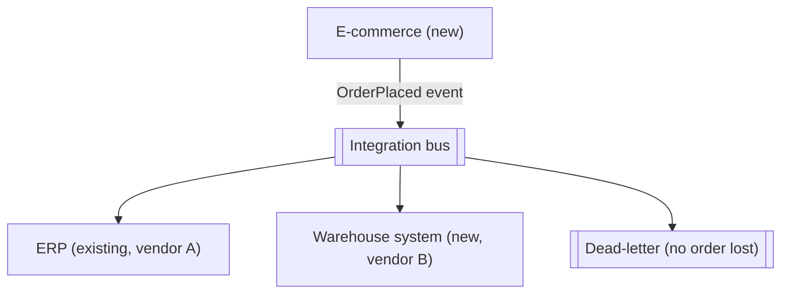
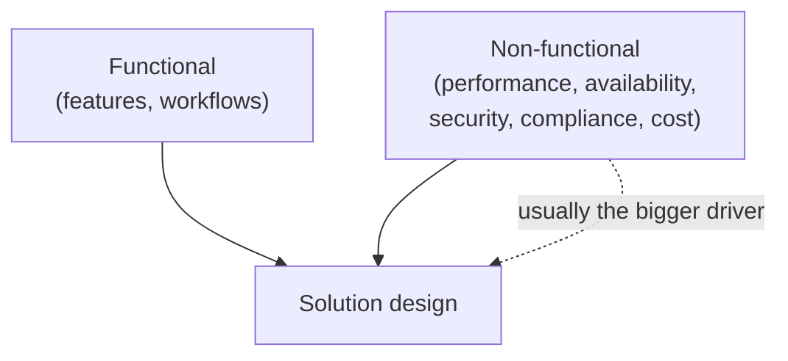
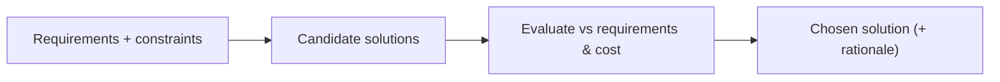
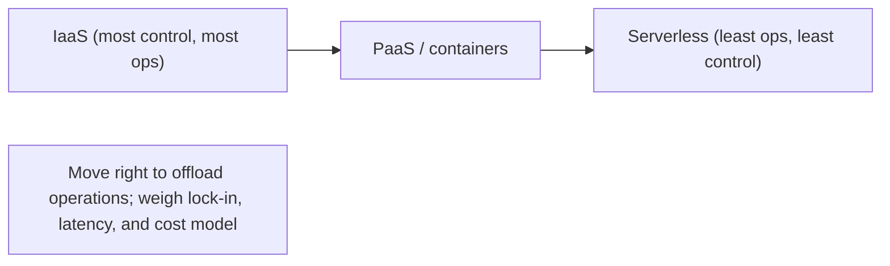
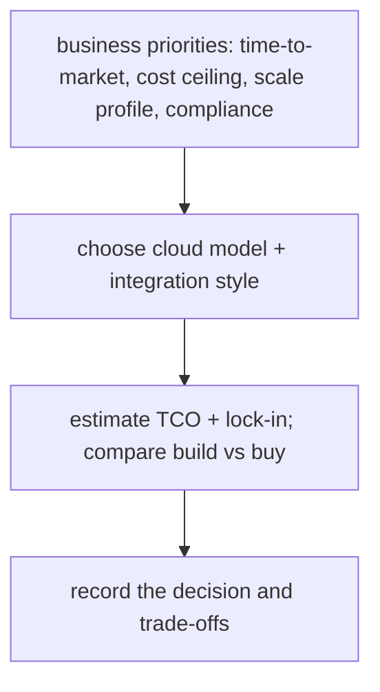

# Solution Architecture - Complete Professional Guide

> **Category:** 03_design_and_architecture · **Language:** English

---

### Designing end-to-end solutions across systems, cloud, and cost
**Original guide written from first principles, current to 2026**

> **Original reference book (English).** This is an **independent, originally written** guide. It is not an extract, summary, or paraphrase of any third-party book; it teaches solution architecture from first principles. Canonical books are listed under **References** as pointers only. Each chapter follows the TO-BRAIN editorial standard (see `FILE_CONVENTIONS.md`).
>
> **Scope notice:** solution architecture designs an **end-to-end answer to a business problem** — spanning multiple systems, integrations, infrastructure, cost, and non-functional needs — rather than the internals of one application. This guide covers the role, requirement gathering, and cloud/cost trade-offs as practiced in 2026.

---

## How to read this guide

| Level | Profile | Parts |
|-------|---------|-------|
| 1 — Beginner | New to solution scope | Part I |
| 2 — Intermediate | Designing solutions | Part II |

**Target audience:** solution architects, senior engineers interfacing with business stakeholders, and tech leads scoping cross-system work.

**Structure of each chapter:** Introduction · Business context · Theoretical concepts · Architecture · Diagrams (Mermaid) · Real examples · Step by step · Complete examples · Exercises · Challenges · Checklist · Best practices · Anti-patterns · Troubleshooting · References.

> **Note on prerequisites.** Assumes the architecture-styles and quality-attributes guides.

---

## Table of Contents

**Part I – The role and requirements**
1. What solution architecture is
2. Gathering functional and non-functional requirements

**Part II – Designing**
3. Cloud, cost, and integration trade-offs

> **Status of this guide:** complete for its declared scope. **Ready:** Parts I–II (Ch. 1–3).

---

## Part I – The role and requirements

Where software architecture focuses inside one system, **solution architecture** zooms out: it answers a business problem with a coherent design across whatever systems, vendors, data flows, and infrastructure are needed. The solution architect translates between business goals and technical reality, and owns the trade-offs (cost, time-to-market, risk) that cross system boundaries.

---

## Chapter 1 — What solution architecture is

### 1.1 Introduction

A **solution architecture** is the end-to-end design that solves a specific business problem: which systems are involved, how they integrate, where data lives and flows, what infrastructure runs it, and how non-functional needs (security, availability, cost) are met. The solution architect bridges stakeholders and engineering, ensuring the pieces add up to a working, affordable whole.

### 1.2 Business context

Many initiatives fail not because any single component is wrong but because the **seams** between systems, teams, and vendors were never owned. Solution architecture exists to own those seams — aligning the technical design with business goals, budget, and timeline before money is spent building. Its value is catching the integration, cost, and risk problems on paper, when they are cheap to fix.

### 1.3 Theoretical concepts: breadth over depth



The solution architect works **broad**: enough depth in each area to make sound trade-offs, but the job is coherence across all of them. Communication is half the role — translating business language to technical and back, and keeping many stakeholders aligned on one design.

### 1.4 Architecture: the architect as integrator



The solution architect produces a design that delivery teams can build against and stakeholders can fund, holding the whole together while each team owns its part.

### 1.5 Real example

**Scenario.** A retailer wants online orders to flow into an existing ERP and a new warehouse system.

**Problem.** Three systems, two vendors, one business outcome — and no one owns how they connect.

**Solution.** A solution architecture defining the integration (events between store, ERP, warehouse), data ownership, and the non-functional needs (order must not be lost).

**Implementation (solution sketch).**



**Result.** One coherent design with explicit integration, data ownership, and a no-lost-order guarantee — buildable by separate teams, fundable by the business.

**Future improvements.** Add a reconciliation report across the three systems; define SLAs per integration.

### 1.6 Exercises

1. How does solution architecture differ from software architecture?
2. Why are the "seams" between systems the architect's main concern?
3. Name three areas a solution design must cover beyond code.

### 1.7 Challenges

- **Challenge.** For a cross-system initiative you know, draw the systems, the integrations, and where data is owned. Identify the seam most likely to fail.

### 1.8 Checklist

- [ ] I design the end-to-end solution, not just one app.
- [ ] I own the integration seams between systems/vendors.
- [ ] I cover data ownership, infra, and non-functionals.
- [ ] I align the design to business goals and budget.

### 1.9 Best practices

- Make integration points and data ownership explicit and first-class.
- Communicate the design in both business and technical terms.
- Validate cost and timeline against the design before building.

### 1.10 Anti-patterns

- Designing one system well while ignoring the seams.
- Technical design disconnected from business goals/budget.
- No single owner for cross-vendor integration.

### 1.11 Troubleshooting

| Symptom | Likely cause | Action |
|---------|--------------|--------|
| Integration fails late, expensively | Seams unowned in design | Make integration first-class up front |
| Solution over budget | Cost not designed in | Include TCO in the design (Ch. 3) |
| Stakeholders misaligned | Design only in tech terms | Communicate in business language too |

### 1.12 References

- S. Shrivastava, N. Srivastav, *Solutions Architect's Handbook*, 3rd ed. (Packt, 2024), the "The Meaning of Solution Architecture" chapter — ISBN 978-1835084236.
- C. Fernando, *Solution Architecture Patterns for Enterprise* (Apress, 2023), the "Introduction to Solution Architecture" chapter — ISBN 978-1484288368.

---

## Chapter 2 — Gathering requirements

### 2.1 Introduction

A solution is only as good as the requirements behind it. Solution architects must elicit both **functional** requirements (what it must do) and **non-functional** requirements (how well — performance, availability, security, compliance, cost), because the non-functionals usually drive the architecture more than the features do. This chapter is about asking the right questions before designing.

### 2.2 Business context

Most expensive solution failures trace back to a missed or vague requirement — a compliance rule discovered after launch, a load level nobody stated, a budget never made explicit. Rigorous requirement gathering surfaces these while they are cheap to address and sets the criteria the solution will be judged against. It also manages stakeholder expectations by making constraints explicit early.

### 2.3 Theoretical concepts: functional vs non-functional



Capture functionals as use cases/flows. Capture non-functionals as **measurable** targets (the quality-attribute scenarios from the architecture guide): "99.9% availability," "p99 < 200ms," "GDPR-compliant data residency in the EU," "under €X/month." Constraints (existing systems, mandated vendors, deadlines) are a third input that bounds the design space.

### 2.4 Architecture: requirements shape options



Requirements don't just feed one design — they let you generate and **compare** options objectively, which is the heart of solution work (and the basis of the cost trade-offs in Chapter 3).

### 2.5 Real example

**Scenario.** A health-data platform.

**Problem.** The team scoped features but missed that health data has strict residency and audit requirements.

**Solution.** A non-functional pass surfaces compliance (data must stay in-region, full audit trail), reshaping the infrastructure choice.

**Implementation (requirements captured).**

```text
Functional:     intake, store, share patient records
Non-functional: data residency = EU only (compliance)
                audit log of every access (compliance)
                availability 99.9%; p99 read < 300ms
                budget <= €8k/month
Constraints:    must integrate with existing identity provider
```

**Result.** Residency and audit — non-functionals — dictate region selection and logging architecture; catching them now avoids a post-launch re-platform.

**Future improvements.** Trace each non-functional to a test/control so compliance is verifiable, not assumed.

### 2.6 Exercises

1. Distinguish functional from non-functional requirements with examples.
2. Why do non-functionals often drive the architecture more than features?
3. How should non-functional requirements be written to be useful?

### 2.7 Challenges

- **Challenge.** For a solution you know, list five non-functional requirements as measurable targets. Identify which one most constrains the design.

### 2.8 Checklist

- [ ] I capture both functional and non-functional requirements.
- [ ] Non-functionals are measurable targets, not adjectives.
- [ ] I record constraints (systems, vendors, deadlines, budget).
- [ ] Requirements let me compare options objectively.

### 2.9 Best practices

- Treat non-functionals as primary architecture drivers.
- Write quality requirements as measurable scenarios.
- Surface compliance and cost constraints before designing.

### 2.10 Anti-patterns

- Scoping only features, discovering non-functionals in production.
- Vague "fast/secure/scalable" with no numbers.
- Ignoring budget until the design is fixed.

### 2.11 Troubleshooting

| Symptom | Likely cause | Action |
|---------|--------------|--------|
| Post-launch compliance scramble | Non-functional missed | Add a non-functional/compliance pass |
| Design can't be objectively compared | Requirements too vague | Make them measurable |
| Budget blown | Cost not a captured requirement | Add cost/TCO as a requirement |

### 2.12 References

- S. Shrivastava, N. Srivastav, *Solutions Architect's Handbook*, 3rd ed. (Packt, 2024), the "Solution Architects in an Organization" chapter (understanding business needs & requirements) — ISBN 978-1835084236.
- ISO/IEC 25010 (quality model): https://iso25000.com/index.php/en/iso-25000-standards/iso-25010.

---

> **End of Part I.** You can now frame solution architecture as the end-to-end design that solves a business problem across systems, owning the integration seams, data ownership, and infrastructure — driven by both functional and (especially) measurable non-functional requirements and constraints. **Part II — Designing** (Chapter 3) covers cloud and cost trade-offs, total cost of ownership, and choosing between integration approaches.

---

## Part II – Designing

Part I framed the solution architect's role: turning a business problem into an end-to-end solution across systems. Part II is where the hardest trade-offs live — **cloud** service models, **cost** (TCO), and **integration** — the decisions that determine whether a solution is viable, affordable, and maintainable.

---

## Chapter 3 — Cloud, cost, and integration trade-offs

### 3.1 Introduction

A solution architecture is a web of trade-offs across three axes. **Cloud**: how much to offload to the provider — IaaS (you manage most), PaaS, containers, or serverless (the provider manages most) — trading control for operational burden. **Cost**: the **total cost of ownership** (TCO), not the sticker price — compute, storage, egress, licenses, and the people to run it, weighed over time and against build-vs-buy. **Integration**: how systems talk — synchronous APIs vs. asynchronous messaging, point-to-point vs. a broker — trading coupling, latency, and complexity. The architect's job is to make these trade-offs explicit and aligned with business priorities.

### 3.2 Business context

These choices have direct financial and strategic consequences. Picking serverless can slash ops cost for spiky workloads but surprise a team with egress bills or cold-start latency; a managed PaaS speeds delivery but risks vendor lock-in; tight point-to-point integrations are quick to build but become a brittle web that resists change. A solution architect who reasons about **TCO and time-to-market**, not just technical elegance, is the one who keeps a project within budget and able to evolve. Naming the trade-offs lets the business make an informed bet rather than discovering the cost later.

### 3.3 Theoretical concepts: control vs. burden, price vs. TCO



The cloud spectrum trades **control for operational burden**: serverless removes most ops and scales to zero (great for spiky/low-baseline workloads) but constrains runtime and can cost more at steady high load; IaaS maximizes control at maximum operational cost. **Cost** must be reasoned as **TCO over time** — including egress, licenses, and staffing — and against **build vs. buy** (a SaaS component you don't operate may beat a cheaper-looking custom build). **Integration** choices trade coupling and latency: synchronous APIs are simple but couple availability; asynchronous messaging decouples but adds eventual consistency and a broker to run.

### 3.4 Architecture: align trade-offs to priorities, record them



As with architecture styles, the solution is derived from prioritized drivers (cost ceiling, scale profile, time-to-market, compliance) and the chosen trade-offs are recorded so they can be revisited as priorities or pricing change.

### 3.5 Real example

**Scenario.** A startup needs an image-processing pipeline with spiky, unpredictable traffic and a tight budget.

**Problem.** Always-on servers (IaaS) cost money while idle; a hand-built queue+workers system is more to operate than the team can afford.

**Solution.** Use **serverless** for the spiky compute and **managed messaging** for integration, with a TCO check and a noted lock-in trade-off.

**Implementation.**

```text
Priorities: low baseline cost, fast to ship, scale with bursts; small team
Cloud:       serverless functions for image processing (scale to zero, pay per use)
Integration: managed queue (async) between upload and processing (decoupled, buffers bursts)
TCO check:   pay-per-use < always-on for spiky load; watch egress + per-invocation cost
Trade-off recorded: provider lock-in accepted for speed/cost now; abstraction at the seam for later portability
```

**Result.** The pipeline costs near zero when idle, absorbs traffic bursts via the queue, and ships fast with a small team operating almost no infrastructure. The TCO reasoning (pay-per-use beats always-on for this profile) and the lock-in trade-off are explicit, so the bet is informed and revisitable if steady load later makes reserved capacity cheaper.

**Future improvements.** Re-estimate TCO as load stabilizes (steady high load may favor containers/reserved instances); keep an abstraction at the provider seam to reduce lock-in if portability becomes a priority.

### 3.6 Exercises

1. What does moving from IaaS toward serverless trade away, and what does it gain?
2. Why is TCO a better basis than sticker price for a cloud decision?
3. What does synchronous vs. asynchronous integration trade off?

### 3.7 Challenges

- **Challenge.** For a solution you know, pick a cloud model and an integration style from its priorities, estimate its TCO drivers (compute, storage, egress, people), and note the biggest lock-in or cost risk.

### 3.8 Checklist

- [ ] The cloud model matches the workload profile (spiky vs. steady) and ops capacity.
- [ ] Decisions are based on TCO over time, not sticker price.
- [ ] Integration style (sync vs. async) is chosen for the coupling/latency needed.
- [ ] Trade-offs (lock-in, egress, eventual consistency) are recorded.

### 3.9 Best practices

- Match the cloud service model to workload and team operational capacity.
- Decide on TCO and build-vs-buy, not headline price.
- Choose integration style by the coupling and latency the solution needs.

### 3.10 Anti-patterns

- Choosing a cloud model by trend without a TCO or lock-in analysis.
- Point-to-point integrations everywhere (a brittle, tightly coupled web).
- Ignoring egress and per-invocation costs until the bill arrives.

### 3.11 Troubleshooting

| Symptom | Likely cause | Action |
|---------|--------------|--------|
| Cloud bill far above estimate | Ignored egress / per-use costs | Re-estimate TCO; adjust model or data flow |
| Idle servers wasting money | Always-on for spiky load | Move to serverless / scale-to-zero |
| Brittle, change-resistant integrations | Point-to-point coupling | Introduce async messaging / a broker |

### 3.12 References

- A. Shrivastava, *Solution Architect's Handbook*, 3rd ed. (Packt, 2024), cloud, cost optimization & integration — ISBN 978-1835084236.
- AWS Well-Architected Framework (cost optimization & operational pillars): https://aws.amazon.com/architecture/well-architected/.

---

> **End of Part II.** A solution architecture balances three trade-offs: **cloud** (control vs. operational burden across IaaS→serverless), **cost** (TCO and build-vs-buy, not sticker price), and **integration** (sync vs. async coupling and latency) — all derived from business priorities and recorded so they can be revisited. With Part I's end-to-end framing, you can now design solutions that are viable, affordable, and able to evolve.
