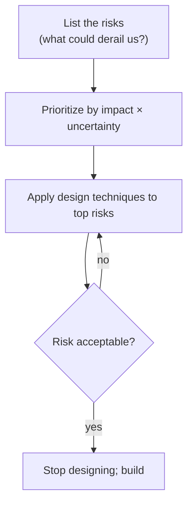
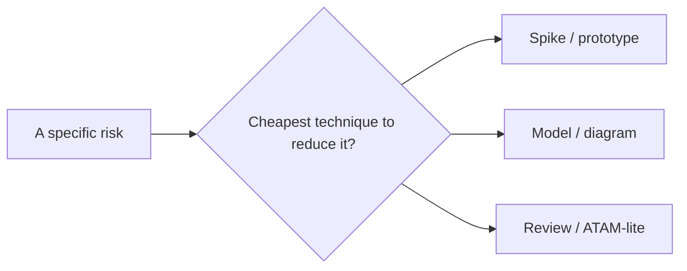
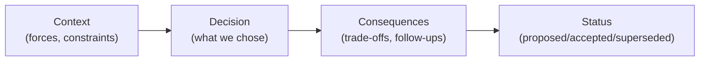
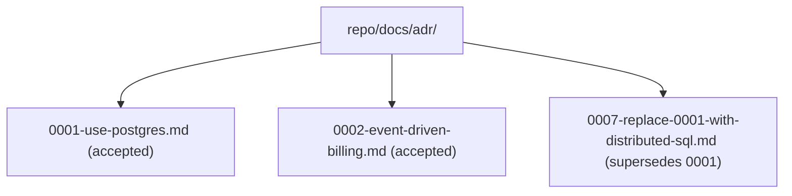
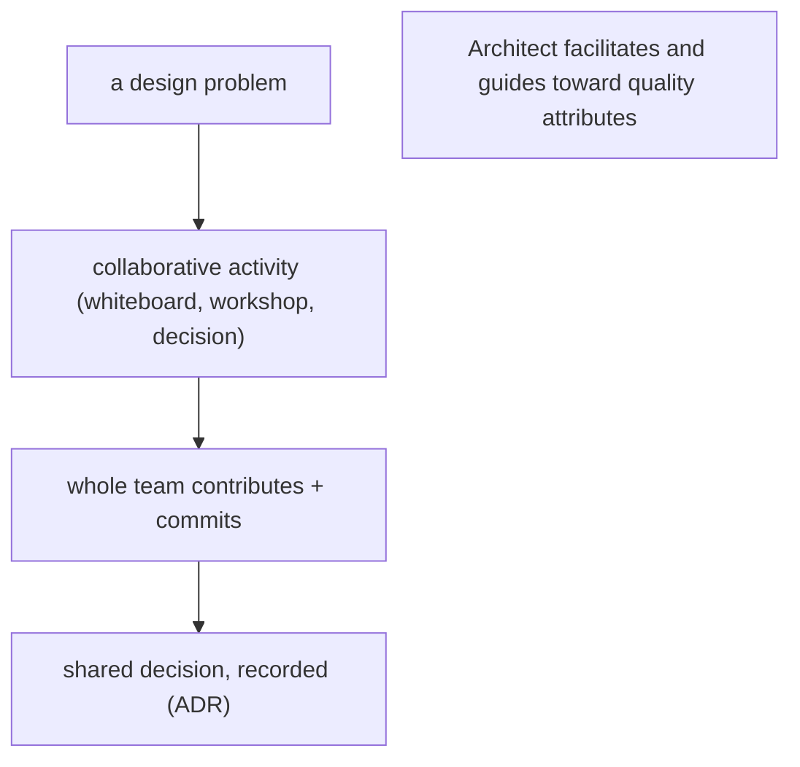
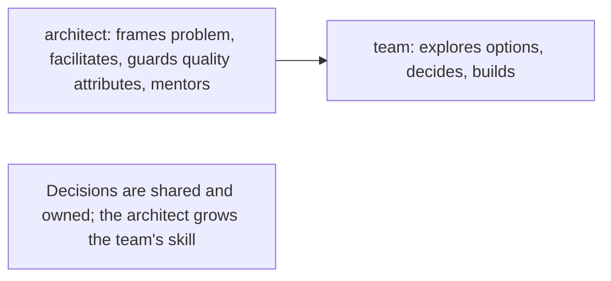

# The Practice of Architecting - Complete Professional Guide

> **Category:** 03_design_and_architecture · **Language:** English

---

### Risk-driven design, decisions, and the architect's day-to-day craft
**Original guide written from first principles, current to 2026**

> **Original reference book (English).** This is an **independent, originally written** guide. It is not an extract, summary, or paraphrase of any third-party book; it teaches the practice of architecting from first principles. Canonical books are listed under **References** as pointers only. Each chapter follows the TO-BRAIN editorial standard (see `FILE_CONVENTIONS.md`).
>
> **Scope notice:** architecting is an **activity**, not a title — the ongoing work of making and communicating the decisions that shape a system. This guide covers risk-driven design (do just enough architecture), how to run design as a team, and recording decisions as ADRs. Current to 2026 collaborative practice.

---

## How to read this guide

| Level | Profile | Parts |
|-------|---------|-------|
| 1 — Beginner | First architecture role | Part I |
| 2 — Intermediate | Leading design | Part II |

**Target audience:** senior engineers stepping into architecture, tech leads, and anyone responsible for cross-cutting design decisions.

**Structure of each chapter:** Introduction · Business context · Theoretical concepts · Architecture · Diagrams (Mermaid) · Real examples · Step by step · Complete examples · Exercises · Challenges · Checklist · Best practices · Anti-patterns · Troubleshooting · References.

> **Note on prerequisites.** Assumes the quality-attribute and architecture-styles guides.

---

## Table of Contents

**Part I – The activity**
1. Architecting as risk-driven, just-enough design
2. Architecture Decision Records (ADRs)

**Part II – Collaboration**
3. Running design as a team activity

> **Status of this guide:** complete for its declared scope. **Ready:** Parts I–II (Ch. 1–3).

---

## Part I – The activity

Architecting is not a phase you finish before coding; it is the continuous activity of identifying the decisions that matter, making them with enough (but not too much) analysis, and communicating them. The amount of architecture work should be **proportional to risk** — heavyweight up-front design for a low-risk CRUD app is as wrong as no design for a safety-critical system.

---

## Chapter 1 — Risk-driven, just-enough design

### 1.1 Introduction

**Risk-driven architecture** says: spend design effort where the **risk** is, and stop when the risk is acceptable. You identify what could derail the project (a scaling unknown, a tricky integration, a security exposure), apply design techniques to reduce exactly those risks, then build. This avoids both reckless under-design and wasteful big-up-front-design.

### 1.2 Business context

Design effort is a cost; its only justification is reducing risk that would otherwise cost more. Teams that over-architect burn budget modeling things that were never going to fail; teams that under-architect get blindsided by the one decision that was hard to reverse. Tying architecture effort to risk maximizes return — you invest analysis precisely where being wrong is expensive.

### 1.3 Theoretical concepts: risk as the guide



The loop: enumerate risks, prioritize, attack the worst with the cheapest effective technique (a spike, a prototype, a model, a review), and stop when remaining risk is acceptable. "How much architecture?" has a concrete answer: enough to bring risk below your threshold.

### 1.4 Architecture: technique matched to risk



Different risks need different techniques: an unknown performance ceiling → a load-test spike; an unclear integration → a thin end-to-end prototype; a contested structure → a quick evaluation workshop. Pick the lightest technique that actually retires the risk.

### 1.5 Real example

**Scenario.** A team fears a new third-party payments integration might not meet latency needs.

**Problem.** They could spend weeks designing around a problem that might not exist — or ignore it and discover it in production.

**Solution.** A two-day spike: call the real API under expected load, measure. The result tells them whether to design for it.

**Implementation (the decision).**

```text
Risk: payments API latency may exceed our 300ms budget at peak.
Technique: timeboxed spike against sandbox under load.
Result: p99 = 180ms within budget -> risk retired; no extra architecture needed.
        (if it had failed: design async confirmation + queue.)
```

**Result.** A small, targeted experiment retired the risk; the team avoided both over-design and a production surprise.

**Future improvements.** Keep the spike as a load test in CI to catch regressions in the provider's latency.

### 1.6 Exercises

1. State the risk-driven rule for how much architecture to do.
2. Give two risks and the cheapest technique to reduce each.
3. When do you stop designing?

### 1.7 Challenges

- **Challenge.** For your current project, list the top three risks. For each, name the lightest technique that would meaningfully reduce it, and timebox one.

### 1.8 Checklist

- [ ] I size architecture effort to project risk.
- [ ] I enumerate and prioritize risks explicitly.
- [ ] I pick the lightest technique that retires a risk.
- [ ] I stop designing when risk is acceptable.

### 1.9 Best practices

- Make risks explicit and revisit them as the project evolves.
- Prefer cheap experiments (spikes/prototypes) over speculative design.
- Timebox design work against a risk, not a calendar.

### 1.10 Anti-patterns

- Big design up front for low-risk systems.
- No design at all for genuinely risky decisions.
- Modeling everything uniformly regardless of where risk concentrates.

### 1.11 Troubleshooting

| Symptom | Likely cause | Action |
|---------|--------------|--------|
| Months of design, nothing built | Over-design / no risk focus | Switch to risk-driven, timeboxed work |
| Production surprise on a known-hard area | Risk ignored | Spike the risk before committing |
| Endless design debates | No risk framing | Frame each decision by the risk it reduces |

### 1.12 References

- M. Keeling, *Design It! From Programmer to Software Architect* (Pragmatic Bookshelf, 2017) — ISBN 978-1680502091.
- G. Fairbanks, *Just Enough Software Architecture* (Marshall & Brainerd, 2010) — ISBN 978-0984618101.

---

## Chapter 2 — Architecture Decision Records

### 2.1 Introduction

An **Architecture Decision Record (ADR)** is a short document capturing one significant decision: its **context**, the **decision**, and its **consequences**. ADRs make architecture **legible over time** — six months later, anyone can see *why* a choice was made, what alternatives were weighed, and what trade-offs were accepted. They are the cheapest high-value documentation an architect produces.

### 2.2 Business context

Undocumented decisions are re-litigated endlessly and accidentally reversed by people who didn't know the reasons. ADRs preserve rationale, so the team stops repeating debates, onboards faster, and changes decisions deliberately (with a new ADR superseding the old) rather than by accident. The cost is minutes per decision; the payoff is durable institutional memory.

### 2.3 Theoretical concepts: the minimal record



A good ADR is short (one page), immutable once accepted (you supersede rather than edit), numbered, and stored **in the repo** next to the code. Capturing the alternatives considered and why they lost is what makes it valuable later.

### 2.4 Architecture: ADRs live with the code



Keeping ADRs in version control ties each decision to the code state when it was made, and the supersede chain shows how thinking evolved.

### 2.5 Real example

**Scenario.** The team chooses PostgreSQL over a document database.

**Problem.** A year later, someone asks "why not Mongo?" and nobody remembers.

**Solution.** A one-page ADR recorded at decision time.

**Implementation (ADR template).**

```markdown
# 0001. Use PostgreSQL for the system of record
Status: Accepted
## Context
Strong relational integrity and ad-hoc queries are required; team knows SQL.
## Decision
Use PostgreSQL as the primary store, with JSONB for flexible sub-documents.
## Consequences
+ Transactions and constraints for free; mature tooling.
- Horizontal scaling needs planning later (revisit if write volume 10x).
Alternatives considered: MongoDB (rejected: weaker multi-document integrity).
```

**Result.** The "why not Mongo?" question is answered in 30 seconds by reading ADR-0001; if the decision changes, ADR-0007 supersedes it with new context.

**Future improvements.** Add an ADR index/README; lint PRs that make a big decision without an ADR.

### 2.6 Exercises

1. What three parts must every ADR have?
2. Why supersede an ADR instead of editing it?
3. Why store ADRs in the code repository?

### 2.7 Challenges

- **Challenge.** Write an ADR for a decision your team already made implicitly. Include the alternatives and why they lost. Share it and see if it settles a recurring debate.

### 2.8 Checklist

- [ ] Significant decisions get a short ADR.
- [ ] Each ADR records context, decision, consequences, status.
- [ ] ADRs are immutable; changes supersede them.
- [ ] ADRs live in version control.

### 2.9 Best practices

- Keep ADRs to one page; capture alternatives and trade-offs.
- Number them and maintain a supersede chain.
- Make "is there an ADR?" part of reviewing big changes.

### 2.10 Anti-patterns

- Decisions living only in chat threads and people's memory.
- Editing accepted ADRs in place, erasing history.
- ADRs so long nobody writes or reads them.

### 2.11 Troubleshooting

| Symptom | Likely cause | Action |
|---------|--------------|--------|
| Same decision re-debated repeatedly | No recorded rationale | Write an ADR; point to it |
| A choice was silently reversed | Decision undocumented | Record decisions; supersede deliberately |
| Nobody writes ADRs | Too heavyweight | Use a one-page template |

### 2.12 References

- M. Nygard, "Documenting Architecture Decisions" (2011), https://cognitect.com/blog/2011/11/15/documenting-architecture-decisions.
- M. Keeling, *Design It!* (Pragmatic Bookshelf, 2017) — ISBN 978-1680502091.

---

> **End of Part I.** You can now treat architecting as a continuous, risk-driven activity — investing design effort in proportion to risk and stopping when risk is acceptable — and capture significant choices as short, immutable ADRs stored with the code. **Part II — Collaboration** (Chapter 3) covers running architecture as a team activity: shared modeling, decision ownership, and avoiding the ivory-tower architect.

---

## Part II – Collaboration

Part I treated architecting as an activity — making and validating decisions, not producing a binder. Part II covers how that activity works best: **as a team**, not as a lone architect handing down a design. Architecting is a social, hands-on practice.

---

## Chapter 3 — Running design as a team activity

### 3.1 Introduction

The "ivory tower" architect who designs in isolation and throws a diagram over the wall is an anti-pattern. Modern architecting is a **team activity**: the people who will build the system participate in shaping it, which produces better decisions (more perspectives, fewer blind spots) and far better buy-in (the team owns a design it helped create). The architect's job shifts from *deciding everything* to **facilitating** design — running collaborative activities, guiding decisions toward the quality attributes, and growing the team's architectural skill. Think **architect as gardener**, not dictator.

### 3.2 Business context

Architecture decisions made alone are slower to land and quicker to be ignored: the team doesn't understand the rationale, doesn't agree, and routes around it. Running design collaboratively means the people closest to the code surface constraints early, commit to the result, and can carry the architecture forward without the architect as a bottleneck. It also **builds the team's capability**, so good decisions keep happening when the architect isn't in the room. For a business, that's faster delivery, fewer expensive late surprises, and resilience against bus-factor.

### 3.3 Theoretical concepts: facilitate, don't dictate



Collaborative architecting uses lightweight, structured **activities**: divergent thinking to generate options, convergent thinking to choose, and visualization (whiteboarding, modeling) to make the design shared and visible. The architect frames the problem around the **quality attributes** (so the team optimizes the right things), facilitates the activity, and ensures the decision is captured (an ADR). Authority comes from helping the team reach a good decision, not from making it for them.

### 3.4 Architecture: the architect as guide



The architect spends less time drawing the final design and more time enabling the team to produce it — running the workshop, asking the sharpening questions, and mentoring so the next decision needs them less.

### 3.5 Real example

**Scenario.** A team must choose how to split a monolith and isn't aligned.

**Problem.** The architect could decree the boundaries — fast to write down, slow to land, and resented — or let the team debate endlessly with no structure.

**Solution.** Run a **collaborative design activity** framed by the quality attributes, and capture the shared decision.

**Implementation.**

```text
Workshop (whole team, ~2 hours), facilitated by the architect:
  1. Frame: prioritized quality attributes (independent deployability, team ownership)
  2. Diverge: each pair proposes a boundary split on the whiteboard
  3. Converge: score proposals against the quality attributes; discuss trade-offs
  4. Decide: choose a split the team commits to
  5. Capture: write an ADR (context / decision / consequences)
Architect's role: frame, facilitate, keep focus on quality attributes — not dictate the answer
```

**Result.** The boundaries are chosen *by the team*, framed by the right quality attributes, so the design is better-informed and the team owns and defends it. The decision lands immediately (everyone was there) and is recorded in an ADR. The architect guided the outcome without dictating it — and the team is more capable of the next such decision.

**Future improvements.** Rotate facilitation to grow architectural skill across the team; make collaborative design and ADRs a routine cadence, not a one-off.

### 3.6 Exercises

1. Why does collaborative architecting produce better decisions *and* better buy-in than solo design?
2. What does the architect do in a design activity if not "decide everything"?
3. How does framing an activity around quality attributes change its outcome?

### 3.7 Challenges

- **Challenge.** Facilitate a short design activity for a real decision: frame it with two quality attributes, run a diverge/converge round on a whiteboard, and capture the team's decision in an ADR. Note how ownership differs from a decision handed down.

### 3.8 Checklist

- [ ] The people who build the system participate in designing it.
- [ ] I facilitate design activities rather than dictate the design.
- [ ] Activities are framed around prioritized quality attributes.
- [ ] Shared decisions are captured (ADRs) and the team is mentored.

### 3.9 Best practices

- Run design as collaborative, structured activities (diverge then converge).
- Frame problems around quality attributes; let the team choose.
- Capture decisions and grow the team's architectural skill.

### 3.10 Anti-patterns

- Ivory-tower architecture handed down as a finished diagram.
- Unstructured debate with no framing or decision capture.
- The architect as a permanent decision bottleneck.

### 3.11 Troubleshooting

| Symptom | Likely cause | Action |
|---------|--------------|--------|
| Team ignores the architecture | Designed in isolation, no buy-in | Run collaborative design; involve the builders |
| Design debates never resolve | No framing or facilitation | Frame by quality attributes; diverge then converge |
| Architect is the bottleneck | All decisions centralized | Facilitate and mentor; distribute decision-making |

### 3.12 References

- M. Keeling, *Design It! From Programmer to Software Architect* (Pragmatic Bookshelf, 2017), architecture as a team activity & design activities — ISBN 978-1680502091.
- G. Hohpe, *The Software Architect Elevator* (O'Reilly, 2020), the connecting, non-ivory-tower architect.

---

> **End of Part II.** Architecting is a **team activity**: the builders participate, the architect **facilitates** structured design activities framed by **quality attributes**, decisions are shared and captured in ADRs, and the team's skill grows so the architect isn't a bottleneck. With Part I's view of architecting as decision-making, you can now run it collaboratively — producing better designs the team actually owns.
