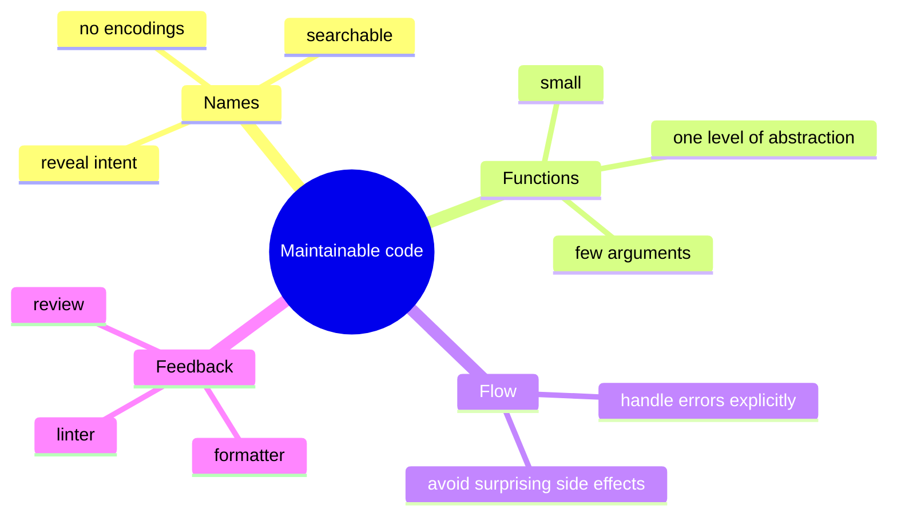
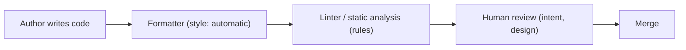
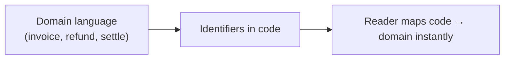
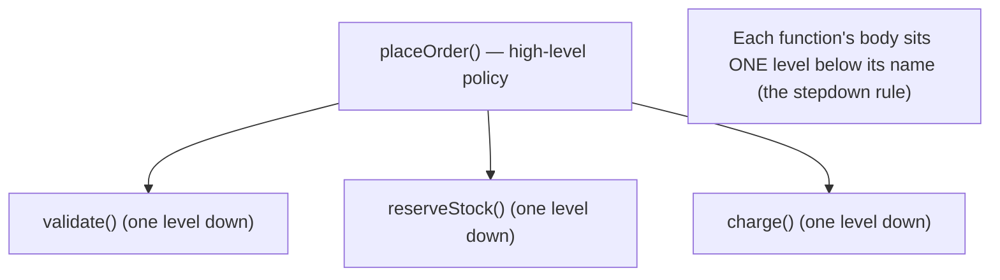
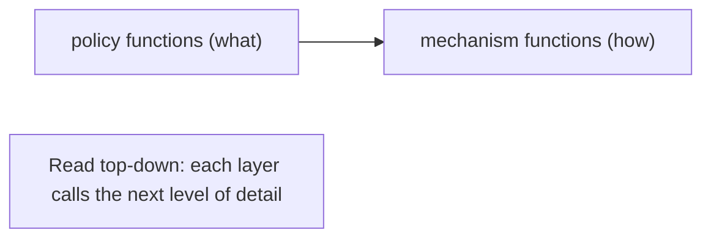
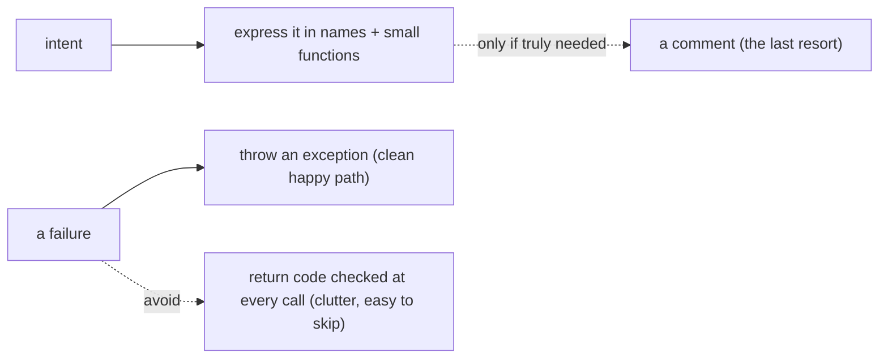
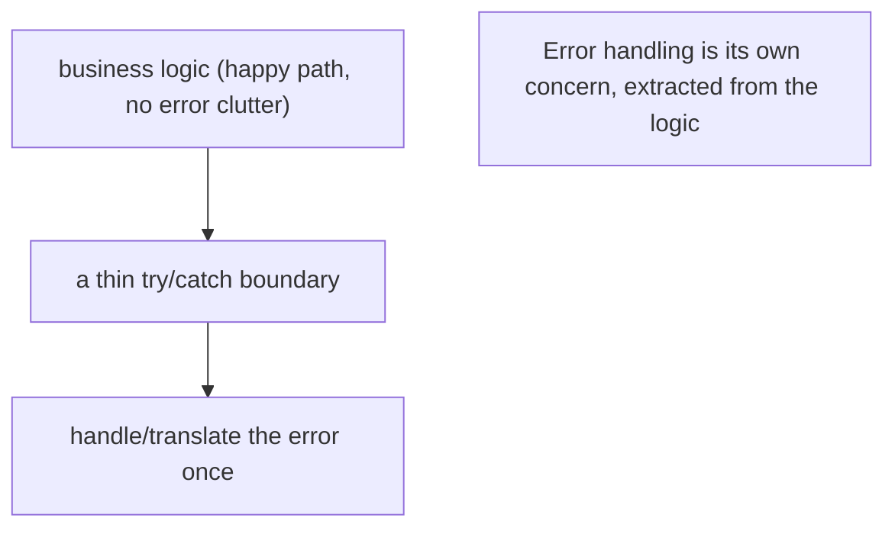

# Writing Maintainable Code - Complete Professional Guide

> **Category:** 03_design_and_architecture · **Language:** English

---

### Names, functions, and structure that the next reader can change safely
**Original guide written from first principles, current to 2026**

> **Original reference book (English).** This is an **independent, originally written** guide. It is not an extract, summary, or paraphrase of any third-party book; it teaches code craftsmanship from first principles. Canonical books on the subject are listed under **References** as pointers only. Each chapter follows the TO-BRAIN editorial standard (see `FILE_CONVENTIONS.md`).
>
> **Scope notice:** maintainable code is code optimized for **reading and changing**, not just for running. This guide covers naming, function design, error handling, and the small structural habits that keep a codebase workable — with 2026 notes on linters, formatters, and reviewing AI-generated code.

---

## How to read this guide

| Level | Profile | Parts |
|-------|---------|-------|
| 1 — Beginner | New to code review | Part I |
| 2 — Intermediate | Daily craft | Part II |

**Target audience:** every engineer who writes code others (including their future self) will read and modify.

**Structure of each chapter:** Introduction · Business context · Theoretical concepts · Architecture · Diagrams (Mermaid) · Real examples · Step by step · Complete examples · Exercises · Challenges · Checklist · Best practices · Anti-patterns · Troubleshooting · References.

> **Note on prerequisites.** Assumes basic fluency in one language. Examples use Java-like syntax but the principles are language-neutral.

---

## Table of Contents

**Part I – Foundations**
1. Code is read more than written: optimizing for the reader
2. Naming: the cheapest documentation

**Part II – Building blocks**
3. Functions that do one thing
4. Errors, comments, and the cost of cleverness

> **Status of this guide:** complete for its declared scope. **Ready:** Parts I–II (Ch. 1–4).

---

## Part I – Foundations

The defining fact of software maintenance: a line of code is **read** many times for every time it is written. So the highest-leverage habit is to optimize the source for the reader — the colleague (or your six-months-later self) who must understand it to change it without fear. Everything else in this guide follows from that one priority.

---

## Chapter 1 — Code is read more than written

### 1.1 Introduction

Code communicates twice: once to the machine (does it run?) and once to the next human (can they change it?). The machine is satisfied by correctness; the human needs **clarity**. Maintainable code treats the second audience as primary, because over a system's life the cost of *changing* it dwarfs the cost of writing it the first time.

### 1.2 Business context

Engineering throughput is gated by how fast people can safely understand and modify existing code. Unclear code taxes every future change with re-discovery time and raises the rate of defects introduced by misunderstanding. Clarity is therefore not aesthetics — it is a direct lever on delivery speed and defect cost. Teams that protect readability ship faster for longer.

### 1.3 Theoretical concepts: clarity over cleverness



The recurring trade is **clarity vs cleverness**. A clever one-liner that saves the author thirty seconds can cost every future reader minutes. Maintainable code consistently chooses the boring, obvious form.

### 1.4 Architecture: the feedback that enforces clarity



Style is settled by an **automatic formatter** (no review time spent on spacing). Mechanical rules are caught by a **linter**. That frees human review to focus on what tools can't judge: naming, intent, and design. In 2026 this pipeline also reviews **AI-generated** code — which is often syntactically clean but semantically off, so review shifts toward "is this actually correct and necessary?"

### 1.5 Real example

**Scenario.** A reviewer meets a function they've never seen and must decide if a change is safe.

**Problem.** The code "works" but takes ten minutes to understand because names and structure hide intent.

**Solution.** Rename for intent and split responsibilities so the function reads like a description of what it does.

**Implementation (before → after).**

```java
// BEFORE: works, but the reader must decode it
List<int[]> getThem(List<int[]> l) {
    List<int[]> l1 = new ArrayList<>();
    for (int[] x : l) if (x[0] == 4) l1.add(x);
    return l1;
}

// AFTER: same behavior, intent on the surface
List<Cell> flaggedCells(List<Cell> board) {
    return board.stream().filter(Cell::isFlagged).toList();
}
```

**Result.** The second version needs no comment; the names *are* the explanation. A reviewer judges safety in seconds.

**Future improvements.** Push `isFlagged` onto the `Cell` type so the magic value `4` disappears entirely.

### 1.6 Exercises

1. Why is "optimize for the reader" the right default priority for production code?
2. Give an example where cleverness costs more than it saves.
3. What should automatic tooling decide so humans don't review it?

### 1.7 Challenges

- **Challenge.** Take a function a teammate wrote. Time how long until you can confidently change it. Improve names/structure (behavior unchanged) and re-time on a fresh reader.

### 1.8 Checklist

- [ ] I optimize source for the next reader, not just the compiler.
- [ ] I choose the obvious form over the clever one.
- [ ] Style is enforced by a formatter, not by reviewers.
- [ ] I review AI-generated code for correctness and necessity, not just style.

### 1.9 Best practices

- Adopt a single automatic formatter and a linter; make them CI gates.
- Spend review attention on intent and design, not whitespace.
- Prefer code that needs no comment to explain *what* it does.

### 1.10 Anti-patterns

- Clever one-liners that compress logic at the reader's expense.
- Bikeshedding style in review instead of automating it.
- Merging AI-suggested code because it "looks clean" without checking intent.

### 1.11 Troubleshooting

| Symptom | Likely cause | Action |
|---------|--------------|--------|
| Reviews bog down in style nits | No formatter/linter gate | Automate style; reserve review for design |
| New joiners slow to contribute | Code hides intent | Invest in naming and small functions |
| Subtle bugs in generated code | Reviewed for style, not logic | Add behavior tests; review correctness |

### 1.12 References

- R. C. Martin, *Clean Code* (Prentice Hall, 2008), ch. 1 "Clean Code" ("There Will Be Code" — reading vs. writing) — ISBN 978-0132350884.
- S. McConnell, *Code Complete*, 2nd ed. (Microsoft Press, 2004) — ISBN 978-0735619678.
- Tooling: Prettier (https://prettier.io), ESLint (https://eslint.org), Spotless (https://github.com/diffplug/spotless).

---

## Chapter 2 — Naming: the cheapest documentation

### 2.1 Introduction

Names are the highest-density documentation in a codebase: every identifier either helps or misleads the reader, for free, every time it's read. A good name reveals **intent** — why this exists and what it's for — so the surrounding code becomes self-explanatory. This chapter makes naming a deliberate skill, not an afterthought.

### 2.2 Business context

Most time spent in code is spent *reading to understand*. Names are the first thing read and the cheapest thing to get right. Misleading names are worse than vague ones — they actively cause wrong changes. Good naming compounds: a well-named codebase onboards faster and resists the slow decay into "only Maria understands that module."

### 2.3 Theoretical concepts: what a good name does

- **Reveals intent** — `elapsedDays` over `d`; the reader learns *why*, not just *what type*.
- **Is searchable** — a named constant `MAX_RETRIES` can be grep'd; the literal `3` cannot.
- **Avoids disinformation** — don't call it `accountList` if it's a `Set`; don't reuse a word for two concepts.
- **Matches scope** — short names for short-lived locals (`i` in a tight loop is fine); descriptive names for things with reach.

### 2.4 Architecture: names as the domain vocabulary



When identifiers mirror the **domain's own words**, code and conversation share one vocabulary — a reviewer, a product owner, and the code all say "settle the invoice." This is the bridge into domain modeling (see the DDD guide).

### 2.5 Real example

**Scenario.** A money calculation uses single-letter variables and magic numbers.

**Problem.** Readers can't tell tax from discount, or what `0.2` means.

**Solution.** Name the concepts; replace magic numbers with named constants.

**Implementation.**

```java
// BEFORE
double c(double p, double q) { return p * q * 1.2; }

// AFTER
static final double VAT_RATE = 0.20;
double grossLineTotal(double unitPrice, int quantity) {
    double net = unitPrice * quantity;
    return net * (1 + VAT_RATE);
}
```

**Result.** The formula now states its meaning; `VAT_RATE` is searchable and changeable in one place.

**Future improvements.** Introduce a `Money` type so currency rounding and arithmetic are correct and named, not ad hoc.

### 2.6 Exercises

1. Give three properties of a good identifier name.
2. Why is a misleading name worse than a vague one?
3. When is a one-letter name acceptable?

### 2.7 Challenges

- **Challenge.** Find a magic number in your code. Replace it with a named constant and check every reader of that value now understands it without comment.

### 2.8 Checklist

- [ ] My names reveal intent, not just type.
- [ ] Constants are named and searchable (no bare magic numbers).
- [ ] Identifiers use the domain's own vocabulary.
- [ ] Name length matches the identifier's scope and reach.

### 2.9 Best practices

- Rename freely — the IDE makes it safe; a better name pays back immediately.
- Align code vocabulary with the domain language used by the team.
- Replace magic literals with named constants at first sight.

### 2.10 Anti-patterns

- Encoding type or scope into names (Hungarian-style) the compiler already knows.
- Reusing one word for two different concepts in the same codebase.
- Abbreviations only the original author understands.

### 2.11 Troubleshooting

| Symptom | Likely cause | Action |
|---------|--------------|--------|
| Readers misread what a value means | Misleading or vague name | Rename to reveal intent |
| Same literal changed in many places | Magic number, not a constant | Extract a named constant |
| Code and product talk past each other | Names diverge from domain | Adopt the domain's vocabulary |

### 2.12 References

- R. C. Martin, *Clean Code* (Prentice Hall, 2008), ch. 2 "Meaningful Names" — ISBN 978-0132350884.
- E. Evans, *Domain-Driven Design* (Addison-Wesley, 2003) — ISBN 978-0321125217, on shared domain vocabulary.

---

> **End of Part I.** You now treat code as something written primarily to be read and changed, enforce style automatically so review focuses on intent, and use naming as the cheapest, highest-leverage documentation you have. **Part II — Building blocks** (Chapters 3–4) covers functions that do one thing at one level of abstraction, and disciplined error handling over clever control flow.

---

## Part II – Building blocks

Part I set the mindset: code is read more than written, and names are the cheapest documentation. Part II is about the two building blocks where that mindset is won or lost — **functions** that do one thing at one level of abstraction, and **error handling, comments, and clever code**, where discipline beats ingenuity.

---

## Chapter 3 — Functions that do one thing

### 3.1 Introduction

The first rule of functions is that they should be **small**; the second is that they should do **one thing**. "One thing" has a precise test: every statement in the function is **one level of abstraction below** the function's name. If a function mixes high-level policy ("process the order") with low-level mechanics (string formatting, loop indices), it is doing several things and should be split. Small, single-purpose functions are easy to name, read, test, and reuse — the foundation of maintainable code.

### 3.2 Business context

A 200-line function that does everything is where bugs hide and changes stall: to fix one behavior you must understand all of them, and you can't test a part in isolation. Breaking it into small functions that each do one thing turns that wall of code into named, testable steps a reader can scan top-to-bottom. Teams move faster because changes become local, reviews become focused, and the same small functions get reused instead of re-implemented. Function design is where readability is most cheaply bought.

### 3.3 Theoretical concepts: one level of abstraction per function



Keep one level of abstraction per function: a high-level function reads as a sequence of named steps, each of which is itself a function one level lower — the **stepdown rule**, so code reads like a top-down narrative. Extract until you cannot meaningfully extract more; a good name for the extracted piece is the signal that it was indeed "one thing". Long functions almost always mix levels; the cure is **Extract Function** until each does one job.

### 3.4 Architecture: compose small functions



A maintainable module is a shallow tree of small functions: policy at the top calling mechanism below, never the reverse mixed together. The shape makes the *what* visible at a glance and hides the *how* until you need it.

### 3.5 Real example

**Scenario.** A `handleOrder` function validates input, talks to the database, formats a receipt, and logs — all in one body.

**Problem.** It mixes levels (business rules next to string formatting), so it's hard to name, impossible to unit-test a part, and risky to change.

**Solution.** Extract each "thing" into its own well-named function; let `handleOrder` read as a list of steps.

**Implementation.**

```text
# Before: one function doing many things at many levels
handleOrder(req):
    if req.qty <= 0 or req.sku == "": ...     # validation
    row = db.query("SELECT ...")              # persistence mechanics
    total = 0; for i in items: total += ...   # calculation mechanics
    receipt = "Order " + id + ": $" + total   # formatting
    log.write(...)                            # logging

# After: each function does ONE thing at ONE level
handleOrder(req):
    validate(req)
    order = saveOrder(req)
    return formatReceipt(order)               # reads as a top-down narrative
```

**Result.** `handleOrder` now states *what* happens in three named steps; the *how* lives in small functions you can name, test, and reuse independently. A change to receipt formatting touches only `formatReceipt`; validation can be unit-tested without a database.

**Future improvements.** Apply the stepdown rule throughout the module so every function reads one level above the functions it calls; remove any function whose name needs "and" (a sign it still does two things).

### 3.6 Exercises

1. What is the precise test for whether a function "does one thing"?
2. What is the stepdown rule, and how does it make code read like a narrative?
3. Why is a function whose name contains "and" suspect?

### 3.7 Challenges

- **Challenge.** Take the longest function in code you know and extract until each resulting function does one thing at one level of abstraction. Name each extraction; if a name needs "and", split again.

### 3.8 Checklist

- [ ] My functions are small and do one thing.
- [ ] Each function body is one level of abstraction below its name.
- [ ] High-level functions read as a sequence of named steps (stepdown rule).
- [ ] No function name needs "and".

### 3.9 Best practices

- Extract Function until each does one thing; let the name confirm it.
- Keep one level of abstraction per function.
- Prefer many small, well-named functions over one large one.

### 3.10 Anti-patterns

- Long functions mixing policy and mechanics.
- Flag arguments that make a function do one thing or another.
- Deep nesting that hides multiple responsibilities in one body.

### 3.11 Troubleshooting

| Symptom | Likely cause | Action |
|---------|--------------|--------|
| Can't name a function without "and" | It does more than one thing | Extract until each does one |
| Hard to unit-test part of a function | Mixed levels of abstraction | Extract the part into its own function |
| Change ripples through a huge function | One function owns many concerns | Split by responsibility |

### 3.12 References

- R. C. Martin, *Clean Code* (Prentice Hall, 2008), ch. 3 "Functions" (Do One Thing; One Level of Abstraction per Function) — ISBN 978-0132350884.
- S. McConnell, *Code Complete*, 2nd ed. (Microsoft Press, 2004), ch. 7 (high-quality routines) — ISBN 978-0735619678.

---

## Chapter 4 — Errors, comments, and the cost of cleverness

### 4.1 Introduction

Three habits separate maintainable code from a maintenance burden. Handle failures with **exceptions, not return codes**, so the happy path stays clean and no error is silently ignored. Treat **comments as a last resort**: a comment usually marks a failure to make the code express itself, and comments rot into lies as code changes. And resist **cleverness** — code that shows off costs every future reader the time to decode it. In all three, clarity beats ingenuity.

### 4.2 Business context

Return-code error handling tangles the main logic with `if (err)` checks and invites the one unchecked path that becomes a production incident; exceptions separate the two. Stale comments are worse than none — they actively mislead during the next change, and someone trusts them. Clever one-liners feel productive but tax every reviewer and every on-call engineer who must understand them at 3 a.m. Choosing the boring, explicit version is what keeps a codebase cheap to operate as the team and the code turn over.

### 4.3 Theoretical concepts: express, don't comment; throw, don't return codes



Use **exceptions rather than return codes**, and keep error handling itself "one thing" — extract the `try/catch` so a function either does work *or* handles errors, not both. Before writing a comment, try to **make the code say it**: rename a variable, extract a well-named function, introduce an explaining constant. Reserve comments for intent the code genuinely can't carry (a why, a legal note, a warning). Prefer the explicit, ordinary construct over the clever one; the reader's time is the scarce resource.

### 4.4 Architecture: separate the happy path from failure



Push error handling to a boundary: the core logic reads top-to-bottom without `if (err)` noise, and a surrounding handler deals with failure in one place. The same separation that keeps functions doing one thing (Ch. 3) keeps error handling from polluting them.

### 4.5 Real example

**Scenario.** A routine parses a file, with failure handled by return codes and explained by comments.

**Problem.** Every call checks a code (easy to forget), the logic is buried under error branches, and a comment "// returns -1 if not found" drifts out of date.

**Solution.** Throw exceptions, extract the handler, and replace the comment with an expressive name.

**Implementation.**

```text
# Before: return codes + a comment that can rot
parse(path):
    code = open(path)              # returns -1 on missing file (comment may lie)
    if code == -1: return -1
    ... # logic interleaved with more code checks

# After: exceptions + extracted handling + self-explaining code
loadConfig(path):                  # name states intent — no comment needed
    try:
        return parse(open(path))   # happy path is clean
    except NotFound:
        raise ConfigMissing(path)  # translate at the boundary, once
```

**Result.** The happy path reads without error clutter, no caller can silently skip a forgotten code, and the intent lives in the name `loadConfig` rather than a comment that could go stale. Error handling is a single boundary concern, not smeared through the logic.

**Future improvements.** Delete comments that merely restate code; keep only the "why". Audit clever expressions and replace any that a teammate can't read at a glance with an explicit equivalent.

### 4.6 Exercises

1. Why do exceptions keep the happy path cleaner than return codes?
2. Why is a stale comment worse than no comment, and what should you try before writing one?
3. What is the real cost of "clever" code, and who pays it?

### 4.7 Challenges

- **Challenge.** Find a function using return codes for errors. Convert it to exceptions, extract the `try/catch` to a boundary, and remove at least one comment by renaming or extracting so the code explains itself.

### 4.8 Checklist

- [ ] I use exceptions rather than return codes for failures.
- [ ] Error handling is extracted so a function does work or handles errors, not both.
- [ ] I try to express intent in code before adding a comment.
- [ ] I prefer explicit, ordinary code over clever constructs.

### 4.9 Best practices

- Throw exceptions; keep the happy path free of error clutter.
- Make comments a last resort; prefer names, small functions, explaining constants.
- Write the boring, explicit version a tired teammate can read.

### 4.10 Anti-patterns

- Return codes checked (and forgotten) at every call site.
- Comments that restate the code or that have drifted out of date.
- Clever one-liners that trade readability for a feeling of brevity.

### 4.11 Troubleshooting

| Symptom | Likely cause | Action |
|---------|--------------|--------|
| Errors occasionally ignored | Return codes not checked everywhere | Use exceptions; handle at a boundary |
| Comment contradicts the code | Comment rotted as code changed | Delete it; express intent in the code |
| Reviewers keep asking "what does this do?" | Clever, terse code | Rewrite explicitly with clear names |

### 4.12 References

- R. C. Martin, *Clean Code* (Prentice Hall, 2008), ch. 4 "Comments" & ch. 7 "Error Handling" (Use Exceptions Rather Than Return Codes) — ISBN 978-0132350884.
- E. Evans, *Domain-Driven Design* (Addison-Wesley, 2003) — ISBN 978-0321125217, on shared domain vocabulary.

---

> **End of Part II.** Maintainable building blocks come from **functions that do one thing** at one level of abstraction (read top-down via the stepdown rule) and from disciplined **error handling, comments, and restraint with cleverness** — exceptions over return codes, expressive code over comments, the explicit over the clever. With Part I's reader-first mindset and naming, you now have the day-to-day habits that keep code easy to read and change.
