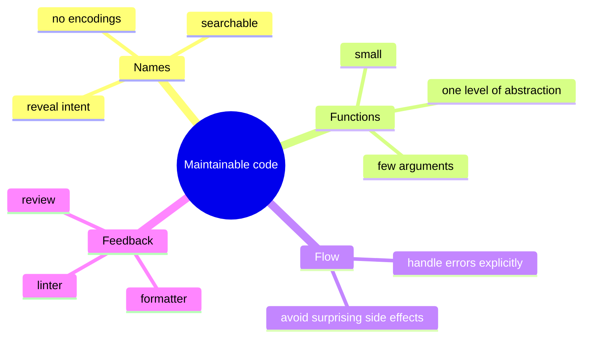
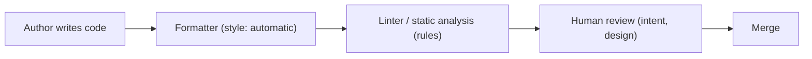
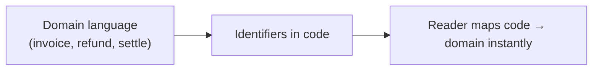

# Writing Maintainable Code - Complete Professional Guide

> **Category:** 03_design_and_architecture · **Language:** English

---

### Names, functions, and structure that the next reader can change safely
**Original guide written from first principles, current to 2026**

> **Original reference book (English).** This is an **independent, originally written** guide. It is not an extract, summary, or paraphrase of any third-party book; it teaches code craftsmanship from first principles. Canonical books on the subject are listed under **References** as pointers only. Each chapter follows the TO-BRAIN editorial standard (see `FILE_CONVENTIONS.md`).
>
> **Scope notice:** maintainable code is code optimized for **reading and changing**, not just for running. This guide covers naming, function design, error handling, and the small structural habits that keep a codebase workable — with 2026 notes on linters, formatters, and reviewing AI-generated code.

---

## How to read this guide

| Level | Profile | Parts |
|-------|---------|-------|
| 1 — Beginner | New to code review | Part I |
| 2 — Intermediate | Daily craft | Part II |

**Target audience:** every engineer who writes code others (including their future self) will read and modify.

**Structure of each chapter:** Introduction · Business context · Theoretical concepts · Architecture · Diagrams (Mermaid) · Real examples · Step by step · Complete examples · Exercises · Challenges · Checklist · Best practices · Anti-patterns · Troubleshooting · References.

> **Note on prerequisites.** Assumes basic fluency in one language. Examples use Java-like syntax but the principles are language-neutral.

---

## Table of Contents

**Part I – Foundations**
1. Code is read more than written: optimizing for the reader
2. Naming: the cheapest documentation

**Part II – Building blocks**
3. Functions that do one thing
4. Errors, comments, and the cost of cleverness

> **Status of this guide:** phased delivery. **Ready:** Part I (Ch. 1–2). **In progress:** Part II.

---

## Part I – Foundations

The defining fact of software maintenance: a line of code is **read** many times for every time it is written. So the highest-leverage habit is to optimize the source for the reader — the colleague (or your six-months-later self) who must understand it to change it without fear. Everything else in this guide follows from that one priority.

---

## Chapter 1 — Code is read more than written

### 1.1 Introduction

Code communicates twice: once to the machine (does it run?) and once to the next human (can they change it?). The machine is satisfied by correctness; the human needs **clarity**. Maintainable code treats the second audience as primary, because over a system's life the cost of *changing* it dwarfs the cost of writing it the first time.

### 1.2 Business context

Engineering throughput is gated by how fast people can safely understand and modify existing code. Unclear code taxes every future change with re-discovery time and raises the rate of defects introduced by misunderstanding. Clarity is therefore not aesthetics — it is a direct lever on delivery speed and defect cost. Teams that protect readability ship faster for longer.

### 1.3 Theoretical concepts: clarity over cleverness



The recurring trade is **clarity vs cleverness**. A clever one-liner that saves the author thirty seconds can cost every future reader minutes. Maintainable code consistently chooses the boring, obvious form.

### 1.4 Architecture: the feedback that enforces clarity



Style is settled by an **automatic formatter** (no review time spent on spacing). Mechanical rules are caught by a **linter**. That frees human review to focus on what tools can't judge: naming, intent, and design. In 2026 this pipeline also reviews **AI-generated** code — which is often syntactically clean but semantically off, so review shifts toward "is this actually correct and necessary?"

### 1.5 Real example

**Scenario.** A reviewer meets a function they've never seen and must decide if a change is safe.

**Problem.** The code "works" but takes ten minutes to understand because names and structure hide intent.

**Solution.** Rename for intent and split responsibilities so the function reads like a description of what it does.

**Implementation (before → after).**

```java
// BEFORE: works, but the reader must decode it
List<int[]> getThem(List<int[]> l) {
    List<int[]> l1 = new ArrayList<>();
    for (int[] x : l) if (x[0] == 4) l1.add(x);
    return l1;
}

// AFTER: same behavior, intent on the surface
List<Cell> flaggedCells(List<Cell> board) {
    return board.stream().filter(Cell::isFlagged).toList();
}
```

**Result.** The second version needs no comment; the names *are* the explanation. A reviewer judges safety in seconds.

**Future improvements.** Push `isFlagged` onto the `Cell` type so the magic value `4` disappears entirely.

### 1.6 Exercises

1. Why is "optimize for the reader" the right default priority for production code?
2. Give an example where cleverness costs more than it saves.
3. What should automatic tooling decide so humans don't review it?

### 1.7 Challenges

- **Challenge.** Take a function a teammate wrote. Time how long until you can confidently change it. Improve names/structure (behavior unchanged) and re-time on a fresh reader.

### 1.8 Checklist

- [ ] I optimize source for the next reader, not just the compiler.
- [ ] I choose the obvious form over the clever one.
- [ ] Style is enforced by a formatter, not by reviewers.
- [ ] I review AI-generated code for correctness and necessity, not just style.

### 1.9 Best practices

- Adopt a single automatic formatter and a linter; make them CI gates.
- Spend review attention on intent and design, not whitespace.
- Prefer code that needs no comment to explain *what* it does.

### 1.10 Anti-patterns

- Clever one-liners that compress logic at the reader's expense.
- Bikeshedding style in review instead of automating it.
- Merging AI-suggested code because it "looks clean" without checking intent.

### 1.11 Troubleshooting

| Symptom | Likely cause | Action |
|---------|--------------|--------|
| Reviews bog down in style nits | No formatter/linter gate | Automate style; reserve review for design |
| New joiners slow to contribute | Code hides intent | Invest in naming and small functions |
| Subtle bugs in generated code | Reviewed for style, not logic | Add behavior tests; review correctness |

### 1.12 References

- R. C. Martin, *Clean Code* (Prentice Hall, 2008) — ISBN 978-0132350884.
- S. McConnell, *Code Complete*, 2nd ed. (Microsoft Press, 2004) — ISBN 978-0735619678.
- Tooling: Prettier (https://prettier.io), ESLint (https://eslint.org), Spotless (https://github.com/diffplug/spotless).

---

## Chapter 2 — Naming: the cheapest documentation

### 2.1 Introduction

Names are the highest-density documentation in a codebase: every identifier either helps or misleads the reader, for free, every time it's read. A good name reveals **intent** — why this exists and what it's for — so the surrounding code becomes self-explanatory. This chapter makes naming a deliberate skill, not an afterthought.

### 2.2 Business context

Most time spent in code is spent *reading to understand*. Names are the first thing read and the cheapest thing to get right. Misleading names are worse than vague ones — they actively cause wrong changes. Good naming compounds: a well-named codebase onboards faster and resists the slow decay into "only Maria understands that module."

### 2.3 Theoretical concepts: what a good name does

- **Reveals intent** — `elapsedDays` over `d`; the reader learns *why*, not just *what type*.
- **Is searchable** — a named constant `MAX_RETRIES` can be grep'd; the literal `3` cannot.
- **Avoids disinformation** — don't call it `accountList` if it's a `Set`; don't reuse a word for two concepts.
- **Matches scope** — short names for short-lived locals (`i` in a tight loop is fine); descriptive names for things with reach.

### 2.4 Architecture: names as the domain vocabulary



When identifiers mirror the **domain's own words**, code and conversation share one vocabulary — a reviewer, a product owner, and the code all say "settle the invoice." This is the bridge into domain modeling (see the DDD guide).

### 2.5 Real example

**Scenario.** A money calculation uses single-letter variables and magic numbers.

**Problem.** Readers can't tell tax from discount, or what `0.2` means.

**Solution.** Name the concepts; replace magic numbers with named constants.

**Implementation.**

```java
// BEFORE
double c(double p, double q) { return p * q * 1.2; }

// AFTER
static final double VAT_RATE = 0.20;
double grossLineTotal(double unitPrice, int quantity) {
    double net = unitPrice * quantity;
    return net * (1 + VAT_RATE);
}
```

**Result.** The formula now states its meaning; `VAT_RATE` is searchable and changeable in one place.

**Future improvements.** Introduce a `Money` type so currency rounding and arithmetic are correct and named, not ad hoc.

### 2.6 Exercises

1. Give three properties of a good identifier name.
2. Why is a misleading name worse than a vague one?
3. When is a one-letter name acceptable?

### 2.7 Challenges

- **Challenge.** Find a magic number in your code. Replace it with a named constant and check every reader of that value now understands it without comment.

### 2.8 Checklist

- [ ] My names reveal intent, not just type.
- [ ] Constants are named and searchable (no bare magic numbers).
- [ ] Identifiers use the domain's own vocabulary.
- [ ] Name length matches the identifier's scope and reach.

### 2.9 Best practices

- Rename freely — the IDE makes it safe; a better name pays back immediately.
- Align code vocabulary with the domain language used by the team.
- Replace magic literals with named constants at first sight.

### 2.10 Anti-patterns

- Encoding type or scope into names (Hungarian-style) the compiler already knows.
- Reusing one word for two different concepts in the same codebase.
- Abbreviations only the original author understands.

### 2.11 Troubleshooting

| Symptom | Likely cause | Action |
|---------|--------------|--------|
| Readers misread what a value means | Misleading or vague name | Rename to reveal intent |
| Same literal changed in many places | Magic number, not a constant | Extract a named constant |
| Code and product talk past each other | Names diverge from domain | Adopt the domain's vocabulary |

### 2.12 References

- R. C. Martin, *Clean Code* (Prentice Hall, 2008) — ISBN 978-0132350884.
- E. Evans, *Domain-Driven Design* (Addison-Wesley, 2003) — ISBN 978-0321125217, on shared domain vocabulary.

---

> **End of Part I.** You now treat code as something written primarily to be read and changed, enforce style automatically so review focuses on intent, and use naming as the cheapest, highest-leverage documentation you have. **Part II — Building blocks** (Chapters 3–4) covers functions that do one thing at one level of abstraction, and disciplined error handling over clever control flow.

<!--APPEND-PART-II-->
