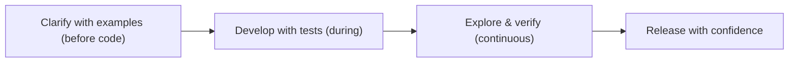
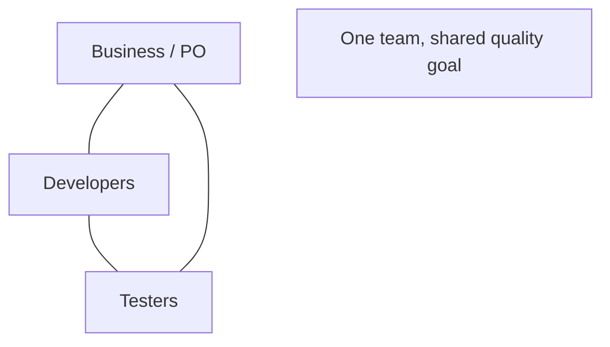
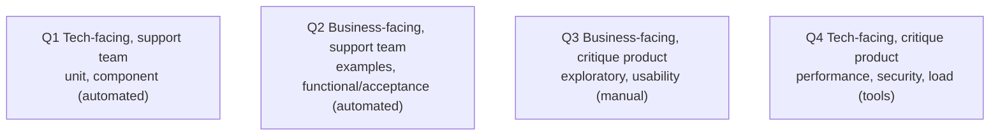
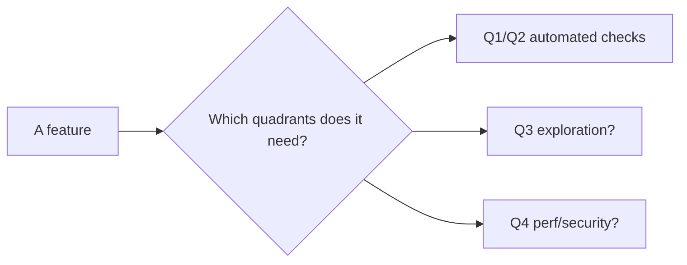

# Agile Testing - Complete Professional Guide

> **Category:** 04_engineering_and_practices · **Language:** English

---

### Whole-team quality and the testing quadrants
**Original guide written from first principles, current to 2026**

> **Original reference book (English).** This is an **independent, originally written** guide. It is not an extract, summary, or paraphrase of any third-party book; it teaches agile testing from first principles with original examples. Canonical books are listed under **References** as pointers only. Each chapter follows the TO-BRAIN editorial standard (see `FILE_CONVENTIONS.md`).
>
> **Scope notice:** agile testing makes quality a **whole-team, continuous** responsibility rather than a phase at the end. This guide covers the agile testing mindset, the testing quadrants as a planning lens, and where exploratory testing fits — current to 2026 (CI, fast feedback, AI-assisted test generation).

---

## How to read this guide

| Level | Profile | Parts |
|-------|---------|-------|
| 1 — Beginner | New to agile quality | Part I |
| 2 — Intermediate | Planning test coverage | Part II |

**Target audience:** developers, testers, and product owners building quality in rather than inspecting it afterward.

**Structure of each chapter:** Introduction · Business context · Theoretical concepts · Architecture · Diagrams (Mermaid) · Real examples · Step by step · Complete examples · Exercises · Challenges · Checklist · Best practices · Anti-patterns · Troubleshooting · References.

> **Note on prerequisites.** Assumes basic agile delivery and the TDD/specification-by-example guides.

---

## Table of Contents

**Part I – The mindset**
1. Quality is a whole-team responsibility
2. The testing quadrants

**Part II – Beyond automation**
3. Exploratory testing and its place

> **Status of this guide:** phased delivery. **Ready:** Part I (Ch. 1–2). **In progress:** Part II.

---

## Part I – The mindset

Agile testing rejects "developers write code, then testers find bugs at the end." Quality is built in continuously by the whole team: testing activities happen throughout, testers collaborate from the start, and developers own automated checks. The shift is from **testing as a gate** to **testing as a continuous, shared activity**.

---

## Chapter 1 — Quality is a whole-team responsibility

### 1.1 Introduction

In agile testing, the **whole team owns quality** — it is not delegated to a separate QA phase or department. Testers contribute early (clarifying requirements, defining examples), developers write and maintain automated tests, and everyone treats a broken test as a stop-the-line event. Quality is built in continuously rather than inspected in at the end.

### 1.2 Business context

The traditional "test at the end" model finds defects late, when they are most expensive and most likely to delay release. Whole-team, continuous testing catches issues as work is done — cheaper to fix and less disruptive — and shortens feedback loops so the team can release frequently with confidence. It also removes the adversarial dev-vs-QA dynamic, replacing handoffs with collaboration.

### 1.3 Theoretical concepts: built-in, not bolted-on



Testing activities span the whole flow: helping define done with examples *before* coding, writing automated checks *during*, and exploring *continuously*. The team builds quality in via fast automated feedback and shared ownership, rather than relying on an end-of-cycle inspection.

### 1.4 Architecture: collaboration over handoff



Roles still exist, but they collaborate continuously around a shared quality goal instead of throwing work over a wall. Testers bring a questioning, risk-focused mindset early; developers bring automation; product brings intent.

### 1.5 Real example

**Scenario.** A team keeps finding serious bugs only in the end-of-sprint test phase, forcing rushed fixes.

**Problem.** Testing as a final gate finds problems too late to fix calmly.

**Solution.** Move testing activities earlier and make them continuous — testers join refinement, developers automate acceptance checks, exploration happens each story.

**Implementation (flow shift).**

```text
BEFORE: build all sprint -> test last 2 days -> scramble
AFTER:  refine with examples (tester+dev+PO)
        each story: automated acceptance test + unit tests (dev)
                    exploratory session when story is "dev-done"
        bug found same day, fixed same day
```

**Result.** Defects surface within hours of being introduced and are fixed in flow; the end-of-sprint scramble disappears and quality is steadier.

**Future improvements.** Track lead time from defect introduction to detection; aim to shrink it each retro.

### 1.6 Exercises

1. Who owns quality in agile testing, and what changes because of that?
2. Why does late testing cost more?
3. Name one testing activity that happens before any code is written.

### 1.7 Challenges

- **Challenge.** For your team, list where testing currently happens in the flow. Move one activity earlier (e.g. tester in refinement) and observe the effect on defect timing.

### 1.8 Checklist

- [ ] The whole team owns quality, not a separate phase.
- [ ] Testing activities span the whole flow.
- [ ] Testers contribute before code is written.
- [ ] A broken test stops the line.

### 1.9 Best practices

- Involve testers from refinement onward.
- Automate checks as part of development, not after.
- Treat quality as continuous and shared.

### 1.10 Anti-patterns

- A separate QA phase/gate at the end of the sprint.
- Dev-vs-QA handoffs and blame.
- Quality treated as someone else's job.

### 1.11 Troubleshooting

| Symptom | Likely cause | Action |
|---------|--------------|--------|
| End-of-sprint bug scramble | Testing as a final gate | Move testing into the flow |
| Adversarial dev/QA dynamic | Handoff model | Collaborate from refinement |
| Defects found late | Quality not built in | Automate and explore continuously |

### 1.12 References

- L. Crispin, J. Gregory, *Agile Testing* (Addison-Wesley, 2009) — ISBN 978-0321534460.
- J. Gregory, L. Crispin, *More Agile Testing* (Addison-Wesley, 2014) — ISBN 978-0321967053.

---

## Chapter 2 — The testing quadrants

### 2.1 Introduction

The **agile testing quadrants** are a planning lens that classifies tests along two axes: **business-facing vs technology-facing**, and **supporting the team vs critiquing the product**. The four quadrants remind a team to cover all kinds of testing — not just unit tests, not just manual QA — so coverage is balanced rather than accidental.

### 2.2 Business context

Teams naturally over-invest in whatever testing is most familiar and leave blind spots (e.g. great unit tests but no performance or usability testing). The quadrants make those blind spots visible, prompting deliberate decisions about what kinds of testing each feature needs. This balanced coverage prevents the expensive surprises that come from an untested dimension (security, performance, UX) discovered in production.

### 2.3 Theoretical concepts: the four quadrants



- **Q1** — technology-facing tests that *support the team*: unit/component tests, TDD. Automated.
- **Q2** — business-facing tests that *support the team*: functional/acceptance tests, examples (SBE). Mostly automated.
- **Q3** — business-facing tests that *critique the product*: exploratory testing, usability, demos. Human-driven.
- **Q4** — technology-facing tests that *critique the product*: performance, load, security. Tool-driven.

### 2.4 Architecture: balance, not a sequence



The quadrants aren't phases or an order — they're a checklist of *kinds* of testing to consciously decide on per feature. A payment feature clearly needs Q4 (security/perf); a new UI flow needs Q3 (usability).

### 2.5 Real example

**Scenario.** A team ships a new checkout with strong unit tests but no performance or security testing.

**Problem.** Only Q1/Q2 covered; Q4 (a real risk for checkout) was a blind spot — slowness and a vulnerability surface in production.

**Solution.** Use the quadrants to plan: add Q4 load and security tests, and a Q3 exploratory session.

**Implementation (coverage decision).**

```text
Checkout feature — quadrant plan:
  Q1: unit tests for pricing/tax            (have)
  Q2: acceptance tests for the flow         (have)
  Q3: exploratory session on edge UX        (ADD)
  Q4: load test to 5x peak; security scan   (ADD — high risk here)
```

**Result.** The dangerous blind spot (Q4 for a money path) is filled before release; coverage matches the feature's real risks, not just habit.

**Future improvements.** Make a quadrant check part of the definition of done for high-risk features.

### 2.6 Exercises

1. What two axes define the testing quadrants?
2. Give one kind of test from each quadrant.
3. Why are the quadrants a checklist, not a sequence?

### 2.7 Challenges

- **Challenge.** Take a feature you shipped. Map its testing to the four quadrants. Which quadrant was under-covered, and what risk did that leave?

### 2.8 Checklist

- [ ] I consciously decide which quadrants each feature needs.
- [ ] Automated Q1/Q2 coverage exists.
- [ ] Q3 exploration is planned where UX risk is real.
- [ ] Q4 (perf/security) is covered for high-risk paths.

### 2.9 Best practices

- Use the quadrants to find and fill testing blind spots.
- Match testing kinds to each feature's real risks.
- Automate Q1/Q2; reserve human effort for Q3.

### 2.10 Anti-patterns

- Only doing the testing kind you're comfortable with.
- Treating quadrants as sequential phases.
- Skipping Q4 on money/security-critical features.

### 2.11 Troubleshooting

| Symptom | Likely cause | Action |
|---------|--------------|--------|
| Production perf/security surprises | Q4 neglected | Plan Q4 for high-risk features |
| Usability complaints post-release | No Q3 exploration | Add exploratory/usability sessions |
| Good units, brittle whole | Missing Q2 acceptance | Add business-facing acceptance tests |

### 2.12 References

- L. Crispin, J. Gregory, *Agile Testing* (Addison-Wesley, 2009) — ISBN 978-0321534460.
- B. Marick, "Agile testing directions" (2003), origin of the quadrants concept.

---

> **End of Part I.** You can now treat quality as a continuous, whole-team responsibility built in throughout the flow rather than inspected at the end, and use the testing quadrants as a planning lens to ensure balanced coverage across technology- and business-facing tests that support the team and critique the product. **Part II — Beyond automation** (Chapter 3) covers exploratory testing — structured human investigation — and where it complements (never replaces) automated checks.

<!--APPEND-PART-II-->
