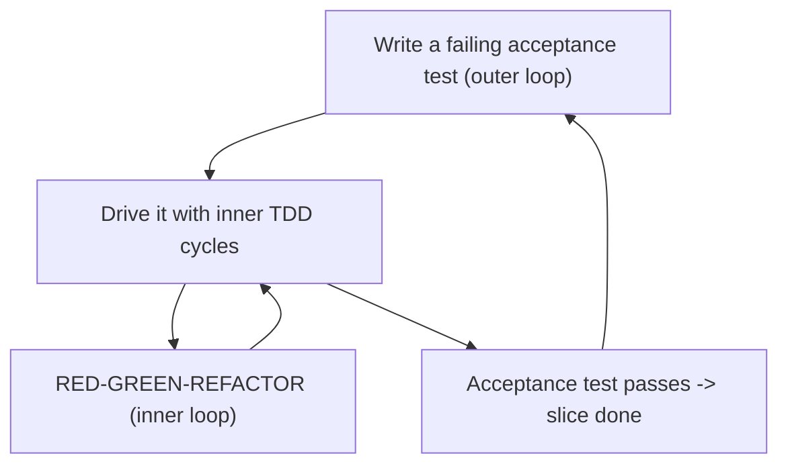
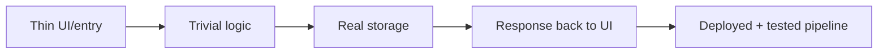
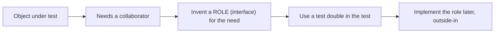
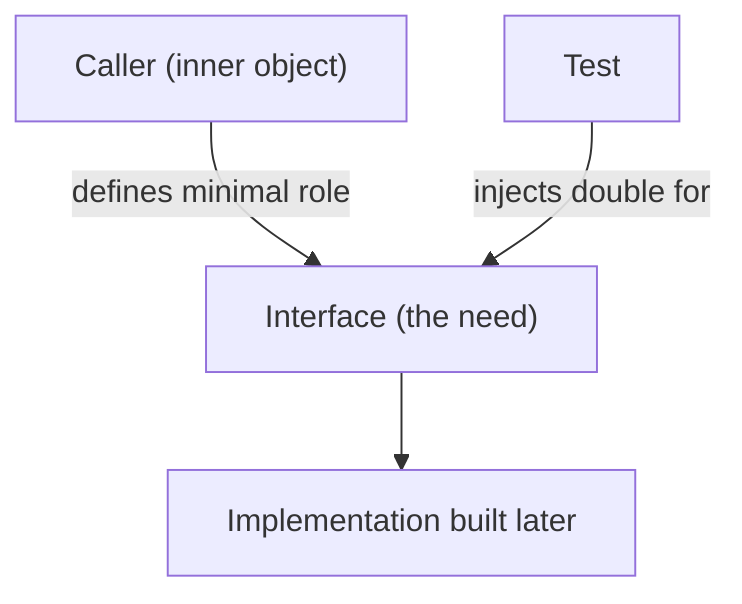
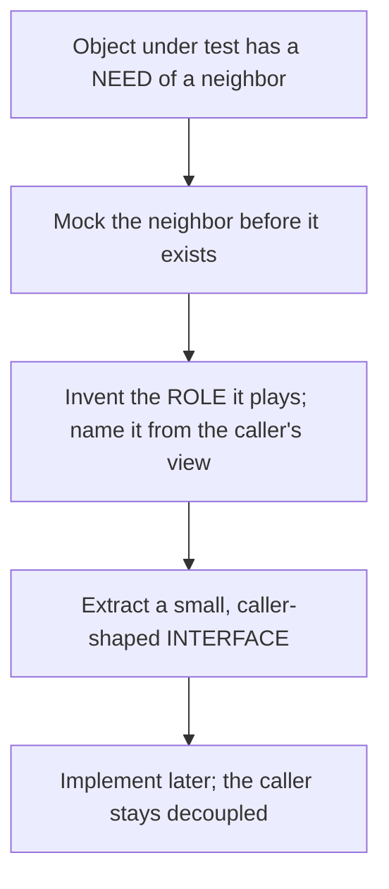
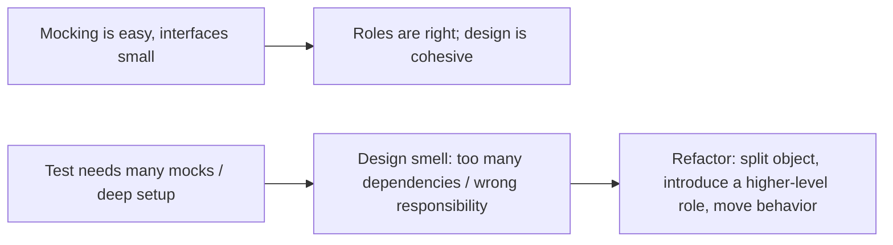

# Outside-In Development - Complete Professional Guide

> **Category:** 04_engineering_and_practices · **Language:** English

---

### Growing software guided by tests, from the outside in
**Original guide written from first principles, current to 2026**

> **Original reference book (English).** This is an **independent, originally written** guide. It is not an extract, summary, or paraphrase of any third-party book; it teaches outside-in, test-guided development from first principles with original examples. Canonical books are listed under **References** as pointers only. Each chapter follows the TO-BRAIN editorial standard (see `FILE_CONVENTIONS.md`).
>
> **Scope notice:** outside-in development grows a system **starting from its outermost behavior** (an end-to-end test) and works inward, letting needs discovered at each layer drive the design of the next. This guide covers the walking skeleton, the double feedback loop, and using test doubles to design collaborations — current to 2026.

---

## How to read this guide

| Level | Profile | Parts |
|-------|---------|-------|
| 1 — Beginner | New to outside-in | Part I |
| 2 — Intermediate | Designing with doubles | Part II |

**Target audience:** developers comfortable with TDD who want it to drive object design, not just verify functions.

**Structure of each chapter:** Introduction · Business context · Theoretical concepts · Architecture · Diagrams (Mermaid) · Real examples · Step by step · Complete examples · Exercises · Challenges · Checklist · Best practices · Anti-patterns · Troubleshooting · References.

> **Note on prerequisites.** Assumes the TDD and unit-testing guides.

---

## Table of Contents

**Part I – Starting outside**
1. The walking skeleton and the double feedback loop
2. Letting tests drive collaborations

**Part II – Designing with doubles**
3. Mocks to discover roles and interfaces

> **Status of this guide:** complete for its declared scope. **Ready:** Parts I–II (Ch. 1–3).

---

## Part I – Starting outside

Outside-in says: don't start with the database or a class you guess you'll need. Start with a **failing end-to-end test** for the thinnest slice of real behavior, then drive inward — each layer's needs reveal the interfaces of the next. This keeps the design honest (everything exists because an outer need demanded it) and integrated from day one.

---

## Chapter 1 — Walking skeleton and double feedback loop

### 1.1 Introduction

A **walking skeleton** is the thinnest possible end-to-end implementation that exercises the real architecture — a trivial feature wired all the way through (UI → logic → storage → back) with deployment and tests in place. You build it first to validate the structure and the build/deploy pipeline before adding real features. The **double feedback loop** then guides growth: an outer acceptance-test loop and an inner unit-test loop.

### 1.2 Business context

Integration and deployment problems discovered late are the most expensive kind. A walking skeleton forces them to the surface on day one — when the system does almost nothing and fixing the pipeline or the architecture is cheap. From then on, each feature is added through working software that's always integrated and deployable, so the project never has a risky "now we wire it all together" phase.

### 1.3 Theoretical concepts: two loops



The **outer loop** is an end-to-end/acceptance test for a feature (failing). To make it pass you run many **inner** unit-test cycles, growing the objects needed. When the acceptance test goes green, the slice is genuinely done — specified, built, and integrated.

### 1.4 Architecture: build the skeleton first



The skeleton touches every layer with the simplest possible behavior, proving the architecture and the path to production exist before any real feature is built on top.

### 1.5 Real example

**Scenario.** A new service to accept and list "todos."

**Problem.** The team is tempted to start with a rich domain model and a database schema, guessing at needs.

**Solution.** A walking skeleton: one endpoint that stores and returns a single hard-coded-shape todo, end to end, deployed.

**Implementation (the slice's acceptance test first).**

```text
Acceptance test (outer loop), initially failing:
  POST /todos {"title":"buy milk"}  -> 201
  GET  /todos                       -> [{"title":"buy milk"}]

Drive inward with unit cycles until it passes:
  - HTTP handler  (inner TDD)
  - TodoService   (inner TDD)
  - TodoStore     (inner TDD, real storage)
Then: deploy the skeleton; pipeline is proven.
```

**Result.** Architecture and deploy path are validated on a trivial slice; every later feature is a new acceptance test driven inward through already-integrated layers.

**Future improvements.** Add the next thinnest slice (e.g. completing a todo) as a new outer-loop test.

### 1.6 Exercises

1. What is a walking skeleton and why build it first?
2. Describe the two loops in the double feedback loop.
3. When is a slice "done" in outside-in?

### 1.7 Challenges

- **Challenge.** For a small new feature, write the end-to-end acceptance test first (let it fail), then drive it inward with unit cycles until it passes.

### 1.8 Checklist

- [ ] I start a system with a deployed walking skeleton.
- [ ] I begin each feature with a failing acceptance test.
- [ ] I drive inward with unit cycles.
- [ ] A slice is done only when its acceptance test passes.

### 1.9 Best practices

- Validate architecture and deployment with a skeleton before features.
- Keep the system integrated and deployable at all times.
- Use the outer test to define "done," inner tests to design.

### 1.10 Anti-patterns

- Building bottom-up (DB first) on guessed needs.
- Deferring integration/deploy until "later."
- Acceptance tests written after the code, as an afterthought.

### 1.11 Troubleshooting

| Symptom | Likely cause | Action |
|---------|--------------|--------|
| Late, painful integration | No walking skeleton | Build and deploy a skeleton first |
| Built layers nobody needed | Bottom-up guessing | Drive from an outer acceptance test |
| "Done" code that isn't wired up | No outer-loop definition of done | Gate done on the acceptance test |

### 1.12 References

- S. Freeman, N. Pryce, *Growing Object-Oriented Software, Guided by Tests* (Addison-Wesley, 2009) — ISBN 978-0321503626.
- A. Cockburn, *Crystal Clear* (Addison-Wesley, 2004), on the walking skeleton idea.

---

## Chapter 2 — Letting tests drive collaborations

### 2.1 Introduction

Outside-in uses tests to design **how objects talk to each other**. When the object you're building needs something it doesn't have, you invent a **role** (an interface) for that need and use a test double to stand in for it. The collaborators and their interfaces emerge from real needs, discovered top-down, rather than being guessed up front.

### 2.2 Business context

Interfaces guessed in advance are usually wrong — too big, too small, or shaped by the implementation rather than the caller. Letting the caller's needs define each interface produces minimal, caller-centric contracts (good encapsulation, easy substitution). This reduces rework and yields a design where dependencies are explicit and the system is naturally testable — lowering long-term change cost.

### 2.3 Theoretical concepts: needs define roles



When building `PlaceOrder` you discover it must save something — so you invent an `Orders` role with just the method it needs, and pass a double in the test. The interface is defined by the **caller's** need, kept minimal. Later you implement that role (driving its own inner cycles).

### 2.4 Architecture: caller-defined interfaces



Because the interface is owned by the caller and shaped to its need, it stays small and stable — the dependency-inversion idea (see the architecture-boundaries guide) discovered organically through tests.

### 2.5 Real example

**Scenario.** `PlaceOrder` needs to persist an order and notify the customer.

**Problem.** You don't yet have (or want to guess) the persistence/notification classes.

**Solution.** Invent minimal roles (`Orders`, `Notifier`) from the caller's needs; drive with doubles.

**Implementation.**

```java
interface Orders   { Order save(Order o); }          // role invented from a need
interface Notifier { void confirm(OrderId id); }      // role invented from a need

@Test void placingAnOrderSavesItAndConfirms() {
    var orders = new InMemoryOrders();                // double standing in for the role
    var notifier = new RecordingNotifier();
    var place = new PlaceOrder(orders, notifier);

    OrderId id = place.handle(newOrder());

    assertTrue(orders.contains(id));                  // observable effects
    assertTrue(notifier.confirmed(id));
}
```

**Result.** `PlaceOrder`'s collaborators and their minimal interfaces emerged from its actual needs; the real `Orders`/`Notifier` are implemented next, outside-in.

**Future improvements.** Implement each role with its own walking inner-loop cycles; keep the interfaces caller-shaped.

### 2.6 Exercises

1. How does outside-in decide what interfaces a collaborator should have?
2. Why are caller-defined interfaces usually better than guessed ones?
3. What role do test doubles play in this design process?

### 2.7 Challenges

- **Challenge.** Build a small object test-first. Each time it needs a collaborator, invent a minimal role and use a double — don't implement the collaborator until the object is done.

### 2.8 Checklist

- [ ] Collaborator interfaces emerge from caller needs.
- [ ] Roles (interfaces) are minimal and caller-shaped.
- [ ] I drive with doubles before implementing collaborators.
- [ ] Dependencies are explicit and injected.

### 2.9 Best practices

- Invent interfaces from the caller's need, not the implementation.
- Keep roles minimal; add methods only when a caller needs them.
- Implement collaborators outside-in, after their callers.

### 2.10 Anti-patterns

- Guessing big interfaces up front, shaped by implementation.
- Mocking concrete classes instead of caller-defined roles.
- Building collaborators before knowing what callers need.

### 2.11 Troubleshooting

| Symptom | Likely cause | Action |
|---------|--------------|--------|
| Interfaces are bloated/awkward | Guessed, implementation-shaped | Let caller needs define them |
| Hard to substitute collaborators | Depending on concretions | Invent roles (interfaces) from needs |
| Built collaborators don't fit callers | Bottom-up build order | Build outside-in |

### 2.12 References

- S. Freeman, N. Pryce, *Growing Object-Oriented Software, Guided by Tests* (Addison-Wesley, 2009) — ISBN 978-0321503626.
- V. Khorikov, *Unit Testing: Principles, Practices, and Patterns* (Manning, 2020) — ISBN 978-1617296277.

---

> **End of Part I.** You can now grow a system outside-in: start with a deployed walking skeleton, drive each feature from a failing acceptance test through inner TDD cycles, and let each object's needs invent minimal, caller-shaped collaborator interfaces discovered with test doubles. **Part II — Designing with doubles** (Chapter 3) goes deeper on using mocks to discover roles, the difference between commands and queries, and avoiding over-mocking.

## Part II – Designing with doubles

Part I grew a system outside-in: a walking skeleton, the double feedback loop, and letting each object's needs invent its collaborators. Part II goes deeper into the *technique* that makes this work — using mock objects not as a testing convenience but as a **design tool**. In Freeman and Pryce's approach, mocking a collaborator before it exists forces you to invent the **role** it plays and name the **interface** for that role, shaped by the caller's needs. This chapter covers that discovery process, the command/query (tell-don't-ask) discipline behind it, the kinds of peers an object talks to, and the warning signs of over-mocking — when the tests are telling you the design is wrong.

---

## Chapter 3 — Mocks to discover roles and interfaces

### 3.1 Introduction

In GOOS, mock objects are a **design tool**, not just a substitute for slow dependencies. When you write the test for an object, you describe what that object must *do*, which means describing what it needs from its neighbors. By mocking those neighbors *before they exist*, you are forced to invent the **role** each one plays and express it as a small **interface** named from the *caller's* point of view. This is **need-driven development**: interfaces are discovered from the needs of their clients, so they end up minimal and exactly caller-shaped, rather than being big "header interfaces" that mirror some concrete class. The discipline that makes the discovered interfaces clean is **"Tell, Don't Ask"** — prefer telling an object to *do* something (a command) over asking it for data and acting on the answer (a query chain) — because command-style messages name the *interaction* explicitly, which is exactly the role you want to capture. Freeman and Pryce also classify the peers an object talks to into three stereotypes — **dependencies** (services it can't work without), **notifications** (peers it tells that something happened, fire-and-forget), and **adjustments** (policies that tune its behavior) — which guides what to mock and what each interface should express.

### 3.2 Business context

Interfaces discovered this way are the seams along which a system stays changeable. Because each interface is small and named for what the *client* needs, collaborators can be swapped, re-implemented, or tested in isolation without disturbing their callers — the same decoupling SOLID's DIP prescribes, arrived at organically through the test. The naming itself has business value: forcing yourself to name the role a collaborator plays ("`PaymentApprover`", "`OrderListener`") teases out domain concepts you'd otherwise leave implicit, sharpening the model. The flip side — and a major source of the brittle, over-mocked test suites teams complain about — is *not listening* to the design feedback. When a test needs a tangle of mocks to set up, that pain is signal, not noise: the object under test has too many dependencies or the wrong responsibilities. Heeding it early keeps both the tests and the design healthy; ignoring it produces exactly the fragile, mock-heavy suite that gives mocking a bad name.

### 3.3 Theoretical concepts: needs become roles become interfaces



The core mechanism is **discovery by need**. You don't design a collaborator's interface up front and then call it; you write the call you *wish* you could make, mock the recipient, and let that expectation define the interface. Because the interface exists to serve this caller, it stays small and cohesive. **"Tell, Don't Ask"** keeps the discovered messages command-shaped — you express *what should happen*, not *what data to fetch* — which both hides the collaborator's internals and makes the interaction (the role) explicit and nameable. The three **peer stereotypes** tell you what kind of interface you're discovering: a **dependency** must be passed in (constructor), a **notification** is something you tell without caring about a result, and an **adjustment** is a policy/strategy that configures behavior. Matching the mock to the stereotype keeps the design honest — you mock dependencies and notifications (roles you own), but you don't mock **values** or types you don't own.

### 3.4 Architecture: listen to the tests



GOOS's distinctive claim is that **the tests talk back about the design** — "listening to the tests." Mocks are the loudest channel. If mocking is straightforward and the interfaces you discover are small and well-named, the design is healthy. If a test requires many mocks, deep nested setup, or expectations on objects two hops away (mocking a thing to get a thing to get a thing), that friction is a *design* smell: the object under test probably has too many responsibilities, depends on too much, or is reaching through its neighbors instead of telling them what to do. The architectural response is to refactor toward the design the test is asking for — split the object, introduce a new intermediary role, or move behavior closer to the data — not to push through with a more elaborate mock setup. Also avoid **over-specification**: assert only the interactions that matter to the behavior under test, or the test ossifies the implementation.

### 3.5 Real example

**Scenario.** Outside-in, you're building an `OrderProcessor` that must charge a payment, save the order, and let interested parties know it shipped.

**Problem.** None of the collaborators exist yet, and it's tempting to ask each one for data and orchestrate everything inside `OrderProcessor` (an "ask"-heavy god object), which would couple it to every collaborator's internals.

**Solution.** Write the test as a set of *commands* to mocked neighbors, letting each expectation **discover a small role**. Classify each peer: `PaymentService` is a **dependency**, `OrderRepository` a **dependency**, and `ShipmentListener` a **notification**. Name each interface from the caller's need.

**Implementation.**

```java
@Test void processing_an_order_charges_saves_and_notifies() {
    PaymentService payments = mock(PaymentService.class);    // dependency (role discovered)
    OrderRepository orders  = mock(OrderRepository.class);   // dependency
    ShipmentListener shipped = mock(ShipmentListener.class); // notification (tell, don't ask)
    var processor = new OrderProcessor(payments, orders, shipped);

    processor.process(anOrder());

    verify(payments).charge(anOrder());        // TELL: a command, names the interaction
    verify(orders).save(anOrder());            // small, caller-shaped interface
    verify(shipped).onShipped(anOrder());      // fire-and-forget notification
    // NOTE: no deep mock-returning-mock setup. If we needed that, the design would be wrong.
}

// The interfaces FALL OUT of the test — each tiny and named for what OrderProcessor needs:
interface PaymentService  { void charge(Order o); }
interface OrderRepository { void save(Order o); }
interface ShipmentListener{ void onShipped(Order o); }
```

**Result.** Three minimal, role-named interfaces emerged from the caller's needs; `OrderProcessor` is decoupled from every implementation and trivially testable. The command-style messages named the interactions, and the absence of deep mock setup confirms the responsibilities sit in the right place.

**Future improvements.** Implement each role with a real adapter (a real payment gateway, a DB repository, an email notifier) behind the discovered interface. If a future test starts needing layered mocks, treat it as a prompt to introduce a new intermediary role rather than to grow the setup — keep listening to the tests.

### 3.6 Exercises

1. Explain how mocking a not-yet-existing collaborator helps you *discover* an interface.
2. Why does "Tell, Don't Ask" produce cleaner discovered roles than asking for data?
3. Name GOOS's three peer stereotypes and what each implies about how you wire and mock it.
4. What design problem is a test that needs many mocks or deep setup signaling?

### 3.7 Challenges

- **Challenge.** Build a small orchestrating object outside-in. For each thing it must do, write the command you wish you could send, mock the recipient, and let the expectation define a small interface named from the caller's view. Classify each peer as dependency, notification, or adjustment. Then deliberately give the object one extra responsibility and watch the mock setup grow — that growth is the test telling you to refactor.

### 3.8 Checklist

- [ ] I discover interfaces from the caller's needs, not by mirroring concrete classes.
- [ ] Discovered interfaces are small and named from the client's point of view.
- [ ] I prefer command-style messages (Tell, Don't Ask) so interactions are explicit.
- [ ] I classify peers as dependencies, notifications, or adjustments and mock accordingly.
- [ ] I treat heavy mock setup as a design smell and refactor instead of pushing through.

### 3.9 Best practices

- Mock only types you own (roles), never values or third-party types directly.
- Name each discovered role for the relationship it captures, surfacing domain concepts.
- Assert only the interactions that matter to the behavior; avoid over-specification.
- Listen to the tests: let mocking friction drive design improvements.

### 3.10 Anti-patterns

- "Header interfaces" that mirror a concrete class one-to-one (no real role discovery).
- Ask-heavy orchestration reaching through neighbors' getters (violating Tell, Don't Ask).
- Mocks returning mocks returning mocks (deep setup) instead of fixing responsibilities.
- Over-specified tests asserting every incidental interaction, ossifying the implementation.

### 3.11 Troubleshooting

| Symptom | Likely cause | Action |
|---------|--------------|--------|
| Discovered interface is huge | Mirroring a concrete class, not a role | Re-derive from the single caller's actual needs |
| Test setup mocks chains of objects | Object reaches through neighbors / too many deps | Apply Tell, Don't Ask; split responsibilities |
| Tests break on harmless refactors | Over-specified interaction assertions | Assert only the interactions that define the behavior |
| Unsure whether to mock something | Peer stereotype unclear | Classify it: dependency/notification = mock; value = don't |

### 3.12 References

- S. Freeman, N. Pryce, *Growing Object-Oriented Software, Guided by Tests* (Addison-Wesley, 2010) — ch. 2 "Test-Driven Development with Objects" (Follow the Messages, Tell Don't Ask, mock objects), ch. 6 "Object-Oriented Style" (Object Peer Stereotypes, Internals vs. Peers), ch. 7 "Achieving Object-Oriented Design" (need-driven, interface discovery), ch. 20 "Listening to the Tests" — ISBN 978-0321503626.
- M. Fowler, "Mocks Aren't Stubs" (2007) — the classical vs. mockist framing.

---

> **End of Part II.** You can now use mocks as a *design* tool the GOOS way: mocking a not-yet-existing collaborator forces you to **discover the role it plays and name a small, caller-shaped interface** for it — need-driven development that yields decoupled seams and sharper domain concepts. **"Tell, Don't Ask"** keeps the discovered messages command-shaped so interactions are explicit, and the **peer stereotypes** (dependencies, notifications, adjustments) guide what to mock. Above all, **listen to the tests**: easy mocking means the roles are right, while heavy mock setup is the design asking to be refactored — not a reason for a bigger mock.
