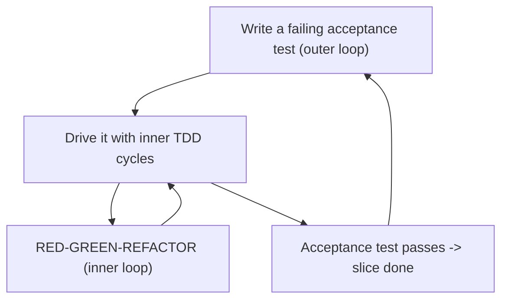
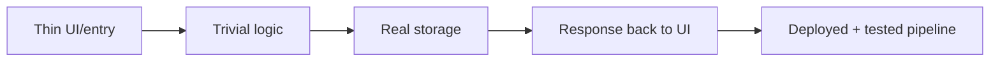
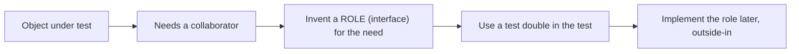
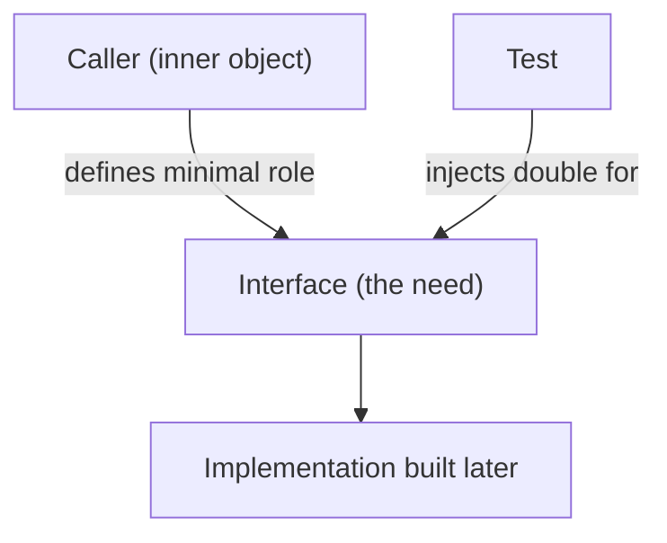

# Outside-In Development - Complete Professional Guide

> **Category:** 04_engineering_and_practices · **Language:** English

---

### Growing software guided by tests, from the outside in
**Original guide written from first principles, current to 2026**

> **Original reference book (English).** This is an **independent, originally written** guide. It is not an extract, summary, or paraphrase of any third-party book; it teaches outside-in, test-guided development from first principles with original examples. Canonical books are listed under **References** as pointers only. Each chapter follows the TO-BRAIN editorial standard (see `FILE_CONVENTIONS.md`).
>
> **Scope notice:** outside-in development grows a system **starting from its outermost behavior** (an end-to-end test) and works inward, letting needs discovered at each layer drive the design of the next. This guide covers the walking skeleton, the double feedback loop, and using test doubles to design collaborations — current to 2026.

---

## How to read this guide

| Level | Profile | Parts |
|-------|---------|-------|
| 1 — Beginner | New to outside-in | Part I |
| 2 — Intermediate | Designing with doubles | Part II |

**Target audience:** developers comfortable with TDD who want it to drive object design, not just verify functions.

**Structure of each chapter:** Introduction · Business context · Theoretical concepts · Architecture · Diagrams (Mermaid) · Real examples · Step by step · Complete examples · Exercises · Challenges · Checklist · Best practices · Anti-patterns · Troubleshooting · References.

> **Note on prerequisites.** Assumes the TDD and unit-testing guides.

---

## Table of Contents

**Part I – Starting outside**
1. The walking skeleton and the double feedback loop
2. Letting tests drive collaborations

**Part II – Designing with doubles**
3. Mocks to discover roles and interfaces

> **Status of this guide:** phased delivery. **Ready:** Part I (Ch. 1–2). **In progress:** Part II.

---

## Part I – Starting outside

Outside-in says: don't start with the database or a class you guess you'll need. Start with a **failing end-to-end test** for the thinnest slice of real behavior, then drive inward — each layer's needs reveal the interfaces of the next. This keeps the design honest (everything exists because an outer need demanded it) and integrated from day one.

---

## Chapter 1 — Walking skeleton and double feedback loop

### 1.1 Introduction

A **walking skeleton** is the thinnest possible end-to-end implementation that exercises the real architecture — a trivial feature wired all the way through (UI → logic → storage → back) with deployment and tests in place. You build it first to validate the structure and the build/deploy pipeline before adding real features. The **double feedback loop** then guides growth: an outer acceptance-test loop and an inner unit-test loop.

### 1.2 Business context

Integration and deployment problems discovered late are the most expensive kind. A walking skeleton forces them to the surface on day one — when the system does almost nothing and fixing the pipeline or the architecture is cheap. From then on, each feature is added through working software that's always integrated and deployable, so the project never has a risky "now we wire it all together" phase.

### 1.3 Theoretical concepts: two loops



The **outer loop** is an end-to-end/acceptance test for a feature (failing). To make it pass you run many **inner** unit-test cycles, growing the objects needed. When the acceptance test goes green, the slice is genuinely done — specified, built, and integrated.

### 1.4 Architecture: build the skeleton first



The skeleton touches every layer with the simplest possible behavior, proving the architecture and the path to production exist before any real feature is built on top.

### 1.5 Real example

**Scenario.** A new service to accept and list "todos."

**Problem.** The team is tempted to start with a rich domain model and a database schema, guessing at needs.

**Solution.** A walking skeleton: one endpoint that stores and returns a single hard-coded-shape todo, end to end, deployed.

**Implementation (the slice's acceptance test first).**

```text
Acceptance test (outer loop), initially failing:
  POST /todos {"title":"buy milk"}  -> 201
  GET  /todos                       -> [{"title":"buy milk"}]

Drive inward with unit cycles until it passes:
  - HTTP handler  (inner TDD)
  - TodoService   (inner TDD)
  - TodoStore     (inner TDD, real storage)
Then: deploy the skeleton; pipeline is proven.
```

**Result.** Architecture and deploy path are validated on a trivial slice; every later feature is a new acceptance test driven inward through already-integrated layers.

**Future improvements.** Add the next thinnest slice (e.g. completing a todo) as a new outer-loop test.

### 1.6 Exercises

1. What is a walking skeleton and why build it first?
2. Describe the two loops in the double feedback loop.
3. When is a slice "done" in outside-in?

### 1.7 Challenges

- **Challenge.** For a small new feature, write the end-to-end acceptance test first (let it fail), then drive it inward with unit cycles until it passes.

### 1.8 Checklist

- [ ] I start a system with a deployed walking skeleton.
- [ ] I begin each feature with a failing acceptance test.
- [ ] I drive inward with unit cycles.
- [ ] A slice is done only when its acceptance test passes.

### 1.9 Best practices

- Validate architecture and deployment with a skeleton before features.
- Keep the system integrated and deployable at all times.
- Use the outer test to define "done," inner tests to design.

### 1.10 Anti-patterns

- Building bottom-up (DB first) on guessed needs.
- Deferring integration/deploy until "later."
- Acceptance tests written after the code, as an afterthought.

### 1.11 Troubleshooting

| Symptom | Likely cause | Action |
|---------|--------------|--------|
| Late, painful integration | No walking skeleton | Build and deploy a skeleton first |
| Built layers nobody needed | Bottom-up guessing | Drive from an outer acceptance test |
| "Done" code that isn't wired up | No outer-loop definition of done | Gate done on the acceptance test |

### 1.12 References

- S. Freeman, N. Pryce, *Growing Object-Oriented Software, Guided by Tests* (Addison-Wesley, 2009) — ISBN 978-0321503626.
- A. Cockburn, *Crystal Clear* (Addison-Wesley, 2004), on the walking skeleton idea.

---

## Chapter 2 — Letting tests drive collaborations

### 2.1 Introduction

Outside-in uses tests to design **how objects talk to each other**. When the object you're building needs something it doesn't have, you invent a **role** (an interface) for that need and use a test double to stand in for it. The collaborators and their interfaces emerge from real needs, discovered top-down, rather than being guessed up front.

### 2.2 Business context

Interfaces guessed in advance are usually wrong — too big, too small, or shaped by the implementation rather than the caller. Letting the caller's needs define each interface produces minimal, caller-centric contracts (good encapsulation, easy substitution). This reduces rework and yields a design where dependencies are explicit and the system is naturally testable — lowering long-term change cost.

### 2.3 Theoretical concepts: needs define roles



When building `PlaceOrder` you discover it must save something — so you invent an `Orders` role with just the method it needs, and pass a double in the test. The interface is defined by the **caller's** need, kept minimal. Later you implement that role (driving its own inner cycles).

### 2.4 Architecture: caller-defined interfaces



Because the interface is owned by the caller and shaped to its need, it stays small and stable — the dependency-inversion idea (see the architecture-boundaries guide) discovered organically through tests.

### 2.5 Real example

**Scenario.** `PlaceOrder` needs to persist an order and notify the customer.

**Problem.** You don't yet have (or want to guess) the persistence/notification classes.

**Solution.** Invent minimal roles (`Orders`, `Notifier`) from the caller's needs; drive with doubles.

**Implementation.**

```java
interface Orders   { Order save(Order o); }          // role invented from a need
interface Notifier { void confirm(OrderId id); }      // role invented from a need

@Test void placingAnOrderSavesItAndConfirms() {
    var orders = new InMemoryOrders();                // double standing in for the role
    var notifier = new RecordingNotifier();
    var place = new PlaceOrder(orders, notifier);

    OrderId id = place.handle(newOrder());

    assertTrue(orders.contains(id));                  // observable effects
    assertTrue(notifier.confirmed(id));
}
```

**Result.** `PlaceOrder`'s collaborators and their minimal interfaces emerged from its actual needs; the real `Orders`/`Notifier` are implemented next, outside-in.

**Future improvements.** Implement each role with its own walking inner-loop cycles; keep the interfaces caller-shaped.

### 2.6 Exercises

1. How does outside-in decide what interfaces a collaborator should have?
2. Why are caller-defined interfaces usually better than guessed ones?
3. What role do test doubles play in this design process?

### 2.7 Challenges

- **Challenge.** Build a small object test-first. Each time it needs a collaborator, invent a minimal role and use a double — don't implement the collaborator until the object is done.

### 2.8 Checklist

- [ ] Collaborator interfaces emerge from caller needs.
- [ ] Roles (interfaces) are minimal and caller-shaped.
- [ ] I drive with doubles before implementing collaborators.
- [ ] Dependencies are explicit and injected.

### 2.9 Best practices

- Invent interfaces from the caller's need, not the implementation.
- Keep roles minimal; add methods only when a caller needs them.
- Implement collaborators outside-in, after their callers.

### 2.10 Anti-patterns

- Guessing big interfaces up front, shaped by implementation.
- Mocking concrete classes instead of caller-defined roles.
- Building collaborators before knowing what callers need.

### 2.11 Troubleshooting

| Symptom | Likely cause | Action |
|---------|--------------|--------|
| Interfaces are bloated/awkward | Guessed, implementation-shaped | Let caller needs define them |
| Hard to substitute collaborators | Depending on concretions | Invent roles (interfaces) from needs |
| Built collaborators don't fit callers | Bottom-up build order | Build outside-in |

### 2.12 References

- S. Freeman, N. Pryce, *Growing Object-Oriented Software, Guided by Tests* (Addison-Wesley, 2009) — ISBN 978-0321503626.
- V. Khorikov, *Unit Testing: Principles, Practices, and Patterns* (Manning, 2020) — ISBN 978-1617296277.

---

> **End of Part I.** You can now grow a system outside-in: start with a deployed walking skeleton, drive each feature from a failing acceptance test through inner TDD cycles, and let each object's needs invent minimal, caller-shaped collaborator interfaces discovered with test doubles. **Part II — Designing with doubles** (Chapter 3) goes deeper on using mocks to discover roles, the difference between commands and queries, and avoiding over-mocking.

<!--APPEND-PART-II-->
