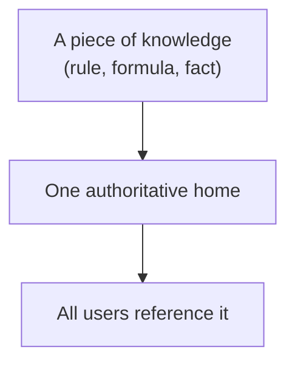
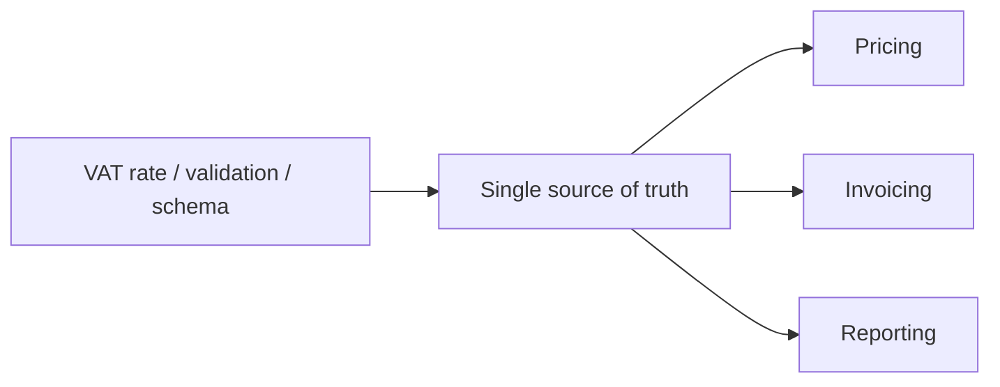
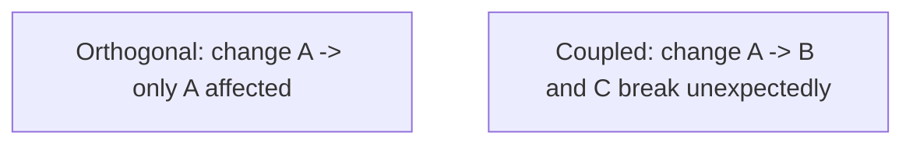
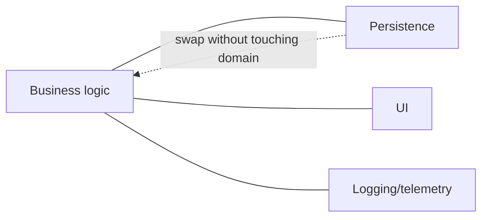
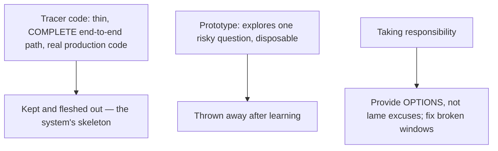
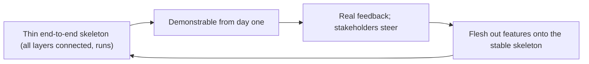

# Pragmatic Programming Practices - Complete Professional Guide

> **Category:** 04_engineering_and_practices · **Language:** English

---

### DRY, orthogonality, tracer bullets, and pragmatic habits
**Original guide written from first principles, current to 2026**

> **Original reference book (English).** This is an **independent, originally written** guide. It is not an extract, summary, or paraphrase of any third-party book; it teaches pragmatic engineering habits from first principles with original examples. Canonical books are listed under **References** as pointers only. Each chapter follows the TO-BRAIN editorial standard (see `FILE_CONVENTIONS.md`).
>
> **Scope notice:** "pragmatic" engineering is a set of pragmatic, durable habits — avoiding duplication, keeping things independent, building thin end-to-end first, and taking responsibility for your craft. This guide covers the most load-bearing of those habits, current to 2026.

---

## How to read this guide

| Level | Profile | Parts |
|-------|---------|-------|
| 1 — Beginner | Building good habits | Part I |
| 2 — Intermediate | Applying judgment | Part II |

**Target audience:** developers of any level who want durable, principle-based habits rather than rote rules.

**Structure of each chapter:** Introduction · Business context · Theoretical concepts · Architecture · Diagrams (Mermaid) · Real examples · Step by step · Complete examples · Exercises · Challenges · Checklist · Best practices · Anti-patterns · Troubleshooting · References.

> **Note on prerequisites.** Assumes general development experience. Language-neutral.

---

## Table of Contents

**Part I – Core habits**
1. DRY: every piece of knowledge has one home
2. Orthogonality: keep things independent

**Part II – Delivery habits**
3. Tracer bullets and taking responsibility

> **Status of this guide:** complete for its declared scope. **Ready:** Parts I–II (Ch. 1–3).

---

## Part I – Core habits

Beneath specific techniques are a few principles that, applied consistently, keep a codebase healthy: **don't repeat knowledge**, and **keep components independent**. They sound simple but are violated constantly, and most maintenance pain traces back to one of them.

---

## Chapter 1 — DRY: one home for each piece of knowledge

### 1.1 Introduction

**DRY — Don't Repeat Yourself** — states that every piece of *knowledge* should have a single, unambiguous, authoritative representation in the system. It is about knowledge, not just code text: the same business rule, formula, or fact should live in exactly one place, so changing it means changing one thing.

### 1.2 Business context

Duplicated knowledge is a maintenance time bomb: when a rule changes, you must find and update every copy, and the one you miss becomes a bug. DRY localizes change — update one place, the whole system is consistent. This is one of the highest-leverage habits for keeping change cheap and avoiding the subtle "we fixed it in three of four places" defects that erode trust in a system.

### 1.3 Theoretical concepts: knowledge, not text



DRY is about **knowledge duplication**, which isn't always textual. Two functions with identical code may be a coincidence (don't force them together); two places encoding the same *rule* with different code are a DRY violation. The test: "if this fact changed, how many places must I edit?" More than one means duplicated knowledge.

### 1.4 Architecture: single source of truth



Give each fact one home and have everything derive from it. Code generation, shared constants, and schema-driven validation are all ways to keep one source of truth feeding many consumers.

### 1.5 Real example

**Scenario.** A validation rule (max username length 30) appears in the frontend, the API, and the database.

**Problem.** Someone changes it to 40 in two of three places; the third rejects valid input — a confusing bug.

**Solution.** One authoritative definition the others derive from.

**Implementation (single source).**

```text
# One definition, consumed everywhere (config/schema/shared module)
USERNAME_MAX = 30

frontend validation  -> reads USERNAME_MAX
API validation       -> reads USERNAME_MAX
DB constraint        -> generated from USERNAME_MAX
```

**Result.** Changing the limit is one edit; all layers stay consistent by construction — the "missed the third place" bug becomes impossible.

**Future improvements.** Generate the DB constraint and client validation from the shared schema in the build so they can't drift.

### 1.6 Exercises

1. State DRY precisely — what is not repeated?
2. Why is identical code not always a DRY violation?
3. What's the test for whether knowledge is duplicated?

### 1.7 Challenges

- **Challenge.** Find a business rule that lives in two places. Give it one home and have both derive from it. Change it once and verify both update.

### 1.8 Checklist

- [ ] Each piece of knowledge has one authoritative home.
- [ ] Changing a fact means editing one place.
- [ ] I distinguish knowledge duplication from coincidental code similarity.
- [ ] Derived artifacts come from a single source.

### 1.9 Best practices

- Ask "how many places change if this fact changes?" — drive it to one.
- Generate derived representations from a single source.
- Don't force unrelated identical code together (that's not DRY).

### 1.10 Anti-patterns

- The same rule encoded in several layers by hand.
- Over-DRYing coincidental duplication into a wrong abstraction.
- Copy-paste-and-tweak of business logic.

### 1.11 Troubleshooting

| Symptom | Likely cause | Action |
|---------|--------------|--------|
| "Fixed it but it's still wrong elsewhere" | Duplicated knowledge | Consolidate to one source of truth |
| Layers disagree on a rule | Hand-copied logic | Derive all from one definition |
| Wrong abstraction from forced reuse | Over-DRY | Allow coincidental duplication to differ |

### 1.12 References

- A. Hunt, D. Thomas, *The Pragmatic Programmer*, 20th Anniversary ed. (Addison-Wesley, 2019) — ISBN 978-0135957059.

---

## Chapter 2 — Orthogonality: keep things independent

### 2.1 Introduction

**Orthogonality** means components are **independent**: changing one doesn't affect unrelated others. Two orthogonal modules each do their own job without reaching into the other's concerns. Orthogonal systems are easier to change, test, and reason about, because effects stay local — a change has a small, predictable blast radius.

### 2.2 Business context

In a non-orthogonal system, every change risks unexpected breakage somewhere unrelated, so changes are slow and scary and testing must cover huge surface area. Orthogonality shrinks the blast radius of change, making the system safer and cheaper to evolve and enabling parallel work (teams touch independent parts without colliding). It's a direct multiplier on delivery speed and reliability.

### 2.3 Theoretical concepts: independence and locality



Signs of orthogonality: you can describe each module's job in one sentence without "and also"; a change to one concern (say, logging) doesn't touch business logic; swapping one component (a database, a UI) doesn't ripple. It's the same goal as low coupling and separation of concerns, viewed as independence of change.

### 2.4 Architecture: separate concerns into independent parts



Keep distinct concerns in distinct, decoupled components so each can change or be replaced independently — the practical realization of the boundaries and layering ideas elsewhere in this library.

### 2.5 Real example

**Scenario.** Business logic for orders directly calls a specific logging library throughout.

**Problem.** Switching logging frameworks, or testing the logic, means touching business code everywhere — non-orthogonal.

**Solution.** Depend on a small logging abstraction so logging and business logic vary independently.

**Implementation.**

```java
// COUPLED: business code tied to a concrete logger everywhere
SpecificLogger.getInstance().log("order placed " + id);   // ripples on any change

// ORTHOGONAL: depend on a tiny abstraction; logging changes don't touch logic
interface AuditLog { void placed(OrderId id); }
class PlaceOrder {
    private final AuditLog audit;
    void handle(...) { /* ...logic... */ audit.placed(id); }   // logic unaware of the lib
}
```

**Result.** Logging implementation can change (or be faked in tests) without touching order logic; the two concerns are independent.

**Future improvements.** Apply the same separation to other cross-cutting concerns (metrics, config) so each varies on its own.

### 2.6 Exercises

1. Define orthogonality in terms of change.
2. Give two signs a system is orthogonal.
3. How does orthogonality relate to coupling and separation of concerns?

### 2.7 Challenges

- **Challenge.** Find a cross-cutting concern (logging, config, time) woven through business logic. Extract it behind an abstraction and confirm the logic no longer changes when the concern does.

### 2.8 Checklist

- [ ] Each component has one clear, independent job.
- [ ] A change to one concern doesn't ripple into others.
- [ ] Components can be swapped or tested in isolation.
- [ ] Cross-cutting concerns are separated from business logic.

### 2.9 Best practices

- Separate concerns into independently changeable components.
- Hide cross-cutting concerns behind small abstractions.
- Aim for a small, predictable blast radius per change.

### 2.10 Anti-patterns

- Business logic laced with concrete infrastructure calls.
- Modules whose job needs an "and also" to describe.
- Changes that mysteriously break unrelated features.

### 2.11 Troubleshooting

| Symptom | Likely cause | Action |
|---------|--------------|--------|
| Unrelated features break on a change | Hidden coupling | Decouple concerns; restore orthogonality |
| Swapping a component touches everything | Non-orthogonal dependency | Hide it behind an abstraction |
| Hard to test logic in isolation | Concerns intertwined | Separate cross-cutting concerns |

### 2.12 References

- A. Hunt, D. Thomas, *The Pragmatic Programmer*, 20th Anniversary ed. (Addison-Wesley, 2019) — ISBN 978-0135957059.
- D. Parnas, "On the Criteria To Be Used in Decomposing Systems into Modules" (CACM, 1972).

---

> **End of Part I.** You can now apply two load-bearing habits: keep each piece of knowledge in one authoritative home (DRY, judged by knowledge not text), and keep components independent so changes stay local (orthogonality). **Part II — Delivery habits** (Chapter 3) covers tracer-bullet development for building thin end-to-end early, and taking pragmatic responsibility for your craft and your code's quality.

## Part II – Delivery habits

Part I covered two structural habits — DRY and orthogonality — that shape *how code is organized*. Part II covers two habits that shape *how you deliver and how you carry yourself*. **Tracer bullet development** is a strategy for building something real, end-to-end, early, so you get feedback under live conditions instead of guessing in the dark. **Taking responsibility** is the professional attitude underneath all the practices: owning your work, providing options instead of excuses, and refusing to let quality rot. One is about method, the other about character; Hunt and Thomas treat both as core to being a pragmatic programmer.

---

## Chapter 3 — Tracer bullets and taking responsibility

### 3.1 Introduction

**Tracer bullet development** takes its name from tracer ammunition: rather than calculating trajectories in the dark, gunners fire rounds that glow so they can *see* where they hit and adjust in real time. The software analogue is to build a **thin but complete path through every layer of the system** — UI to API to domain to database — that actually runs, then flesh it out incrementally. The tracer code is lean but it is *real, production-bound code*, not throwaway: it becomes the skeleton the finished system grows on. This is the crucial distinction from a **prototype**, which generates *disposable* code to explore one risky question and is then discarded. Tracer code answers "are all these pieces connected and aimed right?"; a prototype answers "is this idea viable?" — and you throw the prototype away. The second habit, **taking responsibility**, is the attitude from "The Cat Ate My Source Code": a pragmatic programmer takes responsibility for their work and, when something goes wrong, **provides options rather than lame excuses**, and won't tolerate the "broken windows" of neglected quality.

### 3.2 Business context

Both habits attack the same business risk: late, expensive discovery of problems. Big-bang integration — building each layer fully in isolation and connecting them at the end — is where projects famously die, because every interface mismatch and wrong assumption surfaces at once, under deadline. Tracer bullets de-risk this by integrating *first*: you have a running, demonstrable system from week one, stakeholders can see and steer it, and the team has a stable platform to add features onto rather than a cliff to integrate against at the end. That visible progress also builds trust and tightens the feedback loop with the business. **Taking responsibility** is the human side of delivery risk: teams that own outcomes and surface problems early (with options) recover; teams that deflect blame and let small quality lapses accumulate ("broken windows") slide into the entropy that makes systems unmaintainable. The business value is a project that stays steerable and a team that stays trustworthy — both of which compound over a product's life.

### 3.3 Theoretical concepts: tracer code vs prototype; options vs excuses



Two conceptual pairs anchor the chapter. First, **tracer code vs prototype**: both are built early and cheaply, but tracer code is *lean and permanent* (it runs end-to-end and stays in the product), while a prototype is *exploratory and disposable* (its only product is the lesson learned). Confusing them is dangerous — shipping a prototype as if it were tracer code lands brittle throwaway code in production; treating tracer code as throwaway discards a working skeleton. Second, **options vs excuses**: when you accept responsibility for an outcome, you accept accountability — and when something fails, the professional move is not "the cat ate my source code" but "here are three ways forward." Underpinning both is the refusal to tolerate **broken windows** (Topic 3, Software Entropy): small, unrepaired quality problems signal that no one cares and accelerate decay, so a responsible programmer fixes them promptly.

### 3.4 Architecture: integrate first, then grow



The architectural strategy tracer bullets imply is **integrate first, then grow** — the inverse of build-each-layer-then-integrate. You stand up the smallest possible path that touches every component and actually works (even if each component does almost nothing), so integration is solved *before* the system is large, when it's cheap. From then on, every feature is added to a system that already runs and is already integrated, so feedback is continuous and progress is always demonstrable. This is the same idea the outside-in/GOOS guide calls a *walking skeleton* — Hunt and Thomas arrive at it from the angle of feedback and risk: in an unfamiliar problem space, the fastest way to learn whether your aim is true is to fire a real round and watch where it lands.

### 3.5 Real example

**Scenario.** A team must build a new search feature spanning a web UI, an API, a query service, and a search index. The plan is to build each layer fully, then integrate at the end.

**Problem.** Nobody knows yet whether the four layers will connect cleanly — auth, serialization, the index's query model are all unknowns. Building each in isolation defers every integration risk to the worst possible moment, and produces no demonstrable progress for weeks.

**Solution.** Fire a **tracer bullet**: build the thinnest possible end-to-end path — type a query in the UI, hit the API, run one hardcoded query against the index, render one result — that *actually works* in the real environment. Then flesh it out. Keep any genuinely exploratory bits (e.g. trying an unfamiliar ranking algorithm) as separate, **disposable prototypes**.

**Implementation.**

```text
TRACER (kept, production code) — thin but complete, runs end-to-end:
  UI: a search box that POSTs one query
   -> API: one real endpoint, real auth, real serialization
    -> query service: builds ONE simple query (no ranking yet)
     -> index: returns real hits
    <- render ONE result in the real UI
  => All four layers connected and proven on day 3. Now add: ranking, paging, filters...

PROTOTYPE (throwaway) — explore ONE risky question, then discard:
  a scratch script trying 3 ranking algorithms on sample data -> pick one -> delete the script
```

**Result.** Integration risk is retired in days, not deferred to crunch time; the team demos a working (if minimal) search from day three and adds features onto a stable, already-integrated skeleton. The throwaway prototype answers the ranking question without polluting the production code.

**Future improvements.** Keep firing tracer bullets for each new risky integration (a new external service, a new data source) before committing to it, and stay disciplined about the tracer/prototype line — never let a prototype's exploratory code quietly become production by accident. Fix broken windows as they appear so the growing skeleton doesn't accumulate entropy.

### 3.6 Exercises

1. Explain the tracer-ammunition analogy and what "firing in the dark" means for software.
2. State the key difference between tracer code and a prototype, and the risk of confusing them.
3. Why does integrating first (a thin end-to-end path) reduce project risk versus integrating last?
4. What does "provide options, not excuses" mean, and how does it relate to taking responsibility?

### 3.7 Challenges

- **Challenge.** For a feature spanning at least three layers, build a tracer bullet: the thinnest path that runs end-to-end in the real environment, kept as production code. Separately, identify one genuinely uncertain question and answer it with a disposable prototype you then delete. Reflect: what integration surprise did the tracer reveal that a build-then-integrate plan would have hit much later?

### 3.8 Checklist

- [ ] I build a thin, complete end-to-end path early and keep it as the skeleton.
- [ ] I distinguish tracer code (kept) from prototypes (disposable) and never confuse them.
- [ ] I integrate first and add features onto a running system.
- [ ] I take responsibility for outcomes and provide options when things go wrong.
- [ ] I fix "broken windows" (small quality lapses) promptly.

### 3.9 Best practices

- Fire a tracer bullet through every new risky integration before committing to it.
- Keep tracer code lean but real; it is the system's growing skeleton.
- Use prototypes to answer one risky question, then throw the code away.
- When you make a mistake, admit it and bring options, not excuses.

### 3.10 Anti-patterns

- Build-each-layer-then-integrate (big-bang integration deferring all risk to the end).
- Shipping prototype (throwaway) code into production as if it were tracer code.
- Treating tracer code as disposable and discarding a working skeleton.
- Deflecting blame ("the cat ate my source code") and tolerating broken windows.

### 3.11 Troubleshooting

| Symptom | Likely cause | Action |
|---------|--------------|--------|
| Integration breaks badly near the deadline | Layers built in isolation, integrated last | Fire a tracer bullet to integrate end-to-end early |
| Brittle exploratory code now in production | A prototype was promoted instead of discarded | Rebuild as tracer/production code; keep prototypes throwaway |
| No demonstrable progress for weeks | No running end-to-end path | Stand up a thin skeleton that actually runs |
| Quality slowly rotting | Broken windows tolerated | Fix small lapses promptly; own the outcome |

### 3.12 References

- D. Thomas, A. Hunt, *The Pragmatic Programmer: Your Journey to Mastery*, 20th Anniversary Edition (Addison-Wesley, 2019) — Topic 12 "Tracer Bullets", Topic 13 "Prototypes and Post-it Notes", Topic 2 "The Cat Ate My Source Code" (taking responsibility), Topic 3 "Software Entropy" (broken windows) — ISBN 978-0135957059.

---

> **End of Part II.** You can now apply two delivery habits. **Tracer bullet development** builds a thin but complete, *real* path through every layer early — integrating first and growing features onto a running skeleton — so risk is retired and progress is demonstrable from day one; it is distinct from a **prototype**, which is disposable code that answers one risky question and is then thrown away. **Taking responsibility** is the attitude beneath the craft: own your outcomes, provide options instead of excuses, and fix broken windows before they spread. Method and character together — aim with real feedback, and stand behind what you build.
