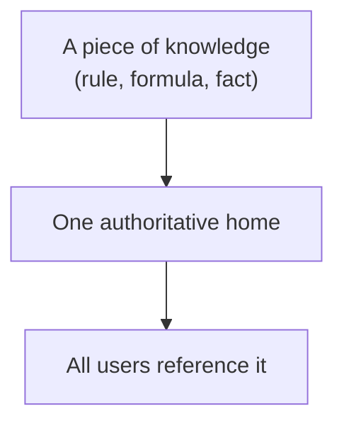
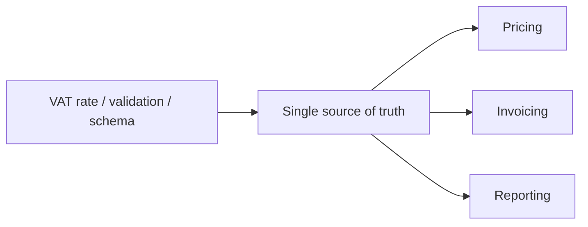
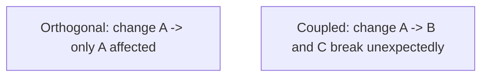
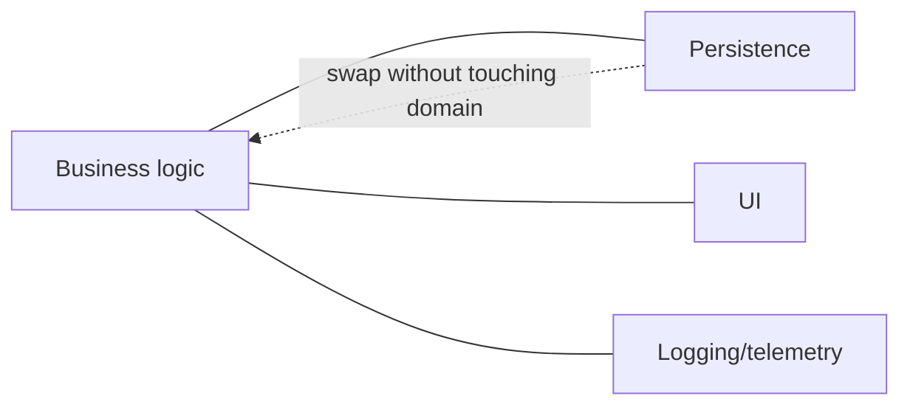

# Pragmatic Programming Practices - Complete Professional Guide

> **Category:** 04_engineering_and_practices · **Language:** English

---

### DRY, orthogonality, tracer bullets, and pragmatic habits
**Original guide written from first principles, current to 2026**

> **Original reference book (English).** This is an **independent, originally written** guide. It is not an extract, summary, or paraphrase of any third-party book; it teaches pragmatic engineering habits from first principles with original examples. Canonical books are listed under **References** as pointers only. Each chapter follows the TO-BRAIN editorial standard (see `FILE_CONVENTIONS.md`).
>
> **Scope notice:** "pragmatic" engineering is a set of pragmatic, durable habits — avoiding duplication, keeping things independent, building thin end-to-end first, and taking responsibility for your craft. This guide covers the most load-bearing of those habits, current to 2026.

---

## How to read this guide

| Level | Profile | Parts |
|-------|---------|-------|
| 1 — Beginner | Building good habits | Part I |
| 2 — Intermediate | Applying judgment | Part II |

**Target audience:** developers of any level who want durable, principle-based habits rather than rote rules.

**Structure of each chapter:** Introduction · Business context · Theoretical concepts · Architecture · Diagrams (Mermaid) · Real examples · Step by step · Complete examples · Exercises · Challenges · Checklist · Best practices · Anti-patterns · Troubleshooting · References.

> **Note on prerequisites.** Assumes general development experience. Language-neutral.

---

## Table of Contents

**Part I – Core habits**
1. DRY: every piece of knowledge has one home
2. Orthogonality: keep things independent

**Part II – Delivery habits**
3. Tracer bullets and taking responsibility

> **Status of this guide:** phased delivery. **Ready:** Part I (Ch. 1–2). **In progress:** Part II.

---

## Part I – Core habits

Beneath specific techniques are a few principles that, applied consistently, keep a codebase healthy: **don't repeat knowledge**, and **keep components independent**. They sound simple but are violated constantly, and most maintenance pain traces back to one of them.

---

## Chapter 1 — DRY: one home for each piece of knowledge

### 1.1 Introduction

**DRY — Don't Repeat Yourself** — states that every piece of *knowledge* should have a single, unambiguous, authoritative representation in the system. It is about knowledge, not just code text: the same business rule, formula, or fact should live in exactly one place, so changing it means changing one thing.

### 1.2 Business context

Duplicated knowledge is a maintenance time bomb: when a rule changes, you must find and update every copy, and the one you miss becomes a bug. DRY localizes change — update one place, the whole system is consistent. This is one of the highest-leverage habits for keeping change cheap and avoiding the subtle "we fixed it in three of four places" defects that erode trust in a system.

### 1.3 Theoretical concepts: knowledge, not text



DRY is about **knowledge duplication**, which isn't always textual. Two functions with identical code may be a coincidence (don't force them together); two places encoding the same *rule* with different code are a DRY violation. The test: "if this fact changed, how many places must I edit?" More than one means duplicated knowledge.

### 1.4 Architecture: single source of truth



Give each fact one home and have everything derive from it. Code generation, shared constants, and schema-driven validation are all ways to keep one source of truth feeding many consumers.

### 1.5 Real example

**Scenario.** A validation rule (max username length 30) appears in the frontend, the API, and the database.

**Problem.** Someone changes it to 40 in two of three places; the third rejects valid input — a confusing bug.

**Solution.** One authoritative definition the others derive from.

**Implementation (single source).**

```text
# One definition, consumed everywhere (config/schema/shared module)
USERNAME_MAX = 30

frontend validation  -> reads USERNAME_MAX
API validation       -> reads USERNAME_MAX
DB constraint        -> generated from USERNAME_MAX
```

**Result.** Changing the limit is one edit; all layers stay consistent by construction — the "missed the third place" bug becomes impossible.

**Future improvements.** Generate the DB constraint and client validation from the shared schema in the build so they can't drift.

### 1.6 Exercises

1. State DRY precisely — what is not repeated?
2. Why is identical code not always a DRY violation?
3. What's the test for whether knowledge is duplicated?

### 1.7 Challenges

- **Challenge.** Find a business rule that lives in two places. Give it one home and have both derive from it. Change it once and verify both update.

### 1.8 Checklist

- [ ] Each piece of knowledge has one authoritative home.
- [ ] Changing a fact means editing one place.
- [ ] I distinguish knowledge duplication from coincidental code similarity.
- [ ] Derived artifacts come from a single source.

### 1.9 Best practices

- Ask "how many places change if this fact changes?" — drive it to one.
- Generate derived representations from a single source.
- Don't force unrelated identical code together (that's not DRY).

### 1.10 Anti-patterns

- The same rule encoded in several layers by hand.
- Over-DRYing coincidental duplication into a wrong abstraction.
- Copy-paste-and-tweak of business logic.

### 1.11 Troubleshooting

| Symptom | Likely cause | Action |
|---------|--------------|--------|
| "Fixed it but it's still wrong elsewhere" | Duplicated knowledge | Consolidate to one source of truth |
| Layers disagree on a rule | Hand-copied logic | Derive all from one definition |
| Wrong abstraction from forced reuse | Over-DRY | Allow coincidental duplication to differ |

### 1.12 References

- A. Hunt, D. Thomas, *The Pragmatic Programmer*, 20th Anniversary ed. (Addison-Wesley, 2019) — ISBN 978-0135957059.

---

## Chapter 2 — Orthogonality: keep things independent

### 2.1 Introduction

**Orthogonality** means components are **independent**: changing one doesn't affect unrelated others. Two orthogonal modules each do their own job without reaching into the other's concerns. Orthogonal systems are easier to change, test, and reason about, because effects stay local — a change has a small, predictable blast radius.

### 2.2 Business context

In a non-orthogonal system, every change risks unexpected breakage somewhere unrelated, so changes are slow and scary and testing must cover huge surface area. Orthogonality shrinks the blast radius of change, making the system safer and cheaper to evolve and enabling parallel work (teams touch independent parts without colliding). It's a direct multiplier on delivery speed and reliability.

### 2.3 Theoretical concepts: independence and locality



Signs of orthogonality: you can describe each module's job in one sentence without "and also"; a change to one concern (say, logging) doesn't touch business logic; swapping one component (a database, a UI) doesn't ripple. It's the same goal as low coupling and separation of concerns, viewed as independence of change.

### 2.4 Architecture: separate concerns into independent parts



Keep distinct concerns in distinct, decoupled components so each can change or be replaced independently — the practical realization of the boundaries and layering ideas elsewhere in this library.

### 2.5 Real example

**Scenario.** Business logic for orders directly calls a specific logging library throughout.

**Problem.** Switching logging frameworks, or testing the logic, means touching business code everywhere — non-orthogonal.

**Solution.** Depend on a small logging abstraction so logging and business logic vary independently.

**Implementation.**

```java
// COUPLED: business code tied to a concrete logger everywhere
SpecificLogger.getInstance().log("order placed " + id);   // ripples on any change

// ORTHOGONAL: depend on a tiny abstraction; logging changes don't touch logic
interface AuditLog { void placed(OrderId id); }
class PlaceOrder {
    private final AuditLog audit;
    void handle(...) { /* ...logic... */ audit.placed(id); }   // logic unaware of the lib
}
```

**Result.** Logging implementation can change (or be faked in tests) without touching order logic; the two concerns are independent.

**Future improvements.** Apply the same separation to other cross-cutting concerns (metrics, config) so each varies on its own.

### 2.6 Exercises

1. Define orthogonality in terms of change.
2. Give two signs a system is orthogonal.
3. How does orthogonality relate to coupling and separation of concerns?

### 2.7 Challenges

- **Challenge.** Find a cross-cutting concern (logging, config, time) woven through business logic. Extract it behind an abstraction and confirm the logic no longer changes when the concern does.

### 2.8 Checklist

- [ ] Each component has one clear, independent job.
- [ ] A change to one concern doesn't ripple into others.
- [ ] Components can be swapped or tested in isolation.
- [ ] Cross-cutting concerns are separated from business logic.

### 2.9 Best practices

- Separate concerns into independently changeable components.
- Hide cross-cutting concerns behind small abstractions.
- Aim for a small, predictable blast radius per change.

### 2.10 Anti-patterns

- Business logic laced with concrete infrastructure calls.
- Modules whose job needs an "and also" to describe.
- Changes that mysteriously break unrelated features.

### 2.11 Troubleshooting

| Symptom | Likely cause | Action |
|---------|--------------|--------|
| Unrelated features break on a change | Hidden coupling | Decouple concerns; restore orthogonality |
| Swapping a component touches everything | Non-orthogonal dependency | Hide it behind an abstraction |
| Hard to test logic in isolation | Concerns intertwined | Separate cross-cutting concerns |

### 2.12 References

- A. Hunt, D. Thomas, *The Pragmatic Programmer*, 20th Anniversary ed. (Addison-Wesley, 2019) — ISBN 978-0135957059.
- D. Parnas, "On the Criteria To Be Used in Decomposing Systems into Modules" (CACM, 1972).

---

> **End of Part I.** You can now apply two load-bearing habits: keep each piece of knowledge in one authoritative home (DRY, judged by knowledge not text), and keep components independent so changes stay local (orthogonality). **Part II — Delivery habits** (Chapter 3) covers tracer-bullet development for building thin end-to-end early, and taking pragmatic responsibility for your craft and your code's quality.

<!--APPEND-PART-II-->
