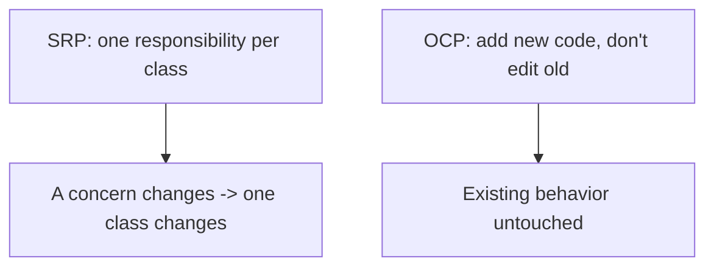
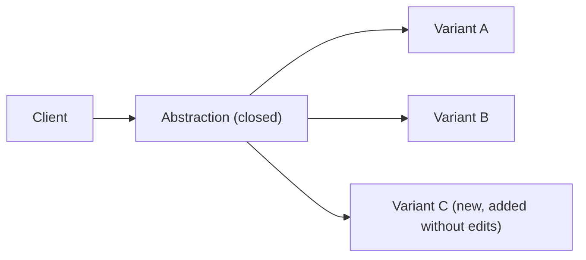
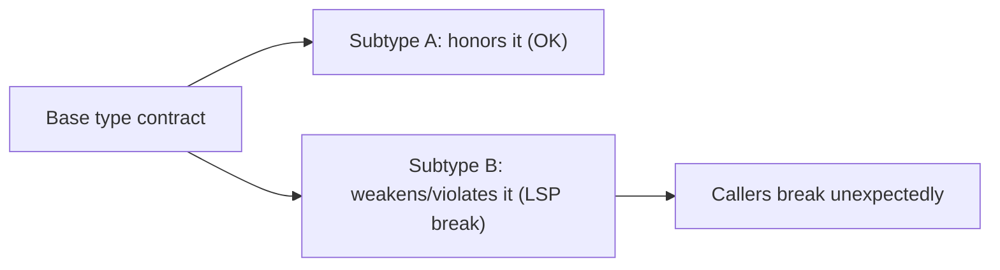
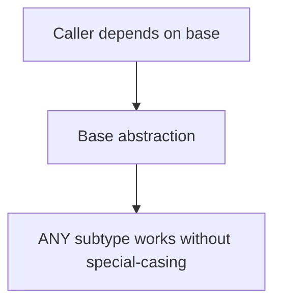

# SOLID Design Principles - Complete Professional Guide

> **Category:** 04_engineering_and_practices · **Language:** English

---

### Five principles for class and module design
**Original guide written from first principles, current to 2026**

> **Original reference book (English).** This is an **independent, originally written** guide. It is not an extract, summary, or paraphrase of any third-party book; it teaches the SOLID principles from first principles with original examples. Canonical books are listed under **References** as pointers only. Each chapter follows the TO-BRAIN editorial standard (see `FILE_CONVENTIONS.md`).
>
> **Scope notice:** SOLID is five object-oriented design principles that guide how to assign responsibilities and dependencies among classes/modules so software is easier to change. This guide explains each, with original examples and the 2026 caveat that they are heuristics, not laws.

---

## How to read this guide

| Level | Profile | Parts |
|-------|---------|-------|
| 1 — Beginner | Learning the principles | Part I |
| 2 — Intermediate | Applying with judgment | Part II |

**Target audience:** OO developers and reviewers wanting a shared, principled vocabulary for class design.

**Structure of each chapter:** Introduction · Business context · Theoretical concepts · Architecture · Diagrams (Mermaid) · Real examples · Step by step · Complete examples · Exercises · Challenges · Checklist · Best practices · Anti-patterns · Troubleshooting · References.

> **Note on prerequisites.** Assumes classes, interfaces, polymorphism, and the OO-thinking guide.

---

## Table of Contents

**Part I – Responsibility & extension**
1. Single Responsibility and Open-Closed
2. Liskov Substitution

**Part II – Dependencies**
3. Interface Segregation and Dependency Inversion

> **Status of this guide:** phased delivery. **Ready:** Part I (Ch. 1–2). **In progress:** Part II.

---

## Part I – Responsibility & extension

SOLID is an acronym for five principles — **S**ingle Responsibility, **O**pen-Closed, **L**iskov Substitution, **I**nterface Segregation, **D**ependency Inversion. Together they push designs toward classes that have one reason to change, can be extended without modification, and depend on abstractions. They are heuristics: apply them to reduce real change-pain, not as ends in themselves.

---

## Chapter 1 — Single Responsibility and Open-Closed

### 1.1 Introduction

**Single Responsibility (SRP):** a class should have one reason to change — one responsibility, one stakeholder concern. **Open-Closed (OCP):** software should be open for extension but closed for modification — you add behavior by adding code, not editing existing, working code. Together they localize change and protect what already works.

### 1.2 Business context

When one class serves several concerns (SRP violation), a change for one concern risks breaking the others, and the class becomes a contested merge hotspot. When adding a feature means editing existing code (OCP violation), every extension risks regressions. Following these principles means changes are additive and contained — new behavior rarely endangers shipped behavior, lowering both defect rate and the fear that slows teams down.

### 1.3 Theoretical concepts: one reason to change; extend don't modify



SRP is about **cohesion**: group what changes together, separate what changes for different reasons. OCP is usually achieved with **polymorphism** — depend on an abstraction, add new implementations for new behavior, leave the abstraction and its clients unchanged.

### 1.4 Architecture: extension points via abstraction



The abstraction is the stable, closed part; new variants are the open part. Adding variant C touches no existing client or sibling.

### 1.5 Real example

**Scenario.** A `Report` class formats to PDF and also emails itself.

**Problem.** Two responsibilities (formatting, sending) in one class; adding a new format means editing it (OCP) and the email concern complicates it (SRP).

**Solution.** Split responsibilities; make format an extension point.

**Implementation.**

```java
// SRP: separate concerns
interface ReportFormatter { byte[] format(Report r); }        // one job
interface ReportSender    { void send(byte[] doc); }          // another job

// OCP: add a new format by adding a class, not editing existing ones
class PdfFormatter  implements ReportFormatter { public byte[] format(Report r){ return pdf(r); } }
class HtmlFormatter implements ReportFormatter { public byte[] format(Report r){ return html(r); } }
```

**Result.** Formatting and sending change independently (SRP); a new format is a new class with no edits to existing code (OCP).

**Future improvements.** Wire formatters via configuration/DI so adding one requires no change to the composition root either.

### 1.6 Exercises

1. State SRP and OCP in one sentence each.
2. What mechanism most commonly achieves OCP?
3. How are cohesion and SRP related?

### 1.7 Challenges

- **Challenge.** Find a class with two reasons to change. Split it by responsibility, then make one axis of variation an extension point so new variants need no edits.

### 1.8 Checklist

- [ ] Each class has a single responsibility.
- [ ] New behavior is added, not edited in.
- [ ] Variation points are abstractions.
- [ ] Changing one concern touches one class.

### 1.9 Best practices

- Group code that changes together; separate different concerns.
- Use polymorphism for anticipated variation.
- Keep clients depending on stable abstractions.

### 1.10 Anti-patterns

- God classes with many responsibilities.
- Editing core code for every new case (growing switch statements).
- Speculative abstraction for variation that never comes (over-applying OCP).

### 1.11 Troubleshooting

| Symptom | Likely cause | Action |
|---------|--------------|--------|
| One change breaks unrelated behavior | SRP violation | Split responsibilities |
| Every new case edits the same file | OCP violation | Introduce an extension point |
| Abstractions with one implementation forever | Premature OCP | Inline until variation is real |

### 1.12 References

- R. C. Martin, *Agile Software Development: Principles, Patterns, and Practices* (Prentice Hall, 2002) — ISBN 978-0135974445.
- R. C. Martin, *Clean Architecture* (Prentice Hall, 2017) — ISBN 978-0134494166.

---

## Chapter 2 — Liskov Substitution

### 2.1 Introduction

**Liskov Substitution (LSP):** subtypes must be usable anywhere their base type is expected, without breaking the program's correctness. If code works with a `Shape`, it must work with any `Shape` subtype. A subtype that violates the base type's contract — strengthening preconditions or weakening guarantees — is a broken abstraction, even if it compiles.

### 2.2 Business context

LSP violations cause the most baffling bugs: code that works for one subtype fails for another that was supposed to be interchangeable, often far from where the bad subtype was introduced. Honoring LSP keeps polymorphism trustworthy — callers can rely on the base contract — which is what makes OCP-style extension safe. Break it and every `instanceof` workaround that follows erodes the design.

### 2.3 Theoretical concepts: honor the contract



A subtype must: accept at least what the base accepts (no stronger preconditions), deliver at least what the base promises (no weaker postconditions), and preserve the base's invariants. The classic smell is a subtype that throws "not supported" for a base operation, or needs callers to check its concrete type.

### 2.4 Architecture: substitutability keeps polymorphism honest



When LSP holds, callers never need to know which subtype they have — the whole point of polymorphism. When it's violated, callers sprout type checks, and the abstraction has failed.

### 2.5 Real example

**Scenario.** A `Rectangle` base with a `Square` subtype that constrains width = height.

**Problem.** Code that sets a rectangle's width and expects height unchanged breaks for `Square` (setting width also changes height) — `Square` isn't substitutable as a `Rectangle`.

**Solution.** Don't model `Square` as a subtype of mutable `Rectangle`; use a shared `Shape` abstraction with immutable shapes, or separate types.

**Implementation.**

```java
// LSP-violating: Square breaks Rectangle's contract on independent w/h
// Fix: model the real abstraction (area/shape), keep shapes immutable
interface Shape { double area(); }
record Rectangle(double w, double h) implements Shape { public double area(){ return w*h; } }
record Square(double side)           implements Shape { public double area(){ return side*side; } }
// No false "Square is-a mutable Rectangle"; each honors the Shape contract.
```

**Result.** Callers use `Shape.area()` and every subtype behaves correctly; no surprising width/height coupling, no type checks.

**Future improvements.** Prefer immutability for value-like types — it sidesteps many LSP traps around setters.

### 2.6 Exercises

1. State LSP and what a subtype must preserve.
2. Why is "throws not-supported for a base method" an LSP smell?
3. How does LSP make OCP safe?

### 2.7 Challenges

- **Challenge.** Find a subtype that callers special-case with `instanceof` or that overrides a method to do nothing/throw. Redesign so every subtype honors the base contract.

### 2.8 Checklist

- [ ] Subtypes are usable wherever the base is expected.
- [ ] Subtypes don't strengthen preconditions or weaken guarantees.
- [ ] Callers never need to check concrete subtypes.
- [ ] Base contracts (invariants) are preserved by all subtypes.

### 2.9 Best practices

- Design the base contract first; make subtypes honor it.
- Prefer immutability to avoid setter-based LSP traps.
- If a subtype can't honor the contract, it isn't a subtype.

### 2.10 Anti-patterns

- Subtypes that throw/no-op base operations.
- Callers using `instanceof` to handle "special" subtypes.
- "Is-a" inheritance that violates behavioral expectations.

### 2.11 Troubleshooting

| Symptom | Likely cause | Action |
|---------|--------------|--------|
| Code breaks for one subtype only | LSP violation | Fix the subtype or the abstraction |
| `instanceof` checks on subtypes | Broken substitutability | Redesign so the base contract suffices |
| Overrides that throw "unsupported" | Wrong inheritance | Use composition or a different abstraction |

### 2.12 References

- B. Liskov, J. Wing, "A Behavioral Notion of Subtyping" (ACM TOPLAS, 1994).
- R. C. Martin, *Agile Software Development: Principles, Patterns, and Practices* (Prentice Hall, 2002) — ISBN 978-0135974445.

---

> **End of Part I.** You can now apply the first three SOLID principles: give each class a single responsibility (SRP), extend behavior by adding code rather than editing it (OCP), and ensure subtypes honor their base type's contract so polymorphism stays trustworthy (LSP). **Part II — Dependencies** (Chapter 3) covers Interface Segregation (small, client-specific interfaces) and Dependency Inversion (depend on abstractions, not concretions), tying SOLID back to the architecture-boundaries guide.

<!--APPEND-PART-II-->
