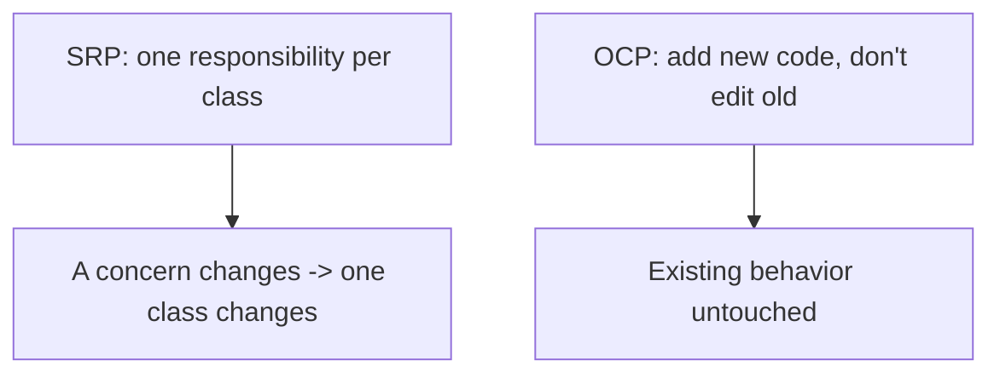
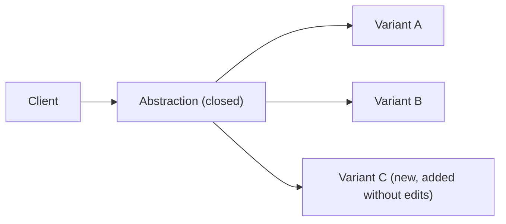
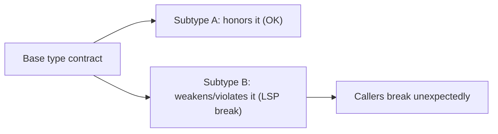
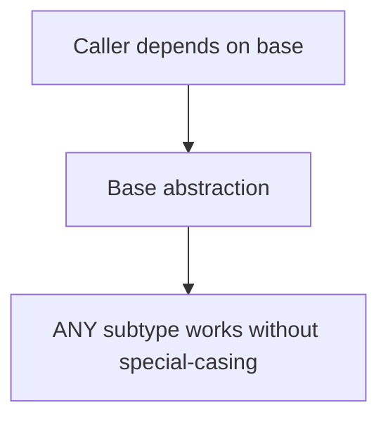
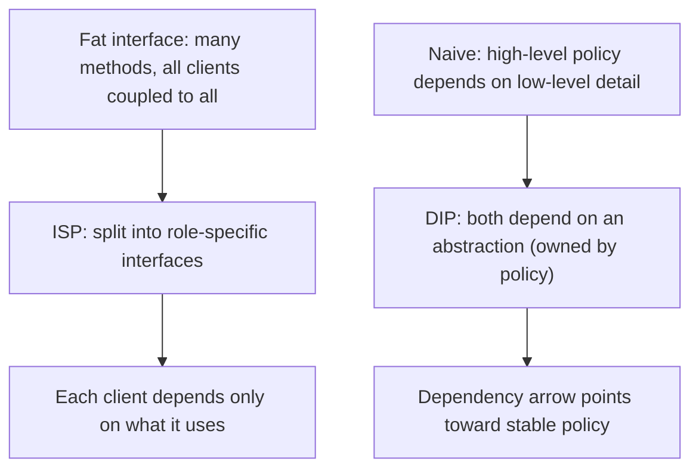
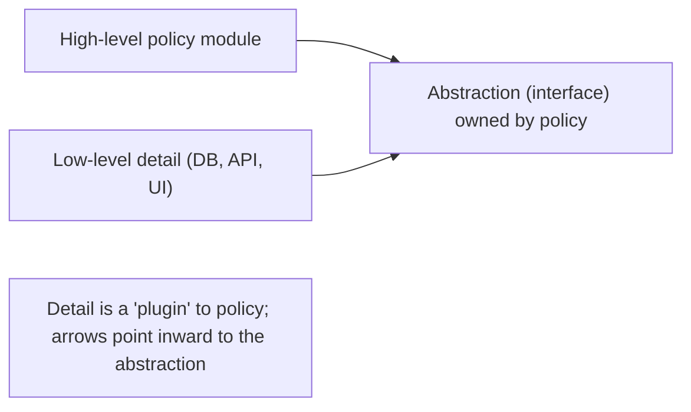

# SOLID Design Principles - Complete Professional Guide

> **Category:** 04_engineering_and_practices · **Language:** English

---

### Five principles for class and module design
**Original guide written from first principles, current to 2026**

> **Original reference book (English).** This is an **independent, originally written** guide. It is not an extract, summary, or paraphrase of any third-party book; it teaches the SOLID principles from first principles with original examples. Canonical books are listed under **References** as pointers only. Each chapter follows the TO-BRAIN editorial standard (see `FILE_CONVENTIONS.md`).
>
> **Scope notice:** SOLID is five object-oriented design principles that guide how to assign responsibilities and dependencies among classes/modules so software is easier to change. This guide explains each, with original examples and the 2026 caveat that they are heuristics, not laws.

---

## How to read this guide

| Level | Profile | Parts |
|-------|---------|-------|
| 1 — Beginner | Learning the principles | Part I |
| 2 — Intermediate | Applying with judgment | Part II |

**Target audience:** OO developers and reviewers wanting a shared, principled vocabulary for class design.

**Structure of each chapter:** Introduction · Business context · Theoretical concepts · Architecture · Diagrams (Mermaid) · Real examples · Step by step · Complete examples · Exercises · Challenges · Checklist · Best practices · Anti-patterns · Troubleshooting · References.

> **Note on prerequisites.** Assumes classes, interfaces, polymorphism, and the OO-thinking guide.

---

## Table of Contents

**Part I – Responsibility & extension**
1. Single Responsibility and Open-Closed
2. Liskov Substitution

**Part II – Dependencies**
3. Interface Segregation and Dependency Inversion

> **Status of this guide:** complete for its declared scope. **Ready:** Parts I–II (Ch. 1–3).

---

## Part I – Responsibility & extension

SOLID is an acronym for five principles — **S**ingle Responsibility, **O**pen-Closed, **L**iskov Substitution, **I**nterface Segregation, **D**ependency Inversion. Together they push designs toward classes that have one reason to change, can be extended without modification, and depend on abstractions. They are heuristics: apply them to reduce real change-pain, not as ends in themselves.

---

## Chapter 1 — Single Responsibility and Open-Closed

### 1.1 Introduction

**Single Responsibility (SRP):** a class should have one reason to change — one responsibility, one stakeholder concern. **Open-Closed (OCP):** software should be open for extension but closed for modification — you add behavior by adding code, not editing existing, working code. Together they localize change and protect what already works.

### 1.2 Business context

When one class serves several concerns (SRP violation), a change for one concern risks breaking the others, and the class becomes a contested merge hotspot. When adding a feature means editing existing code (OCP violation), every extension risks regressions. Following these principles means changes are additive and contained — new behavior rarely endangers shipped behavior, lowering both defect rate and the fear that slows teams down.

### 1.3 Theoretical concepts: one reason to change; extend don't modify



SRP is about **cohesion**: group what changes together, separate what changes for different reasons. OCP is usually achieved with **polymorphism** — depend on an abstraction, add new implementations for new behavior, leave the abstraction and its clients unchanged.

### 1.4 Architecture: extension points via abstraction



The abstraction is the stable, closed part; new variants are the open part. Adding variant C touches no existing client or sibling.

### 1.5 Real example

**Scenario.** A `Report` class formats to PDF and also emails itself.

**Problem.** Two responsibilities (formatting, sending) in one class; adding a new format means editing it (OCP) and the email concern complicates it (SRP).

**Solution.** Split responsibilities; make format an extension point.

**Implementation.**

```java
// SRP: separate concerns
interface ReportFormatter { byte[] format(Report r); }        // one job
interface ReportSender    { void send(byte[] doc); }          // another job

// OCP: add a new format by adding a class, not editing existing ones
class PdfFormatter  implements ReportFormatter { public byte[] format(Report r){ return pdf(r); } }
class HtmlFormatter implements ReportFormatter { public byte[] format(Report r){ return html(r); } }
```

**Result.** Formatting and sending change independently (SRP); a new format is a new class with no edits to existing code (OCP).

**Future improvements.** Wire formatters via configuration/DI so adding one requires no change to the composition root either.

### 1.6 Exercises

1. State SRP and OCP in one sentence each.
2. What mechanism most commonly achieves OCP?
3. How are cohesion and SRP related?

### 1.7 Challenges

- **Challenge.** Find a class with two reasons to change. Split it by responsibility, then make one axis of variation an extension point so new variants need no edits.

### 1.8 Checklist

- [ ] Each class has a single responsibility.
- [ ] New behavior is added, not edited in.
- [ ] Variation points are abstractions.
- [ ] Changing one concern touches one class.

### 1.9 Best practices

- Group code that changes together; separate different concerns.
- Use polymorphism for anticipated variation.
- Keep clients depending on stable abstractions.

### 1.10 Anti-patterns

- God classes with many responsibilities.
- Editing core code for every new case (growing switch statements).
- Speculative abstraction for variation that never comes (over-applying OCP).

### 1.11 Troubleshooting

| Symptom | Likely cause | Action |
|---------|--------------|--------|
| One change breaks unrelated behavior | SRP violation | Split responsibilities |
| Every new case edits the same file | OCP violation | Introduce an extension point |
| Abstractions with one implementation forever | Premature OCP | Inline until variation is real |

### 1.12 References

- R. C. Martin, *Agile Software Development: Principles, Patterns, and Practices* (Prentice Hall, 2002) — ISBN 978-0135974445.
- R. C. Martin, *Clean Architecture* (Prentice Hall, 2017) — ISBN 978-0134494166.

---

## Chapter 2 — Liskov Substitution

### 2.1 Introduction

**Liskov Substitution (LSP):** subtypes must be usable anywhere their base type is expected, without breaking the program's correctness. If code works with a `Shape`, it must work with any `Shape` subtype. A subtype that violates the base type's contract — strengthening preconditions or weakening guarantees — is a broken abstraction, even if it compiles.

### 2.2 Business context

LSP violations cause the most baffling bugs: code that works for one subtype fails for another that was supposed to be interchangeable, often far from where the bad subtype was introduced. Honoring LSP keeps polymorphism trustworthy — callers can rely on the base contract — which is what makes OCP-style extension safe. Break it and every `instanceof` workaround that follows erodes the design.

### 2.3 Theoretical concepts: honor the contract



A subtype must: accept at least what the base accepts (no stronger preconditions), deliver at least what the base promises (no weaker postconditions), and preserve the base's invariants. The classic smell is a subtype that throws "not supported" for a base operation, or needs callers to check its concrete type.

### 2.4 Architecture: substitutability keeps polymorphism honest



When LSP holds, callers never need to know which subtype they have — the whole point of polymorphism. When it's violated, callers sprout type checks, and the abstraction has failed.

### 2.5 Real example

**Scenario.** A `Rectangle` base with a `Square` subtype that constrains width = height.

**Problem.** Code that sets a rectangle's width and expects height unchanged breaks for `Square` (setting width also changes height) — `Square` isn't substitutable as a `Rectangle`.

**Solution.** Don't model `Square` as a subtype of mutable `Rectangle`; use a shared `Shape` abstraction with immutable shapes, or separate types.

**Implementation.**

```java
// LSP-violating: Square breaks Rectangle's contract on independent w/h
// Fix: model the real abstraction (area/shape), keep shapes immutable
interface Shape { double area(); }
record Rectangle(double w, double h) implements Shape { public double area(){ return w*h; } }
record Square(double side)           implements Shape { public double area(){ return side*side; } }
// No false "Square is-a mutable Rectangle"; each honors the Shape contract.
```

**Result.** Callers use `Shape.area()` and every subtype behaves correctly; no surprising width/height coupling, no type checks.

**Future improvements.** Prefer immutability for value-like types — it sidesteps many LSP traps around setters.

### 2.6 Exercises

1. State LSP and what a subtype must preserve.
2. Why is "throws not-supported for a base method" an LSP smell?
3. How does LSP make OCP safe?

### 2.7 Challenges

- **Challenge.** Find a subtype that callers special-case with `instanceof` or that overrides a method to do nothing/throw. Redesign so every subtype honors the base contract.

### 2.8 Checklist

- [ ] Subtypes are usable wherever the base is expected.
- [ ] Subtypes don't strengthen preconditions or weaken guarantees.
- [ ] Callers never need to check concrete subtypes.
- [ ] Base contracts (invariants) are preserved by all subtypes.

### 2.9 Best practices

- Design the base contract first; make subtypes honor it.
- Prefer immutability to avoid setter-based LSP traps.
- If a subtype can't honor the contract, it isn't a subtype.

### 2.10 Anti-patterns

- Subtypes that throw/no-op base operations.
- Callers using `instanceof` to handle "special" subtypes.
- "Is-a" inheritance that violates behavioral expectations.

### 2.11 Troubleshooting

| Symptom | Likely cause | Action |
|---------|--------------|--------|
| Code breaks for one subtype only | LSP violation | Fix the subtype or the abstraction |
| `instanceof` checks on subtypes | Broken substitutability | Redesign so the base contract suffices |
| Overrides that throw "unsupported" | Wrong inheritance | Use composition or a different abstraction |

### 2.12 References

- B. Liskov, J. Wing, "A Behavioral Notion of Subtyping" (ACM TOPLAS, 1994).
- R. C. Martin, *Agile Software Development: Principles, Patterns, and Practices* (Prentice Hall, 2002) — ISBN 978-0135974445.

---

> **End of Part I.** You can now apply the first three SOLID principles: give each class a single responsibility (SRP), extend behavior by adding code rather than editing it (OCP), and ensure subtypes honor their base type's contract so polymorphism stays trustworthy (LSP). **Part II — Dependencies** (Chapter 3) covers Interface Segregation (small, client-specific interfaces) and Dependency Inversion (depend on abstractions, not concretions), tying SOLID back to the architecture-boundaries guide.

## Part II – Dependencies

Part I covered the first three SOLID principles, which mostly shape *individual* classes — their responsibilities (SRP), how they extend (OCP), and how their subtypes behave (LSP). Part II covers the last two, which shape the *dependencies between* classes: the **Interface Segregation Principle** (ISP) keeps the interfaces clients depend on small and role-specific, and the **Dependency Inversion Principle** (DIP) controls the *direction* those dependencies point. Together they decouple modules so that high-level policy doesn't drag low-level detail behind it — the principle that, scaled up, becomes the architecture boundaries of Clean Architecture.

---

## Chapter 3 — Interface Segregation and Dependency Inversion

### 3.1 Introduction

The last two SOLID principles attack coupling through interfaces. The **Interface Segregation Principle** states that *no client should be forced to depend on methods it does not use*. "Fat" interfaces — those that accumulate many unrelated methods — couple every client to *all* of them, so a change driven by one client's needs forces recompilation and risk on clients that never cared. ISP's cure is to split a fat interface into several small, **role-specific** interfaces, each serving one kind of client. The **Dependency Inversion Principle** governs which way dependencies point: *high-level modules should not depend on low-level modules; both should depend on abstractions*, and *abstractions should not depend on details; details should depend on abstractions*. The word **inversion** is literal — in a naive design, high-level policy calls and therefore *depends on* low-level detail; DIP inverts that by having both depend on an abstraction (usually owned by the high-level side), so the dependency arrow points *toward* the stable policy rather than away from it. The two principles reinforce each other: the abstractions DIP depends on are best kept small and client-specific — i.e. segregated per ISP.

### 3.2 Business context

These principles decide how expensive change is at the *module* scale. A fat interface means a change requested by one consumer ripples out to every other consumer that shares it — a tax paid on every modification, and a frequent source of "why did touching the reporting feature break billing?" surprises. Segregating interfaces confines change to the clients that actually care. DIP's payoff is even larger: by pointing dependencies at abstractions, the valuable, hard-to-change **business policy** stops depending on volatile details like the database, the web framework, or a third-party API — so those details can be swapped, upgraded, or mocked without touching the core. That is what makes a system **testable** (inject a fake repository), **portable** (swap Postgres for an in-memory store), and **durable** (the framework of the decade doesn't contaminate the domain). For a business, DIP is the difference between a codebase whose core can outlive any particular technology and one that must be rewritten every time the infrastructure changes.

### 3.3 Theoretical concepts: small interfaces, inverted arrows



ISP is about the *width* of a dependency, DIP about its *direction*. **Width:** an interface a client depends on should expose only what that client needs; fat interfaces create accidental coupling, so segregate by client role. **Direction:** Robert Martin's key observation is that in procedural designs the source-code dependencies follow the runtime call direction — main calls policy calls detail — so the stable, important policy ends up depending on the volatile, unimportant detail, which is backwards. DIP corrects it by inserting an abstraction *between* them that the high-level module **owns** (defines in its own terms), and which the low-level module *implements*. Now the low-level detail depends on (conforms to) the abstraction, and the high-level policy depends only on its own abstraction — the source-code dependency has been *inverted* relative to the flow of control.

### 3.4 Architecture: the plugin shape



When DIP is applied consistently, the architecture takes on a **plugin** shape: the core defines abstractions (`OrderRepository`, `PaymentGateway`, `NotificationSender`) in terms meaningful to the business, and the infrastructure provides implementations that *plug into* those abstractions. All source-code dependencies point *inward*, toward the stable core — exactly the **dependency rule** of Clean Architecture, of which DIP is the class-level engine. ISP keeps each of those abstractions lean so an implementer isn't forced to satisfy methods it doesn't need and a consumer isn't coupled to behavior it doesn't use. The result is a boundary you can cross with a test double or a different technology at will. (This connects directly to the architecture-boundaries guide: SOLID at the class level produces the layered, dependency-respecting structure at the system level.)

### 3.5 Real example

**Scenario.** An `OrderService` (high-level policy) directly instantiates and calls a `PostgresOrderRepository` and a giant `IDataStore` interface that bundles orders, users, reports, and audit methods.

**Problem.** Two coupling defects. **ISP violation:** every implementer of the fat `IDataStore` must implement methods it doesn't use, and `OrderService` is coupled to report/audit methods it never calls. **DIP violation:** the business policy depends on a concrete Postgres class, so it can't be unit-tested without a database and can't migrate stores without editing the core.

**Solution.** **Segregate** the fat interface into role-specific ones, and **invert** the dependency by having `OrderService` depend on an `OrderRepository` abstraction it owns, which the Postgres class implements.

**Implementation.**

```java
// ISP — split the fat interface into role-specific ones
interface OrderRepository { Order find(Id id); void save(Order o); }   // only what order policy needs
interface ReportStore   { Report run(Query q); }                       // separate client, separate role

// DIP — policy depends on an abstraction it OWNS; detail implements it
class OrderService {                       // high-level policy
    private final OrderRepository repo;     // depends on abstraction, not Postgres
    OrderService(OrderRepository repo) { this.repo = repo; }  // injected
    void place(Order o) { /* business rules */ repo.save(o); }
}

class PostgresOrderRepository implements OrderRepository { /* low-level detail conforms */ }

// test: inject an in-memory fake — no database needed
var service = new OrderService(new InMemoryOrderRepository());
```

**Result.** `OrderService` is now testable with a fake repository, the persistence technology can change without touching policy, and no implementer carries methods it doesn't use. The dependency arrow points from Postgres *toward* the abstraction the business owns — inverted, as DIP requires.

**Future improvements.** Add further segregated abstractions (`PaymentGateway`, `NotificationSender`) as the service grows, wire implementations via a dependency-injection container at the composition root, and verify with an architecture test that no inner (policy) package imports an outer (infrastructure) package.

### 3.6 Exercises

1. State the Interface Segregation Principle and give an example of a fat interface to split.
2. State both clauses of the Dependency Inversion Principle.
3. Explain what is being "inverted" in DIP, relative to the flow of control.
4. How do ISP and DIP reinforce each other?

### 3.7 Challenges

- **Challenge.** Find a class that depends on a concrete infrastructure type (a DB client, an HTTP SDK). Introduce an abstraction the class owns, make the concrete type implement it, and inject it. Then write a unit test using a fake implementation. Separately, find a fat interface and split it by client role. Which change made the code easier to test, and which made it easier to change?

### 3.8 Checklist

- [ ] No client depends on interface methods it doesn't use (ISP).
- [ ] Interfaces are split by client role, not bundled into fat contracts.
- [ ] High-level policy depends on abstractions, not concrete low-level types (DIP).
- [ ] Abstractions are owned by the high-level module and implemented by details.
- [ ] Source-code dependencies point inward, toward stable policy.

### 3.9 Best practices

- Define abstractions in the high-level module's own terms, then have details implement them.
- Keep each abstraction small and role-specific so implementers and clients stay lean.
- Inject dependencies (constructor injection) and wire them at a single composition root.
- Use architecture tests to enforce that inner layers never depend on outer ones.

### 3.10 Anti-patterns

- Fat "do-everything" interfaces forcing clients/implementers to carry unused methods.
- Business logic that `new`s up or imports concrete infrastructure classes.
- Abstractions that leak detail (e.g. an interface exposing SQL or HTTP specifics).
- "Header interfaces" with a single implementation that mirror a concrete class one-to-one (no real inversion).

### 3.11 Troubleshooting

| Symptom | Likely cause | Action |
|---------|--------------|--------|
| One client's change breaks unrelated clients | Fat shared interface (ISP violation) | Split into role-specific interfaces |
| Core logic can't be unit-tested without infrastructure | Policy depends on concrete detail (DIP violation) | Depend on an abstraction; inject a fake |
| Swapping a database/framework touches business code | Dependencies point outward | Invert with an abstraction owned by policy |
| Interface exposes DB/HTTP specifics | Leaky abstraction | Redefine it in domain terms |

### 3.12 References

- R. C. Martin, *Agile Software Development: Principles, Patterns, and Practices* (Prentice Hall, 2002), ch. 11 "The Dependency-Inversion Principle (DIP)" and ch. 12 "The Interface-Segregation Principle (ISP)" — ISBN 978-0135974445.
- R. C. Martin, *Clean Architecture* (Prentice Hall, 2017) — DIP as the engine of the dependency rule — ISBN 978-0134494166.

---

> **End of Part II.** You can now apply the two dependency-shaping SOLID principles. **Interface Segregation** controls a dependency's *width* — split fat interfaces into small, role-specific ones so no client carries methods it doesn't use. **Dependency Inversion** controls its *direction* — high-level policy and low-level detail both depend on an abstraction owned by the policy, inverting the source-code dependency so it points toward the stable core. Applied consistently they produce a **plugin architecture** in which infrastructure is swappable and testable, and the business core outlives any particular technology — SOLID at the class level becoming the dependency rule at the system level.
