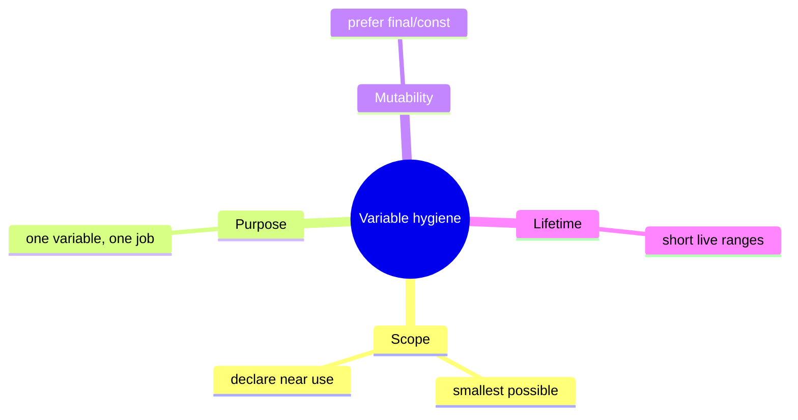
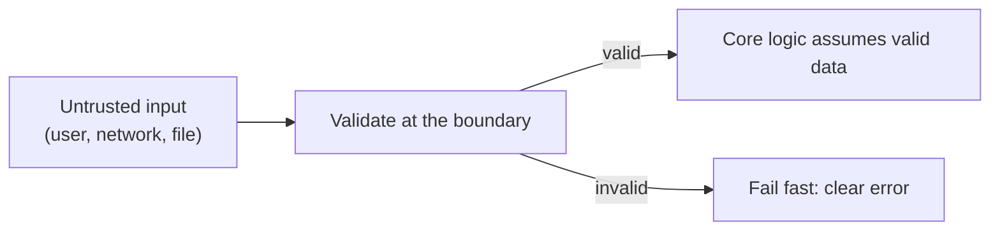
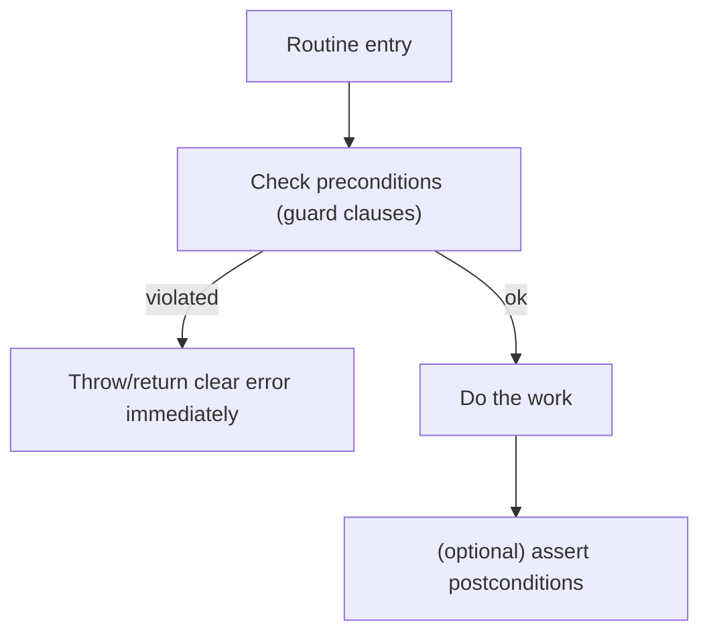

# Software Construction Practices - Complete Professional Guide

> **Category:** 04_engineering_and_practices · **Language:** English

---

### Defensive programming, variables, and control at the code level
**Original guide written from first principles, current to 2026**

> **Original reference book (English).** This is an **independent, originally written** guide. It is not an extract, summary, or paraphrase of any third-party book; it teaches software construction from first principles. Canonical books are listed under **References** as pointers only. Each chapter follows the TO-BRAIN editorial standard (see `FILE_CONVENTIONS.md`).
>
> **Scope notice:** "construction" is the detailed, day-to-day building of working code — variables, conditionals, routines, defensive checks. This guide covers the practices that make individual code units correct and robust, complementing the higher-level design guides. Current to 2026 (static analysis, type systems, AI-assisted coding).

---

## How to read this guide

| Level | Profile | Parts |
|-------|---------|-------|
| 1 — Beginner | Writing solid routines | Part I |
| 2 — Intermediate | Robust code | Part II |

**Target audience:** developers at any level who want their individual functions and modules to be correct and defensible.

**Structure of each chapter:** Introduction · Business context · Theoretical concepts · Architecture · Diagrams (Mermaid) · Real examples · Step by step · Complete examples · Exercises · Challenges · Checklist · Best practices · Anti-patterns · Troubleshooting · References.

> **Note on prerequisites.** Assumes basic fluency in one language. Examples use Java-like syntax.

---

## Table of Contents

**Part I – Building solid units**
1. Variables and data: minimize scope, maximize clarity
2. Defensive programming and validating inputs

**Part II – Control & quality**
3. Straightforward control flow and the role of static analysis

> **Status of this guide:** phased delivery. **Ready:** Part I (Ch. 1–2). **In progress:** Part II.

---

## Part I – Building solid units

Above the architecture and below the syntax sits **construction**: the craft of writing each variable, condition, and routine so it is correct and hard to misuse. These habits are unglamorous but decisive — most defects are introduced here, one careless scope or unchecked input at a time.

---

## Chapter 1 — Variables and data

### 1.1 Introduction

How you handle **variables** quietly shapes how error-prone code is. The guiding habits: keep each variable's **scope** as small as possible, give it a single purpose, initialize it near first use, and prefer immutability. Tight, clear data handling removes a whole category of bugs (stale values, accidental reuse, action at a distance).

### 1.2 Business context

Variable-related bugs — a value reused for two purposes, a mutation in a far-off function, an uninitialized field — are common, subtle, and expensive to track down. Disciplined data handling prevents them at the source, lowering debugging time. It also makes code easier to read, since a tightly-scoped, single-purpose variable tells the reader exactly what it's for.

### 1.3 Theoretical concepts: minimize live data



The central idea is to **minimize the amount of live, mutable data** a reader must track at any point. Small scopes, single purposes, and immutability shrink the mental state needed to understand and change the code — and shrink the surface for bugs.

### 1.4 Architecture: span and live time

```mermaid
flowchart LR
    decl["Declare near first use"] --> use1["Use"]
    use1 --> use2["Use (close together)"]
    use2 --> end["Out of scope quickly"]
```

Keep a variable's **uses close together** (short live range) so the reader doesn't carry it across unrelated code. A variable declared at the top of a long function and used 40 lines later is a comprehension and bug hazard.

### 1.5 Real example

**Scenario.** A loop reuses one variable for two different totals.

**Problem.** Reusing `t` for both subtotal and tax invites a stale-value bug and confuses readers.

**Solution.** One variable per purpose, immutable where possible, declared at use.

**Implementation.**

```java
// BEFORE: one mutable variable, two jobs, wide scope
double t = 0;
for (Item i : items) t += i.price();
// ... later ...
t = t * 0.2;                 // now 't' means tax; reader must re-track it

// AFTER: single-purpose, immutable, tight scope
double subtotal = items.stream().mapToDouble(Item::price).sum();
double tax = subtotal * VAT_RATE;
```

**Result.** Each name means one thing for its whole (short) life; no re-tracking, no stale-value risk.

**Future improvements.** Extract to a `Money` type so currency/rounding are handled correctly and immutably.

### 1.6 Exercises

1. Why keep variable scope as small as possible?
2. What's wrong with reusing one variable for two purposes?
3. Why prefer immutable (final/const) variables?

### 1.7 Challenges

- **Challenge.** Find a long function with a top-declared variable used much later. Move its declaration to first use and check whether its purpose is now clearer.

### 1.8 Checklist

- [ ] Each variable has the smallest scope that works.
- [ ] One variable serves one purpose.
- [ ] Variables are declared near first use.
- [ ] I default to immutable bindings.

### 1.9 Best practices

- Declare variables at first use, in the narrowest scope.
- Prefer `final`/`const`; mutate only when necessary.
- Give each variable a single, clear responsibility.

### 1.10 Anti-patterns

- Reusing one variable for unrelated purposes.
- Top-of-function declarations with distant uses.
- Mutable shared state changed from afar.

### 1.11 Troubleshooting

| Symptom | Likely cause | Action |
|---------|--------------|--------|
| Stale/incorrect value bugs | Variable reuse / wide scope | One purpose; shrink scope |
| Hard to follow a function | Long variable live ranges | Declare near use; split the function |
| Surprising state changes | Shared mutability | Prefer immutability; localize state |

### 1.12 References

- S. McConnell, *Code Complete*, 2nd ed. (Microsoft Press, 2004) — ISBN 978-0735619678.
- J. Bloch, *Effective Java*, 3rd ed. (Addison-Wesley, 2018) — ISBN 978-0134685991.

---

## Chapter 2 — Defensive programming

### 2.1 Introduction

**Defensive programming** means writing each routine to protect itself against bad inputs and impossible states — validating what crosses its boundary and failing fast and clearly when assumptions are violated. The aim is that a bug surfaces **close to its cause**, not three layers away as a mysterious null.

### 2.2 Business context

Undefended code lets bad data travel far before causing a failure, making defects costly to trace and sometimes corrupting state along the way. Defensive checks turn "a weird error somewhere downstream" into "rejected at the door with a clear message," slashing debugging time and preventing bad data from spreading. The cost is a few guard clauses; the payoff is contained, diagnosable failures.

### 2.3 Theoretical concepts: validate at boundaries



Distinguish **boundaries** (where untrusted data enters — validate thoroughly) from the **interior** (where you can assume validity, enforced by assertions). Validate external input as data errors (handle gracefully); use **assertions** for conditions that should be impossible (programmer errors) — they document and catch broken assumptions in development.

### 2.4 Architecture: fail fast, contain damage



Guard clauses at the top of a routine reject bad states before any work happens, so failures are immediate and local — far cheaper than corrupting state and failing later.

### 2.5 Real example

**Scenario.** A transfer function receives an amount and two accounts.

**Problem.** Without checks, a negative amount or null account fails deep inside, hard to trace.

**Solution.** Guard clauses validate inputs up front; assertions catch impossible internal states.

**Implementation.**

```java
void transfer(Account from, Account to, long cents) {
    // Boundary validation: data errors, fail fast with clear messages.
    if (from == null || to == null) throw new IllegalArgumentException("accounts required");
    if (cents <= 0) throw new IllegalArgumentException("amount must be positive");
    if (from.equals(to)) throw new IllegalArgumentException("cannot transfer to same account");

    from.withdraw(cents);
    to.deposit(cents);

    // Interior assumption: a programmer error if this ever fails.
    assert from.balanceCents() >= 0 : "withdraw must not overdraw";
}
```

**Result.** Bad inputs are rejected at the entry with precise messages; impossible states are caught in development by the assertion. Failures point straight at the cause.

**Future improvements.** Encode positivity in a `Money` type so the check moves to construction, not every method.

### 2.6 Exercises

1. Distinguish boundary validation from interior assertions.
2. Why does failing fast reduce debugging cost?
3. When is an assertion appropriate vs handling an error?

### 2.7 Challenges

- **Challenge.** Add guard clauses to a routine that currently trusts its inputs. Feed it bad data and confirm the failure is now immediate and clearly messaged.

### 2.8 Checklist

- [ ] I validate untrusted input at boundaries.
- [ ] I fail fast with clear messages.
- [ ] I use assertions for impossible (programmer-error) states.
- [ ] Bad data can't travel far before being caught.

### 2.9 Best practices

- Guard clauses first; reject bad states before doing work.
- Validate external data as errors; assert internal invariants.
- Make error messages say what was expected and what arrived.

### 2.10 Anti-patterns

- Trusting all inputs, so failures surface far from the cause.
- Swallowing errors silently, hiding bad data.
- Using assertions for input validation users can trigger.

### 2.11 Troubleshooting

| Symptom | Likely cause | Action |
|---------|--------------|--------|
| Mysterious downstream nulls | No boundary validation | Add guard clauses at entry |
| Corrupted state after bad input | Bad data traveled far | Validate/fail fast at the boundary |
| Impossible state reached silently | No assertions | Assert invariants in the interior |

### 2.12 References

- S. McConnell, *Code Complete*, 2nd ed. (Microsoft Press, 2004) — ISBN 978-0735619678.
- A. Hunt, D. Thomas, *The Pragmatic Programmer*, 20th Anniversary ed. (Addison-Wesley, 2019) — ISBN 978-0135957059.

---

> **End of Part I.** You can now build solid code units: keep variables tightly scoped, single-purpose, and immutable, and program defensively — validating untrusted input at boundaries, failing fast with clear messages, and asserting impossible states so bugs surface close to their cause. **Part II — Control & quality** (Chapter 3) covers straightforward control flow (guard clauses over deep nesting) and how static analysis and type systems catch construction defects automatically.

<!--APPEND-PART-II-->
