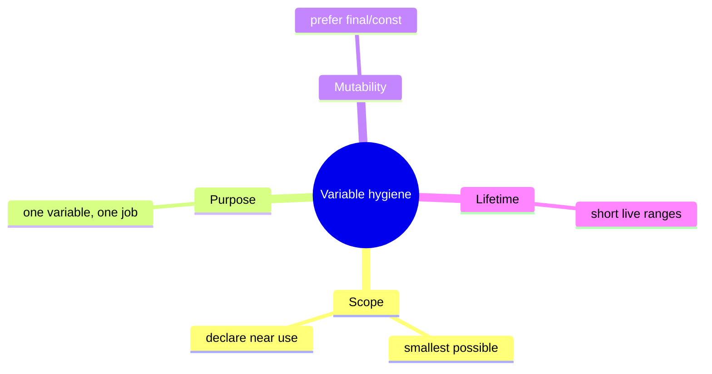
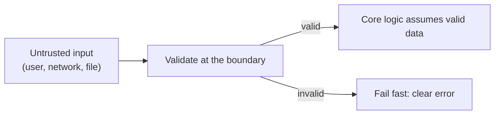
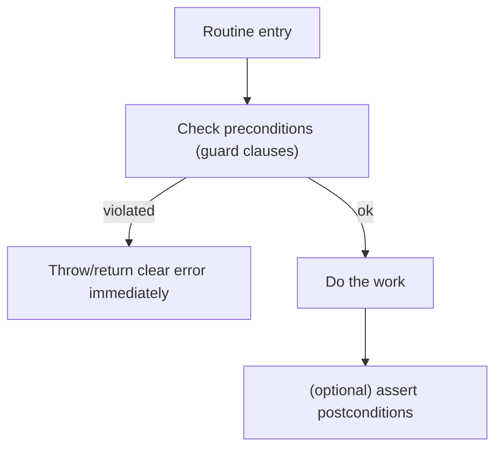
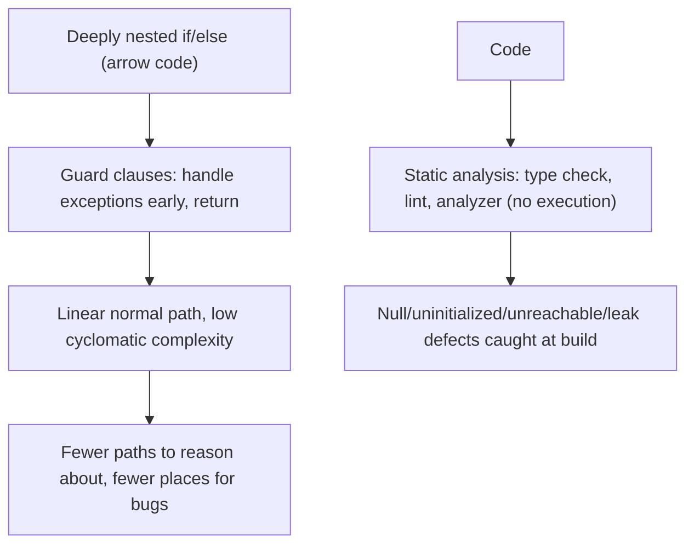
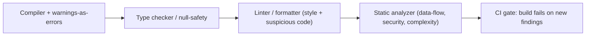

# Software Construction Practices - Complete Professional Guide

> **Category:** 04_engineering_and_practices · **Language:** English

---

### Defensive programming, variables, and control at the code level
**Original guide written from first principles, current to 2026**

> **Original reference book (English).** This is an **independent, originally written** guide. It is not an extract, summary, or paraphrase of any third-party book; it teaches software construction from first principles. Canonical books are listed under **References** as pointers only. Each chapter follows the TO-BRAIN editorial standard (see `FILE_CONVENTIONS.md`).
>
> **Scope notice:** "construction" is the detailed, day-to-day building of working code — variables, conditionals, routines, defensive checks. This guide covers the practices that make individual code units correct and robust, complementing the higher-level design guides. Current to 2026 (static analysis, type systems, AI-assisted coding).

---

## How to read this guide

| Level | Profile | Parts |
|-------|---------|-------|
| 1 — Beginner | Writing solid routines | Part I |
| 2 — Intermediate | Robust code | Part II |

**Target audience:** developers at any level who want their individual functions and modules to be correct and defensible.

**Structure of each chapter:** Introduction · Business context · Theoretical concepts · Architecture · Diagrams (Mermaid) · Real examples · Step by step · Complete examples · Exercises · Challenges · Checklist · Best practices · Anti-patterns · Troubleshooting · References.

> **Note on prerequisites.** Assumes basic fluency in one language. Examples use Java-like syntax.

---

## Table of Contents

**Part I – Building solid units**
1. Variables and data: minimize scope, maximize clarity
2. Defensive programming and validating inputs

**Part II – Control & quality**
3. Straightforward control flow and the role of static analysis

> **Status of this guide:** complete for its declared scope. **Ready:** Parts I–II (Ch. 1–3).

---

## Part I – Building solid units

Above the architecture and below the syntax sits **construction**: the craft of writing each variable, condition, and routine so it is correct and hard to misuse. These habits are unglamorous but decisive — most defects are introduced here, one careless scope or unchecked input at a time.

---

## Chapter 1 — Variables and data

### 1.1 Introduction

How you handle **variables** quietly shapes how error-prone code is. The guiding habits: keep each variable's **scope** as small as possible, give it a single purpose, initialize it near first use, and prefer immutability. Tight, clear data handling removes a whole category of bugs (stale values, accidental reuse, action at a distance).

### 1.2 Business context

Variable-related bugs — a value reused for two purposes, a mutation in a far-off function, an uninitialized field — are common, subtle, and expensive to track down. Disciplined data handling prevents them at the source, lowering debugging time. It also makes code easier to read, since a tightly-scoped, single-purpose variable tells the reader exactly what it's for.

### 1.3 Theoretical concepts: minimize live data



The central idea is to **minimize the amount of live, mutable data** a reader must track at any point. Small scopes, single purposes, and immutability shrink the mental state needed to understand and change the code — and shrink the surface for bugs.

### 1.4 Architecture: span and live time

```mermaid
flowchart LR
    decl["Declare near first use"] --> use1["Use"]
    use1 --> use2["Use (close together)"]
    use2 --> end["Out of scope quickly"]
```

Keep a variable's **uses close together** (short live range) so the reader doesn't carry it across unrelated code. A variable declared at the top of a long function and used 40 lines later is a comprehension and bug hazard.

### 1.5 Real example

**Scenario.** A loop reuses one variable for two different totals.

**Problem.** Reusing `t` for both subtotal and tax invites a stale-value bug and confuses readers.

**Solution.** One variable per purpose, immutable where possible, declared at use.

**Implementation.**

```java
// BEFORE: one mutable variable, two jobs, wide scope
double t = 0;
for (Item i : items) t += i.price();
// ... later ...
t = t * 0.2;                 // now 't' means tax; reader must re-track it

// AFTER: single-purpose, immutable, tight scope
double subtotal = items.stream().mapToDouble(Item::price).sum();
double tax = subtotal * VAT_RATE;
```

**Result.** Each name means one thing for its whole (short) life; no re-tracking, no stale-value risk.

**Future improvements.** Extract to a `Money` type so currency/rounding are handled correctly and immutably.

### 1.6 Exercises

1. Why keep variable scope as small as possible?
2. What's wrong with reusing one variable for two purposes?
3. Why prefer immutable (final/const) variables?

### 1.7 Challenges

- **Challenge.** Find a long function with a top-declared variable used much later. Move its declaration to first use and check whether its purpose is now clearer.

### 1.8 Checklist

- [ ] Each variable has the smallest scope that works.
- [ ] One variable serves one purpose.
- [ ] Variables are declared near first use.
- [ ] I default to immutable bindings.

### 1.9 Best practices

- Declare variables at first use, in the narrowest scope.
- Prefer `final`/`const`; mutate only when necessary.
- Give each variable a single, clear responsibility.

### 1.10 Anti-patterns

- Reusing one variable for unrelated purposes.
- Top-of-function declarations with distant uses.
- Mutable shared state changed from afar.

### 1.11 Troubleshooting

| Symptom | Likely cause | Action |
|---------|--------------|--------|
| Stale/incorrect value bugs | Variable reuse / wide scope | One purpose; shrink scope |
| Hard to follow a function | Long variable live ranges | Declare near use; split the function |
| Surprising state changes | Shared mutability | Prefer immutability; localize state |

### 1.12 References

- S. McConnell, *Code Complete*, 2nd ed. (Microsoft Press, 2004) — ISBN 978-0735619678.
- J. Bloch, *Effective Java*, 3rd ed. (Addison-Wesley, 2018) — ISBN 978-0134685991.

---

## Chapter 2 — Defensive programming

### 2.1 Introduction

**Defensive programming** means writing each routine to protect itself against bad inputs and impossible states — validating what crosses its boundary and failing fast and clearly when assumptions are violated. The aim is that a bug surfaces **close to its cause**, not three layers away as a mysterious null.

### 2.2 Business context

Undefended code lets bad data travel far before causing a failure, making defects costly to trace and sometimes corrupting state along the way. Defensive checks turn "a weird error somewhere downstream" into "rejected at the door with a clear message," slashing debugging time and preventing bad data from spreading. The cost is a few guard clauses; the payoff is contained, diagnosable failures.

### 2.3 Theoretical concepts: validate at boundaries



Distinguish **boundaries** (where untrusted data enters — validate thoroughly) from the **interior** (where you can assume validity, enforced by assertions). Validate external input as data errors (handle gracefully); use **assertions** for conditions that should be impossible (programmer errors) — they document and catch broken assumptions in development.

### 2.4 Architecture: fail fast, contain damage



Guard clauses at the top of a routine reject bad states before any work happens, so failures are immediate and local — far cheaper than corrupting state and failing later.

### 2.5 Real example

**Scenario.** A transfer function receives an amount and two accounts.

**Problem.** Without checks, a negative amount or null account fails deep inside, hard to trace.

**Solution.** Guard clauses validate inputs up front; assertions catch impossible internal states.

**Implementation.**

```java
void transfer(Account from, Account to, long cents) {
    // Boundary validation: data errors, fail fast with clear messages.
    if (from == null || to == null) throw new IllegalArgumentException("accounts required");
    if (cents <= 0) throw new IllegalArgumentException("amount must be positive");
    if (from.equals(to)) throw new IllegalArgumentException("cannot transfer to same account");

    from.withdraw(cents);
    to.deposit(cents);

    // Interior assumption: a programmer error if this ever fails.
    assert from.balanceCents() >= 0 : "withdraw must not overdraw";
}
```

**Result.** Bad inputs are rejected at the entry with precise messages; impossible states are caught in development by the assertion. Failures point straight at the cause.

**Future improvements.** Encode positivity in a `Money` type so the check moves to construction, not every method.

### 2.6 Exercises

1. Distinguish boundary validation from interior assertions.
2. Why does failing fast reduce debugging cost?
3. When is an assertion appropriate vs handling an error?

### 2.7 Challenges

- **Challenge.** Add guard clauses to a routine that currently trusts its inputs. Feed it bad data and confirm the failure is now immediate and clearly messaged.

### 2.8 Checklist

- [ ] I validate untrusted input at boundaries.
- [ ] I fail fast with clear messages.
- [ ] I use assertions for impossible (programmer-error) states.
- [ ] Bad data can't travel far before being caught.

### 2.9 Best practices

- Guard clauses first; reject bad states before doing work.
- Validate external data as errors; assert internal invariants.
- Make error messages say what was expected and what arrived.

### 2.10 Anti-patterns

- Trusting all inputs, so failures surface far from the cause.
- Swallowing errors silently, hiding bad data.
- Using assertions for input validation users can trigger.

### 2.11 Troubleshooting

| Symptom | Likely cause | Action |
|---------|--------------|--------|
| Mysterious downstream nulls | No boundary validation | Add guard clauses at entry |
| Corrupted state after bad input | Bad data traveled far | Validate/fail fast at the boundary |
| Impossible state reached silently | No assertions | Assert invariants in the interior |

### 2.12 References

- S. McConnell, *Code Complete*, 2nd ed. (Microsoft Press, 2004) — ISBN 978-0735619678.
- A. Hunt, D. Thomas, *The Pragmatic Programmer*, 20th Anniversary ed. (Addison-Wesley, 2019) — ISBN 978-0135957059.

---

> **End of Part I.** You can now build solid code units: keep variables tightly scoped, single-purpose, and immutable, and program defensively — validating untrusted input at boundaries, failing fast with clear messages, and asserting impossible states so bugs surface close to their cause. **Part II — Control & quality** (Chapter 3) covers straightforward control flow (guard clauses over deep nesting) and how static analysis and type systems catch construction defects automatically.

## Part II – Control & quality

Part I built solid units from the inside: tightly-scoped variables and defensive boundaries. Part II governs how those units *flow* and how defects in them are caught automatically. McConnell's master theme — *managing complexity is software's primary technical imperative* — applies directly to control flow: nested conditionals and tangled loops are where complexity hides and bugs breed, so the goal is control structures so straightforward a reader follows them without effort. The second half of the chapter turns to the machines that read your code for you: static analysis and type systems that catch whole classes of construction defects before a test ever runs.

---

## Chapter 3 — Straightforward control flow and the role of static analysis

### 3.1 Introduction

Control flow is straightforward when a reader can follow each path without holding much in their head. McConnell's guidance pushes relentlessly toward that: write conditionals so the **normal path is clear and comes first**, use loops with a single, obvious purpose and clean entry/exit, and above all **tame deep nesting** — the single strongest source of control-flow complexity. The chief tool against nesting is the **guard clause** (return or `continue` early on the exceptional cases), which flattens an arrow-shaped pyramid of `if/else` into a linear sequence. The objective measure behind this is **control-flow complexity** (McCabe's cyclomatic complexity — essentially the number of paths through a routine); McConnell advises keeping it low and treating a high count as a signal to decompose. The second pillar is **static analysis**: compilers' warnings, type checkers, linters, and dedicated analyzers read code and flag defects — null dereferences, unreachable code, uninitialized variables, resource leaks — *without executing it*, catching at build time what would otherwise become a runtime bug or a missing test.

### 3.2 Business context

Complex control flow is expensive twice over: it is where bugs hide (every extra path is another place to be wrong) and it is what makes code slow and risky to change (a reader must trace many branches to be sure of an edit). Flattening control flow with guard clauses and keeping routine complexity low directly lowers defect rates and the cost of future change — the maintenance phase, which dominates a system's lifetime cost. Static analysis multiplies that benefit by shifting defect detection *left*, to the cheapest possible moment: a null-pointer bug caught by a type checker at compile time costs seconds; the same bug found in production costs orders of magnitude more and may reach a customer. For a business, a wired-in analysis gate is one of the highest-leverage quality investments available — it works on every line, every build, for free, never gets tired, and enforces standards no amount of manual review can match for consistency.

### 3.3 Theoretical concepts: minimize paths, then check them automatically



Two ideas do the work. First, **fewer paths means fewer defects and easier reasoning**: cyclomatic complexity counts the independent paths through a routine, and each one is a place a test must cover and a bug can lurk. Guard clauses, early returns, decomposing a big routine, and replacing sprawling conditionals with **table-driven** lookups all cut path count. Second, **static analysis verifies properties without running the code**: a type system proves certain errors *can't* occur (you can't pass a `String` where an `int` is required); a null-safety analysis proves a reference is non-null on a path; a linter flags suspicious constructs. These are *complementary* to tests — static analysis proves the absence of whole *categories* of defect across all inputs, where tests check specific behaviors on specific inputs. McConnell frames both as part of the broader **software-quality landscape**: no single technique catches everything, so you layer them.

### 3.4 Architecture: layers of automated checking



Modern construction wires a *pipeline* of automated checks, each catching what the previous misses. **Compiler warnings**, treated as errors, catch the cheapest defects. The **type checker** (and null-safety where the language offers it) proves structural correctness. **Linters and formatters** enforce consistency and flag suspicious patterns (unused variables, shadowed names, fall-through). **Dedicated static analyzers** perform deeper data-flow, security (taint), and complexity analysis — and can fail the build when a routine's cyclomatic complexity crosses a threshold, turning McConnell's "keep complexity low" advice into an enforced rule. Crucially this all sits in **CI as a gate**, so the standard is applied uniformly and a regression can't merge. The architecture mirrors the control-flow lesson: keep the human-reasoned paths few and simple, and let machines exhaustively check the properties humans miss.

### 3.5 Real example

**Scenario.** A `processOrder` routine validates an order through five nested conditions before doing the work, and a recurring class of null-related bugs keeps reaching production.

**Problem.** The five-deep nesting (arrow code) makes the routine hard to read and its many paths hard to test, and the null bugs slip through because nothing checks for them before runtime.

**Solution.** Apply **guard clauses** to flatten the control flow so the normal path is linear, lowering cyclomatic complexity, and add **static analysis** (null-safety type checking plus a CI linter/analyzer gate) so the null-defect category is caught at build time.

**Implementation.**

```java
// BEFORE — deep nesting (arrow code), high path count, null bugs slip through
Result processOrder(Order o) {
    if (o != null) {
        if (o.isValid()) {
            if (inventory.has(o)) {
                if (payment.authorize(o)) {
                    return fulfil(o);
                } else { return DECLINED; }
            } else { return OUT_OF_STOCK; }
        } else { return INVALID; }
    } else { return NULL_ORDER; }
}

// AFTER — guard clauses: exceptional cases handled early, normal path linear
Result processOrder(Order o) {
    if (o == null)            return NULL_ORDER;
    if (!o.isValid())         return INVALID;
    if (!inventory.has(o))    return OUT_OF_STOCK;
    if (!payment.authorize(o)) return DECLINED;
    return fulfil(o);                 // the happy path stands alone, unindented
}
// Static analysis gate (CI): @NonNull annotations + null-safety checker reject a future
// caller that could pass null; linter flags complexity/unused code; build fails on new findings.
```

**Result.** The routine reads top-to-bottom as a sequence of preconditions followed by the real work; its cyclomatic complexity and nesting depth drop sharply, making every path easy to see and test. The null-safety analyzer closes the recurring bug category at build time, so those defects stop reaching production.

**Future improvements.** Extract the guard conditions into a named validation step if they grow, consider a **table-driven** rule set if the validations multiply, and ratchet the CI complexity threshold downward over time so newly-added code can't reintroduce deep nesting.

### 3.6 Exercises

1. Rewrite a three-level nested conditional using guard clauses and describe the readability gain.
2. What does cyclomatic complexity measure, and why does a high value warn of trouble?
3. How does static analysis differ from testing in *what* it proves about code?
4. Name three distinct layers of automated checking and one defect each catches.

### 3.7 Challenges

- **Challenge.** Find a deeply nested routine in any codebase. Flatten it with guard clauses and measure its cyclomatic complexity before and after. Then enable one new static-analysis check (null-safety, an analyzer rule, or warnings-as-errors) in CI and fix what it surfaces. Which found more real defects — your refactor or the analyzer?

### 3.8 Checklist

- [ ] My conditionals put the normal/happy path first and clear.
- [ ] I use guard clauses to avoid deep nesting (arrow code).
- [ ] I keep routine cyclomatic complexity low and decompose when it climbs.
- [ ] Compiler warnings are treated as errors.
- [ ] A static-analysis/type-check gate runs in CI and blocks new findings.

### 3.9 Best practices

- Flatten control flow with early returns; reserve nesting for genuine structure.
- Replace sprawling conditionals with table-driven lookups where it clarifies.
- Layer automated checks: warnings-as-errors, type/null checks, linters, analyzers.
- Enforce complexity and analysis thresholds in CI, and ratchet them tighter over time.

### 3.10 Anti-patterns

- Arrow code: deeply nested `if/else` pyramids tracking the happy path at the bottom.
- Loops or routines with multiple hidden purposes and unclear exit conditions.
- Ignoring or suppressing compiler/linter warnings wholesale.
- Relying solely on tests for defect classes a type system or analyzer could prove away.

### 3.11 Troubleshooting

| Symptom | Likely cause | Action |
|---------|--------------|--------|
| Routine hard to read/follow | Deep nesting, high path count | Apply guard clauses; decompose; lower complexity |
| Recurring null/uninitialized bugs | No build-time analysis for them | Add null-safety/type checks; warnings-as-errors |
| Edits keep introducing regressions | High cyclomatic complexity | Reduce paths; enforce a complexity threshold in CI |
| Style/quality inconsistent across team | No automated enforcement | Add linter/formatter + analyzer as a CI gate |

### 3.12 References

- S. McConnell, *Code Complete*, 2nd ed. (Microsoft Press, 2004) — ch. 15 "Using Conditionals", ch. 16 "Controlling Loops", ch. 19 "General Control Issues" (§19.4 "Taming Dangerously Deep Nesting", control complexity), ch. 18 "Table-Driven Methods", ch. 20 "The Software-Quality Landscape" — ISBN 978-0735619678.
- T. McCabe, "A Complexity Measure," *IEEE Transactions on Software Engineering* (1976) — origin of cyclomatic complexity.

---

> **End of Part II.** You can now keep control flow straightforward and let machines catch what reading misses. Put the normal path first, use **guard clauses** to tame deep nesting, and keep **cyclomatic complexity** low so a routine has few paths to reason about and test — McConnell's primary imperative of managing complexity applied to flow. Then layer **static analysis** — warnings-as-errors, type/null checking, linters, analyzers — as a CI gate that proves whole categories of defect absent at build time, complementing tests rather than replacing them. Simple paths for humans, exhaustive checks by machines.
