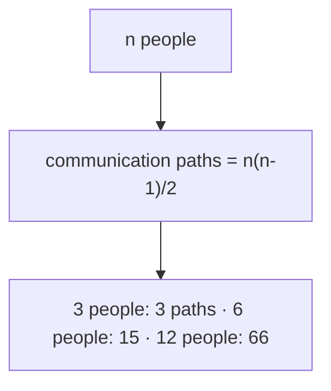
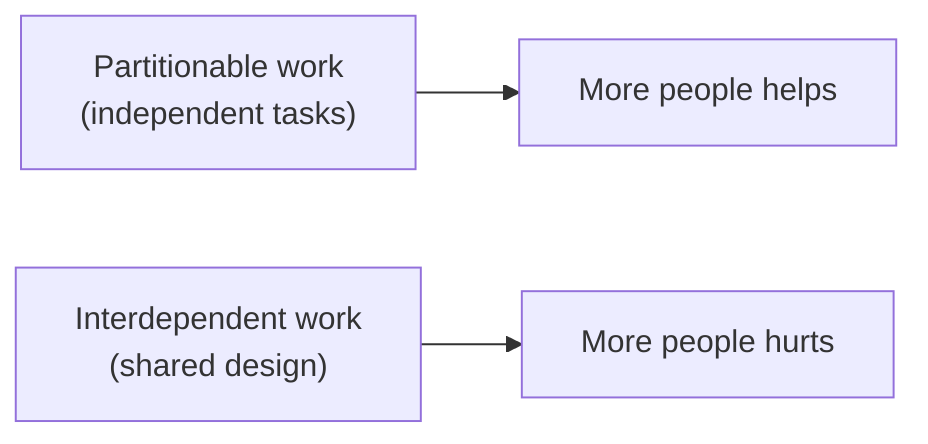
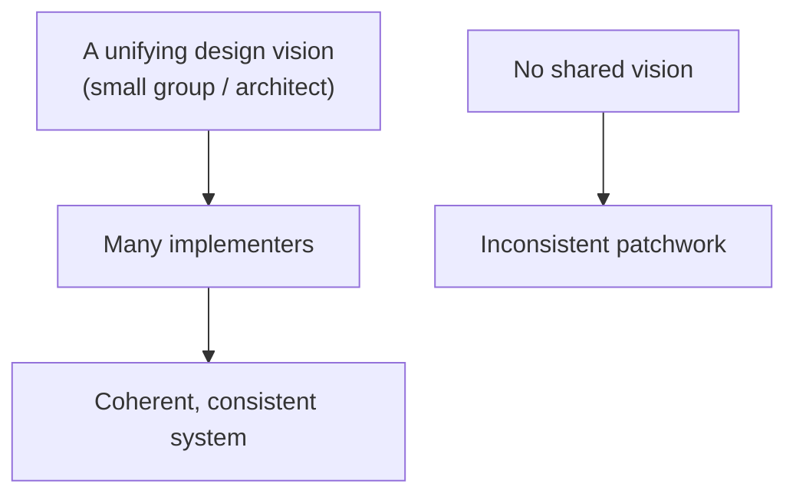
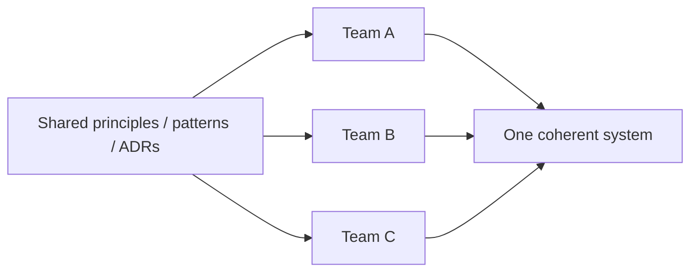

# Software Project Realities - Complete Professional Guide

> **Category:** 04_engineering_and_practices · **Language:** English

---

### Why adding people to a late project makes it later, and other hard truths
**Original guide written from first principles, current to 2026**

> **Original reference book (English).** This is an **independent, originally written** guide. It is not an extract, summary, or paraphrase of any third-party book; it teaches software-project dynamics from first principles with original examples. Canonical books are listed under **References** as pointers only. Each chapter follows the TO-BRAIN editorial standard (see `FILE_CONVENTIONS.md`).
>
> **Scope notice:** software projects fail in predictable, human ways — communication overhead, lost conceptual integrity, no magic productivity bullet. This guide covers those durable realities and what they mean for planning teams and work in 2026.

---

## How to read this guide

| Level | Profile | Parts |
|-------|---------|-------|
| 1 — Beginner | New to project dynamics | Part I |
| 2 — Intermediate | Planning teams | Part II |

**Target audience:** tech leads, engineering managers, and senior engineers who plan work and staffing.

**Structure of each chapter:** Introduction · Business context · Theoretical concepts · Architecture · Diagrams (Mermaid) · Real examples · Step by step · Complete examples · Exercises · Challenges · Checklist · Best practices · Anti-patterns · Troubleshooting · References.

> **Note on prerequisites.** None beyond having worked on a team project.

---

## Table of Contents

**Part I – People and time**
1. Brooks's Law: communication overhead
2. Conceptual integrity

**Part II – Expectations**
3. No silver bullet: essential vs accidental complexity

> **Status of this guide:** phased delivery. **Ready:** Part I (Ch. 1–2). **In progress:** Part II.

---

## Part I – People and time

Software estimation and staffing fail for reasons that are decades old and stubbornly human. Two stand out: adding people to a late project usually makes it later (communication cost), and systems designed by many hands without a unifying vision lose coherence. Understanding these keeps you from "solutions" that backfire.

---

## Chapter 1 — Brooks's Law

### 1.1 Introduction

**Brooks's Law:** "Adding human resources to a late software project makes it later." The intuition that more people means faster delivery breaks down because new people need onboarding (which costs the existing team's time) and because **communication paths** grow combinatorially with team size. Beyond a point, coordination overhead swamps the added capacity.

### 1.2 Business context

The instinct under deadline pressure is to throw bodies at a late project — and it routinely makes things worse, burning budget while slipping further. Understanding Brooks's Law changes the response: re-scope, remove blockers, or accept the date, rather than adding people who must be trained by the very team that's already behind. It also argues for keeping teams small and stable to minimize the overhead in the first place.

### 1.3 Theoretical concepts: communication grows fast



Work that can be cleanly partitioned with little communication scales with people; work that is deeply interdependent does not, because adding a person adds coordination links faster than capacity. New members also have negative early productivity (they consume mentoring) before contributing.

### 1.4 Architecture: partitionable vs not



The lever is **how divisible the work is**. You can sometimes restructure work to be more partitionable (clear module boundaries, independent services), which is itself an argument for good architecture.

### 1.5 Real example

**Scenario.** A project is two weeks late; management adds three engineers.

**Problem.** The three need ramp-up on a complex codebase; senior engineers stop building to onboard them; communication paths jump.

**Solution.** Instead, cut scope to the essential, remove a blocker, and protect the existing team's focus.

**Implementation (the decision).**

```text
Late by 2 weeks. Options:
  A) Add 3 engineers -> -2 weeks of senior time to onboard; +paths -> LATER
  B) Cut non-essential scope to hit a viable release       -> on time
  C) Move the date with honest communication               -> realistic
Chosen: B (+ C as fallback). Do NOT add people now.
```

**Result.** The team avoided the Brooks's-Law trap; scope reduction delivered a viable release on time instead of a fuller one even later.

**Future improvements.** Add people *between* projects when there's time to onboard, and design work to be more partitionable.

### 1.6 Exercises

1. State Brooks's Law and the two mechanisms behind it.
2. Why do communication paths grow faster than people?
3. When does adding people actually help?

### 1.7 Challenges

- **Challenge.** Recall a late project. Was staff added? What happened to the existing team's output? Would re-scoping have served better?

### 1.8 Checklist

- [ ] I don't add people to a late, interdependent project.
- [ ] I account for onboarding cost to the existing team.
- [ ] I prefer re-scoping or moving dates to adding bodies.
- [ ] I keep teams small and work partitionable.

### 1.9 Best practices

- Respond to lateness with scope/date changes, not late hiring.
- Keep teams small; grow them between projects, not during crunch.
- Design work and architecture to be partitionable.

### 1.10 Anti-patterns

- Throwing people at a slipping deadline.
- Onboarding new hires during a crunch with no slack.
- Assuming productivity scales linearly with headcount.

### 1.11 Troubleshooting

| Symptom | Likely cause | Action |
|---------|--------------|--------|
| Adding people slowed delivery | Brooks's Law | Stop adding; re-scope or re-date |
| Team drowning in coordination | Too many communication paths | Shrink team; partition the work |
| New hires unproductive for weeks | Onboarding cost ignored | Plan ramp-up outside crunch |

### 1.12 References

- F. Brooks, *The Mythical Man-Month*, Anniversary ed. (Addison-Wesley, 1995) — ISBN 978-0201835953.
- "Accelerate" (Forsgren, Humble, Kim, 2018), on team structure and throughput.

---

## Chapter 2 — Conceptual integrity

### 2.1 Introduction

**Conceptual integrity** is the idea that a system should feel like it was designed by **one mind** — consistent, coherent, following a unifying set of ideas — even when many people build it. Brooks argued it is the single most important attribute of a quality system: a coherent design with fewer features beats a feature-rich grab-bag with no unifying vision.

### 2.2 Business context

Systems built by many hands without a shared vision become inconsistent and confusing — every team does things its own way, and users (and future developers) face a patchwork of conflicting concepts. Conceptual integrity makes a product learnable and a codebase navigable, lowering both user friction and developer onboarding cost. It is what makes a system feel "designed" rather than "accreted."

### 2.3 Theoretical concepts: unity of vision



Conceptual integrity usually requires concentrating the **design** decisions in a small group (or an architect) while many people implement — separating architecture from implementation. The unifying ideas (consistent patterns, naming, interaction model) are decided centrally so the whole hangs together.

### 2.4 Architecture: shared concepts and patterns



In 2026 practice, conceptual integrity is maintained with shared design principles, golden paths/paved roads, design systems, and ADRs — lightweight ways to keep many autonomous teams aligned to one vision without a bottleneck.

### 2.5 Real example

**Scenario.** Three teams each build part of a product UI independently.

**Problem.** Without shared conventions, each invents its own navigation, terminology, and error handling — users face three inconsistent products in one.

**Solution.** A small design-authority defines shared patterns (a design system, naming, interaction rules); teams implement within them.

**Implementation (alignment mechanism).**

```text
Shared (decided centrally):
  - design system (components, spacing, tone)
  - domain vocabulary (one word per concept)
  - error-handling & nav patterns
Teams implement features within these -> the product feels like one mind made it.
```

**Result.** The product is consistent and learnable; users transfer knowledge across areas, and developers reuse patterns instead of reinventing them.

**Future improvements.** Encode shared patterns as reusable components/linters so consistency is the path of least resistance.

### 2.6 Exercises

1. Define conceptual integrity and why Brooks valued it so highly.
2. Why does it often require concentrating design decisions?
3. How is it maintained across many autonomous teams today?

### 2.7 Challenges

- **Challenge.** Find an inconsistency in a product you work on (two ways to do the same thing). Trace it to a missing shared decision and propose where that decision should live.

### 2.8 Checklist

- [ ] The system follows a unifying set of concepts.
- [ ] Design decisions are coherent across teams.
- [ ] Shared patterns/vocabulary are defined centrally.
- [ ] Consistency is easier than divergence (tooling).

### 2.9 Best practices

- Concentrate key design decisions; distribute implementation.
- Maintain shared design systems, vocabularies, and ADRs.
- Make the consistent choice the easy default.

### 2.10 Anti-patterns

- Every team inventing its own conventions.
- Feature count prioritized over coherence.
- No owner of cross-cutting consistency.

### 2.11 Troubleshooting

| Symptom | Likely cause | Action |
|---------|--------------|--------|
| Product feels like several products | No conceptual integrity | Define and enforce shared patterns |
| Same concept, many names | No shared vocabulary | Establish one domain language |
| Inconsistent UX across areas | No design authority | Create a shared design system |

### 2.12 References

- F. Brooks, *The Mythical Man-Month*, Anniversary ed. (Addison-Wesley, 1995) — ISBN 978-0201835953.
- M. Skelton, M. Pais, *Team Topologies* (IT Revolution, 2019) — ISBN 978-1942788812.

---

> **End of Part I.** You can now reason about two durable project realities: Brooks's Law (adding people to a late, interdependent project makes it later, so respond by re-scoping rather than staffing up) and conceptual integrity (a system should feel designed by one mind, maintained by concentrating design decisions and sharing patterns). **Part II — Expectations** (Chapter 3) covers "No Silver Bullet" — the distinction between essential and accidental complexity, and why no single tool delivers an order-of-magnitude productivity jump.

<!--APPEND-PART-II-->
