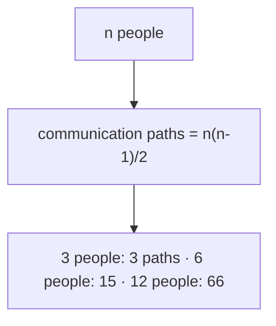
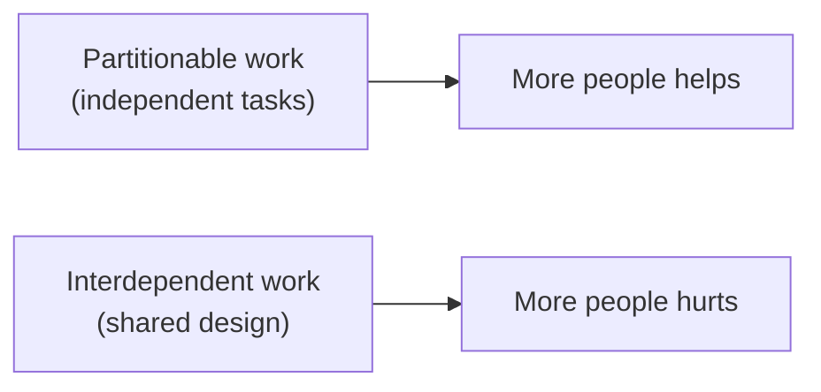
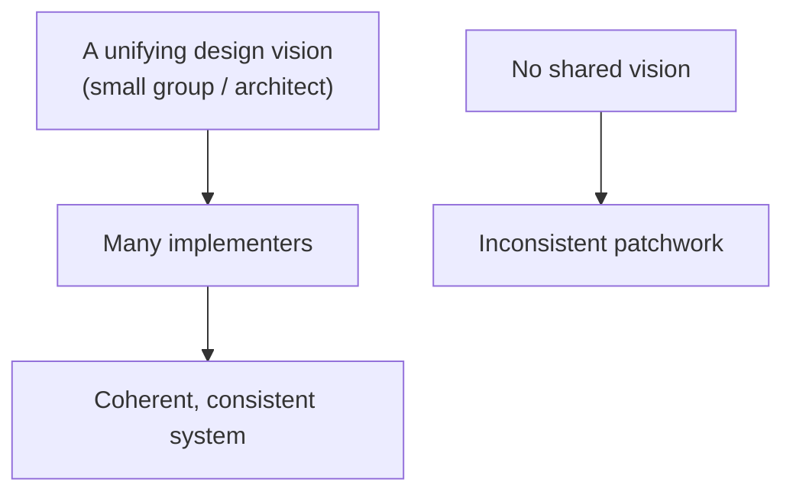
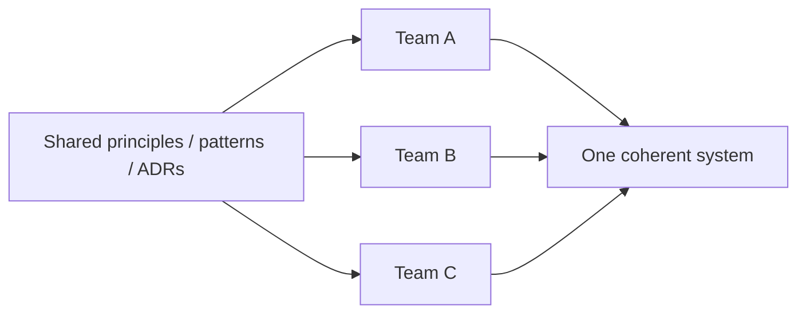
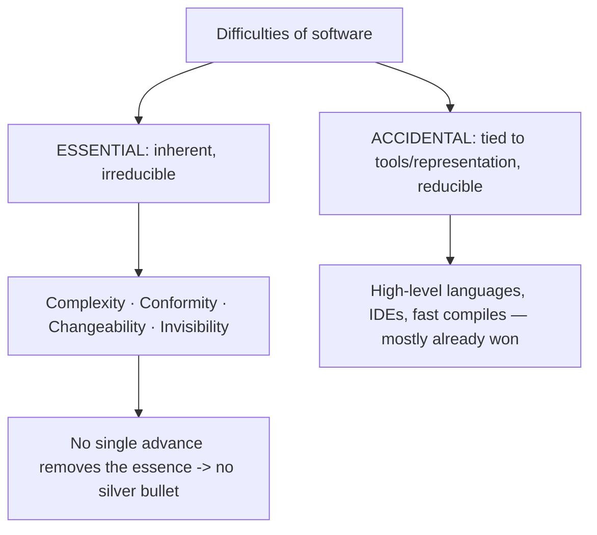
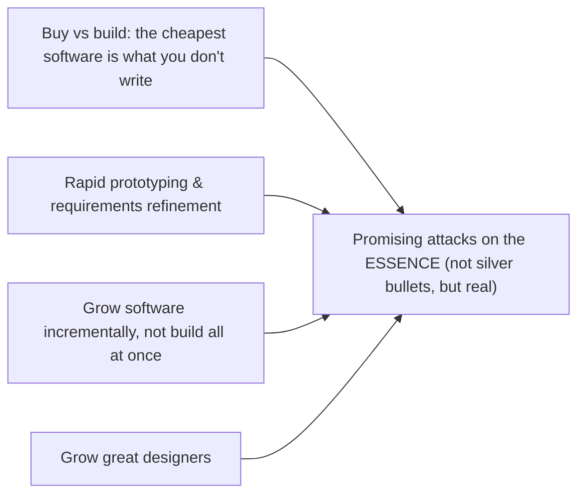

# Software Project Realities - Complete Professional Guide

> **Category:** 04_engineering_and_practices · **Language:** English

---

### Why adding people to a late project makes it later, and other hard truths
**Original guide written from first principles, current to 2026**

> **Original reference book (English).** This is an **independent, originally written** guide. It is not an extract, summary, or paraphrase of any third-party book; it teaches software-project dynamics from first principles with original examples. Canonical books are listed under **References** as pointers only. Each chapter follows the TO-BRAIN editorial standard (see `FILE_CONVENTIONS.md`).
>
> **Scope notice:** software projects fail in predictable, human ways — communication overhead, lost conceptual integrity, no magic productivity bullet. This guide covers those durable realities and what they mean for planning teams and work in 2026.

---

## How to read this guide

| Level | Profile | Parts |
|-------|---------|-------|
| 1 — Beginner | New to project dynamics | Part I |
| 2 — Intermediate | Planning teams | Part II |

**Target audience:** tech leads, engineering managers, and senior engineers who plan work and staffing.

**Structure of each chapter:** Introduction · Business context · Theoretical concepts · Architecture · Diagrams (Mermaid) · Real examples · Step by step · Complete examples · Exercises · Challenges · Checklist · Best practices · Anti-patterns · Troubleshooting · References.

> **Note on prerequisites.** None beyond having worked on a team project.

---

## Table of Contents

**Part I – People and time**
1. Brooks's Law: communication overhead
2. Conceptual integrity

**Part II – Expectations**
3. No silver bullet: essential vs accidental complexity

> **Status of this guide:** complete for its declared scope. **Ready:** Parts I–II (Ch. 1–3).

---

## Part I – People and time

Software estimation and staffing fail for reasons that are decades old and stubbornly human. Two stand out: adding people to a late project usually makes it later (communication cost), and systems designed by many hands without a unifying vision lose coherence. Understanding these keeps you from "solutions" that backfire.

---

## Chapter 1 — Brooks's Law

### 1.1 Introduction

**Brooks's Law:** "Adding human resources to a late software project makes it later." The intuition that more people means faster delivery breaks down because new people need onboarding (which costs the existing team's time) and because **communication paths** grow combinatorially with team size. Beyond a point, coordination overhead swamps the added capacity.

### 1.2 Business context

The instinct under deadline pressure is to throw bodies at a late project — and it routinely makes things worse, burning budget while slipping further. Understanding Brooks's Law changes the response: re-scope, remove blockers, or accept the date, rather than adding people who must be trained by the very team that's already behind. It also argues for keeping teams small and stable to minimize the overhead in the first place.

### 1.3 Theoretical concepts: communication grows fast



Work that can be cleanly partitioned with little communication scales with people; work that is deeply interdependent does not, because adding a person adds coordination links faster than capacity. New members also have negative early productivity (they consume mentoring) before contributing.

### 1.4 Architecture: partitionable vs not



The lever is **how divisible the work is**. You can sometimes restructure work to be more partitionable (clear module boundaries, independent services), which is itself an argument for good architecture.

### 1.5 Real example

**Scenario.** A project is two weeks late; management adds three engineers.

**Problem.** The three need ramp-up on a complex codebase; senior engineers stop building to onboard them; communication paths jump.

**Solution.** Instead, cut scope to the essential, remove a blocker, and protect the existing team's focus.

**Implementation (the decision).**

```text
Late by 2 weeks. Options:
  A) Add 3 engineers -> -2 weeks of senior time to onboard; +paths -> LATER
  B) Cut non-essential scope to hit a viable release       -> on time
  C) Move the date with honest communication               -> realistic
Chosen: B (+ C as fallback). Do NOT add people now.
```

**Result.** The team avoided the Brooks's-Law trap; scope reduction delivered a viable release on time instead of a fuller one even later.

**Future improvements.** Add people *between* projects when there's time to onboard, and design work to be more partitionable.

### 1.6 Exercises

1. State Brooks's Law and the two mechanisms behind it.
2. Why do communication paths grow faster than people?
3. When does adding people actually help?

### 1.7 Challenges

- **Challenge.** Recall a late project. Was staff added? What happened to the existing team's output? Would re-scoping have served better?

### 1.8 Checklist

- [ ] I don't add people to a late, interdependent project.
- [ ] I account for onboarding cost to the existing team.
- [ ] I prefer re-scoping or moving dates to adding bodies.
- [ ] I keep teams small and work partitionable.

### 1.9 Best practices

- Respond to lateness with scope/date changes, not late hiring.
- Keep teams small; grow them between projects, not during crunch.
- Design work and architecture to be partitionable.

### 1.10 Anti-patterns

- Throwing people at a slipping deadline.
- Onboarding new hires during a crunch with no slack.
- Assuming productivity scales linearly with headcount.

### 1.11 Troubleshooting

| Symptom | Likely cause | Action |
|---------|--------------|--------|
| Adding people slowed delivery | Brooks's Law | Stop adding; re-scope or re-date |
| Team drowning in coordination | Too many communication paths | Shrink team; partition the work |
| New hires unproductive for weeks | Onboarding cost ignored | Plan ramp-up outside crunch |

### 1.12 References

- F. Brooks, *The Mythical Man-Month*, Anniversary ed. (Addison-Wesley, 1995) — ISBN 978-0201835953.
- "Accelerate" (Forsgren, Humble, Kim, 2018), on team structure and throughput.

---

## Chapter 2 — Conceptual integrity

### 2.1 Introduction

**Conceptual integrity** is the idea that a system should feel like it was designed by **one mind** — consistent, coherent, following a unifying set of ideas — even when many people build it. Brooks argued it is the single most important attribute of a quality system: a coherent design with fewer features beats a feature-rich grab-bag with no unifying vision.

### 2.2 Business context

Systems built by many hands without a shared vision become inconsistent and confusing — every team does things its own way, and users (and future developers) face a patchwork of conflicting concepts. Conceptual integrity makes a product learnable and a codebase navigable, lowering both user friction and developer onboarding cost. It is what makes a system feel "designed" rather than "accreted."

### 2.3 Theoretical concepts: unity of vision



Conceptual integrity usually requires concentrating the **design** decisions in a small group (or an architect) while many people implement — separating architecture from implementation. The unifying ideas (consistent patterns, naming, interaction model) are decided centrally so the whole hangs together.

### 2.4 Architecture: shared concepts and patterns



In 2026 practice, conceptual integrity is maintained with shared design principles, golden paths/paved roads, design systems, and ADRs — lightweight ways to keep many autonomous teams aligned to one vision without a bottleneck.

### 2.5 Real example

**Scenario.** Three teams each build part of a product UI independently.

**Problem.** Without shared conventions, each invents its own navigation, terminology, and error handling — users face three inconsistent products in one.

**Solution.** A small design-authority defines shared patterns (a design system, naming, interaction rules); teams implement within them.

**Implementation (alignment mechanism).**

```text
Shared (decided centrally):
  - design system (components, spacing, tone)
  - domain vocabulary (one word per concept)
  - error-handling & nav patterns
Teams implement features within these -> the product feels like one mind made it.
```

**Result.** The product is consistent and learnable; users transfer knowledge across areas, and developers reuse patterns instead of reinventing them.

**Future improvements.** Encode shared patterns as reusable components/linters so consistency is the path of least resistance.

### 2.6 Exercises

1. Define conceptual integrity and why Brooks valued it so highly.
2. Why does it often require concentrating design decisions?
3. How is it maintained across many autonomous teams today?

### 2.7 Challenges

- **Challenge.** Find an inconsistency in a product you work on (two ways to do the same thing). Trace it to a missing shared decision and propose where that decision should live.

### 2.8 Checklist

- [ ] The system follows a unifying set of concepts.
- [ ] Design decisions are coherent across teams.
- [ ] Shared patterns/vocabulary are defined centrally.
- [ ] Consistency is easier than divergence (tooling).

### 2.9 Best practices

- Concentrate key design decisions; distribute implementation.
- Maintain shared design systems, vocabularies, and ADRs.
- Make the consistent choice the easy default.

### 2.10 Anti-patterns

- Every team inventing its own conventions.
- Feature count prioritized over coherence.
- No owner of cross-cutting consistency.

### 2.11 Troubleshooting

| Symptom | Likely cause | Action |
|---------|--------------|--------|
| Product feels like several products | No conceptual integrity | Define and enforce shared patterns |
| Same concept, many names | No shared vocabulary | Establish one domain language |
| Inconsistent UX across areas | No design authority | Create a shared design system |

### 2.12 References

- F. Brooks, *The Mythical Man-Month*, Anniversary ed. (Addison-Wesley, 1995) — ISBN 978-0201835953.
- M. Skelton, M. Pais, *Team Topologies* (IT Revolution, 2019) — ISBN 978-1942788812.

---

> **End of Part I.** You can now reason about two durable project realities: Brooks's Law (adding people to a late, interdependent project makes it later, so respond by re-scoping rather than staffing up) and conceptual integrity (a system should feel designed by one mind, maintained by concentrating design decisions and sharing patterns). **Part II — Expectations** (Chapter 3) covers "No Silver Bullet" — the distinction between essential and accidental complexity, and why no single tool delivers an order-of-magnitude productivity jump.

## Part II – Expectations

Part I covered two realities about *people and time*: Brooks's Law and conceptual integrity. Part II addresses a reality about *expectations* — specifically, the recurring hope that some new tool, language, or method will multiply software productivity overnight. Brooks's essay "No Silver Bullet" is the durable answer: it explains *why* no single development will deliver an order-of-magnitude improvement in a decade, by separating the difficulties of software into those that are **essential** (inherent in the nature of software) and those that are **accidental** (incidental to today's tools and representations). Understanding which kind of difficulty you face tells you which investments can actually pay off — and which are chasing a werewolf with the wrong weapon.

---

## Chapter 3 — No silver bullet: essential vs accidental complexity

### 3.1 Introduction

Brooks divides the difficulties of building software into two categories. **Accidental** difficulties are not inherent in the problem; they arise from the *representation* and tools we happen to use — awkward syntax, machine-level memory management, slow batch compiles. **Essential** difficulties are baked into the nature of software itself, irreducible regardless of tooling. Brooks names four essential properties: **complexity** (software entities are more intricate per element than perhaps any other human construct, and the complexity grows nonlinearly with size), **conformity** (software must bend to the arbitrary, ever-changing rules of the human institutions and other systems it interfaces with), **changeability** (software is endlessly pressured to change because it is pure thought-stuff, seemingly easy to modify), and **invisibility** (software has no natural geometric representation, so we cannot *see* its structure the way we see a building's). His thesis: decades of progress (high-level languages, time-sharing, integrated environments) attacked the *accidental* difficulties and won large gains there — but those gains are largely spent, and what remains is *essential*, which no single breakthrough can remove. Hence "no silver bullet": no one technology or management technique will, by itself, yield even one order-of-magnitude improvement in productivity, reliability, or simplicity within a decade.

### 3.2 Business context

This is one of the most expensive lessons a software organization can learn the hard way. Every few years a vendor, framework, methodology, or — in our era — an AI tool is sold as the thing that will make development an order of magnitude faster. Teams reorganize around it, budgets shift, and the promised multiplier never materializes, because the tool attacked an *accidental* difficulty (typing speed, boilerplate) while the project's real cost was *essential* (understanding a tangled domain, conforming to regulatory rules, managing constant change). Brooks's framework lets leaders set honest expectations and direct investment wisely: spend on attacking essential difficulty — better requirements work, growing systems incrementally, buying rather than building, and cultivating great designers — rather than betting the roadmap on a single silver bullet. The discipline is not pessimism; it is refusing to mistake a productivity tool for a productivity *revolution*, and thereby avoiding the disappointment-and-blame cycle that follows over-promising.

### 3.3 Theoretical concepts: essence and accident



The essence/accident distinction (borrowed from Aristotle) is the analytical core. **Accidental** difficulty is whatever an improved representation can take away — and Brooks credits past advances with removing most of it: high-level languages abstracted away machine detail, time-sharing fixed the slow turnaround of batch processing, unified environments fixed tool incompatibility. Each was a real, large win. But each attacked accident, and you cannot win the same victory twice. **Essential** difficulty — the four properties — is what is left, and it is the *conceptual* work of specifying, designing, and testing the construct, which Brooks argues is the truly hard and time-consuming part. Because the essence dominates what remains, future productivity gains will be *incremental and hard-won*, not revolutionary; expecting otherwise misreads the nature of the problem.

### 3.4 Architecture: where to spend, since there's no silver bullet



Brooks doesn't end in despair; he names *promising attacks on the essential difficulties* — each a steady gain, none a silver bullet. **Buy versus build:** the most radical way to lower software cost is to not write it — purchase or reuse what exists, since the development cost is already amortized across many buyers. **Requirements refinement and rapid prototyping:** the hardest single part is deciding precisely *what* to build; iterating with a prototype attacks that head-on, because clients cannot fully specify requirements without seeing versions. **Incremental ("grow, don't build") development:** grow systems by adding function to a running skeleton, which improves morale and surfaces essential complexity early. **Great designers:** since the conceptual work dominates, the leverage is in people — the difference between great and average designers is enormous, so organizations should *grow* great designers deliberately. The architecture of investment, then, points at the essence — and accepts that progress there compounds slowly.

### 3.5 Real example

**Scenario.** A company's delivery is slow. Leadership proposes adopting a new framework promised to "double developer productivity," and reorganizes a quarter's roadmap around the migration.

**Problem.** The framework mainly eliminates boilerplate and speeds builds — *accidental* difficulty. But the team's actual bottleneck is essential: a convoluted billing domain nobody fully understands (complexity), rules that change every regulatory cycle (changeability + conformity), and a system whose structure no one can see (invisibility). The migration cost real time and delivered no multiplier, because it aimed at the wrong category of difficulty.

**Solution.** Re-target investment at the essence. Instead of (or before) the framework, fund: **rapid prototyping** of the billing changes with stakeholders to nail requirements; **buy** a vetted tax/rules engine rather than maintaining a bespoke one; **grow** the rewrite incrementally behind a running skeleton; and protect time for the two strongest domain designers to lead the conceptual design.

**Implementation.**

```text
Diagnose each proposed investment by the difficulty it attacks:
  new framework / less boilerplate ........ ACCIDENTAL  -> modest, one-time gain
  prototyping to fix requirements .......... ESSENTIAL   -> attacks "deciding what to build"
  buy a rules engine instead of building ... ESSENTIAL   -> removes the work entirely
  incremental growth of the rewrite ........ ESSENTIAL   -> surfaces complexity early
  growing great designers .................. ESSENTIAL   -> leverage on conceptual work
Expectation set with leadership: NO single item yields 10x in a decade.
Gains are real but incremental and must compound.
```

**Result.** Expectations are realistic, so there is no over-promise to be disappointed by. Effort flows to the essential difficulties — the prototype clarifies requirements, the bought engine deletes a maintenance burden, and the incremental rewrite de-risks delivery — producing steady improvement rather than a hoped-for miracle.

**Future improvements.** Keep applying the essence/accident test to every "game-changing" tool — including AI assistants, which genuinely reduce *accidental* effort (boilerplate, lookup) but leave the essential work of deciding, designing, and validating largely intact. Compound the incremental gains; don't wait for a bullet.

### 3.6 Exercises

1. Define essential versus accidental difficulty and give one example of each.
2. Name Brooks's four essential properties of software and explain one in your own words.
3. Why does Brooks claim past gains came mostly from attacking accidental difficulty — and why does that limit future gains?
4. List two of Brooks's "promising attacks" on the essence and why each helps.

### 3.7 Challenges

- **Challenge.** Take a tool or method currently promoted in your organization as a major productivity boost. Classify the difficulty it actually attacks as essential or accidental, and estimate the realistic ceiling of its benefit. Then propose one investment that attacks an *essential* difficulty in your project. Which is likely to matter more in two years?

### 3.8 Checklist

- [ ] I classify each proposed improvement as attacking essential or accidental difficulty.
- [ ] I set expectations that no single tool/method yields an order-of-magnitude gain in a decade.
- [ ] I direct investment toward essential difficulties (requirements, reuse, incremental growth, people).
- [ ] I prefer buying/reusing over building when it removes essential work.
- [ ] I treat productivity gains as incremental and compounding, not revolutionary.

### 3.9 Best practices

- Use the essence/accident test to evaluate every "silver bullet" before committing to it.
- Attack the hardest essential difficulty — deciding what to build — with prototyping and iteration.
- Buy or reuse software whenever it deletes essential work you'd otherwise own.
- Grow systems incrementally on a running skeleton, and grow great designers deliberately.

### 3.10 Anti-patterns

- Reorganizing the roadmap around a tool that only removes accidental difficulty.
- Promising stakeholders an order-of-magnitude productivity jump from one change.
- Building bespoke software where a bought/reused component would do.
- Treating slow, conceptual design work as overhead instead of the essential core.

### 3.11 Troubleshooting

| Symptom | Likely cause | Action |
|---------|--------------|--------|
| New tool adopted, productivity flat | It attacked accidental, not essential, difficulty | Re-target investment at essential difficulties |
| Requirements keep changing late | "Deciding what to build" left unaddressed | Rapid prototyping and iterative requirements refinement |
| System too tangled to change safely | Essential complexity + invisibility | Grow incrementally; invest in design and visualization |
| Repeated over-promise/disappointment cycle | Expecting a silver bullet | Set incremental-gain expectations using essence/accident |

### 3.12 References

- F. P. Brooks, "No Silver Bullet—Essence and Accident in Software Engineering" (1986), reprinted as ch. 16 (with "'No Silver Bullet' Refired" as ch. 17) in *The Mythical Man-Month: Essays on Software Engineering*, Anniversary Edition (Addison-Wesley, 1995) — ISBN 978-0201835953.
- F. P. Brooks, *The Mythical Man-Month* (Addison-Wesley, 1975) — the project-realities essays underpinning Part I — same ISBN family.

---

> **End of Part II.** You can now reason about productivity expectations with Brooks's framework: software difficulties split into **accidental** (tied to tools and representation — largely already conquered by high-level languages, IDEs, fast builds) and **essential** (inherent: **complexity, conformity, changeability, invisibility**). Because the essence dominates what remains and no single advance removes it, there is **no silver bullet** — no one tool or method yields an order-of-magnitude gain in a decade. The wise response is to aim investment at the essence — buy over build, prototype to fix requirements, grow systems incrementally, and grow great designers — and to expect steady, compounding gains rather than a miracle.
