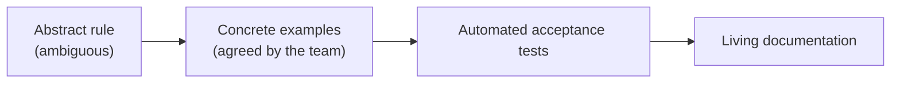
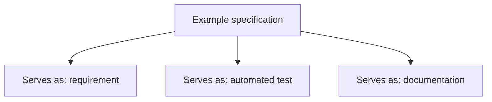
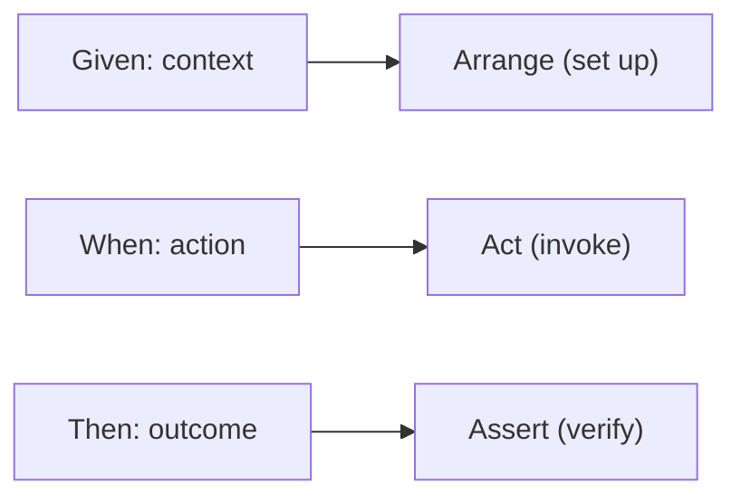
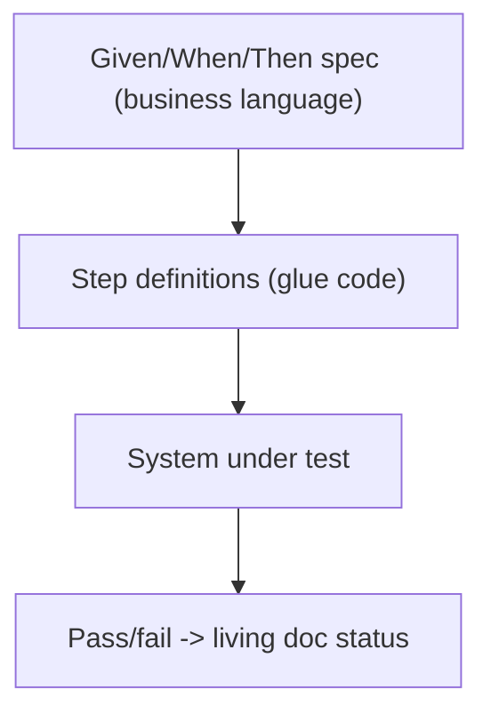
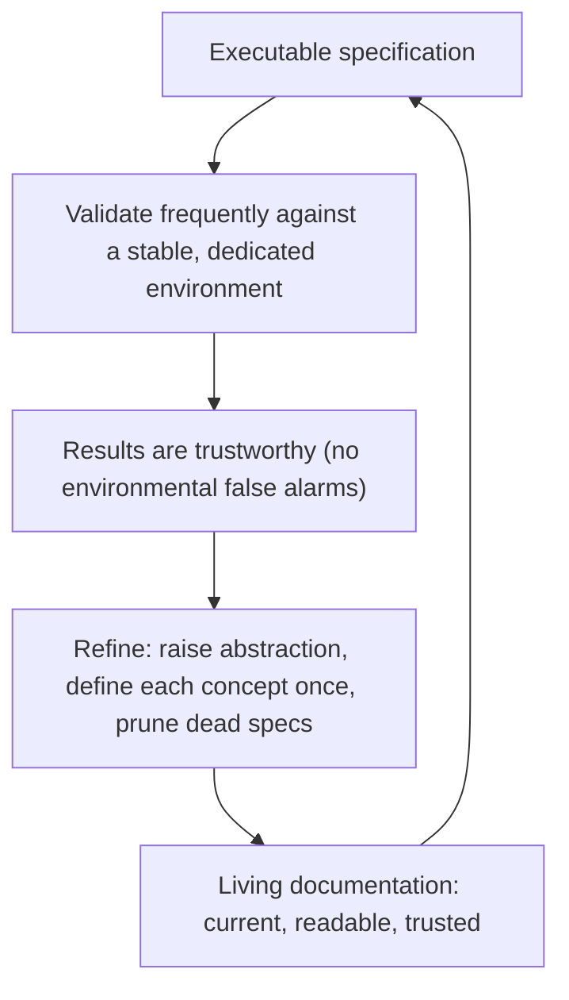
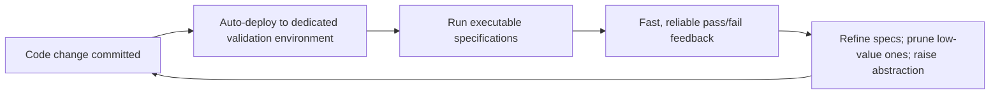

# Specification by Example - Complete Professional Guide

> **Category:** 04_engineering_and_practices · **Language:** English

---

### Turning requirements into executable, living documentation
**Original guide written from first principles, current to 2026**

> **Original reference book (English).** This is an **independent, originally written** guide. It is not an extract, summary, or paraphrase of any third-party book; it teaches specification by example from first principles with original examples. Canonical books are listed under **References** as pointers only. Each chapter follows the TO-BRAIN editorial standard (see `FILE_CONVENTIONS.md`).
>
> **Scope notice:** specification by example (SBE) — closely related to ATDD and BDD — defines requirements as concrete **examples** that become **automated tests** and stay as **living documentation**. This guide covers the practice, the Given/When/Then form, and how it keeps docs and code honest, current to 2026 tooling.

---

## How to read this guide

| Level | Profile | Parts |
|-------|---------|-------|
| 1 — Beginner | New to executable specs | Part I |
| 2 — Intermediate | Running the practice | Part II |

**Target audience:** developers, QA, product owners, and BAs who want shared, unambiguous requirements that don't rot.

**Structure of each chapter:** Introduction · Business context · Theoretical concepts · Architecture · Diagrams (Mermaid) · Real examples · Step by step · Complete examples · Exercises · Challenges · Checklist · Best practices · Anti-patterns · Troubleshooting · References.

> **Note on prerequisites.** Assumes acceptance-criteria basics and the TDD guide.

---

## Table of Contents

**Part I – The idea**
1. Examples as the shared language of requirements
2. Given/When/Then and executable specifications

**Part II – Living documentation**
3. Keeping specifications honest over time

> **Status of this guide:** complete for its declared scope. **Ready:** Parts I–II (Ch. 1–3).

---

## Part I – The idea

Requirements written as abstract rules ("the system shall apply appropriate discounts") are ambiguous and rot. SBE replaces them with **concrete examples** the whole team agrees on, which are then automated so they double as tests and as documentation that can never silently drift from the code — because if it drifts, the tests fail.

---

## Chapter 1 — Examples as shared language

### 1.1 Introduction

The core move of SBE is replacing abstract requirements with **concrete examples**: instead of "discounts apply for bulk orders," you write "ordering 10 units at €5 gives €45 (10% off)." Examples are unambiguous, testable, and understandable by business and developers alike — so they become the shared language that closes the gap between what was asked and what was built.

### 1.2 Business context

The most expensive software defects are misunderstood requirements — built exactly as specified, wrong for the business. Concrete examples surface these misunderstandings in conversation, before code, when they're free to fix. They also align everyone (product, dev, QA) on one precise definition of done, reducing rework and the "that's not what I meant" cycle that wastes whole sprints.

### 1.3 Theoretical concepts: from rules to examples



Key examples are chosen collaboratively (the "three amigos": business, development, testing) to cover the happy path, boundaries, and important error cases. Critically, you pick a **small set of illustrative** examples — not every combination — enough to pin the rule without drowning in cases.

### 1.4 Architecture: one artifact, three jobs



The same example does triple duty — it specifies, it verifies (when automated), and it documents. Because the test runs against the real system, the documentation is guaranteed current: a stale spec is a failing build.

### 1.5 Real example

**Scenario.** A bulk-discount rule for an order system.

**Problem.** "Apply bulk discounts" led two developers to implement different thresholds.

**Solution.** Pin the rule with agreed examples covering the boundary.

**Implementation (examples table).**

```text
Rule: 10% off when ordering 10+ identical units.

| units | unit price | expected total |
|-------|-----------|----------------|
|   9   |    5.00   |     45.00      |   # below threshold: no discount
|  10   |    5.00   |     45.00      |   # at threshold: 10% off (50 - 5)
|  20   |    5.00   |     90.00      |   # above: still 10% off
```

**Result.** The boundary (9 vs 10) is explicit and agreed; both developers now build the same behavior, and the table becomes the acceptance test.

**Future improvements.** Add an example for mixed items (does the rule apply per line or per order?) — likely a discovered ambiguity.

### 1.6 Exercises

1. Why are concrete examples less ambiguous than abstract rules?
2. Who should collaborate to choose key examples?
3. Why pick illustrative examples instead of all combinations?

### 1.7 Challenges

- **Challenge.** Take an acceptance criterion from your backlog. With a teammate, write 3–4 examples including a boundary. Did a hidden ambiguity surface?

### 1.8 Checklist

- [ ] I express requirements as concrete examples.
- [ ] Examples are agreed by business + dev + test.
- [ ] I cover happy path, boundaries, key errors.
- [ ] I choose a small illustrative set, not every case.

### 1.9 Best practices

- Derive examples collaboratively before coding.
- Include boundary and error examples, not just the happy path.
- Keep the example set minimal but illustrative.

### 1.10 Anti-patterns

- Abstract requirements with no concrete example.
- Examples written by one role in isolation.
- Combinatorial explosion of near-duplicate examples.

### 1.11 Troubleshooting

| Symptom | Likely cause | Action |
|---------|--------------|--------|
| Built wrong despite "clear" reqs | Abstract, unexampled rules | Pin with concrete agreed examples |
| Disagreement late in dev | Examples not collaborative | Use three-amigos to derive them |
| Too many brittle specs | Over-specified combinations | Trim to illustrative examples |

### 1.12 References

- G. Adzic, *Specification by Example* (Manning, 2011) — ISBN 978-1617290084.
- M. Wynne, A. Hellesøy, *The Cucumber Book*, 2nd ed. (Pragmatic Bookshelf, 2017) — ISBN 978-1680502381.

---

## Chapter 2 — Given/When/Then and executable specs

### 2.1 Introduction

Examples are commonly structured as **Given/When/Then**: *Given* a starting context, *When* an action occurs, *Then* an expected outcome. This format is readable by non-programmers yet maps directly to an automated test (arrange/act/assert), so a business-facing specification and a running test are the same artifact.

### 2.2 Business context

Given/When/Then gives business and technical people one shared, precise format, eliminating translation loss between a requirements document and a test plan. When these specs are automated, every build verifies that the system still does what the business specified — turning documentation from a stale liability into a continuously-checked asset and giving stakeholders trustworthy, current proof of behavior.

### 2.3 Theoretical concepts: structure maps to test



The three clauses correspond exactly to the arrange-act-assert structure of a test. The specification is written in domain language; "glue" code (step definitions) binds each clause to the system, so the same text both reads as a requirement and executes as a test.

### 2.4 Architecture: spec → glue → system



The business-readable spec stays stable; the glue code adapts to the system. If the system changes behavior, the spec fails until reconciled — keeping documentation truthful by construction.

### 2.5 Real example

**Scenario.** The bulk-discount rule as an executable spec.

**Problem.** The team wants the requirement and the test to be one thing.

**Solution.** A Given/When/Then scenario, automated via step definitions.

**Implementation.**

```gherkin
Scenario: Bulk discount applies at the threshold
  Given an item priced at 5.00
  When I order 10 units
  Then the order total should be 45.00
```

```java
// glue: binds the steps to the system (arrange/act/assert)
@Given("an item priced at {double}") void priced(double p) { item = new Item(p); }
@When("I order {int} units")        void order(int q)     { order = cart.add(item, q); }
@Then("the order total should be {double}") void total(double t) {
    assertEquals(Money.of(t), order.total());
}
```

**Result.** Product reads the scenario as the requirement; CI runs it as the test. They cannot diverge without the build going red.

**Future improvements.** Tag scenarios by feature; generate a living-documentation site from passing specs.

### 2.6 Exercises

1. Map Given/When/Then to the arrange-act-assert test phases.
2. What is "glue"/step-definition code for?
3. How does automation keep the documentation truthful?

### 2.7 Challenges

- **Challenge.** Convert one example from Chapter 1 into a Given/When/Then scenario and wire minimal glue so it runs against your system.

### 2.8 Checklist

- [ ] My specs use Given/When/Then in domain language.
- [ ] Specs are automated against the real system.
- [ ] Glue code, not the spec, adapts to system changes.
- [ ] A behavior change makes the spec fail until reconciled.

### 2.9 Best practices

- Keep scenarios in business language; hide mechanics in glue.
- Automate specs so docs are verified every build.
- Organize scenarios by feature for navigable living docs.

### 2.10 Anti-patterns

- Given/When/Then stuffed with UI/technical steps (brittle, unreadable).
- Specs written but never automated (rot like any doc).
- Glue logic leaking business rules that belong in the system.

### 2.11 Troubleshooting

| Symptom | Likely cause | Action |
|---------|--------------|--------|
| Scenarios brittle and technical | Mechanics in the spec | Move detail into glue; keep spec domain-level |
| Docs drifted from system | Specs not automated | Automate them in CI |
| Specs duplicate business logic | Rules in glue code | Keep rules in the system; glue only binds |

### 2.12 References

- G. Adzic, *Specification by Example* (Manning, 2011) — ISBN 978-1617290084.
- D. North, "Introducing BDD" (2006), https://dannorth.net/introducing-bdd/.

---

> **End of Part I.** You can now express requirements as concrete, collaboratively-agreed examples that serve simultaneously as specification, automated test, and living documentation, and structure them as Given/When/Then scenarios that map directly to executable tests. **Part II — Living documentation** (Chapter 3) covers organizing and maintaining specifications so they remain a trustworthy, current description of the system over time.

## Part II – Living documentation

Part I established examples as the shared language of requirements and Given/When/Then as their executable form. But an executable specification's greatest value — being simultaneously spec, test, and documentation — is also its greatest liability: documentation that drifts out of sync with the system is worse than none, because people trust it. Adzic's term **living documentation** names the goal: a body of specifications that stays a trustworthy, current description of what the system does, because it is *executed against the system continuously* and *actively maintained*. Part II is about the discipline that keeps specifications honest over time — frequent validation, a reliable environment, and continuous refinement — drawn from Adzic's process patterns and the uSwitch case study.

---

## Chapter 3 — Keeping specifications honest over time

### 3.1 Introduction

A specification becomes **living documentation** only if two things hold: it is **validated frequently** against the real system, and it is **continuously refined** to stay readable and reliable. Frequent validation is what proves the documentation still matches reality — a spec that hasn't been run against the current build is just a hopeful comment. Refinement is what keeps the suite trustworthy as it grows: raising the level of abstraction so specs speak the business's language rather than the UI's, defining each concept once instead of repeating it, and pruning specs that have stopped earning their keep. Adzic's patterns — *Validating frequently*, *Evolving a documentation system*, and *Refining the specification* — are the machinery. The uSwitch team's three-year journey shows the failure modes concretely: tests that "nobody knew what they did," unstable environments that made results meaningless, and brittle UI-coupled scripts that broke on cosmetic change. Each was a way specifications had stopped being honest, and each had a specific fix.

### 3.2 Business context

The business case for living documentation is *durable trust*. When specifications reliably describe the current system, anyone — a new developer, a business stakeholder, an operations engineer — can answer "what does the system do here?" without reading code or interrogating the one person who remembers. uSwitch's trigger was exactly this pain: a legacy energy rule nobody knew about, and no reliable documentation of a ten-year-old system. The flip side is the cost of *dishonest* documentation: specs that pass against a broken environment (false confidence), or fail for environmental reasons (false alarms that train the team to ignore red), both destroy the suite's value. Frequent, reliable validation converts specifications into a regression safety net that lets a team release small and often — uSwitch went from six-to-nine-week lead times to a four-day average — precisely because they could trust that a green suite meant a working system.

### 3.3 Theoretical concepts: honesty requires execution plus maintenance



Two forces keep a specification honest. **Frequent validation** is the proof of currency — Adzic stresses a *dedicated, automatically-deployed environment* for continuous validation, because uSwitch found that running specs against shared, unstable environments produced failures unrelated to the code, making every result ambiguous. Once the environment was stable, real instabilities in the *tests* became visible and fixable. **Refinement** is the proof of maintainability: uSwitch rewrote specs to remove browser-specific coupling ("user enters 100 in box _id" → "the user enters a valid amount"), defined concepts like "a valid amount" *once* and reused them, and evolved a consistent business language. Without refinement, a growing suite collapses under maintenance cost; without frequent validation against a clean environment, its results can't be trusted at all.

### 3.4 Architecture: the continuous-validation loop



The architecture that sustains living documentation is a **continuous-validation pipeline** feeding a **maintained specification system**. A dedicated environment, deployed automatically by the build system, runs the specifications on every change, so feedback is fast and free of cross-contamination from manual testing or developer experiments. Around it sits ongoing curation: raising the abstraction level (specs in domain language, not UI mechanics), factoring shared concepts into a single definition, and deliberately *pruning* — uSwitch's most debated decision was to stop running low-risk specs after a feature shipped, accepting weaker regression coverage in exchange for faster feedback, backed by production monitoring. The lesson is not "drop tests" but that the documentation system is *engineered and tended*, with conscious trade-offs, not left to accrete.

### 3.5 Real example

**Scenario.** A team has 800 Cucumber specifications driven through the UI. The suite takes two hours, fails intermittently for environmental reasons, and many specs assert on DOM identifiers.

**Problem.** The documentation has stopped being honest: failures are ambiguous (is it the code or the environment?), so the team has begun ignoring red builds — and the UI-coupled specs break on cosmetic changes that don't affect behavior.

**Solution.** Apply Adzic's patterns. Stand up a **dedicated validation environment** auto-deployed by CI so results are reliable. **Refine** specs to business language and define shared concepts once. **Prune** low-value, slow specs from the continuous run, relying on production monitoring for those areas.

**Implementation.**

```gherkin
# BEFORE — brittle, UI-coupled, opaque (dishonest documentation)
When the user enters "100" in box "#amount_id"
And clicks element "#submit_btn_2"
Then element "#result" shows "Approved"

# AFTER — business language; "a valid amount" defined ONCE elsewhere and reused
Scenario: A valid top-up is approved
  When the customer tops up with a valid amount
  Then the top-up is approved
# Validity rules (negative, letters, limits) live in ONE specification, not repeated here.
# Pipeline: CI auto-deploys to a dedicated env, runs specs, returns reliable pass/fail in ~15 min.
```

**Result.** Failures now mean something (clean environment), specs survive UI tweaks (business language), and feedback drops from two hours toward minutes (pruning + abstraction). The team trusts red again — the documentation is honest, and a green run credibly means a working system.

**Future improvements.** Periodically review which specs still earn their place; re-enable a pruned spec when work touches its area and clean it up then; and keep evolving the shared domain vocabulary so new specs are written in it from the start rather than retrofitted.

### 3.6 Exercises

1. Why is out-of-date executable documentation more dangerous than no documentation?
2. What problem does a *dedicated* continuous-validation environment solve that a shared one does not?
3. How does raising the abstraction level of a specification reduce its maintenance cost?
4. State the trade-off uSwitch made by not running every specification frequently, and what mitigated the risk.

### 3.7 Challenges

- **Challenge.** Take a brittle, UI-coupled acceptance test. Rewrite it in business language, extracting one shared concept (like "a valid amount") into a single specification reused elsewhere. Then identify a specification in your suite that no longer earns its keep and justify either refining or retiring it. What did honesty cost, and what did it buy?

### 3.8 Checklist

- [ ] Specifications are validated frequently against the current system.
- [ ] A dedicated, auto-deployed environment makes validation results reliable.
- [ ] Specs are written in business language, not UI/implementation mechanics.
- [ ] Each concept is defined once and reused, not duplicated across specs.
- [ ] Low-value specs are consciously refined or pruned, with the trade-off understood.

### 3.9 Best practices

- Run executable specifications continuously on a stable, dedicated environment.
- Refine specs toward domain language and a consistent, evolving vocabulary.
- Define shared concepts in one place; reference them everywhere else.
- Treat the documentation system as engineered — curate, prune, and raise abstraction deliberately.

### 3.10 Anti-patterns

- Specs nobody understands or trusts ("a complete waste of time").
- Validating against unstable shared environments, making failures ambiguous.
- UI/DOM-coupled specifications that break on cosmetic change.
- Letting the suite grow without refinement until maintenance cost overwhelms its value.

### 3.11 Troubleshooting

| Symptom | Likely cause | Action |
|---------|--------------|--------|
| Team ignores red builds | Flaky results from an unstable environment | Use a dedicated, auto-deployed validation environment |
| Specs break on cosmetic UI changes | Tests coupled to DOM/implementation | Rewrite in business language; raise abstraction |
| Same rule repeated across many specs | No single definition of the concept | Define it once; reference it elsewhere |
| Suite too slow for frequent feedback | Every spec run regardless of value | Prune/disable low-risk specs; rely on monitoring |
| Nobody trusts what a spec means | Drifted, unmaintained documentation | Validate frequently and refine continuously |

### 3.12 References

- G. Adzic, *Specification by Example: How Successful Teams Deliver the Right Software* (Manning, 2011) — process patterns *Validating frequently*, *Evolving a documentation system*, *Refining the specification*; ch. 12 case study (uSwitch) — ISBN 978-1617290084.
- M. Wynne, A. Hellesøy, *The Cucumber Book* (Pragmatic Bookshelf, 2012) — ISBN 978-1934356807.

---

> **End of Part II.** You can now keep specifications *honest* so they become **living documentation**: **validate frequently** against a stable, dedicated environment so results are trustworthy, and **refine continuously** — raise the abstraction to business language, define each concept once, and consciously prune specs that no longer earn their keep. The uSwitch story shows the payoff and the failure modes: unreliable environments and brittle UI-coupled specs destroy trust, while a curated continuous-validation system turns specifications into a regression safety net that lets a team release small, often, and confidently.
