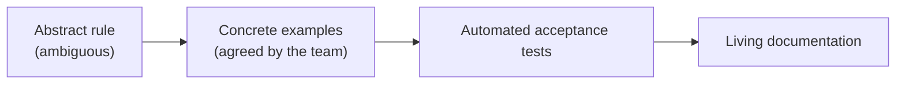
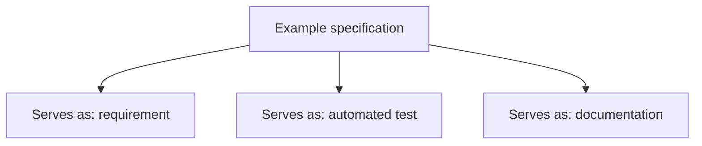
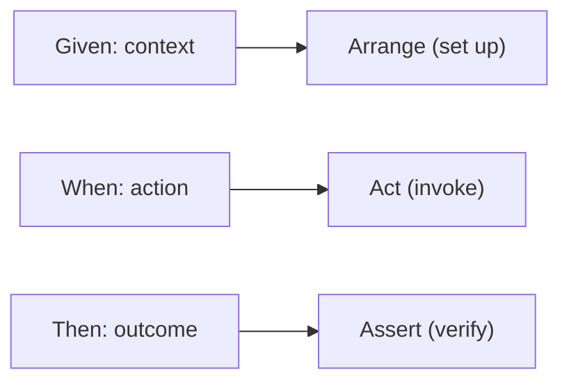
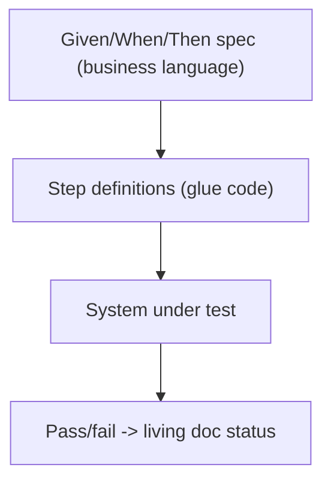

# Specification by Example - Complete Professional Guide

> **Category:** 04_engineering_and_practices · **Language:** English

---

### Turning requirements into executable, living documentation
**Original guide written from first principles, current to 2026**

> **Original reference book (English).** This is an **independent, originally written** guide. It is not an extract, summary, or paraphrase of any third-party book; it teaches specification by example from first principles with original examples. Canonical books are listed under **References** as pointers only. Each chapter follows the TO-BRAIN editorial standard (see `FILE_CONVENTIONS.md`).
>
> **Scope notice:** specification by example (SBE) — closely related to ATDD and BDD — defines requirements as concrete **examples** that become **automated tests** and stay as **living documentation**. This guide covers the practice, the Given/When/Then form, and how it keeps docs and code honest, current to 2026 tooling.

---

## How to read this guide

| Level | Profile | Parts |
|-------|---------|-------|
| 1 — Beginner | New to executable specs | Part I |
| 2 — Intermediate | Running the practice | Part II |

**Target audience:** developers, QA, product owners, and BAs who want shared, unambiguous requirements that don't rot.

**Structure of each chapter:** Introduction · Business context · Theoretical concepts · Architecture · Diagrams (Mermaid) · Real examples · Step by step · Complete examples · Exercises · Challenges · Checklist · Best practices · Anti-patterns · Troubleshooting · References.

> **Note on prerequisites.** Assumes acceptance-criteria basics and the TDD guide.

---

## Table of Contents

**Part I – The idea**
1. Examples as the shared language of requirements
2. Given/When/Then and executable specifications

**Part II – Living documentation**
3. Keeping specifications honest over time

> **Status of this guide:** phased delivery. **Ready:** Part I (Ch. 1–2). **In progress:** Part II.

---

## Part I – The idea

Requirements written as abstract rules ("the system shall apply appropriate discounts") are ambiguous and rot. SBE replaces them with **concrete examples** the whole team agrees on, which are then automated so they double as tests and as documentation that can never silently drift from the code — because if it drifts, the tests fail.

---

## Chapter 1 — Examples as shared language

### 1.1 Introduction

The core move of SBE is replacing abstract requirements with **concrete examples**: instead of "discounts apply for bulk orders," you write "ordering 10 units at €5 gives €45 (10% off)." Examples are unambiguous, testable, and understandable by business and developers alike — so they become the shared language that closes the gap between what was asked and what was built.

### 1.2 Business context

The most expensive software defects are misunderstood requirements — built exactly as specified, wrong for the business. Concrete examples surface these misunderstandings in conversation, before code, when they're free to fix. They also align everyone (product, dev, QA) on one precise definition of done, reducing rework and the "that's not what I meant" cycle that wastes whole sprints.

### 1.3 Theoretical concepts: from rules to examples



Key examples are chosen collaboratively (the "three amigos": business, development, testing) to cover the happy path, boundaries, and important error cases. Critically, you pick a **small set of illustrative** examples — not every combination — enough to pin the rule without drowning in cases.

### 1.4 Architecture: one artifact, three jobs



The same example does triple duty — it specifies, it verifies (when automated), and it documents. Because the test runs against the real system, the documentation is guaranteed current: a stale spec is a failing build.

### 1.5 Real example

**Scenario.** A bulk-discount rule for an order system.

**Problem.** "Apply bulk discounts" led two developers to implement different thresholds.

**Solution.** Pin the rule with agreed examples covering the boundary.

**Implementation (examples table).**

```text
Rule: 10% off when ordering 10+ identical units.

| units | unit price | expected total |
|-------|-----------|----------------|
|   9   |    5.00   |     45.00      |   # below threshold: no discount
|  10   |    5.00   |     45.00      |   # at threshold: 10% off (50 - 5)
|  20   |    5.00   |     90.00      |   # above: still 10% off
```

**Result.** The boundary (9 vs 10) is explicit and agreed; both developers now build the same behavior, and the table becomes the acceptance test.

**Future improvements.** Add an example for mixed items (does the rule apply per line or per order?) — likely a discovered ambiguity.

### 1.6 Exercises

1. Why are concrete examples less ambiguous than abstract rules?
2. Who should collaborate to choose key examples?
3. Why pick illustrative examples instead of all combinations?

### 1.7 Challenges

- **Challenge.** Take an acceptance criterion from your backlog. With a teammate, write 3–4 examples including a boundary. Did a hidden ambiguity surface?

### 1.8 Checklist

- [ ] I express requirements as concrete examples.
- [ ] Examples are agreed by business + dev + test.
- [ ] I cover happy path, boundaries, key errors.
- [ ] I choose a small illustrative set, not every case.

### 1.9 Best practices

- Derive examples collaboratively before coding.
- Include boundary and error examples, not just the happy path.
- Keep the example set minimal but illustrative.

### 1.10 Anti-patterns

- Abstract requirements with no concrete example.
- Examples written by one role in isolation.
- Combinatorial explosion of near-duplicate examples.

### 1.11 Troubleshooting

| Symptom | Likely cause | Action |
|---------|--------------|--------|
| Built wrong despite "clear" reqs | Abstract, unexampled rules | Pin with concrete agreed examples |
| Disagreement late in dev | Examples not collaborative | Use three-amigos to derive them |
| Too many brittle specs | Over-specified combinations | Trim to illustrative examples |

### 1.12 References

- G. Adzic, *Specification by Example* (Manning, 2011) — ISBN 978-1617290084.
- M. Wynne, A. Hellesøy, *The Cucumber Book*, 2nd ed. (Pragmatic Bookshelf, 2017) — ISBN 978-1680502381.

---

## Chapter 2 — Given/When/Then and executable specs

### 2.1 Introduction

Examples are commonly structured as **Given/When/Then**: *Given* a starting context, *When* an action occurs, *Then* an expected outcome. This format is readable by non-programmers yet maps directly to an automated test (arrange/act/assert), so a business-facing specification and a running test are the same artifact.

### 2.2 Business context

Given/When/Then gives business and technical people one shared, precise format, eliminating translation loss between a requirements document and a test plan. When these specs are automated, every build verifies that the system still does what the business specified — turning documentation from a stale liability into a continuously-checked asset and giving stakeholders trustworthy, current proof of behavior.

### 2.3 Theoretical concepts: structure maps to test



The three clauses correspond exactly to the arrange-act-assert structure of a test. The specification is written in domain language; "glue" code (step definitions) binds each clause to the system, so the same text both reads as a requirement and executes as a test.

### 2.4 Architecture: spec → glue → system



The business-readable spec stays stable; the glue code adapts to the system. If the system changes behavior, the spec fails until reconciled — keeping documentation truthful by construction.

### 2.5 Real example

**Scenario.** The bulk-discount rule as an executable spec.

**Problem.** The team wants the requirement and the test to be one thing.

**Solution.** A Given/When/Then scenario, automated via step definitions.

**Implementation.**

```gherkin
Scenario: Bulk discount applies at the threshold
  Given an item priced at 5.00
  When I order 10 units
  Then the order total should be 45.00
```

```java
// glue: binds the steps to the system (arrange/act/assert)
@Given("an item priced at {double}") void priced(double p) { item = new Item(p); }
@When("I order {int} units")        void order(int q)     { order = cart.add(item, q); }
@Then("the order total should be {double}") void total(double t) {
    assertEquals(Money.of(t), order.total());
}
```

**Result.** Product reads the scenario as the requirement; CI runs it as the test. They cannot diverge without the build going red.

**Future improvements.** Tag scenarios by feature; generate a living-documentation site from passing specs.

### 2.6 Exercises

1. Map Given/When/Then to the arrange-act-assert test phases.
2. What is "glue"/step-definition code for?
3. How does automation keep the documentation truthful?

### 2.7 Challenges

- **Challenge.** Convert one example from Chapter 1 into a Given/When/Then scenario and wire minimal glue so it runs against your system.

### 2.8 Checklist

- [ ] My specs use Given/When/Then in domain language.
- [ ] Specs are automated against the real system.
- [ ] Glue code, not the spec, adapts to system changes.
- [ ] A behavior change makes the spec fail until reconciled.

### 2.9 Best practices

- Keep scenarios in business language; hide mechanics in glue.
- Automate specs so docs are verified every build.
- Organize scenarios by feature for navigable living docs.

### 2.10 Anti-patterns

- Given/When/Then stuffed with UI/technical steps (brittle, unreadable).
- Specs written but never automated (rot like any doc).
- Glue logic leaking business rules that belong in the system.

### 2.11 Troubleshooting

| Symptom | Likely cause | Action |
|---------|--------------|--------|
| Scenarios brittle and technical | Mechanics in the spec | Move detail into glue; keep spec domain-level |
| Docs drifted from system | Specs not automated | Automate them in CI |
| Specs duplicate business logic | Rules in glue code | Keep rules in the system; glue only binds |

### 2.12 References

- G. Adzic, *Specification by Example* (Manning, 2011) — ISBN 978-1617290084.
- D. North, "Introducing BDD" (2006), https://dannorth.net/introducing-bdd/.

---

> **End of Part I.** You can now express requirements as concrete, collaboratively-agreed examples that serve simultaneously as specification, automated test, and living documentation, and structure them as Given/When/Then scenarios that map directly to executable tests. **Part II — Living documentation** (Chapter 3) covers organizing and maintaining specifications so they remain a trustworthy, current description of the system over time.

<!--APPEND-PART-II-->
