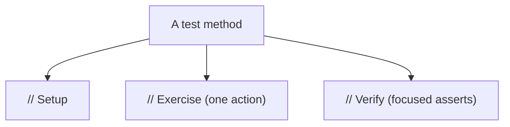
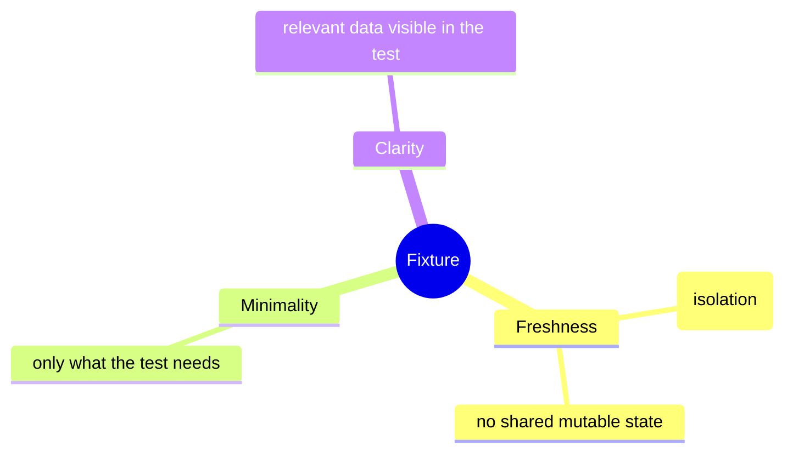
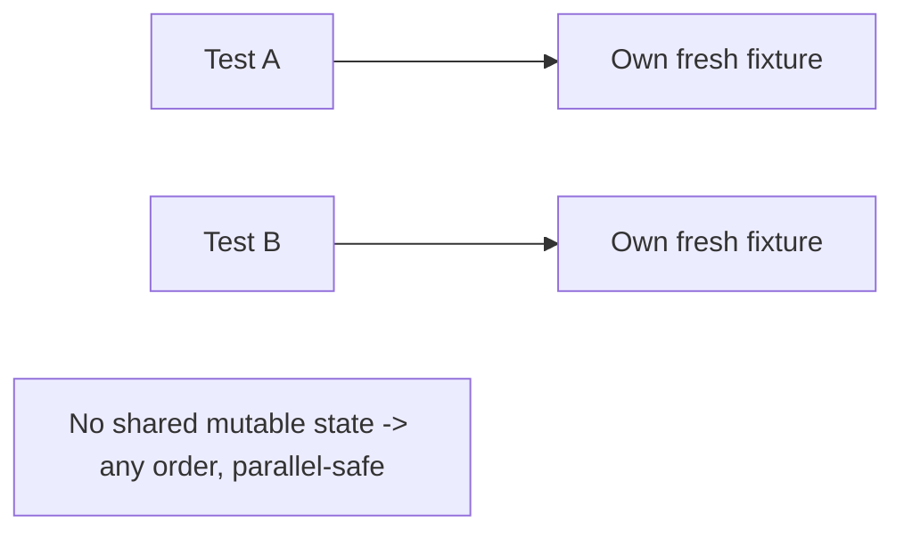

# Test Patterns and Smells - Complete Professional Guide

> **Category:** 04_engineering_and_practices · **Language:** English

---

### Fixtures, the four-phase test, and the smells that rot a suite
**Original guide written from first principles, current to 2026**

> **Original reference book (English).** This is an **independent, originally written** guide. It is not an extract, summary, or paraphrase of any third-party book; it teaches test patterns and smells from first principles with original examples. Canonical books are listed under **References** as pointers only. Each chapter follows the TO-BRAIN editorial standard (see `FILE_CONVENTIONS.md`).
>
> **Scope notice:** test code is real code and rots like any other without care. This guide covers patterns that keep tests clear and maintainable (four-phase test, fixtures) and the common **test smells** that signal trouble — current to 2026.

---

## How to read this guide

| Level | Profile | Parts |
|-------|---------|-------|
| 1 — Beginner | Structuring tests | Part I |
| 2 — Intermediate | Diagnosing smells | Part II |

**Target audience:** developers who want a test suite that stays readable and trustworthy as it grows.

**Structure of each chapter:** Introduction · Business context · Theoretical concepts · Architecture · Diagrams (Mermaid) · Real examples · Step by step · Complete examples · Exercises · Challenges · Checklist · Best practices · Anti-patterns · Troubleshooting · References.

> **Note on prerequisites.** Assumes a unit-testing framework and the unit-testing-principles guide.

---

## Table of Contents

**Part I – Structure**
1. The four-phase test
2. Fixtures: setting up test state

**Part II – Diagnosis**
3. Common test smells and their cures

> **Status of this guide:** phased delivery. **Ready:** Part I (Ch. 1–2). **In progress:** Part II.

---

## Part I – Structure

Tests earn their keep only if they stay readable and reliable. The patterns here give tests a consistent shape and a sane approach to setup, so a reader can understand any test at a glance and the suite doesn't collapse under its own weight.

---

## Chapter 1 — The four-phase test

### 1.1 Introduction

A clear test has four phases: **Setup** (arrange the state and inputs), **Exercise** (invoke the behavior under test), **Verify** (assert the outcome), and **Teardown** (release any resources). Making these phases visible — often just by spacing — lets a reader instantly see what's being set up, what's being tested, and what's expected.

### 1.2 Business context

Tests are read constantly — when they fail, when behavior changes, when newcomers learn the system. A consistent structure slashes the time to understand a test and to diagnose a failure, which is most of a suite's ongoing cost. Unstructured tests where setup, action, and assertion are tangled are slow to read and easy to misjudge, quietly eroding the suite's value.

### 1.3 Theoretical concepts: arrange-act-assert


The phases are also known as **Arrange-Act-Assert**. Keep them in order and visually separated; ideally one **Exercise** call and a focused **Verify** so the test's intent — "do X, expect Y" — is unmistakable. Teardown is often automatic (the framework/GC), explicit only for external resources.

### 1.4 Architecture: one behavior, clearly staged



A reader scanning the method sees the story in three beats. If the Exercise isn't a single clear action, or Verify checks many unrelated things, that's a sign to split the test.

### 1.5 Real example

**Scenario.** A test mixes setup, multiple actions, and scattered assertions.

**Problem.** It's hard to tell what's actually under test.

**Solution.** Restructure into the four visible phases, one behavior.

**Implementation.**

```java
@Test void withdrawingReducesBalance() {
    // Setup (Arrange)
    Account account = new Account(100_00);

    // Exercise (Act) — one action
    account.withdraw(30_00);

    // Verify (Assert) — focused
    assertEquals(70_00, account.balanceCents());
    // Teardown: none needed (no external resources)
}
```

**Result.** Anyone reading sees the setup, the single action, and the expectation in three beats — failures are instantly interpretable.

**Future improvements.** If you need to test overdraw, write a *separate* four-phase test rather than adding actions here.

### 1.6 Exercises

1. Name the four phases of a test and what each does.
2. Why prefer a single Exercise action per test?
3. When is explicit Teardown necessary?

### 1.7 Challenges

- **Challenge.** Find a tangled test. Restructure it into clearly separated Setup/Exercise/Verify phases with one action. Is its intent now obvious?

### 1.8 Checklist

- [ ] My tests show clear Setup/Exercise/Verify phases.
- [ ] Each test exercises one behavior with one action.
- [ ] Assertions are focused on that behavior.
- [ ] Teardown handles any external resources.

### 1.9 Best practices

- Separate the phases visually (blank lines/comments).
- One action, focused assertions, one behavior per test.
- Let the framework handle teardown unless external resources are involved.

### 1.10 Anti-patterns

- Interleaved setup, actions, and assertions.
- Multiple unrelated actions and assertions in one test.
- Manual teardown where the framework would do it.

### 1.11 Troubleshooting

| Symptom | Likely cause | Action |
|---------|--------------|--------|
| Hard to tell what a test checks | Tangled phases | Restructure into Arrange-Act-Assert |
| Failure is ambiguous | Many behaviors in one test | Split into focused tests |
| Leaked resources between tests | Missing teardown | Add explicit cleanup for externals |

### 1.12 References

- G. Meszaros, *xUnit Test Patterns* (Addison-Wesley, 2007) — ISBN 978-0131495050.
- K. Beck, *Test-Driven Development by Example* (Addison-Wesley, 2002) — ISBN 978-0321146533.

---

## Chapter 2 — Fixtures

### 2.1 Introduction

A **fixture** is the known state a test runs against — the objects and data set up before the Exercise phase. How you build fixtures hugely affects test clarity and reliability. The goals: each test's fixture is **obvious**, **minimal**, and **isolated** so tests don't interfere with each other.

### 2.2 Business context

Bad fixture management is a leading cause of flaky, slow, hard-to-read tests — shared mutable state causing order-dependent failures, or giant opaque setups nobody understands. Clean fixtures make tests independent (runnable in any order, in parallel) and self-explanatory, which keeps the suite fast and trustworthy. Trustworthy tests get run; flaky ones get ignored, defeating their purpose.

### 2.3 Theoretical concepts: fresh, minimal, clear



Prefer a **fresh fixture** per test (build the state the test needs, independent of others). Keep it **minimal** — only the data this behavior requires. Keep relevant values **visible in the test** (not hidden in distant shared setup) so the reader sees what matters. Use builders/helpers to keep construction concise without hiding the important bits.

### 2.4 Architecture: isolation by construction



When each test owns its state, tests can run in any order and in parallel without interference — the basis of a fast, reliable suite.

### 2.5 Real example

**Scenario.** Tests share one static `Account` object across methods.

**Problem.** One test's withdrawal changes the balance another test assumes — order-dependent flakiness.

**Solution.** Build a fresh fixture in each test (or via a per-test factory), with the relevant amount visible.

**Implementation.**

```java
// FLAKY: shared mutable fixture
static Account shared = new Account(100_00);   // tests step on each other

// CLEAN: fresh, minimal, visible fixture per test
@Test void withdrawWithinBalance() {
    Account account = anAccount().withBalanceCents(100_00).build();  // builder keeps it concise
    account.withdraw(40_00);
    assertEquals(60_00, account.balanceCents());
}
```

**Result.** Each test starts from its own known state; order no longer matters and the key amount (100_00) is right there in the test.

**Future improvements.** Provide a test-data builder with sensible defaults so only the values that matter are specified per test.

### 2.6 Exercises

1. What is a test fixture?
2. Why prefer a fresh fixture per test?
3. Why keep relevant fixture data visible in the test body?

### 2.7 Challenges

- **Challenge.** Find tests sharing mutable state. Give each its own fresh fixture (a builder helps). Run them in a random/parallel order and confirm they still pass.

### 2.8 Checklist

- [ ] Each test has a fresh, isolated fixture.
- [ ] Fixtures contain only what the test needs.
- [ ] Relevant data is visible in the test.
- [ ] Tests pass in any order and in parallel.

### 2.9 Best practices

- Default to fresh fixtures; avoid shared mutable state.
- Use test-data builders to stay concise yet explicit.
- Keep the values that matter visible at the call site.

### 2.10 Anti-patterns

- Shared mutable fixtures causing order-dependent tests.
- Giant opaque setup hiding what each test relies on.
- "Mystery guest": tests depending on hidden external data.

### 2.11 Troubleshooting

| Symptom | Likely cause | Action |
|---------|--------------|--------|
| Tests fail depending on order | Shared mutable fixture | Use fresh per-test fixtures |
| Can't tell what a test relies on | Hidden/distant setup | Make relevant data visible |
| Slow/flaky parallel runs | Shared state contention | Isolate fixtures per test |

### 2.12 References

- G. Meszaros, *xUnit Test Patterns* (Addison-Wesley, 2007) — ISBN 978-0131495050.
- V. Khorikov, *Unit Testing: Principles, Practices, and Patterns* (Manning, 2020) — ISBN 978-1617296277.

---

> **End of Part I.** You can now give tests a clear four-phase structure (Setup/Exercise/Verify/Teardown) so their intent is obvious, and manage fixtures to be fresh, minimal, and isolated so tests stay independent, fast, and readable. **Part II — Diagnosis** (Chapter 3) catalogs the common test smells — fragile tests, obscure tests, slow tests, erratic tests — and the concrete refactorings that cure each.

<!--APPEND-PART-II-->
