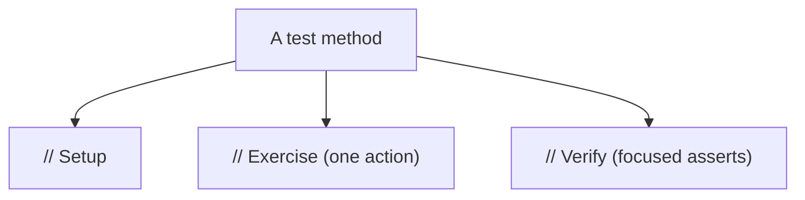
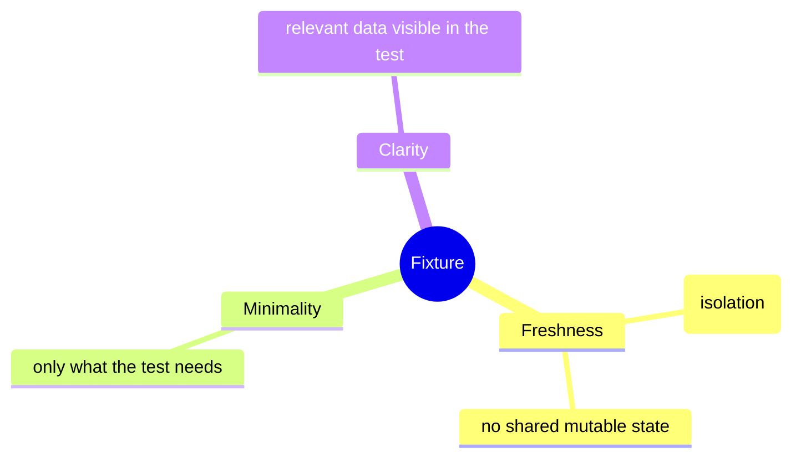
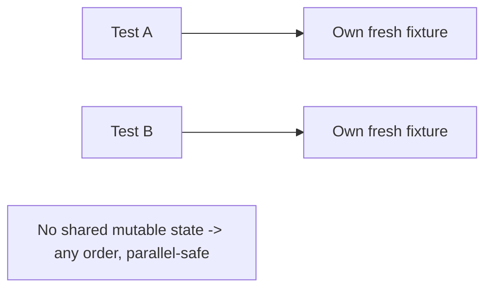
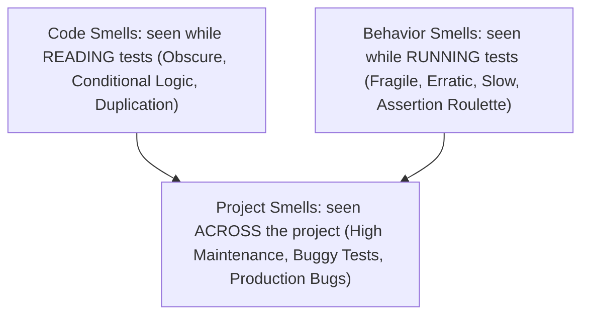
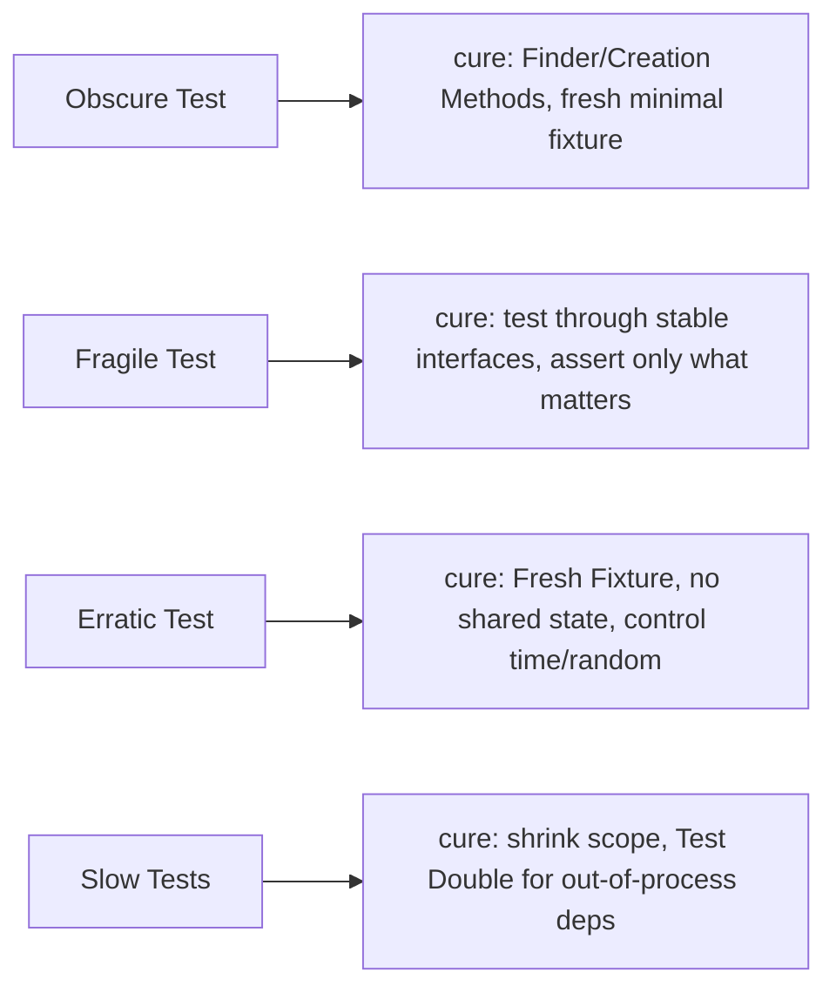

# Test Patterns and Smells - Complete Professional Guide

> **Category:** 04_engineering_and_practices · **Language:** English

---

### Fixtures, the four-phase test, and the smells that rot a suite
**Original guide written from first principles, current to 2026**

> **Original reference book (English).** This is an **independent, originally written** guide. It is not an extract, summary, or paraphrase of any third-party book; it teaches test patterns and smells from first principles with original examples. Canonical books are listed under **References** as pointers only. Each chapter follows the TO-BRAIN editorial standard (see `FILE_CONVENTIONS.md`).
>
> **Scope notice:** test code is real code and rots like any other without care. This guide covers patterns that keep tests clear and maintainable (four-phase test, fixtures) and the common **test smells** that signal trouble — current to 2026.

---

## How to read this guide

| Level | Profile | Parts |
|-------|---------|-------|
| 1 — Beginner | Structuring tests | Part I |
| 2 — Intermediate | Diagnosing smells | Part II |

**Target audience:** developers who want a test suite that stays readable and trustworthy as it grows.

**Structure of each chapter:** Introduction · Business context · Theoretical concepts · Architecture · Diagrams (Mermaid) · Real examples · Step by step · Complete examples · Exercises · Challenges · Checklist · Best practices · Anti-patterns · Troubleshooting · References.

> **Note on prerequisites.** Assumes a unit-testing framework and the unit-testing-principles guide.

---

## Table of Contents

**Part I – Structure**
1. The four-phase test
2. Fixtures: setting up test state

**Part II – Diagnosis**
3. Common test smells and their cures

> **Status of this guide:** complete for its declared scope. **Ready:** Parts I–II (Ch. 1–3).

---

## Part I – Structure

Tests earn their keep only if they stay readable and reliable. The patterns here give tests a consistent shape and a sane approach to setup, so a reader can understand any test at a glance and the suite doesn't collapse under its own weight.

---

## Chapter 1 — The four-phase test

### 1.1 Introduction

A clear test has four phases: **Setup** (arrange the state and inputs), **Exercise** (invoke the behavior under test), **Verify** (assert the outcome), and **Teardown** (release any resources). Making these phases visible — often just by spacing — lets a reader instantly see what's being set up, what's being tested, and what's expected.

### 1.2 Business context

Tests are read constantly — when they fail, when behavior changes, when newcomers learn the system. A consistent structure slashes the time to understand a test and to diagnose a failure, which is most of a suite's ongoing cost. Unstructured tests where setup, action, and assertion are tangled are slow to read and easy to misjudge, quietly eroding the suite's value.

### 1.3 Theoretical concepts: arrange-act-assert


The phases are also known as **Arrange-Act-Assert**. Keep them in order and visually separated; ideally one **Exercise** call and a focused **Verify** so the test's intent — "do X, expect Y" — is unmistakable. Teardown is often automatic (the framework/GC), explicit only for external resources.

### 1.4 Architecture: one behavior, clearly staged



A reader scanning the method sees the story in three beats. If the Exercise isn't a single clear action, or Verify checks many unrelated things, that's a sign to split the test.

### 1.5 Real example

**Scenario.** A test mixes setup, multiple actions, and scattered assertions.

**Problem.** It's hard to tell what's actually under test.

**Solution.** Restructure into the four visible phases, one behavior.

**Implementation.**

```java
@Test void withdrawingReducesBalance() {
    // Setup (Arrange)
    Account account = new Account(100_00);

    // Exercise (Act) — one action
    account.withdraw(30_00);

    // Verify (Assert) — focused
    assertEquals(70_00, account.balanceCents());
    // Teardown: none needed (no external resources)
}
```

**Result.** Anyone reading sees the setup, the single action, and the expectation in three beats — failures are instantly interpretable.

**Future improvements.** If you need to test overdraw, write a *separate* four-phase test rather than adding actions here.

### 1.6 Exercises

1. Name the four phases of a test and what each does.
2. Why prefer a single Exercise action per test?
3. When is explicit Teardown necessary?

### 1.7 Challenges

- **Challenge.** Find a tangled test. Restructure it into clearly separated Setup/Exercise/Verify phases with one action. Is its intent now obvious?

### 1.8 Checklist

- [ ] My tests show clear Setup/Exercise/Verify phases.
- [ ] Each test exercises one behavior with one action.
- [ ] Assertions are focused on that behavior.
- [ ] Teardown handles any external resources.

### 1.9 Best practices

- Separate the phases visually (blank lines/comments).
- One action, focused assertions, one behavior per test.
- Let the framework handle teardown unless external resources are involved.

### 1.10 Anti-patterns

- Interleaved setup, actions, and assertions.
- Multiple unrelated actions and assertions in one test.
- Manual teardown where the framework would do it.

### 1.11 Troubleshooting

| Symptom | Likely cause | Action |
|---------|--------------|--------|
| Hard to tell what a test checks | Tangled phases | Restructure into Arrange-Act-Assert |
| Failure is ambiguous | Many behaviors in one test | Split into focused tests |
| Leaked resources between tests | Missing teardown | Add explicit cleanup for externals |

### 1.12 References

- G. Meszaros, *xUnit Test Patterns* (Addison-Wesley, 2007) — ISBN 978-0131495050.
- K. Beck, *Test-Driven Development by Example* (Addison-Wesley, 2002) — ISBN 978-0321146533.

---

## Chapter 2 — Fixtures

### 2.1 Introduction

A **fixture** is the known state a test runs against — the objects and data set up before the Exercise phase. How you build fixtures hugely affects test clarity and reliability. The goals: each test's fixture is **obvious**, **minimal**, and **isolated** so tests don't interfere with each other.

### 2.2 Business context

Bad fixture management is a leading cause of flaky, slow, hard-to-read tests — shared mutable state causing order-dependent failures, or giant opaque setups nobody understands. Clean fixtures make tests independent (runnable in any order, in parallel) and self-explanatory, which keeps the suite fast and trustworthy. Trustworthy tests get run; flaky ones get ignored, defeating their purpose.

### 2.3 Theoretical concepts: fresh, minimal, clear



Prefer a **fresh fixture** per test (build the state the test needs, independent of others). Keep it **minimal** — only the data this behavior requires. Keep relevant values **visible in the test** (not hidden in distant shared setup) so the reader sees what matters. Use builders/helpers to keep construction concise without hiding the important bits.

### 2.4 Architecture: isolation by construction



When each test owns its state, tests can run in any order and in parallel without interference — the basis of a fast, reliable suite.

### 2.5 Real example

**Scenario.** Tests share one static `Account` object across methods.

**Problem.** One test's withdrawal changes the balance another test assumes — order-dependent flakiness.

**Solution.** Build a fresh fixture in each test (or via a per-test factory), with the relevant amount visible.

**Implementation.**

```java
// FLAKY: shared mutable fixture
static Account shared = new Account(100_00);   // tests step on each other

// CLEAN: fresh, minimal, visible fixture per test
@Test void withdrawWithinBalance() {
    Account account = anAccount().withBalanceCents(100_00).build();  // builder keeps it concise
    account.withdraw(40_00);
    assertEquals(60_00, account.balanceCents());
}
```

**Result.** Each test starts from its own known state; order no longer matters and the key amount (100_00) is right there in the test.

**Future improvements.** Provide a test-data builder with sensible defaults so only the values that matter are specified per test.

### 2.6 Exercises

1. What is a test fixture?
2. Why prefer a fresh fixture per test?
3. Why keep relevant fixture data visible in the test body?

### 2.7 Challenges

- **Challenge.** Find tests sharing mutable state. Give each its own fresh fixture (a builder helps). Run them in a random/parallel order and confirm they still pass.

### 2.8 Checklist

- [ ] Each test has a fresh, isolated fixture.
- [ ] Fixtures contain only what the test needs.
- [ ] Relevant data is visible in the test.
- [ ] Tests pass in any order and in parallel.

### 2.9 Best practices

- Default to fresh fixtures; avoid shared mutable state.
- Use test-data builders to stay concise yet explicit.
- Keep the values that matter visible at the call site.

### 2.10 Anti-patterns

- Shared mutable fixtures causing order-dependent tests.
- Giant opaque setup hiding what each test relies on.
- "Mystery guest": tests depending on hidden external data.

### 2.11 Troubleshooting

| Symptom | Likely cause | Action |
|---------|--------------|--------|
| Tests fail depending on order | Shared mutable fixture | Use fresh per-test fixtures |
| Can't tell what a test relies on | Hidden/distant setup | Make relevant data visible |
| Slow/flaky parallel runs | Shared state contention | Isolate fixtures per test |

### 2.12 References

- G. Meszaros, *xUnit Test Patterns* (Addison-Wesley, 2007) — ISBN 978-0131495050.
- V. Khorikov, *Unit Testing: Principles, Practices, and Patterns* (Manning, 2020) — ISBN 978-1617296277.

---

> **End of Part I.** You can now give tests a clear four-phase structure (Setup/Exercise/Verify/Teardown) so their intent is obvious, and manage fixtures to be fresh, minimal, and isolated so tests stay independent, fast, and readable. **Part II — Diagnosis** (Chapter 3) catalogs the common test smells — fragile tests, obscure tests, slow tests, erratic tests — and the concrete refactorings that cure each.

## Part II – Diagnosis

Part I gave tests a clean structure and well-managed fixtures. Part II is about what happens when that structure decays. A **test smell** is a surface symptom — tests that break too easily, read poorly, fail intermittently, or run too slowly — that hints at a deeper problem in the test or the code it covers. Meszaros's key contribution is to classify smells by **symptom, not cause**, because the same root problem can show up many ways and the same symptom can have many causes. This chapter walks the three families of smells, names the most common offenders, and pairs each with the concrete refactoring that cures it.

---

## Chapter 3 — Common test smells and their cures

### 3.1 Introduction

Meszaros sorts test smells into three families by *who notices them and when*. **Code smells** are things you see *reading* the test code — Obscure Test, Conditional Test Logic, Test Code Duplication, Hard-to-Test Code. **Behavior smells** are things you see when tests *run* — Fragile Test (breaks on unrelated changes), Erratic Test (passes and fails nondeterministically), Slow Tests, Assertion Roulette (a failure you can't pin to an assertion). **Project smells** are what a manager sees *across the project* — High Test Maintenance Cost, Buggy Tests, Production Bugs, Developers Not Writing Tests — and they are usually the downstream effect of unaddressed code and behavior smells. The symptom-based taxonomy matters because you *diagnose from the symptom inward*: a Fragile Test might be caused by overspecified assertions, a sensitive interface, or a shared fixture, and only by tracing the specific cause do you pick the right cure.

### 3.2 Business context

Test smells are how a test suite quietly turns from an asset into a liability. A suite that is slow, fragile, and erratic stops being run, stops being trusted, and stops being maintained — the project smell "High Test Maintenance Cost" followed by "Developers Not Writing Tests" and then "Production Bugs." The cost is concrete: developers wait on slow suites, ignore flaky red builds (and so miss real failures), and burn hours debugging tests instead of code. Curing smells protects the very thing tests exist to provide — fast, trustworthy feedback that lets a team change code confidently. Treating smells early, while they are still local code or behavior issues, is far cheaper than waiting until they surface as project-level dysfunction, by which point the team may have already abandoned testing discipline.

### 3.3 Theoretical concepts: symptoms, then causes



The crucial move is to separate **symptom** from **cause**. Meszaros names smells by their symptom because that is what you actually observe, then lists the possible causes under each. A *Fragile Test* (symptom: breaks when something unrelated changes) has distinct causes — Interface Sensitivity, Behavior Sensitivity, Data Sensitivity, Context Sensitivity — each with its own fix. An *Obscure Test* (symptom: you can't tell what it's testing) has causes like Mystery Guest (data hidden in an external resource), Eager Test (verifying too much at once), and General Fixture (a shared setup doing more than this test needs). You cannot cure a smell by its name alone; you trace the specific cause and apply the matching pattern.

### 3.4 Architecture: from symptom to cure



Each common smell has a well-trodden cure. **Obscure Test** → make intent explicit: extract Creation Methods and Custom Assertions, inline or name the relevant data (kill the Mystery Guest), and split an Eager Test into focused ones. **Fragile Test** → reduce coupling to internals: test through stable public interfaces, assert only the outcome that matters (not incidental state), and avoid sharing a fixture that ties tests to each other. **Erratic Test** → restore determinism: give each test a Fresh Fixture, eliminate shared mutable state and inter-test ordering, and replace ambient dependencies (clock, randomness, network) with controllable Test Doubles. **Slow Tests** → narrow scope and stub out-of-process collaborators so the bulk of the suite runs in memory. The architecture is consistent: most cures push toward *fresh, minimal, isolated, intention-revealing* tests — the very qualities Part I's four-phase structure and fixture discipline were designed to produce.

### 3.5 Real example

**Scenario.** A team's integration suite takes nine minutes, fails roughly one run in five for no clear reason, and when it does fail the message is just `expected true but was false`.

**Problem.** Three smells compound. **Slow Tests:** every test hits a shared database. **Erratic Test:** tests share fixture rows and depend on run order, and one asserts on `now()`. **Assertion Roulette:** a test with five bare assertions gives no clue which one failed.

**Solution.** Cure each by its cause. Replace the shared DB with in-memory doubles for the out-of-process dependency (Slow). Give each test a Fresh Fixture built by Creation Methods, and inject a fixed clock (Erratic). Replace anonymous assertions with named, message-carrying Custom Assertions (Assertion Roulette).

**Implementation.**

```java
// BEFORE — slow, erratic, roulette
@Test void order() {
    seedSharedDb();                      // shared fixture -> order-dependent, slow
    var o = repo.find(EXISTING_ID);      // Mystery Guest: where did this row come from?
    assertTrue(o.isPaid());
    assertTrue(o.total() > 0);
    assertEquals(LocalDate.now(), o.date()); // erratic: depends on wall clock
}

// AFTER — fresh, fast, intention-revealing
@Test void paid_order_has_positive_total_and_today_date() {
    var clock = Clock.fixed(JAN_1, UTC);
    var o = anOrder().paid().total("10.00").placedOn(clock);  // Creation Method, fresh fixture
    assertOrderIsPaid(o);                                      // Custom Assertion w/ message
    assertEquals(money("10.00"), o.total());
    assertEquals(JAN_1.toLocalDate(), o.date());              // deterministic via fixed clock
}
```

**Result.** The suite runs in seconds, passes deterministically, and a failure names the exact broken expectation. The three smells are gone because each was traced to its specific cause and cured with the matching pattern.

**Future improvements.** Keep a thin layer of genuine end-to-end tests against the real database (now the exception, not the rule), and add a CI check that flags newly slow or newly flaky tests so smells are caught while still local rather than at project scale.

### 3.6 Exercises

1. Name Meszaros's three families of smells and what distinguishes them.
2. Why does Meszaros name smells by symptom rather than cause?
3. Give two distinct causes of a Fragile Test and the cure for each.
4. What is Assertion Roulette and how do Custom Assertions cure it?

### 3.7 Challenges

- **Challenge.** Find a flaky or slow test in any suite. Classify its smell(s) by family, trace each to a specific cause, and apply the matching cure (Fresh Fixture, Test Double, Custom Assertion, Creation Method). Measure runtime and flakiness before and after. Which cure gave the biggest improvement?

### 3.8 Checklist

- [ ] I classify a failing-quality test by *symptom* first, then trace the specific *cause*.
- [ ] Each test reveals its intent — no Mystery Guest, no Eager Test, no Assertion Roulette.
- [ ] Each test has a fresh, minimal fixture and no dependence on order or shared state.
- [ ] Ambient dependencies (clock, randomness, network) are controlled via Test Doubles.
- [ ] Slow out-of-process dependencies are doubled in the bulk of the suite.

### 3.9 Best practices

- Use Creation Methods and Custom Assertions to make intent and failures obvious.
- Give every test a Fresh Fixture; never let tests share mutable state.
- Inject the clock and randomness so time-dependent tests are deterministic.
- Catch smells while they are still local code/behavior issues, before they become project smells.

### 3.10 Anti-patterns

- Bare, unnamed assertions stacked in one test (Assertion Roulette).
- Hiding test data in an external resource (Mystery Guest).
- One test verifying many behaviors at once (Eager Test).
- A bloated General Fixture shared across tests that need only part of it.

### 3.11 Troubleshooting

| Symptom | Likely cause | Action |
|---------|--------------|--------|
| Test breaks on unrelated change | Fragile Test (overspecified / sensitive interface) | Assert only the outcome; test through stable interfaces |
| Passes and fails nondeterministically | Erratic Test (shared state / ambient time) | Fresh Fixture; control clock and randomness |
| Suite too slow to run often | Slow Tests (real out-of-process deps) | Double the dependency; shrink scope |
| Failure doesn't say which assertion broke | Assertion Roulette | Use named Custom Assertions with messages |
| Can't tell what a test verifies | Obscure Test (Mystery Guest / Eager Test) | Name data, extract Creation Methods, split the test |

### 3.12 References

- G. Meszaros, *xUnit Test Patterns: Refactoring Test Code* (Addison-Wesley, 2007), ch. 15 "Code Smells" (Obscure Test, Conditional Test Logic, Test Code Duplication), ch. 16 "Behavior Smells" (Fragile Test, Erratic Test, Slow Tests, Assertion Roulette), ch. 17 "Project Smells" — ISBN 978-0131495050.
- M. Fowler, *Refactoring*, 2nd ed. (Addison-Wesley, 2018) — refactorings underlying many cures — ISBN 978-0134757599.

---

> **End of Part II.** You can now diagnose a degrading test suite the way Meszaros teaches: by **symptom first**, across three families — **code smells** (read: Obscure Test, Duplication), **behavior smells** (run: Fragile, Erratic, Slow, Assertion Roulette), and **project smells** (the downstream cost). Each symptom is traced to a specific cause and cured with a matching pattern — Fresh Fixture, Test Double, Creation Method, Custom Assertion — and nearly every cure pushes tests back toward the fresh, minimal, isolated, intention-revealing form Part I established. Caught early, smells stay local and cheap; ignored, they become the project-level dysfunction that makes a team abandon testing.
